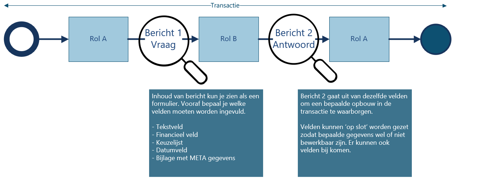
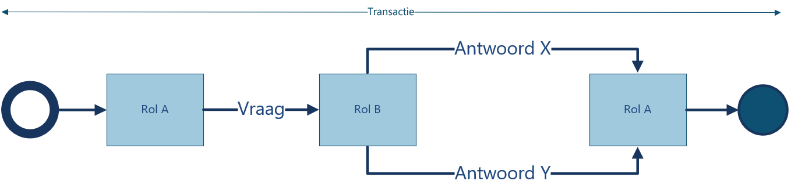

# Conceptueel

Test [issue 93](https://github.com/bimloket/visi/issues/93)

## Werking voor een gebruiker?

Voor een gebruiker van een VISI-applicatie voelt VISI als een berichtenbox of takenmanager, waarin men precies kan zien welke berichten men nog moet beantwoorden, welke antwoorden te verwachten en welke deadlines er afgesproken zijn.

### Uitvoering

***Berichten versturen en afspraken nakomen***  

**VISI helpt bij het nakomen van afspraken.** Men weet altijd welke acties men, of de ander, nog moet uitvoeren. Tijdens de uitvoering kan men, als men de juiste rol heeft, een berichtenstroom opstarten om een specifieke transactie uit te voeren. Men kan zien welke antwoorden men kan geven, en welke berichten men nog kan verwachten.   

**Men weet of een bericht aangekomen is.** Door de afspraken over het berichtenverkeer, weet een gebruiker zeker dat een bericht is aangekomen.  

**Overdracht van werk aan een nieuwe medewerker gaat naadloos.** Omdat een medewerker een rol heeft, kan tijdens een samenwerking een opvolger worden aangewezen. Vanaf dat moment neemt deze opvolger de berichtenstroom over. Van een VISI applicatie wordt verwacht dat de opvolger ook de berichten van de voorganger ter beschikking heeft.

**De communicatie is terug te vinden voor alle betrokkenen, zonder wederzijdse afhankelijkheid.** Indien meerdere organisaties samenwerken, kunnen zij elk gebruik maken van hun eigen VISI software. Door de afspraken over het berichtenverkeer hebben twee personen in een verschillende organisatie beiden in hun eigen VISI software de beschikking over het berichtenverkeer.   

**Met VISI zijn wijzigingen in de samenwerkafspraken altijd traceerbaar.** Tijdens het project kunnen de afspraken over de workflow, berichtinhoud, rollen en verantwoordelijkheden gewijzigd worden.  


### Voorbereiding

***Flexibiliteit van VISI in het maken van samenwerkafspraken***
  
  **Door van te voren afspraken te maken over taken en verantwoordelijkheden weet je van elkaar waar je aan toe bent.** Bij de voorbereiding van de samenwerking spreek je af wie welke rol heeft, en welke taken deze rol heeft.
  
  **Door van te voren afspraken te maken over de communicatie weet je van elkaar waar je aan toe bent.** Bij de voorbereiding van de samenwerking bepaal je welke rollen met elkaar communiceren over taken, en welke berichtenflow daar bij hoort. Door van te voren afspraken te maken over de informatie die je van elkaar verwacht weet je van elkaar waar je aan toe bent. Bij de voorbereiding van de samenwerking bepaal je voor elk bericht, welke inhoud dit heeft, inclusief bijlagen.
  
  **Je bent vrij om je samenwerking vorm te geven zoals je wilt.** VISI is zeer flexibel: Je bent vrij om je samenwerking vorm te geven zoals je wilt,  VISI standaardiseert de manier waarop je rollen, workflows en berichten digitaal vastlegt. Dit vraagt van applicaties, dat zij voorbereid  zijn om deze flexibele samenwerkafspraken per project of organisatie te kunnen inlezen. 


## Het VISI-raamwerk en onderdelen

***VISI-raamwerk***

Binnen VISI zijn communicatieafspraken vastgelegd in een structuur die het VISI-raamwerk wordt genoemd. De begrippen die in dit VISI-raamwerk veel worden gebruikt worden uitgelegd. Veel gebruikte begrippen zijn:  

- Rol 
- Transactie 
- Bericht 
- Gegevenselement 
- Bijlage

### Voorbeelden

**Bouwproject**
**Pizzeria**

## Alle bouwstenen van een raamwerk

### Transactie

Binnen VISI staat de zogenoemde transactie centraal. Een transactie is in de praktijk een serie van berichten tussen twee rollen met als uitkomst een bepaald resultaat. Denk hierbij bijvoorbeeld aan een verzoek van een rol aan een ander rol om iets te beoordelen, waarna het resultaat een positief of negatief oordeel is. Een ander voorbeeld is bijvoorbeeld het verzoek van een ober aan een kok om een bepaalde pizza te bereiden waarna de kok aan de gang gaat en de betreffende pizza aan de ober als gereed wordt gemeld waarna de transactie is afgerond.







### Bericht en bijlage

Berichten worden gebruikt om transacties af te handelen. Berichten kennen een logische volgorde en bestaan uit gegevenselementen. De structuur van een bericht staat op hoofdlijnen vast. Een bericht bestaat uit een ‘header’ en een ‘body’. De header bestaat uit vaste systematiek elementen uit de standaard. Bijvoorbeeld de afzender, en het tijdstip van verzenden. De body is vergelijkbaar met een template van elementen die in het berichtenverkeer gebruikt  kan worden. Deze berichttemplates kunnen projectspecifiek worden ingericht en/of aangepast.  Aan een bericht kunnen bijlagen worden toegevoegd.

**Elementen in een bericht**

Een body van een bericht is te vergelijken met een formulier met velden. Zoals: tekstvelden, data, bedragen, Ja/Nee, keuzelijsten, etc.) en/of tabellen.
Een startbericht en een eindbericht van een transactie gaan uit van dezelfde velden, eventueel onderweg aangevuld met meer velden. Hier vindt overerving plaats. Ingevulde gegevens worden in principe mee verstuurd in een volgend bericht, tenzij er een zogenoemde conditie is meegegeven in het raamwerk.


**Bijlagen en META-gegevens**

Aan VISI-berichten kunnen bijlagen worden gekoppeld. Dit komt sterk overeen met een ‘attachement’ van een e-mail. Een belangrijk verschil is echter dat een bijlage  van een VISI-bericht kan worden voorzien van META-gegevens. Deze elementen kunnen vooraf worden gedefinieerd. Denk hierbij bijvoorbeeld aan het versienummer, documentdatum, status, etc.. Hierbij kan bijvoorbeeld rekening worden gehouden met de META-gegevens die in een organisatiespecifieke documentmanagementsysteem noodzakelijk zijn.


**Bijlagen (één of meerdere bijlagen)**

nog uitschrijven


## Communiceren op basis van een raamwerk

***Project specifiek bericht***

Het projectspecifieke bericht plaatst het raamwerk in de context van een project. Hiermee wordt bedoeld dat in dit bestand wordt aangegeven welk specifiek project en/of contract het raamwerk representeert en welke personen in welke rol(len) kunnen deelnemen aan de communicatie in het kader van het specifieke project. Met dit bestand kan het gebruik van VISI dus worden opgestart en kunnen de gebruikers binnen de VISI communicatie worden beheerd. Daarnaast worden de volgende zaken geregeld met behulp van het projectspecifieke bericht:
-	Gebruikte soap protocol en het adres van de betrokken soap servers
-	Welke personen tot welke organisatie behoren
-	Opvolging van personen binnen een project
-	Welke personen uit naam van een andere persoon mogen communiceren

***Koppeling van personen aan rollen***

**Een rol door een persoon**

In VISI zijn verantwoordelijkheden en taken niet toegekend aan partijen of personen, maar aan “rollen”. Dit is gedaan omdat in bijvoorbeeld bouwprojecten weliswaar steeds dezelfde “rollen” voorkomen maar partijen nogal eens van rol kunnen wisselen. Denk hierbij bijvoorbeeld aan een situatie waarin een Opdrachtgever een bepaalde rol wil laten invullen door een ingenieursbureau of een situatie waarin een pizzeria de bezorging niet door eigen bezorgers laat doen, maar door externe partij als Deliveroo of Uber eats. Een persoon kan met behulp van het projectspecifieke bericht aan een rol worden gekoppeld.

**Meerdere rollen voor dezelfde persoon**

Omdat er niet een één op één relatie bestaat tussen de functie van een persoon en een rol in de VISI-standaard kan het dat een persoon één of meer rollen vervuld en hierdoor ook aan één of meerder rollen kan worden gekoppeld. Dit houdt in de praktijk bijvoorbeeld in dat een persoon zowel de rol van ober kan vervullen in een pizzeria, maar in dezelfde pizzeria ook de rol van kok omdat in zijn functieomschrijving staat dat hij ook moet kunnen bijspringen in de keuken met alle verantwoordelijkheden en taken die daarbij horen. In de bouwsector zou dit bijvoorbeeld betekenen dat een persoon de rol van toezichthouder kan vervullen maar ook de rol van adviseur met betrekking tot een bepaalde discipline.

**Meerdere personen met dezelfde rol**

Daarnaast kan het in de praktijk zo zijn dat meerdere personen dezelfde taken en verantwoordelijkheden hebben. Denk hierbij bijvoorbeeld dat een restaurant meerdere personen hebben rondlopen die de rol van ober vervullen of in een bouwproject meerdere personen de rol van adviseur vervullen. In het projectspecifieke bericht kunnen daarom ook meerdere personen aan een rol worden gekoppeld.


## Verdieping van het raamwerk
**Het raamwerk als bestand om in te lezen in de VISI compatible software**

Het VISI-raamwerk wordt op basis van de systematiek regels vastgelegd in een bestand dat kan worden ingelezen in VISI-compatible software. Dit dient in combinatie te gebeuren met het eerder besproken projectspecifieke bericht en een zogenoemd berichtenschema waarmee een extra controle kan worden uitgevoerd of de berichten die verzonden en ontvangen worden conform de regels van de systematiek en het gedefinieerde raamwerk zijn.

**Ondersteunen van een bedrijfsproces met gekoppelde transacties**

Bij een bedrijfsproces zijn vaak meer dan twee rollen betrokken. Het is daarom lastig om met een enkele transactie tussen twee rollen een heel bedrijfsproces te ondersteunen. De standaard biedt daarom de mogelijkheid om transacties met elkaar te verbinden. Dit houdt concreet in dat een rol uit een specifieke transactie met een specifiek bericht een andere transactie met een andere rol kan initiëren. Zo kan een bedrijfsproces ondersteund worden met behulp van een set van gekoppelde transacties.

```Denk hierbij bijvoorbeeld aan een klant van de pizzeria die met een ober een transactie aangaat om een heerlijke pizza te verkrijgen. De ober kan op basis van de transactie met de klant op zijn/haar beurt weer een transactie initiëren richting een kok om de pizza te maken.```
  
Een belangrijk basisprincipe is dat een transactie altijd iets oplevert. Als een rol vanuit de ene transactie één of meer transacties met een andere rol initieert dient er dus altijd iets terug te komen uit deze secundaire transacties. Een secundaire transactie dient altijd weer te eindigen in de transactie vanuit waar hij is geïnitieerd.

**Condities binnen een transactie**

Om bepaalde afhankelijkheden in een transactie af te kunnen dwingen kunnen bij het opstellen van een transactie op bepaalde momenten condities worden gesteld. Denk hierbij aan de volgende zaken:
-	Volgordelijkheid van berichten afdwingen. Hiermee wordt bedoeld dat berichten pas kunnen worden verstuurd nadat andere berichten zijn ontvangen of dat berichten alleen verstuurd mogen worden wanneer andere berichten nog niet zijn ontvangen of dat een bericht slechts één keer verzonden mag worden. <verwijzing naar MessageInTransactionTypeCondition op het functionele niveau>
-	Het is wel of niet toegestaan om meerdere secundaire transacties te initiëren <verwijzing naar secundary transactions allowed op het functionele niveau>
-	Het is wel of niet toegestaan om bepaalde elementen in een bericht op een bepaald moment in de transactie te bewerken  of bepaalde elementen worden gewist <Verwijzing naar elementcondition op het functionele niveau>


**Kan ik een raamwerk aanvullen of wijzigen tijdens een project**
  
Het is mogelijk om het raamwerk aan te passen tijdens het gebruiken van een VISI-raamwerk in een project of andere situatie. Hierbij dienen altijd wel een aantal zaken in het achterhoofd te worden gehouden, namelijk:
-	Lopende transacties worden afgerond  in de versie van het raamwerk waarin ze zijn opgestart. Dit houdt in dat een wijziging van een raamwerk geen effect heeft op lopende VISI communicatie.
-	Een nieuwe versie van het raamwerk dient bij alle projectpartners te worden ingelezen
-	Er kunnen rollen worden toegevoegd aan het raamwerk
Raamwerken worden in de praktijk aangepast als bijvoorbeeld bedrijfsprocessen of proceseisen veranderen of als bijvoorbeeld voorgedefinieerde elementen in berichten met domeinwaarden aangepast dienen te worden. Het raamwerk bevat ook keuzelijsten in de vorm van een drop-down menu. Deze lijsten mogen gedurende een project worden aangepast. Deze wijziging heeft geen invloed op reeds verstuurde berichten of reeds gestarte berichtenstromen. 


## Garanties voor de gebruiker

**VISI en ISO 29481-1 Building information models - Information delivery manual**

VISI geeft een invulling aan, en uitbreiding op, de internationale norm ISO 29481-1 Building information models - Information delivery manual. 

**Overdragen van projecten van het ene naar het andere systeem**

Als een gebruiker van VISI tijdens een project wil overstappen naar een andere leverancier, wordt verwacht dat deze de reeds verstuurde berichten kan inlezen, om de gebruiker het project te laten vervolgen vanuit een andere applicatie.

**Archivering**

Na afsluiting van het project worden de afspraken en de berichten samen gearchiveerd. Van een VISI-applicatie wordt verwacht dat het een project kan inlezen zodat een gebruiker het berichtenverkeer weer kan lezen kan aanbieden als offline projectarchief waarbij de berichten en bijlagen in de context van de workflow bewaard blijven.

**Stuurinformatie: Monitoring voortgang samenwerking**

Voor het hele project kun je zien wat de voortgang is van de samenwerking omdat je kunt checken of berichten verstuurd zijn conform de afspraken. Het leveren van monitoringsgegevens of stuurinformatie over projecten heen is geen onderdeel van de standaard, maar wordt door gebruikers wel verwacht van de VISI applicaties.


**Berichten zijn na verzending niet aanpasbaar**

**Certificering VISI compatible software**


Controlevragen: 
- Moeten rapportages t.b.v. stuurinformatie ook worden ondersteund door software of is dit software afhankelijk?
- Hoe weet je dat de inhoud van het bericht juist is?
- Hoe weet je dat je bericht is aangekomen?
- Hoe weet je dat de juiste persoon het bericht heeft ontvangen?
- Hoe weet je dat een gemachtigd persoon het bericht heeft geschreven?

