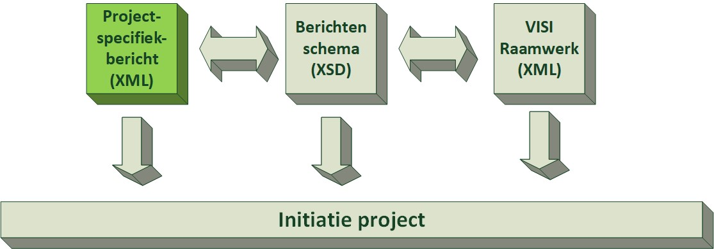
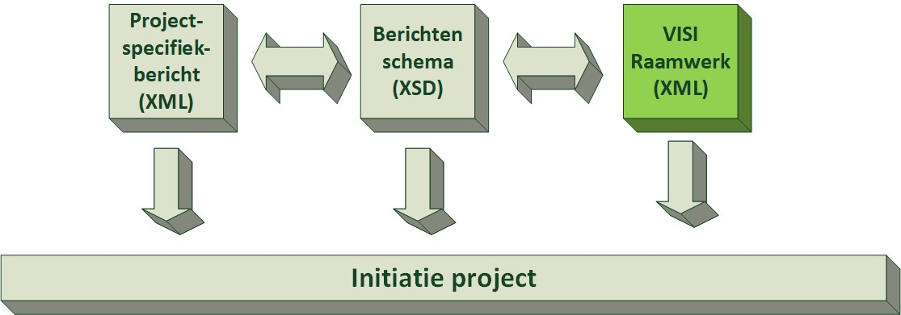

# Functioneel - 1. PROJECTINRICHTING

De functionele documentatie is bedoeld voor een software productmanager of een softwareontwikkelaar.

## Leeswijzer

De functionele uitleg is opgebouwd in hoofdstukken, en leest het beste hoofdstuk voor hoofdstuk. Met een hoofdstuk wordt een functioneel abstractieniveau inclusief bouwstenen uitgelegd. Aan het einde van een hoofdstuk wordt getoetst of de inhoud in voldoende mate begrepen wordt, en lezer verder kan naar het volgende hoofdstuk. In het volgende hoofdstuk wordt de functionele beschrijving aangevuld of verdiept qua bouwstenen. Hoofdstukken overslaan leidt tot het missen van bouwstenen en logische denkvolgorde.
De hoofdstukopbouw is afgestemd om het kennisniveau van de lezer. Het verloopt van beginner tot expert. 

Voor de nieuwkomer wordt in paragraaf 4.3 uitgelegd hoe er communicatie in een project plaatsvindt. 

Daarna staat in paragraaf 4.4 de verdiepingsslag dat deze communicatie verschillend is per project, en in een sjabloon vastgelegd wordt. Niet ieder project heeft namelijk dezelfde communicatiepatronen. 

Als aanvulling op de communicatiepatronen wordt in paragraaf 5.3 beschreven hoe bestanden als bijlage onderdeel van de communicatie zijn. 

Paragraaf 5.4 legt uit hoe om te gaan met het wijzigen van de project specifieke communicatiepatronen in een operationeel project. 

Wat er aan het einde van een project met de communicatie en informatie gebeurt staat in hoofdstuk 5. 

Het project specifiek maken van de communicatiepatronen heeft nog een verdiepingsslag, welke in hoofdstuk 6 beschreven staat. Als toegift staan in laatste hoofdstuk de overige (optionele) bouwstenen toegelicht.

 

## Project specifiek bestand

Voordat communicate conform de open standaard VISI kan plaatsvinden, moet een project ingericht worden met een project specifiek bestand (psb), een raamwerk en een hieruit gegenereerd berichtenschema.

</aside>

### Project

Een project staat centraal in de VISI-communicatie. De definitie van een project is in dit geval een, in de tijd en middelen begrensde, activiteit om iets te creëren. Wat er gecreëerd wordt is een service / product / resultaat. Een project wordt in samenwerking tussen verschillende mensen en organisaties uitgevoerd. De middelen kunnen zowel menselijke inspanningen als materialen zijn. Het onderscheidt zich door zijn eenmalige karakter van een programma of proces. Een project vereist een specifieke managementomgeving om activiteiten te coördineren en te sturen op kwaliteit, tijd en geld. Voor de coördinatie is communicatie nodig.

Van een project worden beperkte, verplichte eigenschappen vastgelegd. Ieder project heeft een unieke identificatie waarmee naar het project gerefereerd kan worden, zonder dat misverstanden kunnen ontstaan welk project bedoeld wordt. Daarnaast heeft een project een naam en een omschrijving. Deze naam en omschrijving behoeven niet uniek te zijn, en is een aanvulling op de unieke identificatie, en is bedoeld voor toelichting en zorgt voor eenvoudigere herkenning voor het project (door mensen). Aanvullend wordt van het project het moment van start en einde vastgelegd met start- en einddatum.

<b>Project</b> 
Unieke identificatie:    _badc9dab-807e-4319-bd56-60c57605e109 
Naam:                    Realisatie West- / Oostlijn 
Omschrijving:            Realisatie van metrolijn 47 inclusief 7 nieuwe stations met 9,7 kilometer spoor, waarvan 7,1 kilometer ondergronds 
Startdatum:              23-12-2020 14:59 
Einddatum:               20-05-2022 07:08

### Persoon

De communicatie binnen een project wordt uitgevoerd door personen. De mensen, die in een project participeren, worden personen genoemd. Ieder persoon in een project heeft een unieke identificatie waarmee naar de persoon in het project gerefereerd wordt, zonder dat misverstanden kunnen ontstaan welke persoon bedoeld wordt. Naast de identificatie heeft een persoon een naam en een gebruikersnaam. De naam is een aanvulling op de unieke identificatie, en is bedoeld voor eenvoudigere herkenning (door mensen). De gebruikersnaam is niet verplicht en kan een zelfgekozen (technische) invulling krijgen. Gebruikersnaam kan - bijvoorbeeld - gebruikt worden voor het linken naar een gebruiker in een (bestaand) software systeem.

 

<b>Persoon</b> 
Unieke identificatie:   _0c585186-fa97-4de7-8fe0-5c4bee3afead 
Naam:                   Urbain Servranckx 
Gebruikersnaam:         uservranckx

<b>Persoon</b> 
Unieke identificatie:   _974e4822-4944-45ad-ab2f-161370662e30 
Naam:                   Georges Remi 
Gebruikersnaam:         gremi

<b>Persoon</b>
Unieke identificatie:   _d4e02752-2ac6-4700-ae67-d33f428f78fb 
Naam:                   Luc Dupanloup 
Gebruikersnaam:         ldupanloup

N.B. Indien een persoon aan twee projecten werkt, kan de unieke identificatie van deze persoon per project verschillend zijn. Er is geen sprake van een globale unieke identificatie, maar een unieke identificatie binnen een project.

### Organisatie

Personen voeren een activiteit in een project uit namens een organisatie. In een zakelijke context werken de mensen aan een project voor een organisatie, daarom is vastlegging van organisaties belangrijk. Ook iedere organisatie in een project heeft een unieke identificatie. Naast de identificatie heeft een organisatie een naam en een afkorting. De naam is een aanvulling op de unieke identificatie, en is bedoeld voor eenvoudigere herkenning (door mensen). De afkorting heeft een functioneel en technisch doel. Deze eigenschap is een drie letterige afkorting van de organisatie, die binnen het project uniek is. 

Uit de afkorting is de organisatorische bron van communicatie ter herleiden, zie … (Verwijzing naar uitleg over eigenschap van TransactionTemplate). Voor een organisatie wordt een contactpersoon gedefinieerd middels een verwijzing naar de unieke identificatie van een persoon. Deze verwijzing heeft geen functionele betekenis, en betreft enkel een administratief doel.

<b>Organisatie</b> 
Unieke identificatie:  _87e9144d-04d6-4a5f-bdcb-b50e96c2b498 
Naam:                  Gemeente Rommelgem 
Afkorting:             GRG 
Contactpersoon:        <u>_0c585186-fa97-4de7-8fe0-5c4bee3afead</u> 

Per organisatie wordt ook het adres vastgelegd. Dit is geen fysiek of postadres, maar een digitaal adres. Dit digitale adres heeft een technisch doel, zie paragraaf https://bimloket.github.io/visi/visi1.6/#soap over SOAP protocol.

### Rol

De differentiatie in autorisatie, taken en verantwoordelijkheden in een project worden expliciet gemaakt middels het definiëren van verschillende rollen. Een rol staat voor samenhangende autorisatie, taken en verantwoordelijkheden voor het uitvoeren van activiteiten, die een persoon meestal tijdelijk op zich neemt, en die (afwisselend) door verschillende personen kunnen worden vervuld. Van een rol wordt een zeer beperkte aantal eigenschappen vastgelegd. Iedere rol heeft een unieke identificatie, aangevuld met een naam en omschrijving. Deze naam en omschrijving behoeven niet uniek te zijn, en zijn een aanvulling op de unieke identificatie bedoeld voor toelichting en betekenis geven aan de rol. De naam en omschrijving zorgen voor eenvoudigere herkenning van de rol (door mensen).

<b>Rol</b> 
Unieke identificatie:  _1252a67a-5f69-4a9c-b4ca-506a4459c7c3  
Naam:                  Beoordelende rol 
Omschrijving:          Deze rol geeft een onafhankelijke beoordeling op basis van competenties en deskundigheid binnen het kader van project. Bij de beoordeling doorloopt de rol een aantal vaste stappen. Rol inventariseert gegevens, weegt, motiveert en beoordeelt deze informatie en velt vervolgens het oordeel. 

Een rol is fundamenteel anders dan een functie. Verantwoordelijkheden en taken zijn **niet** toegekend aan functionarissen van een organisatie, maar aan rollen. Een essentieel verschil is dat rollen een afspiegeling zijn van _het werk_ dat georganiseerd wordt, terwijl functies een afspiegeling zijn van _mensen_ die georganiseerd worden (in een organisatie). Een project heeft geen functie "Afdelingshoofd", maar wel de rollen "Beoordelende", "Adviserende".

Er ligt lang niet altijd een één-op-één relatie tussen organisaties en rollen. Er zijn projecten waarin één partij meerdere rollen invult en er zijn ook projecten waarin verschillende organsiaties dezelfde rol hebben. Te denken valt aan een gemeente die zowel de initiatiefnemende rol als opdrachtgevende rol heeft. Of
een ingenieursbureau, die de adviserende rol vervult. Met in hetzelfde project een accountantskantoor, die ook de adviserende rol invult, maar dan op een ander  vakgebied.

Op basis van de rolverdeling tussen organisaties kunnen taken en verantwoordelijkheden worden verdeeld aan personen.

### Relatie tussen Persoon, Rol en Organisatie

Personen handelen in een project altijd vanuit een rol namens een organisatie. Een persoon is niet rechtstreeks gekoppeld aan de organisatie. De persoon heeft een relatie met een rol en een organisatie in het project. Deze relatie is te zien als een unieke sleutel die persoon, rol en organisatie verbindt. Deze sleutel noemen we "Persoon in Rol van Organisatie". Van deze sleutel worden zeer beperkte, verplichte eigenschappen vastgelegd. Voor de sleutel wordt persoon, rol en organisatie gedefinieerd middels een verwijzing naar de unieke identificatie van een persoon, een rol en een organisatie.
 

<b>Persoon in Rol van Organisatie</b> 
Unieke identificatie:  _e0ad4954-7986-417c-96d6-813efa36e86b 
Contactpersoon:        <u>_0c585186-fa97-4de7-8fe0-5c4bee3afead</u> 
Rol:                   <u>_1252a67a-5f69-4a9c-b4ca-506a4459c7c3</u> 
Organisatie:           <u>_87e9144d-04d6-4a5f-bdcb-b50e96c2b498</u>

Een persoon kan meerdere rollen hebben. Een rol kan door meerdere personen vervuld worden.

### Personele wisselingen

In bijna ieder project treden wijzigingen met betrekking tot de personele invulling. Dit kan zijn in de vorm van tijdelijke vervanging in verband met afwezigheid of vakanties. Of een permanente vervanging indien de projectmedewerkers bij een andere organisatie gaat werken of met pensioen gaat. 

#### Permanente vervanging

Permanente vervanging wordt ook wel opvolging genoemd. De opvolger is een geautoriseerd persoon, die de rol, taken en verantwoordelijkheid overneemt van de (initieel) geautoriseerde persoon. Voor de traceerbaarheid en transparantie kunnen er nooit geautoriseerde personen verwijderd worden. Vandaar dat de opvolging expliciet gemaakt wordt.

Permanente vervanging is altijd op rolniveau. Bij de genoemde sleutel van Persoon in Rol van Organisatie wordt deze permanente vervanger vastgelegd middels een verwijzing naar de unieke identificatie van een persoon, een rol en een organisatie.  De relatie is van geautoriseerde naar de opvolger. Hierbij dienen de rollen exact overeen te komen.

<b>Persoon in Rol van Organisatie</b> 
Unieke identificatie:   _e0ad4954-7986-417c-96d6-813efa36e86b 
Contactpersoon:         <u>_0c585186-fa97-4de7-8fe0-5c4bee3afead</u> 
Rol:                    <u>_1252a67a-5f69-4a9c-b4ca-506a4459c7c3</u> 
Organisatie:            <u>_87e9144d-04d6-4a5f-bdcb-b50e96c2b498</u> 
Opvolger:               <u>_51693b0e-84e5-4a9a-9fb6-ec4a7dea6edb</u> 
 
<b>Persoon in Rol van Organisatie</b> 
Unieke identificatie:   _51693b0e-84e5-4a9a-9fb6-ec4a7dea6edb 
Contactpersoon:         <u>_974e4822-4944-45ad-ab2f-161370662e30</u> 
Rol:                    <u>_1252a67a-5f69-4a9c-b4ca-506a4459c7c3</u> 
Organisatie:            <u>_2ba76318-83ab-4a6e-9257-ea91045717d2</u>

  
Heeft een persoon (in een rol van een organisatie) een opvolger, dan betekent dit dat de persoon niet langer geautoriseerd is om te handelen vanuit deze rol. Alleen de opvolger is geautoriseerd.
Een persoon (in een rol van een organisatie) kan maximaal één (1) opvolger hebben.

#### Tijdelijke vervanging 
 
Een tijdelijke vervanging kan ook gelezen worden als een (tijdelijke) machtiging. De tijdelijke vervanging is een autorisatie voor een derde persoon, zodat deze persoon mag handelen uit naam van de geautoriseerde persoon. Dit kan een tijdelijk karakter hebben, of een machtiging zijn gedurende de looptijd van het project.

De tijdelijke vervanging is altijd op rolniveau. Bij de genoemde sleutel van Persoon in Rol van Organisatie wordt deze tijdelijke machtiging vastgelegd middels een verwijzing naar de unieke identificatie van de geautoriseerde persoon, rol en organisatie. De relatie is van gemachtigde naar de geautoriseerde. Hierbij dienen de rollen exact overeen te komen.

<b>Persoon in Rol van Organisatie</b> 
Unieke identificatie:  _752b1dfd-dd91-4404-9708-39b91047ca66 
Contactpersoon:        <u>_d4e02752-2ac6-4700-ae67-d33f428f78fb</u> 
Rol:                   <u>_1252a67a-5f69-4a9c-b4ca-506a4459c7c3</u> 
Organisatie:           <u>_87e9144d-04d6-4a5f-bdcb-b50e96c2b498</u> 
Vervangt:              <u>_51693b0e-84e5-4a9a-9fb6-ec4a7dea6edb</u> 

Voert een gemachtigd persoon (in een rol van een organisatie) een handeling uit, dan is dit altijd uit naam van de geautoriseerde persoon. Bij een handeling wordt de geautoriseerde vastgelegd en de gemachtigde. De geautoriseerde / gemachtigde kan antwoorden op transacties van de rol van de geautoriseerde, ongeacht wie de transactie gestart heeft. Indien een machtiging ongedaan gemaakt wordt, kan alleen de geautoriseerde de handeling afmaken. Een machtiging mag namelijk wel ongedaan gemaakt worden, omdat machtigingen een tijdelijk karakter kunnen hebben.

Als een gemachtigde iets verstuurt moet traceerbaar zijn dat de gemachtigde  iets verstuurd heeft, en namens wie dit verstuurd is.

Een persoon kan gemachtigd zijn om namens meerdere geautoriseerde personen (in rol van organisatie) te handelen. Meerdere personen kunnen gemachtigd zijn om namens één geautoriseerde persoon (in rol van organisatie) te handelen.

### Project Setup

Project, personen, organisaties, rollen en vervangingen dienen bij alle projectdeelnemers bekend en gelijk te zijn. Daarom wordt deze setup van een project vastgelegd in een uitwisselbaarformaat: project specifiek bestand. Dit bestand wordt verspreid onder de deelnemende organisaties. Dit is meestal per organisatie vanwege het eerdergenoemde digitale adres van een organisatie. Dit digitale adres weet hierdoor van het bestaan van een project. In het gebruikte voorbeeld "Realisatie West- / Oostlijn" met unieke identificatie _ _badc9dab-807e-4319-bd56-60c57605e109_ is bekend bij alle organisaties van het project.
De projectcommunicatie middels het versturen en beantwoorden van berichten kan starten, zie paragraaf https://bimloket.github.io/visi/visi1.6/#versturen-van-een-bericht

 

## Raamwerk / Communicatiesjabloon van een project

Het raamwerk is het communicatiesjabloon van een project. Alle communicatie moet verlopen conform dit sjabloon. In het sjabloon staat gedefinieerd welke type informatie overgedragen kan worden tussen personen. In het sjabloon is vastgelegd welke type informatie overgedragen kan worden (wat), tussen welke type rollen (wie), en wanneer (hoe). 

Het sjabloon dient tevens ter validatie van de communicatie. Zoals de naam aangeeft is het een sjabloon waaraan de communicatie moet voldoen. Op basis van dit sjabloon kan geverifieerd worden of de verstrekte informatie voldoet aan de afspraken.

</aside>

### Type rol (RoleType)
Verantwoordelijkheden en taken zijn niet toegekend aan functies / functionarissen binnen organisaties, maar aan type rollen. Definitie van een type rol is met een unieke identificatie en een tekstuele beschrijving. Daarom heeft een type rol de eigenschappen unieke identificatie (id) en omschrijving (description).

	<dl> 
		<dt>[=id=]*
			<dd> Unieke identificatie
		<dt>[=description=]*
			<dd> Omschrijving
			<!-- definition: list -->
		<dt>[=startDate=]
			<!-- definition: term -->
			<!-- dd definition: definition -->
		<dt>[=endDate=]
			<!-- verwijst naar een term die met <dfn> is gedefinieerd. -->
		<dt>[=state=]
		<dt>[=dateLaMu=]
		<dt>[=userLaMu=]
		<dt>[=language=]
		<dt>[=category=]
		<dt>[=helpInfo=]
			<dd> Voor helpinfo roltypes is nog geen (software)toepassing bekend.
		<dt>[=code=]
		<dt>[=responsibilityScope=]
			<dd>Scope/kader waarbinnen de verantwoordelijkheden behorende bij de betreffende rol zijn gedefinieerd
		<dt>[=responsibilityTask=]
		<dt>[=responsibilitySupportTask=]
		<dt>[=responsibilityFeedback=]
	</dl>

<b>Rol</b> 
unieke identificatie:	RT_Beoordelende_rol 
omschrijving:		Beoordelende rol
[startDate](#startdate)

	
<dl class="def" title="Beschrijving van de specifieke eigenschappen">
	
	
#### <dfn>`responsibilityScope`</dfn>
Scope/kader waarbinnen de verantwoordelijkheden behorende bij de betreffende rol zijn gedefinieerd	
#### <dfn>`responsibilityTask`</dfn>
Taken die voortkomen uit de verantwoordelijkheden van de betreffende rol		
#### <dfn>`responsibilitySupportTask`</dfn>
Taken die worden uitgevoerd om andere rollen te ondersteunen. Denk hierbij bijvoorbeeld aan gedelegeerde verantwoordelijkheden				
#### <dfn>`responsibilityFeedback`</dfn>
Terugkoppeling die vanuit de verantwoordelijkheid van de rol wordt verwacht richting andere rollen
</dl>
	
### Informatie-overdracht conform type transactie (TransactionType)

Communicatie vindt in een project altijd plaats op basis van een type transactie. Een type transactie is een afsprakenstelsel van elkaar mogelijk opvolgende berichten tussen twee rollen. Een transactie in een project verloopt dus volgens de regels van het type transactie uit het raamwerk. Daarbij wordt er gesproken over de initierende rol (initiator) en de uitvoerende rol (executor). Een persoon met de initierende rol mag een transactie starten en het eerste bericht van deze transactie sturen naar een (1) persoon met de uitvoerende rol. Daarna is het steeds de ontvanger (executor of initiator) van het laatste bericht die moet reageren met een bericht. Net zo lang totdat er geen antwoordmogelijkheden meer zijn. Dan is de transactie afgerond. Welke mogelijke start- en antwoordberichten er zijn, staat gedefinieerd als volgorde van type berichten van een transactie (zie paragraaf https://bimloket.github.io/visi/visi1.6/#berichtencommunicatie).

Van een type transactie wordt een aantal eigenschappen vastgelegd. Niet alle eigenschappen zijn even belangrijk, daarom volgt een opdeling of eigenschappen verplicht of optioneel zijn. Een optionele eigenschap kan belangrijk zijn, ondanks dat de eigenschap niet verplicht is. Een voorbeeld hiervan is de eigenschap helptekst (helpInfo). helpInfo is beschikbaar om de nadere, uitgebreide uitleg te geven over het doel en gebruik van het type transactie. Ook kan er beschreven worden waarom bepaalde rollen met elkaar communiceren.

	
<dl> 
		<dt>[=id=]*
			<dd> Unieke identificatie
		<dt>[=description=]*
			<dd> Omschrijving
		<dt>[=initiator=]*
			<dd>initiërende rol
		<dt>[=executor=]*
			<dd>uitvoerende rol
		<dt>[=startDate=]
		<dt>[=endDate=]
		<dt>[=state=]
		<dt>[=dateLaMu=]
		<dt>[=userLaMu=]
		<dt>[=language=]
		<dt>[=category=]
		<dt>[=helpInfo=]
			<dd> Voor helpinfo van een type transactie is geen (software)toepassing bekend.
		<dt>[=code=]
		<dt>[=result=]
			<dd>Resultaat
		<dt>[=subTransactions=]
			<dd>Overbodige eigenschap
		<dt>[=appendixTypes1=]
			<dd>Type bijlage
	</dl>

<dl class="def" title="Beschrijving van de specifieke eigenschappen">

#### <dfn>`initiator`</dfn>
Dit is een verwijzing naar een type rol. Deze eigenschap legt vast welke type rol een persoon moet hebben om een transactie van dit type te starten. Met starten wordt in dit kader hetzelfde bedoelt als initieren. 

#### <dfn>`executor`</dfn>
Dit is ook een verwijzing naar een type rol. Deze eigenschap legt echter vast welke type rol een persoon moet hebben om een eerste bericht in dit type transactie te mogen ontvangen. Feitelijk is dit de type rol die het resultaat van de transactie gaat realiseren / uitvoeren. 

#### <dfn>`result`</dfn>
Deze eigenschap is optioneel, en geldt alleen voor type transactie. Voorbeelden in eerdere documentatie geven aan dat het resultaat van een type transactie hierin beschreven kan worden.

#### <dfn>`subTransactions`</dfn>
De eigenschap subTransactions is redundant. Met deze eigenschap wordt - voor een type transactie - gedefinieerd welke type transacties "binnen deze transactie vallen". De samenhang tussen type transacties wordt echter al gedefinieerd met opgave van de voorgaande type berichten (in de transactie), zie paragraaf https://bimloket.github.io/visi/visi1.6/#transacties-koppelen-tot-een-procedure-m-a-w-hoofd-sub-transacties
	
#### <dfn>`appendixTypes1`</dfn>
Met deze optionele eigenschap kan een beperking worden opgelegd aan welke typen bijlage bijgevoegd mogen worden aan de type berichten van dit type transactie. Deze eigenschap is een verwijzing naar een of meerder typen bijlage. Indien deze eigenschap ontbreekt voor een type transactie, mag ieder type bijlage bijgevoegd worden.

P.S. Legacy
</dl>

<b>Type transactie</b> 
unieke identificatie:	TT_Contractwijziging_door_opdrachtgever 
omschrijving:		Contractwijziging (door de opdrachtgever) 
helptekst:		Met dit transactie type kan opdrachtgever een contractwijziging aan de opdrachtnemer melden, met als tussendoelen het verkrijgen van een technisch voorstel van opdrachtnemer, een technisch akkoord van opdrachtgever, een offerte van opdrachtnemer, een acceptatie van die offerte door opdrachtgever en uiteindelijk de acceptatie van een of meerdere gereedmeldingen van het uitgevoerde werk middels de levering van prestatieverklaringen. 
initierende rol:	<u>Opdrachtgevende_contractueel</u> 
uitvoerende rol:	<u>Opdrachtnemende_contractueel</u> 

### Type bericht (MessageType)

Met type bericht wordt gedefinieerd welke informatie uitgewisseld kan worden. Het type wordt vastgelegd met een unieke identificatie (id) en een tekstuele omschrijving (description). P.S. Deze omschrijving geeft impliciet de status van een type transactie aan.

	<dl> 
		<dt>[=id=]*
			<dd> Unieke identificatie
		<dt>[=description=]*
			<dd> Omschrijving
		<dt>[=complexElements=]*
			<dd> Berichthoofdstukken
		<dt>[=startDate=]
		<dt>[=endDate=]
		<dt>[=state=]
		<dt>[=dateLaMu=]
		<dt>[=userLaMu=]
		<dt>[=language=]
		<dt>[=category=]
		<dt>[=helpInfo=]
		<dt>[=code=]
		<dt>[=appendixMandatory=]
			<dd>Bijlage verplicht
		<dt>[=appendixTypes2=]
			<dd>Type bijlage
	</dl>

<dl class="def" title="Beschrijving van de specifieke eigenschappen">

#### <dfn>`complexElements`</dfn>
Hiermee wordt de inhoud van een type bericht vastgelegd, want in die berichthoofdstukken zitten de informatievelden. De volgorde waarmee de hoofdstukken in het berichttype staan, bepaalt in welke volgorde de VISI software deze hoofdstukken aanbiedt in de berichten. Technisch is met de huidige controlemechanismes helaas mogelijk om een bericht te versturen waarin een of meerdere berichthoofdstukken ontbreken, maar dit is niet de bedoeling. Er lopen onderzoeken naar een betere beveiliging hiervoor.

#### <dfn>`appendixMandatory`</dfn>
Met deze eigenschap kan ingesteld worden dat het verplicht is om minimaal één bijlage toe te voegen aan een bericht van dit type. Hiermee kan voorkomen worden dat een type bericht met de omschrijving "Document ter acceptatie" zonder bijlage verzonden wordt.

#### <dfn>`appendixTypes2`</dfn>
Omdat het binnen een raamwerk mogelijk is om verschillende metadata-formulieren te specificeren voor een bij te voegen bijlage, kan ook per bericht type ingesteld worden welk(e) metadata formulier(en) gekozen kan/kunnen worden voor een bijlage bij een bericht. Als er geen bijlage types gekoppeld zijn, kan ieder bijlage type uit het raamwerk gekozen worden door de gebruiker.
</dl>

<b>Type bericht</b> 
unieke identificatie:	MT_Acceptatie_technisch_voorstel_contractwijziging 
omschrijving:		Acceptatie van het technisch voorstel (voor contractwijziging) 
helptekst:		Met dit bericht accepteert de opdrachtgever het technisch voorstel, waarna de opdrachtnemer verder kan met een fnancieel voorstel / offerte voor de contractwijziging. 
elementen:		<u>CE_Contractwijziging_Basis</u>, <u>CE_Contractwijziging_Voorstel</u>, <u>CE_Contractwijziging_Opmerkingen</u> 

### Berichtvelden (SimpleElementType)
Binnen de bericht worden berichtvelden gedefinieerd. Aan een berichtveld wordt een [veldeigenschap (UDT)(https://bimloket.github.io/visi/visi1.6/#datatype-van-een-element-userdefinedtype) toegekend.

	<dl> 
		<dt>[=id=]*
			<dd> Unieke identificatie
		<dt>[=description=]*
			<dd> Omschrijving
		<dt>[=state=]
		<dt>[=dateLaMu=]
		<dt>[=userLaMu=]
		<dt>[=language=]
		<dt>[=category=]
		<dt>[=helpInfo=]
			<dd> Specifiek voor berichtvelden wordt de helptekst veelvuldig gebruikt om de opsteller van een bericht uit te leggen wat er exact verwacht wordt bij het invullen van dat veld. Dit zowel op abstract niveau, zoals: “Vul hier de lengte van het element in, zonder rekening te houden met uitstekende delen zoals wapening en dergelijke” Maar ook specifiek in de vorm van een uitleg welke getal notatie op gecontroleerd wordt: “Noteer de lengte met een komma en twee decimalen”. Ook bij het lezen van een bericht helpt de helptekst om de inhoud van een veld beter te kunnen duiden.
		<dt>[=interfaceType=]
		<dt>[=valueList=]
	</dl>

<!-- Specifiek voor berichtvelden wordt de helptekst veelvuldig gebruikt om de opsteller van een bericht uit te leggen wat er exact verwacht wordt bij het invullen van dat veld. Dit zowel op abstract niveau, zoals: “Vul hier de lengte van het element in, zonder rekening te houden met uitstekende delen zoals wapening en dergelijke” Maar ook specifiek in de vorm van een uitleg welke getal notatie op gecontroleerd wordt: “Noteer de lengte met een komma en twee decimalen”.

Ook bij het lezen van een bericht helpt de helptekst om de inhoud van een veld beter te kunnen duiden. -->
	
<dl class="def" title="Beschrijving van de specifieke eigenschappen">

#### <dfn>`interfaceType`</dfn>
Dit veld is bij de allereerste opzet van de systematiek bedacht, maar heeft nooit een echte toepassing of duidelijke uitleg gekend. In de vorige documentatie stond het volgende: 
“Type interface c.q. view op dit SimpleElementType voor dit specifieke bericht. Bijvoorbeeld als hetgegevenselement bedoeld is als invoer (inputText)of slechts een vaste inhoud bevat en niet aangepast mag worden (label). Op het moment wordt hier in de praktijk geen functionaliteit aan verbonden."

#### <dfn>`valueList`</dfn>	
Is niet in gebruik. Dit is de uitleg uit de vorige documentatie:
“Puntkomma geseparate lijst van waarden die een instance op berichtniveau uiteindelijk aan mag nemen. Oorspronkelijk was dit element bedoeld als enumeration. In de huidige praktijk wordt dit opgelost met het element type UserDefinedType en het element xsdRestriction. In de xsdRestriction worden de enumeration values aangegeven. Aan het element valueList wordt in de huidige praktijk geen betekenis toegekend.”

<!--
 <Verwijzingen vanuit het Berichtveld type: 
Veld eigenschappen
-->
Verwijzingen naar het Berichtveld type: 
[Berichtveld beperkingen](https://bimloket.github.io/visi/visi1.6/#voorwaarden-voor-elementen-van-type-berichten-elementcondition)  
</dl>

<b>Simple element type</b> 
id: 		SE_DatumUitvoering 
description:	 Gepland moment start uitvoering 
helpinfo:	Kies hier de beoogde startdatum waarop de hier benoemde werkzaakheden beginnen. 
User defined type: UDT_Datumveld 

	

Een persoon kan meerdere rollen hebben. Een rol kan door meerdere personen vervuld worden. Gereserveerd veld-ID: het veld met ID “SOAPServerURL” is exclusief gereserveerd voor het berichthoofdstuk dat aan het organisatie type gekoppeld is. Dit zodat hiermee voor VISI software altijd het SOAP-adres van een organisatie gevonden kan worden.
	
### Datatype van een element (UserDefinedType)
Hiermee wordt het gedrag van het invoerveld bepaald en hoe het gevalideerd moet worden. 
Aan een [berichtveld](https://bimloket.github.io/visi/visi1.6/#berichtvelden-simpleelementtype) wordt een veldeigenschap (UDT) toegekend.
Zo kan een veld een datum/tijdstip/valuta/verplichte tekst/optionele tekst/een exact aantal karakters enzovoorts als vereiste mee krijgen. VISI software biedt doorgaans invoerfunctionaliteit op maat voor de meest voorkomende invoersoorten, zoals een datum keuze venster bij een datumveld en een keuzelijst functie als er een keuze uit lijst met waardes vereist wordt.

	<dl> 
		<dt>[=id=]*
			<dd> Unieke identificatie
		<dt>[=description=]*
			<dd> Omschrijving
		<dt>[=state=]
		<dt>[=dateLaMu=]
		<dt>[=userLaMu=]
		<dt>[=language=]
		<dt>[=category=]
		<dt>[=helpInfo=]
			<dd> Voor veldeigenschappen is nog geen toepassing bekend voor de helpinfo. Het is denkbaar dat deze naast de helpinfo weergegeven zou kunnen worden, om de invul instructie hier te beheren in plaats van in de helpinfo van meerdere veldtypes die deze eigenschap hebben.
		<dt>[=code=]
		<dt>[=baseType=]
		<dt>[=XsdRestriction=]
	</dl>

<dl class="def" title="Beschrijving van de specifieke eigenschappen">
	
#### <dfn>`baseType`</dfn>
Per Veldeigenschap moet uit een aantal basis XML veldsoorten gekozen worden om het basis gedrag van een veld vast te stellen. De keuze is beperkt tot de volgende basis XML veldsoorten:
<ul>
	<li>BOOLEAN</li>
	<li>DATE</li> 
	<li>DATETIME</li>
	<li>TIME</li>
	<li>DECIMAL</li>
	<li>INTEGER</li>
	<li>STRING</li>
</ul>
	
#### <dfn>`XsdRestriction`</dfn>
Hiermee kan zeer exact gedrag aan een veld van een bepaald basetype gedefinieerd worden. Voor het basetype STRING kan een reguliere expressie gedefinieerd worden.

Enkele voorbeelden die nu veel gebruikt worden voor basetype STRING zijn:
<ul>
	<li>1 keuze mogelijkheid, dus veld heeft altijd deze waarde:</li>
</ul>
	
`
	<xs:enumeration value="Automatisch gevuld"/>
`
<ul>
	<li>Keuzelijst met meerdere waardes</li>
</ul>
	
`
	<xs:enumeration value="k1"/>
`
`
	<xs:enumeration value="k2"/>
`
`
	<xs:enumeration value="k3"/>
`
	
<ul>
<li>Optionele keuzelijst:</li>
</ul>

`
	<xs:enumeration value=""/>
`
`
	<xs:enumeration value="Keuze 1"/>
`
`
	<xs:enumeration value="Keuze 2"/>
`
<ul>
	<li>Verplichte tekst van minimaal 1 karakter</li>
</ul>

`
	<xs:minLength value="1"/>
`
<ul>
	<li>Optionele tekst</li>
</ul>
geen xsd restrictie
<ul>
<li>Bijvoorbeeld een jaarnummer</li>
</ul>

`
	<xs:pattern value="(20\d\d)"/>
`
	
Een voorbeeld dat veel gebruikt wordt voor basetype DECIMAL zijn:
<ul>
	<li>Bedrag met twee decimalen</li>
</ul>

`
	<xs:fractionDigits value="2"/>
`
`
	<xs:fractionDigits value="2"/>
`
</dl>
	

Op deze manier krijgt een veld de eigenschappen gekoppeld 
<b>User defined type</b> 
id:		UDT_Datumveld 
description:	Datumveld 
basetype:	DATE 

id:		UDT_VerplichteTekst 
description:	Verplichte tekst veld 
basetype:	STRING 
xsdRestriction:	xs:minLength value="1" 

	
### Tabel als element van een type bericht
	
Een speciaal element is een tabel.

### Groepering van elementen (ComplexElementType)

De berichthoofdstukken worden gebruikt om invoer velden in berichten eenvoudig te kunnen beheren in een raamwerk en om logische onderverdelingen in berichten te kunnen aanbrengen. Doordat in berichten alleen de verschillende hoofdstukken benoemd zijn, kan eenvoudig een bepaald veld toegevoegd worden aan-, of verwijderd worden uit- een hele groep berichten die dat hoofdstuk bevatten.
De volgorde waarmee de berichtvelden in het hoofdstuk staan, bepaalt in welke volgorde de VISI software deze hoofdstukken aanbiedt in de hoofdstukken en daarmee ook in de berichten.
	

	<dl> 
		<dt>[=id=]*
			<dd> Unieke identificatie
		<dt>[=description=]*
			<dd> Omschrijving
		<dt>[=startDate=]
		<dt>[=endDate=]
		<dt>[=state=]
		<dt>[=dateLaMu=]
		<dt>[=userLaMu=]
		<dt>[=language=]
		<dt>[=category=]
		<dt>[=helpInfo=]
			<dd> Voor helpinfo type complex element is geen (software)toepassing bekend.
		<dt>[=minOccurs=]
			<dd>
		<dt>[=maxOccurs=]
			<dd>
	</dl>

Specifiek voor bericht hoofdstukken is er in de beschikbare software vaak nog geen ondersteuning. Toch neigt de markt ernaar dit wel te gaan eisen. Dit zodat bijvoorbeeld duidelijk uitgelegd kan worden welk doel dit deel van het bericht dient en welke weg deze informatie bijvoorbeeld vervolgt of waar deze informatie bijvoorbeeld niet heen gaat. (denk aan informatie die binnen een bepaald domein moet blijven)

<dl class="def" title="Beschrijving van de specifieke eigenschappen">
	
#### <dfn>`minOccurs`</dfn>
Hieronder wordt uitgelegd dat er een hoofdstuk in een hoofdstuk kan worden ingevoegd om een tabel te creëren. Door deze setting bijvoorbeeld met 1 of 3 in te vullen op het ingevoegde hoofdstuk(de tabel), moet een gebruiker minimaal 1 of 3 regels in deze tabel aanmaken.
	
#### <dfn>`maxOccurs`</dfn>
Zoals bij MinOccurs, is het op dezelfde manier ook mogelijk om aan te geven dat een tabel niet meer dan x regels mag bevatten. Door Min en Max op hetzelfde aantal te zetten, is ook een exact aantal aan te maken regels instelbaar.		

</dl>
	

[Berichthoofdstukken (Tabelvorming)](https://bimloket.github.io/visi/visi1.6/#groepering-van-elementen-complexelementtype) 
Het is toegestaan om in een hoofdstuk naast berichtvelden, ook een ander hoofdstuk te benoemen. De afgesproken werking hiervan is dat het hoofdstuk in het “bovenliggende” hoofdstuk weergegeven wordt als [tabel](https://bimloket.github.io/visi/visi1.6/#tabel-als-element-van-een-type-bericht). De bericht velden in het ingevoegde hoofdstuk worden dan als kolommen aangeboden. 
Op deze manier kan een hoofdstuk bestaan uit een of meerdere tabellen, eventueel ook aangevuld met normale berichtvelden. 
NB1: Op dit moment is technisch nog niet aan te geven op welke locatie de tabellen in een hoofdstuk getoond moeten worden. Hierdoor komen ze op dit moment soms boven en soms onder de normale velden en is het niet mogelijk om een hoofdstuk te maken waarin velden en tabellen elkaar afwisselen. In issue 37 wordt aan dit probleem gewerkt. 
NB2: Technisch is het mogelijk om een hoofdstuk in een hoofdstuk in een hoofdstuk enz. te maken, wat bijvoorbeeld een 3d-tabel op zou kunnen leveren. Over dergelijke toepassingen zijn nog geen afspraken in de systematiek en het wordt ook nog nergens toegepast. Dit wordt wel als ruimte voor nog niet bekende evt toekomstige toepassingen beschouwd. 

[Berichtvelden](https://bimloket.github.io/visi/visi1.6/#berichtvelden-simpleelementtype) 
Door berichtvelden in een bepaalde volgorde in een hoofdstuk te plaatsen, ontstaat de structuur van dat hoofdstuk, zoals het in alle berichten waarin  dit hoofdstuk staat wordt weergegeven.  
	
[ProjectType](https://bimloket.github.io/visi/visi1.6/#type-project-projecttype) 
Voor zover bekend is het technisch mogelijk om een hoofdstuk aan een projecttype te koppelen, maar is er nog geen toepassing voor bekend.
	
[PersonType](https://bimloket.github.io/visi/visi1.6/#type-persoon-persontype)
Hiermee kan er in het projectspecifieke bericht aanvullende informatie bij personen ingevuld worden, zoals bijvoorbeeld een telefoonnummer of andere voor het project relevante persoonsinformatie.
	
[OrganisationType](https://bimloket.github.io/visi/visi1.6/#type-organisatie-organisationtype)
Hiermee kan er in het projectspecifieke bericht aanvullende informatie bij organisaties ingevuld worden, zoals bijvoorbeeld een adres of andere voor het project relevante informatie.

[AppendixType](https://bimloket.github.io/visi/visi1.6/#type-bijlage-appendixtype)
Op deze manier kan er per bijlage type een andere set aan berichtvelden met metadata over de bijlage ingevoerd worden.
	
[MessageType](https://bimloket.github.io/visi/visi1.6/#type-bericht-messagetype) 
Voor de opbouw van berichten 

Met [Berichtveld beperkingen](https://bimloket.github.io/visi/visi1.6/#voorwaarden-voor-elementen-van-type-berichten-elementcondition) kan over een veld worden gezegd dat deze niet aanpasbaar mag zijn of juist wel aanpasbaar moet zijn.

	
<b>Complex element type</b> 
id: 		CeContractwijzigingVoorstel 
description:	Technisch voorstel

Simple elements:
<ul>
<li>SE_Wijzigingsnummer</li>
<li>SE_BeschrijvingTechnisch</li>
<li>SE_DatumUitvoering</li>
<li>SE_KostenramingEUR</li>
</ul>
	
CE_Tabel_Werkpakketten
<b>Complex element type in Complex element type (tabel)</b> 
id: 		CE_Tabel_Werkpakketten 
description:	Werkpakketten 
	
Simple elements: 
<ul>
<li>SE_Werkpakket</li>
</li>SE_WPkostenpercentage</li>
</ul>

### Volgorde van type berichten (MessageInTransactionType)
De vormgeving van de opvolging van berichten zodat een stroomschema gevolgd kan worden wordt geregeld in het bericht in transacties type (vanaf hier aangeduid als “MITT”). 
De MITT’s koppelen berichttypes aan elkaar binnen- en tussen transacties. 
Als een bericht type op meerdere plekken in een transactie voorkomt, bijvoorbeeld 1 keer als start bericht en 1 keer als reactie, dan bestaan er 2 MITT’s. Beiden verwijzen naar de transactie en het bericht type, alleen verschilt de koppeling tussen de MITT’s.

	<dl> 
		<dt>[=id=]*
			<dd> Unieke identificatie
		<dt>[=state=]
		<dt>[=dateLaMu=]
		<dt>[=userLaMu=]
		<dt>[=requiredNotify=]
			<dd>
		<dt>[=received=]
			<dd>
		<dt>[=send=]
			<dd>
		<dt>[=initiatorToExecutor=]
			<dd>
		<dt>[=openSecondaryTransactionsAllowed=]
			<dd>		
		<dt>[=firstMessage=]
			<dd>
	</dl>

<dl class="def" title="Beschrijving van de specifieke eigenschappen">
	
#### <dfn>`requiredNotify`</dfn>
Op het moment wordt aan het element requiredNotify geen betekenis toegekend.
	
#### <dfn>`received`</dfn>
Boolean waarde die aangeeft of het vorige bericht ontvangen zou moeten zijn. In de praktijk wordt dit element niet gebruikt.
	
#### <dfn>`send`</dfn>
Boolean waarde die aangeeft of het huidige bericht inmiddels verstuurd zou moeten zijn. In de praktijk wordt dit element niet gebruikt.
	
#### <dfn>`initiatorToExecutor`</dfn>
Boolean waarde die aangeeft welke richting het bericht in de transactie heeft. Bij True gaat het bericht vanaf de persoon die de transactie gestart heeft naar degene die ontvanger was van het eerste bericht van de transactie.
OPTIONAL??? Zie exp_2
	
#### <dfn>`openSecondaryTransactionsAllowed`</dfn>
Optional Boolean waarde die de mogelijkheid aangeeft of secundaire transacties nog niet afgerond hoeven te zijn voordat met de primaire transactie kan worden verder gegaan. De interpretatie voor "TRUE" is dat niet alle instanties van secundaire transacties hoeven te zijn afgerond voordat met de primaire transactie kan worden verder gegaan. Als de waarde "FALSE" is dienen alle instanties van secundaire transacties te worden afgerond voordat de primaire transactie hervat kan worden. Indien openSecondaryTransactionsAllowed niet is gedefinieerd wordt dit geïnterpreteerd als "TRUE".
<b>TODO: terugkeerantwoorden schijnen wel door te mogen..Opzoeken ARNE met Jos!!</b>
	
#### <dfn>`firstMessage`</dfn>
Optional Boolean waarde die bedoeld is om onbetwistbaar vast te kunnen stellen dat een bericht alleen gebruikt kan worden als eerste bericht van een subtransactie. Gebruik van een MITT met deze instelling resulteert dus altijd in een nieuwe subtransactie.

</dl>

Verwijzingen vanuit het Bericht in transactie type: 
[Berichten](https://bimloket.github.io/visi/visi1.6/#type-bericht-messagetype) 
Hiermee wordt de berichtnaam en inhoud van het element in de berichtenstroom bepaald. 
Voorgaand(previous) bericht 
Op deze manier ligt vast hoe de stroom van berichten verloopt. Doordat MITT’s  de voorgaande MITT’s hier hebben staan, weet je vanuit welk bericht dit bericht gekozen kan worden als volgend bericht. Er zijn grofweg 4 soorten previous-koppelingen die er qua definitie precies hetzelfde uitzien(deze MITT is een previous op deze MITT), maar in werking anders zijn: 
-	Start van een nieuwe hoofdtransactie. De waarde van previous is dan leeg. Deze MITT mag de eigenschap “firstmessage” hebben, alleen aangezien dit bericht per definitie een eerste bericht is, is dit niet nodig. 
-	Een antwoord binnen dezelfde transactie (De previous MiTT is ook aan dezelfde transactie gekoppeld) 
-	Een start van een nieuwe transactie op basis van de MITT in deze transactie. Dit noemen we ook wel een “Subtransactie” starten. Deze MITT moet altijd de eigenschap “firstmessage” hebben, anders kan er geen nieuwe transactie gestart worden en doet de previous koppeling waarschijnlijk niets. 
-	Een terugkering vanuit de subtransactie naar de bovenliggende transactie. 
Deze optie is alleen toegestaan vanuit een bericht in een subtransactie terug naar de transactie waaruit de subtransactie is opgestart. Dit bericht in de bovenliggende transactie mag niet de eigenschap “firstmessage” hebben, want dan wordt er een subtransactie onder de subtransactie aangemaakt.

[Transactie](https://bimloket.github.io/visi/visi1.6/#informatie-overdracht-conform-type-transactie-transactiontype) 
Een MITT is altijd aan een transactie gekoppeld. Minimaal plaatst een MITT dus een berichttype in een transactie.

[Transactiefase](https://bimloket.github.io/visi/visi1.6/#transactiefasetype) 
Deze eigenschap is bedoeld om de transactie fases van het DEMO universele transactie patroon mee aan te geven. Hier wordt nog weinig gebruik van gemaakt. De eerste DEMO oplegger op de VISI systematiek gebruikt deze eigenschap wel als essentieel onderdeel.

[Groeptypes](https://bimloket.github.io/visi/visi1.6/#type-groep-grouptype) 
Er kan een groep ingevuld worden, maar hier wordt tot op dit moment niets mee gedaan.

[Bijlage types](https://bimloket.github.io/visi/visi1.6/#type-bijlage-appendixtype) 
Dit is de meest specifieke manier om te benoemen welke metadata set (berichthoofdstuk) aan berichtvelden ingevuld moet worden voor een bijlage die bij een bericht wordt toegevoegd. 

[Bericht in transactie beperkingen](https://bimloket.github.io/visi/visi1.6/#voorwaarden-voor-opvolgende-type-berichten-messageintransactiontypecondition) 
Voorwaardelijkheid wanneer je dit bericht mag kiezen.

Verwijzingen naar het Bericht in transactie type: 
[Berichtveld beperkingen (elementcondition)]((https://bimloket.github.io/visi/visi1.6/#voorwaarden-voor-elementen-van-type-berichten-elementcondition))

Bericht in transactie beperkingen 
Voorwaardelijkheid wanneer je een ander bericht mag kiezen op basis van de aanwezigheid van dit bericht.
Voorgaand(previous) bericht in transactie

Als dit bericht een voorgaand bericht is voor het bericht waarop het ingesteld staat

<b>MessageInTransactionType</b> 
id:			mit40170_T7 
initiatorToExecutor:	true 
firstMessage:		false 
messageType:		MS_AcceptatieVoorstelWijziging 
previous:		mitt563 
transactionType:	TR_ContractwijzigingOG 
MessageInTransactionTypeCondition: mtc1 

#### ONTDUBBELEN In meerdere gekoppelde type transacties (m.a.w. hoofd- & sub-transacties)
WAARSCHIJNLIJK DUBBEL??? 
In paragraaf 2.7 staat beschreven dat een type transactie uit type berichten bestaat, en dat de volgorde van de berichten in een transactie gedefinieerd wordt met een object bericht in transactie. Ieder bericht in transactie heeft een verwijzing naar het vorige bericht in transactie. Deze verwijzing is echter niet beperkt door de transactie. Met andere woorden het vorige bericht in transactie hoeft niet een bericht uit dezelfde transactie te zijn, het kan ook een bericht uit een andere transactie zijn. Hierdoor worden transactie feitelijk aan elkaar gekoppeld. Wel gelden er specifieke regels hoe deze koppeling van transactie gemodelleerd dient te worden in het raamwerk.

Hoe een koppeling aangebracht wordt tussen twee transacties wordt uitgelegd aan de hand van een wijzigingsprocedure tussen drie rollen. Dit zijn de rollen: opstellende rol, accorderende rol en adviserende rol. Er is een transactie tussen de opstellende rol en accorderende rol. Deze transactie heeft als doel om tot een geaccordeerde wijziging te komen. Er is een transactie tussen de accorderende rol en adviserende rol. Deze transactie heeft als doel on tot een advies te komen over de opgestelde wijziging. De accorderende rol heeft baat bij een koppeling tussen deze twee transacties, waardoor één procedure voor het opstellen, adviseren en accorderen van een wijziging ontstaat tussen drie rollen: opstellende, adviserende en accorderende rol.
	

De transactie Accorderen_Wijziging tussen opstellende rol en accorderende rol bestaat uit drie berichten: 
	<ul>
		<li>Voorstel_tot_Wijziging</li>
		<li>Akkoord_Wijziging</li>
		<li>Niet_Akkoord_Wijziging</li>
	</ul>
Het bericht Voorstel_tot_Wijziging is het eerste bericht van de transactie. 
Het bericht in transactie van Voorstel_tot_Wijziging heeft GEEN vorig bericht in transactie.  
De berichten in transactie van Akkoord_Wijziging en Niet_Akkoord_Wijziging hebben wel een vorig bericht in transactie. Dit is namelijk het bericht in transactie van Voorstel_tot_Wijziging.

<b>Bericht in Transactie</b> 
Unieke identificatie: _ 666f01b3-6714-44cc-8865-0a9ae1f938ce
Vorig:		 	
Bericht:		Voorstel_tot_Wijziging
Transactie:		Accorderen_Wijziging

<b>Bericht in Transactie</b> 
Unieke identificatie: _ 6bdae158-a6dc-491b-a9ea-692fd419a828
Vorig:		 	_ 666f01b3-6714-44cc-8865-0a9ae1f938ce
Bericht:		Akkoord_Wijziging
Transactie:		Accorderen_Wijziging

<b>Bericht in Transactie</b> 
Unieke identificatie: _ 4e5569b7-0c6a-4976-811d-9d9189b8b1df
Vorig:		 	_ 666f01b3-6714-44cc-8865-0a9ae1f938ce
Bericht:		Niet_Akkkord_Wijziging
Transactie:		Accorderen_Wijziging

De transactie Adviseren_Wijziging tussen accorderende rol en adviserende rol en bestaat uit twee berichten: 
	<ul>
		<li> Verzoek_Advies_Wijziging</li>
		<li>Advies_Wijziging</li>
	</ul>
Het bericht Verzoek_Advies_Wijziging is het eerste bericht van de transactie.
Het bericht in transactie van Verzoek_Advies_Wijziging heeft GEEN vorig bericht in transactie. 
Het bericht in transactie van Advies_Wijziging heeft wel een vorig bericht in transactie. Dit is namelijk het bericht in transactie van Verzoek_Advies_Wijziging.

	
<b>Bericht in Transactie</b> 
Unieke identificatie: _ a7e9fa9c-13ce-49f7-bbd6-f5eeb4688228 
Vorig: 	 	
Bericht:		Verzoek_Advies_Wijziging 
Transactie:		Adviseren_Wijziging 
	
<b>Bericht in Transactie</b> 
Unieke identificatie: _ f75a35c7-30f3-4b3b-8776-120cd7811fd4 
Vorig:		 	_ a7e9fa9c-13ce-49f7-bbd6-f5eeb4688228 
Bericht:		Advies_Wijziging 
Transactie:		Adviseren_Wijziging 

Hoe wordt de adviestransactie gekoppeld aan de accorderingstransactie? Met de verwijzing naar het vorige bericht in transactie. Echter omdat de eigenschap van het eerste bericht van de transactie Adviseren_Wijziging - een lege verwijzing naar het vorige bericht in transactie - dient het eerste bericht een vlag (Waar / Onwaar) te krijgen dat dit het eerste bericht is van de transactie. 
	

	
<b>Bericht in Transactie</b> 
Unieke identificatie: _ a7e9fa9c-13ce-49f7-bbd6-f5eeb4688228 
Vorig:		 	_ 666f01b3-6714-44cc-8865-0a9ae1f938ce 
Eerste bericht:	Waar 
Bericht:		Verzoek_Advies_Wijziging 
Transactie:		Adviseren_Wijziging 

Na het ontvangen van Voorstel_tot_Wijziging kan de accorderende rol kiezen voor drie reactieberichten: 
	<ul>
		<li>Akkoord_Wijziging</li>
		<li>Niet_Akkkoord</li>
		<li>Verzoek_Advies_Wijziging</li>
	</ul>
Echter na ontvangst van het bericht Advies_Wijziging is er geen reactiebericht. De koppeling terug van adviestransactie naar accorderende transactie is nog niet aangebracht. Dit wordt ook gemodelleerd met de verwijzing naar het vorige bericht in transactie. In dit geval het bericht in transactie van Akkoord_Wijziging en Niet_Akkoord_Wijziging. 
	

	
<b>Bericht in Transactie</b> 
Unieke identificatie: _ 6bdae158-a6dc-491b-a9ea-692fd419a828 
Vorig:		 	_ 666f01b3-6714-44cc-8865-0a9ae1f938ce, _ f75a35c7-30f3-4b3b-8776-120cd7811fd4 
Bericht:		Akkoord_Wijziging 
Transactie:		Accorderen_Wijziging 
<b>Bericht in Transactie</b> 
Unieke identificatie: _ 4e5569b7-0c6a-4976-811d-9d9189b8b1df 
Vorig:		 	_ 666f01b3-6714-44cc-8865-0a9ae1f938ce, _ f75a35c7-30f3-4b3b-8776-120cd7811fd4 
Bericht:		Niet_Akkkord_Wijziging 
Transactie:		Accorderen_Wijziging 

	
Voor het correct definiëren van één procedure (opgebouwd uit hoofd- en subtransacties) gelden twee aanvullende functionele basisregels, die niet technisch af te dwingen zijn.
	
IS DIT WEL EEN REGEL??? Rollen kunnen anders zijn tussen hoofd en sub transacties
	
Regel 1: de rollen in hoofd- en subtransactie dienen op elkaar aansluiten. Hiermee wordt bedoeld dat de ontvangende rol in de hoofdtransactie gelijk moet zijn aan de verzendende rol in de subtransactie. De definitie van verzendende en ontvangende rol is niet op berichtniveau. De rollen staan gedefinieerd als initiator en executor op type (hoofd en sub)transactie. 

	
<b>Transactietype</b> 
id: 		Accorderen_Wijziging 
description:	Accorderen wijziging 
initiator rol: Opdrachtnemende_contractueel 
executor rol:	Opdrachtgevende_contractueel 

<b>Transactietype</b> 
id: 		Adviseren_Wijziging  
description:	Adviseren wijziging 
initiator rol: Opdrachtgevende_contractueel 
executor rol:	Adviserende_contractueel 

	
Voor een type bericht in een type transactie (bericht in transactie) staat een richting gedefinieerd. De richting is van initiator-naar-executor of van executor-naar-initiator. Deze richting gaat dan respectievelijk van initiërende rol naar uitvoerende rol (van een type transactie).

	
<b>Bericht in Transactie</b> 
Unieke identificatie: _ a7e9fa9c-13ce-49f7-bbd6-f5eeb4688228 
Vorig:		 	_ 666f01b3-6714-44cc-8865-0a9ae1f938ce 
Eerste bericht:	Waar 
Richting:		Van initiator naar executor 
Bericht:		Verzoek_Advies_Wijziging 
Transactie:		Adviseren_Wijziging 

	
IS DIT WEL EEN REGEL??? Initiator to Exector is optional in raamwerk 
Regel 2: de richting van de berichten dient over een te komen overeenkomen. 
Met richting wordt bedoeld de waarde of een bericht van initiator naar executor van een transactie, of van executor naar initiator.

<b>Bericht in Transactie</b> 
Unieke identificatie: _ 666f01b3-6714-44cc-8865-0a9ae1f938ce 
Vorig: 		 	
Bericht:		Voorstel_tot_Wijziging 
Transactie:		Accorderen_Wijziging 
	
<b>Bericht in Transactie</b> 
Unieke identificatie: _ a7e9fa9c-13ce-49f7-bbd6-f5eeb4688228 
Vorig:		 	_ 666f01b3-6714-44cc-8865-0a9ae1f938ce 
Eerste bericht:	Waar 
Bericht:		Verzoek_Advies_Wijziging 
Transactie:		Adviseren_Wijziging 

	
Indien een instantie van bericht in transactie verstuurd wordt, moet openSecondaryTransactionsAllowed meegestuurd worden.
Er is een bericht nodig die niet voorkomt als vorig, zodat duidelijk is dat een transactie afgerond is. laatste bericht om transactie af te sluiten

Vanuit een (1) type wordt verwezen naar type transactie. Dit is het type bericht in transactie (MessageInTransactionType). Alhoewel type berichten tot een type transactie behoren is er geen verwijzing van type bericht naar type transactie. Zoals de naam al doet vermoeden, is de verwijzing vanuit type bericht in transactie (MessageInTransactionType) naar type bericht en naar type transactie. Dit betekent dat type berichten te (her)gebruiken zijn in verschillende type transacties.      

### Voorwaarden voor elementen van type berichten (ElementCondition)
Hiermee wordt geregeld wanneer een gebruiker een veld wel of niet mag aanpassen, of dat het veld door de software leeg gemaakt moet worden voor een volgend bericht.

	<dl> 
		<dt>[=id=]*
			<dd> Unieke identificatie
		<dt>[=description=]*
			<dd> Omschrijving
		<dt>[=helpInfo=]
			<dd> Voor helpinfo element conditie is nog geen (software)toepassing bekend.
		<dt>[=condition=]
	</dl>

<dl class="def" title="Beschrijving van de specifieke eigenschappen">	
	
#### <dfn>`condition`</dfn>
Hiermee wordt het gedrag van een veld bepaald.Er is keuze uit de volgende conditions:
	<ul>
		<li>FREE</li>
			<ul>
				<li>Het veld mag aangepast worden</li>
			</ul>
		<li>FIXED</li>
			<ul>
				<li>Het veld mag niet aangepast worden</li>
			</ul>
		<li>FREE</li>
			<ul>
				<li>Het veld wordt door de software leeggemaakt voor de gebruiker</li>
			</ul>
	</ul>
</dl>
	
Verwijzingen vanuit de Berichtveld beperkingen: 
Door een of meerdere van onderstaande elementen te benoemen, wordt de situatie waar de conditie op van toepassing is gedefinieerd. 
[complexElement](https://bimloket.github.io/visi/visi1.6/#groepering-van-elementen-complexelementtype) 
[simpleElement](https://bimloket.github.io/visi/visi1.6/#groepering-van-elementen-complexelementtype) 
[messageInTransaction](https://bimloket.github.io/visi/visi1.6/#volgorde-van-type-berichten-messageintransactiontype) 

De basis regels zijn: 
- Een veld dat voor de eerste keer aangeboden wordt, dus nog niet bestaat in het voorgaande bericht, is altijd invulbaar en wordt nooit geblokkeerd door deze instelling. 
- Standaard wordt een veld dat in het voorgaande bericht al bestaat geblokkeerd in de opvolgende berichten. Ook als het veld toevallig “leeg” was in het voorgaande bericht. Dus alleen doordat het veld de eigenschap “FREE” mee krijgt, kan een veld aangepast worden. 
- OVERNEMEN VAN WAARDEN??? 
- Berichtveld beperkingen kunnen ingesteld worden op Berichthoofdstukken, Berichtvelden en Berichten in transacties of een combinatie daarvan. 
	
Onderstaande tabel geeft aan welke beperking gebruikt moet worden als er meerdere beperkingen op een veld in een bericht staan:
Het hoogste getal in de eerste kolom “wint”. Dus als er een conditie op een CE en SE ingesteld is (5) dan geldt deze conditie tov een instelling alleen op een SE  (1).
 

<!-- Verwijzingen naar de Berichtveld beperkingen: 
Geen -->

<b>ElementCondition</b> 
id: 		EC_116 
description:	 New element condition 
condition:	 FREE 
ComplexElement: CeContractwijzigingVoorstel 
ComplexElement: CE_Tabel_Werkpakketten 
simpleElement: SE_WPkostenpercentage 
messageInTransaction: mitt_265 

### Voorwaarden voor opvolgende type berichten (MessageInTransactionTypeCondition)
	
Soms is het nodig om te zorgen dat je berichten pas kunt versturen nadat andere berichten zijn ontvangen, dat berichten alleen verstuurd mogen worden wanneer andere berichten nog niet zijn ontvangen of dat een bericht slechts één keer verzonden mag worden.
	
Dit doen we door de volgordelijkheid van te versturen berichten af te dwingen. 
Doel is het inperken van mogelijke voorzettingen uitgaande van een bepaalde toestand in de berichtenflow binnen een transactie en haar subtransacties. Er zijn drie oorzaken waarom bepaalde voortzettingen niet aangeboden mogen worden: 
	
1. Een bericht mag pas verzonden worden nadat één of meerdere specifieke berichten
aanwezig zijn (reeds ontvangen of verzonden) in de transactie of zijn subtransacties, er is dus
een afhankelijkheid tussen twee (of meer) al aanwezige berichten.

2. Een bericht mag alleen verzonden worden wanneer één of meerdere specifieke berichten
niet aanwezig zijn (nog niet ontvangen of verzonden) in de transactie of zijn subtransacties,
er is dus een afhankelijkheid tussen twee (of meer) nog niet aanwezige berichten.

3. Een bericht dat maar één keer verzonden mag worden is reeds verzonden, er is dus een
restrictie op het aantal keren dat een bericht verzonden mag worden.

	<dl> 
		<dt>[=id=]*
		<dt>[=state=]
		<dt>[=dateLaMu=]
		<dt>[=userLaMu=]
		<dt>[=helpInfo=]
			<dd> Voor helpinfo van bericht-in-transactie beperkingen is nog geen (software)toepassing bekend.
	</dl>

Verwijzingen vanuit bericht in transactie beperkingen: 
Bij meerdere van onderstaande verwijzingen in een conditie, is er een OF - situatie. Dus als één van de benoemde berichten gevonden wordt, wordt voldaan aan de conditie en mag het bericht gekozen worden.
Door aan een bericht meerdere condities te koppelen met bijvoorbeeld maar 1 berichttype in onderstaande opties, onstaat een EN - situatie. Alle benoemde condities moet aan voldaan zijn voordat je dit bericht mag gebruiken.

sendAfter bericht in transactie 
Zie situatie 1 hierboven 
	
sendBefore bericht in transactie 
Zie situatie 2 en 3 hierboven 
	
Voor situatie 3: 
Het effect om een bericht slechts één keer te mogen versturen wordt bereikt door de MiTT van het betreffende bericht in de sendBefore lijst van diezelfde MITT te plaatsen. In dit specifieke geval mag een bericht dus niet naar meerdere executors worden verzonden.
	
Toegestane verwijzingen bij "sendAfter" en "sendBefore "zijn "Bericht in transactie types" die ontvangen kunnen worden in de actuele transactie of van de aangesloten transacties, waarbij de  persoon die het actuele bericht behandelt initiator of executor is. Met aangesloten transacties worden de transactie waaruit een transactie geïnitieerd is en de directe subtransacties bedoeld. Met  directe subtransacties worden transacties bedoeld die vanuit de actuele transactie geïnitieerd zijn, dus niet subtransacties van subtransacties. 
	
Deze beperking bestaat omdat een VISI Raamwerk plus PSB zich altijd op dezelfde manier moet gedragen, onafhankelijk of alle actoren op dezelfde VISI server werken, of dat iedere actor op een andere VISI server werkt. Op deze manier ziet de betreffende actor ook altijd de berichten die zijn keuzes beïnvloeden, doordat hij ze verstuurt of ontvangt.
	
Als voorbeeld: de kok mag alleen maar Before of After relaties gebruiken met transacties waarin hij zelf als initiator of executor meewerkt en deze transacties moeten direct gekoppeld zijn aan de transactie die de kok op dit moment wil behandelen.

Verwijzingen naar bericht in transactie beperkingen: 
Bericht in transactie 

In het bericht in transactie type wordt ingesteld dat deze beperkt wordt, door te verwijzen naar de beperkende MITT conditie. 
<b>MessageInTransactionTypeCondition</b> 
id: 		mtc1 
sendAfter: mit_VTWoordeelpositief_1 

	
### Type bijlage (AppendixType)
In ieder VISI bericht kunnen bestanden bijgevoegd worden. Een bestand moet wel altijd aan een bijlage type gekoppeld worden. Een raamwerk moet daarom altijd minimaal één bijlage type hebben. Als een raamwerk meerdere bijlage types heeft en er geen specifiek bijlage type op een bericht ingesteld staat, kan er gekozen worden aan welk bijlage type een bijlage in een bericht gekoppeld wordt. 

Een bijlage type is meestal gekoppeld aan een berichthoofdstuk, zodat er bij het invoeren van een bijlage metadata velden beschikbaar zijn, om bijbehorende gegevens bij de bijlage in te vullen.

	<dl> 
		<dt>[=id=]*
		<dt>[=description=]*
			<dd> Met deze naamgeving kiezen gebruikers welk bijlage type ze de bijlage aan koppelen.  
		<dt>[=startDate=]
		<dt>[=endDate=]
		<dt>[=state=]
		<dt>[=dateLaMu=]
		<dt>[=userLaMu=]
		<dt>[=language=]
		<dt>[=category=]
		<dt>[=helpInfo=]
			<dd> Voor helpinfo van type  bijlage is geen (software)toepassing bekend.
		<dt>[=code=]
	</dl>

	

Verwijzingen vanuit bijlage types:

Het [berichthoofdstuk](https://bimloket.github.io/visi/visi1.6/#groepering-van-elementen-complexelementtype) verzorgt de berichtvelden waarmee de metadata aan de bijlage gekoppeld worden.

Verwijzingen naar bijlagetypes:
Het is mogelijk om het aantal bijlagetypes in een bericht te beperken als het raamwerk meer dan één bijlage type bevat. Als er niets op het bericht ingesteld staat, moet de gebruiker uit alle beschikbare types kiezen.  

[Transactietypes](https://bimloket.github.io/visi/visi1.6/#informatie-overdracht-conform-type-transactie-transactiontype) 
Een bijlage type dat op dit niveau gekoppeld is, wordt aangeboden in alle berichten in die transactie.
	
[Berichttypes](https://bimloket.github.io/visi/visi1.6/#type-bericht-messagetype) 
Een bijlagetype dat op dit niveau gekoppeld is, wordt aangeboden in dit bericht type in alle transacties (waar dit bericht in voorkomt).
	
[Bericht in transactie](https://bimloket.github.io/visi/visi1.6/#volgorde-van-type-berichten-messageintransactiontype) 
Een bijlage type dat op dit niveau gekoppeld is, wordt alleen in dit specifieke bericht op deze plek in de transactie aangeboden.
	

<b>AppendixType</b> 
id: 			AT_WijzigingGereed 
description:		 Bijlagen bij gereedmelding wijziging 
ComplexElementType: CE_BijlagenBijWijzigingGereed 

### Type organisatie (OrganisationType)
In ieder raamwerk is een organisatie type nodig. Deze wordt gebruikt bij het aanmaken van organisaties in het project specifieke bericht. Normaal gesproken bevat een raamwerk maar 1 organisatie type. Raamwerken met meer dan 1 variant zijn nog niet toegepast. 

	<dl> 
		<dt>[=id=]*
			<dd> Unieke identificatie
		<dt>[=description=]*
			<dd> Omschrijving
		<dt>[=startDate=]
		<dt>[=endDate=]
		<dt>[=state=]
		<dt>[=dateLaMu=]
		<dt>[=userLaMu=]
		<dt>[=language=]
		<dt>[=category=]
		<dt>[=helpInfo=]
			<dd> Voor helpinfo van type organisatie is geen (software)toepassing bekend.
		<dt>[=code=]
	</dl>

	

Verwijzingen vanuit organisatie types: 
[complexElements]https://bimloket.github.io/visi/visi1.6/#groepering-van-elementen-complexelementtype
 
Een [organisatie type](https://bimloket.github.io/visi/visi1.6/#type-organisatie-organisationtype) kan metadata elementen bevatten, zoals adres, telefoonnummer enz.
	
Voor projecten met SOAP-communicatie moet minimaal het Berichtveld met het exacte Id “SOAPServerURL” via een berichthoofdstuk aan het organisatie type gekoppeld zijn, zodat het soap-adres ingesteld kan worden.
	
<!--Verwijzingen naar organisatie types:
geen-->

<b>OrganisationType</b> 
id: 		StandaardOrganisatie 
description:	 Standaard organisatie 
ComplexElementType: CeOrganisatieSOAPServer 

	
### Type persoon (PersonType)
In ieder raamwerk is een persoon type nodig. Deze wordt gebruikt bij het aanmaken van personen in het project specifieke bericht. Normaal gesproken bevat een raamwerk maar 1 persoon type. Raamwerken met meer dan 1 variant zijn nog niet toegepast.
	
De basis velden van een persoon in een project specifiek bericht, zoals Naam, gebruikersnaam en Id afkorting enz. staan niet in het raamwerk. Zie #verwijzing naar psb werking#.

	<dl> 
		<dt>[=id=]*
		<dt>[=description=]*
		<dt>[=startDate=]
		<dt>[=endDate=]
		<dt>[=state=]
		<dt>[=dateLaMu=]
		<dt>[=userLaMu=]
		<dt>[=language=]
		<dt>[=category=]
		<dt>[=helpInfo=]
			<dd> Voor helpinfo van type persoon is nog geen (software)toepassing bekend.
		<dt>[=code=]
	</dl>

Verwijzingen vanuit persoontypes: 
[complexElements](https://bimloket.github.io/visi/visi1.6/#groepering-van-elementen-complexelementtype) 
Een persoon type kan metadata elementen bevatten, zoals adres, telefoonnummer enz. Onder andere als gevolg van nieuwe privacy wetgeving wordt hier steeds minder in ingevuld.

<!--Verwijzingen naar persoon types:
Geen-->

	
<b>PersonType</b> 
id: 		StandaardPersoon 
description:	 Standaard persoon 
ComplexElementType: CE_Persoonspecifieke_informatie 

	
### Type project (ProjectType)
In ieder raamwerk is een project type nodig. Deze wordt gebruikt voor het vastleggen van bijvoorbeeld de projectnaam en de raamwerk namespace in het project specifieke bericht. Raamwerken met meer dan 1 variant zijn niet toegestaan.

De basisvelden van een projecttype in een project specifiek bericht, zoals de projectnaam, project Id enz. staan niet in het raamwerk. 

	<dl> 
		<dt>[=id=]*
		<dt>[=description=]*
		<dt>[=startDate=]
		<dt>[=endDate=]
		<dt>[=state=]
		<dt>[=dateLaMu=]
		<dt>[=userLaMu=]
		<dt>[=language=]
		<dt>[=category=]
		<dt>[=helpInfo=]
			<dd>Bij project type wordt de help info soms door raamwerkbouwers gebruikt voor aantekeningen of uitleg over het raamwerk. Er is geen toepassing verder in VISI software van bekend.
		<dt>[=code=]
		<dt>[=namespace=]
	</dl>

<dl class="def" title="Beschrijving van de specifieke eigenschappen">
	
#### <dfn>`namespace`</dfn>
Hier moet per versie van een raamwerk een unieke namespace in het raamwerk staan. Dit zodat VISI software kan identificeren met welk raamwerk een VISI transactie afgehandeld moet worden.
	
</dl>
	
Verwijzingen vanuit project types: 
Complex element 
Voor zover bekend is er in VISI software geen toepassing van metadata velden op het project type en wordt deze dus niet gekoppeld. 
Verwijzingen naar project types: 

<b>ProjectType</b> 
id: 		RaamwerkUAVGCGemLutjebroek 
namespace:	http://www.visi.nl/schemas/20160331/RaamwerkUAVGCGemLutjebroek_v2 
description:	 Standaard raamwerk UAV GC Gemeente Lutjebroek

### TransactieFaseType

*TransactionPhaseType*

De DEMO methodologie kent de transactiefases requested, promised, declared, accepted, declined, rejected, revoked, allowed en refused. Het is mogelijk om deze transactie fases te koppelen aan bericht in transactie types, zodat VISI software deze zou kunnen gebruiken voor aanvullende ondersteuning of informering. 
  
Buiten scope: Bij het gebruik van de DEMO oplegger van de systematiek worden in ieder geval de transactie fase Promised en de volgende revoked-types actief gebruikt voor specifiek software gedrag: Revoke Acceptance Allow, Revoke Promise Allow, Revoke Request Allow en Revoke Statement Allow

	<dl> 
		<dt>[=id=]*
		<dt>[=description=]*
		<dt>[=startDate=]
		<dt>[=endDate=]
		<dt>[=state=]
		<dt>[=dateLaMu=]
		<dt>[=userLaMu=]
		<dt>[=language=]
		<dt>[=category=]
		<dt>[=helpInfo=]
			<dd> Voor helpinfo van type transactiefasen is geen (software)toepassing bekend.
		<dt>[=code=]
	</dl>

In te stellen specifieke eigenschappen: 
Verwijzingen vanuit transactie fases: 
Geen 

Verwijzingen naar transactie fases: 
Met [Bericht in transactie](https://bimloket.github.io/visi/visi1.6/#volgorde-van-type-berichten-messageintransactiontype) kan een bericht in transactie aan een bepaalde transactiefase gekoppeld worden.

  
### Type groep (GroupType)

De definitie van de groep voor het opslaan van bijlagen verzonden met een bericht binnen een transactie. Op dit moment wordt in de praktijk geen functionaliteit door leveranciers toegekend aan dit element. Een GroupType maakt echter wel onderdeel uit van de structuur van een raamwerk.

   
 

	<dl> 
		<dt>[=id=]*
			<dd> Unieke identificatie
		<dt>[=description=]*
			<dd> Omschrijving
		<dt>[=startDate=]
		<dt>[=endDate=]
		<dt>[=state=]
		<dt>[=dateLaMu=]
		<dt>[=userLaMu=]
		<dt>[=language=]
		<dt>[=category=]
		<dt>[=helpInfo=]
			<dd> Voor helpinfo van type groep is nog geen (software)toepassing bekend.
	</dl>

	

Verwijzingen vanuit GroepTypes: 

Verwijzingen naar GroepTypes: 
Bericht in transactie
 

## Globale eigenschappen

Alle eigenschappen die globaal kunnen voorkomen. Door op de naam van de eigenschap te klikken kun je zien op welke plaatsen in de documentatie aan de eigenschap wordt gerefereerd.

#### <dfn>`id`

Ieder element in een raamwerk heeft een unieke identificatie (id). Hiermee worden de relaties technisch binnen en buiten het raamwerk gelegd. Een hoofdvereiste is dat een Id uniek is binnen het raamwerk. Een voorbeeld van relaties binnen het raamwerk is bijvoorbeeld het koppelen van een veld (SimpleElement) aan een berichthoofdstuk (ComplexElement). 
Een voorbeeld van een koppeling buiten een raamwerk is de Rol die aangemaakt wordt in een Projectspcifiek bericht obv de rol in het raamwerk of een veldnaam in een VISI bericht enz. 
Een id kan een niet leesbare waarde zijn zoals TR_532856857120. Op dit moment maken bijna alle raamwerkschrijvers daar iets begrijpbaars van, zoals TR_Acceptatiedocument, zodat bijvoorbeeld de originele XML VISI berichten ook zonder visi software te lezen en begrijpen zijn. 

#### <dfn>`description`
  
Dit is de leesbare naam van een element. Deze waarde wordt meestal getoond aan de gebruikers. 

#### <dfn>`startDate`

Dit attribuut is optioneel in te stellen op veel elementen in een raamwerk. De verschillende VISI software pakketten hebben tot op heden nooit iets met deze “startDate” gedaan. Dus als een raamwerkschrijver iets in dit veld invult, komt dit nooit in beeld bij de gebruiker. 
Bij het opstellen van de standaard was dit de verder nog onuitgewerkte gedachte: “Startdatum en tijd van geldigheid van deze objectinstantie.” 

#### <dfn>`endDate`
  
Zie startDate

#### <dfn>`state`
  
Dit attribuut is optioneel in te stellen op veel elementen in een raamwerk. Mogelijke waarden voor dit veld zijn: “passive” en “active”. Op dit moment zijn er toepassingen van software leveranciers die de implementatie in de documentatie (nog) niet gehaald hebben. Voorbeelden zijn het wel of niet tonen/aanbieden van elementen of transacties en in het project specifiek bericht een rol van een persoon (gedeeltelijk)uitschakelen als er geen opvolger is.

#### <dfn>`dateLaMu`

Dit attribuut is optioneel in te stellen op veel elementen in een raamwerk. Raamwerkschrijvers gebruiken dit om in de XML file aan te geven wanneer er als laatste een wijziging aan een element is gemaakt.(date Last Mutation) 
Tot nu toe zijn er geen verwachtingen of bekende toepassingen in VISI software. Wel in raamwerk opstelsoftware om dit veld automatisch bij te werken. Dus als een raamwerkschrijver iets in dit veld invult, komt dit nooit in beeld bij de gebruiker.

#### <dfn>`userLaMu`
  
Dit attribuut is optioneel in te stellen op veel elementen in een raamwerk. Raamwerkschrijvers gebruiken dit om in de XML file aan te geven wie er als laatste een wijziging aan een element heeft uitgevoerd.(user Last Mutation) 
Tot nu toe zijn er geen verwachtingen of bekende toepassingen in VISI software. Wel in raamwerk opstelsoftware om dit veld automatisch bij te werken. Dus als een raamwerkschrijver iets in dit veld invult, komt dit nooit in beeld bij de gebruiker.

#### <dfn>`language`
  
Dit attribuut is optioneel in te stellen op veel elementen in een raamwerk. Het idee was om hier de taal van het element mee vast te leggen, maar tot op heden hebben software leveranciers hier niets mee gedaan en is er geen beschrijving wat voor soort functionaliteit van software verwacht zou worden. Dus als een raamwerkschrijver iets in dit veld invult, komt dit nooit in beeld bij de gebruiker.

#### <dfn>`category`
  
Dit attribuut is optioneel in te stellen op veel elementen in een raamwerk. Het idee was om hier bepaalde onderdelen mee te kunnen categoriseren, maar tot op heden hebben software leveranciers hier niets mee gedaan en is er geen beschrijving wat voor soort functionaliteit van software verwacht zou worden. Dus als een raamwerkschrijver iets in dit veld invult, komt dit nooit in beeld bij de gebruiker.

#### <dfn>`helpInfo`
  
Dit attribuut is optioneel in te stellen op veel elementen in een raamwerk. Dit wordt veelvuldig gebruikt om gebruikers aanvullende uitleg te geven over raamwerk elementen. Bij bepaalde elementen is functionaliteit in VISI software verplicht gesteld. Zie de verschillende elementen voor voorbeelden.

#### <dfn>`code`
  
Dit attribuut is optioneel in te stellen op veel elementen in een raamwerk. Voorbeelden in oude documentatie geven bijvoorbeeld aan dat een raamwerk element de code “EAN 33156” kan krijgen, maar er wordt ook gesproken over transactie coderingen zoals T1.1 / T2 enz. 

De verschillende VISI software pakketten hebben tot op heden nooit iets met deze “code” gedaan en is er geen beschrijving wat voor soort functionaliteit van software verwacht zou worden.  Dus als een raamwerkschrijver iets in dit veld invult, komt dit nooit in beeld bij de gebruiker. 

In de praktijk zien we trouwens dat als een raamwerk schrijver een transactie code "T3" bij een transactie wil benoemen, dat deze code dan vooraan in de naam van de transactie (description)  bijgevoegd wordt, waardoor de description dan bijvoorbeeld wordt: "T3: Contractwijziging".
