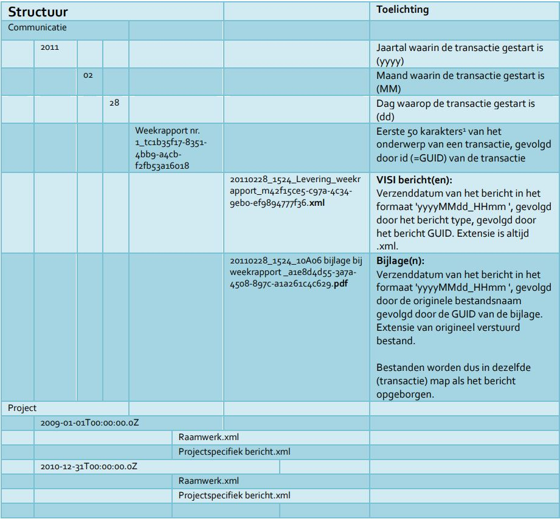
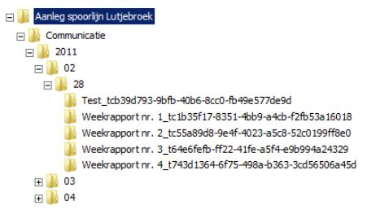
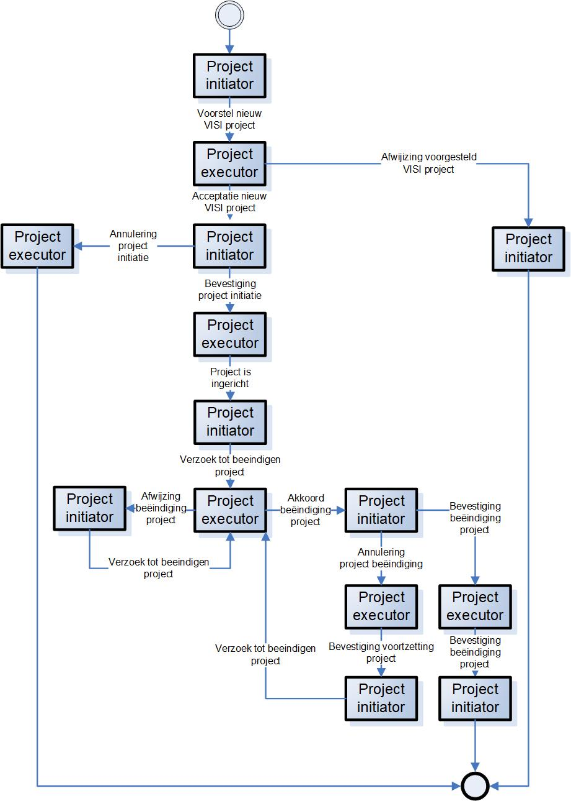
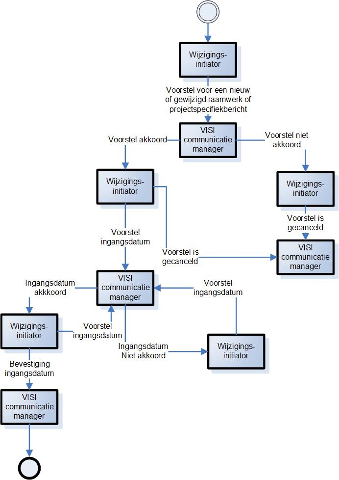

# Functioneel (2. PROJECTUITVOERING)

Gebruik Raamwerk en PSB in project

## Berichtencommunicatie

De projectcommunicatie via het versturen en beantwoorden van berichten kan starten. Alle deelnemende organisaties weten van het project. Wordt een bericht verstuurd door persoon Urbain Servranckx (in Beoordelende rol van organisatie Gemeente Rommelgem) naar Georges Remi (in Adviserende rol van organisatie De Blauwe Lotus), dan zorgt de digitale adressering en verspreide project specifieke bestand dat het bericht ook bezorgd wordt bij Georges Remi.

### Volgorde

Berichten zijn niet onafhankelijk van elkaar, maar hebben een samenhang. Berichten hebben een volgorde die gezien kan worden als een ketting van berichten. De ketting heeft een begin en een eind. Er is een startbericht en een eindbericht. De volgorde is bijvoorbeeld:

start -> verzoek -> levering -> afkeuring -> hernieuwde levering -> goedkeuring -> einde

Voor een bericht wordt aangegeven wat het voorgaande bericht is. Het startbericht heeft geen voorgaande, en dit is de enige manier om een startbericht te onderscheiden van de andere berichten. Evenzogoed komt het eindbericht nergens voor als voorgaand bericht. Dit is de enige manier om een eindbericht te onderscheiden van de andere berichten. De verwijzing naar de voorgaande is de schakel in de ketting van berichten.

Een bericht kan meerdere voorgaande berichten hebben. Immers een bericht goedkeuring kan volgen op een levering, maar ook op een hernieuwde levering. Het eindbericht heeft een afkeuring en een goedkeuring als voorgaand bericht. De ketting van berichten is hierdoor niet lineair, maar is een wiskundige graaf. Meest eenvoudige graaf is:

start	-> afkeuring	-> einde
-> goedkeuring	->

### Berichttype

Niet ieder bericht is hetzelfde. Er wordt onderscheid gemaakt in type berichten. In bovenstaand voorbeeld is afkeuring een ander berichttype dan goedkeuring. Dit is niet alleen een andere naam voor een bericht, de inhoud van het bericht is verschillend tussen een afkeuring en een goedkeuring. Bijvoorbeeld een afkeuring zal een motivatie bevatten. In een goedkeuring zal motivatie niet nodig zijn en derhalve ontbreken.

De inhoud van een bericht is gekoppeld aan het type. Deze inhoud is niet willekeurig en behoeft uitleg, maar dit vergt te veel details om hier te behandelen. Voor een nadere uitleg over de inhoud van berichten wordt verwezen naar paragraaf XXX.

### Bericht van persoon naar persoon

De ketting / graaf van berichten gaat altijd tussen twee personen. Het is niet toegestaan om een bericht naar een willekeurige personen te versturen, of naar een organisatie te versturen. Deze personen zijn vastgelegd in de project setup (paragraaf 1.7). Er is een voorwaarde voor het versturen van een startbericht van persoon Urbain Servranckx naar persoon Georges Remi. Deze voorwaarde is dat de personen een bepaalde rol moeten invullen voor hun organisatie. Feitelijk wordt een bericht dus verstuurd van "Persoon in Rol van Organisatie" naar "Persoon in Rol van Organisatie". Dus persoon Urbain Servranckx (in Beoordelende rol van organisatie Gemeente Rommelgem) stuurt een startbericht naar persoon Georges Remi (in Adviserende rol van organisatie De Blauwe Lotus).

### Versturen van een bericht

Voordat een persoon een bericht kan versturen moet aan bepaalde regels voldaan worden. Een startbericht mag alleen verstuurd worden door personen die een bepaalde rol toegewezen gekregen hebben in het project specifieke bestand. Voor de ontvangende persoon geldt ook een regel. Allereerst kan er maar één ontvangende persoon zijn. Deze persoon dient ook een bepaalde rol toegewezen gekregen te hebben in het project specifieke bestand. In het voorbeeld zijn dit de initiërende rol Beoordelende en ontvangende rol Adviserende. Persoon Urbain Servranckx stuurt het startbericht van type "Opdracht" naar persoon Georges Remi.

<aside class="example" title="Voorbeeld bericht">

<b>Bericht</b> 
Type: 			Opdracht 
Unieke identificatie: _9a163e84-a83e-47ea-b5f3-220c403da98b 
Verzenddatum:		2021-12-23T14:38:56 
Richting (Van–Naar):	TRUE 
Transactie:		_f8275cfe-3d8d-4bda-a05b-164a5087a1af 
Inhoud:			_170ef962-685f-4fc8-8728-df1bfe2317ba 

</aside>

De ontvangende persoon kan alleen een reactiebericht sturen naar de initiërende persoon. Dus Georges Remi stuurt een afkeuring (of goedkeuring) naar Urbain Servranckx.
<aside class="example" title="Voorbeeld bericht">

<b>Bericht</b> 
Type: 			Afkeuring 
Unieke identificatie: _2bbecc10-948e-4b1a-b6ce-3a133576297c 
Verzenddatum:		2021-12-27T10:13:42 
Richting (Van–Naar):	FALSE 
Transactie:		_f8275cfe-3d8d-4bda-a05b-164a5087a1af 
Inhoud:			_657ad592-5d76-4248-b959-68af07465cd6 

</aside>

Hierna stuurt Urbain weer een reactiebericht naar Georges. Dit gaat heen en weer net zolang tot het eindbericht verstuurd is.
N.B. Van een bericht kan geen kopie gestuurd worden (als cc).
Bij het versturen van een eerste bericht dient ook de volgorde van de reactieberichten vastgelegd te zijn, zodat de berichten een vast patroon volgen. Bijvoorbeeld het patroon: start -> verzoek -> levering -> afkeuring -> hernieuwde levering -> goedkeuring -> einde
Hiermee wordt afgedwongen dat na een afkeuring een hernieuwde levering komt.
Een voorbeeld van een ander patroon: start -> ter informatie -> ontvangstbevestiging -> einde
Versimpeld zou je kunnen zeggen dat dit patroon (c.q. de volgorde van berichttype) bepaald wordt door het type van de transactie, die gestart wordt. Ieder bericht heeft een verwijzing naar de transactie. Deze transactie is - net als een bericht - van een bepaald type.

<aside class="example" title="Voorbeeld bericht">

<b>Transactie</b> 
Type: 			Opdrachtverstrekking 
Unieke identificatie: _f8275cfe-3d8d-4bda-a05b-164a5087a1af 
Nummer:			GRG000282 
Omschrijving:		Opdracht voor project Realisatie West- / Oostlijn 
Van:			_e0ad4954-7986-417c-96d6-813efa36e86b 
Naar:			_752b1dfd-dd91-4404-9708-39b91047ca66 
Project:		_badc9dab-807e-4319-bd56-60c57605e109; 

</aside>

De voorschriften en regels, waaraan aan de berichtencommunicatie moet voldoen, is vastgelegd in een projectcommunicatiesjabloon. Dit sjabloon bevat de definitie van type rollen, type berichten en type transacties. Ook de inhoud van een type bericht is in dit sjabloon gedefinieerd. Dit sjabloon heet een raamwerk. De term sjabloon geeft al aan dat het een blauwdruk is waaraan de transacties en berichten moeten voldoen.

## Bijlagen

Ieder bericht kan 0, 1 of meerdere bijlagen bevatten. Bijlage betekent hier een binair bestand, zoals een foto of document. De verschijningsvorm is bijvoorbeeld een jpg-, pdf of zip-bestand. Doel van een bijlage is de informatie in het bericht te onderbouwen en / of verduidelijken.

### Verplichte Eigenschappen

Ieder binair bestand mits kleiner dan 10GB kan meegestuurd worden met een bericht. Voor de som van alle bijlagen van één bericht geldt een aanvullende eis, namelijk dat de gezamenlijke grootte van de bijlagen kleiner is dan 10GB. Aan het fysieke bestand worden geen nadere eisen gesteld. Wel worden eisen gesteld aan de eigenschappen / metadata van de bijlage conform het raamwerk (zie paragraaf 2.10 over AppendixType).
Naast de typering heeft een bijlage een vaste set verplichte standaard eigenschappen van het bestand, zoals naam, locatie, type, versie en datum. De naam van de eigenschap geeft aan welke informatie van het bestand vastgelegd dient te worden.

<aside class="example" title="Voorbeeld bericht">

<b>Bijlage</b> 
Type: 			Opdrachtbon 
Unieke identificatie: _a0186218-82d9-4b0f-a616-8aa1f162128a 
Naam:			Bon_9601.pdf 
Bestandslocatie:	??? 
Bestandstype:		application/pdf 
Bestandsversie:	DF43111 
Datum:			2021-10-23T08:31:58 
Bericht:		_9a163e84-a83e-47ea-b5f3-220c403da98b 
Inhoud:	_04cdb00c-fd4d-4e58-b0ad-0cc19a3b07c9, _a1cd32d-ae5ed41-e0bc-1ee28b1c08d1 

</aside>

Een bijlage heeft een verwijzing naar het bericht waarvan het een onderbouwing en / of verduidelijking is.

### Optionele eigenschappen

Naast de verplichte eigenschappen heeft een bijlage vele optionele standaard eigenschappen, die duiden op een document als bijlage, zoals: documentidentificatie, documentversie, documentreferentie.

### Aanvullende eigenschappen

Uit de typering in het projectcommunicatiesjabloon (c.q. raamwerk) volgt of de bijlage aanvullende eigenschappen heeft. Deze aanvullende eigenschappen zijn niet verplicht. De structuur van de aanvullende eigenschappen is gelijk aan de structuur van een bericht. Waar een bericht verwijst naar 1 of meerdere complexe elementen, zo verwijst een bijlage naar 0 of meerdere complex elementen. Een complex element bestaat uit simpele elementen. En een simpel element heeft een waarde.

<aside class="example" title="Voorbeeld bijlage met optionele eigenschappen">

<b>Bijlage</b> 
Type: 			Bon_van_de_opdracht 
Unieke identificatie: _a0186218-82d9-4b0f-a616-8aa1f162128a 
Naam:			purchase-order-9601.pdf  
 
Inhoud:	_04cdb00c-fd4d-4e58-b0ad-0cc19a3b07c9, _a1cd32d-ae5ed41-e0bc-1ee28b1c08d1 
Complex Element 
Type: 			Gegevens_van_de_opdracht 
Unieke identificatie: _04cdb00c-fd4d-4e58-b0ad-0cc19a3b07c9 
 
Elementen:		 
 
Simpel Element 
Type: 			nummer_van_de_opdracht 
Waarde: 		ROM / 2022-666 
 
Simpel Element 
Type: 			naam_opdrachtgever 
Waarde: 		Gemeente Rommelgem 
 
Complex Element 
Type: 			Betalingsgegevens 
Unieke identificatie: _a1cd32d-ae5ed41-e0bc-1ee28b1c08d1 
Elementen:		 
 
Simpel Element 
Type: 			iBAN 
Waarde: 		RABO28932392 
 
Simpel Element 
Type: 			naam_van_de_rekeninghouder 
Waarde: 		Afdeling Inkoop, Gemeente Rommelgem 
 
Simpel Element 
Type: 			bTW_Nummer 
Waarde: 		2933092392809B01 

</aside>

In het projectcommunicatiesjabloon (c.q. raamwerk) staan de beschikbare typen bijlagen gedefinieerd, en welke aanvullende eigenschappen een bepaald type kan hebben. De structuur is gelijk aan de structuur van type bericht. Een type bijlage heeft verwijzingen naar 0 of meerdere type complexe elementen. Een type complex element bestaat uit naar 1 of meerdere type simpele elementen. En een type simpel element heeft één verwijzing naar een waarde. N.B. Er is geen tabeldefinitie (dus geen complex in complex element, zie paragraaf ???) per bijlage mogelijk.

<aside class="example" title="Voorbeeld bijlage met optionele eigenschappen">

<b>Bijlage</b> 
Unieke identificatie: Bon_van_de_opdracht 
Omschrijving:		Opdrachtbon ten behoeve van opdrachtverstrekking 
Complex Elementen:	Opdrachtgegevens, Betalingsgegevens 
 
Complex Element
Unieke identificatie: Gegevens_van_de_opdracht
Omschrijving:		Gegevens van de opdracht
Simpel Elementen:	Opdrachtnummer, Naam_opdrachtgever
 
Complex Element
Unieke identificatie: Betalingsgegevens
Omschrijving:		Gegevens voor betaling
Simpel Elementen:	Naam_van_de_rekeninghouder, BTW_Nummer
 
Simpel Element 
Unieke identificatie: opdrachtnummer 
Omschrijving:		Het unieke identificatie van de opdracht 
Type:			Tekst 
 
Simpel Element 
Unieke identificatie: naam_opdrachtgever 
Omschrijving:		Naam van de organisatie, die opdracht verstrekt 
Type:			Tekst 
 
Simpel Element 
Unieke identificatie: iBAN 
Omschrijving:		IBAN nummer 
Type:			Tekst_verplicht 
 
Simpel Element 
Unieke identificatie: naam_van_de_rekeninghouder 
Omschrijving:		Naam van de rekeninghouder 
Type:			Tekst_verplicht 
 
Simpel Element 
Unieke identificatie: bTW_Nummer 
Omschrijving:		BTW Nummer van de organisatie, die opdracht verstrekt 
Type:			Nummer 
 
Waarde 
Unieke identificatie: Tekst 
Basis XML Type:	STRING 
Waarde 
Unieke identificatie: Tekst_verplicht 
Basis XML Type:	STRING 
XSD Restrictie:	minlength=1 
Waarde 
Unieke identificatie: Nummer 
Basis XML Type:	INTEGER 

</aside>

### Is een bijlage verplicht?

Voor een bepaald type bericht kan afgedwongen worden dat minimaal 1 bijlage bijgevoegd dient te worden. Ook welk type bijlage dit dient te zijn, kan afgedwongen worden. Deze voorwaarden zijn opgenomen in het projectcommunicatiesjabloon (c.q. raamwerk) (zie paragraaf 2.1, 2.2, 2.7). Op een type bericht staat een vlaggetje (Ja / Nee) of een bijlage verplicht is (zie paragraaf 2.2).

<aside class="example" title="Voorbeeld bericht met verplichte bijlage">

<b>Bericht</b> 
Unieke identificatie: Voorstel_tot_Wijziging 
Omschrijving:		Voorstel tot een wijziging 
Bijlage verplicht:	Ja 
Bijlage typen:		Foto, Offerte, Berekening 
Complex Elementen:	Voorstel, Wijziging, Planning, Opmerkingen 

</aside>

Het maximumaantal bijlagen is niet voor te schrijven. Het minimumaantal is 0 of 1 (Bijlage verplicht: Ja / Nee).

### Transport van een bijlage

Het transportprotocol voor berichten en bijlagen is SOAP. De bijlagen (binaire bestanden) worden eerst getransporteerd van verzendende naar ontvangende software. Vanwege de potentiële omvang van een bijlage (maximaal 10GB) wordt iedere bijlagen in blokjes (chunks) verstuurd. De ontvangende software bouwt met de ontvangen blokjes de originele bijlage op. Er is een controlemechanisme (checksum) om te controleren of alle blokjes ontvangen zijn en of alle blokjes correct zijn.

Na verzending van alle bijlagen verstuurt de verzendende software het bericht (de metadata). De ontvangende software relateert metadata aan eerder ontvangen binaire bestanden, zodat exact dezelfde informatie beschikbaar is aan verzendende en ontvangende kant. Het transport is succesvol.

### Validatie

De software dient bijlagen en bericht te valideren voor verzending.

De software dient ontvangen bijlagen en bericht te valideren. Het resultaat van de validatie wordt teruggestuurd naar de verzendende software. Validatie vindt plaats tegen 1) W3C Standaarden waarop VISI gebaseerd is (XML, XSD, SOAP), 2) VISI Standaard, 3) VISI Raamwerk (cq. Projectsjabloon) en 4) VISI Project Specifiek Bestand.

Het ontvangen bericht bevat de identificatie van het project en van de geadresseerde persoon in rol (van organisatie). Met deze gegevens kan het project en project specifieke bestand getraceerd worden, en de inhoud van het bericht gevalideerd worden tegen de inhoud van het project specifieke bestand. Het ontvangen bericht heeft een verwijzing naar het raamwerk (c.q. projectsjabloon). Voor de verwijzing wordt de gangbare functionaliteit van xml gebruikt: namespace. Met deze verwijzing kan het raamwerk getraceerd worden, en de inhoud van het bericht gevalideerd worden tegen de definities in het raamwerk. Voor validatie tegen het raamwerk kan de xsd-versie van het raamwerk gebruikt worden.

Het validatieproces is asynchroon. Dit betekent dat na ontvangst van bijlagen en bericht in de ontvangende software niet direct de validatie hoeft plaats te vinden. Het resultaat van de validatie wordt teruggestuurd naar de verzendende software met een verwijzing waarbij het validatieresultaat behoort. Het validatieresultaat heeft twee opties: geen error (0), wel error (1). Optioneel kan bij de errorcode van de validatie (0 of 1) aanvullende tekst meegestuurd worden ter verduidelijking van de error. Bijvoorbeeld: dat een bijlage ontbreekt, of het bericht niet conform het projectsjabloon (c.q. raamwerk) is, of het project onbekend is.

### Berichtvelden gedrag

tekst

### Wijzigingen in een raamwerk

Gedurende de looptijd van een project kunnen twee soorten wijzigen doorgevoerd worden. De eerste wijziging betreft wijzigingen aan het project, zoals gewijzigde projectnaam, gewijzigde rolverdeling. Bijvoorbeeld een extra projectmedewerker of een nieuwe projectmedewerker als permanente vervanger van een huidige medewerker. De tweede wijzing betreft wijzigingen aan het projectcommunicatiesjabloon, zoals een gewijzigd transactietype, gewijzigd berichttype.

Iedere wijziging moet bij alle betrokken organisaties doorgevoerd worden. Dit betekent dat de gewijzigde bestanden (project specifiek bestand en / of raamwerk) verstrekt moeten worden aan alle - bij het project betrokken - organisaties. Omdat wijzigingen van invloed kunnen zijn op de inhoud van een project, dient de wijziging vooraf inhoudelijk afgestemd te worden tussen projectmedewerkers. 

<aside class="example" title="Voorbeeld wijzigig in het raamwerk">

Bijvoorbeeld: Vergelijk de eerste wijziging met een personeelswisseling in een project. Deze wijziging wordt vooraf tussen projectleiders afgestemd. En vergelijk de tweede wijziging met een procesmatige wijziging van bijvoorbeeld het goedkeuringsproces van documenten.  Een dergelijke wijziging wordt vooraf tussen contractmanagers afgestemd met misschien ondersteuning van de juridische afdeling.

</aside>

#### Machtiging / tijdelijke vervanging

*Substituting*
De wijziging met de kleinste impact is het wijzigen van de machtigingen. Zoals in paragraaf 1.6.2 beschreven is erin voorzien om één of meerdere gemachtigden aan te wijzen voor een persoon in rol (van organisatie). Voert een gemachtigde een handeling uit, dan is dit altijd uit naam van de geautoriseerde persoon. Een machtiging kan verwijderd worden, want de geautoriseerde persoon kan de handeling altijd afmaken. Wordt een machtiging toegevoegd, dan kan de gemachtigde direct handelen op bestaande transacties van de geautoriseerde persoon, en nieuwe transacties starten (namens de geautoriseerde persoon). Een geautoriseerd persoon mag nooit verwijderd worden (zie paragraaf ....).

#### Nieuwe personen

Nieuwe personen kunnen aan een project toegevoegd worden. Tevens kunnen deze personen een rol toegewezen krijgen. Dit kan een rol zijn die al vervuld wordt. Bijvoorbeeld de adviserende rol wordt door meerdere personen in een project ingevuld.
Houd er rekening mee dat nieuwe personen niet a) aan bestaande transactie en berichten kunnen deelnemen, of b) bestaande communicatie kunnen overnemen. Indien dit gewenst is, gebruik dan de opties voor machtiging / tijdelijke of permanente vervanging.

#### Permanente vervanging

Mits goed uitgevoerd heeft het wijzigen van de permanente vervanging een relatief kleine impact. Zoals in paragraaf 1.6.1 beschreven is erin voorzien om één permanente vervanger aan te wijzen voor een persoon in rol (van organisatie). 
Voor de traceerbaarheid en transparantie kunnen a) er nooit geautoriseerde personen verwijderd worden, en b) opvolgingen van geautoriseerde personen nooit aangepast worden. Hierdoor ontstaat altijd een onafgebroken keten van opvolgers van persoon in rol (van organisatie) Met andere woorden geen cirkelverwijzing of vertakkingen. Vandaar dat de opvolging expliciet gemaakt wordt met het aanwijzen van een permanente opvolger.

<aside class="example" title="Voorbeeld permanente vervanging">

Piet heeft Rol A en Rol B (pir 1 en pir2). Truus vervangt rol A (pir3 successor van pir 1) en kees vervangt rol B (pir4 successor van pir 2)  Op een bepaald moment neemt hans de verantwoordelijkheid voor rol  A van Truus over (pir5 successor van pir 3) Weer later komt piet op het project terug en neemt beide rollen weer op zich (pir 6 successor van pir 5 en pir 7 successor van pir 4) 
 
Als je nu kijkt naar rol A, dan is er een onafgebroken keten vanaf de eerste verantwoordelijke tot de huidige verantwoordelijke. Piet behandelt vanaf dat moment dus de transacties van Pir 1(zichzelf), Pir3 (Truus), Pir5(Hans) en Pir 6, (de actuele Pir van zichzelf) 
PLAATJE???

</aside>

#### Personen verwijderen

Met uitzondering van een machtiging kan een persoon niet verwijderd worden uit een project. Behalve indien een persoon in rol (van organisatie) geen transacties aan zijn rol (of aan de eventueel opgevolgde rollen) gekoppeld heeft. In dat geval is verwijderen mogelijk.

De enige optie om een persoon te deactiveren voor een project is het aanwijzen van een permanente vervanger voor deze persoon. Hiervoor is de eigenschap opvolger van een persoon in rol (van organisatie). Moet een persoon met een adviserende rol verwijderd worden uit een project, dan krijgt deze persoon in rol (van organisatie) een opvolger (met dezelfde adviserende rol). Dit kan ook een bestaande persoon zijn (met dezelfde adviserende rol).

<aside class="example" title="Personen verwijderen">

<b>Persoon in Rol van Organisatie</b> 
Unieke identificatie: _b16d7aeb-6a5e-4326-9283-aef843684f5c 
Contactpersoon: 	_d4e02752-2ac6-4700-ae67-d33f428f78fb 
Rol:			_1252a67a-5f69-4a9c-b4ca-506a4459c7c3 
Organisatie:		_87e9144d-04d6-4a5f-bdcb-b50e96c2b498 
Opvolger:		_666f01b3-6714-44cc-8865-0a9ae1f938ce 

<b>Persoon in Rol van Organisatie</b> 
Unieke identificatie: _666f01b3-6714-44cc-8865-0a9ae1f938ce 
Contactpersoon: 	_c6e4430e-65aa-4e55-a8db-1beb6d3f4250 
Rol:			_1252a67a-5f69-4a9c-b4ca-506a4459c7c3 
Organisatie:		_87e9144d-04d6-4a5f-bdcb-b50e96c2b498

<b>Rol v</b> 
Unieke identificatie: _1252a67a-5f69-4a9c-b4ca-506a4459c7c3 
Naam: 			Adviserende rol 
Omschrijving:	Deze rol geeft een onafhankelijk advies op basis van competenties en deskundigheid binnen het kader van project. Bij het advies doorloopt de rol een aantal vaste stappen. Rol inventariseert gegevens, weegt, motiveert en beoordeelt deze informatie en geeft vervolgens het advies. 

</aside>

## Raamwerk wijzigen

Dit is de wijziging met de grootste impact. Naast het wijzigen van het projectcommunicatiesjabloon (c.q. raamwerk) moet ook de project setup in het project specifieke bestand geactualiseerd worden conform het raamwerk. Het project specifieke bestand heeft namelijk een verwijzing naar het raamwerk. Indien het raamwerk wijzigt, dient deze verwijzing ook te wijzigen. Dus minimale actualisatie is het aanpassen van de verwijzing naar het raamwerk. Voor deze verwijzing wordt de gangbare functionaliteit van xml gebruikt: namespace. Een gewijzigd projectcommunicatiesjabloon dient een nieuwe unieke namespace te bevatten.

<aside class="example" title="Raamwerk aanpassen">

<b>Project</b> 
Unieke identificatie: UAV 
Omschrijving:		Uniforme Administratieve Voorwaarden 
Namespace:		http://www.visi.nl/schemas/20160331/uav_20-10-2020_1723

</aside>

Indien een gewijzigd projectcommunicatiesjabloon (c.q. raamwerk) zonder gewijzigd project specifieke bestand wordt aangeleverd, dan is het "vorige" project specifieke bestand ook van toepassing op het gewijzigd projectcommunicatiesjabloon (c.q. raamwerk).

De verwijzing naar het bijbehorende raamwerk is eveneens aanwezig in ieder bericht. Hierdoor is voor ieder bericht te achterhalen conform welk raamwerk het bericht opgesteld is, en is na te gaan of het bericht valide is conform dit raamwerk. En welke opvolgende berichten als vervolgstap mogelijk zijn.

#### Gedrag software rondom gekoppelde berichtenflow

tekst

#### Gedrag rondom wel en niet aanbieden berichten obv raamwerk/rol

tekst

# PROJECTARCHIEF

Het uitwisseling- en archiveringsformaat voor (afgeronde) VISI projecten wordt in deze documentatie een 
"VISI archief" genoemd. In de volgende paragrafen wordt beschreven aan welke eisen het archief moet voldoen en wordt het gebruik toegelicht.

## De eisen die gesteld zijn aan het VISI archief

**1) De informatie die in het archief aanwezig moet zijn, omvat alle gegevens van maximaal en 
minimaal 1 project, te weten:**
- Alle raamwerken van het project.
- Alle projectspecifieke berichten van het project.
- Alle verstuurde en ontvangen VISI berichten in het formaat xml.
- Alle verstuurde en ontvangen bijlagen in het originele formaat.

**2) Informatie uit het archief moet inzichtelijk zijn, zonder exotische/VISI (viewer) software:**
- Bijlagen worden gearchiveerd in het originele formaat waarin ze door de eindgebruiker/organisatie verzonden zijn. Dus een PDF-bestand is terug te vinden als een 
PDF-bestand. Archivering van bijlagen wordt dus niet gedaan in BASE64, MTOM of andere soortgelijke formaten.
- Het archief dient een structuur te hebben, zodat op een logische wijze door de communicatie genavigeerd kan worden.

**3) Het archief moet importeerbaar zijn:**
- De informatie die in het VISI archief aanwezig is, moet volledig genoeg zijn om de totale communicatie te reproduceren/in te lezen in een VISI oplossing naar keuze.
- De koppeling tussen een bericht en een bijlage moet terugvindbaar zijn.

N.B. In een voorgaand document werd terecht het volgende beschreven:
“De correcte heropbouw van berichten, raamwerk(en) en project specifieke bericht(en) kan alleen met 
projecten die onder de 1.2 systematiek draaien omdat daar alle berichten met een DateTime value 
werken. In de 1.1 systematiek werd alleen met een Date value gewerkt waardoor het lastig zal zijn om 
berichten per dag in de juiste volgorde terug te zetten.”
Daarom als toevoeging de eis:

- Indien de VISI software beschikt over het tijdstip waarop een VISI bericht is verstuurd, dan 
wordt deze informatie ook gearchiveerd. Indien deze informatie niet aanwezig is, dan wordt voor het eerste bericht binnen een transactie op die dag tijdstip ‘00:01’ gebruikt, en voor elk opvolgend bericht elk ‘een minuut later’.
Motivering: hiermee kunnen 1440 berichten binnen een transactie binnen een dag worden genummerd.

**4) Het importeren van gearchiveerde projecten mogelijk moet zijn:**
- Na de import moet het VISI project weer geheel volgens de VISI-Systematiek functioneren

## Toepassing projectarchief

In de onderstaande tabel wordt een voorbeeld gegeven van de toepassing in de praktijk en geeft inzicht in de structuur van een VISI projectarchief. In het voorbeeld wordt een VISI project gearchiveerd in een filesysteem structuur.

</aside>

VISI-berichten worden gestructureerd op datum. Eventueel kan het complete archief in ZIP formaat worden opgeslagen.

Visueel voorbeeld:

</aside>

# METARAAMWERK

Het VISI META-raamwerk is standaard onderdeel van de systematiek en is bedoeld voor het uitwisselen van een nieuw contractspecifiek raamwerk en het uitwisselen van een gewijzigd raamwerk of projectspecifiek bericht tussen projectpartners. Het META-raamwerk zelf is project overstijgend. Het META-raamwerk dient immers beschikbaar te zijn voordat een VISI omgeving voor een specificiek project wordt ingericht. Om projectpartners te laten communiceren via het META-raamwerk dienen beide projectpartners over VISI compatible software te beschikken waarin een META-project met daarin het universele META-raamwerk en een valide META-projectspecifieke bericht is ingeladen. In dit bericht staan de serveradressen van de projectpartners en de organisatie en persoonsgegevens. Elke organisatie heeft het eigen META-projectspecifieke bericht in eigen beheer en vult dit aan de met de gegevens van projectpartners.

## De beschikbare rollen en bijbehorende verantwoordelijkheden
Het VISI META-raamwerk bevat vier rollen. Voor het initiëren en beëindigen van een project zijn de rollen project initiator en project executor beschikbaar. In de regel is de project initiator de Opdrachtgevende partij en de project executor de Opdrachtnemende partij. 

Voor het wijzigen van een raamwerk of een projectspecifiekbericht zijn de rollen VISI-communicatiemanager en Wijzigingsinitiator opgenomen. De VISI-communicatiemanager heeft de verantwoordelijkheid een aanpassing autoriseren. De Wijzigingsinitiator is verant-woordelijk voor de initiatie van een aanpassing. Beide rollen kunnen door alle betrokken partijen worden ingevuld. Zo kan elke betrokken partij een wijziging initiëren dan wel ac-cepteren. 

## De beschikbare transacties binnen het META-raamwerk
Het META-raamwerk bevat twee transacties met als doel:

- Verspreiden van een initieel raamwerk en projectspecifiek bericht (VISI project initia-tie).
- Verspreiden van een gewijzigd raamwerk en/of projectspecifiek bericht (Nieuw of ge-wijzigd raamwerk of projectspecifiekbericht transactie)

Hieronder is de communicatie per transactie weergegeven in een transactiediagram.

**VISI project initiatie**
</aside>

**Verspreiden van een gewijzigd raamwerk en/of projectspecifiek bericht**

</aside>

## Toepassing META-raamwerk
Het META-raamwerk biedt de mogelijkheid aan software leveranciers om (semi)automatisch een nieuw- of gewijzigd raamwerk en/of projectspecifiekbericht in gebruik te nemen. Daarnaast komt het META-raamwerk de interoperabiliteit ten goede omdat meer zekerheid bestaat of de juiste versie van een raamwerk eb/of projectspecifiekbericht in gebruik is. 

# Interactief informatiemodel

1 Interactief informatiemodel van _2.exp Raamwerken

<iframe src="media/index_2.html" title="Interactief informatiemodel van raamwerkelementen en bijbehorende attributen 1" name="iframe_a" width="1200" height="900">
</iframe>

<!-- 
<a href="https://bimloket.github.io/visi/visi1.6/#interactief-informatiemodel">Open interactief informatiemodel in frame</a>
 -->

<a href="media/index_2.html" target="iframe_a">Ga terug naar interactief informatiemodel</a>

