# Testprotocol

De figuren van onderstaande scenario's zijn opgesteld in Microsoft Visio 2003. Het bronbestand is [Scenario's](media/scenarios.vsd).

## Testraamwerk Pizzeria

Het raamwerk bevat vier transactietypen:
* t1_OpnameBestelling;
* t2_VraagOberAanKok;
* t3_OpdrachtKok;
* t4_VraagKokAanKeukenhulp.

En vier rollen: Klant, Ober, Kok en Keukenhulp.

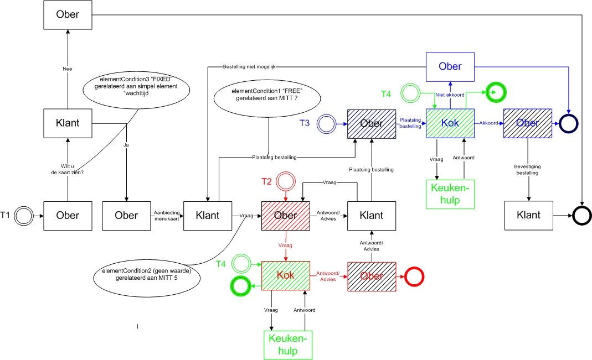

### Scenario 1

*Doel*

Testen op de functionaliteit voor:
1. het starten van een transactie
2. het beantwoorden van een bericht
3. het gebruik van verschillende soorten gegevensvelden

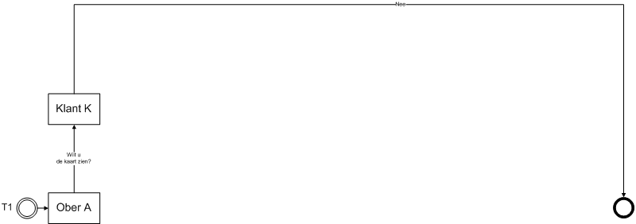

*Beschrijving*

Ober A vraagt aan Klant K of hij/zij de kaart wil zien.
Bij het invullen van de vraag of de klant de kaart wil zien, worden alle verschillende Base Type velden aangeboden.

Test of de volgende velden als volgt werken:

| Veld         | Werking    | 
| :--------------- | :--------------- | 
| Boolean | Hier moet een vinkjes veldje  of 0 - 1 of true-false of waar-onwaar staan (verplicht) | 
| Date / Datum | Een datum moet ingevoerd worden (verplicht) | 
| Datetime / Datum en tijd | Datum en tijd moeten ingevuld worden (verplicht) | 
| Time / Tijd | Een tijdstip moet ingevoerd worden (verplicht) | 
| Decimal / Decimaal | Een getal, al dan niet met decimale waarden moet ingevoerd worden (verplicht) | 
| Integer / Geheel getal | Een geheel getal moet ingevoerd worden (verplicht) | 
| Keuzelijst | Een van de waarden "Keuze 1", "Keuze 2" of "Keuze 3" moet ingevoerd worden (verplicht) | 
| String / Vrije tekst | Willekeurige tekens kunnen ingevoerd worden (niet verplicht): Klant K beantwoordt de vraag met Nee.  | 

### Scenario 2a

*Doel*
voor a) het starten van een (sub)transactie en b) het terugkeren naar een (hoofd)transactie.

*Beschrijving*
Ober A vraagt aan Klant K of hij/zij de kaart wil zien. Klant K beantwoordt de vraag met Ja, en geeft aan welke kaart hij/zij wil zien.

Ober A biedt de menukaart aan die Klant K gevraagd heeft. Ober A kan het menukaarttype **niet** wijzigen. Klant K krijgt de gevraagde menukaart. 
Klant K plaatst een bestelling bij Ober A bestaande uit een tabel met per rij de naam van een gerecht en eventueel een bijbehorende opmerking.

Ober A plaatst dezelfde bestelling bij Kok X en bij Kok Y. Ober A kan de bestelling van Klant K niet aanpassen, en ook niet aanvullen.

Kok Y geeft Ober A een akkoord. Kok Y kan de bestelling van Ober A niet aanpassen, en ook niet aanvullen.

Ober A geeft Klant K een akkoord. Ober A kan het akkoord van Kok Y niet aanpassen, en ook niet aanvullen.

Nadat Ober A naar Klant K heeft communiceerd geeft Kok X alsnog een akkoord aan Ober A. Ober A kan met de ontvangen melding van Kok X
**helemaal niets**, dus niet communiceren richting Kok x of Klant K. 

### Scenario 2c

*Doel*

Testen op de functionaliteit voor a) het starten van twee (sub)transactie en b) het terugkeren van 1 (sub)transactie naar de (hoofd)transactie.

*Beschrijving*

Ober A vraagt aan Klant K of hij/zij de kaart wil zien. Klant K beantwoordt de vraag met Ja, en geeft aan welke kaart hij/zij wil zien.

Ober A biedt de menukaart aan die Klant K gevraagd heeft. Ober A kan het menukaarttype
*niet* wijzigen. Klant K krijgt de gevraagde menukaart. 

Klant K plaatst een bestelling bij Ober A bestaande uit een tabel met per rij de naam van een gerecht en eventueel een bijbehorende opmerking.

Ober A plaatst dezelfde bestelling bij Kok X en bij Kok Y. Ober A kan de bestelling van Klant K niet aanpassen, en ook niet aanvullen.

Kok Y geeft Ober A een akkoord. Kok Y kan de bestelling van Ober A niet aanpassen, en ook niet aanvullen.

Ober A geeft Klant K een akkoord. Ober A kan het akkoord van Kok Y niet aanpassen, en ook niet aanvullen.

Nadat Ober A naar Klant K heeft gecommuniceerd geeft Kok X alsnog een niet akkoord aan Ober A. Ober A kan met de ontvangen melding van Kok X
*helemaal niets*, dus niet communiceren richting Kok X of Klant K. 

### Scenario 3a

*Doel*

Testen op de functionaliteit voor het starten van een bepaald type (sub)transactie, terugkeren naar de (hoofd)transactie, en weer starten van hetzelfde type (sub)transactie.

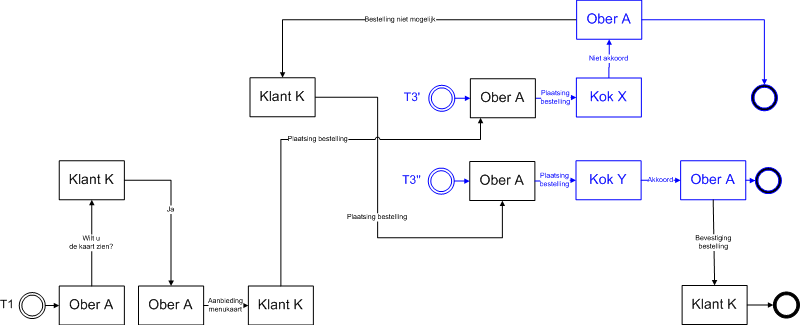

*Beschrijving*
Ober A vraagt aan Klant K of hij/zij de kaart wil zien. Klant K beantwoordt de vraag met Ja, en geeft aan welke kaart hij/zij wil zien.

Ober A biedt de menukaart aan die Klant K gevraagd heeft. Ober A kan het menukaarttype
<em>niet</em> wijzigen. Klant K krijgt de gevraagde menukaart.

Klant K plaatst een bestelling bij Ober A bestaande uit een tabel met per rij de naam van een gerecht en eventueel een bijbehorende opmerking.

Ober A plaatst dezelfde bestelling bij Kok X. Ober A kan de bestelling van Klant K niet aanpassen, en ook niet aanvullen.

Kok X geeft Ober A een niet akkoord. Kok X kan de bestelling van Ober A niet aanpassen, en ook niet aanvullen.

Ober A geeft Klant K een niet akkoord. Ober A kan het niet akkoord van Kok X niet aanpassen, en ook niet aanvullen.

Klant K plaatst een compleet nieuwe bestelling bij Ober A bestaande uit een tabel met per rij de naam van een gerecht en eventueel een bijbehorende opmerking. (Klant K kan de gehele tabel invullen.)

Ober A plaatst dezelfde bestelling bij Kok Y. Ober A kan de bestelling van Klant K niet aanpassen, en ook niet aanvullen.

Kok Y geeft Ober A een akkoord. Kok Y kan de bestelling van Ober A niet aanpassen, en ook niet aanvullen.

Ober A geeft Klant K een akkoord. Ober A kan het akkoord van Kok Y niet aanpassen, en ook niet aanvullen.

### Scenario 3b

*Doel:*

Testen op de functionaliteit voor het starten van een bepaald type (sub)transactie, terugkeren naar de (hoofd)transactie, meerdere berichten in de hoofdtransactie, en weer starten van hetzelfde type (sub)transactie.

*Beschrijving*

Ober A vraagt aan Klant K of hij/zij de kaart wil zien. Klant K beantwoordt de vraag met Ja, en geeft aan welke kaart hij/zij wil zien.

Ober A biedt de menukaart aan die Klant K gevraagd heeft. Ober A kan het menukaarttype
*niet* wijzigen. Klant K krijgt de gevraagde menukaart. 

Klant K plaatst een bestelling bij Ober A bestaande uit een tabel met per rij de naam van een gerecht en eventueel een bijbehorende opmerking.

Ober A plaatst dezelfde bestelling bij Kok X. Ober A kan de bestelling van Klant K niet aanpassen, en ook niet aanvullen.

Kok X geeft Ober A een niet akkoord. Kok X kan de bestelling van Ober A niet aanpassen, en ook niet aanvullen.

Ober A geeft Klant K een niet akkoord. Ober A kan het niet akkoord van Kok X niet aanpassen, en ook niet aanvullen.

Klant K stelt Ober A een vraag. 

Ober A beantwoordt de vraag van Klant K. (In de beantwoording kan Ober A de vraag van Klant K
*niet* aanpassen.) 

Klant K plaatst een compleet nieuwe bestelling bij Ober A bestaande uit een tabel met per rij de naam van een gerecht en eventueel een bijbehorende opmerking. (Klant K kan de gehele tabel invullen.)

Ober A plaatst dezelfde bestelling bij Kok Y. Ober A kan de bestelling van Klant K niet aanpassen, en ook niet aanvullen.

Kok Y geeft Ober A een akkoord. Kok Y kan de bestelling van Ober A niet aanpassen, en ook niet aanvullen.

Ober A geeft Klant K een akkoord. Ober A kan het akkoord van Kok Y niet aanpassen, en ook niet aanvullen.

### Scenario 4a

*Doel*

Testen op de functionaliteit voor ElementConditions.

*Beschrijving*

Ober A vraagt aan Klant K of hij/zij de kaart wil zien. Klant K beantwoordt de vraag met Ja, en geeft aan welke kaart hij/zij wil zien.

Ober A biedt de menukaart aan die Klant K gevraagd heeft. Ober A kan het menukaarttype
<em>niet</em> wijzigen. Klant K krijgt de gevraagde menukaart. 

Klant K stelt een vraag aan Ober A. 

Ober A beantwoordt de vraag van Klant K. (In de beantwoording kan Ober A de vraag van Klant K
*niet* aanpassen.) 

Klant K plaatst een compleet nieuwe bestelling bij Ober A bestaande uit een tabel met per rij de naam van een gerecht en eventueel een bijbehorende opmerking. (Klant K kan de gehele tabel invullen.)

Ober A plaatst dezelfde bestelling bij Kok X. Ober A kan de bestelling van Klant K niet aanpassen, en ook niet aanvullen.

Kok X geeft Ober A een akkoord. Kok X kan de bestelling van Ober A niet aanpassen, en ook niet aanvullen.

Ober A geeft Klant K een akkoord. Ober A kan het akkoord van Kok X niet aanpassen, en ook niet aanvullen.

### Scenario 4b

**Doel:**

Testen op de functionaliteit voor ElementConditions.

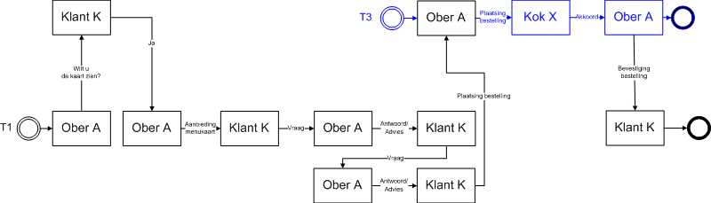

**Beschrijving**
Ober A vraagt aan Klant K of hij/zij de kaart wil zien. Klant K beantwoordt de vraag met Ja, en geeft aan welke kaart hij/zij wil zien.

  
  
Ober A biedt de menukaart aan die Klant K gevraagd heeft. Ober A kan het menukaarttype
*niet* wijzigen. Klant K krijgt de gevraagde menukaart. 
  
  
Klant K stelt een vraag aan Ober A. 
  
  
Ober A beantwoordt de vraag van Klant K. (In de beantwoording kan Ober A de vraag van Klant K
<em>niet</em> aanpassen.)
  
  
Klant K stelt een tweede vraag aan Ober A. (In de vraagstelling kan Klant K de vraag
*niet* invullen, omdat in het raamwerk de ElementCondition <em>geen</em> waarde voor condition heeft!!!)

  
Ober A beantwoordt de vraag van Klant K. (In de beantwoording kan Ober A de vraag van Klant K
*niet* aanpassen.) 
  
  
Klant K plaatst een compleet nieuwe bestelling bij Ober A bestaande uit een tabel met per rij de naam van een gerecht en eventueel een bijbehorende opmerking. (Klant K kan de gehele tabel invullen.)

  
Ober A plaatst dezelfde bestelling bij Kok X. Ober A kan de bestelling van Klant K niet aanpassen, en ook niet aanvullen.

  
Kok X geeft Ober A een akkoord. Kok X kan de bestelling van Ober A niet aanpassen, en ook niet aanvullen.

  
Ober A geeft Klant K een akkoord. Ober A kan het akkoord van Kok X niet aanpassen, en ook niet aanvullen.

### Scenario 4c

*Doel*

Testen op de functionaliteit voor ElementConditions.

*Beschrijving*

Ober A vraagt aan Klant K of hij/zij de kaart wil zien. Klant K beantwoordt de vraag met Ja, en geeft aan welke kaart hij/zij wil zien.

Ober A biedt de menukaart aan die Klant K gevraagd heeft. Ober A kan het menukaarttype
<em>niet</em> wijzigen. Klant K krijgt de gevraagde menukaart.

Klant K stelt een vraag aan Ober A. 

Ober A beantwoordt de vraag van Klant K. (In de beantwoording kan Ober A de vraag van Klant K
<em>niet</em> aanpassen.) 

Klant K stelt een tweede vraag aan Ober A. (In de vraagstelling kan Klant K de vraag
*niet* invullen, omdat in het raamwerk de ElementCondition <em>geen</em> waarde voor condition heeft!!!)

Ober A beantwoordt de vraag van Klant K. (In de beantwoording kan Ober A de vraag van Klant K
*niet* aanpassen.) 

Klant K stelt een derde vraag aan Ober A. (In de vraagstelling kan Klant K de vraag
*niet* invullen, omdat in het raamwerk de ElementCondition <em>geen</em> waarde voor condition heeft!!!)

Ober A beantwoordt de vraag van Klant K. (In de beantwoording kan Ober A de vraag van Klant K
*niet* aanpassen.) 

Klant K plaatst een compleet nieuwe bestelling bij Ober A bestaande uit een tabel met per rij de naam van een gerecht en eventueel een bijbehorende opmerking. (Klant K kan de gehele tabel invullen.)

Ober A plaatst dezelfde bestelling bij Kok X. Ober A kan de bestelling van Klant K niet aanpassen, en ook niet aanvullen.

Kok X geeft Ober A een akkoord. Kok X kan de bestelling van Ober A niet aanpassen, en ook niet aanvullen.

Ober A geeft Klant K een akkoord. Ober A kan het akkoord van Kok X niet aanpassen, en ook niet aanvullen.

### Scenario 5a

*Doel*

Testen op de functionaliteit voor ElementConditions en openSecondaryTransactionsAllowed.

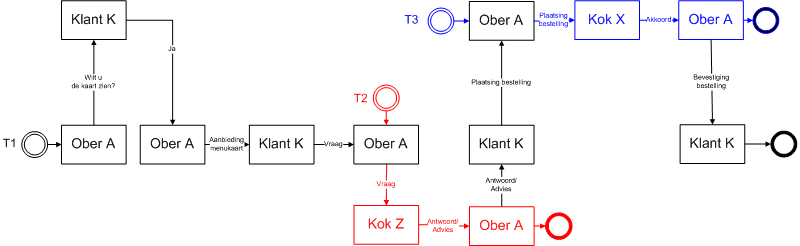

*Beschrijving*

Ober A vraagt aan Klant K of hij/zij de kaart wil zien. Klant K beantwoordt de vraag met Ja, en geeft aan welke kaart hij/zij wil zien.

Ober A biedt de menukaart aan die Klant K gevraagd heeft. Ober A kan het menukaarttype
*niet* wijzigen. Klant K krijgt de gevraagde menukaart. 

Klant K stelt een vraag aan Ober A. 

Ober A stelt een vraag aan Kok Z. (In de vraagstelling kan Ober A de vraag <em>niet</em> aanpassen.)

Kok Z beantwoordt de vraag van Ober A. (In de beantwoording kan Kok Z de vraag van Ober A
*niet* aanpassen.) 

Ober A beantwoordt de vraag van Klant K. (In de beantwoording kan Ober A het antwoord van Kok Z
*niet* aanpassen.) 

Klant K plaatst een compleet nieuwe bestelling bij Ober A bestaande uit een tabel met per rij de naam van een gerecht en eventueel een bijbehorende opmerking. (Klant K kan de gehele tabel invullen.)

Ober A plaatst dezelfde bestelling bij Kok X. Ober A kan de bestelling van Klant K niet aanpassen, en ook niet aanvullen.

Kok X geeft Ober A een akkoord. Kok X kan de bestelling van Ober A niet aanpassen, en ook niet aanvullen.

Ober A geeft Klant K een akkoord. Ober A kan het akkoord van Kok X niet aanpassen, en ook niet aanvullen.

### Scenario 5b

*Doel*

Testen op de functionaliteit voor ElementConditions en openSecondaryTransactionsAllowed.

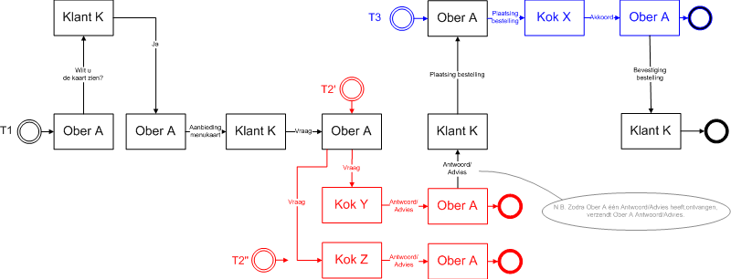

*Beschrijving*

Ober A vraagt aan Klant K of hij/zij de kaart wil zien. Klant K beantwoordt de vraag met Ja, en geeft aan welke kaart hij/zij wil zien.

Ober A biedt de menukaart aan die Klant K gevraagd heeft. Ober A kan het menukaarttype
*niet* wijzigen. Klant K krijgt de gevraagde menukaart. 

Klant K stelt een vraag aan Ober A. 

Ober A stelt een vraag aan Kok Y en Z. (In de vraagstelling kan Ober A de vraag *niet* aanpassen.)

Kok Y beantwoordt de vraag van Ober A. (In de beantwoording kan Kok Y de vraag van Ober A
*niet* aanpassen.)

Ober A beantwoordt de vraag van Klant K. (In de beantwoording kan Ober A het antwoord van Kok Y
*niet* aanpassen.) 

Nadat Ober A naar Klant K heeft gecommuniceerd geeft Kok Z alsnog een antwoord aan Ober A. Ober A kan met de ontvangen melding van Kok Z
*helemaal niets*, dus niet communiceren richting Kok Z of Klant K. 

Klant K plaatst een compleet nieuwe bestelling bij Ober A bestaande uit een tabel met per rij de naam van een gerecht en eventueel een bijbehorende opmerking. (Klant K kan de gehele tabel invullen.)

Ober A plaatst dezelfde bestelling bij Kok X. Ober A kan de bestelling van Klant K niet aanpassen, en ook niet aanvullen.

Kok X geeft Ober A een akkoord. Kok X kan de bestelling van Ober A niet aanpassen, en ook niet aanvullen.

Ober A geeft Klant K een akkoord. Ober A kan het akkoord van Kok X niet aanpassen, en ook niet aanvullen.

### Scenario 5c

*Doel*

Testen op de functionaliteit voor ElementConditions en openSecondaryTransactionsAllowed.

*Beschrijving*

Ober A vraagt aan Klant K of hij/zij de kaart wil zien. Klant K beantwoordt de vraag met Ja, en geeft aan welke kaart hij/zij wil zien.

Ober A biedt de menukaart aan die Klant K gevraagd heeft. Ober A kan het menukaarttype
*niet* wijzigen. Klant K krijgt de gevraagde menukaart. 

Klant K stelt een vraag aan Ober A. 

Ober A stelt een vraag aan Kok Y en Z. (In de vraagstelling kan Ober A de vraag *niet* aanpassen.) 

Kok Y beantwoordt de vraag van Ober A. (In de beantwoording kan Kok Y de vraag van Ober A
*niet*  aanpassen.) 

Ober A beantwoordt de vraag van Klant K. (In de beantwoording kan Ober A het antwoord van Kok Y
*niet*  aanpassen.) 

Klant K stelt een tweede vraag aan Ober A. (In de vraagstelling kan Klant K de vraag
*niet*  invullen, omdat in het raamwerk de ElementCondition <em>geen</em> waarde voor condition heeft!!!)

Ober A stelt een tweede vraag aan Kok Y en Z. (In de vraagstelling kan Ober A de vraag
*niet*  aanpassen.) 

Kok Z beantwoordt de eerste vraag van Ober A. Ober A kan met de ontvangen melding van Kok Z
*helemaal niets*, dus niet communiceren richting Kok Z of Klant K. 

Kok Z beantwoordt de tweede vraag van Ober A. (In de beantwoording kan Kok Z de vraag van Ober A
<em>niet</em> aanpassen.) 

Ober A beantwoordt de vraag van Klant K. (In de beantwoording kan Ober A het antwoord van Kok Z
<em>niet</em> aanpassen.) 

Nadat Ober A naar Klant K heeft gecommuniceerd geeft Kok Y alsnog een antwoord aan Ober A op de tweede vraag. Ober A kan met de ontvangen melding van Kok Y
<em>helemaal niets</em>, dus niet communiceren richting Kok Y of Klant K. 

Klant K plaatst een compleet nieuwe bestelling bij Ober A bestaande uit een tabel met per rij de naam van een gerecht en eventueel een bijbehorende opmerking. (Klant K kan de gehele tabel invullen.)

Ober A plaatst dezelfde bestelling bij Kok X. Ober A kan de bestelling van Klant K niet aanpassen, en ook niet aanvullen.

Kok X geeft Ober A een akkoord. Kok X kan de bestelling van Ober A niet aanpassen, en ook niet aanvullen.

Ober A geeft Klant K een akkoord. Ober A kan het akkoord van Kok X niet aanpassen, en ook niet aanvullen.

### Scenario 5d

*Doel*

Testen op de functionaliteit voor ElementConditions en openSecondaryTransactionsAllowed.

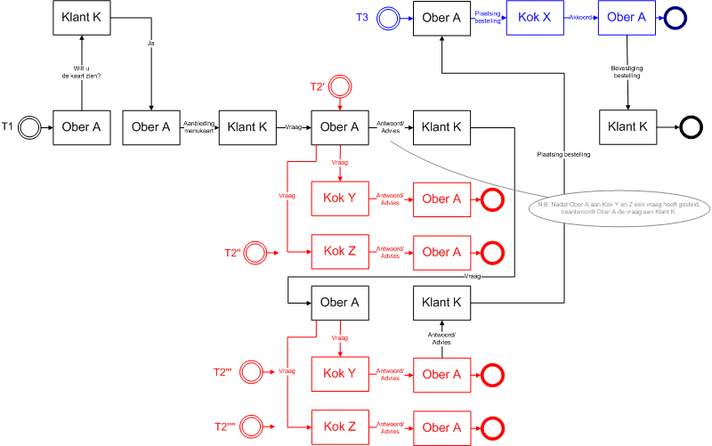

*Beschrijving*

Ober A vraagt aan Klant K of hij/zij de kaart wil zien. Klant K beantwoordt de vraag met Ja, en geeft aan welke kaart hij/zij wil zien.

Ober A biedt de menukaart aan die Klant K gevraagd heeft. Ober A kan het menukaarttype
*niet* wijzigen. Klant K krijgt de gevraagde menukaart. 

Klant K stelt een vraag aan Ober A.

Ober A stelt een vraag aan Kok Y en Z. (In de vraagstelling kan Ober A de vraag <em>
niet</em> aanpassen.) 

De beantwoording van Kok Y en Z laat op zich wachten. Ober A beantwoordt de vraag van Klant K. (In de beantwoording kan Ober A de vraag van Klant K
<em>niet</em> aanpassen.) 

Klant K stelt een tweede vraag aan Ober A. (In de vraagstelling kan Klant K de vraag
*niet* invullen, omdat in het raamwerk de ElementCondition <em>geen</em> waarde voor condition heeft!!!)

Ober A stelt een tweede vraag aan Kok Y en Z. (In de vraagstelling kan Ober A de vraag
*niet* aanpassen.) 

Kok Y beantwoordt de eerste vraag van Ober A. Ober A kan met de ontvangen melding van Kok Y
*helemaal niets*, dus niet communiceren richting Kok Y of Klant K. 

Kok Z beantwoordt de eerste vraag van Ober A. Ober A kan met de ontvangen melding van Kok Z
*helemaal niets*, dus niet communiceren richting Kok Z of Klant K. 

Kok Y beantwoordt de tweede vraag van Ober A. (In de beantwoording kan Kok Y de vraag van Ober A
<em>niet</em> aanpassen.) 

Ober A beantwoordt de vraag van Klant K. (In de beantwoording kan Ober A het antwoord van Kok Y
<em>niet</em> aanpassen.)

Nadat Ober A naar Klant K heeft gecommuniceerd geeft Kok Z alsnog een antwoord aan Ober A op de tweede vraag. Ober A kan met de ontvangen melding van Kok Z *helemaal niets*, dus niet communiceren richting Kok Z of Klant K. 

Klant K plaatst een compleet nieuwe bestelling bij Ober A bestaande uit een tabel met per rij de naam van een gerecht en eventueel een bijbehorende opmerking. (Klant K kan de gehele tabel invullen.)

Ober A plaatst dezelfde bestelling bij Kok X. Ober A kan de bestelling van Klant K niet aanpassen, en ook niet aanvullen.

Kok X geeft Ober A een akkoord. Kok X kan de bestelling van Ober A niet aanpassen, en ook niet aanvullen.

Ober A geeft Klant K een akkoord. Ober A kan het akkoord van Kok X niet aanpassen, en ook niet aanvullen.

### Scenario 6a

*Doel*

Testen op de functionaliteit voor een (hoofd)transactie met twee lagen van (sub)transacties.

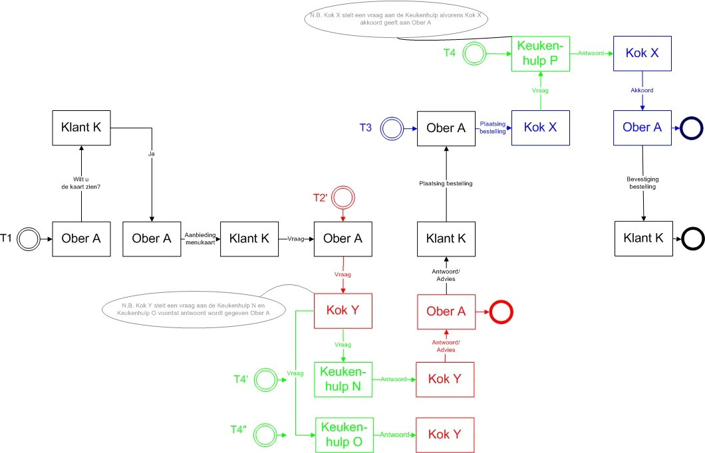

*Beschrijving*

Ober A vraagt aan Klant K of hij/zij de kaart wil zien. Klant K beantwoordt de vraag met Ja, en geeft aan welke kaart hij/zij wil zien.

Ober A biedt de menukaart aan die Klant K gevraagd heeft. Ober A kan het menukaarttype
*niet* wijzigen. Klant K krijgt de gevraagde menukaart.

Klant K stelt een vraag aan Ober A. 

Ober A stelt een vraag aan Kok Y. (In de vraagstelling kan Ober A de vraag <em>niet</em> aanpassen.)

Kok Y stelt en vraag aan twee keukenhulpen (Keukenhulp N en Keukenhulp O) 

Keukenhulp N geeft antwoord aan Kok Y. 

Keukenhulp O geeft antwoord aan Kok Y. 

Kok Y geeft antwoord aan Ober A als hij een antwoorden van Keukenhulp N en/of O heeft gekregen.

Ober A geeft vervolgens antwoord aan Klant K. 

Klant K is tevreden over het antwoord en plaats zijn/haar bestelling bij Ober A. 

Ober A plaats de bestelling bij Kok X 

Kok X vraagt Keukenhulp P of hij/zij het recept kan opzoeken. 

Keukenhulp P zoekt het recept op en geeft antwoord aan Kok X 

Kok X heeft nu het recept en kan akkoord geven aan Ober A 

Ober A bevestigt de bestelling aan Klant K

### Scenario 7a

*Doel*
Met dit scenario wordt de juiste werking van de volgordelijkheid van berichten en (sendBefore en sendAfter); functionaliteit getest.

<ul>
<li>De ober stuurt een bestelling naar de kok(T3).
<ul>
<li>Hier mag maar 1 van de aanwezige koks gekozen worden. </li><li>De ober mag hierna niet nog een bestelling naar de kok sturen </li></ul>
</li><li>De kok stuurt een vraag aan de keukenhulp (T4). Dit kan op basis van de vraag van de ober (T2), of de bestelling van de ober (T3).
</li><li>De keukenhulp stuurt een antwoord in T4. De kok moet nu kunnen kiezen uit de volgende opties:
<ul>
<li>Als het op basis van een vraag van de ober(T2) was kan hij kiezen uit:
<ul>
<li>Het antwoord doorsturen naar de ober in T2 </li><li>Een nieuwe vraag stellen in T4 </li><li>Melden dat het antwoord niet gebruikt wordt in T4. </li></ul>
</li><li>Als het op basis van een bestelling van de ober was, kan hij kiezen uit:
<ul>
<li>Een akkoord of niet akkoord bericht naar de ober in T3 </li><li>Een nieuwe vraag stellen in T4 </li><li>Melden dat het antwoord niet gebruikt wordt in T4 </li></ul>
</li></ul>
</li><li>Zodra de kok een antwoord naar de ober verzonden heeft in T2 of T3:
<ul>
<li>Kan de kok geen nieuwe vraag meer naar de keukenhulp sturen in T4 </li><li>Kan hij iedere keer nog maar 1 afsluitend bericht naar de keukenhulp sturen in T4. Dit bericht correspondeert met het bericht dat naar de ober ging in T2 of T3.
</li></ul>
</li></ul>

### Scenario 8

*Doel*

Met dit scenario wordt de juiste werking van het Definiëren van het aantal rijen in een tabel functionaliteit getest. (minOccurs/maxOccurs op child CE)

*Beschrijving*
<ul>
<li>Alleen transactie (T1)
<ul>
<li>Ober stuurt de vraag aan de klant of hij de menukaart wil zien </li><li>Klant antwoordt "Ja"</li><li>Ober stuurt het bericht "Menukaart"
<ul>
<li>Bij de de tabel Menukaart; testen dat er niet meer dan 3 ingevuld mogen worden en dat hij leeg verzonden kan worden.
</li></ul>
</li><li>Klant antwoordt met "Bestelling"
<ul>
<li>Bij de tabel "Inhoud van de bestelling"; testen dat er 1 of meer regels ingevuld moeten worden en dat leeg verzenden niet moet kunnen.
</li><li>Bij de tabel "Inhoud drankbestelling" testen dat er verplicht 1 regel ingevuld moeten worden en dat leeg of meer dan 1 regel niet mag.
</li></ul>
</li></ul>
</li></ul>

### Scenario 9
*Doel:* 

Testen op de functionaliteit voor het verplicht bijvoegen van een bijlage voor een berichttype (appendixMandatory).

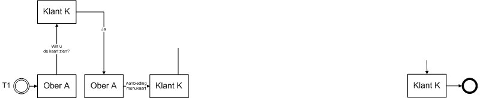

*Beschrijving:*

Ober A vraagt aan Klant K of hij/zij de kaart wil zien. Klant K beantwoordt de vraag met Ja, en geeft aan welke kaart hij/zij wil zien.

  
Ober A biedt de menukaart aan die Klant K gevraagd heeft, ZONDER bijlage.

Ober A kan de menukaart NIET aanbieden aan Klant K, omdat hij een bijlage is vergeten toe te voegen.

Vervolgens biedt Ober A de menukaart aan die Klant K gevraagd heeft, MET bijlage.

Ober A kan de menukaart aanbieden aan Klant K, omdat hij een bijlage heeft toegevoegd.

Klant K ontvangt menukaart met bijlage.

### Scenario 10
*Doel:*

Testen op de Element conditions in tabellen (Ce normaal / CE parent / CE Child); Sys 1.6 en hoger

*Beschrijving:*
<ul>
<li>De ober biedt de menukaart aan </li><li>Klant zegt "ja" </li><li>Ober vult het menukaart bericht als volgt:
<ul>
<li>Menukaart (bovenste tabel, controleer dat deze naam "Menukaart" van het CE leesbaar is).
<ul>
<li>Vul 2 regels in, alle cellen moeten waarden bevatten. </li></ul>
</li><li>Dagmenu (middelste tabel, controleer dat deze naam "Dagmenu" van het CE leesbaar is).
<ul>
<li>Vul 2 regels in, alle cellen moeten waarden bevatten. </li></ul>
</li><li>Drankenkaart (onderste tabel tabel, controleer dat deze naam "Drankenkaart" van het CE leesbaar is).
<ul>
<li>Vul 2 regels in, alle cellen moeten waarden bevatten. </li></ul>
</li></ul>
</li><li>Klant reageert met het bericht "vraag";
<ul>
<li>In de "Menukaart" tabel controleer je:
<ul>
<li>Of de naam van het CE "Menukaart" zichtbaar is </li><li>De waarden in de kolom Omschrijving en Prijs moeten aan te passen zijn, eerste kolom is niet aanpasbaar. [Naam default fixed / Omschr; se free in deze parent ce (5)/Prijs se free in child ce (3)]
</li><li>Er kunnen <strong>geen</strong> regels verwijderd of toegevoegd worden </li><li>Maak de onderste cel "Omschrijving" leeg ter voorbereiding op de volgende contole.
</li></ul>
</li><li>In de "Dagmenu" tabel controleer je:
<ul>
<li>Of de naam van het CE &ldquo;Dagmenu&rdquo; zichtbaar is </li><li>Alleen de kolom Naam is nog gevuld en is aanpasbaar. De andere 2 kolommen zijn leeg. [Parent CE dagmenu EMPTY (4)/Naam se FREE in mitt, parent, child, se(15)/Prijs&nbsp; free in child (3)]
</li><li>Er kunnen <strong>wel</strong> regels verwijderd of toegevoegd worden </li></ul>
</li><li>In de &ldquo;Drankenkaart&rdquo; tabel controleer je:
<ul>
<li>Of de naam van het CE &ldquo;Drankenkaart&rdquo; zichtbaar is </li><li>De kolommen naam en omschrijving zijn aanpasbaar, de kolom prijs is niet aanpasbaar [FREE op parent en child CE (6) / fixed op parent ce, child CE en SE prijs (7)]
</li><li>Er kunnen <strong>geen</strong> regels verwijderd of toegevoegd worden. </li></ul>
</li><li>Verstuur het bericht </li></ul>
</li><li>Ober reageert met het bericht &ldquo;Antwoord&rdquo;
<ul>
<li>Contoleer:
<ul>
<li>er kunnen <strong>geen</strong> regels verwijderd of toegevoegd worden [FREE op child en parent in verkeerde volgorde dus geen geldige conditie. Inhoud van de menukaart moet parent zijn en menukaart moet child zijn om deze conditie werkend te hebben. (nvt)]
</li></ul>
</li></ul>
</li></ul>

### Scenario 11
Doel:

Testen op niet-ascii tekens in a) omschrijving van elementen (SimpleElementType, ComplexElementType, MessageType, TransactionType) en b) enumeratie (UserDefiniedTYpe).

Beschrijving:

Ober A start een nieuwe transactie en verstuurd een bericht naar Klant K. In het bericht vult Ober A voor element "Enumeration / Keuzelijst" de waarde "eaiou with circumflexes: êâîôû" in.

Resultaat:

Aan Ober A worden in het bericht elementen getoond met > en & en € in de omschrijving. Het element Enumeration / Keuzelijst toont een lijst met onder andere êâîôûëäïöü<"µ@ç€.

Klant K ontvangt een bericht met voor element "Enumeration / Keuzelijst" de waarde "eaiou with circumflexes: êâîôû"

## Scenario Inlezen van gearchiveerd VISI project

Doel:

Testen op het inlezen van een bestand dat voldoet aan de richtlijn voor het archiveren van VISI projecten

Beschrijving:

Het bestand wordt zonder handmatige voorbewerking ingelezen in de applicatie. Het staat vrij hoe dit ingelezen wordt en door wie.

Met een nabewerking worden openstaande transacties worden geadresseerd aan

Wat te doen met soap servers? Deze moeten eigenlijk aangepast worden om de communicatie verder te kunnen laten lopen.

Resultaat:

Het systeem heeft alle informatie uit het bestand ingelezen, te weten: a) transacties, berichten, bijlagen, b) raamwerken, c) projectspecifieke berichten.

Het systeem kan openstaande transacties verder.

Test Data:

Bestanden zijn op te vragen bij Elisabeth Kloren.

## Archiveren en weer activeren van projecten

Scenario 1
* Archiveer een VISI-Project;
* Importeer het gearchiveerde VISI-Project in een andere VISI-omgeving;
* Vergelijk het originele project met het opnieuw opgebouwde project. 

Testresultaat:
* De inhoud van beide projecten, inclusief raamwerken, project specifieke berichten, transacties, berichten, bijlagen etc moet exact gelijk zijn. 
* Eventueel na aanpassing van het soap adres moet communicatie met het project mogelijk zijn

## Scenario Archiveren van VISI project

Doel:

Testen op het aanmaken van een bestand dat voldoet aan de richtlijn voor het archiveren van VISI projecten

Beschrijving:

Een project wordt gearchiveerd (vanuit de applicatie). Het staat vrij hoe dit "archief" aangemaakt wordt en door wie.

Het project moet over de volgende eigenschappen beschikken:

Transactie met een onderwerp langer van 256 karakters.

Transactie met in het onderwerp niet alfa-numerieke karakters.

Bijlage met een naam langer van 256 karakters.

Resultaat:

Het systeem heeft informatie uit het project uitgeschreven, te weten: alle a) transacties, berichten, bijlagen, b) raamwerken, c) projectspecifieke berichten. De structurering van de data is conform de richtlijn.

Speciale aandacht verdienen niet-ascii tekens in het onderwerp van een transactie, die niet toegestaan zijn in namen van een Microsoft Windows directory (bijvoorbeeld /\: ). Deze karakters moeten in de directory benamingen terugkomen als spaties.

## Scenario HTTPS test

Het projectspecifiek bericht wordt voorzien van een SOAP Server met http.

Verwacht resultaat: 
Het projectspecifiek bericht wordt niet ingelezen/geweigerd.

Sample Data: 
Het projectspecifiek bericht "projectspecifiekberichttotenmetbericht_6.xml".

## Scenario Grote bijlagen

Bij een bericht wordt een zip bestand van 10gb gevoegd. Dit bericht wordt via soap naar een andere server verzonden.

Verwacht resulataat:  
Het bericht met de bijlage wordt correct verzonden, de bijlage is op de andere server uit te pakken en de uit de zip gehaalde bestanden zijn leesbaar.

Sample Data: 
Ter plekke kan een zip bestand worden aangemaakt.

## Scenario HTTPS
Doel:

Testen op het afdwingen van beveiligde communicatie

Beschrijving:

1. Van een bestaand project wordt het projectspecifiek bericht aangepast. Het adres van de soap server wordt gewijzigd van https:// in http://.

2. Het aangepaste projectspecifiek bericht wordt ingelezen in de applicatie.

Verwachte resultaat:

De applicatie weigert het projectspecifieke bericht, en de xml-bestand wordt niet ingelezen / geactiveerd.

Test Data:

Het projectspecifiek bericht "projectspecifiekberichttotenmetbericht_6.xml".

## Scenario Bijlagen >2GB
Doel:

Testen op het verzenden en ontvangen van bijlagen groter dan 2GB en kleiner dan 10GB

Beschrijving:

1. Bij een nieuw bericht wordt een zip-bestand van 9,9 GB gevoegd. In het zip-bestand zit minimaal een pdf.

2. Het bericht wordt verstuurd en gaat via het soap protocol naar een externe server.

3. Het bericht wordt ontvangen op de externe server. En het bericht bevat het zip-bestand als de bijlage.

Verwachte resultaat:

De bijlage is een zip-bestand en op de externe server uit te pakken. De bestandsgrootte op verzendende en ontvangende server zijn gelijk (in bytes). Het uit de zip gehaalde pdf-bestand heeft op beide servers dezelfde grootte (in bytes). Tevens is het pdf-bestand te openen op de ontvangende server met een applicatie, en is de inhoud overeenkomstig met het pdf-bestand op de verzendende server.

Test Data:

Voorafgaand aan het uitvoeren van het testscenario kan een zip-bestand worden samengesteld met minimaal 1 pdf-bestand.

## Testscenario's metaraamwerk

### Scenario A.1 (meta-raamwerk)
Doel:

Testen op de functionaliteit voor het initiëren van een project met het meta-raamwerk.

Prerequisite:

VISI Project met meta-raamwerk & meta-projectspecifiek bericht
raamwerk
projectspecifiek bericht

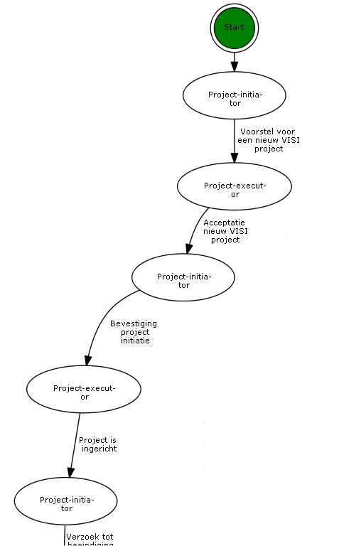

Beschrijving:

Project-initiator biedt aan Project-executor een voorstel voor een nieuw VISI project aan met als bijlagen een nieuw raamwerk en projectspecifiek bericht. Project-executor beantwoordt het voorstel met acceptatie van het nieuwe VISI project. Project-initiator bevestigt de projectinitiatie aan Project-executor. Project-executor meldt terug aan Project-initiator dat het project ingericht is.

Einde

Expected result:

...

 

## Scenario A.2 (meta-raamwerk)
Doel:

Testen op de functionaliteit voor het beëindigen van een project met het meta-raamwerk.

Prerequisite:

VISI Project met meta-raamwerk & meta-projectspecifiek bericht

VISI Project met raamwerk & projectspecifiek bericht

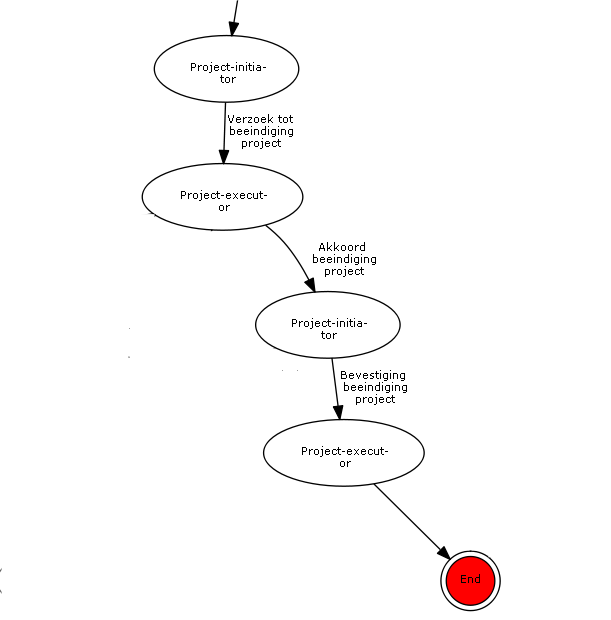

Beschrijving:

Project-initiator biedt aan Project-executor een voorstel voor een nieuw VISI project aan met als bijlagen een nieuw raamwerk en projectspecifiek bericht. Project-executor beantwoordt het voorstel met acceptatie van het nieuwe VISI project. Project-initiator bevestigt de projectinitiatie aan Project-executor. Project-executor meldt terug aan Project-initiator dat het project ingericht is.

Einde

Expected result:

...

 

## Scenario B (meta-raamwerk)
Doel:

Testen op de functionaliteit voor het actualiseren van een bestaand project met het meta-raamwerk.

Prerequisite:

VISI Project met meta-raamwerk & meta-projectspecifiek bericht

VISI Project met raamwerk & projectspecifiek bericht

gewijzigd raamwerk

gewijzigd projectspecifieke bericht

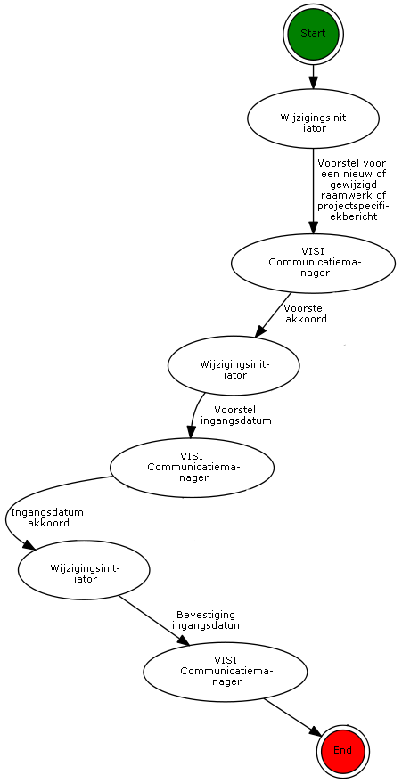

Beschrijving:
Wijzigingsinitiator biedt aan VISI Communicatiemanager een voorstel voor het wijzigen van een bestaand VISI project aan met als bijlagen een gewijzigd raamwerk en een gewijzigd projectspecifiek bericht. VISI Communicatiemanager beantwoordt het voorstel met akkoord. Wijzigingsinitiator bevestigt de voorgestelde wijziging met een voorstel van een ingangsdatum en -tijdstip aan VISI Communicator. VISI Communicator beantwoordt het voorstel met akkoord. Wijzigingsinitiator bevestigt de ingangsdatum en -tijdstip.

Einde

Expected result:

...
