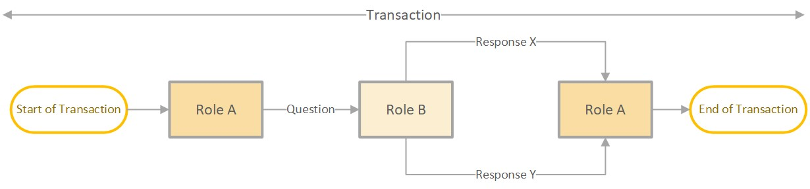

# Conceptual

## User perspective

For VISI application users, VISI functions as an inbox or taskmanager,
displaying which messages require responses, what responses are
anticipated, and agreed-upon deadlines.

### Execution

**Send messages and keep appointments**\

1.  **VISI focuses on fulfilling agreements.**\
    Users can easily identify their required actions and initiate
    message flows for specific transactions if they have the correct
    role. They can also view response options and anticipate incoming
    messages.

2.  **It is clear whether a message has arrived.**\
    Due to the agreed-upon message traffic protocol, users can confirm
    message delivery.

3.  **Transferring work to a new employee is seamless.**\
    Because an employee has a role, a successor can be appointed during
    a collaboration. From that moment on, this successor takes over the
    message flow. It is expected of a VISI application that the
    successor also has the messages of the predecessor available.

4.  **The communication can be found, without mutual dependence.**\
    If several organisations work together, they can each use their own
    VISI software. Due to the implemented message traffic protocol, two
    people in different organisations each have access to the
    information within their own organisation and the message traffic at
    the intersection of the other organisation in their own VISI
    software.

5.  **With VISI, changes in the collaboration agreements are always
    traceable.**\
    During the project, the agreements about the workflow, message
    content, roles and responsibilities can be changed.

### Preparation

**Flexibility of VISI in making collaboration agreements**

1.  **Agreeing on tasks and responsibilities in advance clarifies
    expectations.** During collaboration preparation, roles and tasks
    are agreed upon.

2.  **Agreeing on communication flows in advance allows you to
    anticipate responses and decisions.** During the preparation of a
    collaboration, it is important to determine the roles of each team
    member and their communication channels. This includes deciding on
    the message flow and the type of information that is expected from
    each other. By setting agreements and expectations beforehand,
    everyone involved is aware of their responsibilities and can work
    more effectively. Moreover, it is essential to decide on the content
    of each message, including any attachments that need to be shared.
    This ensures that the messages are clear, concise, and relevant to
    the collaboration.

3.  **Parties have the freedom to shape the cooperation as desired.**
    VISI is very flexible: The parties have the freedom to structure the
    collaboration as is suitable for their project. VISI standardises
    the way in which you digitally record roles, workflows and messages.
    This requires software packages to be prepared to be able to read
    and activate these flexible agreements per project or collaboration
    so that VISI-based communication can be started.

## VISI structures

In order to allow the exchange of information to take place in a
structured manner, digital communication agreements have been
established within VISI. The ease of use is comparable to, for example,
sending e-mails or offering documents on a shared SharePoint
environment. The difference is that the contents of the messages are
predefined. For example, a message contains editable fields such as a
form. The sender can add attachments to the messages. At the end of a
project, it is still clear which version of an attachment/file has been
approved and which ones have been denied.\
\
It is also considered in advance who communicates with each other based
on which responsibility. This is expressed in so-called roles.\
\
Workflows take place between those roles to achieve a certain result.
For this we use the term 'transaction'. We record all of this in a model
called the VISI framework. During the implementation phase, project
participants can focus on communication content rather than contract
agreements.

-   Be sure that you are in the right place at the right time correct
    process.

-   Immediately see what information is available (who already said
    something)

-   Immediately see what information is needed and how it is done
    process continues

-   Immediately see how much time you have to respond

-   Know that you are the right person participates in the process

-   Certainty that everything is done with the right mandate handled
    with digital signature

-   Certainty that everything is secured for the future in accordance
    with archive law

### Examples of a project by means of VISI

Example 1: Construction project\
In this example, the interaction starts with the Contractor (project
provider). The Client may reject or approve the proposal with a request
for a quote. If the Contractor receives a rejection, the process to
record a contract change is terminated. If the proposal is approved, the
Contractor will provide an offer with the consequences of the contract
amendment. After this, the Client can again send a rejection or
acceptance, after which the contract change is stopped or accepted,
respectively.

{#fig:bouwproject1
width=".7\\textwidth"}

Example 2: Pizzeria\
In this example, the interaction starts with the Waiter. The Customer
has a limited number of response options. If the Customer does not wish
to see a menu, the interaction will stop. If the Customer does want to
see a menu, the transaction continues. The scope of this transaction is
placing an order. For example, another transaction would be that the
Customer asks for the bill to the Waiter, after which the Waiter brings
the bill.

{#fig:pizzaria1
width=".7\\textwidth"}

Example 3: Pizzeria\
The waiter places the order with the cook. The Cook can accept or refuse
the order. Depending on the response of the Cook, a response is given to
the Customer. For example, a question about order. It is structured in
such a way that the Customer cannot communicate directly with the Cook.

{#fig:pizzaria2
width="70%"}

## VISI terminology

### Role

Various responsibilities and associated tasks occur within
(construction) projects and forms of cooperation. Think of a simple
agreement with a Contractor and Client with agreed tasks and
responsibilities. These responsibilities with associated tasks are
bundled into logical roles. The concept of how parties interact and the
agreement they have with each other influences the distribution of roles
among the parties.

A role is fundamentally different from a function. An essential
difference is that roles are a reflection of the work being organised,
while functions are a reflection of people being organised (in an
organisation). A VISI project does not have the function of Head of
Department, but does have the roles of Assessment, Advisory.

### Message

Messages are a means of transferring or transferring information
exchange data. The message name equals a certain status, depending on
the position within a process (delivery document, or a rejection). A
message consists of several fields, depending on the information
required. Some parts of a message are fixed, such as the sender and the
time of sending.

{#fig:messaging width="100%"}

**Information in a message**\
The content of a message can be compared to a form with fields. Such as:
text fields, dates, amounts, Yes/No, list boxes, and/or tables. This is
where inheritance takes place. In principle, data entered from a
previous message will be sent in a subsequent message, unless a
so-called condition has been included in the framework.\
**Appendices and meta information**\
One or more appendices can be added to VISI messages. This is very
similar to an 'attachment' of an email. An important difference,
however, is that an appendix of a VISI message can be provided with META
data. These elements can be predefined. Think, for example, of the
version number, document date, status, etc. For example, the META data
that are necessary in an organisation-specific document management
system can be taken into account.\
**Appendices (one or more)**\
Because appendices are added to a message, an appendix can always be
placed in context afterwards. When was the appendix sent and with what
state?

1.  Approved/Rejected/Notification

2.  Draft/Definitive

3.  Date/Version

**Message sequence**\
The messages are not only fillable, but the sequence of the messages is
also predetermined. After receiving a message, you can usually choose
one or more answers. In this way it is determined in advance what the
communication will look like and also how the course will proceed. In
other words, the workflow is fixed.

### Transaction

The messages are also grouped by subject and thus always form small
procedures. Procedures, ie the subject about which one wants to
communicate, can in general always be chosen independently of each
other. In VISI we call such a procedure a transaction. The word
transaction here refers to 'an agreement'. A transaction can be a
request to do or deliver something. Often on the basis of pre-arranged
agreements.

{#fig:transaction
width="50%"}

Within VISI, the so-called transaction is central: a binding agreement
between two roles that agree on what must be done. In practice, a
transaction is a series of messages between two roles, resulting in a
certain result.\
The framework defines which order of messages can be used when
communicating about the transaction. The order of messages always goes
back and forth between roles: after a message from role A always follows
a message from role B, after which it is role A's turn again, until the
end of the transaction.\
Example 4: Construction project\
Think, for example, of Ask from role A to role B to assess something.
The framework provides the messages that can be used as a response. In
the picture, this is message X or message Y.

{#fig:bouwproject2
width="100%"}

Example 5: Construction project\
The Projectprovider submits a document for approval, as agreed in the
contract. The Client may reject the document, after which a new document
will be submitted. If the Client approves the document for approval, the
transaction is completed.

{#fig:bouwproject3
width="70%"}

Example 6: Construction project\
The Project provider must submit a document for approval as agreed in
the contract. The Client wishes to ask one or more advisers to assess
the document. We call this a connected transaction or sub-transaction.
This transaction again takes place between two roles (no more, no less).

{#fig:bouwproject4
width="80%"}

Example 7: Pizzeria\
Another example is a waiter's request to a cook to prepare a certain
pizza (Ask), after which the cook goes to work and the relevant pizza is
reported to the waiter as ready (Answer X) or it is reported that the
pizza is ready. ingredients are not available (Answer Y) after which the
transaction is completed.

## Communicating based on a VISI framework {#sec:VisiFrameworkCommunication}

The whole of descriptions of roles, transactions, messages and data,
which comprise the agreements and/or communication that can and may be
used in a project/collaboration, is called a framework. In order to be
able to communicate on the basis of a VISI framework, a number of things
need to be set.\
**Project specific message**\
The project-specific message puts the framework in the context of a
project. This means that this file indicates which specific project
and/or contract the framework represents. It also determines which
persons from which organisation participate in the project in which
role(s).\
**Connecting persons to roles**\
In VISI, responsibilities and tasks are not assigned to parties or
persons, but to "roles". This was done because, for example, in
construction projects the same "roles" always appear, but parties can
often change roles.\
Think of a situation in which a Client wants to have certain
responsibilities and tasks fulfilled by an engineering firm or a
situation in which a pizzeria does not have the delivery done by its own
deliverers, but concludes a contract with an external party such as
Deliveroo or Uber eats. A person can be associated with an organisation
and a role using the project-specific message. But several people can
also be linked to a role and a person can fulfil several roles. See the
example below for additional explanation.\
Example 8: Pizzeria\
The role of \"waiter\" can be fulfilled by several people. A person can
also be a waiter and dishwasher.

::: {#tab:my_label}
                  Person1   Person2   Person3   Person4   Person5   Person6
  -------------- --------- --------- --------- --------- --------- ---------
  Client             X         X                                   
  Waiter                                 X         X               
  Cook                                                       X     
  Kitchen help                                     X         X         X

  : \"Waiter\" role fulfillment
:::

Example 9: Construction project\
In a construction project, the distribution could look like this.

::: {#tab:my_label}
  -------- ------- ---------- ----------- -------------- ------------------- -------------------
  Client   Advi-   Tester/    Project     Organisation   Name                Function
           ser     Accepter   execution                                      
  X                                       OG             Martijn Gerards     Client
  X                                       OG             Marjon van Hagen    Project manager
           X                              OG             WimSchilperoort     Controller
           X                              OG             Hans Lijmbach       Contract manager
           X                              OG             Iris Adegeest       Adviser
                   X                      OG             Mario van Bemmel    Tester
                   X                      OG             Peter Bloemers      Tester
           X       X                      OG             Raj Dhaker          Cost expert
                   X                      OG             Jose de Kwade       Technical Adviser
                              X           ON             Arjen van der Hof   Project leader
                              X           ON             Klaas Slot          Contractor
                              X           ON             Jan van Geest       Planner
  -------- ------- ---------- ----------- -------------- ------------------- -------------------

  : Construction project roles
:::

## Details of the framework

**The framework as a file to read in VISI compatible software**\
The VISI framework is recorded on the basis of the systematic rules in a
file that can be read into VISI-compatible software. This should be done
in combination with the previously discussed project-specific message
and a so-called message schedule with which an extra check can be
performed whether the messages that are sent and received conform to the
rules of the system and the defined framework.\
**Supporting a business process with connected transactions**\
A business process or procedure often involves more than two roles.
However, it is not possible to support an entire business process with a
single transaction between two roles. The standard therefore offers the
possibility to connect transactions with each other. For example, a
business process can be supported using a set of connected
transactions.\
Example 10: Pizzeria\
Think of a customer of the pizzeria who enters into a transaction with a
waiter to obtain a delicious pizza. Based on the transaction with the
customer, the waiter can in turn initiate a transaction towards a cook
to make the pizza. In this example, the customer does not have the
mandate to walk into the kitchen and ask a cook to make the pizza
themselves. The waiter can also not initiate a transaction with the cook
to make a pizza if there is no customer request.\
An important basic principle is that a transaction always yields
something. If a role from one transaction initiates one or more
transactions with another role, something must always come back from
these secondary transactions. A secondary transaction must always end in
the transaction from which it was initiated.\
**Conditions within a transaction**\
In order to enforce certain dependencies in a transaction, conditions
can be set at certain moments when creating a transaction. Think of the
following:

-   Enforce message sequence. This means that messages can only be sent
    after other messages have been received or that messages may only be
    sent when other messages have not yet been received or that a
    message may only be sent once.

-   You may or may not be allowed to initiate multiple secondary
    transactions.

-   You may or may not be allowed to edit or delete certain fields in a
    message at some point in the transaction.

**Can a framework be supplemented or changed during a project?**\
While using a VISI framework in a project or other collaboration, it is
possible to adapt the VISI framework. For example, if business processes
or process requirements change or if predefined elements, such as
selection lists in messages, need to be adjusted.\
A number of things should always be kept in mind, namely:

-   Pending transactions are completed in the version of the framework
    in which they were initiated. This means that a change to a
    framework has no effect on current VISI communication.

-   A new version of the framework must be imported for all project
    partners.
