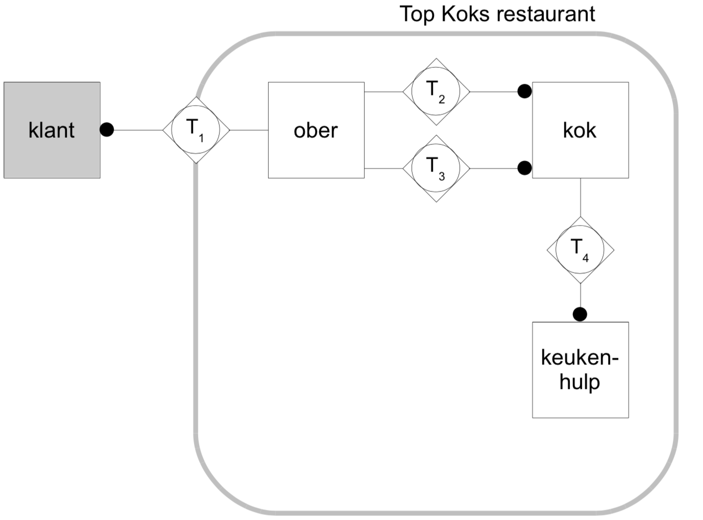
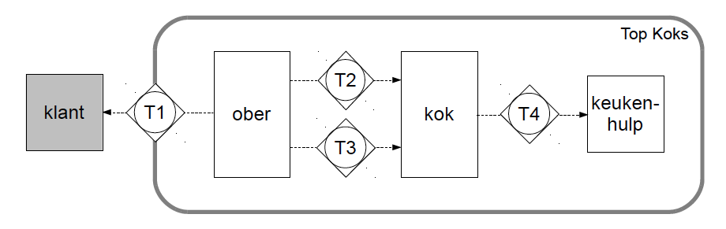
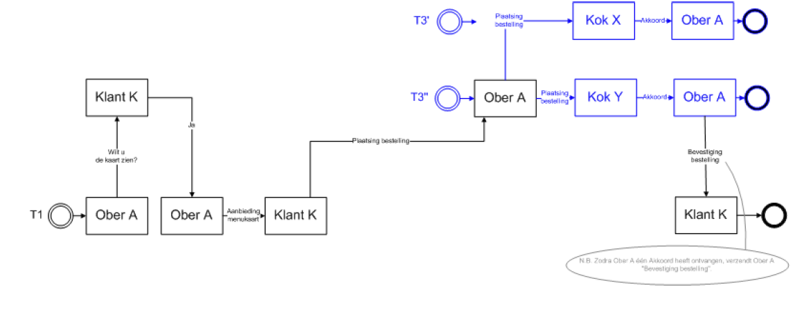
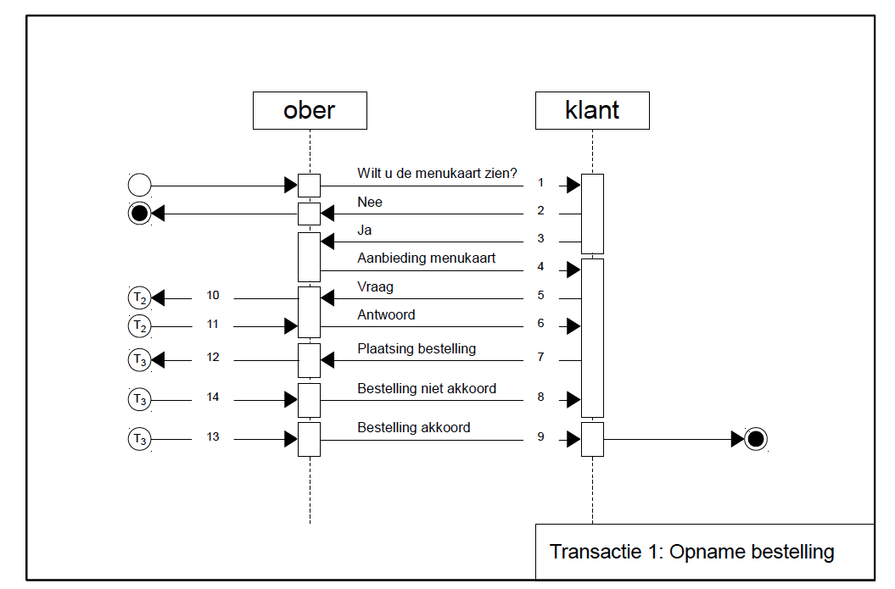
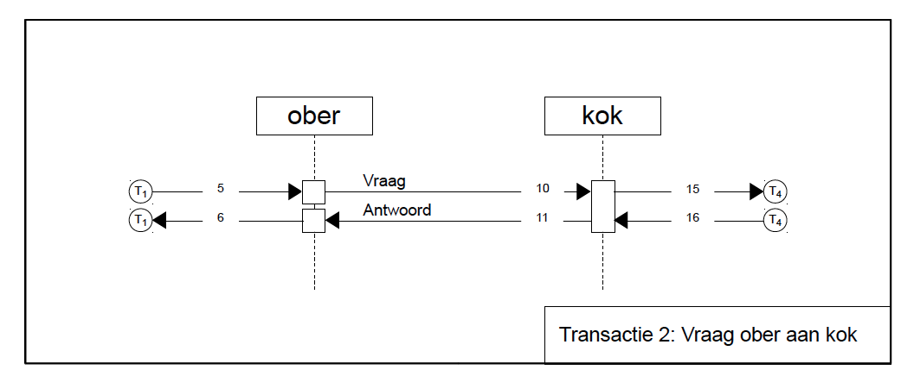
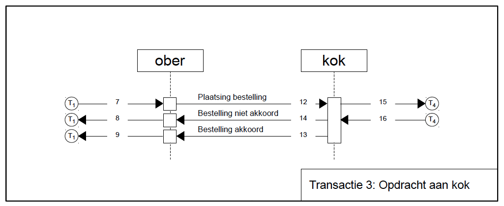
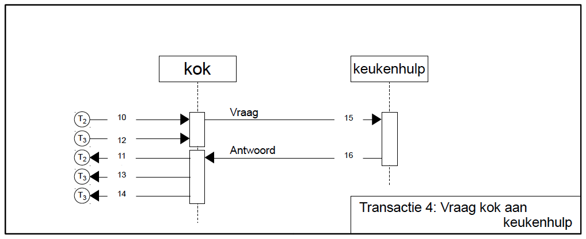
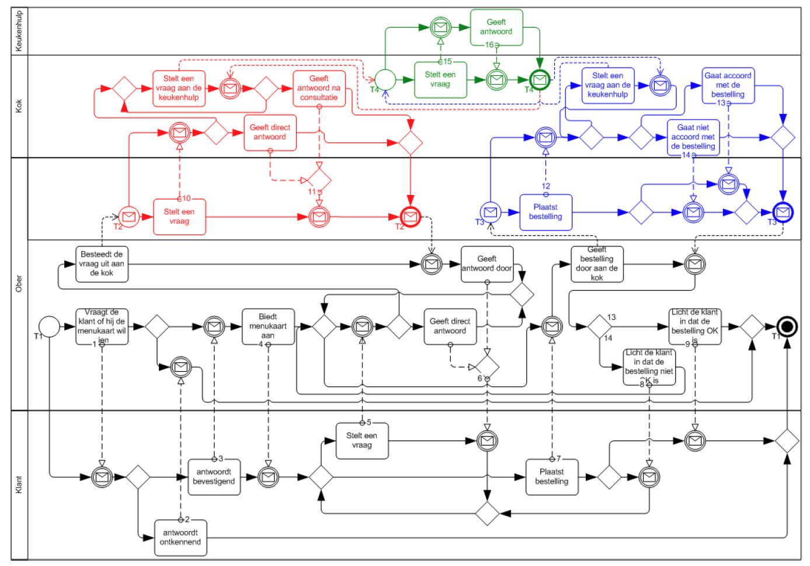
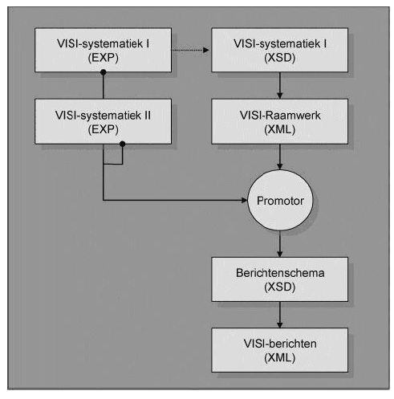

# 4. Implementation using an example

VISI version 1.6

### 4.1 Introduction

The example below forms the common thread in the explanation of the
implementation of VISI. The example was deliberately chosen outside the
scope of construction to reflect the broad applicability of the VISI
system and to prevent possible application dependencies. The example is
introduced here with a general description. The full details are
included in Appendix 4.

### 4.2 Example specialty restaurant

Three well-known specialist chefs work in specialty restaurant De Top
Kok. The restaurant focuses on the discerning culinary consumer.
Customers are interested in food and critical of the end product they
are presented with. Every chef has his or her own specialty. Depending
on the workload and knowledge, they are able to answer customer
questions via the waiter. If the waiter thinks the chef's response is
taking too long, the waiter looks at Wikipedia and comes up with an
answer/advice himself. To prevent misunderstandings between the waiting
staff and the kitchen, it has been agreed that the waiter places orders
with chefs in a formal manner. The cook who first agrees to an order
must execute the order. If all Cooks refuse the order, the customer will
be informed by the waiter that the order is not possible in its current
form. The customer must then resubmit the order to the waiter.



In this example, the processing of an order is translated into VISI
communication. The following roles and transactions are required to
process the order.


  **Role**       **Responsible for:**
  -------------- -----------------------------------
  Customer       placing an order
  Waiter         logistic processing of an order
  Cook           realizing an order
  Kitchen help   answering questions from the Cook

  : Roles


  **Code**   **Name**
  ---------- -----------------------------
  T1         Order recording
  T2         Ask Waiter to Cook
  T3         Kok Assignment
  T4         Ask a Chef for Kitchen Help

  : Transactions


**Communication**


Based on the above roles and transactions, communication can proceed as
follows:

```
Ober $\rightarrow$ Klant        Wilt u de kaart zien?
Klant $\rightarrow$ Ober        Ja graag/Nee, nog niet (transactie eindigt dan).
Ober $\rightarrow$ Klant        Aanbieding menukaart met kaart als bijlage bij het bericht.
Klant $\rightarrow$ Ober        Kan gerecht x ook in variant Y worden bereid?


Ober $\rightarrow$ Kok(s)       Vraag: Kan gerecht x ook in variant Y worden bereid?
Kok(s) $\rightarrow$ Ober       Antwoord/Advies: Ja, maar ik adviseer deze bereidingswijze

Ober $\rightarrow$ Klant        Antwoord/Advies: Het kan maar we adviseren deze bereidingswijze.
Klant $\rightarrow$ Ober        Plaatsing bestelling.

Ober $\rightarrow$ Kok          Plaatsing bestelling.
Kok $\rightarrow$ Keukenhulp    Is dit gerecht nog voorradig?
Keukenhulp $\rightarrow$ Kok    Ja/Nee
Kok $\rightarrow$ Ober          Akkoord/Niet Akkoord.

Ober $\rightarrow$ Klant        Bevestiging bestelling/Bestelling niet mogelijk.
```

The following diagram shows all transactions and messages from the
example in relation to each other. **This diagram guides the test
scenario for VISI compatible software.**


## Appendix 4 Detailed Implementation Example

### Introduction

To properly understand the system, it is important to distinguish
between:

1.  the framework created (agreements regarding what communication is
    possible)

2.  the project specific message (the situation)

3.  the messages (the communication itself)

This appendix is all about the development of a framework under the VISI
system version 1.3.\
\
A framework is made up of three important components:

-   the transaction types

-   the message types

-   the simple elements

This applies to every VISI framework and therefore also to this
framework. A digital version of the framework can be found in the file
'\_7.xml'.\
\
The system itself is laid down in two so-called Express schedules1.
These files have the extension .exp. The first file contains the express
diagram of Systematics Part 1, in which the rules that specifically
apply to VISI frameworks are laid down. A .xsd version that we can use
when setting up a framework can be found in \_3.xsd. The second file
relates to Systematics Part 2. It contains the additional rules that are
specifically important for VISI messages.



### Description of example (file "\_7.xml")

#### Header, reference to the VISI System

The header of the framework refers to the VISI System in the form of an
XML schema (.xsd extension) which forms the basic restriction of this
and every other VISI compliant framework.

```
<?xml version="1.0" encoding="UTF-8" standalone="no" ?> <visiXML_VISI_Systematics xmlns="http://www.visi.nl/schemas/ 20160331">
```

#### ProjectType

The name of the project is recorded in the *ProjectType*. For example,
if this concerns a framework to support land, road and hydraulic
engineering projects based on administrative conditions such as the UAV
or UAV-gc, this can be processed in the id and description. In our case
it is a framework to support a number of operational processes in a
restaurant.

```
<ProjectType id="ProjectType1">
    <namespace>http://www.visi.nl/schemas/20160331/TestFramework</namespace>
    <description>VISI Testscenario's Raamwerk</description>
    <startDate>2009-01-01T00:00:00</startDate>
    <endDate>2010-01-01T00:00:00</endDate>
    <state>active</state>
    <dateLaMu>2009-01-28T00:00:00</dateLaMu>
    <userLaMu>PWI</userLaMu>
    <complexElements>
        <ComplexElementTypeRef idref="CeSOAP"/>
    </complexElements>
</ProjectType>
```

#### PersonType

In order to be able to define a transaction in the message later, we
will now have to define a *PersonType*. A single *PersonType* is
sufficient to create unlimited persons, but it is conceivable that there
are different PersonTypes, each of which allows its own interpretation
of specific personal data. Consider, for example, a categorization into
type: minor, adult and 65+. O.a. to different disciplines. In this
simple example we will limit ourselves to a PersonType and define it as
simply as possible.

```
<PersonType id="StandardPersonType">
    <description>Standard person type</description>
    <startDate>2009-01-01T00:00:00</startDate>
    <endDate>2010-01-01T00:00:00</endDate>
    <state>active</state>
    <dateLaMu>2009-01-28T00:00:00</dateLaMu>
    <userLaMu>PWI</userLaMu>
</PersonType>
```

The id *StandardPersonType* will soon become a message-level object.

#### OrganizationType

In order to be able to define a transaction later, we will now have to
define an OrganizationType. An OrganizationType is sufficient to create
unlimited organizations, but it is conceivable that there are different
OrganizationTypes, each of which allows its own interpretation of
specific organizational data. Consider, for example, a private limited
company, sole proprietorship or public law body. In this simple example
we will limit ourselves to an OrganizationType and define it as simply
as possible.

```
<OrganisationType id="StandardOrganisationType">
    <description>Standard organisation type</description>
    <startDate>2009-01-01T00:00:00</startDate>
    <endDate>2010-01-01T00:00:00</endDate>
    <state>active</state>
    <dateLaMu>2009-01-28T00:00:00</dateLaMu>
    <userLaMu>PWI</userLaMu>
    <complexElements>
        <ComplexElementTypeRef idref="CeOrganisatie"/>
    </complexElements>
</OrganisationType>
```

The id *StandardOrganizationType* will soon become a message-level
object.

#### GroupType

In order to be able to define a transaction in the message, we will now
have to define a *GroupType*. More complex examples will show that there
is a lot of freedom within the system to define the message form.\
One *GroupType* is sufficient to create unlimited groups, but it is
conceivable that there are different *GroupTypes*, each of which allows
its own interpretation of specific group data. In this simple example we
will limit ourselves to a single *GroupType* and also define it as
simply as possible.

```
<GroupType id="StandardGroupType">
    <description>Standard Group Type</description>
    <startDate>2009-01-01T00:00:00</startDate>
    <endDate>2010-01-01T00:00:00</endDate>
    <state>active</state>
    <dateLaMu>2009-01-28T00:00:00</dateLaMu>
    <userLaMu>PWI</userLaMu>
</GroupType>
```

The id *StandardGroupType* will soon become a message-level object.

#### RoleType

We will also have to define the roles that may appear in the
transactions to be defined. In our case we have four transactions
involving four roles. In addition, the role of Cook is fulfilled by
several people. The example contains four *RoleType's*, namely:

1.  Customer

2.  Waiter

3.  Cook

4.  Kitchen helper

The roles are defined in the framework as follows.

```
<RoleType id="keukenhulp">
    <description>Keukenhulp</description>
    <startDate>2009-01-01T00:00:00</startDate>
    <endDate>2010-01-01T00:00:00</endDate>
    <state>active</state>
    <dateLaMu>2009-02-02T00:00:00</dateLaMu>
    <userLaMu>PWI</userLaMu>
</RoleType>

<RoleType id="klant">
    <description>Klant</description>
    <startDate>2009-01-01T00:00:00</startDate>
    <endDate>2010-01-01T00:00:00</endDate>
    <state>active</state>
    <dateLaMu>2009-01-28T00:00:00</dateLaMu>
    <userLaMu>PWI</userLaMu>
</RoleType>

<RoleType id="kok">
    <description>Kok</description>
    <startDate>2009-01-01T00:00:00</startDate>
    <endDate>2010-01-01T00:00:00</endDate>
    <state>active</state>
    <dateLaMu>2009-01-31T00:00:00</dateLaMu>
    <userLaMu>PWI</userLaMu>
</RoleType>

<RoleType id="ober">
    <description>Ober</description>
    <startDate>2009-01-01T00:00:00</startDate>
    <endDate>2010-01-01T00:00:00</endDate>
    <state>active</state>
    <dateLaMu>2009-01-28T00:00:00</dateLaMu>
    <userLaMu>PWI</userLaMu>
</RoleType>
```

We now have a role *customer*, a role *waiter*, a role *cook* and a role
*kitchen assistant*.

#### TransactionPhaseType

The *TransactionPhaseType* is used to indicate in the
*MessageInTransactionType* which phase a transaction is in. The
following transaction states can currently be recognized and are used in
most frameworks:

-   Start

-   Requested

-   Promised/execution

-   Change/hold

-   Notification/ready

-   Accepted/end

The *TransactionPhaseType's* are defined as follows.

```
<TransactionPhaseType id="aanvaardEinde">
    <description>Aanvaard/Einde</description>
    <startDate>2008-05-04T00:00:00</startDate>
    <endDate>2008-05-04T00:00:00</endDate>
    <state>active</state>
    <dateLaMu>2008-05-04T00:00:00</dateLaMu>
    <userLaMu>MMA</userLaMu>
</TransactionPhaseType>

<TransactionPhaseType id="beloofdExecutie">
    <description>Beloofd/Executie</description>
    <startDate>2008-05-04T00:00:00</startDate>
    <endDate>2008-05-04T00:00:00</endDate>
    <state>active</state>
    <dateLaMu>2008-05-04T00:00:00</dateLaMu>
    <userLaMu>MMA</userLaMu>
</TransactionPhaseType>

<TransactionPhaseType id="meldingGereed">
    <description>Melding Gereed</description>
    <startDate>2008-05-04T00:00:00</startDate>
    <endDate>2008-05-04T00:00:00</endDate>
    <state>active</state>
    <dateLaMu>2008-05-04T00:00:00</dateLaMu>
    <userLaMu>MMA</userLaMu>
</TransactionPhaseType>

<TransactionPhaseType id="start">
    <description>Start</description>
    <startDate>2008-05-04T00:00:00</startDate>
    <endDate>2008-05-04T00:00:00</endDate>
    <state>active</state>
    <dateLaMu>2008-05-04T00:00:00</dateLaMu>
    <userLaMu>MMA</userLaMu>
</TransactionPhaseType>

<TransactionPhaseType id="verzocht">
    <description>Verzocht</description>
    <startDate>2008-05-04T00:00:00</startDate>
    <endDate>2008-05-04T00:00:00</endDate>
    <state>active</state>
    <dateLaMu>2008-05-04T00:00:00</dateLaMu>
    <userLaMu>MMA</userLaMu>
</TransactionPhaseType>

<TransactionPhaseType id="wijzigingHold">
    <description>Wijziging/Hold</description>
    <startDate>2008-05-04T00:00:00</startDate>
    <endDate>2008-05-04T00:00:00</endDate>
    <state>active</state>
    <dateLaMu>2008-05-04T00:00:00</dateLaMu>
    <userLaMu>MMA</userLaMu>
</TransactionPhaseType>
```

#### TransactionType

We will define four transactions based on the example. These
transactions include the entire process from requesting the menu to
confirmation that what has been ordered will be delivered. Within a
transaction we always indicate who starts it (the initiator) and who is
being communicated with (the executor). A transaction therefore always
takes place between two roles. Because more than two roles are involved
in the process, it was decided to use three transactions, namely:\
\
T1 Order recording\
T2 Ask Waiter to Cook\
T3 Assignment Cook\
T4 Ask a Chef for Kitchen Help\
\
\
The *TransactionType's* are defined as follows.

```
<TransactionType id="t1_OpnameBestelling">
    <description>T1 Opname van bestelling (ober aan klant)</description>
    <startDate>2009-01-01T00:00:00</startDate>
    <endDate>2010-01-01T00:00:00</endDate>
    <state>active</state>
    <dateLaMu>2011-10-26T00:00:00</dateLaMu>
    <userLaMu>PWi</userLaMu>
    <initiator>
        <RoleTypeRef idref="ober"/>
    </initiator>
    <executor>
        <RoleTypeRef idref="klant"/>
    </executor>
</TransactionType>

<TransactionType id="t2_VraagOberAanKok">
    <description>T2 Vraag (ober aan kok)</description>
    <startDate>2009-01-01T00:00:00</startDate>
    <endDate>2010-01-01T00:00:00</endDate>
    <state>active</state>
    <dateLaMu>2009-01-28T00:00:00</dateLaMu>
    <userLaMu>PWI</userLaMu>
    <initiator>
        <RoleTypeRef idref="ober"/>
    </initiator>
    <executor>
        <RoleTypeRef idref="kok"/>
    </executor>
</TransactionType>

<TransactionType id="t3_OpdrachtKok">
    <description>T3 Opdracht (ober aan kok)</description>
    <startDate>2009-01-01T00:00:00</startDate>
    <endDate>2010-01-01T00:00:00</endDate>
    <state>active</state>
    <dateLaMu>2009-01-31T00:00:00</dateLaMu>
    <userLaMu>PWI</userLaMu>
    <initiator>
        <RoleTypeRef idref="ober"/>
    </initiator>
    <executor>
        <RoleTypeRef idref="kok"/>
    </executor>
</TransactionType>

<TransactionType id="t4_VraagKokAanKeukenhulp">
    <description>T4 Vraag (kok aan keukenhulp)</description>
    <startDate>2009-01-01T00:00:00</startDate>
    <endDate>2010-01-01T00:00:00</endDate>
    <state>active</state>
    <dateLaMu>2011-10-26T00:00:00</dateLaMu>
    <userLaMu>PWi</userLaMu>
    <initiator>
        <RoleTypeRef idref="kok"/>
    </initiator>
    <executor>
        <RoleTypeRef idref="keukenhulp"/>
    </executor>
    <appendixTypes>
        <AppendixTypeRef idref="AppRapport"/>
    </appendixTypes>
</TransactionType>
```

#### MessageType

The content and form of the content that the final messages will contain
is defined within the *MessageType*. As can be seen in the transactions
in the example, a significant number of messages are required. The
messages and their format are defined below. In the same way as with
*PersonType*, *OrganizationType*, *GroupType* and *AppendixType* (this
is not used in this example), we can almost completely customize the
form and content of the messages. put our hand. In some messages we have
not come up with a self-defined form for the message, they are purely
notifications.

```
<MessageType id="msgAanbiedingMenuKaart">
    <description>Menukaart</description>
    <startDate>2009-01-01T00:00:00</startDate>
    <endDate>2010-01-01T00:00:00</endDate>
    <state>active</state>
    <dateLaMu>2009-01-29T00:00:00</dateLaMu>
    <userLaMu>PWI</userLaMu>
    <appendixMandatory>true</appendixMandatory>
    <complexElements>
        <ComplexElementTypeRef idref="CeMenuKaart"/>
        <ComplexElementTypeRef idref="CeDagMenu"/>
        <ComplexElementTypeRef idref="CeDrankenKaart"/>
        <ComplexElementTypeRef idref="CeMenuKaartType"/>
    </complexElements>
</MessageType>

<MessageType id="msgAntwoord">
    <description>Antwoord</description>
    <startDate>2009-01-01T00:00:00</startDate>
    <endDate>2010-01-01T00:00:00</endDate>
    <state>active</state>
    <dateLaMu>2011-10-26T00:00:00</dateLaMu>
    <userLaMu>PWi</userLaMu>
    <complexElements>
        <ComplexElementTypeRef idref="CeVraag"/>
        <ComplexElementTypeRef idref="CeAntwoord"/>
        <ComplexElementTypeRef idref="CeMenuKaart"/>
    </complexElements>
    <appendixTypes>
        <AppendixTypeRef idref="AppTekening"/>
    </appendixTypes>
</MessageType>

<MessageType id="msgAntwoordIsOvergenomen">
    <description>Antwoord is overgenomen in antwoord aan ober</description>
    <startDate>2009-01-01T00:00:00</startDate>
    <endDate>2010-01-01T00:00:00</endDate>
    <state>active</state>
    <dateLaMu>2013-10-24T00:00:00</dateLaMu>
    <userLaMu>Arne</userLaMu>
    <helpInfo>Dit bericht wordt alleen aangeboden als de kok een Antwoord naar de
ober gestuurd heeft.</helpInfo>
    <complexElements>
        <ComplexElementTypeRef idref="CeVraag"/>
        <ComplexElementTypeRef idref="CeAntwoord"/>
    </complexElements>
</MessageType>

<MessageType id="msgAntwoordWordtNietGebruikt">
    <description>Antwoord wordt niet gebruikt</description>
    <startDate>2009-01-01T00:00:00</startDate>
    <endDate>2010-01-01T00:00:00</endDate>
    <state>active</state>
    <dateLaMu>2013-10-24T00:00:00</dateLaMu>
    <userLaMu>Arne</userLaMu>
    <helpInfo>Dit bericht wordt aangeboden zolang de kok nog niet gereageerd heeft
naar de ober. Hiermee sluit hij de transactie af en kan bijvoorbeeld een andere
keukenhulp inschakelen.</helpInfo>
    <complexElements>
        <ComplexElementTypeRef idref="CeVraag"/>
        <ComplexElementTypeRef idref="CeAntwoord"/>
    </complexElements>
</MessageType>

<MessageType id="msgBestellingAkkoord">
    <description>Bestelling: akkoord</description>
    <startDate>2009-01-01T00:00:00</startDate>
    <endDate>2010-01-01T00:00:00</endDate>
    <state>active</state>
    <dateLaMu>2011-10-26T00:00:00</dateLaMu>
    <userLaMu>PWi</userLaMu>
    <complexElements>
        <ComplexElementTypeRef idref="CeBestelling"/>
    </complexElements>
</MessageType>

<MessageType id="msgBestellingIsAfgekeurdOpBasisVanAntwoord">
    <description>Bestelling is afgekeurd op basis van antwoord</description>
    <startDate>2009-01-01T00:00:00</startDate>
    <endDate>2010-01-01T00:00:00</endDate>
    <state>active</state>
    <dateLaMu>2013-10-24T00:00:00</dateLaMu>
    <userLaMu>Arne</userLaMu>
    <helpInfo>Dit bericht wordt alleen aangeboden als de kok een Niet akkoord naar
de ober gestuurd heeft.</helpInfo>
    <complexElements>
        <ComplexElementTypeRef idref="CeVraag"/>
        <ComplexElementTypeRef idref="CeAntwoord"/>
    </complexElements>
</MessageType>

<MessageType id="msgBestellingIsGoedgekeurdOpBasisVanAntwoord">
    <description>Bestelling is goedgekeurd op basis van antwoord</description>
    <startDate>2009-01-01T00:00:00</startDate>
    <endDate>2010-01-01T00:00:00</endDate>
    <state>active</state>
    <dateLaMu>2013-10-24T00:00:00</dateLaMu>
    <userLaMu>Arne</userLaMu>
    <helpInfo>Dit bericht wordt alleen aangeboden als de kok een Akkoord naar de
ober gestuurd heeft.</helpInfo>
    <complexElements>
        <ComplexElementTypeRef idref="CeVraag"/>
        <ComplexElementTypeRef idref="CeAntwoord"/>
    </complexElements>
</MessageType>

<MessageType id="msgBestellingNietAkkoord">
    <description>Bestelling: niet akkoord</description>
    <startDate>2009-01-01T00:00:00</startDate>
    <endDate>2010-01-01T00:00:00</endDate>
    <state>active</state>
    <dateLaMu>2011-10-26T00:00:00</dateLaMu>
    <userLaMu>PWi</userLaMu>
    <complexElements>
        <ComplexElementTypeRef idref="CeBestelling"/>
    </complexElements>
</MessageType>

<MessageType id="msgJa">
    <description>Antwoord: Ja</description>
    <startDate>2009-01-01T00:00:00</startDate>
    <endDate>2010-01-01T00:00:00</endDate>
    <state>active</state>
    <dateLaMu>2009-03-16T00:00:00</dateLaMu>
    <userLaMu>PWI</userLaMu>
    <complexElements>
        <ComplexElementTypeRef idref="CeMenuKaartType"/>
    </complexElements>
</MessageType>

<MessageType id="msgNee">
    <description>Antwoord: Nee</description>
    <startDate>2009-01-01T00:00:00</startDate>
    <endDate>2010-01-01T00:00:00</endDate>
    <state>active</state>
    <dateLaMu>2009-01-29T00:00:00</dateLaMu>
    <userLaMu>PWI</userLaMu>
</MessageType>

<MessageType id="msgPlaatsingBestelling">
    <description>Bestelling</description>
    <startDate>2009-01-01T00:00:00</startDate>
    <endDate>2010-01-01T00:00:00</endDate>
    <state>active</state>
    <dateLaMu>2009-01-31T00:00:00</dateLaMu>
    <userLaMu>PWI</userLaMu>
    <appendixMandatory>false</appendixMandatory>
    <complexElements>
        <ComplexElementTypeRef idref="CeBestelling"/>
    </complexElements>
</MessageType>

<MessageType id="msgVraag">
    <description>Vraag</description>
    <startDate>2009-01-01T00:00:00</startDate>
    <endDate>2010-01-01T00:00:00</endDate>
    <state>active</state>
    <dateLaMu>2009-01-29T00:00:00</dateLaMu>
    <userLaMu>PWI</userLaMu>
    <complexElements>
        <ComplexElementTypeRef idref="CeVraag"/>
        <ComplexElementTypeRef idref="CeMenuKaart"/>
        <ComplexElementTypeRef idref="CeDagMenu"/>
        <ComplexElementTypeRef idref="CeDrankenKaart"/>
    </complexElements>
</MessageType>

<MessageType id="msgWiltuDeKaartZien">
    <description>Wilt u de menukaart zien?</description>
    <startDate>2009-01-01T00:00:00</startDate>
    <endDate>2010-01-01T00:00:00</endDate>
    <state>active</state>
    <dateLaMu>2009-01-28T00:00:00</dateLaMu>
    <userLaMu>PWI</userLaMu>
    <complexElements>
        <ComplexElementTypeRef idref="CeReactieTermijn"/>
        <ComplexElementTypeRef idref="CeBaseTypeTest"/>
    </complexElements>
</MessageType>
```

#### MessageInTransactionType

This is a fairly complex object, which defines how the different
MessageTypes are linked to the different TransactionTypes. It is
possible to link a MessageType to multiple TransactionTypes and also
vice versa: link the same MessageType to a TransactionType more than
once.\
If communication involves multiple transactions (and this communication
must also remain traceable afterwards), then when drawing up the
framework, account must be taken of the possibility that multiple
instances of the second transaction occur during the transition from one
transaction to another. can be started. But in the event that the Waiter
role places an order with several people in the Cook role with T2, we do
not want to have to wait until all transactions T2 have been completed
if we have already received a response from one of the people in the
Cook role. that were initiated based on the msgQuestion message from T1.
We even want to be able to continue with the primary transaction T1
without completing a secondary transaction. In this case, the
OpenSecundaryTransactionsAllowed element should have no value. By
including msgReply as MessageInTransaction6 with both
MessageInTransaction5 and MessageInTransaction11 as previous, the
primary transaction can continue as usual.\
In the case where the Waiter initiates transaction T3 based on
msgPlaceOrder from T1, we want at least one instance of T3 to be
completed before sending the msgOrderAgree. To do this, we set the value
true to OpenSecundaryTransactionsAllowed in MessageInTransactionType.
With MessageInTransaction8 (Order not approved) it is a little more
complicated. Assuming that the order has been placed with more than one
chef, you could reason that if the first chef who responds does not
agree, the waiter can wait to see whether one of the other chefs agrees.
OpenSecundaryTransactionsAllowed = true also applies in that case.\
\
Also note that for the first MessageInTransactionType T2 and T3 the
previous MITT comes from T1. The previous field indicates which MITT
should precede another MITT. This field is not linked to a specific
transaction.\
In the diagram, pay attention to the situation that occurs with
MessageInTransaction6. Based on the Transaction Linking guideline that
was implemented in version 1.2 of the system (see also the explanation
in paragraph 1.2.1 of Appendix 5 to the Guidelines),
MessageInTransaction6 can be sent even though MessageInTransaction10 has
also been sent. The Waiter can therefore continue transaction T1 without
completing transaction T2.













```
<MessageInTransactionType id="BerichtInTransactie1">
    <requiredNotify>0</requiredNotify>
    <dateLaMu>2009-01-28T00:00:00</dateLaMu>
    <userLaMu>PWI</userLaMu>
    <received>true</received>
    <send>true</send>
    <state>active</state>
    <initiatorToExecutor>true</initiatorToExecutor>
    <openSecondaryTransactionsAllowed>false</openSecondaryTransactionsAllowed>
    <firstMessage>true</firstMessage>
    <message>
        <MessageTypeRef idref="msgWiltuDeKaartZien"/>
    </message>
    <transaction>
        <TransactionTypeRef idref="t1_OpnameBestelling"/>
    </transaction>
    <transactionPhase>
        <TransactionPhaseTypeRef idref="start"/>
    </transactionPhase>
    <group>
        <GroupTypeRef idref="StandardGroupType"/>
    </group>
</MessageInTransactionType>

<MessageInTransactionType id="BerichtInTransactie10">
    <requiredNotify>0</requiredNotify>
    <dateLaMu>2009-01-31T00:00:00</dateLaMu>
    <userLaMu>PWI</userLaMu>
    <received>true</received>
    <send>true</send>
    <state>active</state>
    <initiatorToExecutor>true</initiatorToExecutor>
    <openSecondaryTransactionsAllowed>false</openSecondaryTransactionsAllowed>
    <firstMessage>true</firstMessage>
    <message>
        <MessageTypeRef idref="msgVraag"/>
    </message>
    <previous>
        <MessageInTransactionTypeRef idref="BerichtInTransactie5"/>
    </previous>
    <transaction>
        <TransactionTypeRef idref="t2_VraagOberAanKok"/>
    </transaction>
    <transactionPhase>
        <TransactionPhaseTypeRef idref="start"/>
    </transactionPhase>
    <group>
        <GroupTypeRef idref="StandardGroupType"/>
    </group>
</MessageInTransactionType>

<MessageInTransactionType id="BerichtInTransactie11">
    <requiredNotify>0</requiredNotify>
    <dateLaMu>2009-01-31T00:00:00</dateLaMu>
    <userLaMu>PWI</userLaMu>
    <received>true</received>
    <send>true</send>
    <state>active</state>
    <initiatorToExecutor>false</initiatorToExecutor>
    <openSecondaryTransactionsAllowed>true</openSecondaryTransactionsAllowed>
    <message>
        <MessageTypeRef idref="msgAntwoord"/>
    </message>
    <previous>
        <MessageInTransactionTypeRef idref="BerichtInTransactie10"/>
        <MessageInTransactionTypeRef idref="BerichtInTransactie16"/>
    </previous>
    <transaction>
        <TransactionTypeRef idref="t2_VraagOberAanKok"/>
    </transaction>
    <transactionPhase>
        <TransactionPhaseTypeRef idref="aanvaardEinde"/>
    </transactionPhase>
    <group>
        <GroupTypeRef idref="StandardGroupType"/>
    </group>
</MessageInTransactionType>

<MessageInTransactionType id="BerichtInTransactie12">
    <requiredNotify>0</requiredNotify>
    <dateLaMu>2009-01-31T00:00:00</dateLaMu>
    <userLaMu>PWI</userLaMu>
    <received>true</received>
    <send>true</send>
    <state>active</state>
    <initiatorToExecutor>true</initiatorToExecutor>
    <openSecondaryTransactionsAllowed>false</openSecondaryTransactionsAllowed>
    <firstMessage>true</firstMessage>
    <message>
        <MessageTypeRef idref="msgPlaatsingBestelling"/>
    </message>
    <previous>
        <MessageInTransactionTypeRef idref="BerichtInTransactie7"/>
    </previous>
    <transaction>
        <TransactionTypeRef idref="t3_OpdrachtKok"/>
    </transaction>
    <transactionPhase>
        <TransactionPhaseTypeRef idref="start"/>
    </transactionPhase>
    <group>
        <GroupTypeRef idref="StandardGroupType"/>
    </group>
    <conditions>
        <MessageInTransactionTypeConditionRef idref="MC_MaarEenBestellingToegestaan"/>
    </conditions>
</MessageInTransactionType>

<MessageInTransactionType id="BerichtInTransactie13">
    <requiredNotify>0</requiredNotify>
    <dateLaMu>2009-01-31T00:00:00</dateLaMu>
    <userLaMu>PWI</userLaMu>
    <received>true</received>
    <send>true</send>
    <state>active</state>
    <initiatorToExecutor>false</initiatorToExecutor>
    <openSecondaryTransactionsAllowed>true</openSecondaryTransactionsAllowed>
    <message>
        <MessageTypeRef idref="msgBestellingAkkoord"/>
    </message>
    <previous>
        <MessageInTransactionTypeRef idref="BerichtInTransactie12"/>
        <MessageInTransactionTypeRef idref="BerichtInTransactie16"/>
    </previous>
    <transaction>
        <TransactionTypeRef idref="t3_OpdrachtKok"/>
    </transaction>
    <transactionPhase>
        <TransactionPhaseTypeRef idref="aanvaardEinde"/>
    </transactionPhase>
    <group>
        <GroupTypeRef idref="StandardGroupType"/>
    </group>
</MessageInTransactionType>

<MessageInTransactionType id="BerichtInTransactie14">
    <requiredNotify>0</requiredNotify>
    <dateLaMu>2009-01-31T00:00:00</dateLaMu>
    <userLaMu>PWI</userLaMu>
    <received>true</received>
    <send>true</send>
    <state>active</state>
    <initiatorToExecutor>false</initiatorToExecutor>
    <openSecondaryTransactionsAllowed>true</openSecondaryTransactionsAllowed>
    <message>
        <MessageTypeRef idref="msgBestellingNietAkkoord"/>
    </message>
    <previous>
        <MessageInTransactionTypeRef idref="BerichtInTransactie12"/>
        <MessageInTransactionTypeRef idref="BerichtInTransactie16"/>
    </previous>
    <transaction>
        <TransactionTypeRef idref="t3_OpdrachtKok"/>
    </transaction>
    <transactionPhase>
        <TransactionPhaseTypeRef idref="aanvaardEinde"/>
    </transactionPhase>
    <group>
        <GroupTypeRef idref="StandardGroupType"/>
    </group>
</MessageInTransactionType>

<MessageInTransactionType id="BerichtInTransactie15">
    <requiredNotify>0</requiredNotify>
    <dateLaMu>2009-02-02T00:00:00</dateLaMu>
    <userLaMu>PWI</userLaMu>
    <received>true</received>
    <send>true</send>
    <state>active</state>
    <initiatorToExecutor>true</initiatorToExecutor>
    <openSecondaryTransactionsAllowed>true</openSecondaryTransactionsAllowed>
    <firstMessage>true</firstMessage>
    <message>
        <MessageTypeRef idref="msgVraag"/>
    </message>
    <previous>
        <MessageInTransactionTypeRef idref="BerichtInTransactie10"/>
        <MessageInTransactionTypeRef idref="BerichtInTransactie12"/>
        <MessageInTransactionTypeRef idref="BerichtInTransactie16"/>
    </previous>
    <transaction>
        <TransactionTypeRef idref="t4_VraagKokAanKeukenhulp"/>
    </transaction>
    <transactionPhase>
        <TransactionPhaseTypeRef idref="start"/>
    </transactionPhase>
    <group>
        <GroupTypeRef idref="StandardGroupType"/>
    </group>
    <conditions>
        <MessageInTransactionTypeConditionRef idref="MC_GeenVraagAanHulpAlsOberAntwoordHeeft"/>
    </conditions>
</MessageInTransactionType>

<MessageInTransactionType id="BerichtInTransactie16">
    <requiredNotify>0</requiredNotify>
    <dateLaMu>2009-02-02T00:00:00</dateLaMu>
    <userLaMu>PWI</userLaMu>
    <received>true</received>
    <send>true</send>
    <state>active</state>
    <initiatorToExecutor>false</initiatorToExecutor>
    <openSecondaryTransactionsAllowed>false</openSecondaryTransactionsAllowed>
    <message>
        <MessageTypeRef idref="msgAntwoord"/>
    </message>
    <previous>
        <MessageInTransactionTypeRef idref="BerichtInTransactie15"/>
    </previous>
    <transaction>
        <TransactionTypeRef idref="t4_VraagKokAanKeukenhulp"/>
    </transaction>
    <transactionPhase>
        <TransactionPhaseTypeRef idref="aanvaardEinde"/>
    </transactionPhase>
    <group>
        <GroupTypeRef idref="StandardGroupType"/>
    </group>
</MessageInTransactionType>

<MessageInTransactionType id="BerichtInTransactie17">
    <requiredNotify>0</requiredNotify>
    <received>false</received>
    <send>false</send>
    <state>active</state>
    <initiatorToExecutor>true</initiatorToExecutor>
    <message>
        <MessageTypeRef idref="msgAntwoordIsOvergenomen"/>
    </message>
    <previous>
        <MessageInTransactionTypeRef idref="BerichtInTransactie16"/>
    </previous>
    <transaction>
        <TransactionTypeRef idref="t4_VraagKokAanKeukenhulp"/>
    </transaction>
    <group>
        <GroupTypeRef idref="StandardGroupType"/>
    </group>
    <conditions>
        <MessageInTransactionTypeConditionRef idref="MC_AntwoordIsVerstuurd"/>
    </conditions>
</MessageInTransactionType>

<MessageInTransactionType id="BerichtInTransactie18">
    <requiredNotify>0</requiredNotify>
    <received>false</received>
    <send>false</send>
    <state>active</state>
    <initiatorToExecutor>true</initiatorToExecutor>
    <message>
        <MessageTypeRef idref="msgAntwoordWordtNietGebruikt"/>
    </message>
    <previous>
        <MessageInTransactionTypeRef idref="BerichtInTransactie16"/>
    </previous>
    <transaction>
        <TransactionTypeRef idref="t4_VraagKokAanKeukenhulp"/>
    </transaction>
    <group>
        <GroupTypeRef idref="StandardGroupType"/>
    </group>
    <conditions>
        <MessageInTransactionTypeConditionRef idref="MC_AntwoordNietGebruikt"/>
    </conditions>
</MessageInTransactionType>

<MessageInTransactionType id="BerichtInTransactie19">
    <requiredNotify>0</requiredNotify>
    <received>false</received>
    <send>false</send>
    <state>active</state>
    <initiatorToExecutor>true</initiatorToExecutor>
    <message>
        <MessageTypeRef idref="msgBestellingIsAfgekeurdOpBasisVanAntwoord"/>
    </message>
    <previous>
        <MessageInTransactionTypeRef idref="BerichtInTransactie16"/>
    </previous>
    <transaction>
        <TransactionTypeRef idref="t4_VraagKokAanKeukenhulp"/>
    </transaction>
    <group>
        <GroupTypeRef idref="StandardGroupType"/>
    </group>
    <conditions>
        <MessageInTransactionTypeConditionRef idref="MC_AfkeuringIsVerstuurd"/>
    </conditions>
</MessageInTransactionType>

<MessageInTransactionType id="BerichtInTransactie2">
    <requiredNotify>0</requiredNotify>
    <dateLaMu>2009-01-29T00:00:00</dateLaMu>
    <userLaMu>PWI</userLaMu>
    <received>true</received>
    <send>true</send>
    <state>active</state>
    <initiatorToExecutor>false</initiatorToExecutor>
    <openSecondaryTransactionsAllowed>false</openSecondaryTransactionsAllowed>
    <message>
        <MessageTypeRef idref="msgNee"/>
    </message>
    <previous>
        <MessageInTransactionTypeRef idref="BerichtInTransactie1"/>
    </previous>
    <transaction>
        <TransactionTypeRef idref="t1_OpnameBestelling"/>
    </transaction>
    <transactionPhase>
        <TransactionPhaseTypeRef idref="aanvaardEinde"/>
    </transactionPhase>
    <group>
        <GroupTypeRef idref="StandardGroupType"/>
    </group>
</MessageInTransactionType>

<MessageInTransactionType id="BerichtInTransactie20">
    <requiredNotify>0</requiredNotify>
    <received>false</received>
    <send>false</send>
    <state>active</state>
    <initiatorToExecutor>true</initiatorToExecutor>
    <message>
        <MessageTypeRef idref="msgBestellingIsGoedgekeurdOpBasisVanAntwoord"/>
    </message>
    <previous>
        <MessageInTransactionTypeRef idref="BerichtInTransactie16"/>
    </previous>
    <transaction>
        <TransactionTypeRef idref="t4_VraagKokAanKeukenhulp"/>
    </transaction>
    <group>
        <GroupTypeRef idref="StandardGroupType"/>
    </group>
    <conditions>
        <MessageInTransactionTypeConditionRef idref="MC_GoedkeuringIsVerstuurd"/>
    </conditions>
</MessageInTransactionType>

<MessageInTransactionType id="BerichtInTransactie3">
    <requiredNotify>0</requiredNotify>
    <dateLaMu>2009-01-29T00:00:00</dateLaMu>
    <userLaMu>PWI</userLaMu>
    <received>true</received>
    <send>true</send>
    <state>active</state>
    <initiatorToExecutor>false</initiatorToExecutor>
    <openSecondaryTransactionsAllowed>false</openSecondaryTransactionsAllowed>
    <firstMessage>false</firstMessage>
    <message>
        <MessageTypeRef idref="msgJa"/>
    </message>
    <previous>
        <MessageInTransactionTypeRef idref="BerichtInTransactie1"/>
    </previous>
    <transaction>
        <TransactionTypeRef idref="t1_OpnameBestelling"/>
    </transaction>
    <transactionPhase>
        <TransactionPhaseTypeRef idref="verzocht"/>
    </transactionPhase>
    <group>
        <GroupTypeRef idref="StandardGroupType"/>
    </group>
</MessageInTransactionType>

<MessageInTransactionType id="BerichtInTransactie4">
    <requiredNotify>0</requiredNotify>
    <dateLaMu>2009-01-29T00:00:00</dateLaMu>
    <userLaMu>PWI</userLaMu>
    <received>true</received>
    <send>true</send>
    <state>active</state>
    <initiatorToExecutor>true</initiatorToExecutor>
    <openSecondaryTransactionsAllowed>false</openSecondaryTransactionsAllowed>
    <message>
        <MessageTypeRef idref="msgAanbiedingMenuKaart"/>
    </message>
    <previous>
        <MessageInTransactionTypeRef idref="BerichtInTransactie3"/>
    </previous>
    <transaction>
        <TransactionTypeRef idref="t1_OpnameBestelling"/>
    </transaction>
    <transactionPhase>
        <TransactionPhaseTypeRef idref="beloofdExecutie"/>
    </transactionPhase>
    <group>
        <GroupTypeRef idref="StandardGroupType"/>
    </group>
</MessageInTransactionType>

<MessageInTransactionType id="BerichtInTransactie5">
    <requiredNotify>0</requiredNotify>
    <dateLaMu>2009-01-29T00:00:00</dateLaMu>
    <userLaMu>PWI</userLaMu>
    <received>true</received>
    <send>true</send>
    <state>active</state>
    <initiatorToExecutor>false</initiatorToExecutor>
    <openSecondaryTransactionsAllowed>false</openSecondaryTransactionsAllowed>
    <message>
        <MessageTypeRef idref="msgVraag"/>
    </message>
    <previous>
        <MessageInTransactionTypeRef idref="BerichtInTransactie4"/>
        <MessageInTransactionTypeRef idref="BerichtInTransactie6"/>
        <MessageInTransactionTypeRef idref="BerichtInTransactie8"/>
    </previous>
    <transaction>
        <TransactionTypeRef idref="t1_OpnameBestelling"/>
    </transaction>
    <transactionPhase>
        <TransactionPhaseTypeRef idref="wijzigingHold"/>
    </transactionPhase>
    <group>
        <GroupTypeRef idref="StandardGroupType"/>
    </group>
</MessageInTransactionType>

<MessageInTransactionType id="BerichtInTransactie6">
    <requiredNotify>0</requiredNotify>
    <dateLaMu>2011-10-26T00:00:00</dateLaMu>
    <userLaMu>PWi</userLaMu>
    <received>true</received>
    <send>true</send>
    <state>active</state>
    <initiatorToExecutor>true</initiatorToExecutor>
    <openSecondaryTransactionsAllowed>true</openSecondaryTransactionsAllowed>
    <message>
        <MessageTypeRef idref="msgAntwoord"/>
    </message>
    <previous>
        <MessageInTransactionTypeRef idref="BerichtInTransactie5"/>
        <MessageInTransactionTypeRef idref="BerichtInTransactie11"/>
    </previous>
    <transaction>
        <TransactionTypeRef idref="t1_OpnameBestelling"/>
    </transaction>
    <transactionPhase>
        <TransactionPhaseTypeRef idref="beloofdExecutie"/>
    </transactionPhase>
    <group>
        <GroupTypeRef idref="StandardGroupType"/>
    </group>
    <appendixTypes>
        <AppendixTypeRef idref="AppVideo"/>
    </appendixTypes>
</MessageInTransactionType>

<MessageInTransactionType id="BerichtInTransactie7">
    <requiredNotify>0</requiredNotify>
    <dateLaMu>2009-01-31T00:00:00</dateLaMu>
    <userLaMu>PWI</userLaMu>
    <received>true</received>
    <send>true</send>
    <state>active</state>
    <initiatorToExecutor>false</initiatorToExecutor>
    <openSecondaryTransactionsAllowed>false</openSecondaryTransactionsAllowed>
    <message>
        <MessageTypeRef idref="msgPlaatsingBestelling"/>
    </message>
    <previous>
        <MessageInTransactionTypeRef idref="BerichtInTransactie4"/>
        <MessageInTransactionTypeRef idref="BerichtInTransactie6"/>
        <MessageInTransactionTypeRef idref="BerichtInTransactie8"/>
    </previous>
    <transaction>
        <TransactionTypeRef idref="t1_OpnameBestelling"/>
    </transaction>
    <transactionPhase>
        <TransactionPhaseTypeRef idref="meldingGereed"/>
    </transactionPhase>
    <group>
        <GroupTypeRef idref="StandardGroupType"/>
    </group>
</MessageInTransactionType>

<MessageInTransactionType id="BerichtInTransactie8">
    <requiredNotify>0</requiredNotify>
    <dateLaMu>2009-01-31T00:00:00</dateLaMu>
    <userLaMu>PWI</userLaMu>
    <received>true</received>
    <send>true</send>
    <state>active</state>
    <initiatorToExecutor>true</initiatorToExecutor>
    <openSecondaryTransactionsAllowed>false</openSecondaryTransactionsAllowed>
    <message>
        <MessageTypeRef idref="msgBestellingNietAkkoord"/>
    </message>
    <previous>
        <MessageInTransactionTypeRef idref="BerichtInTransactie14"/>
    </previous>
    <transaction>
        <TransactionTypeRef idref="t1_OpnameBestelling"/>
    </transaction>
    <transactionPhase>
        <TransactionPhaseTypeRef idref="beloofdExecutie"/>
    </transactionPhase>
    <group>
        <GroupTypeRef idref="StandardGroupType"/>
    </group>
</MessageInTransactionType>

<MessageInTransactionType id="BerichtInTransactie9">
    <requiredNotify>0</requiredNotify>
    <dateLaMu>2009-01-31T00:00:00</dateLaMu>
    <userLaMu>PWI</userLaMu>
    <received>true</received>
    <send>true</send>
    <state>active</state>
    <initiatorToExecutor>true</initiatorToExecutor>
    <openSecondaryTransactionsAllowed>false</openSecondaryTransactionsAllowed>
    <message>
        <MessageTypeRef idref="msgBestellingAkkoord"/>
    </message>
    <previous>
        <MessageInTransactionTypeRef idref="BerichtInTransactie13"/>
    </previous>
    <transaction>
        <TransactionTypeRef idref="t1_OpnameBestelling"/>
    </transaction>
    <transactionPhase>
        <TransactionPhaseTypeRef idref="aanvaardEinde"/>
    </transactionPhase>
    <group>
        <GroupTypeRef idref="StandardGroupType"/>
    </group>
</MessageInTransactionType>
```

#### MessageInTransactionTypeCondition

Further conditions may be imposed on the order in which messages are
sent.

```
<MessageInTransactionTypeCondition id="MC_AfkeuringIsVerstuurd">
    <sendAfter>
        <MessageInTransactionTypeRef idref="BerichtInTransactie14"/>
    </sendAfter>
    <helpInfo>Melden dat een afkeuring van de bestelling is verstuurd op basis van
het antwoord mag alleen nadat die afkeuring verstuurd is.</helpInfo>
</MessageInTransactionTypeCondition>

<MessageInTransactionTypeCondition id="MC_AntwoordIsVerstuurd">
    <sendAfter>
        <MessageInTransactionTypeRef idref="BerichtInTransactie11"/>
    </sendAfter>
    <helpInfo>Antwoord is overgenomen mag alleen aangeboden worden nadat de kok een
antwoord terug aan de ober gegeven heeft.</helpInfo>
</MessageInTransactionTypeCondition>

<MessageInTransactionTypeCondition id="MC_AntwoordNietGebruikt">
    <sendBefore>
        <MessageInTransactionTypeRef idref="BerichtInTransactie14"/>
        <MessageInTransactionTypeRef idref="BerichtInTransactie13"/>
        <MessageInTransactionTypeRef idref="BerichtInTransactie11"/>
    </sendBefore>
    <helpInfo>Melden dat het antwoord niet gebruikt is, mag alleen maar gekozen
worden zolang er nog geen antwoord terug naar de ober gestuurd is.</helpInfo>
</MessageInTransactionTypeCondition>

<MessageInTransactionTypeCondition id="MC_GeenVraagAanHulpAlsOberAntwoordHeeft">
    <sendBefore>
        <MessageInTransactionTypeRef idref="BerichtInTransactie11"/>
        <MessageInTransactionTypeRef idref="BerichtInTransactie13"/>
        <MessageInTransactionTypeRef idref="BerichtInTransactie14"/>
    </sendBefore>
    <helpInfo>Testcase: Als de kok het antwoord op de bestelling of de vraag
gegeven heeft, mag er geen vraag meer naar de keukenhulp.</helpInfo>
</MessageInTransactionTypeCondition>

<MessageInTransactionTypeCondition id="MC_GoedkeuringIsVerstuurd">
    <sendAfter>
        <MessageInTransactionTypeRef idref="BerichtInTransactie13"/>
    </sendAfter>
    <helpInfo>Melden dat een goedkeuring van de bestelling is verstuurd op basis
van het antwoord mag alleen nadat die goedkeuring verstuurd is.</helpInfo>
</MessageInTransactionTypeCondition>

<MessageInTransactionTypeCondition id="MC_MaarEenBestellingToegestaan">
    <sendBefore>
        <MessageInTransactionTypeRef idref="BerichtInTransactie12"/>
    </sendBefore>
    <helpInfo>Testcase: als de klant een bestelling aan de ober geeft, mag er mmaar
1 bestelling naar de keuken gaan om dubbele bestellingen te voorkomen.</helpInfo>
</MessageInTransactionTypeCondition>
```

#### ComplexElementType

In the different messages we want to enforce a specific XML form at
message level. Within this message we have referenced a
*ComplexElementType*. *ComplexElementTypes* are a grouping of any number
of *SimpleElementTypes*. A *ComplexElementType* is a collection of
elements (*SimpleElementType's*). Each referenced element occurs exactly
once. If we always want three of the same elements to be filled in, we
can enforce this by including the reference to this *SimpleElementType*
three times. In our example we have included only one (but at least 1)
of each *SimpleElementType* reference.

```
<ComplexElementType id="CeAntwoord">
    <description>Antwoord</description>
    <startDate>2009-01-01T00:00:00</startDate>
    <endDate>2010-01-01T00:00:00</endDate>
    <state>active</state>
    <dateLaMu>2009-01-31T00:00:00</dateLaMu>
    <userLaMu>PWI</userLaMu>
    <simpleElements>
        <SimpleElementTypeRef idref="Antwoord"/>
    </simpleElements>
</ComplexElementType>

<ComplexElementType id="CeBaseTypeTest">
    <description>Veldsoorten test</description>
    <startDate>2013-10-25T00:00:00</startDate>
    <endDate>2013-10-25T00:00:00</endDate>
    <state>active</state>
    <dateLaMu>2013-10-25T00:00:00</dateLaMu>
    <userLaMu>Arne</userLaMu>
    <simpleElements>
        <SimpleElementTypeRef idref="SeBoolean"/>
        <SimpleElementTypeRef idref="SeDate"/>
        <SimpleElementTypeRef idref="SeDatetime"/>
        <SimpleElementTypeRef idref="SeTime"/>
        <SimpleElementTypeRef idref="SeDecimal"/>
        <SimpleElementTypeRef idref="SeInteger"/>
        <SimpleElementTypeRef idref="SeKeuzelijst"/>
        <SimpleElementTypeRef idref="SeString"/>
    </simpleElements>
</ComplexElementType>

<ComplexElementType id="CeBestelling">
    <description>Bestelling</description>
    <startDate>2009-01-01T00:00:00</startDate>
    <endDate>2010-01-01T00:00:00</endDate>
    <state>active</state>
    <dateLaMu>2014-06-20T15:17:11</dateLaMu>
    <userLaMu>Arne</userLaMu>
    <helpInfo>de gerechten en drankjes worden in aparte tabellen ingevoerd, met per
regel de mogelijkheid een opmerking toe te voegen. Er is ook een totaalopmerking in
te voeren, als er iets bijzonders over bijvoorbeeld de manier van opdienen
ingevoerd moet worden.</helpInfo>
    <complexElements>
        <ComplexElementTypeRef idref="CeInhoudBestelling"/>
        <ComplexElementTypeRef idref="CeInhoudDrankbestelling"/>
    </complexElements>
    <simpleElements>
        <SimpleElementTypeRef idref="Opmerking"/>
    </simpleElements>
</ComplexElementType>

<ComplexElementType id="CeDagMenu">
    <description>Dagmenu</description>
    <startDate>2009-01-01T00:00:00</startDate>
    <endDate>2010-01-01T00:00:00</endDate>
    <state>active</state>
    <dateLaMu>2016-06-07T10:00:01</dateLaMu>
    <userLaMu>Arne</userLaMu>
    <complexElements>
        <ComplexElementTypeRef idref="CeInhoudMenuKaart"/>
    </complexElements>
</ComplexElementType>
<ComplexElementType id="CeDrankenKaart">
    <description>Drankenkaart</description>
    <startDate>2009-01-01T00:00:00</startDate>
    <endDate>2010-01-01T00:00:00</endDate>
    <state>active</state>
    <dateLaMu>2016-06-07T10:00:21</dateLaMu>
    <userLaMu>Arne</userLaMu>
    <complexElements>
        <ComplexElementTypeRef idref="CeInhoudMenuKaart"/>
    </complexElements>
</ComplexElementType>

<ComplexElementType id="CeInhoudBestelling">
    <description>Inhoud van de bestelling</description>
    <startDate>2009-01-01T00:00:00</startDate>
    <endDate>2010-01-01T00:00:00</endDate>
    <state>active</state>
    <dateLaMu>2009-01-31T00:00:00</dateLaMu>
    <userLaMu>PWI</userLaMu>
    <simpleElements>
        <SimpleElementTypeRef idref="NaamGerecht"/>
        <SimpleElementTypeRef idref="Opmerking"/>
    </simpleElements>
    <minOccurs>1</minOccurs>
</ComplexElementType>

<ComplexElementType id="CeInhoudDrankbestelling">
    <description>Inhoud drankbestelling</description>
    <startDate>2014-06-20T00:00:00</startDate>
    <endDate>2014-06-20T00:00:00</endDate>
    <state>active</state>
    <dateLaMu>2014-06-20T15:11:28</dateLaMu>
    <userLaMu>Arne</userLaMu>
    <simpleElements>
        <SimpleElementTypeRef idref="SeSoortDrank"/>
        <SimpleElementTypeRef idref="SeHoeveelheid"/>
        <SimpleElementTypeRef idref="Opmerking"/>
    </simpleElements>
    <minOccurs>1</minOccurs>
    <maxOccurs>1</maxOccurs>
</ComplexElementType>

<ComplexElementType id="CeInhoudMenuKaart">
    <description>Inhoud van de menukaart</description>
    <startDate>2009-01-01T00:00:00</startDate>
    <endDate>2010-01-01T00:00:00</endDate>
    <state>active</state>
    <dateLaMu>2009-01-31T00:00:00</dateLaMu>
    <userLaMu>PWI</userLaMu>
    <simpleElements>
        <SimpleElementTypeRef idref="NaamMenukaartItem"/>
        <SimpleElementTypeRef idref="Omschrijving"/>
        <SimpleElementTypeRef idref="Prijs"/>
    </simpleElements>
    <maxOccurs>3</maxOccurs>
</ComplexElementType>

<ComplexElementType id="CeJaNee">
    <description>Antwoord</description>
    <startDate>2009-01-01T00:00:00</startDate>
    <endDate>2010-01-01T00:00:00</endDate>
    <state>active</state>
    <dateLaMu>2009-01-29T00:00:00</dateLaMu>
    <userLaMu>PWI</userLaMu>
    <simpleElements>
        <SimpleElementTypeRef idref="Wachttijd"/>
        <SimpleElementTypeRef idref="JaNee"/>
        <SimpleElementTypeRef idref="Opmerking"/>
    </simpleElements>
</ComplexElementType>

<ComplexElementType id="CeMenuKaart">
    <description>Menukaart</description>
    <startDate>2009-01-01T00:00:00</startDate>
    <endDate>2010-01-01T00:00:00</endDate>
    <state>active</state>
    <dateLaMu>2009-01-31T00:00:00</dateLaMu>
    <userLaMu>PWI</userLaMu>
    <complexElements>
        <ComplexElementTypeRef idref="CeInhoudMenuKaart"/>
    </complexElements>
</ComplexElementType>

<ComplexElementType id="CeMenuKaartType">
    <description>MenukaartType</description>
    <startDate>2009-01-01T00:00:00</startDate>
    <endDate>2010-01-01T00:00:00</endDate>
    <state>active</state>
    <dateLaMu>2009-01-31T00:00:00</dateLaMu>
    <userLaMu>PWI</userLaMu>
    <simpleElements>
        <SimpleElementTypeRef idref="MenuKaartType"/>
    </simpleElements>
</ComplexElementType>

<ComplexElementType id="CeOrganisatie">
    <description>Organisatie specs</description>
    <startDate>2009-01-01T00:00:00</startDate>
    <endDate>2010-01-01T00:00:00</endDate>
    <state>active</state>
    <dateLaMu>2011-10-26T00:00:00</dateLaMu>
    <userLaMu>PWi</userLaMu>
    <simpleElements>
        <SimpleElementTypeRef idref="SOAPServerURL"/>
    </simpleElements>
</ComplexElementType>

<ComplexElementType id="CeRapport">
    <description>Rapport</description>
    <startDate>2009-01-01T00:00:00</startDate>
    <endDate>2010-01-01T00:00:00</endDate>
    <state>active</state>
    <dateLaMu>2009-02-03T00:00:00</dateLaMu>
    <userLaMu>PWI</userLaMu>
    <simpleElements>
        <SimpleElementTypeRef idref="Auteur"/>
        <SimpleElementTypeRef idref="Versie"/>
    </simpleElements>
</ComplexElementType>

<ComplexElementType id="CeReactieTermijn">
    <description>Reactietermijn</description>
    <startDate>2009-01-01T00:00:00</startDate>
    <endDate>2010-01-01T00:00:00</endDate>
    <state>active</state>
    <dateLaMu>2009-01-28T00:00:00</dateLaMu>
    <userLaMu>PWI</userLaMu>
    <simpleElements>
        <SimpleElementTypeRef idref="Wachttijd"/>
    </simpleElements>
</ComplexElementType>

<ComplexElementType id="CeSOAP">
    <description>SOAP specificaties</description>
    <startDate>2009-01-01T00:00:00</startDate>
    <endDate>2010-01-01T00:00:00</endDate>
    <state>active</state>
    <dateLaMu>2011-10-26T00:00:00</dateLaMu>
    <userLaMu>PWi</userLaMu>
    <simpleElements>
        <SimpleElementTypeRef idref="SOAPProtocol"/>
        <SimpleElementTypeRef idref="SOAPServerURL"/>
        <SimpleElementTypeRef idref="SOAPCentralServerURL"/>
    </simpleElements>
</ComplexElementType>

<ComplexElementType id="CeTekening">
    <description>Tekening</description>
    <startDate>2009-01-01T00:00:00</startDate>
    <endDate>2010-01-01T00:00:00</endDate>
    <state>active</state>
    <dateLaMu>2009-02-03T00:00:00</dateLaMu>
    <userLaMu>PWI</userLaMu>
    <simpleElements>
        <SimpleElementTypeRef idref="AantalLagen"/>
    </simpleElements>
</ComplexElementType>

<ComplexElementType id="CeVideo">
    <description>Video</description>
    <startDate>2009-01-01T00:00:00</startDate>
    <endDate>2010-01-01T00:00:00</endDate>
    <state>active</state>
    <dateLaMu>2009-02-03T00:00:00</dateLaMu>
    <userLaMu>PWI</userLaMu>
    <simpleElements>
        <SimpleElementTypeRef idref="VideoFormaat"/>
    </simpleElements>
</ComplexElementType>

<ComplexElementType id="CeVraag">
    <description>Vraag</description>
    <startDate>2009-01-01T00:00:00</startDate>
    <endDate>2010-01-01T00:00:00</endDate>
    <state>active</state>
    <dateLaMu>2009-01-31T00:00:00</dateLaMu>
    <userLaMu>PWI</userLaMu>
    <simpleElements>
        <SimpleElementTypeRef idref="Vraag"/>
    </simpleElements>
</ComplexElementType>
```

Zoals is te zien, bijvoorbeeld bij *CeMenuKaart*, is het mogelijk een
complex element in een ander complex element op te nemen. Dit dient
geinterpreteerd te worden als een tabel waarbij de simpele elementen uit
het gekoppelde complexe element de kolommen vormen en de waarden in de
rijen worden opgenomen.

#### SimpleElementType

*SimpleElementType* is een element met gedefinieerde, naam, omschrijving
en veldopmaak (bijvoorbeeld string van maximaal 9 karakters of een
integer). Het kan echter ook een referentie naar een
*ComplexElementType* bevatten, dit houdt in dat op berichtniveau 0 tot
onbeperkt aantal van deze *ComplexElementType* elementen aanwezig zijn.

```
<SimpleElementType id="AantalLagen">
    <description>Aantal lagen in de tekening</description>
    <interfaceType></interfaceType>
    <state>active</state>
    <dateLaMu>2009-02-03T00:00:00</dateLaMu>
    <userLaMu>PWI</userLaMu>
    <userDefinedType>
        <UserDefinedTypeRef idref="INTEGER"/>
    </userDefinedType>
</SimpleElementType>

<SimpleElementType id="Antwoord">
    <description>Antwoord</description>
    <interfaceType></interfaceType>
    <state>active</state>
    <dateLaMu>2009-01-29T00:00:00</dateLaMu>
    <userLaMu>PWI</userLaMu>
    <userDefinedType>
        <UserDefinedTypeRef idref="STRING"/>
    </userDefinedType>
</SimpleElementType>

<SimpleElementType id="Auteur">
    <description>Auteur</description>
    <interfaceType></interfaceType>
    <state>active</state>
    <dateLaMu>2009-02-03T00:00:00</dateLaMu>
    <userLaMu>PWI</userLaMu>
    <userDefinedType>
        <UserDefinedTypeRef idref="STRING"/>
    </userDefinedType>
</SimpleElementType>

<SimpleElementType id="JaNee">
    <description>Ja of Nee</description>
    <interfaceType></interfaceType>
    <state>active</state>
    <dateLaMu>2009-01-29T00:00:00</dateLaMu>
    <userLaMu>PWI</userLaMu>
    <userDefinedType>
        <UserDefinedTypeRef idref="BOOLEAN"/>
    </userDefinedType>
</SimpleElementType>

<SimpleElementType id="MenuKaartType">
    <description>Menukaarttype</description>
    <interfaceType></interfaceType>
    <state>active</state>
    <dateLaMu>2009-02-02T00:00:00</dateLaMu>
    <userLaMu>PWI</userLaMu>
    <userDefinedType>
        <UserDefinedTypeRef idref="STRING"/>
    </userDefinedType>
</SimpleElementType>

<SimpleElementType id="NaamGerecht">
    <description>Naam van het gerecht</description>
    <interfaceType></interfaceType>
    <state>active</state>
    <dateLaMu>2009-01-29T00:00:00</dateLaMu>
    <userLaMu>PWI</userLaMu>
    <userDefinedType>
        <UserDefinedTypeRef idref="STRING"/>
    </userDefinedType>
</SimpleElementType>

<SimpleElementType id="NaamMenukaartItem">
    <description>Naam van menukaartitem</description>
    <interfaceType></interfaceType>
    <state>active</state>
    <dateLaMu>2009-01-29T00:00:00</dateLaMu>
    <userLaMu>PWI</userLaMu>
    <userDefinedType>
        <UserDefinedTypeRef idref="STRING"/>
    </userDefinedType>
</SimpleElementType>

<SimpleElementType id="Omschrijving">
    <description>Omschrijving</description>
    <interfaceType></interfaceType>
    <state>active</state>
    <dateLaMu>2009-01-29T00:00:00</dateLaMu>
    <userLaMu>PWI</userLaMu>
    <userDefinedType>
        <UserDefinedTypeRef idref="STRING"/>
    </userDefinedType>
</SimpleElementType>

<SimpleElementType id="Opmerking">
    <description>Opmerking</description>
    <interfaceType></interfaceType>
    <state>active</state>
    <dateLaMu>2009-01-31T00:00:00</dateLaMu>
    <userLaMu>PWI</userLaMu>
    <userDefinedType>
        <UserDefinedTypeRef idref="STRING"/>
    </userDefinedType>
</SimpleElementType>

<SimpleElementType id="Prijs">
    <description>Prijs</description>
    <interfaceType></interfaceType>
    <state>active</state>
    <dateLaMu>2009-01-29T00:00:00</dateLaMu>
    <userLaMu>PWI</userLaMu>
    <userDefinedType>
        <UserDefinedTypeRef idref="STRING"/>
    </userDefinedType>
</SimpleElementType>

<SimpleElementType id="SeBoolean">
    <description>Boolean</description>
    <interfaceType></interfaceType>
    <state>active</state>
    <dateLaMu>2013-10-25T00:00:00</dateLaMu>
    <userLaMu>Arne</userLaMu>
    <userDefinedType>
        <UserDefinedTypeRef idref="BOOLEAN"/>
    </userDefinedType>
</SimpleElementType>

<SimpleElementType id="SeDate">
    <description>Date/Datum</description>
    <interfaceType></interfaceType>
    <state>active</state>
    <dateLaMu>2013-10-25T00:00:00</dateLaMu>
    <userLaMu>Arne</userLaMu>
    <userDefinedType>
        <UserDefinedTypeRef idref="DATE"/>
    </userDefinedType>
</SimpleElementType>

<SimpleElementType id="SeDatetime">
    <description>Datetime/Datum en tijd</description>
    <interfaceType></interfaceType>
    <state>active</state>
    <dateLaMu>2013-10-25T00:00:00</dateLaMu>
    <userLaMu>Arne</userLaMu>
    <helpInfo></helpInfo>
    <userDefinedType>
        <UserDefinedTypeRef idref="DATETIME"/>
    </userDefinedType>
</SimpleElementType>

<SimpleElementType id="SeDecimal">
    <description>Decimal/Decimaal</description>
    <interfaceType></interfaceType>
    <state>active</state>
    <dateLaMu>2013-10-25T00:00:00</dateLaMu>
    <userLaMu>Arne</userLaMu>
    <helpInfo></helpInfo>
    <userDefinedType>
        <UserDefinedTypeRef idref="DECIMAL"/>
    </userDefinedType>
</SimpleElementType>

<SimpleElementType id="SeHoeveelheid">
    <description>Hoeveelheid</description>
    <interfaceType></interfaceType>
    <state>active</state>
    <dateLaMu>2014-06-20T15:13:39</dateLaMu>
    <userLaMu>Arne</userLaMu>
    <helpInfo>De hoeveelheid drankjes die besteld zijn</helpInfo>
    <userDefinedType>
        <UserDefinedTypeRef idref="INTEGER"/>
    </userDefinedType>
</SimpleElementType>

<SimpleElementType id="SeInteger">
    <description>Integer/Geheel getal</description>
    <interfaceType></interfaceType>
    <state>active</state>
    <dateLaMu>2013-10-25T00:00:00</dateLaMu>
    <userLaMu>Arne</userLaMu>
    <userDefinedType>
        <UserDefinedTypeRef idref="INTEGER"/>
    </userDefinedType>
</SimpleElementType>

<SimpleElementType id="SeKeuzelijst">
    <description>Keuzelijst</description>
    <interfaceType></interfaceType>
    <state>active</state>
    <dateLaMu>2013-10-25T00:00:00</dateLaMu>
    <userLaMu>Arne</userLaMu>
    <helpInfo></helpInfo>
    <userDefinedType>
        <UserDefinedTypeRef idref="Keuzelijst"/>
    </userDefinedType>
</SimpleElementType>

<SimpleElementType id="SeSoortDrank">
    <description>Soort drankje</description>
    <interfaceType></interfaceType>
    <state>active</state>
    <dateLaMu>2014-06-20T15:12:24</dateLaMu>
    <userLaMu>Arne</userLaMu>
    <userDefinedType>
        <UserDefinedTypeRef idref="STRING"/>
    </userDefinedType>
</SimpleElementType>

<SimpleElementType id="SeString">
    <description>String/Vrije tekst</description>
    <interfaceType></interfaceType>
    <state>active</state>
    <dateLaMu>2013-10-25T00:00:00</dateLaMu>
    <userLaMu>Arne</userLaMu>
    <helpInfo></helpInfo>
    <userDefinedType>
        <UserDefinedTypeRef idref="STRING"/>
    </userDefinedType>
</SimpleElementType>

<SimpleElementType id="SeTime">
    <description>Time/Tijd</description>
    <interfaceType></interfaceType>
    <state>active</state>
    <dateLaMu>2013-10-25T00:00:00</dateLaMu>
    <userLaMu>Arne</userLaMu>
    <helpInfo></helpInfo>
    <userDefinedType>
        <UserDefinedTypeRef idref="TIME"/>
    </userDefinedType>
</SimpleElementType>

<SimpleElementType id="SOAPCentralServerURL">
    <description>SOAP Central Server URL</description>
    <interfaceType></interfaceType>
    <state>active</state>
    <dateLaMu>2009-03-16T00:00:00</dateLaMu>
    <userLaMu>PWI</userLaMu>
    <userDefinedType>
        <UserDefinedTypeRef idref="STRING"/>
    </userDefinedType>
</SimpleElementType>

<SimpleElementType id="SOAPProtocol">
    <description>SOAP Protocol</description>
    <interfaceType></interfaceType>
    <state>active</state>
    <dateLaMu>2009-03-16T00:00:00</dateLaMu>
    <userLaMu>PWI</userLaMu>
    <userDefinedType>
        <UserDefinedTypeRef idref="STRING"/>
    </userDefinedType>
</SimpleElementType>

<SimpleElementType id="SOAPServerURL">
    <description>SOAP Server URL</description>
    <interfaceType></interfaceType>
    <state>active</state>
    <dateLaMu>2009-03-16T00:00:00</dateLaMu>
    <userLaMu>PWI</userLaMu>
    <userDefinedType>
        <UserDefinedTypeRef idref="STRING"/>
    </userDefinedType>
</SimpleElementType>

<SimpleElementType id="Versie">
    <description>Versienummer</description>
    <interfaceType></interfaceType>
    <state>active</state>
    <dateLaMu>2009-02-03T00:00:00</dateLaMu>
    <userLaMu>PWI</userLaMu>
    <userDefinedType>
        <UserDefinedTypeRef idref="INTEGER"/>
    </userDefinedType>
</SimpleElementType>

<SimpleElementType id="VideoFormaat">
    <description>Videoformaat</description>
    <interfaceType></interfaceType>
    <state>active</state>
    <dateLaMu>2009-02-03T00:00:00</dateLaMu>
    <userLaMu>PWI</userLaMu>
    <userDefinedType>
        <UserDefinedTypeRef idref="STRING"/>
    </userDefinedType>
</SimpleElementType>

<SimpleElementType id="Vraag">
    <description>Vraag</description>
    <interfaceType></interfaceType>
    <state>active</state>
    <dateLaMu>2009-01-29T00:00:00</dateLaMu>
    <userLaMu>PWI</userLaMu>
    <userDefinedType>
        <UserDefinedTypeRef idref="STRING"/>
    </userDefinedType>
</SimpleElementType>

<SimpleElementType id="Wachttijd">
    <description>Wachttijd (in seconden)</description>
    <interfaceType></interfaceType>
    <state>active</state>
    <dateLaMu>2009-02-02T00:00:00</dateLaMu>
    <userLaMu>PWI</userLaMu>
    <userDefinedType>
        <UserDefinedTypeRef idref="INTEGER"/>
    </userDefinedType>
</SimpleElementType>
```

#### ElementCondition

With the *ElementCondition* it is possible to indicate exceptions to the
standard inheritance of simple elements (as defined in the guideline for
reusing and blocking data elements) in consecutive messages. If the
example indicates that an order is not possible, it is not desirable for
the values in the next message to be fixed. For this we create a
*ElementCondition* where we state that for a certain
*MessageInTransactionType* the value of the *SimpleElements* has the
condition *FREE* (editable). In our example we do this at
*MessageInTransaction9*. In this MITT an order is placed for the first
time (no value available yet), or after it has been announced that an
order is not possible (values are available from the previous message
but must be editable).

```
<ElementCondition id="ElementCondition1">
    <description>De bestelling moet gewijzigd kunnen worden na een negatieve
reactie van de kok.</description>
    <condition>FREE</condition>
    <messageInTransaction>
     <MessageInTransactionTypeRef idref="BerichtInTransactie7"/>
    </messageInTransaction>
</ElementCondition>

<ElementCondition id="ElementCondition2">
    <description>Na een antwoord volgt mogelijk een nieuwe vraag.</description>
    <condition>EMPTY</condition>
    <simpleElement>
        <SimpleElementTypeRef idref="Vraag"/>
    </simpleElement>
    <messageInTransaction>
        <MessageInTransactionTypeRef idref="BerichtInTransactie5"/>
    </messageInTransaction>
</ElementCondition>

<ElementCondition id="ElementCondition3">
    <description>Wachttijd mag nooit worden overschreven.</description>
    <condition>FIXED</condition>
    <simpleElement>
        <SimpleElementTypeRef idref="Wachttijd"/>
    </simpleElement>
</ElementCondition>

<ElementCondition id="ElementCondition1vanScenario10">
    <description>Free op Prijs SE in Child CE Inhoud van de menukaart</description>
    <condition>FREE</condition>
    <helpInfo/>
    <complexElements>
        <ComplexElementTypeRef idref="CeInhoudMenuKaart"/>
    </complexElements>
    <simpleElement>
        <SimpleElementTypeRef idref="Prijs"/>
    </simpleElement>
</ElementCondition>

<ElementCondition id="ElementCondition2vanScenario10">
    <description>Free op Omschrijving SE in Parent CE Menukaart</description>
    <condition>FREE</condition>
    <helpInfo/>
    <complexElements>
        <ComplexElementTypeRef idref="CeMenuKaart"/>
    </complexElements>
    <simpleElement>
        <SimpleElementTypeRef idref="Omschrijving"/>
    </simpleElement>
</ElementCondition>

<ElementCondition id="ElementCondition3vanScenario10">
    <description>Empty op Parent CE Dagmenu</description>
    <condition>EMPTY</condition>
    <helpInfo/>
    <complexElements>
        <ComplexElementTypeRef idref="CeDagMenu"/>
    </complexElements>
</ElementCondition>

<ElementCondition id="ElementCondition4vanScenario10">
    <description>Free op MITT, Parent CE, Child CE, en SE</description>
    <condition>FREE</condition>
    <helpInfo/>
    <complexElements>
        <ComplexElementTypeRef idref="CeDagMenu"/>
        <ComplexElementTypeRef idref="CeInhoudMenuKaart"/>
    </complexElements>
    <simpleElement>
        <SimpleElementTypeRef idref="NaamMenukaartItem"/>
    </simpleElement>
    <messageInTransaction>
        <MessageInTransactionTypeRef idref="BerichtInTransactie5"/>
    </messageInTransaction>
</ElementCondition>

<ElementCondition id="ElementCondition5vanScenario10">
    <description>Free op Parent en Child CE</description>
    <condition>FREE</condition>
    <complexElements>
        <ComplexElementTypeRef idref="CeDrankenKaart"/>
        <ComplexElementTypeRef idref="CeInhoudMenuKaart"/>
    </complexElements>
</ElementCondition>

<ElementCondition id="ElementCondition6vanScenario10">
    <description>Fixed op parent en child CE en op SE prijs</description>
    <condition>FIXED</condition>
    <helpInfo/>
    <complexElements>
        ComplexElementTypeRef idref="CeDrankenKaart"/>
        <ComplexElementTypeRef idref="CeInhoudMenuKaart"/>
    </complexElements>
    <simpleElement>
        <SimpleElementTypeRef idref="Prijs"/>
    </simpleElement>
</ElementCondition>

<ElementCondition id="ElementCondition7vanScenario10">
    <description>Foute element condition: Inhoud van de menukaart is child CE en
menukaart is parent CE. Deze EC heeft inhoud als parant gedefinieerd en menukaart
als child. Deze situatie bestaat niet in dit raamwerk.</description>
    <condition>FREE</condition>
    <helpInfo/>
    <complexElements>
        <ComplexElementTypeRef idref="CeInhoudMenuKaart"/>
        <ComplexElementTypeRef idref="CeMenuKaart"/>
    </complexElements>
    <messageInTransaction>
        <MessageInTransactionTypeRef idref="BerichtInTransactie6"/>
    </messageInTransaction>
</ElementCondition>
```

#### UserDefinedType

*UserDefinedType* is used to indicate what the user can enter for a
certain element, for example a string or an integer. The restrictions
are also determined, for example a string of a maximum of 9 characters
or an integer smaller than 1000. For the restrictions, all restrictions
allowed by XML are possible.

```
<UserDefinedType id="BOOLEAN">
    <description>BOOLEAN</description>
    <state>active</state>
    <dateLaMu>2009-01-29T00:00:00</dateLaMu>
    <userLaMu>PWI</userLaMu>
    <baseType>BOOLEAN</baseType>
</UserDefinedType>

<UserDefinedType id="DATE">
    <description>DATE</description>
    <state>active</state>
    <dateLaMu>2013-10-25T00:00:00</dateLaMu>
    <userLaMu>Arne</userLaMu>
    <baseType>DATE</baseType>
</UserDefinedType>

<UserDefinedType id="DATETIME">
    <description>DATETIME</description>
    <state>active</state>
    <dateLaMu>2013-10-25T00:00:00</dateLaMu>
    <userLaMu>Arne</userLaMu>
    <baseType>DATETIME</baseType>
</UserDefinedType>

<UserDefinedType id="DECIMAL">
    <description>DECIMAL</description>
    <state>active</state>
    <dateLaMu>2013-10-25T00:00:00</dateLaMu>
    <userLaMu>Arne</userLaMu>
    <baseType>DECIMAL</baseType>
</UserDefinedType>

<UserDefinedType id="INTEGER">
    <description>INTEGER</description>
    <state>active</state>
    <dateLaMu>2009-01-29T00:00:00</dateLaMu>
    <userLaMu>PWI</userLaMu>
    <baseType>INTEGER</baseType>
</UserDefinedType>

<UserDefinedType id="Keuzelijst">
    <description>Keuzelijst</description>
    <state>active</state>
    <dateLaMu>2013-10-25T00:00:00</dateLaMu>
    <userLaMu>Arne</userLaMu>
    <baseType>STRING</baseType>
    <xsdRestriction>\&lt;xs:enumeration value="Keuze 1"/\&gt;\&lt;xs:enumeration value="Keuze 2"/\&gt;\&lt;xs:enumeration value="Keuze 3"/\&gt;</xsdRestriction>
</UserDefinedType>

<UserDefinedType id="STRING">
    <description>STRING</description>
    <state>active</state>
    <dateLaMu>2009-01-29T00:00:00</dateLaMu>
    <userLaMu>PWI</userLaMu>
    <baseType>STRING</baseType>
</UserDefinedType>

<UserDefinedType id="TIME">
    <description>TIME</description>
    <state>active</state>
    <dateLaMu>2013-10-25T00:00:00</dateLaMu>
    <userLaMu>Arne</userLaMu>
    <baseType>TIME</baseType>
</UserDefinedType>
```

### Elaboration of messages

This section focuses on drawing up the VISI messages. The VISI framework
from section 1.1 describes the messages that can be used in a project.
The VISI messages will have to comply with a (message) scheme based on
the framework. The message schedule can be generated automatically using
a program called 'Promoter'. The Promoter uses a VISI framework and the
VISI system Part 1 and Part 2 as input and produces a schedule (XSD) in
which all possible messages including accessories are recorded. The
diagram in the following figure shows the role of the Promoter in the
creation of VISI messages.



The Promoter is made freely available in the form of a Dynamically
Linked Library (DLL), which is a library with functions that can be used
by multiple applications. This makes it possible to integrate the
Promoter into other software. The files and additional documentation can
be downloaded from the VISI website www.crow.nl/visi.\
\
By promoting the framework, the message schedules are recorded in an xsd
file (10.xsd). The messages we will create in this section must comply
with these schedules. First, a project-specific message is drawn up. A
scenario with sixteen messages is then worked through.

#### The project specific message

The project-specific message places the framework in the context of a
project. In the project-specific message, people are linked to roles and
the specific name is given to the project. In addition, the SOAP
protocol used is indicated and the IP address of the SOAP central
server; see also appendix 8 (SOAP protocol) to the Guidelines.\
\
In version 1.2 of the system, the option has also been added to indicate
a successor for someone who leaves during the project. In practice,
personnel changes appear to occur regularly in projects. During a
personnel change, transactions remain open. By specifying a so-called
successor, this person takes over the transactions of his/her
predecessor.\
\
The following individuals will be associated with the roles below:\
\
Kees de Vries → Customer\
Piet Jansen → Waiter\
Dirk Zwart → Cook\
Rob Taal → Cook\
Jan Toet → Cook\
Pietje Puk → Kitchen helper\
\
To get an idea of how a *successor* should be indicated in the
project-specific message, two versions of the project-specific message
have been drawn up. In the first project-specific message
(project_specific_message_to_and_with_message_6.xml) there is no mention
of a successor. In the second version it is and the commented out
element can be activated.\
\
**Project specifiekbericht 1:
"project_specifiek_bericht_tot_en_met_bericht_6.xml"**.

```
<?xml version="1.0" encoding="UTF-8"?>
<visiXML_MessageSchema xmlns="http://www.visi.nl/schemas/ 20160331 /TestFramework" 
    xmlns:xsi="http://www.w3.org/2001/XMLSchema-instance" xsi:schemaLocation="http://www.visi.nl/schemas/20160331/TestFramework10.xsd">
    <ProjectType1 id="Project1">
        <name>Project Top Koks</name>
        <description>Project voor het opnemen van een bestelling</description>
        <startDate>2008-05-04T00:00:00.0Z</startDate>
        <endDate>2009-05-04T00:00:00.0Z</endDate>
        <ceSOAP>
            <CeSOAP id="ProjectGegevens">
                <sOAPProtocol>MTOM</sOAPProtocol>
                <sOAPServerURL>https://192.168.0.1/visi.wsdl</sOAPServerURL>
                <sOAPCentralServerURL>https://www.crow.nl/testcases/case001/visi.wsdl</sOAPCentralServerURL>
            </CeSOAP>
        </ceSOAP>
    </ProjectType1>
    <StandardOrganisationType id="consument">
        <name>Consument</name>
        <abbreviation>CSMT</abbreviation>
        <contactPerson>
            <StandardPersonTypeRef idref="KeesDeVries" />
        </contactPerson>
        <ceOrganisatie>
            <CeOrganisatie id="OrganisatieGegevensConsument">
                <sOAPServerURL>https://192.168.0.102/specifiek_project/visi.wsdl</sOAPServerURL>
            </CeOrganisatie>
        </ceOrganisatie>
    </StandardOrganisationType>
    <StandardOrganisationType id="restaurant">
        <name>Restaurant</name>
        <abbreviation>RSTR</abbreviation>
        <contactPerson>
            <StandardPersonTypeRef idref="PietJansen" />
        </contactPerson>
        <ceOrganisatie>
            <CeOrganisatie id="OrganisatieGegevensRestaurant">
                <sOAPServerURL>https://192.168.0.105/specifiek_project/visi.wsdl</sOAPServerURL>
            </CeOrganisatie>
        </ceOrganisatie>
    </StandardOrganisationType>
    <StandardPersonType id="KeesDeVries">
        <userName>kvd</userName>
        <name>Kees de Vries</name>
    </StandardPersonType>
    <StandardPersonType id="PietJansen">
        <userName>pj</userName>
        <name>Piet Jansen</name>
    </StandardPersonType>
    <StandardPersonType id="DirkZwart">
        <userName>dz</userName>
        <name>Dirk Zwart</name>
    </StandardPersonType>
    <StandardPersonType id="RobTaal">
        <userName>rt</userName>
        <name>Rob Taal</name>
    </StandardPersonType>
    <klant id="klantRol">
        <name>Klant Rol</name>
        <description>Diegene die de klant is</description>
    </klant>
    <ober id="oberRol">
        <name>Ober Rol</name>
        <description>Diegene die serveert</description>
    </ober>
    <kok id="kokRol">
        <name>Kok Rol</name>
        <description>Diegene die kookt</description>
    </kok>
    <PersonInRole id="PiR001">
        <contactPerson>
            <StandardPersonTypeRef idref="KeesDeVries" />
        </contactPerson>
        <organisation>
            <StandardOrganisationTypeRef idref="consument" />
        </organisation>
        <role>
            <klantRef idref="klantRol" />
        </role>
    </PersonInRole>
    <PersonInRole id="PiR002">
        <contactPerson>
            <StandardPersonTypeRef idref="PietJansen" />
        </contactPerson>
        <organisation>
            <StandardOrganisationTypeRef idref="restaurant" />
        </organisation>
        <role>
            <klantRef idref="oberRol" />
        </role>
    </PersonInRole>
    <PersonInRole id="PiR003">
        <contactPerson>
            <StandardPersonTypeRef idref="DirkZwart" />
        </contactPerson>
        <organisation>
            <StandardOrganisationTypeRef idref="restaurant" />
        </organisation>
        <role>
            <klantRef idref="kokRol" />
        </role>
    </PersonInRole>
    <PersonInRole id="PiR004">
        <substituting>
            <PersonInRoleRef idref="PiR003" />
        </substituting>
        <contactPerson>
            <StandardPersonTypeRef idref="RobTaal" />
        </contactPerson>
        <organisation>
            <StandardOrganisationTypeRef idref="restaurant" />
        </organisation>
        <role>
            <klantRef idref="kokRol" />
        </role>
    </PersonInRole>
</visiXML_MessageSchema>
```

**Project specifiekbericht 2:
"project_specifiek_bericht_vanaf_bericht_7.xml"**.

```
<?xml version="1.0" encoding="UTF-8"?>
<visiXML_MessageSchema xmlns="http://www.visi.nl/schemas/ 20160331 /TestFramework" 
    xmlns:xsi="http://www.w3.org/2001/XMLSchema-instance" xsi:schemaLocation="http://www.visi.nl/schemas/20160331/TestFramework10.xsd">
    <ProjectType1 id="Project1">
        <name>Project Top Koks</name>
        <description>Project voor het opnemen van een bestelling</description>
        <startDate>2008-05-04T00:00:00.0Z</startDate>
        <endDate>2009-05-04T00:00:00.0Z</endDate>
        <ceSOAP>
            <CeSOAP id="ProjectGegevens">
                <sOAPProtocol>MTOM</sOAPProtocol>
                <sOAPServerURL>https://192.168.0.1/visi.wsdl</sOAPServerURL>
                <sOAPCentralServerURL>https://www.crow.nl/testcases/case001/visi.wsdl</sOAPCentralServerURL>
            </CeSOAP>
        </ceSOAP>
    </ProjectType1>
    <StandardOrganisationType id="consument">
        <name>Consument</name>
        <abbreviation>CSMT</abbreviation>
        <contactPerson>
            <StandardPersonTypeRef idref="KeesDeVries" />
        </contactPerson>
        <ceOrganisatie>
            <CeOrganisatie id="OrganisatieGegevensConsument">
                <sOAPServerURL>https://192.168.0.102/specifiek_project/visi.wsdl</sOAPServerURL>
            </CeOrganisatie>
        </ceOrganisatie>
    </StandardOrganisationType>
    <StandardOrganisationType id="restaurant">
        <name>Restaurant</name>
        <abbreviation>RSTR</abbreviation>
        <contactPerson>
            <StandardPersonTypeRef idref="PietJansen" />
        </contactPerson>
        <ceOrganisatie>
            <CeOrganisatie id="OrganisatieGegevensRestaurant">
                <sOAPServerURL>https://192.168.0.105/specifiek_project/visi.wsdl</sOAPServerURL>
            </CeOrganisatie>
        </ceOrganisatie>
    </StandardOrganisationType>
    <StandardPersonType id="KeesDeVries">
        <userName>kvd</userName>
        <name>Kees de Vries</name>
    </StandardPersonType>
    <StandardPersonType id="PietJansen">
        <userName>pj</userName>
        <name>Piet Jansen</name>
    </StandardPersonType>
    <StandardPersonType id="DirkZwart">
        <userName>dz</userName>
        <name>Dirk Zwart</name>
    </StandardPersonType>
    <StandardPersonType id="RobTaal">
        <userName>rt</userName>
        <name>Rob Taal</name>
    </StandardPersonType>
    <StandardPersonType id="JanToet">
        <userName>jt</userName>
        <name>Jan Toet</name>
    </StandardPersonType>
    <klant id="klantRol">
        <name>Klant Rol</name>
        <description>Diegene die de klant is</description>
    </klant>
    <ober id="oberRol">
        <name>Ober Rol</name>
        <description>Diegene die serveert</description>
    </ober>
    <kok id="kokRol">
        <name>Kok Rol</name>
        <description>Diegene die kookt</description>
    </kok>
    <PersonInRole id="PiR001">
        <contactPerson>
            <StandardPersonTypeRef idref="KeesDeVries" />
        </contactPerson>
        <organisation>
            <StandardOrganisationTypeRef idref="consument" />
        </organisation>
        <role>
            <klantRef idref="klantRol" />
        </role>
    </PersonInRole>
    <PersonInRole id="PiR002">
        <contactPerson>
            <StandardPersonTypeRef idref="PietJansen" />
        </contactPerson>
        <organisation>
            <StandardOrganisationTypeRef idref="restaurant" />
        </organisation>
        <role>
            <klantRef idref="oberRol" />
        </role>
    </PersonInRole>
    <PersonInRole id="PiR003">
        <contactPerson>
            <StandardPersonTypeRef idref="DirkZwart" />
        </contactPerson>
        <organisation>
            <StandardOrganisationTypeRef idref="restaurant" />
        </organisation>
        <role>
            <klantRef idref="kokRol" />
        </role>
    </PersonInRole>
    <PersonInRole id="PiR004">
        <successor>
            <PersonInRoleRef idref="PiR005" />
        </successor>
        <contactPerson>
            <StandardPersonTypeRef idref="RobTaal" />
        </contactPerson>
        <organisation>
            <StandardOrganisationTypeRef idref="restaurant" />
        </organisation>
        <role>
            <klantRef idref="kokRol" />
        </role>
    </PersonInRole>
    <PersonInRole id="PiR005">
        <contactPerson>
            <StandardPersonTypeRef idref="JanToet" />
        </contactPerson>
        <organisation>

            <StandardOrganisationTypeRef idref="restaurant" />
        </organisation>
        <role>
            <klantRef idref="kokRol" />
        </role>
    </PersonInRole>
</visiXML_MessageSchema>
```

#### Compose messages

In this section, a scenario is worked through step by step and the
associated messages are created. The scenario discusses how to deal with
messages that previously have a MITT from another transaction. Matters
such as successor and element condition are also discussed. It may be
useful to keep the diagram from Chapter 1 (figure 1) in mind.

#### 2.2.1. The first message (\"eerste_bericht.xml\")

The framework stipulates that the first message concerns the question
from the waiter role to the customer role whether the customer wants to
see the menu. This is a very simple message that does not contain any
complex elements yet. In the first message, an additional explanation is
given for each part that makes up the message.

**Header, reference to the message schema (promoted framework)**.\
\
The message header refers to the message schema which forms the basic
restriction of this and every other message according to the defined
framework. The receiving software will now have to retrieve the
associated framework based on this header or check whether this
framework is already present in its cache.

```
<?xml version="1.0" encoding="UTF-8"?>
<visiXML_MessageSchema xmlns:xsi="http://www.w3.org/2001/XMLSchema-instance" xsi:schemaLocation="http://www.visi.nl/schemas/ 20160331 /TestFramework 10.xsd" xmlns="http://www.visi.nl/schemas/ 20160331 /TestFramework">
```

*The message*\
\
We then define the first message within the transaction. Within the
framework, multiple messages are defined for the relevant transaction.
The messages are linked to transaction *T1Recording* order by means of
message in transaction type (MITT). The message that starts with is
*msgWiltuDeKaartZien*. This message has no previous message via the
MITT.

```
<msgWiltuDeKaartZien id="bericht001">
    <identification />
    <dateSend>2008-05-04T00:00:00.0Z</dateSend>
    <initiatorToExecutor>true</initiatorToExecutor>
    <messageInTransaction>
        <BerichtInTransactie1Ref idref="BiT001" />
    </messageInTransaction>
    <transaction>
        <t1_OpnameBestellingRef idref="transactie001" />
    </transaction>
    <ceReactieTermijn>
        <CeReactieTermijnRef idref="ce001a"/>
    </ceReactieTermijn>
    <ceBaseTypeTest>
        <CeBaseTypeTestRef idref="ce001b"/>
    </ceBaseTypeTest>
</msgWiltuDeKaartZien>
```

**Message in transaction**\
\
When system 1.2 was introduced, it was already agreed to include the
associated MessageInTransactionType in the message. This decision arises
from the problems surrounding the possibility of including the same
message several times within a transaction at different places in the
flow of the transaction. This made it possible to imagine cases where
the same message within a transaction has other follow-up messages,
depending on the position in the flow. To prevent this, this is
recorded.

```
<BerichtInTransactie1 id="BiT001">
    <identification />
</BerichtInTransactie1>
```

**Transaction**\
\
Then we define the transaction that is used. Within the transaction we
see standard fields, 'who created it and when' and the option for a more
extensive description and naming. But we also see the initiator and
executor, in our case Piet Jansen (*PiR002*) in the role of waiter asks
whether Kees de Vries (*PiR001*) in the role of customer wants to see
the menu.

```
<t1_OpnameBestelling id="transactie001">
    <number>1</number>
    <name />
    <description>Onderwerp van de transactie</description>
    <startDate>2008-05-04T00:00:00.0Z</startDate>
    <endDate>2009-05-04T00:00:00.0Z</endDate>
    <initiator>
        <PersonInRoleRef idref="PiR002" />
    </initiator>
    <executor>
        <PersonInRoleRef idref="PiR001" />
    </executor>
    <project>
        <ProjectType1Ref idref="Project1" />
    </project>
</t1_OpnameBestelling>
```

**Project**\
\
A *ProjectType* is indicated at framework level. The project-specific
context is provided in the project-specific message. The project data is
processed in the message as follows.

```
<ProjectType1 id="Project1">
    <name>Project Top Koks</name>
    <description>Project voor het opnemen van een bestelling</description>
    <startDate>2008-05-04T00:00:00.0Z</startDate>
    <endDate>2009-05-04T00:00:00.0Z</endDate>
    <ceSOAP>
        <CeSOAP id="ProjectGegevens">
            <sOAPProtocol>MTOM</sOAPProtocol>
            <sOAPServerURL>https://192.168.0.1/visi.wsdl</sOAPServerURL>
            <sOAPCentralServerURL>https://www.crow.nl/testcases/case001/visi.wsdl</sOAPCentralServerURL>
        </CeSOAP>
    </ceSOAP>
</ProjectType1>
```

**PersonInRole**\
\
Both the initiator and executor, already mentioned in the transaction,
are specific persons belonging to a specific organization who behave
according to a specific role. The persons, organizations and roles are
defined separately. However, to get a good initiator and executor
definition, the collection object *PersonInRole* exists (this object
exists for every message schema regardless of the framework).

```
<PersonInRole id="PiR001">
    <contactPerson>
        <StandardPersonTypeRef idref="KeesDeVries" />
    </contactPerson>
    <organisation>
        <StandardOrganisationTypeRef idref="consument" />
    </organisation>
    <role>
        <klantRef idref="klantRol" />
    </role>
</PersonInRole>
<PersonInRole id="PiR002">
    <contactPerson>
        <StandardPersonTypeRef idref="PietJansen" />
    </contactPerson>
    <organisation>
        <StandardOrganisationTypeRef idref="restaurant" />
    </organisation>
    <role>
        <klantRef idref="oberRol" />
    </role>
</PersonInRole>
```

**Instances of roles** At framework level we have already created the
Waiter role. Here we define an instance of this role, namely the
*waiterRole*. We need this authority to ask if the customer wants to see
the menu.

```
<ober id="oberRol">
    <name>Ober Rol</name>
    <description>Diegene die serveert</description>
</ober>
```

We do the same for the Customer role (the customerRole).

```
<klant id="klantRol">
    <name>Klant Rol</name>
    <description>Diegene die de klant is</description>
</klant>
```

**DefaultOrganizationType**\
\
At framework level we have only created an OrganizationType, so it is
simple to choose according to which object we want to specify the
participating organizations. In this section, the URL of the SOAP server
is also given to the project using a complex element.

```
<StandardOrganisationType id="consument">
    <name>Consument</name>
    <abbreviation>CSMT</abbreviation>
    <contactPerson>
        <StandardPersonTypeRef idref="KeesDeVries" />
    </contactPerson>
    <ceOrganisatie>
        <CeOrganisatie id="OrganisatieGegevensConsument">
            <sOAPServerURL>https://192.168.0.102/specifiek_project/visi.wsdl</sOAPServerURL>
        </CeOrganisatie>
    </ceOrganisatie>
</StandardOrganisationType>
<StandardOrganisationType id="restaurant">
    <name>Restaurant</name>
    <abbreviation>RSTR</abbreviation>
    <contactPerson>
        <StandardPersonTypeRef idref="PietJansen" />
    </contactPerson>
    <ceOrganisatie>
        <CeOrganisatie id="OrganisatieGegevensRestaurant">
            <sOAPServerURL>https://192.168.0.105/specifiek_project/visi.wsdl</sOAPServerURL>
        </CeOrganisatie>
    </ceOrganisatie>
</StandardOrganisationType>
```

Note: A single organization is also possible if both roles are fulfilled
within the same organization.\
\
**DefaultPersonType**\
\
At framework level we have created only one PersonType. So it is easy to
choose according to which object we want to specify the participating
persons.

```
<StandardPersonType id="KeesDeVries">
    <userName>kvd</userName>
    <name>Kees de Vries</name>
</StandardPersonType>
<StandardPersonType id="PietJansen">
    <userName>pj</userName>
    <name>Piet Jansen</name>
</StandardPersonType>
```

Note: Only one person is also possible if both roles are fulfilled by
one person (this seems unnatural but can be advantageous for
administrative reasons).\
\
The complete first message now looks like this:

```
<?xml version="1.0" encoding="UTF-8"?>
<visiXML_MessageSchema xmlns:xsi="http://www.w3.org/2001/XMLSchema-instance" xsi:schemaLocation="http://www.visi.nl/schemas/ 20160331 /TestFramework 10.xsd" 
    xmlns="http://www.visi.nl/schemas/ 20160331 /TestFramework">
    <msgWiltuDeKaartZien id="bericht001">
        <identification />
        <dateSend>2008-05-04T00:00:00.0Z</dateSend>
        <initiatorToExecutor>true</initiatorToExecutor>
        <messageInTransaction>
            <BerichtInTransactie1Ref idref="BiT001" />
        </messageInTransaction>
        <transaction>
            <t1_OpnameBestellingRef idref="transactie001" />
        </transaction>
        <ceReactieTermijn>
            <CeReactieTermijnRef idref="ce001a"/>
        </ceReactieTermijn>
        <ceBaseTypeTest>
            <CeBaseTypeTestRef idref="ce001b"/>
        </ceBaseTypeTest>
    </msgWiltuDeKaartZien>
    <CeReactieTermijn id="ce001a">
        <wachttijd>40</wachttijd>
    </CeReactieTermijn>
    <CeBaseTypeTest id="ce001b">
        <seBoolean>true</seBoolean>
        <seDate>2008-05-04</seDate>
        <seDatetime>2008-05-04T00:00:00.0Z</seDatetime>
        <seTime>00:00:00.0Z</seTime>
        <seDecimal>100.00</seDecimal>
        <seInteger>123</seInteger>
        <seKeuzelijst>Keuze 1</seKeuzelijst>
        <seString>een string</seString>
    </CeBaseTypeTest>
    <BerichtInTransactie1 id="BiT001">
        <identification />
    </BerichtInTransactie1>
    <t1_OpnameBestelling id="transactie001">
        <number>1</number>
        <name />
        <description>Onderwerp van de transactie</description>
        <startDate>2008-05-04T00:00:00.0Z</startDate>
        <endDate>2009-05-04T00:00:00.0Z</endDate>
        <initiator>
            <PersonInRoleRef idref="PiR002" />
        </initiator>
        <executor>
            <PersonInRoleRef idref="PiR001" />
        </executor>
        <project>
            <ProjectType1Ref idref="Project1" />
        </project>
    </t1_OpnameBestelling>
    <ProjectType1 id="Project1">
        <name>Project Top Koks</name>
        <description>Project voor het opnemen van een bestelling</description>
        <startDate>2008-05-04T00:00:00.0Z</startDate>
        <endDate>2009-05-04T00:00:00.0Z</endDate>
        <ceSOAP>
            <CeSOAP id="ProjectGegevens">
                <sOAPProtocol>MTOM</sOAPProtocol>
                <sOAPServerURL>https://192.168.0.1/visi.wsdl</sOAPServerURL>
                <sOAPCentralServerURL>https://www.crow.nl/testcases/case001/visi.wsdl</sOAPCentralServerURL>
            </CeSOAP>
        </ceSOAP>
    </ProjectType1>
    <StandardOrganisationType id="consument">
        <name>Consument</name>
        <abbreviation>CSMT</abbreviation>
        <contactPerson>
            <StandardPersonTypeRef idref="KeesDeVries" />
        </contactPerson>
        <ceOrganisatie>
            <CeOrganisatie id="OrganisatieGegevensConsument">
                <sOAPServerURL>https://192.168.0.102/specifiek_project/visi.wsdl</sOAPServerURL>
            </CeOrganisatie>
        </ceOrganisatie>
    </StandardOrganisationType>
    <StandardOrganisationType id="restaurant">
        <name>Restaurant</name>
        <abbreviation>RSTR</abbreviation>
        <contactPerson>
            <StandardPersonTypeRef idref="PietJansen" />
        </contactPerson>
        <ceOrganisatie>
            <CeOrganisatie id="OrganisatieGegevensRestaurant">
                <sOAPServerURL>https://192.168.0.105/specifiek_project/visi.wsdl</sOAPServerURL>
            </CeOrganisatie>
        </ceOrganisatie>
    </StandardOrganisationType>
    <StandardPersonType id="KeesDeVries">
        <userName>kvd</userName>
        <name>Kees de Vries</name>
    </StandardPersonType>
    <StandardPersonType id="PietJansen">
        <userName>pj</userName>
        <name>Piet Jansen</name>
    </StandardPersonType>
    <klant id="klantRol">
        <name>Klant Rol</name>
        <description>Diegene die de klant is</description>
    </klant>
    <ober id="oberRol">
        <name>Ober Rol</name>
        <description>Diegene die serveert</description>
    </ober>
    <PersonInRole id="PiR001">
        <contactPerson>
            <StandardPersonTypeRef idref="KeesDeVries" />
        </contactPerson>
        <organisation>
            <StandardOrganisationTypeRef idref="consument" />
        </organisation>
        <role>
            <klantRef idref="klantRol" />
        </role>
    </PersonInRole>
    <PersonInRole id="PiR002">
        <contactPerson>
            <StandardPersonTypeRef idref="PietJansen" />
        </contactPerson>
        <organisation>
            <StandardOrganisationTypeRef idref="restaurant" />
        </organisation>
        <role>
            <klantRef idref="oberRol" />
        </role>
    </PersonInRole>
</visiXML_MessageSchema>
```

#### The second message ("tweede_bericht.xml")

After the waiter asks with the first message whether the customer wants
to see the card, the customer indicates with the second message (msgYes)
that he indeed wants to see the card. Since the message is almost
identical to the first message, here is the entire message.

```
<?xml version="1.0" encoding="UTF-8"?>
<visiXML_MessageSchema xmlns="http://www.visi.nl/schemas/ 20160331 /TestFramework " 
    xmlns:xsi="http://www.w3.org/2001/XMLSchema-instance" xsi:schemaLocation="http://www.visi.nl/schemas/ 20160331 /TestFramework 10.xsd ">
    <msgJa id="bericht002">
        <identification />
        <dateSend>2008-05-04T00:00:00.0Z</dateSend>
        <initiatorToExecutor>false</initiatorToExecutor>
        <messageInTransaction>
            <BerichtInTransactie3Ref idref="BiT001" />
        </messageInTransaction>
        <transaction>
            <t1_OpnameBestellingRef idref="transactie001" />
        </transaction>
        <ceMenuKaartType>
            <CeMenuKaartType id="menuKaartType001">
                <menuKaartType>Dinerkaart</menuKaartType>
            </CeMenuKaartType>
        </ceMenuKaartType>
    </msgJa>
    <BerichtInTransactie3 id="BiT001">
        <identification />
    </BerichtInTransactie3>
    <t1_OpnameBestelling id="transactie001">
        <number>1</number>
        <name />
        <description />
        <startDate>2008-05-04T00:00:00.0Z</startDate>
        <endDate>2009-05-04T00:00:00.0Z</endDate>
        <initiator>
            <PersonInRoleRef idref="PiR002" />
        </initiator>
        <executor>
            <PersonInRoleRef idref="PiR001" />
        </executor>
        <project>
            <ProjectType1Ref idref="Project1" />
        </project>
    </t1_OpnameBestelling>
    <ProjectType1 id="Project1">
        <name>Project Top Koks</name>
        <description>Project voor het opnemen van een bestelling
        </description>
        <startDate>2008-05-04T00:00:00.0Z</startDate>
        <endDate>2009-05-04T00:00:00.0Z</endDate>
        <ceSOAP>
            <CeSOAP id="ProjectGegevens">
                <sOAPProtocol>MTOM</sOAPProtocol>
                <sOAPServerURL>http://192.168.0.1/visi.wsdl</sOAPServerURL>
                <sOAPCentralServerURL>http://www.crow.nl/testcases/case001/visi.wsdl</sOAPCentralServerURL>
            </CeSOAP>
        </ceSOAP>
    </ProjectType1>
    <StandardOrganisationType id="consument">
        <name>Consument</name>
        <abbreviation>CSMT</abbreviation>
        <contactPerson>
            <StandardPersonTypeRef idref="KeesDeVries" />
        </contactPerson>
        <ceOrganisatie>
            <CeOrganisatie id="OrganisatieGegevensConsument">
                <sOAPServerURL>http://192.168.0.102/specifiek_project/visi.wsdl</sOAPServerURL>
            </CeOrganisatie>
        </ceOrganisatie>
    </StandardOrganisationType>
    <StandardOrganisationType id="restaurant">
        <name>Restaurant</name>
        <abbreviation>RSTR</abbreviation>
        <contactPerson>
            <StandardPersonTypeRef idref="PietJansen" />
        </contactPerson>
        <ceOrganisatie>
            <CeOrganisatie id="OrganisatieGegevensRestaurant">
                <sOAPServerURL>http://192.168.0.105/specifiek_project/visi.wsdl</sOAPServerURL/>
            </CeOrganisatie>
        </ceOrganisatie>
    </StandardOrganisationType>
    <StandardPersonType id="KeesDeVries">
        <userName>kvd</userName>
        <name>Kees de Vries</name>
    </StandardPersonType>
    <StandardPersonType id="PietJansen">
        <userName>pj</userName>
        <name>Piet Jansen</name>
    </StandardPersonType>
    <klant id="klantRol">
        <name>Klant Rol</name>
        <description>Diegene die de klant is</description>
    </klant>
    <ober id="oberRol">
        <name>Ober Rol</name>
        <description>Diegene die serveert</description>
    </ober>
    <PersonInRole id="PiR001">
        <contactPerson>
            <StandardPersonTypeRef idref="KeesDeVries" />
        </contactPerson>
        <organisation>
            <StandardOrganisationTypeRef idref="consument" />
        </organisation>
        <role>
            <klantRef idref="klantRol" />
        </role>
    </PersonInRole>
    <PersonInRole id="PiR002">
        <contactPerson>
            <StandardPersonTypeRef idref="PietJansen" />
        </contactPerson>
        <organisation>
            <StandardOrganisationTypeRef idref="restaurant" />
        </organisation>
        <role>
            <klantRef idref="oberRol" />
        </role>
    </PersonInRole>
</visiXML_MessageSchema>
```

#### The third message ("derde_bericht.xml")

The waiter received a positive response from the customer in the second
message. He will now offer the menu to the customer with the third
message.\
\
To do this, the message contains the complex element *CeMenuCard*. This
complex element is not directly related to simple elements, but to
another complex element *CeContentMenuCard*. It has been agreed that a
complex element within a complex element is interpreted as a table. The
message will therefore look like this:

```
<msgAanbiedingMenuKaart id="bericht003">
    <identification />
    <dateSend>2008-05-04T00:00:00.0Z</dateSend>
    <initiatorToExecutor>true</initiatorToExecutor>
    <messageInTransaction>
        <BerichtInTransactie4Ref idref="BiT001" />
    </messageInTransaction>
    <transaction>
        <t1_OpnameBestellingRef idref="transactie001" />
    </transaction>
    <ceMenuKaart>
        <CeMenuKaart id="menuKaart001">
            <ceInhoudMenuKaart>
                <CeInhoudMenuKaart id="inhoudMenuKaart001">
                    <naamMenukaartItem>Carpatio</naamMenukaartItem>
                    <omschrijving>Dunne lapjes vlees + garneering</omschrijving>
                    <prijs>25.00</prijs>
                </CeInhoudMenuKaart>
                <CeInhoudMenuKaart id="inhoudMenuKaart002">
                    <naamMenukaartItem>Biefstuk</naamMenukaartItem>
                    <omschrijving>Biefstuk + gepofte aardappelen en salade</omschrijving>
                    <prijs>35.00</prijs>
                </CeInhoudMenuKaart>
                <CeInhoudMenuKaart id="inhoudMenuKaart003">
                    <naamMenukaartItem>Vruchten</naamMenukaartItem>
                    <omschrijving>Verse vruchten</omschrijving>
                    <prijs>12.50</prijs>
                </CeInhoudMenuKaart>
            </ceInhoudMenuKaart>
        </CeMenuKaart>
    </ceMenuKaart>
    <ceMenuKaartType>
        <CeMenuKaartType id="menuKaartType001">
            <menuKaartType>Dinerkaart</menuKaartType>
        </CeMenuKaartType>
    </ceMenuKaartType>
</msgAanbiedingMenuKaart>
```

The entire message looks like this.

```
<?xml version="1.0" encoding="UTF-8"?>
<visiXML_MessageSchema xmlns="http://www.visi.nl/schemas/ 20160331 /TestFramework " 
    xmlns:xsi="http://www.w3.org/2001/XMLSchema-instance" xsi:schemaLocation="http://www.visi.nl/schemas/ 20160331 /TestFramework 10.xsd ">
    <msgAanbiedingMenuKaart id="bericht003">
        <identification />
        <dateSend>2008-05-04T00:00:00.0Z</dateSend>
        <initiatorToExecutor>true</initiatorToExecutor>
        <messageInTransaction>
            <BerichtInTransactie4Ref idref="BiT001" />
        </messageInTransaction>
        <transaction>
            <t1_OpnameBestellingRef idref="transactie001" />
        </transaction>
        <ceMenuKaart>
            <CeMenuKaart id="menuKaart001">
                <ceInhoudMenuKaart>
                    <CeInhoudMenuKaart id="inhoudMenuKaart001">
                        <naamMenukaartItem>Carpatio</naamMenukaartItem>
                        <omschrijving>Dunne lapjes vlees + garneering</omschrijving>
                        <prijs>25.00</prijs>
                    </CeInhoudMenuKaart>
                    <CeInhoudMenuKaart id="inhoudMenuKaart002">
                        <naamMenukaartItem>Biefstuk</naamMenukaartItem>
                        <omschrijving>Biefstuk + gepofte aardappelen en garneering</omschrijving>
                        <prijs>35.00</prijs>
                    </CeInhoudMenuKaart>
                    <CeInhoudMenuKaart id="inhoudMenuKaart003">
                        <naamMenukaartItem>Vruchten</naamMenukaartItem>
                        <omschrijving>Verse vruchten</omschrijving>
                        <prijs>12.50</prijs>
                    </CeInhoudMenuKaart>
                </ceInhoudMenuKaart>
            </CeMenuKaart>
        </ceMenuKaart>
        <ceMenuKaartType>
            <CeMenuKaartType id="menuKaartType001">
                <menuKaartType>Dinerkaart</menuKaartType>
            </CeMenuKaartType>
        </ceMenuKaartType>
    </msgAanbiedingMenuKaart>
    <BerichtInTransactie4 id="BiT001">
        <identification />
    </BerichtInTransactie4>
    <t1_OpnameBestelling id="transactie001">
        <number>1</number>
        <name />
        <description />
        <startDate>2008-05-04T00:00:00.0Z</startDate>
        <endDate>2009-05-04T00:00:00.0Z</endDate>
        <initiator>
            <PersonInRoleRef idref="PiR002" />
        </initiator>
        <executor>
            <PersonInRoleRef idref="PiR001" />
        </executor>
        <project>
            <ProjectType1Ref idref="Project1" />
        </project>
    </t1_OpnameBestelling>
    <ProjectType1 id="Project1">
        <name>Project Top Koks</name>
        <description>Project voor het opnemen van een bestelling
        </description>
        <startDate>2008-05-04T00:00:00.0Z</startDate>
        <endDate>2009-05-04T00:00:00.0Z</endDate>
        <ceSOAP>
            <CeSOAP id="ProjectGegevens">
                <sOAPProtocol>MTOM</sOAPProtocol>
                <sOAPServerURL>http://192.168.0.1/visi.wsdl</sOAPServerURL>
                <sOAPCentralServerURL>http://www.crow.nl/testcases/case001/visi.wsdl</sOAPCentralServerURL>
            </CeSOAP>
        </ceSOAP>
    </ProjectType1>
    <StandardOrganisationType id="consument">
        <name>Consument</name>
        <abbreviation>CSMT</abbreviation>
        <contactPerson>
            <StandardPersonTypeRef idref="KeesDeVries" />
        </contactPerson>
        <ceOrganisatie>
            <CeOrganisatie id="OrganisatieGegevensConsument">
                <sOAPServerURL>http://192.168.0.102/specifiek_project/visi.wsdl</sOAPServerURL>
            </CeOrganisatie>
        </ceOrganisatie>
    </StandardOrganisationType>
    <StandardOrganisationType id="restaurant">
        <name>Restaurant</name>
        <abbreviation>RSTR</abbreviation>
        <contactPerson>
            <StandardPersonTypeRef idref="PietJansen" />
        </contactPerson>
        <ceOrganisatie>
            <CeOrganisatie id="OrganisatieGegevensRestaurant">
                <sOAPServerURL>http://192.168.0.105/specifiek_project/visi.wsdl</sOAPServerURL>
            </CeOrganisatie>
        </ceOrganisatie>
    </StandardOrganisationType>
    <StandardPersonType id="KeesDeVries">
        <userName>kvd</userName>
        <name>Kees de Vries</name>
    </StandardPersonType>
    <StandardPersonType id="PietJansen">
        <userName>pj</userName>
        <name>Piet Jansen</name>
    </StandardPersonType>
    <klant id="klantRol">
        <name>Klant Rol</name>
        <description>Diegene die de klant is</description>
    </klant>
    <ober id="oberRol">
        <name>Ober Rol</name>
        <description>Diegene die serveert</description>
    </ober>
    <PersonInRole id="PiR001">
        <contactPerson>
            <StandardPersonTypeRef idref="KeesDeVries" />
        </contactPerson>
        <organisation>
            <StandardOrganisationTypeRef idref="consument" />
        </organisation>
        <role>
            <klantRef idref="klantRol" />
        </role>
    </PersonInRole>
    <PersonInRole id="PiR002">
        <contactPerson>
            <StandardPersonTypeRef idref="PietJansen" />
        </contactPerson>
        <organisation>
            <StandardOrganisationTypeRef idref="restaurant" />
        </organisation>
        <role>
            <klantRef idref="oberRol" />
        </role>
    </PersonInRole>
</visiXML_MessageSchema>
```

#### The fourth message ("vierde_bericht.xml")

After the customer has received the menu from the waiter, the customer
wants to ask a question. The customer in question loves mayonnaise and
would like to have it with the jacket potatoes. The question is of
course whether this is possible in a culinary well-regarded restaurant.
To request this, the customer sends the fourth message to the waiter.
The message *msgQuestion* contains a complex element containing a simple
element with which the question can be asked. The message looks like
this:

```
<?xml version="1.0" encoding="UTF-8"?>
<visiXML_MessageSchema xmlns="http://www.visi.nl/schemas/ 20160331 /TestFramework " 
    xmlns:xsi="http://www.w3.org/2001/XMLSchema-instance" xsi:schemaLocation="http://www.visi.nl/schemas/ 20160331 /TestFramework 10.xsd ">
    <msgVraag id="bericht004">
        <identification />
        <dateSend>2008-05-04T00:00:00.0Z</dateSend>
        <initiatorToExecutor>false</initiatorToExecutor>
        <messageInTransaction>
            <BerichtInTransactie5Ref idref="BiT001" />
        </messageInTransaction>
        <transaction>
            <t1_OpnameBestellingRef idref="transactie001" />
        </transaction>
        <ceVraag>
            <CeVraag id="vraag001">
                <vraag>Kan er ook mayonaise bij de gepofte aardappelen geserveerd worden</vraag>
            </CeVraag>
        </ceVraag>
    </msgVraag>
    <BerichtInTransactie15 id="BiT001">
        <identification />
    </BerichtInTransactie15>
    <t1_OpnameBestelling id="transactie001">
        <number>1</number>
        <name />
        <description />
        <startDate>2008-05-04T00:00:00.0Z</startDate>
        <endDate>2009-05-04T00:00:00.0Z</endDate>
        <initiator>
            <PersonInRoleRef idref="PiR002" />
        </initiator>
        <executor>
            <PersonInRoleRef idref="PiR001" />
        </executor>
        <project>
            <ProjectType1Ref idref="Project1" />
        </project>
    </t1_OpnameBestelling>
    <ProjectType1 id="Project1">
        <name>Project Top Koks</name>
        <description>Project voor het opnemen van een bestelling </description>
        <startDate>2008-05-04T00:00:00.0Z</startDate>
        <endDate>2009-05-04T00:00:00.0Z</endDate>
        <ceSOAP>
            <CeSOAP id="ProjectGegevens">
                <sOAPProtocol>MTOM</sOAPProtocol>
                <sOAPServerURL>http://192.168.0.1/visi.wsdl</sOAPServerURL>
                <sOAPCentralServerURL>http://www.crow.nl/testcases/case001/visi.wsdl</sOAPCentralServerURL>
            </CeSOAP>
        </ceSOAP>
    </ProjectType1>
    <StandardOrganisationType id="consument">
        <name>Consument</name>
        <abbreviation>CSMT</abbreviation>
        <contactPerson>
            <StandardPersonTypeRef idref="KeesDeVries" />
        </contactPerson>
        <ceOrganisatie>
            <CeOrganisatie id="OrganisatieGegevensConsument">
                <sOAPServerURL>http://192.168.0.102/specifiek_project/visi.wsdl</sOAPServerURL>
            </CeOrganisatie>
        </ceOrganisatie>
    </StandardOrganisationType>
    <StandardOrganisationType id="restaurant">
        <name>Restaurant</name>
        <abbreviation>RSTR</abbreviation>
        <contactPerson>
            <StandardPersonTypeRef idref="PietJansen" />
        </contactPerson>
        <ceOrganisatie>
            <CeOrganisatie id="OrganisatieGegevensRestaurant">
                <sOAPServerURL>http://192.168.0.105/specifiek_project/visi.wsdl</sOAPServerURL>
            </CeOrganisatie>
        </ceOrganisatie>
    </StandardOrganisationType>
    <StandardPersonType id="KeesDeVries">
        <userName>kvd</userName>
        <name>Kees de Vries</name>
    </StandardPersonType>
    <StandardPersonType id="PietJansen">
        <userName>pj</userName>
        <name>Piet Jansen</name>
    </StandardPersonType>
    <klant id="klantRol">
        <name>Klant Rol</name>
        <description>Diegene die de klant is</description>
    </klant>
    <ober id="oberRol">
        <name>Ober Rol</name>
        <description>Diegene die serveert</description>
    </ober>
    <PersonInRole id="PiR001">
        <contactPerson>
            <StandardPersonTypeRef idref="KeesDeVries" />
        </contactPerson>
        <organisation>
            <StandardOrganisationTypeRef idref="consument" />
        </organisation>
        <role>
            <klantRef idref="klantRol" />
        </role>
    </PersonInRole>
    <PersonInRole id="PiR002">
        <contactPerson>
            <StandardPersonTypeRef idref="PietJansen" />
        </contactPerson>
        <organisation>
            <StandardOrganisationTypeRef idref="restaurant" />
        </organisation>
        <role>
            <klantRef idref="oberRol" />
        </role>
    </PersonInRole>
</visiXML_MessageSchema>
```

#### The fifth and sixth messages ("vijfde_bericht.xml" and "sixth_message.xml")

The waiter has received a question from the customer, but has no answer
himself. The waiter will now have to consult the cook. He will do this
by sending the msgVraag from transaction *T2_VraagOberAanKok*. As
previous in the MITT, this message has the message *msgQuestion* from
*T1_Recording_order*. Since the same complex element and simple element
appear in this message, the values from these elements as described in
the guideline 'Reuse and blocking data element' (see also the
explanation in Appendix 5, section 1.2.2) must be adopted.\
\
Because the waiter wants an answer to the customer's question as quickly
as possible, the waiter decides to put his question to two chefs at the
same time. This creates two instances of the message and the
transaction. Please note that the guidelines for copying and blocking
data elements again apply to the messages. The fifth and sixth messages
are shown below.\
\
**The fifth message**

```
<?xml version="1.0" encoding="UTF-8"?>
<visiXML_MessageSchema xmlns="http://www.visi.nl/schemas/ 20160331 /TestFramework " 
    xmlns:xsi="http://www.w3.org/2001/XMLSchema-instance" xsi:schemaLocation="http://www.visi.nl/schemas/ 20160331 /TestFramework 10.xsd ">
    <msgVraag id="bericht005">
        <identification />
        <dateSend>2008-05-04T00:00:00.0Z</dateSend>
        <initiatingTransactionMessageID>bericht004</initiatingTransactionMessageID>
        <initiatorToExecutor>true</initiatorToExecutor>
        <messageInTransaction>
            <BerichtInTransactie11Ref idref="BiT001" />
        </messageInTransaction>
        <transaction>
            <t2_VraagOberAanKokRef idref="transactie002" />
        </transaction>
        <ceVraag>
            <CeVraag id="vraag002">
                <vraag>Kan er ook mayonaise bij de gepofte aardappelen geserveerd worden</vraag>
            </CeVraag>
        </ceVraag>
    </msgVraag>
    <BerichtInTransactie11 id="BiT001">
        <identification />
    </BerichtInTransactie11>
    <t2_VraagOberAanKok id="transactie002">
        <number>2</number>
        <name />
        <description />
        <startDate>2008-05-04T00:00:00.0Z</startDate>
        <endDate>2009-05-04T00:00:00.0Z</endDate>
        <initiator>
            <PersonInRoleRef idref="PiR002" />
        </initiator>
        <executor>
            <PersonInRoleRef idref="PiR003" />
        </executor>
        <project>
            <ProjectType1Ref idref="Project1" />
        </project>
    </t2_VraagOberAanKok>
    <ProjectType1 id="Project1">
        <name>Project Top Koks</name>
        <description>Project voor het opnemen van een bestelling </description>
        <startDate>2008-05-04T00:00:00.0Z</startDate>
        <endDate>2009-05-04T00:00:00.0Z</endDate>
        <ceSOAP>
            <CeSOAP id="ProjectGegevens">
                <sOAPProtocol>MTOM</sOAPProtocol>
                <sOAPServerURL>http://192.168.0.1/visi.wsdl</sOAPServerURL>
                <sOAPCentralServerURL>http://www.crow.nl/testcases/case001/visi.wsdl</sOAPCentralServerURL>
            </CeSOAP>
        </ceSOAP>
    </ProjectType1>
    <StandardOrganisationType id="restaurant">
        <name>Restaurant</name>
        <abbreviation>RSTR</abbreviation>
        <contactPerson>
            <StandardPersonTypeRef idref="PietJansen" />
        </contactPerson>
        <ceOrganisatie>
            <CeOrganisatie id="OrganisatieGegevensRestaurant">
                <sOAPServerURL>http://192.168.0.105/specifiek_project/visi.wsdl</sOAPServerURL>
            </CeOrganisatie>
        </ceOrganisatie>
    </StandardOrganisationType>
    <StandardPersonType id="PietJansen">
        <userName>pj</userName>
        <name>Piet Jansen</name>
    </StandardPersonType>
    <StandardPersonType id="DirkZwart">
        <userName>dz</userName>
        <name>Dirk Zwart</name>
    </StandardPersonType>
    <ober id="oberRol">
        <name>Ober Rol</name>
        <description>Diegene die serveert</description>
    </ober>
    <kok id="kokRol">
        <name>Kok Rol</name>
        <description>Diegene die kookt</description>
    </kok>
    <PersonInRole id="PiR002">
        <contactPerson>
            <StandardPersonTypeRef idref="PietJansen" />
        </contactPerson>
        <organisation>
            <StandardOrganisationTypeRef idref="restaurant" />
        </organisation>
        <role>
            <klantRef idref="oberRol" />
        </role>
    </PersonInRole>
    <PersonInRole id="PiR003">
        <contactPerson>
            <StandardPersonTypeRef idref="DirkZwart" />
        </contactPerson>
        <organisation>
            <StandardOrganisationTypeRef idref="restaurant" />
        </organisation>
        <role>
            <klantRef idref="kokRol" />
        </role>
    </PersonInRole>
</visiXML_MessageSchema>
```

**The sixth message**

```
<?xml version="1.0" encoding="UTF-8"?>
<visiXML_MessageSchema xmlns="http://www.visi.nl/schemas/ 20160331 /TestFramework " 
    xmlns:xsi="http://www.w3.org/2001/XMLSchema-instance" xsi:schemaLocation="http://www.visi.nl/schemas/ 20160331 /TestFramework 10.xsd ">
    <msgVraag id="bericht006">
        <identification />
        <dateSend>2008-05-04T00:00:00.0Z</dateSend>
        <initiatingTransactionMessageID>bericht004</initiatingTransactionMessageID>
        <initiatorToExecutor>true</initiatorToExecutor>
        <messageInTransaction>
            <BerichtInTransactie11Ref idref="BiT001" />
        </messageInTransaction>
        <transaction>
            <t2_VraagOberAanKokRef idref="transactie003" />
        </transaction>
        <ceVraag>
            <CeVraag id="vraag003">
                <vraag>Kan er ook mayonaise bij de gepofte aardappelen geserveerd worden</vraag>
            </CeVraag>
        </ceVraag>
    </msgVraag>
    <BerichtInTransactie11 id="BiT001">
        <identification />
    </BerichtInTransactie11>
    <t2_VraagOberAanKok id="transactie003">
        <number>3</number>
        <name />
        <description />
        <startDate>2008-05-04T00:00:00.0Z</startDate>
        <endDate>2009-05-04T00:00:00.0Z</endDate>
        <initiator>
            <PersonInRoleRef idref="PiR002" />
        </initiator>
        <executor>
            <PersonInRoleRef idref="PiR004" />
        </executor>
        <project>
            <ProjectType1Ref idref="Project1" />
        </project>
    </t2_VraagOberAanKok>
    <ProjectType1 id="Project1">
        <name>Project Top Koks</name>
        <description>Project voor het opnemen van een bestelling </description>
        <startDate>2008-05-04T00:00:00.0Z</startDate>
        <endDate>2009-05-04T00:00:00.0Z</endDate>
        <ceSOAP>
            <CeSOAP id="ProjectGegevens">
                <sOAPProtocol>MTOM</sOAPProtocol>
                <sOAPServerURL>http://192.168.0.1/visi.wsdl</sOAPServerURL>
                <sOAPCentralServerURL>http://www.crow.nl/testcases/case001/visi.wsdl</sOAPCentralServerURL>
            </CeSOAP>
        </ceSOAP>
    </ProjectType1>
    <StandardOrganisationType id="restaurant">
        <name>Restaurant</name>
        <abbreviation>RSTR</abbreviation>
        <contactPerson>
            <StandardPersonTypeRef idref="PietJansen" />
        </contactPerson>
        <ceOrganisatie>
            <CeOrganisatie id="OrganisatieGegevensRestaurant">
                <sOAPServerURL>http://192.168.0.105/specifiek_project/visi.wsdl</sOAPServerURL>
            </CeOrganisatie>
        </ceOrganisatie>
    </StandardOrganisationType>
    <StandardPersonType id="PietJansen">
        <userName>pj</userName>
        <name>Piet Jansen</name>
    </StandardPersonType>
    <StandardPersonType id="RobTaal">
        <userName>rt</userName>
        <name>Rob Taal</name>
    </StandardPersonType>
    <ober id="oberRol">
        <name>Ober Rol</name>
        <description>Diegene die serveert</description>
    </ober>
    <kok id="kokRol">
        <name>Kok Rol</name>
        <description>Diegene die kookt</description>
    </kok>
    <PersonInRole id="PiR002">
        <contactPerson>
            <StandardPersonTypeRef idref="PietJansen" />
        </contactPerson>
        <organisation>
            <StandardOrganisationTypeRef idref="restaurant" />
        </organisation>
        <role>
            <klantRef idref="oberRol" />
        </role>
    </PersonInRole>
    <PersonInRole id="PiR004">
        <contactPerson>
            <StandardPersonTypeRef idref="RobTaal" />
        </contactPerson>
        <organisation>
            <StandardOrganisationTypeRef idref="restaurant" />
        </organisation>
        <role>
            <klantRef idref="kokRol" />
        </role>
    </PersonInRole>
</visiXML_MessageSchema>
```

#### The seventh message ("zevende_bericht.xml")

The person in the role of cook to whom the fifth message was sent is
Dirk Zwart. Dirk Zwart is a very ambitious chef with star allure.
Because he sets the bar quite high for himself, he constantly balances
on the edge of being stressed. The question regarding mayonnaise is the
straw that breaks the camel's back. Dirk Zwart throws his oven glove on
the floor and runs off, never to return.\
\
In order not to make customers wait too long for their orders and
questions, a new chef will be hired immediately and appointed as his
successor. It concerns Jan Toet. The project-specific message is
modified for this with a successor (see file:
12_project_specific_message_from_message_7.xml).\
\
As Dirk Zwart's successor, Jan Toet immediately decides to give a
positive answer to the customer's question that he received through the
waiter. Please note that the guideline for inheriting and blocking data
elements applies to this message again. The message looks like this:

```
<?xml version="1.0" encoding="UTF-8"?>
<visiXML_MessageSchema xmlns="http://www.visi.nl/schemas/ 20160331 /TestFramework " 
    xmlns:xsi="http://www.w3.org/2001/XMLSchema-instance" xsi:schemaLocation="http://www.visi.nl/schemas/ 20160331 /TestFramework 10.xsd ">
    <msgAntwoord id="bericht007">
        <identification />
        <dateSend>2008-05-04T00:00:00.0Z</dateSend>
        <initiatingTransactionMessageID>bericht004</initiatingTransactionMessageID>
        <initiatorToExecutor>false</initiatorToExecutor>
        <messageInTransaction>
            <BerichtInTransactie12Ref idref="BiT001" />
        </messageInTransaction>
        <transaction>
            <t2_VraagOberAanKokRef idref="transactie003" />
        </transaction>
        <ceVraag>
            <CeVraag id="vraag004">
                <vraag>Kan er ook mayonaise bij de gepofte aardappelen geserveerd worden</vraag>
            </CeVraag>
        </ceVraag>
        <ceAntwoord>
            <CeAntwoord id="antwoord001">
                <antwoord>Dat is prima</antwoord>
            </CeAntwoord>
        </ceAntwoord>
    </msgAntwoord>
    <BerichtInTransactie12 id="BiT001">
        <identification />
    </BerichtInTransactie12>
    <t2_VraagOberAanKok id="transactie003">
        <number>3</number>
        <name />
        <description />
        <startDate>2008-05-04T00:00:00.0Z</startDate>
        <endDate>2009-05-04T00:00:00.0Z</endDate>
        <initiator>
            <PersonInRoleRef idref="PiR002" />
        </initiator>
        <executor>
            <PersonInRoleRef idref="PiR004" />
        </executor>
        <project>
            <ProjectType1Ref idref="Project1" />
        </project>
    </t2_VraagOberAanKok>
    <ProjectType1 id="Project1">
        <name>Project Top Koks</name>
        <description>Project voor het opnemen van een bestelling </description>
        <startDate>2008-05-04T00:00:00.0Z</startDate>
        <endDate>2009-05-04T00:00:00.0Z</endDate>
        <ceSOAP>
            <CeSOAP id="ProjectGegevens">
                <sOAPProtocol>MTOM</sOAPProtocol>
                <sOAPServerURL>http://192.168.0.1/visi.wsdl</sOAPServerURL>
                <sOAPCentralServerURL>http://www.crow.nl/testcases/case001/visi.wsdl</sOAPCentralServerURL>
            </CeSOAP>
        </ceSOAP>
    </ProjectType1>
    <StandardOrganisationType id="restaurant">
        <name>Restaurant</name>
        <abbreviation>RSTR</abbreviation>
        <contactPerson>
            <StandardPersonTypeRef idref="PietJansen" />
        </contactPerson>
        <ceOrganisatie>
            <CeOrganisatie id="OrganisatieGegevensRestaurant">
                <sOAPServerURL>http://192.168.0.105/specifiek_project/visi.wsdl</sOAPServerURL>
            </CeOrganisatie>
        </ceOrganisatie>
    </StandardOrganisationType>
    <StandardPersonType id="PietJansen">
        <userName>pj</userName>
        <name>Piet Jansen</name>
    </StandardPersonType>
    <StandardPersonType id="RobTaal">
        <userName>rt</userName>
        <name>Rob Taal</name>
    </StandardPersonType>
    <StandardPersonType id="JanToet">
        <userName>jt</userName>
        <name>Jan Toet</name>
    </StandardPersonType>
    <ober id="oberRol">
        <name>Ober Rol</name>
        <description>Diegene die serveert</description>
    </ober>
    <kok id="kokRol">
        <name>Kok Rol</name>
        <description>Diegene die kookt</description>
    </kok>
    <PersonInRole id="PiR002">
        <contactPerson>
            <StandardPersonTypeRef idref="PietJansen" />
        </contactPerson>
        <organisation>
            <StandardOrganisationTypeRef idref="restaurant" />
        </organisation>
        <role>
            <klantRef idref="oberRol" />
        </role>
    </PersonInRole>
    <PersonInRole id="PiR004">
        <successor>
            <PersonInRoleRef idref="PiR005" />
        </successor>
        <contactPerson>
            <StandardPersonTypeRef idref="RobTaal" />
        </contactPerson>
        <organisation>
            <StandardOrganisationTypeRef idref="restaurant" />
        </organisation>
        <role>
            <klantRef idref="kokRol" />
        </role>
    </PersonInRole>
    <PersonInRole id="PiR005">
        <contactPerson>
            <StandardPersonTypeRef idref="JanToet" />
        </contactPerson>
        <organisation>
            <StandardOrganisationTypeRef idref="restaurant" />
        </organisation>
        <role>
            <klantRef idref="kokRol" />
        </role>
    </PersonInRole>
</visiXML_MessageSchema>
```

#### The eighth message ("achtste_bericht.xml")

The waiter received a response from a chef via the seventh message.
Based on this message, the waiter wants to send the answer to the
customer. To do this, the waiter must use *msgAnswer* from the primary
transaction *T1_RecordingOrder*. The previous one in the MITT in this
case is msgAnswer from transaction *T2_VraagOberAanKok*. The guideline
for copying and blocking data elements also applies here.

```
<?xml version="1.0" encoding="UTF-8"?>
<visiXML_MessageSchema xmlns="http://www.visi.nl/schemas/ 20160331 /TestFramework " 
    xmlns:xsi="http://www.w3.org/2001/XMLSchema-instance" xsi:schemaLocation="http://www.visi.nl/schemas/ 20160331 /TestFramework 10.xsd ">
    <msgAntwoord id="bericht008">
        <identification />
        <dateSend>2008-05-04T00:00:00.0Z</dateSend>
        <initiatorToExecutor>false</initiatorToExecutor>
        <messageInTransaction>
            <BerichtInTransactie12Ref idref="BiT001" />
        </messageInTransaction>
        <transaction>
            <t1_OpnameBestellingRef idref="transactie001" />
        </transaction>
        <ceVraag>
            <CeVraag id="vraag005">
                <vraag>Kan er ook mayonaise bij de gepofte aardappelen geserveerd worden</vraag>
            </CeVraag>
        </ceVraag>
        <ceAntwoord>
            <CeAntwoord id="antwoord002">
                <antwoord>Dat is prima</antwoord>
            </CeAntwoord>
        </ceAntwoord>
    </msgAntwoord>
    <BerichtInTransactie12 id="BiT001">
        <identification />
    </BerichtInTransactie12>
    <t1_OpnameBestelling id="transactie001">
        <number>1</number>
        <name />
        <description />
        <startDate>2008-05-04T00:00:00.0Z</startDate>
        <endDate>2009-05-04T00:00:00.0Z</endDate>
        <initiator>
            <PersonInRoleRef idref="PiR002" />
        </initiator>
        <executor>
            <PersonInRoleRef idref="PiR001" />
        </executor>
        <project>
            <ProjectType1Ref idref="Project1" />
        </project>
    </t1_OpnameBestelling>
    <ProjectType1 id="Project1">
        <name>Project Top Koks</name>
        <description>Project voor het opnemen van een bestelling </description>
        <startDate>2008-05-04T00:00:00.0Z</startDate>
        <endDate>2009-05-04T00:00:00.0Z</endDate>
        <ceSOAP>
            <CeSOAP id="ProjectGegevens">
                <sOAPProtocol>MTOM</sOAPProtocol>
                <sOAPServerURL>http://192.168.0.1/visi.wsdl</sOAPServerURL>
                <sOAPCentralServerURL>http://www.crow.nl/testcases/case001/visi.wsdl</sOAPCentralServerURL>
            </CeSOAP>
        </ceSOAP>
    </ProjectType1>
    <StandardOrganisationType id="consument">
        <name>Consument</name>
        <abbreviation>CSMT</abbreviation>
        <contactPerson>
            <StandardPersonTypeRef idref="KeesDeVries" />
        </contactPerson>
        <ceOrganisatie>
            <CeOrganisatie id="OrganisatieGegevensConsument">
                <sOAPServerURL>http://192.168.0.102/specifiek_project/visi.wsdl</sOAPServerURL>
            </CeOrganisatie>
        </ceOrganisatie>
    </StandardOrganisationType>
    <StandardOrganisationType id="restaurant">
        <name>Restaurant</name>
        <abbreviation>RSTR</abbreviation>
        <contactPerson>
            <StandardPersonTypeRef idref="PietJansen" />
        </contactPerson>
        <ceOrganisatie>
            <CeOrganisatie id="OrganisatieGegevensRestaurant">
                <sOAPServerURL>http://192.168.0.105/specifiek_project/visi.wsdl</sOAPServerURL>
            </CeOrganisatie>
        </ceOrganisatie>
    </StandardOrganisationType>
    <StandardPersonType id="KeesDeVries">
        <userName>kvd</userName>
        <name>Kees de Vries</name>
    </StandardPersonType>
    <StandardPersonType id="PietJansen">
        <userName>pj</userName>
        <name>Piet Jansen</name>
    </StandardPersonType>
    <klant id="klantRol">
        <name>Klant Rol</name>
        <description>Diegene die de klant is</description>
    </klant>
    <ober id="oberRol">
        <name>Ober Rol</name>
        <description>Diegene die serveert</description>
    </ober>
    <PersonInRole id="PiR001">
        <contactPerson>
            <StandardPersonTypeRef idref="KeesDeVries" />
        </contactPerson>
        <organisation>
            <StandardOrganisationTypeRef idref="consument" />
        </organisation>
        <role>
            <klantRef idref="klantRol" />
        </role>
    </PersonInRole>
    <PersonInRole id="PiR002">
        <contactPerson>
            <StandardPersonTypeRef idref="PietJansen" />
        </contactPerson>
        <organisation>
            <StandardOrganisationTypeRef idref="restaurant" />
        </organisation>
        <role>
            <klantRef idref="oberRol" />
        </role>
    </PersonInRole>
</visiXML_MessageSchema>
```

#### The ninth message ("negende_bericht.xml")

Now that the customer has answered the question he asked the waiter, the
customer can place an order. The customer does this with the message
*msgPlaceOrder*. In this message there is a complex element within a
complex element.

```
<?xml version="1.0" encoding="UTF-8"?>
<visiXML_MessageSchema xmlns="http://www.visi.nl/schemas/ 20160331 /TestFramework " 
    xmlns:xsi="http://www.w3.org/2001/XMLSchema-instance" xsi:schemaLocation="http://www.visi.nl/schemas/ 20160331 /TestFramework 10.xsd ">
    <msgPlaatsingBestelling id="bericht009">
        <identification />
        <dateSend>2008-05-04T00:00:00.0Z</dateSend>
        <initiatorToExecutor>true</initiatorToExecutor>
        <messageInTransaction>
            <BerichtInTransactie7Ref idref="BiT001" />
        </messageInTransaction>
        <transaction>
            <t1_OpnameBestellingRef idref="transactie001" />
        </transaction>
        <ceBestelling>
            <CeBestelling id="bestelling001">
                <ceInhoudBestelling>
                    <CeInhoudBestelling id="inhoudBestelling001">
                        <naamGerecht>Biefstuk</naamGerecht>
                        <opmerking>met mayonaise</opmerking>
                    </CeInhoudBestelling>
                </ceInhoudBestelling>
            </CeBestelling>
        </ceBestelling>
    </msgPlaatsingBestelling>
    <BerichtInTransactie7 id="BiT001">
        <identification />
    </BerichtInTransactie7>
    <t1_OpnameBestelling id="transactie001">
        <number>1</number>
        <name />
        <description />
        <startDate>2008-05-04T00:00:00.0Z</startDate>
        <endDate>2009-05-04T00:00:00.0Z</endDate>
        <initiator>
            <PersonInRoleRef idref="PiR002" />
        </initiator>
        <executor>
            <PersonInRoleRef idref="PiR001" />
        </executor>
        <project>
            <ProjectType1Ref idref="Project1" />
        </project>
    </t1_OpnameBestelling>
    <ProjectType1 id="Project1">
        <name>Project Top Koks</name>
        <description>Project voor het opnemen van een bestelling </description>
        <startDate>2008-05-04T00:00:00.0Z</startDate>
        <endDate>2009-05-04T00:00:00.0Z</endDate>
        <ceSOAP>
            <CeSOAP id="ProjectGegevens">
                <sOAPProtocol>MTOM</sOAPProtocol>
                <sOAPServerURL>http://192.168.0.1/visi.wsdl</sOAPServerURL>
                <sOAPCentralServerURL>http://www.crow.nl/testcases/case001/visi.wsdl</sOAPCentralServerURL>
            </CeSOAP>
        </ceSOAP>
    </ProjectType1>
    <StandardOrganisationType id="consument">
        <name>Consument</name>
        <abbreviation>CSMT</abbreviation>
        <contactPerson>
            <StandardPersonTypeRef idref="KeesDeVries" />
        </contactPerson>
        <ceOrganisatie>
            <CeOrganisatie id="OrganisatieGegevensConsument">
                <sOAPServerURL>http://192.168.0.102/specifiek_project/visi.wsdl</sOAPServerURL>
            </CeOrganisatie>
        </ceOrganisatie>
    </StandardOrganisationType>
    <StandardOrganisationType id="restaurant">
        <name>Restaurant</name>
        <abbreviation>RSTR</abbreviation>
        <contactPerson>
            <StandardPersonTypeRef idref="PietJansen" />
        </contactPerson>
        <ceOrganisatie>
            <CeOrganisatie id="OrganisatieGegevensRestaurant">
                <sOAPServerURL>http://192.168.0.105/specifiek_project/visi.wsdl</sOAPServerURL>
            </CeOrganisatie>
        </ceOrganisatie>
    </StandardOrganisationType>
    <StandardPersonType id="KeesDeVries">
        <userName>kvd</userName>
        <name>Kees de Vries</name>
    </StandardPersonType>
    <StandardPersonType id="PietJansen">
        <userName>pj</userName>
        <name>Piet Jansen</name>
    </StandardPersonType>
    <klant id="klantRol">
        <name>Klant Rol</name>
        <description>Diegene die de klant is</description>
    </klant>
    <ober id="oberRol">
        <name>Ober Rol</name>
        <description>Diegene die serveert</description>
    </ober>
    <PersonInRole id="PiR001">
        <contactPerson>
            <StandardPersonTypeRef idref="KeesDeVries" />
        </contactPerson>
        <organisation>
            <StandardOrganisationTypeRef idref="consument" />
        </organisation>
        <role>
            <klantRef idref="klantRol" />
        </role>
    </PersonInRole>
    <PersonInRole id="PiR002">
        <contactPerson>
            <StandardPersonTypeRef idref="PietJansen" />
        </contactPerson>
        <organisation>
            <StandardOrganisationTypeRef idref="restaurant" />
        </organisation>
        <role>
            <klantRef idref="oberRol" />
        </role>
    </PersonInRole>
</visiXML_MessageSchema>
```

#### The tenth message (\"tiende_bericht.xml\")

The waiter has now received the order from the customer and will send it
with the message *msgPlacingOrder* from transaction *T3_OpdrachtKok*
(this message has in the MITT as previous *msgPlacingOrder* from
transaction *T1 \_Recording_order*). The directive on the acquisition
and blocking of data elements is again in force in this situation. The
message looks like this:

```
<?xml version="1.0" encoding="UTF-8"?>
<visiXML_MessageSchema xmlns="http://www.visi.nl/schemas/ 20160331 /TestFramework " 
    xmlns:xsi="http://www.w3.org/2001/XMLSchema-instance" xsi:schemaLocation="http://www.visi.nl/schemas/ 20160331 /TestFramework 10.xsd ">
    <msgPlaatsingBestelling id="bericht010">
        <identification />
        <dateSend>2008-05-04T00:00:00.0Z</dateSend>
        <initiatingTransactionMessageID>bericht009</initiatingTransactionMessageID>
        <initiatorToExecutor>true</initiatorToExecutor>
        <messageInTransaction>
            <BerichtInTransactie13Ref idref="BiT001" />
        </messageInTransaction>
        <transaction>
            <t3_OpdrachtKokRef idref="transactie004" />
        </transaction>
        <ceBestelling>
            <CeBestelling id="bestelling002">
                <ceInhoudBestelling>
                    <CeInhoudBestelling id="inhoudBestelling002">
                        <naamGerecht>Biefstuk</naamGerecht>
                        <opmerking>met mayonaise</opmerking>
                    </CeInhoudBestelling>
                </ceInhoudBestelling>
            </CeBestelling>
        </ceBestelling>
    </msgPlaatsingBestelling>
    <BerichtInTransactie13 id="BiT001">
        <identification />
    </BerichtInTransactie13>
    <t3_OpdrachtKok id="transactie004">
        <number>4</number>
        <name />
        <description />
        <startDate>2008-05-04T00:00:00.0Z</startDate>
        <endDate>2009-05-04T00:00:00.0Z</endDate>
        <initiator>
            <PersonInRoleRef idref="PiR002" />
        </initiator>
        <executor>
            <PersonInRoleRef idref="PiR005" />
        </executor>
        <project>
            <ProjectType1Ref idref="Project1" />
        </project>
    </t3_OpdrachtKok>
    <ProjectType1 id="Project1">
        <name>Project Top Koks</name>
        <description>Project voor het opnemen van een bestelling </description>
        <startDate>2008-05-04T00:00:00.0Z</startDate>
        <endDate>2009-05-04T00:00:00.0Z</endDate>
        <ceSOAP>
            <CeSOAP id="ProjectGegevens">
                <sOAPProtocol>MTOM</sOAPProtocol>
                <sOAPServerURL>http://192.168.0.1/visi.wsdl</sOAPServerURL>
                <sOAPCentralServerURL>http://www.crow.nl/testcases/case001/visi.wsdl</sOAPCentralServerURL>
            </CeSOAP>
        </ceSOAP>
    </ProjectType1>
    <StandardOrganisationType id="restaurant">
        <name>Restaurant</name>
        <abbreviation>RSTR</abbreviation>
        <contactPerson>
            <StandardPersonTypeRef idref="PietJansen" />
        </contactPerson>
        <ceOrganisatie>
            <CeOrganisatie id="OrganisatieGegevensRestaurant">
                <sOAPServerURL>http://192.168.0.105/specifiek_project/visi.wsdl</sOAPServerURL>
            </CeOrganisatie>
        </ceOrganisatie>
    </StandardOrganisationType>
    <StandardPersonType id="PietJansen">
        <userName>pj</userName>
        <name>Piet Jansen</name>
    </StandardPersonType>
    <StandardPersonType id="JanToet">
        <userName>jt</userName>
        <name>Jan Toet</name>
    </StandardPersonType>
    <ober id="oberRol">
        <name>Ober Rol</name>
        <description>Diegene die serveert</description>
    </ober>
    <kok id="kokRol">
        <name>Kok Rol</name>
        <description>Diegene die kookt</description>
    </kok>
    <PersonInRole id="PiR002">
        <contactPerson>
            <StandardPersonTypeRef idref="PietJansen" />
        </contactPerson>
        <organisation>
            <StandardOrganisationTypeRef idref="restaurant" />
        </organisation>
        <role>
            <klantRef idref="oberRol" />
        </role>
    </PersonInRole>
    <PersonInRole id="PiR005">
        <contactPerson>
            <StandardPersonTypeRef idref="JanToet" />
        </contactPerson>
        <organisation>
            <StandardOrganisationTypeRef idref="restaurant" />
        </organisation>
        <role>
            <klantRef idref="kokRol" />
        </role>
    </PersonInRole>
</visiXML_MessageSchema>
```

#### The eleventh message (\"elfde_bericht.xml")

The cook receives the order and starts looking for the mayonnaise.
Unfortunately, the jar has already expired two years ago. As a result,
he cannot accept the order in this form. He sends the message
*msgOrderDisagree* to the waiter. The directive for the acquisition and
blocking of data elements is again in force in this situation. The
message looks like this:

```
<?xml version="1.0" encoding="UTF-8"?>
<visiXML_MessageSchema xmlns="http://www.visi.nl/schemas/ 20160331 /TestFramework " 
    xmlns:xsi="http://www.w3.org/2001/XMLSchema-instance" xsi:schemaLocation="http://www.visi.nl/schemas/ 20160331 /TestFramework 10.xsd ">
    <msgBestellingNietAkkoord id="bericht011">
        <identification />
        <dateSend>2008-05-04T00:00:00.0Z</dateSend>
        <initiatingTransactionMessageID>bericht009</initiatingTransactionMessageID>
        <initiatorToExecutor>false</initiatorToExecutor>
        <messageInTransaction>
            <BerichtInTransactie15Ref idref="BiT001" />
        </messageInTransaction>
        <transaction>
            <t3_OpdrachtKokRef idref="transactie004" />
        </transaction>
        <ceBestelling>
            <CeBestelling id="bestelling003">
                <ceInhoudBestelling>
                    <CeInhoudBestelling id="inhoudBestelling003">
                        <naamGerecht>Biefstuk</naamGerecht>
                        <opmerking>met mayonaise</opmerking>
                    </CeInhoudBestelling>
                </ceInhoudBestelling>
            </CeBestelling>
        </ceBestelling>
    </msgBestellingNietAkkoord>
    <BerichtInTransactie15 id="BiT001">
        <identification />
    </BerichtInTransactie15>
    <t3_OpdrachtKok id="transactie004">
        <number>4</number>
        <name />
        <description />
        <startDate>2008-05-04T00:00:00.0Z</startDate>
        <endDate>2009-05-04T00:00:00.0Z</endDate>
        <initiator>
            <PersonInRoleRef idref="PiR002" />
        </initiator>
        <executor>
            <PersonInRoleRef idref="PiR005" />
        </executor>
        <project>
            <ProjectType1Ref idref="Project1" />
        </project>
    </t3_OpdrachtKok>
    <ProjectType1 id="Project1">
        <name>Project Top Koks</name>
        <description>Project voor het opnemen van een bestelling </description>
        <startDate>2008-05-04T00:00:00.0Z</startDate>
        <endDate>2009-05-04T00:00:00.0Z</endDate>
        <ceSOAP>
            <CeSOAP id="ProjectGegevens">
                <sOAPProtocol>MTOM</sOAPProtocol>
                <sOAPServerURL>http://192.168.0.1/visi.wsdl</sOAPServerURL>
                <sOAPCentralServerURL>http://www.crow.nl/testcases/case001/visi.wsdl</sOAPCentralServerURL>
            </CeSOAP>
        </ceSOAP>
    </ProjectType1>
    <StandardOrganisationType id="restaurant">
        <name>Restaurant</name>
        <abbreviation>RSTR</abbreviation>
        <contactPerson>
            <StandardPersonTypeRef idref="PietJansen" />
        </contactPerson>
        <ceOrganisatie>
            <CeOrganisatie id="OrganisatieGegevensRestaurant">
                <sOAPServerURL>http://192.168.0.105/specifiek_project/visi.wsdl</sOAPServerURL>
            </CeOrganisatie>
        </ceOrganisatie>
    </StandardOrganisationType>
    <StandardPersonType id="PietJansen">
        <userName>pj</userName>
        <name>Piet Jansen</name>
    </StandardPersonType>
    <StandardPersonType id="JanToet">
        <userName>jt</userName>
        <name>Jan Toet</name>
    </StandardPersonType>
    <ober id="oberRol">
        <name>Ober Rol</name>
        <description>Diegene die serveert</description>
    </ober>
    <kok id="kokRol">
        <name>Kok Rol</name>
        <description>Diegene die kookt</description>
    </kok>
    <PersonInRole id="PiR002">
        <contactPerson>
            <StandardPersonTypeRef idref="PietJansen" />
        </contactPerson>
        <organisation>
            <StandardOrganisationTypeRef idref="restaurant" />
        </organisation>
        <role>
            <klantRef idref="oberRol" />
        </role>
    </PersonInRole>
    <PersonInRole id="PiR005">
        <contactPerson>
            <StandardPersonTypeRef idref="JanToet" />
        </contactPerson>
        <organisation>
            <StandardOrganisationTypeRef idref="restaurant" />
        </organisation>
        <role>
            <klantRef idref="kokRol" />
        </role>
    </PersonInRole>
</visiXML_MessageSchema>
```

#### The twelfth message (\"twaalfde_bericht.xml\")

If the waiter receives the message from the cook indicating that the
cook does not agree with the order, the waiter can do nothing other than
send a message to the customer indicating that the order is not
possible. To do this, he uses the message *msgOrderNotAgreed* from
*T1_OpnameOrder* (this message has the previous *msgOrderNotAgreed* from
transaction *T3_OpdrachtKok* in the MITT). The directive on the
acquisition and blocking of data elements is again in force in this
situation. The message looks like this:

```
<?xml version="1.0" encoding="UTF-8"?>
<visiXML_MessageSchema xmlns="http://www.visi.nl/schemas/ 20160331 /TestFramework " 
    xmlns:xsi="http://www.w3.org/2001/XMLSchema-instance" xsi:schemaLocation="http://www.visi.nl/schemas/ 20160331 /TestFramework 10.xsd ">
    <msgBestellingNietAkkoord id="bericht012">
        <identification />
        <dateSend>2008-05-04T00:00:00.0Z</dateSend>
        <initiatorToExecutor>false</initiatorToExecutor>
        <messageInTransaction>
            <BerichtInTransactie8Ref idref="BiT001" />
        </messageInTransaction>
        <transaction>
            <t1_OpnameBestellingRef idref="transactie001" />
        </transaction>
        <ceBestelling>
            <CeBestelling id="bestelling004">
                <ceInhoudBestelling>
                    <CeInhoudBestelling id="inhoudBestelling004">
                        <naamGerecht>Biefstuk</naamGerecht>
                        <opmerking>met mayonaise</opmerking>
                    </CeInhoudBestelling>
                </ceInhoudBestelling>
            </CeBestelling>
        </ceBestelling>
    </msgBestellingNietAkkoord>
    <BerichtInTransactie8 id="BiT001">
        <identification />
    </BerichtInTransactie8>
    <t1_OpnameBestelling id="transactie001">
        <number>1</number>
        <name />
        <description />
        <startDate>2008-05-04T00:00:00.0Z</startDate>
        <endDate>2009-05-04T00:00:00.0Z</endDate>
        <initiator>
            <PersonInRoleRef idref="PiR002" />
        </initiator>
        <executor>
            <PersonInRoleRef idref="PiR001" />
        </executor>
        <project>
            <ProjectType1Ref idref="Project1" />
        </project>
    </t1_OpnameBestelling>
    <ProjectType1 id="Project1">
        <name>Project Top Koks</name>
        <description>Project voor het opnemen van een bestelling </description>
        <startDate>2008-05-04T00:00:00.0Z</startDate>
        <endDate>2009-05-04T00:00:00.0Z</endDate>
        <ceSOAP>
            <CeSOAP id="ProjectGegevens">
                <sOAPProtocol>MTOM</sOAPProtocol>
                <sOAPServerURL>http://192.168.0.1/visi.wsdl</sOAPServerURL>
                <sOAPCentralServerURL>http://www.crow.nl/testcases/case001/visi.wsdl</sOAPCentralServerURL>
            </CeSOAP>
        </ceSOAP>
    </ProjectType1>
    <StandardOrganisationType id="consument">
        <name>Consument</name>
        <abbreviation>CSMT</abbreviation>
        <contactPerson>
            <StandardPersonTypeRef idref="KeesDeVries" />
        </contactPerson>
        <ceOrganisatie>
            <CeOrganisatie id="OrganisatieGegevensConsument">
                <sOAPServerURL>http://192.168.0.102/specifiek_project/visi.wsdl</sOAPServerURL>
            </CeOrganisatie>
        </ceOrganisatie>
    </StandardOrganisationType>
    <StandardOrganisationType id="restaurant">
        <name>Restaurant</name>
        <abbreviation>RSTR</abbreviation>
        <contactPerson>
            <StandardPersonTypeRef idref="PietJansen" />
        </contactPerson>
        <ceOrganisatie>
            <CeOrganisatie id="OrganisatieGegevensRestaurant">
                <sOAPServerURL>http://192.168.0.105/specifiek_project/visi.wsdl</sOAPServerURL>
            </CeOrganisatie>
        </ceOrganisatie>
    </StandardOrganisationType>
    <StandardPersonType id="KeesDeVries">
        <userName>kvd</userName>
        <name>Kees de Vries</name>
    </StandardPersonType>
    <StandardPersonType id="PietJansen">
        <userName>pj</userName>
        <name>Piet Jansen</name>
    </StandardPersonType>
    <klant id="klantRol">
        <name>Klant Rol</name>
        <description>Diegene die de klant is</description>
    </klant>
    <ober id="oberRol">
        <name>Ober Rol</name>
        <description>Diegene die serveert</description>
    </ober>
    <PersonInRole id="PiR001">
        <contactPerson>
            <StandardPersonTypeRef idref="KeesDeVries" />
        </contactPerson>
        <organisation>
            <StandardOrganisationTypeRef idref="consument" />
        </organisation>
        <role>
            <klantRef idref="klantRol" />
        </role>
    </PersonInRole>
    <PersonInRole id="PiR002">
        <contactPerson>
            <StandardPersonTypeRef idref="PietJansen" />
        </contactPerson>
        <organisation>
            <StandardOrganisationTypeRef idref="restaurant" />
        </organisation>
        <role>
            <klantRef idref="oberRol" />
        </role>
    </PersonInRole>
</visiXML_MessageSchema>
```

#### The thirteenth message ("dertiende_bericht.xml"")

The customer is obviously not happy when he receives the message from
the waiter that the order is not possible. He considers walking out of
the restaurant angrily, but then takes a different tack. Instead of the
steak he only orders a Carpaccio. For this he uses the message
*msgPlaceOrder*. Because the message requires the order to be modified,
an exception is made to the guideline for the inheritance and blocking
of data elements. The element condition *ElementCondition1* is included
in the framework for this purpose. This condition indicates that in this
MITT *MessageInTransaction9* the condition is FREE. This means that
orders can be adjusted. The customer does this in this message.

```
<?xml version="1.0" encoding="UTF-8"?>
<visiXML_MessageSchema xmlns="http://www.visi.nl/schemas/ 20160331 /TestFramework " 
    xmlns:xsi="http://www.w3.org/2001/XMLSchema-instance" xsi:schemaLocation="http://www.visi.nl/schemas/ 20160331 /TestFramework 10.xsd ">
    <msgPlaatsingBestelling id="bericht013">
        <identification />
        <dateSend>2008-05-04T00:00:00.0Z</dateSend>
        <initiatorToExecutor>true</initiatorToExecutor>
        <messageInTransaction>
            <BerichtInTransactie9Ref idref="BiT001" />
        </messageInTransaction>
        <transaction>
            <t1_OpnameBestellingRef idref="transactie001" />
        </transaction>
        <ceBestelling>
            <CeBestelling id="bestelling005">
                <ceInhoudBestelling>
                    <CeInhoudBestelling id="inhoudBestelling005">
                        <naamGerecht>Carpaccio</naamGerecht>
                        <opmerking>Ik hoop dat jullie dit wel hebben</opmerking>
                    </CeInhoudBestelling>
                </ceInhoudBestelling>
            </CeBestelling>
        </ceBestelling>
    </msgPlaatsingBestelling>
    <BerichtInTransactie9 id="BiT001">
        <identification />
    </BerichtInTransactie9>
    <t1_OpnameBestelling id="transactie001">
        <number>1</number>
        <name />
        <description />
        <startDate>2008-05-04T00:00:00.0Z</startDate>
        <endDate>2009-05-04T00:00:00.0Z</endDate>
        <initiator>
            <PersonInRoleRef idref="PiR002" />
        </initiator>
        <executor>
            <PersonInRoleRef idref="PiR001" />
        </executor>
        <project>
            <ProjectType1Ref idref="Project1" />
        </project>
    </t1_OpnameBestelling>
    <ProjectType1 id="Project1">
        <name>Project Top Koks</name>
        <description>Project voor het opnemen van een bestelling </description>
        <startDate>2008-05-04T00:00:00.0Z</startDate>
        <endDate>2009-05-04T00:00:00.0Z</endDate>
        <ceSOAP>
            <CeSOAP id="ProjectGegevens">
                <sOAPProtocol>MTOM</sOAPProtocol>
                <sOAPServerURL>http://192.168.0.1/visi.wsdl</sOAPServerURL>
                <sOAPCentralServerURL>http://www.crow.nl/testcases/case001/visi.wsdl</sOAPCentralServerURL>
            </CeSOAP>
        </ceSOAP>
    </ProjectType1>
    <StandardOrganisationType id="consument">
        <name>Consument</name>
        <abbreviation>CSMT</abbreviation>
        <contactPerson>
            <StandardPersonTypeRef idref="KeesDeVries" />
        </contactPerson>
        <ceOrganisatie>
            <CeOrganisatie id="OrganisatieGegevensConsument">
                <sOAPServerURL>http://192.168.0.102/specifiek_project/visi.wsdl</sOAPServerURL>
            </CeOrganisatie>
        </ceOrganisatie>
    </StandardOrganisationType>
    <StandardOrganisationType id="restaurant">
        <name>Restaurant</name>
        <abbreviation>RSTR</abbreviation>
        <contactPerson>
            <StandardPersonTypeRef idref="PietJansen" />
        </contactPerson>
        <ceOrganisatie>
            <CeOrganisatie id="OrganisatieGegevensRestaurant">
                <sOAPServerURL>http://192.168.0.105/specifiek_project/visi.wsdl</sOAPServerURL>
            </CeOrganisatie>
        </ceOrganisatie>
    </StandardOrganisationType>
    <StandardPersonType id="KeesDeVries">
        <userName>kvd</userName>
        <name>Kees de Vries</name>
    </StandardPersonType>
    <StandardPersonType id="PietJansen">
        <userName>pj</userName>
        <name>Piet Jansen</name>
    </StandardPersonType>
    <klant id="klantRol">
        <name>Klant Rol</name>
        <description>Diegene die de klant is</description>
    </klant>
    <ober id="oberRol">
        <name>Ober Rol</name>
        <description>Diegene die serveert</description>
    </ober>
    <PersonInRole id="PiR001">
        <contactPerson>
            <StandardPersonTypeRef idref="KeesDeVries" />
        </contactPerson>
        <organisation>
            <StandardOrganisationTypeRef idref="consument" />
        </organisation>
        <role>
            <klantRef idref="klantRol" />
        </role>
    </PersonInRole>
    <PersonInRole id="PiR002">
        <contactPerson>
            <StandardPersonTypeRef idref="PietJansen" />
        </contactPerson>
        <organisation>
            <StandardOrganisationTypeRef idref="restaurant" />
        </organisation>
        <role>
            <klantRef idref="oberRol" />
        </role>
    </PersonInRole>
</visiXML_MessageSchema>
```

The waiter has now received the order again from the customer and will
send it with the message *msgPlacingOrder* from transaction
*T3_OpdrachtKok* (this message has in the MITT as previous
*msgPlacingOrder* from transaction  textitT1_Recording order). The
directive on the acquisition and blocking of data elements is again in
force in this situation. The message looks like this:

```
<?xml version="1.0" encoding="UTF-8"?>
<visiXML_MessageSchema xmlns="http://www.visi.nl/schemas/ 20160331 /TestFramework " 
    xmlns:xsi="http://www.w3.org/2001/XMLSchema-instance" xsi:schemaLocation="http://www.visi.nl/schemas/ 20160331 /TestFramework 10.xsd ">
    <msgPlaatsingBestelling id="bericht014">
        <identification />
        <dateSend>2008-05-04T00:00:00.0Z</dateSend>
        <initiatingTransactionMessageID>bericht013</initiatingTransactionMessageID>
        <initiatorToExecutor>true</initiatorToExecutor>
        <messageInTransaction>
            <BerichtInTransactie13Ref idref="BiT001" />
        </messageInTransaction>
        <transaction>
            <t1_OpnameBestellingRef idref="transactie005" />
        </transaction>
        <ceBestelling>
            <CeBestelling id="bestelling006">
                <ceInhoudBestelling>
                    <CeInhoudBestelling id="inhoudBestelling006">
                        <naamGerecht>Carpatio</naamGerecht>
                        <opmerking>Ik hoop dat jullie dit wel hebben</opmerking>
                    </CeInhoudBestelling>
                </ceInhoudBestelling>
            </CeBestelling>
        </ceBestelling>
    </msgPlaatsingBestelling>
    <BerichtInTransactie13 id="BiT001">
        <identification />
    </BerichtInTransactie13>
    <t3_OpdrachtKok id="transactie005">
        <number>5</number>
        <name />
        <description />
        <startDate>2008-05-04T00:00:00.0Z</startDate>
        <endDate>2009-05-04T00:00:00.0Z</endDate>
        <initiator>
            <PersonInRoleRef idref="PiR002" />
        </initiator>
        <executor>
            <PersonInRoleRef idref="PiR005" />
        </executor>
        <project>
            <ProjectType1Ref idref="Project1" />
        </project>
    </t3_OpdrachtKok>
    <ProjectType1 id="Project1">
        <name>Project Top Koks</name>
        <description>Project voor het opnemen van een bestelling </description>
        <startDate>2008-05-04T00:00:00.0Z</startDate>
        <endDate>2009-05-04T00:00:00.0Z</endDate>
        <ceSOAP>
            <CeSOAP id="ProjectGegevens">
                <sOAPProtocol>MTOM</sOAPProtocol>
                <sOAPServerURL>http://192.168.0.1/visi.wsdl</sOAPServerURL>
                <sOAPCentralServerURL>http://www.crow.nl/testcases/case001/visi.wsdl</sOAPCentralServerURL>
            </CeSOAP>
        </ceSOAP>
    </ProjectType1>
    <StandardOrganisationType id="restaurant">
        <name>Restaurant</name>
        <abbreviation>RSTR</abbreviation>
        <contactPerson>
            <StandardPersonTypeRef idref="PietJansen" />
        </contactPerson>
        <ceOrganisatie>
            <CeOrganisatie id="OrganisatieGegevensRestaurant">
                <sOAPServerURL>http://192.168.0.105/specifiek_project/visi.wsdl</sOAPServerURL>
            </CeOrganisatie>
        </ceOrganisatie>
    </StandardOrganisationType>
    <StandardPersonType id="PietJansen">
        <userName>pj</userName>
        <name>Piet Jansen</name>
    </StandardPersonType>
    <StandardPersonType id="JanToet">
        <userName>jt</userName>
        <name>Jan Toet</name>
    </StandardPersonType>
    <ober id="oberRol">
        <name>Ober Rol</name>
        <description>Diegene die serveert</description>
    </ober>
    <kok id="kokRol">
        <name>Kok Rol</name>
        <description>Diegene die kookt</description>
    </kok>
    <PersonInRole id="PiR002">
        <contactPerson>
            <StandardPersonTypeRef idref="PietJansen" />
        </contactPerson>
        <organisation>
            <StandardOrganisationTypeRef idref="restaurant" />
        </organisation>
        <role>
            <klantRef idref="oberRol" />
        </role>
    </PersonInRole>
    <PersonInRole id="PiR005">
        <contactPerson>
            <StandardPersonTypeRef idref="JanToet" />
        </contactPerson>
        <organisation>
            <StandardOrganisationTypeRef idref="restaurant" />
        </organisation>
        <role>
            <klantRef idref="kokRol" />
        </role>
    </PersonInRole>
</visiXML_MessageSchema>
```

#### The fifteenth message (\"vijftiende_bericht.xml\")

The cook receives the adjusted order. Carpaccio is never a problem, so
he can accept the order. He sends the message *msgOrderAccept* to the
waiter. The directive on the acquisition and blocking of data elements
is again in force in this situation. The message looks like this:

```
<?xml version="1.0" encoding="UTF-8"?>
<visiXML_MessageSchema xmlns="http://www.visi.nl/schemas/ 20160331 /TestFramework " 
    xmlns:xsi="http://www.w3.org/2001/XMLSchema-instance" xsi:schemaLocation="http://www.visi.nl/schemas/ 20160331 /TestFramework 10.xsd ">
    <msgBestellingAkkoord id="bericht015">
        <identification />
        <dateSend>2008-05-04T00:00:00.0Z</dateSend>
        <initiatingTransactionMessageID>bericht013</initiatingTransactionMessageID>
        <initiatorToExecutor>false</initiatorToExecutor>
        <messageInTransaction>
            <BerichtInTransactie14Ref idref="BiT001" />
        </messageInTransaction>
        <transaction>
            <t1_OpnameBestellingRef idref="transactie005" />
        </transaction>
        <ceBestelling>
            <CeBestelling id="bestelling007">
                <ceInhoudBestelling>
                    <CeInhoudBestelling id="inhoudBestelling007">
                        <naamGerecht>Carpatio</naamGerecht>
                        <opmerking>Ik hoop dat jullie dit wel hebben</opmerking>
                    </CeInhoudBestelling>
                </ceInhoudBestelling>
            </CeBestelling>
        </ceBestelling>
    </msgBestellingAkkoord>
    <BerichtInTransactie14 id="BiT001">
        <identification />
    </BerichtInTransactie14>
    <t3_OpdrachtKok id="transactie005">
        <number>5</number>
        <name />
        <description />
        <startDate>2008-05-04T00:00:00.0Z</startDate>
        <endDate>2009-05-04T00:00:00.0Z</endDate>
        <initiator>
            <PersonInRoleRef idref="PiR002" />
        </initiator>
        <executor>
            <PersonInRoleRef idref="PiR005" />
        </executor>
        <project>
            <ProjectType1Ref idref="Project1" />
        </project>
    </t3_OpdrachtKok>
    <ProjectType1 id="Project1">
        <name>Project Top Koks</name>
        <description>Project voor het opnemen van een bestelling </description>
        <startDate>2008-05-04T00:00:00.0Z</startDate>
        <endDate>2009-05-04T00:00:00.0Z</endDate>
        <ceSOAP>
            <CeSOAP id="ProjectGegevens">
                <sOAPProtocol>MTOM</sOAPProtocol>
                <sOAPServerURL>http://192.168.0.1/visi.wsdl</sOAPServerURL>
                <sOAPCentralServerURL>http://www.crow.nl/testcases/case001/visi.wsdl</sOAPCentralServerURL>
            </CeSOAP>
        </ceSOAP>
    </ProjectType1>
    <StandardOrganisationType id="restaurant">
        <name>Restaurant</name>
        <abbreviation>RSTR</abbreviation>
        <contactPerson>
            <StandardPersonTypeRef idref="PietJansen" />
        </contactPerson>
        <ceOrganisatie>
            <CeOrganisatie id="OrganisatieGegevensRestaurant">
                <sOAPServerURL>http://192.168.0.105/specifiek_project/visi.wsdl</sOAPServerURL>
            </CeOrganisatie>
        </ceOrganisatie>
    </StandardOrganisationType>
    <StandardPersonType id="PietJansen">
        <userName>pj</userName>
        <name>Piet Jansen</name>
    </StandardPersonType>
    <StandardPersonType id="JanToet">
        <userName>jt</userName>
        <name>Jan Toet</name>
    </StandardPersonType>
    <ober id="oberRol">
        <name>Ober Rol</name>
        <description>Diegene die serveert</description>
    </ober>
    <kok id="kokRol">
        <name>Kok Rol</name>
        <description>Diegene die kookt</description>
    </kok>
    <PersonInRole id="PiR002">
        <contactPerson>
            <StandardPersonTypeRef idref="PietJansen" />
        </contactPerson>
        <organisation>
            <StandardOrganisationTypeRef idref="restaurant" />
        </organisation>
        <role>
            <klantRef idref="oberRol" />
        </role>
    </PersonInRole>
    <PersonInRole id="PiR005">
        <contactPerson>
            <StandardPersonTypeRef idref="JanToet" />
        </contactPerson>
        <organisation>
            <StandardOrganisationTypeRef idref="restaurant" />
        </organisation>
        <role>
            <klantRef idref="kokRol" />
        </role>
    </PersonInRole>
</visiXML_MessageSchema>
```

#### The sixteenth message (\"zestiende_bericht.xml\")

When the waiter receives the message from the chef that he agrees with
the order, the waiter can send the message to the customer to confirm
the order. For this he uses the message *msgBestellingAccoord* from
*T1_OpnameBestelling* (this message has the previous
*msgBestellingAccoord* from transaction *T3_OpdrachtKok* in the MITT).
The directive on the acquisition and blocking of data elements is again
in force in this situation. The message is also the last message from
the primary transaction *T1_RecordingOrder*. The transaction has now
been completed. The message looks like this:

```
<?xml version="1.0" encoding="UTF-8"?>
<visiXML_MessageSchema xmlns="http://www.visi.nl/schemas/ 20160331 /TestFramework " 
    xmlns:xsi="http://www.w3.org/2001/XMLSchema-instance" xsi:schemaLocation="http://www.visi.nl/schemas/ 20160331 /TestFramework 10.xsd ">
    <msgBestellingAkkoord id="bericht016">
        <identification />
        <dateSend>2008-05-04T00:00:00.0Z</dateSend>
        <initiatorToExecutor>false</initiatorToExecutor>
        <messageInTransaction>
            <BerichtInTransactie10Ref idref="BiT001" />
        </messageInTransaction>
        <transaction>
            <t1_OpnameBestellingRef idref="transactie001" />
        </transaction>
        <ceBestelling>
            <CeBestelling id="bestelling008">
                <ceInhoudBestelling>
                    <CeInhoudBestelling id="inhoudBestelling008">
                        <naamGerecht>Carpatio</naamGerecht>
                        <opmerking>Ik hoop dat jullie dit wel hebben</opmerking>
                    </CeInhoudBestelling>
                </ceInhoudBestelling>
            </CeBestelling>
        </ceBestelling>
    </msgBestellingAkkoord>
    <BerichtInTransactie10 id="BiT001">
        <identification />
    </BerichtInTransactie10>
    <t1_OpnameBestelling id="transactie001">
        <number>1</number>
        <name />
        <description />
        <startDate>2008-05-04T00:00:00.0Z</startDate>
        <endDate>2009-05-04T00:00:00.0Z</endDate>
        <initiator>
            <PersonInRoleRef idref="PiR002" />
        </initiator>
        <executor>
            <PersonInRoleRef idref="PiR001" />
        </executor>
        <project>
            <ProjectType1Ref idref="Project1" />
        </project>
    </t1_OpnameBestelling>
    <ProjectType1 id="Project1">
        <name>Project Top Koks</name>
        <description>Project voor het opnemen van een bestelling </description>
        <startDate>2008-05-04T00:00:00.0Z</startDate>
        <endDate>2009-05-04T00:00:00.0Z</endDate>
        <ceSOAP>
            <CeSOAP id="ProjectGegevens">
                <sOAPProtocol>MTOM</sOAPProtocol>
                <sOAPServerURL>http://192.168.0.1/visi.wsdl</sOAPServerURL>
                <sOAPCentralServerURL>http://www.crow.nl/testcases/case001/visi.wsdl</sOAPCentralServerURL>
            </CeSOAP>
        </ceSOAP>
    </ProjectType1>
    <StandardOrganisationType id="consument">
        <name>Consument</name>
        <abbreviation>CSMT</abbreviation>
        <contactPerson>
            <StandardPersonTypeRef idref="KeesDeVries" />
        </contactPerson>
        <ceOrganisatie>
            <CeOrganisatie id="OrganisatieGegevensConsument">
                <sOAPServerURL>http://192.168.0.102/specifiek_project/visi.wsdl</sOAPServerURL>
            </CeOrganisatie>
        </ceOrganisatie>
    </StandardOrganisationType>
    <StandardOrganisationType id="restaurant">
        <name>Restaurant</name>
        <abbreviation>RSTR</abbreviation>
        <contactPerson>
            <StandardPersonTypeRef idref="PietJansen" />
        </contactPerson>
        <ceOrganisatie>
            <CeOrganisatie id="OrganisatieGegevensRestaurant">
                <sOAPServerURL>http://192.168.0.105/specifiek_project/visi.wsdl</sOAPServerURL>
            </CeOrganisatie>
        </ceOrganisatie>
    </StandardOrganisationType>
    <StandardPersonType id="KeesDeVries">
        <userName>kvd</userName>
        <name>Kees de Vries</name>
    </StandardPersonType>
    <StandardPersonType id="PietJansen">
        <userName>pj</userName>
        <name>Piet Jansen</name>
    </StandardPersonType>
    <klant id="klantRol">
        <name>Klant Rol</name>
        <description>Diegene die de klant is</description>
    </klant>
    <ober id="oberRol">
        <name>Ober Rol</name>
        <description>Diegene die serveert</description>
    </ober>
    <PersonInRole id="PiR001">
        <contactPerson>
            <StandardPersonTypeRef idref="KeesDeVries" />
        </contactPerson>
        <organisation>
            <StandardOrganisationTypeRef idref="consument" />
        </organisation>
        <role>
            <klantRef idref="klantRol" />
        </role>
    </PersonInRole>
    <PersonInRole id="PiR002">
        <contactPerson>
            <StandardPersonTypeRef idref="PietJansen" />
        </contactPerson>
        <organisation>
            <StandardOrganisationTypeRef idref="restaurant" />
        </organisation>
        <role>
            <klantRef idref="oberRol" />
        </role>
    </PersonInRole>
</visiXML_MessageSchema>
```
