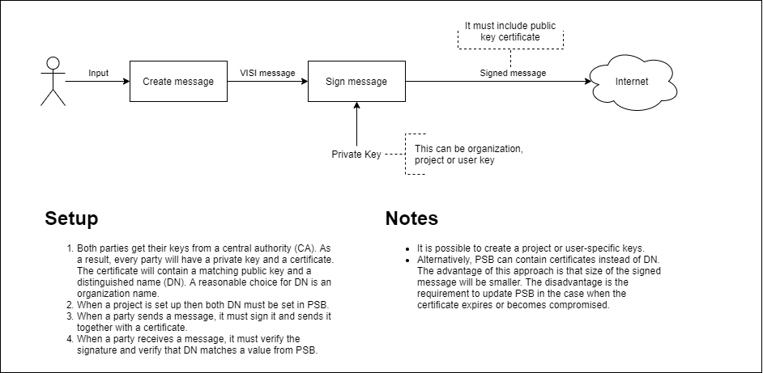

# Message Communication 

**Scenario**\
In this outlined scenario, the following objects can be found:

-   The SOAP Server (**SOAP Server**), this is the server that handles
    the handling of VISI messages according to the path described in
    this document.

-   The Information System (**IS**), this is the application that
    processes and generates VISI messages.

-   The end user (**P** for person), this is a person who fulfils a
    certain role for a certain organisation.

## Protocols

The MTOM (SOAP Message Transmission Optimisation Mechanism) protocol is
chosen for the implementation. This solution is also based SOAP
implementation of XOP (XML-binary Optimised Packaging). See the latest
published version of MTOM and XOP at W3C[^1].

The VISI Standard enforces that communication between SOAP Servers takes
place via https and SSL, so that the content of received messages cannot
be intercepted. The use of HTTPS (TLS 1.0 or higher, with at least 128
bit encryption) for sending VISI messages and attachments is mandatory.

The maximum size of a VISI message (including attachments) is 10 GB.
This is combined with \"chunking\" for further optimisation, a method of
sending files in small chunks and then merging them back together. There
is currently no limit on the amount of appendix.

The protocol used can be found in the configuration. This message
contains a simple element \"SOAPProtocol\" (language independent) under
project information. The current capability is only \"MTOM\", so e.g.
[2](#lst:MTOM){reference-type="ref+label" reference="lst:MTOM"}.

<figure id="lst:MTOM">

<figcaption>MTOM Property Definition</figcaption>
</figure>

And for the configuration
[3](#lst:MTOMConfig){reference-type="ref+label"
reference="lst:MTOMConfig"}.

<figure id="lst:MTOMConfig">

<figcaption>MTOM Property Configuration</figcaption>
</figure>

## Message exchange

The message exchange (header etc., server address) is set up on the
basis of the precondition that all information about the present
configuration, e.g. URL addresses of people in a certain role, etc., are
contained in VISI messages according to the framework for the project to
be executed. Of course this precondition may not make the software
dependent on a specific VISI framework.

In order to meet the above precondition, we will use the following
convention within VISI.

-   Some SimpleElementType objects that can be defined in the framework
    will be assigned a specific behaviour/interpretation based on their
    naming (attribute: id) across all frameworks.

We will assign the following SimpleElementTypes framework-crossing
behaviour/definition:


  SimpleElementType   Behavior
  ------------------- ---------------------------------------------------------------------------------------
  SOAPServerURL       Contains the URL of the SOAP server associated with this Person, Role or organisation
  SOAPProtocol        Contains the SOAP protocol used

  : Caption


### Message exchange of fixed elements at framework level

Within this notation we will propose the following use (note: this falls
outside the new VISI concept):

**At framework level:**

-   Each framework will contain the following bit of XML to map the
    SOAPServerURL to an organisation
    [4](#lst:SOAP Server Definition){reference-type="ref+label"
    reference="lst:SOAP Server Definition"}

<figure id="lst:SOAP Server Definition">

<figcaption>SOAP Server URL Definition</figcaption>
</figure>

**Alternatives:**\
The choice made seems the most elegant, an alternative could be to
assign the SOAPServerURL field to PersonInRole in the promotion step.
However, this choice would make the VISI system dependent on SOAP and
the conceptual choice to prescribe this communication.

### Message exchange of fixed elements at message level

**At message level:**\
we assume that a configuration is present for a project, as described in
[\[sec:PSB\]](#sec:PSB){reference-type="ref+label" reference="sec:PSB"}.

-   This configuration defines for each organisation what its
    SOAPServerURL is shown in
    [5](#lst:SOAPServerConfiguration){reference-type="ref+label"
    reference="lst:SOAPServerConfiguration"}

<figure id="lst:SOAPServerConfiguration">

<figcaption>SOAP Server URL Configuration</figcaption>
</figure>

### Consequences

The consequences of this approach are that the information system (IS)
is able to find out for each message within a transaction which URL
belongs to the sender and which URL belongs to the receiver. This data
(URL sender, URL receiver) will have to be communicated with the SOAP
server associated with this information system, of course together with
the VISI message itself. The communication between the information
system and the associated SOAP server is outside the scope of this note
and is up to the developer of the information system and the associated
SOAP server itself.

### Message exchange initialisation

To start a project, all parties will need to know who they are
communicating with, which framework is being used, and have all other
configuration information available. A configuration has been defined in
order to always keep this information up-to-date and to prevent
unauthorised parties from modifying this information. This configuration
is located at a location specified by the software supplier (existing
infrastructures then provide security and availability). More
information about the configuration can be found in
[\[sec:Functional\]](#sec:Functional){reference-type="ref+label"
reference="sec:Functional"} and
[\[sec:Conformity\]](#sec:Conformity){reference-type="ref+label"
reference="sec:Conformity"}.

The initialisation of each information system starts with loading the
configuration (i.e. in each individual information system). This
configuration contains the link to the most recent framework (as every
message points to a framework) and contains all relevant project
information including the roles, people and organisations that
participate (incl. URL addresses).

### Message exchange scenario

This description is suitable for all types of messages within
transactions, both a first message within a transaction and responses to
messages received within a transaction. It is important that messages
within an organisation do not go through this path need to run, this
also means that these messages will not be placed on the central server.

In the examples:

-   URL SOAP server sending party: http://192.168.0.102

-   URL SOAP server receiving party: http://192.168.0.138


The order of message exchange:

1.  The VISI message is created by the sending IS based on the received
    message (in case of a new transaction, the information is extracted
    from the configuration).

2.  The URL addresses of the sending and receiving IS are extracted from
    the formatted message by the sending IS.

3.  The created VISI message + URL address of sending SOAP server + URL
    address of receiving SOAP server are communicated to the associated
    server (method of communication is up to the software parties
    themselves left).

4.  The SOAP server of the sending party builds a SOAP message as show
    in [7](#lst:SendingXML){reference-type="ref+label"
    reference="lst:SendingXML"}.

<figure id="lst:SendingXML">

<figcaption>Sending Message</figcaption>
</figure>

**note:** the id of each attachment is equal to the id in the VISI
message used to describe the metadata of an attachment. ($<$Data
id="abc"$>$)

5.  The SOAP server of the sending party sends this message to the SOAP
    server of the receiving party.

6.   The receiving party's
    SOAP server sends a standard SOAP exception error message to the
    sending party. a. The SOAP server of the receiving party forwards
    the VISI message part of the message to the IS of the receiving
    party (method of communication is left to the software parties
    themselves).

7.  The IS of the receiving party interprets the VISI message and if
    approved, it sends this message + URL address of sending SOAP
    server + URL address of receiving SOAP server to its own SOAP server
    (i.e. of the receiving party). The method of communication is left
    to the software parties themselves.

8.  If successful, the receiving party's SOAP server builds a SOAP
    response message as in
    [8](#lst:Response Message){reference-type="ref+label"
    reference="lst:Response Message"}.

<figure id="lst:Response Message">

<figcaption>Response No Error Message</figcaption>
</figure>

In case of a single error
[9](#lst:Single Error Message){reference-type="ref+label"
reference="lst:Single Error Message"}.

<figure id="lst:Single Error Message">

<figcaption>Response Single Error Message</figcaption>
</figure>

In case of multiple errors (e.g. with validation of the xsd)
[10](#lst:Muliple Error Message){reference-type="ref+label"
reference="lst:Muliple Error Message"}.

<figure id="lst:Muliple Error Message">

<figcaption>Response Muliple Error Message</figcaption>
</figure>

In case of no error the code is 0, in case of an unknown error the code
is 1, these error messages will have to be resolved by the programmers.
All error messages with a higher code are errors that can be understood
by the software.

9.   The receiving party's SOAP
    server sends this response message to the sending parties' SOAP
    server. a. The sending party's SOAP server sends a standard SOAP
    exceptionerror message to the receiving party as a standard response
    to this response message.

10. Response message back at square one, check whether the information
    corresponds to the message sent and if agreed, notify the IS of the
    receiving party that the message was sent and received as agreed.

Remark:

-   The above process remains manageable if both parties use the same
    IS. In that case, the URL addresses of the receiving and the sending
    SOAP server are identical.

-   No standard error codes higher than 1 were defined during the
    release of this protocol. As soon as such an error code has been
    recorded, it is clearly indicated what the error code is, a
    description of the error and an unambiguous description of how the
    software should respond.

-   If there is no ('on time') response to a message, the same message
    will not be sent again. We continue to wait for the answer or find a
    solution outside of VISI.

-   In step [\[step:exception\]](#step:exception){reference-type="ref"
    reference="step:exception"} and step
    [\[step:response\]](#step:response){reference-type="ref"
    reference="step:response"}, a message is always sent to the other
    party first.

## Disclosure of the framework and update scenario

Frameworks are accessible to an information system via a URI. Every VISI
compatible message within a specific project refers to this framework
(including the configuration).

The XML/XSD concept used within the VISI enforces that every message
contains a reference to its schema via a URI. The VISI system then
prescribes that the framework is stored on this URI (which always
contains the extension XSD) with the extension xml.

Furthermore, VISI prescribes that once used frameworks be frozen
forever. In case of changes in the framework, a new URI for this new
framework will have to be devised. The applications are automatically
notified by pointing the configuration to the XSD associated with this
new framework.

With this, the use of VISI guarantees that all frameworks and all
messages remain unambiguous in time despite adjustments to the
frameworks, roles, persons or organisations or even the system.\
When adjusting a framework, the following steps can be taken:

-   Adjust the framework, for example using a VISI framework editor.

-   Distribute the proposed changes using the meta-framework and wait
    for agreement from all VISI partners involved in the project.

-   Promote the framework and place both the framework and the promoted
    framework (with the same name, but different extension) in the
    desired directory.

-   Adjust the configuration and distribute it to all VISI partners
    involved and determine the effective date and time.

At the agreed time, the modified framework and the associated
configuration will become active for new transactions. The applications
will transfer existing transactions and new 'sub-transactions' through
the old framework to let go. New transactions will be started via the
new framework.

## Disclosure of the configuration scenario

The exact content of a configuration is described elsewhere. Here is a
description of what to do with updates.

There can be various reasons for updating a configuration, this could be
because people, organisations and/or roles have been modified, more
information is known about people, organisation, roles or the project,
or because the framework has been modified.

In principle, the information of a configuration is volatile, it can be
seen as a 'repository' of important project-specific information that is
always up-to-date available for the different information systems that
play a role in this project. In contrast to frameworks, the information
is therefore dynamic, where the location (URI) is static, i.e. each
information system knows where to find the latest most up-to-date
information about the project (this URI is used to track a project). to
start, see also 3.3.). In order to be able to find out the different
versions of the configuration, VISI recommends performing an update as
follows:

-   Make a copy of the existing configuration, this message will have
    the same name with a serial number immediately after the name.

-   Take care of the update of the project specific message.

-   Distribute the configuration to the VISI project partners and
    determine the effective date plus time.

-   The new configuration is activated on the agreed date and time.

## Attachments, Ref's en Id's

The attachments and elements in the header file are processed as
described in 3. Use of the MTOM concept takes care of the handling of
attachments and the VISI message itself. Also, when the body of a SOAP
message is encrypted, this encryption will automatically be present on
the attachments.

## SOAP function calls

The chosen solution requires only two function calls.\
**parseMessage**\
*(1 input variabele of the type string, contains an XML file, see
[\[sec:VisiFrameworkCommunication\]](#sec:VisiFrameworkCommunication){reference-type="ref+label"
reference="sec:VisiFrameworkCommunication"})*\
\
\
**parseMessageConfirmation**\
*(2 inputvariabelen of the type string,
UniqueIDonMessageInitiatingSOAPServer_XYZ and the found errors errors,
returns an XML file, see
[\[sec:VisiFrameworkCommunication\]](#sec:VisiFrameworkCommunication){reference-type="ref+label"
reference="sec:VisiFrameworkCommunication"})*

The content is the same in both cases, namely the VISI message preceded
by the attachments. The form of the SOAP message should conform to the
protocol chosen in the configuration.

'Meta' information about the different URL addresses and the unique ID
for the sending SOAP server are included in the header of the SOAP
message.

The method of implementation and use is described in
[\[sec:VisiFrameworkCommunication\]](#sec:VisiFrameworkCommunication){reference-type="ref+label"
reference="sec:VisiFrameworkCommunication"}.

## Configuration

The configuration content has already been described in a previous
document. The procedure for updating a configuration can be found in
chapter 5.

## Optional implementation suggestions

Furthermore, on an infrastructure level, SOAP Servers can use the
\"whitelist\" technique, which allows only authorised SOAP server to
send messages to a SOAP Server.

## Visi werk sessie 16 mei 2023

### leidraad 1.7

#### #72 Prio-801: Overdraagbaarheid lopende projecten of VISI archief bij switch van leverancier

wat is de huidige opbouw van een archief?

jeroen: archiveren en inlezen van archief deel maken van cretificering
Jeroen en arne hebben een sleutel gemaakt(gebruikt?) ter validatie van
geslaagtheid van import/export. jeroen: aanbesteding amsterdam, dus
alles open projecten die bij technia stonden moesten naar b&s. dus een
export en import moeten er zijn. vergelijksingssleutel wordt gerenereerd
en dan vergeleken na import wat b&s heeft geimporteerd. wordt iets wat
in 1.8 gaat komen.

b&s heeft software oplossing gemaakt om oude raamwerk te updaten naar
nieuwe versie van raamwerk, maar dit is buiten de standaard om. dat
loopt dan niet goed in je archief.

niek leest voor overdraging van lopende projecten getest, huidige
archief formaat

kunnen inlezen moet een testcase worden in de validatie tests. huidige
archief structuur gaan naar tests leverancier en opdrachtgever
omwisselen en dan testen. jeroen heeft als het goed is een oplossing
voor het char limit van 250 probleem, voor berichten en voor bijlages

structuur blijft gelijk voor 1.7 voor 1.8 misschien voor 1.7 wordt het
nu getest

## Message Signing

VISI software supplier is responsible for the management of their set of
issued public keys. At the same time each software supplier, upon the
request from the certification committee, must be able to produce a list
of the issued certificates which includes the following:

-   public key

-   public key friendly name; if available

-   corresponding server where the certificate is supposed to be used

-   corresponding validity start and end dates

Also, the software supplier must be able to demonstrate that the private
key of a public key is in their possession.

Starting point for message exchange between the servers entails the
following: all servers are known to each other and no server access
without IP whitelisting is possible.

This means that every software supplier knows which server pairs are
communicating with each other. In case one the clients decides to host
the VISI software in their private cloud and as a result requires a
unique public key, it is then the responsibility of the software
supplier to provide their client with such public key.

In the event of addition of the authentication layer in the future, the
signing of the messages is not going to be affected. Only the ISO
security level will change as a result. This in turn makes the central
administration of the issued public keys unnecessary.

Given the fact that communicating server pairs are known in advance, if
it becomes apparent that a server of a software supplier A is using the
public key of the software supplier B, then it is most certainly true
that said suppliers have exchanged their private keys.

It is worth mentioning that the Xades protocol and the Xades
organization should not be confused with each other. Desired VISI
security level may not require such an organisation as Xades to check
it.

A message that is created to be send will be signed to ensure that its
contents will remain verifiable in the future. A signed message shows
that the content has not been altered and is the original content from
the moment of sending. This way one ensures that the recipient did not
tamper with the message. The signing will be sent along with the message
in such a way that the signing is backwards compatible with non-signed
messages. This is done by not including the signing in the parse
message, but by appending it to after the parse message, while still in
the body. See [\[fig:Signing\]](#fig:Signing){reference-type="ref+label"
reference="fig:Signing"} for an example.




-   
-   
-   
-   

```
<SOAP-ENV:Envelope ...>
  <SOAP-ENV:Header>
    <SOAPServerURL ...>
      <sender>http://192.168.0.102</sender>
      <receiver>http://192.168.0.138
      </reciever>
    </SOAPServerURL>
    <UniqueID ...>
      <ID>UniqueIDonMessageInitiatingSOAPServer_XYZ</ID>
    </UniqueID>
    <Appendices ...>
      <count>2</count>
    </Appendices>
  </SOAP-ENV:Header>
  <SOAP-ENV:Body>
    <parseMessage ...>
      <message>
        <visiXML_MessageSchema ...>
          ... // VISI Message
          <Data> // Appendix I
            <Bijlage id="VoorbeeldDocument">
              <name>Voorbeeld</name>
              <fileLocation>\\srv-bouw\Public\project\docs\msword\</fileLocation>
              <fileType>application/msword</fileType>
              <fileVersion>2010</fileVersion>
new-->        <Checksum>00BD947603...2526F6223898</Checksum>
              <documentIdentification>345899</documentIdentification>
              <documentVersion>1</documentVersion>
              <documentReference>FG783990</documentReference>
              <startDate>2011-02-04T00:00:00Z</startDate>
              <endDate>2011-12-31T00:00:00Z</endDate>
              <state>active</state>
              <dateLaMu>2011-02-04T00:00:00Z</dateLaMu>
              <userLaMu>bapa</userLaMu>
              <language>NL</language>
              <appendixGroup>
                <AppendixGroup id="...">
                  ...
                </AppendixGroup>
              </appendixGroup>
            </Bijlage>
          </Data>
          <Data ...>
            ... // Appendix II
          </Data>
        </visiXML_MessageSchema>
new-->  <Signature>
new-->      ... // Signing message
new-->  </Signature>
      </message>
    </parseMessage>
  </SOAP-ENV:Body>
</SOAP-ENV:Envelope>
```


Distinguished name met department name in het PSB

[^1]: https://www.w3.org/TR/soap12-mtom/
