# Testprotocol

The scenarios below are figures prepared in Microsoft Visio 2003. The
source file is Scenarios.

## Test framework Pizzeria

The framework contains four transaction types:

-   t1_OpnameBestelling;

-   t2_VraagOberAanKok;

-   t3_OpdrachtKok;

-   t4_VraagKokAanKeukenhulp.

And four roles: Customer, Waiter, Cook and Kitchen Help.

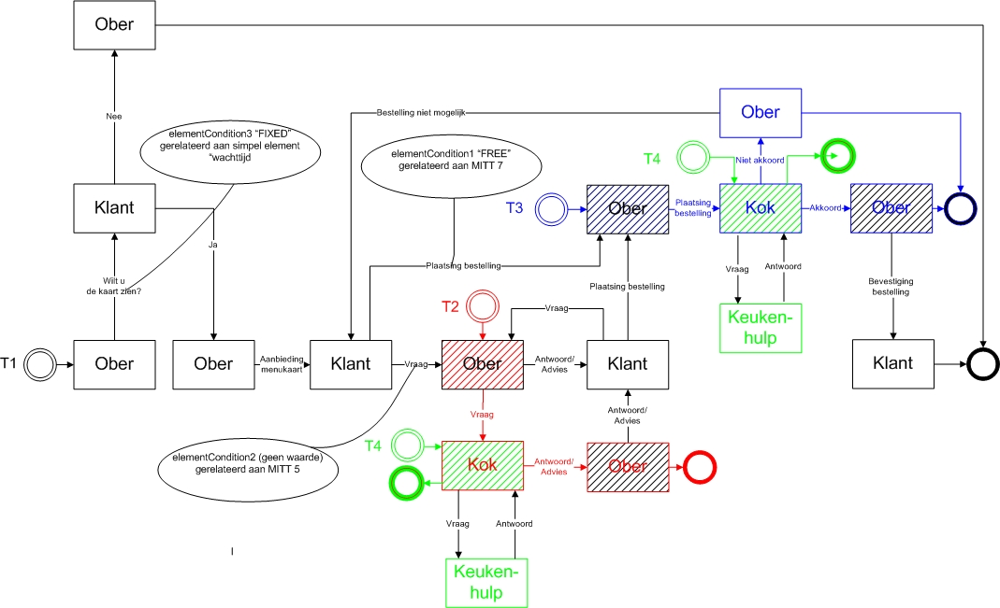

### Scenario 1

*Goal*\
Testing of functionality for:

-   Starting a transaction.

-   Replying to a message.

-   Using different types of data fields.

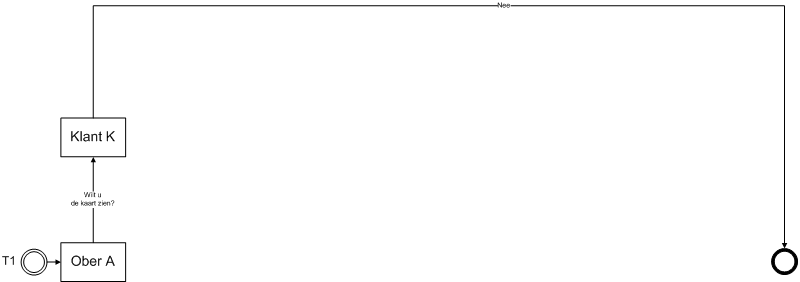

*Description*\
\
Waiter A asks Customer K if he/she wants to see the card. When filling
in the question whether the customer wants to see the map, all different
Base Type fields are presented.\
\
Test if the following fields work as follows:

  Field         Function (The input must be\...)
  ------------- -------------------------------------------------------------------------------------------------------------------------
  Boolean       \... either a check box or 0 - 1 or true-false (required)
  Date          \... a date field or date picker (required)
  Date Time     \... a Date and time field or date and time picker (required)
  Time          \... a time field or time picker (required)
  Decimal       \... a number, with or without decimal values (required)
  Integer       \... an integer (required)
  Choice List   \... a field with checked input or drop-down list with the values \"Choice 1\", \"Choice 2\" or \"Choice 3\" (required)
  String        \... random characters can be entered (not required):

Customer K answers the question with No.

### Scenario 2a

*Goal*\
Testing of functionality for:

-   Starting a (sub)transaction.

-   Returning to a (main) transaction.

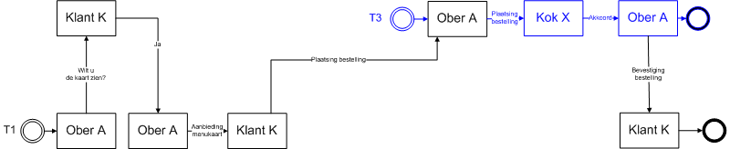

*Description*

1.  Waiter A asks Customer K if he/she wants to see the card. Customer K
    answers the question with Yes, and indicates which card he/she wants
    to see.

2.  Waiter A offers the menu that Customer K has requested. Waiter A
    cannot change the menu card type. Customer K receives the requested
    menu. Customer K places an order with Waiter A consisting of a table
    with the name of a dish per row and possibly an associated comment.

3.  Waiter A places the same order with Cook X and with Cook Y. Waiter A
    cannot adjust or supplement Customer K's order.

4.  Cook Y agrees to Waiter A. Cook Y cannot adjust or supplement Waiter
    A's order.

5.  Waiter A agrees to Customer K. Waiter A cannot adjust or supplement
    Cook Y's accord.

6.  After Waiter A has communicated to Customer K, Cook X still gives an
    agreement to Waiter A. Waiter A **cannot communicate anything** with
    the notification received from Cook X, so cannot communicate to Cook
    x or Customer K.

### Scenario 2c

ISSUE 134: Testscenario 2a en 2c gelijk ? Opmerking GS: Volgens mij is
de beschrijving van dit scenario gelijk aan Scenario 2A, het plaatje bij
dit scenario sluit wel beter aan bij de tekst

*Goal*\
Testing for the functionality for a) starting two (sub)transactions and
b) returning 1 (sub)transaction to the (main)transaction.

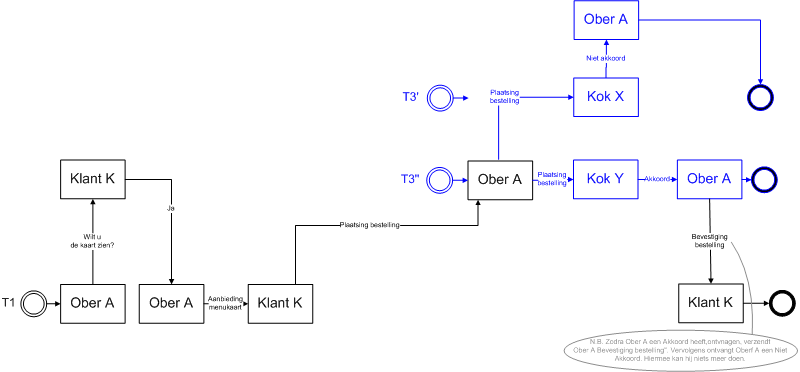

*Description*

1.  Waiter A asks Customer K if he/she wants to see the menu.

2.  Customer K answers the question with Yes, and indicates which card
    he/she wants to see.

3.  Waiter A offers the menu that Customer K requested.

4.  Waiter A cannot change the menu card type. Customer K receives the
    requested menu.

5.  Customer K places an order with Waiter A consisting of a table with
    the name of a dish per row and possibly an associated comment.

6.  Waiter A places the same order with Cook X and with Cook Y. Waiter A
    cannot adjust or supplement Customer K's order.

7.  Cook Y gives Waiter A an agreement.

8.  Cook Y cannot adjust or supplement Waiter A's order.

9.  Waiter A gives Customer K an agreement.

10. Waiter A cannot adjust or supplement Cook Y's agreement.

11. After Waiter A has communicated to Customer K, Cook X still a
    non-agreement to Ober A.

12. Waiter A cannot communicate at all with the message received from
    Cook X, i.e. cannot communicate with Cook X or Customer K.

### Scenario 3a

*Goal*\
Testing of functionality for:

-   Starting a certain type of (sub)transaction.

-   Returning to the (main)transaction.

-   Starting the same type of (sub)transaction again.

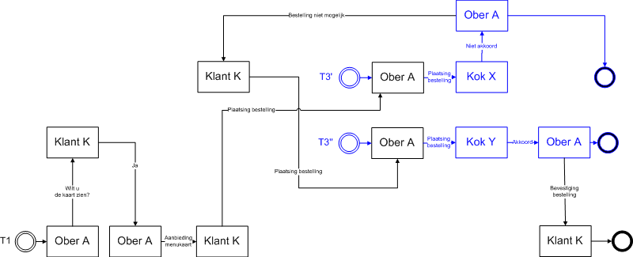

*Description*

1.  Waiter A asks Customer K if he/she wants to see the card. Customer K
    answers the question with Yes, and indicates which card he/she wants
    to see.

2.  Waiter A offers the menu that Customer K has requested. Waiter A
    cannot change the menu type *not*. Customer K receives the requested
    menu.

3.  Customer K places an order with Waiter A consisting of a table with
    the name of a dish per row and possibly an associated comment.

4.  Waiter A places the same order with Cook X. Waiter A cannot adjust
    or supplement Customer K's order.

5.  Cook X disagrees with About NA. Cook X cannot adjust or supplement
    Waiter A's order.

6.  Waiter A disapproves of Customer K. Waiter A cannot adjust or
    supplement Cook X's disagreement.

7.  Customer K places a completely new order with Waiter A, consisting
    of a table with the name of a dish per row and possibly an
    associated comment. (Customer K can fill in the entire table.)

8.  Waiter A places the same order with Cook Y. Waiter A cannot adjust
    or supplement Customer K's order.

9.  Cook Y agrees to Waiter A. Cook Y cannot adjust or supplement Waiter
    A's order.

10. Waiter A agrees to Customer K. Waiter A cannot adjust or supplement
    Cook Y's accord.

### Scenario 3b

*Goal*\
Testing of functionality for:

-   Starting a certain type of (sub) transaction.

-   Returning to the (main) transaction.

-   Multiple messages in the main transaction.

-   Start the same type of (sub) transaction again.

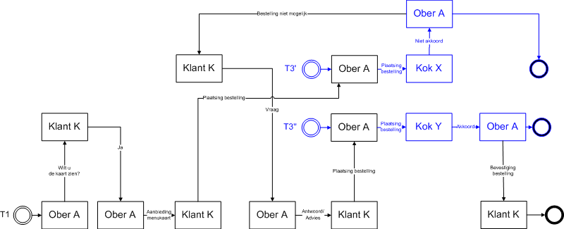

*Description*

1.  Waiter A asks Customer K if he/she wants to see the card. Customer K
    answers the question with Yes, and indicates which card he/she wants
    to see.

2.  Waiter A offers the menu that Customer K has requested. Waiter A
    cannot change the menu card type. Customer K receives the requested
    menu.

3.  Customer K places an order with Waiter A consisting of a table with
    the name of a dish per row and possibly an associated comment.

4.  Waiter A places the same order with Cook X. Waiter A cannot adjust
    or supplement Customer K's order.

5.  Cook X gives Waiter A a disagreement. Cook X cannot adjust or
    supplement Waiter A's order.

6.  Waiter A gives Customer K a disagreement. Waiter A cannot adjust or
    supplement Cook X's disagreement.

7.  Customer K asks Waiter A a question.

8.  Waiter A answers Customer K's question. (In the answer, Waiter A
    cannot adjust Customer K's question.)

9.  Customer K places a completely new order with Waiter A, consisting
    of a table with the name of a dish per row and possibly an
    associated comment. (Customer K can fill in the entire table.)

10. Waiter A places the same order with Cook Y. Waiter A cannot adjust
    or supplement Customer K's order.

11. Cook Y agrees to Waiter A. Cook Y cannot adjust or supplement Waiter
    A's order.

12. Waiter A agrees to Customer K. Waiter A cannot adjust or supplement
    Cook Y's accord.

### Scenario 4a

*Goal*\
Testing of functionality for: ElementConditions.

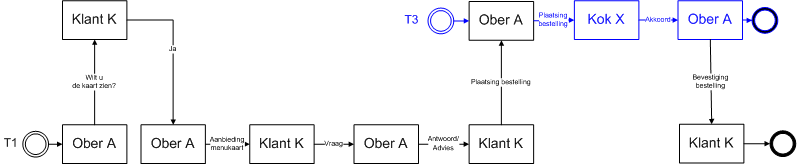

*Description*

1.  Waiter A asks Customer K if he/she wants to see the card. Customer K
    answers the question with Yes, and indicates which card he/she wants
    to see.

2.  Waiter A offers the menu that Customer K has requested. Waiter A
    cannot change the menu card type. Customer K receives the requested
    menu.

3.  Customer K asks Waiter A a question.

4.  Waiter A answers Customer K's question. (In the answer, Waiter A
    cannot adjust Customer K's question.)

5.  Customer K places a completely new order with Waiter A, consisting
    of a table with the name of a dish per row and possibly an
    associated comment. (Customer K can fill in the entire table.)

6.  Waiter A places the same order with Cook X. Waiter A cannot adjust
    or supplement Customer K's order.

7.  Cook X agrees to Waiter A. Cook X cannot adjust or supplement Waiter
    A's order.

8.  Waiter A agrees to Customer K. Waiter A cannot adjust or supplement
    Cook X's accord.

### Scenario 4b

*Goal*\
Testing of functionality for: ElementConditions.

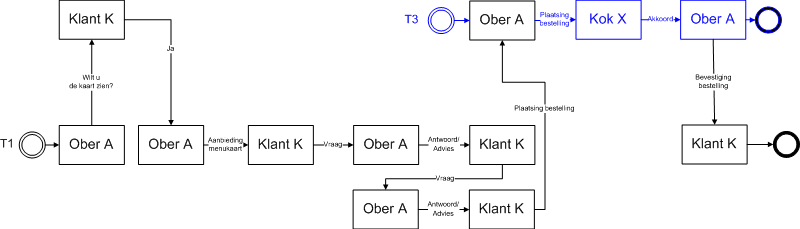

*Description*

1.  Waiter A asks Customer K if he/she wants to see the card. Customer K
    answers the question with Yes, and indicates which card he/she wants
    to see.

2.  Waiter A offers the menu that Customer K has requested. Waiter A
    cannot change the menu card type. Customer K receives the requested
    menu.

3.  Customer K asks Waiter A a question.

4.  Waiter A answers Customer K's question. (In the answer, Waiter A
    cannot adjust Customer K's question.)

5.  Customer K asks a second question to Waiter A. (In the question,
    Customer K cannot fill in the question, because in the framework
    ElementCondition has no value for condition!!!)

6.  Waiter A answers Customer K's question. (In the answer, Waiter A
    cannot adjust Customer K's question.)

7.  Customer K places a completely new order with Waiter A, consisting
    of a table with the name of a dish per row and possibly an
    associated comment. (Customer K can fill in the entire table.)

8.  Waiter A places the same order with Cook X. Waiter A cannot adjust
    or supplement Customer K's order.

9.  Cook X agrees to Over NA. Cook X cannot adjust or supplement Waiter
    A's order.

10. Waiter A agrees to Customer K. Waiter A cannot adjust or supplement
    Cook X's accord.

### Scenario 4c

*Goal*\
Testing of functionality for: ElementConditions.

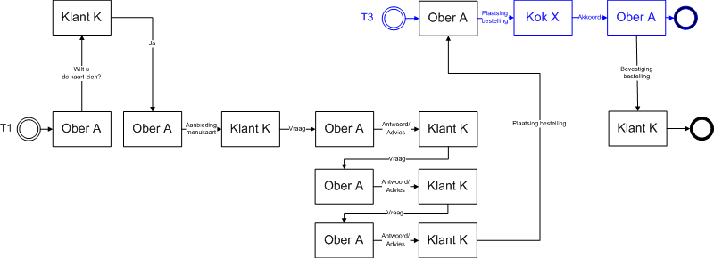

*Description*

1.  Waiter A asks Customer K if he/she wants to see the card. Customer K
    answers the question with Yes, and indicates which card he/she wants
    to see.

2.  Waiter A offers the menu that Customer K has requested. Waiter A
    cannot change the menu card type. Customer K receives the requested
    menu.

3.  Customer K asks Waiter A a question.

4.  Waiter A answers Customer K's question. (In the answer, Waiter A
    cannot adjust Customer K's question.)

5.  Customer K asks a second question to Waiter A. (In the question,
    Customer K cannot fill in the question, because in the framework
    ElementCondition has no value for condition!!!)

6.  Waiter A answers Customer K's question. (In the answer, Waiter A
    cannot adjust Customer K's question.)

7.  Customer K asks a third question to Waiter A. (In the question,
    Customer K cannot fill in the question, because in the framework
    theElementCondition has no value for condition!!!)

8.  Waiter A answers Customer K's question. (In the answer, Waiter A
    cannot adjust Customer K's question.)

9.  Customer K places a completely new order with Waiter A, consisting
    of a table with the name of a dish per row and possibly an
    associated comment. (Customer K can fill in the entire table.)

10. Waiter A places the same order with Cook X. Waiter A cannot adjust
    or supplement Customer K's order.

11. Cook X agrees to Waiter A. Cook X cannot adjust or supplement Waiter
    A's order.

12. Waiter A agrees to Customer K. Waiter A cannot adjust or supplement
    Cook X's accord.

### Scenario 5a

*Goal*\
Testing of functionality for:

-   ElementConditions

-   openSecondaryTransactionsAllowed

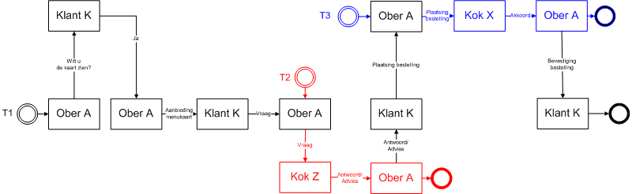

*Description*

1.  Waiter A asks Customer K if he/she wants to see the card. Customer K
    answers the question with Yes, and indicates which card he/she wants
    to see.

2.  Waiter A offers the menu that Customer K has requested. Waiter A
    cannot change the menu card type. Customer K receives the requested
    menu.

3.  Customer K asks Waiter A a question.

4.  Waiter A asks Cook Z a question. (In the question, Waiter A cannot
    adjust the question.)

5.  Cook Z answers Waiter A's question. (In the answer, Cook Z cannot
    adjust Waiter A's question.)

6.  Waiter A answers Customer K's question. (In the answer, Waiter A
    cannot adjust Cook Z's answer.)

7.  Customer K places a completely new order with Waiter A, consisting
    of a table with the name of a dish per row and possibly an
    associated comment. (Customer K can fill in the entire table.)

8.  Waiter A places the same order with Cook X. Waiter A cannot adjust
    or supplement Customer K's order.

9.  Cook X agrees to Waiter A. Cook X cannot adjust or supplement Waiter
    A's order.

10. Waiter A agrees to Customer K. Waiter A cannot adjust or supplement
    Cook X's accord.

### Scenario 5b

*Goal*\
Testing of functionality for:

-   ElementConditions

-   openSecondaryTransactionsAllowed

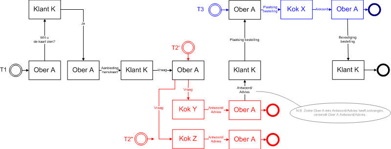

*Description*

1.  Waiter A asks Customer K if he/she wants to see the card. Customer K
    answers the question with Yes, and indicates which card he/she wants
    to see.

2.  Waiter A offers the menu that Customer K has requested. Waiter A
    cannot change the menu card type. Customer K receives the requested
    menu.

3.  Customer K asks Waiter A a question.

4.  Waiter A asks Cook Y and Z a question. (In the question, Waiter A
    cannot adjust the question.)

5.  Cook Y answers Waiter A's question. (In the answer, Cook Y cannot
    adjust Waiter A's question.)

6.  Waiter A answers Customer K's question. (In the answer, Waiter A
    cannot adjust Cook Y's answer.)

7.  After Waiter A has communicated to Customer K, Cook Z still gives an
    answer to Waiter A. Waiter A cannot communicate at all with the
    notification received from Cook Z, so cannot communicate to Cook Z
    or Customer K.

8.  Customer K places a completely new order with Waiter A, consisting
    of a table with the name of a dish per row and possibly an
    associated comment. (Customer K can fill in the entire table.)

9.  Waiter A places the same order with Cook X. Waiter A cannot adjust
    or supplement Customer K's order.

10. Cook X agrees to Waiter A. Cook X cannot adjust or supplement Waiter
    A's order.

11. Waiter A agrees to Customer K. Waiter A cannot adjust or supplement
    Cook X's chord.

### Scenario 5c

*Goal*\
Testing of functionality for:

-   ElementConditions

-   openSecondaryTransactionsAllowed

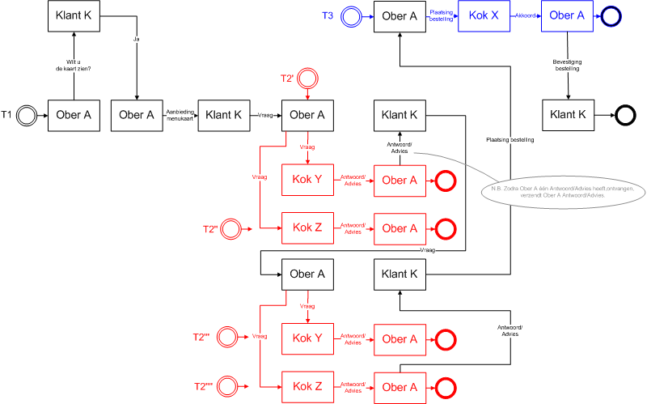

*Description*

1.  Waiter A asks Customer K if he/she wants to see the card. Customer K
    answers the question with Yes, and indicates which card he/she wants
    to see.

2.  Waiter A offers the menu that Customer K has requested. Waiter A
    cannot change the menu card type. Customer K receives the requested
    menu.

3.  Customer K asks Waiter A a question.

4.  Waiter A asks Cook Y and Z a question. (In the question, Waiter A
    cannot adjust the question.)

5.  Cook Y answers Waiter A's question. (In the answer, Cook Y cannot
    adjust Waiter A's question.)

6.  Waiter A answers Customer K's question. (In the answer, Waiter A
    cannot adjust Cook Y's answer.)

7.  Customer K asks a second question to Waiter A. (In the question,
    Customer K cannot fill in the question, because in the framework
    ElementCondition has no value for condition!!!)

8.  Waiter A asks Cook Y and Z a second question. (In the question,
    Waiter A cannot adjust the question.)

9.  Cook Z answers the first question from Waiter A. Waiter A cannot
    communicate at all with the notification received from Cook Z, so
    cannot communicate with Cook Z or Customer K.

10. Cook Z answers Waiter A's second question. (In the answer, Cook Z
    cannot adjust Waiter A's question.)

11. Waiter A answers Customer K's question. (In the answer, Waiter A
    cannot adjust Cook Z's answer.)

12. After Waiter A has communicated to Customer K, Cook Y still answers
    Waiter A to the second question. Waiter A cannot communicate at all
    with the notification received from Cook Y, so cannot communicate
    with Cook Y or Customer K.

13. Customer K places a completely new order with Waiter A, consisting
    of a table with the name of a dish per row and possibly an
    associated comment. (Customer K can fill in the entire table.)

14. Waiter A places the same order with Cook X. Waiter A cannot adjust
    or supplement Customer K's order.

15. Cook X agrees to Waiter A. Cook X cannot adjust or supplement Waiter
    A's order.

16. Waiter A agrees to Customer K. Waiter A cannot adjust or supplement
    Cook X's accord.

### Scenario 5d

*Goal*\
Testing of functionality for:

-   ElementConditions

-   openSecondaryTransactionsAllowed

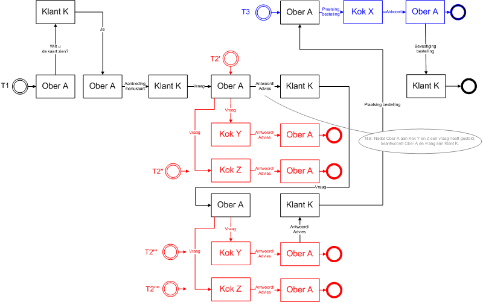

*Description*

1.  Waiter A asks Customer K if he/she wants to see the card. Customer K
    answers the question with Yes, and indicates which card he/she wants
    to see.

2.  Waiter A offers the menu that Customer K has requested. Waiter A
    cannot change the menu card type. Customer K receives the requested
    menu.

3.  Customer K asks Waiter A a question.

4.  Waiter A asks Cook Y and Z a question. (In the question, Waiter A
    cannot adjust the question.)

5.  The answer from Cook Y and Z is not forthcoming. Waiter A answers
    Customer K's question. (In the answer, Waiter A cannot adjust
    Customer K's question.)

6.  Customer K asks a second question to Waiter A. (In the question,
    Customer K cannot fill in the question, because in the framework
    ElementCondition has no value for condition!!!)

7.  Waiter A asks Cook Y and Z a second question. (In the question,
    Waiter A cannot adjust the question.)

8.  Cook Y answers Waiter A's first question. Waiter A cannot
    communicate at all with the notification received from Cook Y, so
    cannot communicate with Cook Y or Customer K.

9.  Cook Z answers the first question from Waiter A. Waiter A cannot
    communicate at all with the notification received from Cook Z, so
    cannot communicate with Cook Z or Customer K.

10. Cook Y answers Waiter A's second question. (In the answer, Cook Y
    cannot adjust Waiter A's question.)

11. Waiter A answers Customer K's question. (In the answer, Waiter A
    cannot adjust Cook Y's answer.)

12. After Waiter A has communicated to Customer K, Cook Z still answers
    Waiter A to the second question. Waiter A cannot communicate at all
    with the notification received from Cook Z, so cannot communicate
    with Cook Z or Customer K.

13. Customer K places a completely new order with Waiter A, consisting
    of a table with the name of a dish per row and possibly an
    associated comment. (Customer K can fill in the entire table.)

14. Waiter A places the same order with Cook X. Waiter A cannot adjust
    or supplement Customer K's order.

15. Cook X agrees to Waiter A. Cook X cannot adjust or supplement Waiter
    A's order.

16. Waiter A agrees to Customer K. Waiter A cannot adjust or supplement
    Cook X's accord.

### Scenario 6a

*Goal*\
Testing of functionality for: A (main)transaction with two layers of
(sub)transactions.

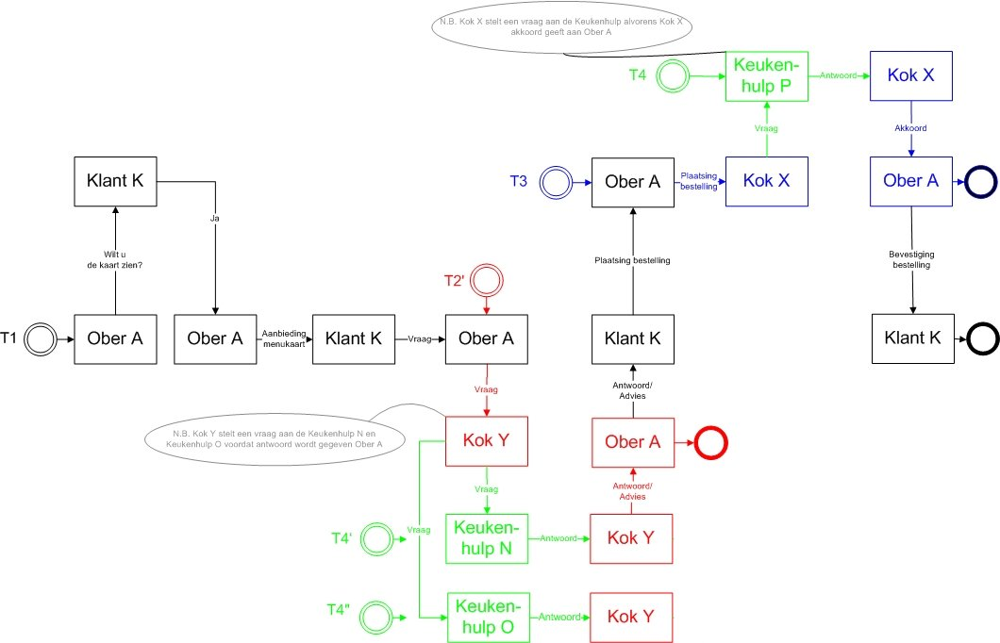

*Description*

1.  Waiter A asks Customer K if he/she wants to see the card. Customer K
    answers the question with Yes, and indicates which card he/she wants
    to see.

2.  Waiter A offers the menu that Customer K has requested. Waiter A
    cannot change the menu card type. Customer K receives the requested
    menu.

3.  Customer K asks Waiter A a question.

4.  Waiter A asks Cook Y a question. (In the question, Waiter A cannot
    adjust the question.)

5.  Cook Y asks two kitchen helpers. (Kitchen Help N and Kitchen Help O)

6.  Kitchen help N answers Cook Y.

7.  Kitchen help O answers Cook Y.

8.  Cook Y answers Waiter A when he has received answers from Kitchen
    Help N and/or O.

9.  Waiter A then answers Customer K.

10. Customer K is satisfied with the answer and places his/her order
    with Waiter A.

11. Waiter A places the order with Cook X.

12. Cook X asks Kitchen Help P if he/she can look up the recipe.

13. Kitchen help P looks up the recipe and answers Cook X.

14. Cook X now has the recipe and can agree to Waiter A.

15. Waiter A confirms the order to Customer K.

ISSUE 135: testscenario pizzeria 7a varianten Te testen varianten
(voorstel Michon Maas):

### Scenario 6a - Variant 1 (initiation with internal transaction within one party)

Initiation process from internal transaction. This can be achieved
through a specific division of roles between different
suppliers/parties. Fulfillment of roles:

1.  Role Waiter A implemented by supplier X

2.  Role Customer K implemented by supplier X

3.  Role Cook Y implemented by supplier X

4.  Role Kitchen help N en O implemented by supplier Y

### Scenario 6a - Variant 2 (initiatie met interne transactie op raakvlak partij)

Initiation process from the interface between suppliers/parties.
Fulfillment of roles:

1.  Role Waiter A implemented by supplier X

2.  Role Customer K implemented by supplier Y

3.  Role Cook Y implemented by supplier Y

4.  Role Kitchen help N en O implemented by supplier Y

### Scenario 6a - Variant 3 (initiatie met interne transactie over drie partijen)

Process with multiple linked transactions across three
suppliers/parties. Fulfillment of roles:

1.  Role Waiter A implemented by supplier X

2.  Role Customer K implemented by supplier Y

3.  Role Cook Y implemented by supplier Y

4.  Role Kitchen help N en O implemented by supplier Z

### Scenario 7a

*Goal*\
Testing of functionality for: the correct operation of message sequence
(sendBefore en sendAfter)\
\
*Description*

-   The waiter sends an order to the cook (T3).

    -   Only 1 of the present cooks may be chosen here.

    -   The waiter is not allowed to send another order to the cook
        after this.

<!-- -->

-   The cook sends a question to the kitchen helper (T4). This can be
    based on the request of the waiter (T2), or the order of the waiter
    (T3).

<!-- -->

-   The kitchen helper sends an answer in T4. The cook should now be
    able to choose from the following options:

    -   If it was based on a question from the waiter(T2) he can choose
        from:

        -   Forward the answer to the waiter in T2.

        -   Ask a new question in T4.

        -   Report that the answer is not used in T4.

    -   If it was based on an order from the waiter, he can choose from:

        -   Agree or disagree message to the waiter in T3.

        -   Ask a new question in T4.

        -   Report that the answer is not used in T4.

<!-- -->

-   Once the cook has sent a reply to the waiter in T2 or T3:

    -   Can the cook no longer send a new question to the kitchen helper
        in T4.

    -   Can he only send 1 closing message to the kitchen helper in T4
        each time. This message corresponds to the message that went to
        the waiter in T2 or T3.

### Scenario 8

*Goal*\
Testing of functionality for: Define the number of rows in a table.
(minOccurs/maxOccurs on child CE)\
*Description*

-   Transaction only (T1)

    -   Waiter sends the question to the customer if he wants to see the
        menu.

    -   Customer answers \"Yes\".

    -   Waiter sends the message \"Menu card\".

        -   At the table Menu card; test that no more than 3 can be
            filled in and that it can be sent empty.

    -   Customer replies with \"Order\".

        -   At the table \"Content of the order\"; test that 1 or more
            lines must be filled in and that empty sending should not be
            possible.

        -   Test at the table \"Content of drinks order\" that it is
            mandatory to fill in 1 line and that empty or more than 1
            line is not allowed.

### Scenario 9

*Goal*\
Testing of functionality for: the mandatory inclusion of an appendix for
a message type (appendixMandatory).

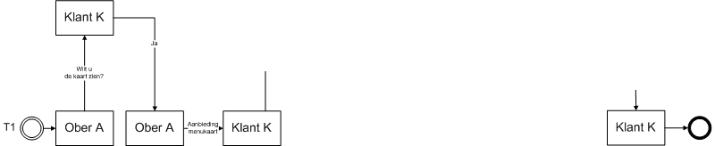

*Description*

1.  Waiter A asks Customer K if he/she wants to see the card. Customer K
    answers the question with Yes, and indicates which card he/she wants
    to see.

2.  Waiter A offers the menu that Customer K has requested, WITHOUT
    attachment.

3.  Waiter A can NOT offer the menu to Customer K, because he forgot to
    add an attachment.

4.  Waiter A then offers the menu that Customer K has requested, WITH an
    attachment.

5.  Waiter A can offer the menu to Customer K, because he has added an
    attachment.

6.  Customer K receives menu card with attachment.

### Scenario 10

*Goal*\
Testing of functionality for: Element conditions in tables (Ce normal /
CE parent / CE Child); Sys 1.6 and higher\
*Description*

-   The waiter offers the menu.

-   Customer says \"yes\".

-   Waiter completes the menu card message as follows:

    -   Menu card (top table, check that this name \"Menu card\" of the
        CE is legible).

        -   Fill in 2 lines, all cells must contain values.

    -   Daily menu (middle table, check that this name \"Daily menu\" of
        the CE is legible).

        -   Fill in 2 lines, all cells must contain values.

    -   Drinks card (bottom table table, check that this name \"Drinks
        card\" from the CE is legible).

        -   Fill in 2 lines, all cells must contain values.

-   Customer responds with the message \"question\";

    -   In the \"Menu card\" table you check:

        -   Whether the name of the CE \"Menu card\" is visible.

        -   The values in the column Description and Price must be
            adjustable, the first column is not adjustable. \[Naam
            default fixed / Omschr; se free in deze parent ce (5)/Prijs
            se free in child ce (3)\]

        -   No lines can be deleted or added.

        -   Empty the bottom cell \"Description\" in preparation for the
            next check.

    -   In the \"Daily menu\" table you check:

        -   Whether the name of the CE "Daily Menu" is visible.

        -   Only the Name column is still filled and can be edited. The
            other 2 columns are empty. \[Parent CE dagmenu EMPTY
            (4)/Naam se FREE in mitt, parent, child, se(15)/Prijs free
            in child (3)\]

        -   Rules can be removed or added.

    -   In the "Drink card" table you check:

        -   Whether the name of the CE "Drinks card" is visible.

        -   The name and description columns are editable, the price
            column is not editable. \[FREE op parent en child CE (6) /
            fixed op parent ce, child CE en SE prijs (7)\]

        -   No lines can be deleted or added.

    -   Send the message.

-   Waiter responds with "Reply" message.

    -   Check:

        -   No lines can be removed or added \[FREE on child and parent
            in wrong order so not a valid condition. Menu content must
            be parent and menu must be child for this condition to work.
            (n/a)\]

### Scenario 11

*Goal*\
Testing for no-ascii symbols in:

-   Description of elements (SimpleElementType, ComplexElementType,
    MessageType, TransactionType)

-   Enumeratie (UserDefiniedType).

*Description*\
Waiter A starts a new transaction and sends a message to Customer K. In
the message, Waiter A enters the value \"eaiou with circumflexes:
êâîôû\" for element \"Enumeration/Selection List\".\
*Result*\
To Waiter A, elements are shown in the message with $>$ and & and € in
the description. The Enumeration/Picklist element shows a list including
êâîôûëäïöü$<$\"$\mu$\@ç€.\
\
Customer K receives a message with element \"Enumeration/Picklist\" the
value \"eaiou with circumflexes: êâîôû\".

## Reading archived VISI project

*Goal*\
Testing for: reading a file that complies with the guidelines for
archiving VISI projects.\
*Description*\
The file is read into the application without manual pre-processing. It
is up to you how this is read and by whom.\
Met een nabewerking worden openstaande transacties worden geadresseerd
aan\
Wat te doen met soap servers? Deze moeten eigenlijk aangepast worden om
de communicatie verder te kunnen laten lopen.\
*Result*\
The system has read all information from the file, namely: a)
transactions, messages, attachments, b) frameworks, c) project-specific
messages.\
The system can continue open transactions.\
*Sample Data*\
Files can be requested from Elisabeth Kloren.

## Archiving and reactivating projects

*Scenario 1*

-   Archive a VISI Project.

-   Import the archived VISI Project into another VISI environment.

-   Compare the original project with the rebuilt project.

*Result*

-   The content of both projects, including frameworks, project specific
    messages, transactions, messages, attachments etc must be exactly
    the same.

-   Possibly after adjustment of the soap address, communication with
    the project must be possible.

## Archiving of a VISI project

*Goal*\
Testing for: creating a file that complies with the guidelines for
archiving VISI projects.\
*Description*\
A project is archived (from the application). It is up to you how this
\"archive\" is created and by whom.\
The project must have the following properties:

-   Transaction with a subject longer than 256 characters.

-   Transaction with non-alphanumeric characters in the subject.

-   Attachment with a name longer than 256 characters.

*Result*\
The system has written out information from the project, namely: all a)
transactions, messages, attachments, b) frameworks, c) project-specific
messages. The structuring of the data is in accordance with the
guideline.\
\
Special consideration should be given to non-ascii characters in the
subject of a transaction, which are not allowed in Microsoft Windows
directory names (for example /: ). These characters must appear in the
directory names as spaces.

## HTTPS check

The project-specific message is provided with a SOAP Server with http.\
*Expected result*\
The project-specific message is not read/rejected.\
*Sample Data*\
The project-specific message
\"projectspecifiekberichttotenmetbericht_6.xml\".

## Large attachments

A zip file of 10GB is attached to a message. This message is sent to
another server via soap.\
*Expected result*\
The message with the attachment is sent correctly, the attachment can be
extracted on the other server and the files extracted from the zip are
readable.\
*Sample Data*\
A zip file can be created on the spot.

## HTTPS requirement

*Goal*\
Testing for: enforcing secure communications\
*Description*

1.  The project-specific message of an existing project is modified. The
    soap server address is changed from https:// to http://.

2.  The adjusted project-specific message is read into the application.

*Expected result*\
The application rejects the project specific message, and the xml file
is not read/activated.\
*Sample Data*\
The project-specific message
\"projectspecifiekberichttotenmetbericht_6.xml\".

## Attachments $>$`<!-- -->`{=html}2GB

*Goal*\
Testing for: sending and receiving attachments larger than 2GB and
smaller than 10GB.\
*Description*

1.  A 9.9 GB zip file is attached to a new message. The zip file
    contains at least one PDF.

2.  The message is sent and goes via the soap protocol to an external
    server.

3.  The message is received on the remote server. And the message
    contains the zip file as the attachment.

*Expected result*\
The attachment is a zip file and can be extracted on the remote server.
The file sizes on the sending and receiving server are the same (in
bytes). The PDF file extracted from the zip has the same size (in bytes)
on both servers. Also, the PDF file can be opened on the receiving
server with an application, and the content corresponds to the PDF file
on the sending server.\
*Sample Data*\
Prior to running the test scenario, a zip file can be compiled with at
least 1 PDF file.

## Test scenarios meta framework

### Scenario A.1 (meta framework)

*Goal*\
Testing of functionality for: initiating a project with the meta
framework.\
*Prerequisite*\
VISI Project met meta-raamwerk & meta-projectspecifiek bericht raamwerk
projectspecifiek bericht

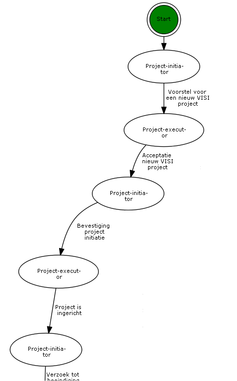

*Description*\
Project initiator offers Project executor a proposal for a new VISI
project with a new framework and project-specific message as
attachments. Project executor answers the proposal with acceptance of
the new VISI project. Project initiator confirms project initiation to
Project executor. Project executor reports back to Project initiator
that the project has been set up.\
End\
*Expected result*\
\...

## Scenario A.2 (meta framework)

*Goal*\
Testing of functionality for: ending a project with the meta framework.\
*Prerequisite*\
VISI Project met meta-raamwerk & meta-projectspecifiek bericht VISI
Project met raamwerk & projectspecifiek bericht

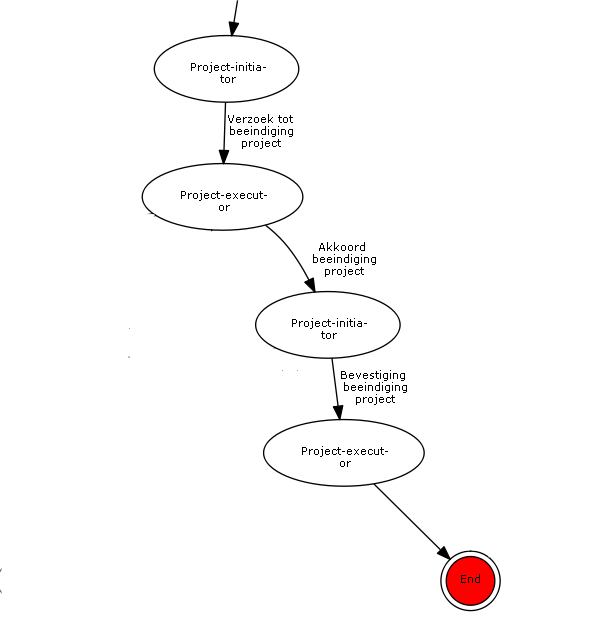

*Description*\
Project initiator offers Project executor a proposal for a new VISI
project with a new framework and project-specific message as
attachments. Project executor answers the proposal with acceptance of
the new VISI project. Project initiator confirms project initiation to
Project executor. Project executor reports back to Project initiator
that the project has been set up.\
End\
*Expected result*\
\...

## Scenario B (meta framework)

*Goal*\
Testing of functionality for: updating an existing project with the meta
framework.\
*Prerequisite*\
VISI Project met meta-raamwerk & meta-projectspecifiek bericht VISI
Project met raamwerk & projectspecifiek bericht gewijzigd raamwerk
gewijzigd projectspecifieke bericht

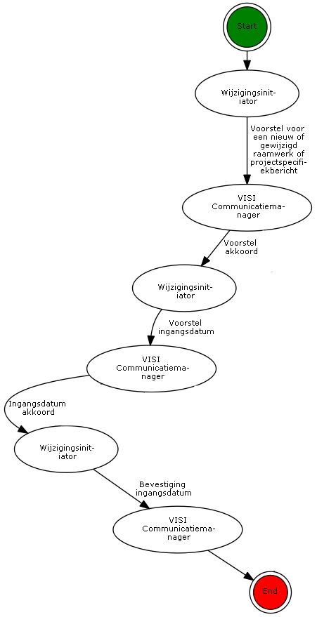
{#fig:scenarioB width="100%"
height="18.5cm"}

*Description*\
Change initiator offers VISI Communication Manager a proposal for
changing an existing VISI project with an amended framework and a
modified project-specific message as attachments. VISI Communication
Manager answers the proposal with approval. Change initiator confirms
the proposed change by proposing an effective date and time to VISI
Communicator. VISI Communicator answers the proposal with agreement.
Change initiator confirms the effective date and time.\
End\
*Expected result*\
\...

## Visi werk sessie 16 mei 2023

### Test sets Jos

Jos heeft niet de B&S software gebruikt om niet hun fouten mee te nemen.
eigen raamwerk software gebruikt 1.6. Kan gewoon querries op los worden
gelaten. om testset te maken om goed te kunnen zien wat er ingesteld
staat. per stap van de test een overzicht nodig voor: wat was het vorige
bericht, waar staan we, hoeveel rijen zijn er, wat is het max, welke
types zitter er in? per bericht genoteerd welke content er in dat
bericht zit. en wat je nodig hebt om te kunnen zien of het fucntioneert.
alle informatie die in het raarmwerk zit kunnen afbeelden per bericht.
zie rapportage van access. een hoop paginas, maar voor het testen moet
je echt gaan zitten

#### elementCondition

initieel bericht kun je alle waardes invullen bij vervolg bericht kan
dit niet 2 nieuwe berichten types gedefineerd: initieel en kopie om dit
op te lossen? before en after conditities

spreadsheet uit de mail kan niet alle informatie bevatten (char limit)
userdefine type, staat een hele lijst van plaatsnamen die mogelijk zijn
in, dat vind excel te veel.

scenario7, is herschreven door jos, gaat die bespreken met arne om te
kijken of dit terrecht is.

Documentatie: oude visio versie gebruikt om te upgraden naar nieuwere
versie.

auditor: iemand van iso ter certificering gebruiken ipv tno. maar
hierbij is waarschijnlijk wel een

zou jezelf als developer moeten testen of je nog voldoet als je
aanpassingen doet in je software.

soap aanvullingen in mail zetten Jeroen heeft unit tests voor
aanpassingen. software ontwikkelaar doet dit zelf ook. functionele
testen worden geregistreerd, wij gebruiken teec2, jeroen nog excel.

tessa loopt nog tegen scenario11 aan.

documentatie: mag een bericht zonder complex en zonder simpleElement en
complexelement bestaan?

## Testscenario archiveren en weer activeren van projecten

\_\_Scenario 1\_\_ - Archiveer een VISI-Project; - Importeer het
gearchiveerde VISI-Project in een andere VISI-omgeving; - Vergelijk het
originele project met het opnieuw opgebouwde project.

\_\_Testresultaat:\_\_ - De inhoud van beide projecten, inclusief
raamwerken, project specifieke berichten, transacties, berichten,
bijlagen etc moet exact gelijk zijn. - Eventueel na aanpassing van het
soap adres moet communicatie met het project mogelijk zijn

