**Technical documentation VISI 1.7**\
https://teec2.nl/visi\
Bimloket Standard\
1 Februari 2022\

::: {#tab:VersionInformation}
  This version:             https://teec2.nl/visi
  ------------------------- ---------------------------------------------
  Last published version:   https://bimloket.github.io//visi1.6/
  Last work version:        https://bimloket.github.io/visi/
  Author:                   Visi committee (CROW), translation TEEC2 BV
  Join the discussion:      GitHub bimloket/visi
                            Report an issue
                            Revision history
                            Pull requests

  : Version information
:::

This document is licensed under a Creative Commons Attribution 4.0
License

# Abstract {#abstract .unnumbered}

This document contains the technical documentation of VISI 1.7, under
translation by TEEC2.

# Status of this document {#status-of-this-document .unnumbered}

Working version 2023

# Summary

VISI is the open standard for organising digital communication about
your collaboration. People make agreements in advance when one
communicates which message with each other, while working together they
exchange the agreed messages. If several organisations work together,
they can each use their own VISI certified software. Message exchange
between software vendors is guaranteed. In this way, each party can, in
its own software, fully understand mutual communication. A
characteristic of VISI is its flexibility: both the workflow and the
message content, can be set up specifically for each organisation,
project or collaboration. In the event of a dispute, it is immediately
clear how the cooperation has expired. VISI provides an audit trail,
because agreements are digitally recorded in messages.

# Introduction

VISI: What it is and what is its goal?

VISI is a system of agreements that aims to support collaboration using
digital communication.\
The drivers of VISI:

1.  Joint work agreements. Always offer clarity about who has to do what
    or who has decided what at what time;

2.  Up-to-date and complete communication files. This provides insight
    into the progress of the collaboration and prevents noise in
    communication.

3.  Organizations take the step from document-driven working to data-
    and process-driven working

With the help of VISI, organisation get a better grip on, and become
more mature in, steering and structuring projects and collaborations.\

::: tcolorbox
Construction project example: We do this by thinking in advance about
the communication that takes place between the Client and the Contractor
in accordance with, among other things, the UAV and UAVgc contract
forms, with the addition of the contract documents containing agreements
about communication. This is translated into messages in a pre-agreed
workflow with associated response times. This allows all parties to
concentrate on the content and implementation of the project during the
project.
:::

## Purpose of this documentation

The construction sector is the owner of the open standard VISI. ~~Bim
Loket~~***DigiGO*** manages the VISI standard. ~~Bim Loket~~***DigiGO***
is advised by an expert committee. This expert committee includes
software vendors who have implemented VISI. They are in close contact
with the users, who in turn ask for new functionalities, which may lead
to adjustments to the standard. The various software developers are each
responsible for (and owner of) their own implementation of the VISI
standard within their software applications. The VISI standard ensures
that software packages can communicate with each other and BIM
guarantees this. In a project or collaboration, organisations can work
with different software packages. By making the documentation
accessible, more software vendors can implement the VISI standard.

**Target audience**\
The conceptual documentation is for software vendors or system
administrators who want to learn more about the VISI standard and how it
is applied. End users of organisations that use VISI for communication
and other interested parties can visit the website of the ~~Bim
Loket~~***DigiGO*** for more user-oriented documentation and application
examples. We do this by thinking in advance about the communication that
takes place between the Client and the Contractor in accordance with the
appropriate contract types, with the addition of the contract documents
containing agreements about communication. This is translated into
messages in a pre-agreed workflow with associated response times. This
enables all parties to focus on project content and execution.

The functional and technical documentation of the VISI standard is
intended for parties who want to implement the standard in their
software. Software vendors provide the information systems that are
suitable for communicating on the basis of VISI. In order to make the
documentation suitable for readers at product management level as well
as software implementation level, it has been decided to divide it into
a conceptual, functional and technical part.

[]{#sec:Inleidingsverhaal label="sec:Inleidingsverhaal"}

## Readers guide

The documentation is divided into three parts: conceptual, functional
and technical. These parts are explained in the paragraphs below. Two
examples are used at each level in the documentation: a construction
project, with a collaboration between a client and a contractor; and a
pizzeria, with a customer, a waiter and a cook.

The conceptual part describes the following:

1.  How does VISI work for the user (both in execution and preparation);

2.  structure using VISI;

3.  main VISI terms;

4.  communication based on a VISI framework;

5.  deepening of the VISI framework;

6.  guarantees to the user.

## VISI Basics

When partners work together (for example in a project), clear mutual
communication is an essential condition for smooth progress. VISI
provides tools for making communication agreements.\
\
The basic principles of VISI are based on the DEMO method developed by
prof. dr. ir. J.L.G. Dietz of the TU Delft *see "Introductie tot DEMO",
1996, Dietz, J.L.G., Samson, Alphen aan den Rijn; ISBN 9789014053271*.
Many VISI concepts are derived from this method.\
\
Communication agreements are laid down in a structure called a
'framework'. The following section describes the components of the VISI
framework. Each part of the framework is explained.

### VISI Framework

In accordance with the VISI system, communication agreements are laid
down in a structure called the 'VISI framework'. The terms used in VISI
frameworks follow the VISI jargon for clarity. Important terms in the
VISI system are:

-   Role

-   Transaction

-   Interaction map

-   Transaction scheme

-   Transaction State

-   Message

-   Data Element

-   Appendix

The building process can be represented as a network of interrelated
roles between which transactions take place. The schematic
representation of this network, in fact the 'framework', is also
referred to as the 'interaction map' [^1]. Here in section 1.2.3. delved
deeper into. It turns out to be possible to distinguish a pattern of
transactions that can be applied to all construction projects in a
certain application area. In this way, a specific VISI framework can be
created for each application. There are some standard frameworks that
can be used as a starting point, such as UAV, UAVgc, management &
maintenance. Standard frameworks can also be created for other processes
(the number of possible frameworks is in fact unlimited). These generic
frameworks can be tailored to a specific project.

### Role

In the VISI system, responsibilities and tasks are not assigned to
*officials* within parties, but to *roles*. This was done because
although the same roles always occur in construction projects, officials
can often fulfill several roles or switch roles. The cooperation concept
or contract form has *no* influence on the existence of the roles. The
cooperation concept *does* influence the assignment of roles to parties;
the *role division*. Parties can, for example, fulfill the role of
'initiator', 'client', 'builder' or 'designer'.\
\
There is by no means always a one-to-one relationship between parties
and roles. There are construction projects in which one party takes on
more than one role, and there are also construction projects in which
several parties have the same role. Examples include a municipality that
is both the initiator and the client, or a contractor for earthworks and
an installation company that both take on the role of builder in a
project. The same party can also fulfil different roles within different
construction projects.\
\
Tasks and responsibilities can thus be divided on the basis of the
division of roles between the parties. Examples of roles are
'commissioning' and 'building'. This then refers to the party that has
the specific task of, in this case, 'commissioning' or 'building'.\
\
Figure 1. A party can fulfil different roles in a construction project

#### Summary

-   Within construction projects the same roles always occur.

-   The cooperation concept and the contract form influence the
    distribution of roles among the parties.

-   A party can fulfill different roles in a construction project.

-   Different parties can have the same role in a construction project.

-   A party can take on different roles within different construction
    projects.

-   Roles are referred to in terms of 'commissioning', 'building' and
    'designing'.

-   Roles are assigned responsibilities and authorities.

### Transaction

When two parties agree that work must be done, or that something else
must be done, there is a \"transaction\". Each transaction has an
initiator (the role that initiates the transaction) and an executor (the
role that executes the transaction). Figure 2 shows a transaction. The
arrow always runs from the initiator to the executor.\
\{.uri})

An example is the situation in which a municipality asks an engineering
firm to design a viaduct. The municipality fulfills the role of
commissioning party and is the initiator of the transaction; after all,
she initiates the transaction. The engineering firm takes on the role of
designer; it executes the transaction, and is thus an executor.\
\
A transaction goes through a life cycle. The status of a transaction,
say how far the transaction has progressed, is indicated by transaction
states. Ideally, transactions are initiated, requested, promised,
executed, completed, and accepted in sequence.\
\
Within a transaction, messages are included that are necessary to handle
formal communication between roles. For example, messages have been
developed to give orders, report changes or deviations, report progress
and send ready notifications.

#### Summary

-   A transaction is a business agreement between two roles.

-   The role that initiates a transaction is called an initiator.

-   The role that executes a transaction is called executor.

-   Transactions go through a number of transaction states during
    settlement.

### Interaction Map

A (VISI) interaction map is the schematic representation of a framework.
It is intended to map the relevant roles and transactions for an
existing process. As mentioned, VISI distinguishes between roles that
initiate a transaction (initiator) and roles that execute a transaction
(executor). A transaction has only one initiator and one executor.

\{.uri})

Figure 3. Legend for a transaction card.

\{.uri})

Figure 4. Example of the interaction map of a simplified design office\
\
The added value of a transaction map is that it focuses on the
interfaces between roles. The details of the interactions between those
roles are not yet discussed. That will come later. The often complex
processes within a role are also not considered. By using 'abstract'
roles, the transaction map can be applied to all construction projects,
regardless of the collaboration concept or contract form. It is a
valuable tool to analyse and define the essential elements of the
production process.\
\
An interaction map contains all transactions that are necessary for the
acting roles in that project to make their contributions to the process.
All roles and transactions on the card have a unique identity and name.
The numbering is arbitrary. The name of a role is derived from the main
activity that the role performs in the process. The interactions can be
summarised in a table. The example in figure 4 looks like this:

::: {#tab:my_label}
  **Transaction Type**        **Transaction Result**
  --------------------------- ----------------------------------
  T1 Deliver design           Design has been delivered
  T2 Deliver specifications   Specification has been delivered
  T3 Deliver 3D model         3D model is delivered
  T4 Provide Cost Estimate    Cost Estimate has been delivered
:::

#### Summary

-   The interaction map visualises the building process as a network of
    related roles and transactions.

-   The distribution of roles is influenced by the construction phase,
    the collaboration concept and the contract type.

-   Parties can fulfill more than one role.

-   Roles can initiate several transactions.

-   Roles of a certain type can appear more than once.

### Transaction scheme

Transactions are handled by roles sending each other messages. A
transaction contains a set of messages that are exchanged for a specific
reason. The transaction also leaves undisputed which roles participate
(and who is initiator or executor), at which point of the life cycle
communication takes place and -- if applicable -- in which order the
messages should be sent. The list of messages that can be sent as part
of a transaction is called a transaction schedule. The transaction
schedule naturally contains the name, description and desired outcome of
the transaction.\
\
As an example of a transaction schedule (in UML notation), figure 5
deals with the request for a 3D model. The transaction can only be
initiated by role R1 with the message 'Request for 3D model'. The 3D
engineer (role R3) can reply with the message 'Work done and request for
approval'. After the message 'Work approved' or 'Work not approved' the
transaction is completed.

\{.uri}
)

Figure 5. Example of a transaction schedule\
\
The order of messages is such that, as far as possible, related messages
are placed in a logical order. For example, before a confirmation of the
order can be sent, an order must first have been issued.\
\
The settlement of transactions takes place according to a fixed pattern
and has six different states. Certain messages can put the transaction
in a different state. Arrows indicate in which direction the message is
going (from initiator to executor role or vice versa).\
\
The schemes for the different transactions are widely applicable: the
messages usually cover a fair share of the communication required
between roles. However, the parties have the freedom to adjust
transactions (and therefore transaction schedules) to their specific
needs by mutual agreement. More about this in the section 'messages'.

#### Summary

-   Transaction schedules list the name, a description and the result of
    a transaction.

-   Transaction schedules contain the messages that can be sent.

-   In transaction schedules, the messages are grouped by message
    category.

-   The effect on the transaction status is indicated for each message.

-   For each message it is stated who sends the message and who receives
    it (a message can go both ways).

-   Messages have a logical order.

-   Parties can decide in mutual consultation to enter into transactions
    (and transaction schedules). to fit.

### Transaction State

The settlement of a transaction takes place by means of messages and
according to a fixed pattern. Six states are distinguished in the
settlement of most transactions:

-   Start

-   Requested

-   Promised/Execution

-   Change/Hold

-   Declare/Ready

-   Accept/End

A transaction enters 'start' when an initiator assigns a transaction to
an executor. This was of course preceded by a (negotiation) process. The
initiator sends the executor an instruction (1) requesting the status of
the transaction. With the sending of an order confirmation (2) by the
executor, the status changes to 'promised / execution'. Within 'promised
/ execution', various messages (3) are available for, for example,
reporting changes and deviations, delivering progress reports, as well
as requests for and feedback from quality tests (figure 6).

\{.uri})
Figure 6. The different transaction states

With the notification of order changes (by the initiator) or deviations
and consequences (by the executor), the transaction status changes to
'change / hold' (4). When the initiator has reported a change, the
executor can respond by reporting the consequences of the order change
(5). The initiator can reject this (6) or approve it with an additional
command (7) which is then confirmed by the executor (2). In either case,
the transaction will return to the 'promised/executed' state.\
\
With a ready report (8), the executor indicates that the order has been
completed and the transaction ends up in the 'report ready' state. After
acceptance by the initiator (9), the transaction enters the 'accepted /
finished' state and the transaction is completed.

#### Summary

-   Transactions have six different transaction states.

-   By sending a message, a transaction can move from one state to
    another.

### Message

A transaction consists of messages that are necessary to handle the
formal communication between the roles. A message is in fact a completed
'form' with data, where the data in the fields of the form is stored in
a database. A framework specifies for each message which data elements
it contains. A message is of a specific message type and is inextricably
linked to a transaction (although a message type can be associated with
several transaction types).\
\
A message contains the data structure prescribed in the VISI framework.
The message has a \"header\" that includes details of the involved
roles, the transaction, and the work to which the transaction relates.
The body of the message contains the information to be transferred
consisting of completed data elements, attached documents and references
to documents. Attachments with data can be linked to a message. The
content of a message (or attachment) can contribute to the BIM of a
project.\
\
By working with VISI, this information transfer is brought into the
(formal) process context.

\{.uri})
Figure 7. Example of a message from a transaction schedule

#### Summary

-   Messages are used to handle transactions.

-   Messages have a logical order.

-   Messages consist of data elements.

-   Attachments can be added to a message.

### Data Element

Each message consists of a number of data elements. A data element has
an identifier, a name and a description. Conditions can be set for the
format and value of the data element. Examples of data elements are
Transaction Description, Message Description, Sender Name, Sender
Organisation, Sender Role Description, Recipient Name, Recipient
Organisation, Recipient Role Description, Transaction Start Date,
Message Send Date, and Message Read Date.\
\
There can be two types of data elements in a VISI framework. First, the
"simple data elements." Elements of this type form the basis. In
addition, there are the \"complex data elements\" that are used to group
data elements, for example the data of a contact person.\
\
For example, the complex data element \"Contact\" could consist of the
following simple data elements:

-   Initials

-   First Name

-   Middle Name

-   Last Name

-   Mobile Phone

-   etc.

Although VISI was born out of a need for standardisation, it is possible
to omit or add data elements to messages. After all, the communication
needs can differ per project. The starting point is that the parties
determine in mutual consultation which data will be exchanged, based on
the templates provided in VISI.

#### Summary

-   Messages are made up of data elements.

-   VISI distinguishes between simple and complex data elements.

-   Parties are free to add or subtract data elements from messages.

### Appendices of VISI-messages

Attachments can be linked to VISI messages. This is very similar to an
'attachment' to an e-mail. An important difference is that an attachment
of a VISI message is provided with a specification. This is done by
entering a number of data elements. In addition, VISI messages are
archived with their attachments, so that they can always be found.\
\
VISI messages are an important tool for transferring documents and
files. The type of message and the content of a message determines why
the document is transferred from one to another (meaning in the
process). The specification of the attachments is important for document
management.\
\
There are frameworks in which multiple attachments ('AppendixTypes') are
created for different types of attachments. Because there can be many
types, and the user should not be burdened with the choice of the
correct AppendixType, it is possible to indicate in a framework when
which AppendixType may be selected.

# Conceptual

## User perspective

For VISI application users, VISI functions as an inbox or taskmanager,
displaying which messages require responses, what responses are
anticipated, and agreed-upon deadlines.

### Execution

**Send messages and keep appointments**\

1.  **VISI focuses on fulfilling agreements.**\
    Users can easily identify their required actions and initiate
    message flows for specific transactions if they have the correct
    role. They can also view response options and anticipate incoming
    messages.

2.  **It is clear whether a message has arrived.**\
    Due to the agreed-upon message traffic protocol, users can confirm
    message delivery.

3.  **Transferring work to a new employee is seamless.**\
    Because an employee has a role, a successor can be appointed during
    a collaboration. From that moment on, this successor takes over the
    message flow. It is expected of a VISI application that the
    successor also has the messages of the predecessor available.

4.  **The communication can be found, without mutual dependence.**\
    If several organisations work together, they can each use their own
    VISI software. Due to the implemented message traffic protocol, two
    people in different organisations each have access to the
    information within their own organisation and the message traffic at
    the intersection of the other organisation in their own VISI
    software.

5.  **With VISI, changes in the collaboration agreements are always
    traceable.**\
    During the project, the agreements about the workflow, message
    content, roles and responsibilities can be changed.

### Preparation

**Flexibility of VISI in making collaboration agreements**

1.  **Agreeing on tasks and responsibilities in advance clarifies
    expectations.** During collaboration preparation, roles and tasks
    are agreed upon.

2.  **Agreeing on communication flows in advance allows you to
    anticipate responses and decisions.** During the preparation of a
    collaboration, it is important to determine the roles of each team
    member and their communication channels. This includes deciding on
    the message flow and the type of information that is expected from
    each other. By setting agreements and expectations beforehand,
    everyone involved is aware of their responsibilities and can work
    more effectively. Moreover, it is essential to decide on the content
    of each message, including any attachments that need to be shared.
    This ensures that the messages are clear, concise, and relevant to
    the collaboration.

3.  **Parties have the freedom to shape the cooperation as desired.**
    VISI is very flexible: The parties have the freedom to structure the
    collaboration as is suitable for their project. VISI standardises
    the way in which you digitally record roles, workflows and messages.
    This requires software packages to be prepared to be able to read
    and activate these flexible agreements per project or collaboration
    so that VISI-based communication can be started.

## VISI structures

In order to allow the exchange of information to take place in a
structured manner, digital communication agreements have been
established within VISI. The ease of use is comparable to, for example,
sending e-mails or offering documents on a shared SharePoint
environment. The difference is that the contents of the messages are
predefined. For example, a message contains editable fields such as a
form. The sender can add attachments to the messages. At the end of a
project, it is still clear which version of an attachment/file has been
approved and which ones have been denied.\
\
It is also considered in advance who communicates with each other based
on which responsibility. This is expressed in so-called roles.\
\
Workflows take place between those roles to achieve a certain result.
For this we use the term 'transaction'. We record all of this in a model
called the VISI framework. During the implementation phase, project
participants can focus on communication content rather than contract
agreements.

-   Be sure that you are in the right place at the right time correct
    process.

-   Immediately see what information is available (who already said
    something)

-   Immediately see what information is needed and how it is done
    process continues

-   Immediately see how much time you have to respond

-   Know that you are the right person participates in the process

-   Certainty that everything is done with the right mandate handled
    with digital signature

-   Certainty that everything is secured for the future in accordance
    with archive law

### Examples of a project by means of VISI

Example 1: Construction project\
In this example, the interaction starts with the Contractor (project
provider). The Client may reject or approve the proposal with a request
for a quote. If the Contractor receives a rejection, the process to
record a contract change is terminated. If the proposal is approved, the
Contractor will provide an offer with the consequences of the contract
amendment. After this, the Client can again send a rejection or
acceptance, after which the contract change is stopped or accepted,
respectively.

{#fig:bouwproject1
width=".7\\textwidth"}

Example 2: Pizzeria\
In this example, the interaction starts with the Waiter. The Customer
has a limited number of response options. If the Customer does not wish
to see a menu, the interaction will stop. If the Customer does want to
see a menu, the transaction continues. The scope of this transaction is
placing an order. For example, another transaction would be that the
Customer asks for the bill to the Waiter, after which the Waiter brings
the bill.

{#fig:pizzaria1
width=".7\\textwidth"}

Example 3: Pizzeria\
The waiter places the order with the cook. The Cook can accept or refuse
the order. Depending on the response of the Cook, a response is given to
the Customer. For example, a question about order. It is structured in
such a way that the Customer cannot communicate directly with the Cook.

{#fig:pizzaria2
width="70%"}

## VISI terminology

### Role

Various responsibilities and associated tasks occur within
(construction) projects and forms of cooperation. Think of a simple
agreement with a Contractor and Client with agreed tasks and
responsibilities. These responsibilities with associated tasks are
bundled into logical roles. The concept of how parties interact and the
agreement they have with each other influences the distribution of roles
among the parties.

A role is fundamentally different from a function. An essential
difference is that roles are a reflection of the work being organised,
while functions are a reflection of people being organised (in an
organisation). A VISI project does not have the function of Head of
Department, but does have the roles of Assessment, Advisory.

### Message

Messages are a means of transferring or transferring information
exchange data. The message name equals a certain status, depending on
the position within a process (delivery document, or a rejection). A
message consists of several fields, depending on the information
required. Some parts of a message are fixed, such as the sender and the
time of sending.

{#fig:messaging width="100%"}

**Information in a message**\
The content of a message can be compared to a form with fields. Such as:
text fields, dates, amounts, Yes/No, list boxes, and/or tables. This is
where inheritance takes place. In principle, data entered from a
previous message will be sent in a subsequent message, unless a
so-called condition has been included in the framework.\
**Appendices and meta information**\
One or more appendices can be added to VISI messages. This is very
similar to an 'attachment' of an email. An important difference,
however, is that an appendix of a VISI message can be provided with META
data. These elements can be predefined. Think, for example, of the
version number, document date, status, etc. For example, the META data
that are necessary in an organisation-specific document management
system can be taken into account.\
**Appendices (one or more)**\
Because appendices are added to a message, an appendix can always be
placed in context afterwards. When was the appendix sent and with what
state?

1.  Approved/Rejected/Notification

2.  Draft/Definitive

3.  Date/Version

**Message sequence**\
The messages are not only fillable, but the sequence of the messages is
also predetermined. After receiving a message, you can usually choose
one or more answers. In this way it is determined in advance what the
communication will look like and also how the course will proceed. In
other words, the workflow is fixed.

### Transaction

The messages are also grouped by subject and thus always form small
procedures. Procedures, ie the subject about which one wants to
communicate, can in general always be chosen independently of each
other. In VISI we call such a procedure a transaction. The word
transaction here refers to 'an agreement'. A transaction can be a
request to do or deliver something. Often on the basis of pre-arranged
agreements.

{#fig:transaction
width="50%"}

Within VISI, the so-called transaction is central: a binding agreement
between two roles that agree on what must be done. In practice, a
transaction is a series of messages between two roles, resulting in a
certain result.\
The framework defines which order of messages can be used when
communicating about the transaction. The order of messages always goes
back and forth between roles: after a message from role A always follows
a message from role B, after which it is role A's turn again, until the
end of the transaction.\
Example 4: Construction project\
Think, for example, of Ask from role A to role B to assess something.
The framework provides the messages that can be used as a response. In
the picture, this is message X or message Y.

{#fig:bouwproject2
width="100%"}

Example 5: Construction project\
The Projectprovider submits a document for approval, as agreed in the
contract. The Client may reject the document, after which a new document
will be submitted. If the Client approves the document for approval, the
transaction is completed.

{#fig:bouwproject3
width="70%"}

Example 6: Construction project\
The Project provider must submit a document for approval as agreed in
the contract. The Client wishes to ask one or more advisers to assess
the document. We call this a connected transaction or sub-transaction.
This transaction again takes place between two roles (no more, no less).

{#fig:bouwproject4
width="80%"}

Example 7: Pizzeria\
Another example is a waiter's request to a cook to prepare a certain
pizza (Ask), after which the cook goes to work and the relevant pizza is
reported to the waiter as ready (Answer X) or it is reported that the
pizza is ready. ingredients are not available (Answer Y) after which the
transaction is completed.

## Communicating based on a VISI framework {#sec:VisiFrameworkCommunication}

The whole of descriptions of roles, transactions, messages and data,
which comprise the agreements and/or communication that can and may be
used in a project/collaboration, is called a framework. In order to be
able to communicate on the basis of a VISI framework, a number of things
need to be set.\
**Project specific message**\
The project-specific message puts the framework in the context of a
project. This means that this file indicates which specific project
and/or contract the framework represents. It also determines which
persons from which organisation participate in the project in which
role(s).\
**Connecting persons to roles**\
In VISI, responsibilities and tasks are not assigned to parties or
persons, but to "roles". This was done because, for example, in
construction projects the same "roles" always appear, but parties can
often change roles.\
Think of a situation in which a Client wants to have certain
responsibilities and tasks fulfilled by an engineering firm or a
situation in which a pizzeria does not have the delivery done by its own
deliverers, but concludes a contract with an external party such as
Deliveroo or Uber eats. A person can be associated with an organisation
and a role using the project-specific message. But several people can
also be linked to a role and a person can fulfil several roles. See the
example below for additional explanation.\
Example 8: Pizzeria\
The role of \"waiter\" can be fulfilled by several people. A person can
also be a waiter and dishwasher.

::: {#tab:my_label}
                  Person1   Person2   Person3   Person4   Person5   Person6
  -------------- --------- --------- --------- --------- --------- ---------
  Client             X         X                                   
  Waiter                                 X         X               
  Cook                                                       X     
  Kitchen help                                     X         X         X

  : \"Waiter\" role fulfillment
:::

Example 9: Construction project\
In a construction project, the distribution could look like this.

::: {#tab:my_label}
  -------- ------- ---------- ----------- -------------- ------------------- -------------------
  Client   Advi-   Tester/    Project     Organisation   Name                Function
           ser     Accepter   execution                                      
  X                                       OG             Martijn Gerards     Client
  X                                       OG             Marjon van Hagen    Project manager
           X                              OG             WimSchilperoort     Controller
           X                              OG             Hans Lijmbach       Contract manager
           X                              OG             Iris Adegeest       Adviser
                   X                      OG             Mario van Bemmel    Tester
                   X                      OG             Peter Bloemers      Tester
           X       X                      OG             Raj Dhaker          Cost expert
                   X                      OG             Jose de Kwade       Technical Adviser
                              X           ON             Arjen van der Hof   Project leader
                              X           ON             Klaas Slot          Contractor
                              X           ON             Jan van Geest       Planner
  -------- ------- ---------- ----------- -------------- ------------------- -------------------

  : Construction project roles
:::

## Details of the framework

**The framework as a file to read in VISI compatible software**\
The VISI framework is recorded on the basis of the systematic rules in a
file that can be read into VISI-compatible software. This should be done
in combination with the previously discussed project-specific message
and a so-called message schedule with which an extra check can be
performed whether the messages that are sent and received conform to the
rules of the system and the defined framework.\
**Supporting a business process with connected transactions**\
A business process or procedure often involves more than two roles.
However, it is not possible to support an entire business process with a
single transaction between two roles. The standard therefore offers the
possibility to connect transactions with each other. For example, a
business process can be supported using a set of connected
transactions.\
Example 10: Pizzeria\
Think of a customer of the pizzeria who enters into a transaction with a
waiter to obtain a delicious pizza. Based on the transaction with the
customer, the waiter can in turn initiate a transaction towards a cook
to make the pizza. In this example, the customer does not have the
mandate to walk into the kitchen and ask a cook to make the pizza
themselves. The waiter can also not initiate a transaction with the cook
to make a pizza if there is no customer request.\
An important basic principle is that a transaction always yields
something. If a role from one transaction initiates one or more
transactions with another role, something must always come back from
these secondary transactions. A secondary transaction must always end in
the transaction from which it was initiated.\
**Conditions within a transaction**\
In order to enforce certain dependencies in a transaction, conditions
can be set at certain moments when creating a transaction. Think of the
following:

-   Enforce message sequence. This means that messages can only be sent
    after other messages have been received or that messages may only be
    sent when other messages have not yet been received or that a
    message may only be sent once.

-   You may or may not be allowed to initiate multiple secondary
    transactions.

-   You may or may not be allowed to edit or delete certain fields in a
    message at some point in the transaction.

**Can a framework be supplemented or changed during a project?**\
While using a VISI framework in a project or other collaboration, it is
possible to adapt the VISI framework. For example, if business processes
or process requirements change or if predefined elements, such as
selection lists in messages, need to be adjusted.\
A number of things should always be kept in mind, namely:

-   Pending transactions are completed in the version of the framework
    in which they were initiated. This means that a change to a
    framework has no effect on current VISI communication.

-   A new version of the framework must be imported for all project
    partners.

## User guarantees

**VISI en ISO 29481-1 Building information models - Information delivery
manual**\
VISI interprets and extends the international standard ISO 29481-1
Building information models -Information delivery manual.\
\
**Transferring projects from one system to another**\
If a VISI user wants to switch to another supplier during a project, it
is expected that they can read in the messages already sent, in order to
allow the user to continue the project from another application.\
\
**Archiving**\
After the project has been completed, the agreements and the messages
are archived together. A VISI application is expected to be able to read
in a project so that a user can read the message traffic again and offer
it as an offline project archive where the messages and appendices are
preserved in the context of the workflow.\
**Control information: Monitoring cooperation progress**\
You can see the progress of the collaboration for the entire project
because you can check whether messages have been sent in accordance with
the agreements. The delivery of monitoring data or control information
across projects is not part of the standard, but is expected by users
from the VISI applications.\
**Messages are not editable after sending**\
**Certification VISI compatible software**\
Control questions:

-   Do reports for control information also have to be supported by
    software or is this software dependent?

-   How do you know the message content is correct?

-   How do you know your message has arrived?

-   How do you know that the right person has received the message?

-   How do you know that an authorised person wrote the message?

## Management structure

### Management structure VISI Open Standard TC130607-02

**Introduction**\
In recent years, the VISI Standard has developed into a mature,
operational Open Standard. This includes a demand-driven approach for
further development, management and maintenance. This approach has been
introduced since 2009 in accordance with the BOMOS model. CROW is the
administrator of the VISI Standard and monitors this approach on behalf
of the sector. As administrator, CROW also organizes the updating of the
VISI Standard. The VISI Technical Committee (VISI TC) plays an important
substantive role in this. The content of (the scope of each new release
of) the Standard is determined by the sector representation.\
\
**Role of the Technical Committee**\
The VISI TC contributes to the construction-wide development of the VISI
system and ensures the connection of the VISI system to user wishes. The
TC consists of experts who participate in the committee free of charge
(namely: VISI-certified software suppliers, VISI advisors, and a
representative/liaison from the User Group). The committee is chaired by
CROW. This facilitates the committee and supplements it with a
representative of the independent testing body (TNO) that operates on
behalf of CROW.\
\
The tasks of the TC are not sector-related and consist of:

-   Technical development, documentation (requirements, guidelines) and
    implementation of user wishes in the VISI Standard

-   Technical advice on development and management of the VISI Standard.

The standard will be formally published by CROW after adoption by the
sector representation (i.e. the VISI Steering Committee).\
\
The output of the TC consists of technical adjustments/improvements to
the Open Standard (VISI system, requirements and/or guidelines;
normative or informative) that are implemented by the Software suppliers
in their VISI-compatible software. After (a new release of) this
Standard has been implemented in the software, it is tested by CROW and
'certified' after a successful test. TNO is the independent testing body
commissioned by CROW. The costs of the test are borne by the relevant
software supplier [^2].\
\
**Release Policy**\
Users can continuously express wishes and needs. CROW collects the
points for improvement and bundles them. Improvements to the Open
Standard are implemented in new releases. At the request of VISI users
and VISI suppliers, CROW uses an annual release cycle, where the scope
is flexible, but the deadlines are strictly observed (this will be
elaborated further below). In this way, expectations are well managed.\
\
The scope of each new release is determined based on the input from VISI
Users, Advisors and Suppliers. The User Group channels the wishes and
needs of users, which are ultimately bundled and submitted to CROW.
Users are involved in consultations. The User Group consists of
representatives of organizations that apply the VISI Standard with
conviction, operates on a non-sector basis, and ensures the exchange of
knowledge between the various users of the VISI Standard.\
\
\
The collection of improvement points is prioritized for each release,
from which the scope of the new release follows. The TC members assign a
priority to each improvement point for each release. The resulting
'average value' determines the priority that the TC applies to each
improvement point. In this way, the points for improvement are given the
best possible balanced order according to importance. Depending on the
feasibility, this results in the subset of improvement points that forms
the scope of the release. This subset is developed by the TC into a new
version of the VISI Standard (after consultation with the Users).\
The sector representation (the VISI Steering Committee) ultimately
determines the scope of each new release. Improvement points that cannot
be included in the new release can, depending on the priority, already
be considered by the TC for inclusion in a subsequent release.\
\
**Process**\

The creation of a new Version of the VISI Standard takes place in the
following steps:

1.  CROW collects and registers improvement points from Users, Software
    Suppliers and Advisors. Points for improvement can be reported
    directly to CROW.

2.  The User Committee channels the wishes and needs of the users
    wherever possible.

3.  In consultation with the TC, CROW compiles a subset of the reported
    improvement points. This subset is prioritized in such a way that
    there is a distinction in importance between all improvement points
    in the subset. In addition, the complexity of all points is also
    determined.

4.  The Technical Committee is technically developing the subset into a
    new version of the VISI Standard. This also includes the complete
    and unambiguous technical documentation for the VISI Guidelines.

5.  The Technical Committee categorizes this list and examines whether
    the points fit within the knowledge and expertise of the committee,
    and/or need to be split into smaller points for improvement. If
    necessary - if there really is no other option, for example because
    feasibility is at stake - the TC can re-prioritize the improvement
    points. The Technical Committee provides explicit feedback to CROW
    of the final work list with points for improvement.

6.  The Technical Committee addresses the improvement points of the
    prioritized subset one by one in order of the established priority.
    An improvement point is only completed if the documentation of the
    VISI Standard has been completely updated, including complete
    technical documentation in the Guidelines (exp, xsd), and an
    associated test scenario.

7.  The progress of the Technical Committee is transparent to the Users.

8.  After six months, the Technical Committee bundles the completed
    improvement points into Release Candidate 1 (RC1).

9.  CROW links the contents of RC1 back to the Users.

10. After one year, the Technical Committee bundles all completed
    improvement points into Release Candidate 2 (RC2).

11. CROW links the content of RC2 back to the Users.

12. The sector representation determines the scope of RC2 as the scope
    of the new Release. CROW provides feedback on the content of this
    formal Version to the Users and publishes the formal version in the
    VISI Guidelines.

13. The Software Suppliers will implement the full RC2 within six months
    and must also successfully pass the inspection by the testing
    authority within this period. The findings when implementing the
    improvement points are fed back to the Technical Committee by the
    Software Suppliers on a point-by-point basis.

14. The Technical Committee discusses the findings in the context of the
    next release(s).

The principle of 'time-boxing' applies to the above process (see figures
1 and 2). There are fixed delivery dates that occur annually.

\
\
All areas for improvement are worked on in a central, publicly
accessible work environment. The following is recorded for each
improvement point: (unique) ID number, name, description, priority,
status, date of first report, by whom reported, planned version, and a
brief description of the solution. Comments can be made for each
improvement point and attachments can be administered. The complete
solution is unambiguously technically documented in the VISI
Guidelines.\
\
The work environment provides insight into the points for improvement,
functional and technical documentation (including guidelines), and
source files (exp, xsd) for each Version.\
\
Finally, it is important that the testing scenario is adjusted if
necessary, so that the VISI-compatible software can also be tested for
the implemented improvement points.\
\
**Planning**\
The overall timetable for the annual release cycles is as follows:\

<figure id="tab:YearlyReleaseCycle">
<table>
<thead>
<tr class="header">
<th style="text-align: left;">Date</th>
<th style="text-align: left;">Responsible</th>
<th style="text-align: left;">Actions</th>
</tr>
</thead>
<tbody>
<tr class="odd">
<td style="text-align: left;">April 1</td>
<td style="text-align: left;">Product Manager</td>
<td style="text-align: left;">Compiling a prioritized list of
Stakeholders’ improvement points for the upcoming Version</td>
</tr>
<tr class="even">
<td style="text-align: left;">May 31</td>
<td style="text-align: left;">working group</td>
<td style="text-align: left;">Discussing, dividing, determining
complexity of list of improvement points - Updating list</td>
</tr>
<tr class="odd">
<td style="text-align: left;">June 1</td>
<td style="text-align: left;">Product Manager</td>
<td style="text-align: left;">Public consultation with Stakeholders on
improvements to be implemented</td>
</tr>
<tr class="even">
<td style="text-align: left;">September 30</td>
<td style="text-align: left;">working group</td>
<td style="text-align: left;">Developing points for improvement into
functional specifications, designs and technical solutions</td>
</tr>
<tr class="odd">
<td style="text-align: left;">October 1</td>
<td style="text-align: left;">working group</td>
<td style="text-align: left;">Publication of completed improvement
points up to Release Candidate 1</td>
</tr>
<tr class="even">
<td style="text-align: left;">March 31</td>
<td style="text-align: left;">working group</td>
<td style="text-align: left;">Developing points for improvement into
functional specifications, designs and technical solutions</td>
</tr>
<tr class="odd">
<td style="text-align: left;">March 31</td>
<td style="text-align: left;">working group</td>
<td style="text-align: left;">Publication of completed improvement
points up to Release Candidate 2</td>
</tr>
<tr class="even">
<td style="text-align: left;">August 31</td>
<td style="text-align: left;">Software Suppliers</td>
<td style="text-align: left;">Adjusting end user software and framework
editor software in accordance with Release Candidate 2 - Feedback of
findings per improvement point</td>
</tr>
<tr class="odd">
<td style="text-align: left;">August 31</td>
<td style="text-align: left;">Advisors</td>
<td style="text-align: left;">Adjusting framework editor software in
accordance with Release Candidate 2 - Feedback of findings per
improvement point</td>
</tr>
<tr class="even">
<td style="text-align: left;">September 1</td>
<td style="text-align: left;">working group</td>
<td style="text-align: left;">Compiling advice to the Administrator for
final Version</td>
</tr>
<tr class="odd">
<td style="text-align: left;">September 30</td>
<td style="text-align: left;">Product Manager</td>
<td style="text-align: left;">Publishing Formal Version</td>
</tr>
<tr class="even">
<td style="text-align: left;">September 30</td>
<td style="text-align: left;">Software Suppliers</td>
<td style="text-align: left;">Obtaining VISI quality mark in accordance
with the testing procedure for the VISI quality mark (by inspection
body)</td>
</tr>
<tr class="odd">
<td style="text-align: left;">September 30</td>
<td style="text-align: left;">group of Stakeholders</td>
<td style="text-align: left;">Commissioning of formal Version</td>
</tr>
</tbody>
</table>
<figcaption>Yearly Release Cycle</figcaption>
</figure>

### Backwards compatibility

Backwards compatibility relates to the functionality/operation of the
VISI Standard (and/or frameworks according to this standard)\
\
**Definition**\

The \"backwards compatibility\" of a new VISI Standard means that the
operation of the new VISI Standard (and/or a framework according to this
standard) has at least the same operation as the previous version of the
VISI Standard (and/or a framework according to this standard). framework
according to this standard).\
With others, if functionality is lost, or if behavior is changed, there
is no backwards compatibility.\
\
A new VISI Standard (and/or a framework according to this standard) does
not have to be backwards compatible. This is a choice, a deliberate
choice.\
\
**Process**\

For each improvement point, the topic of \"backwards compatibility\" is
included and it is analyzed whether the technical solution has an impact
on the backwards compatibility of the VISI Standard.\
It is not a prerequisite that a technical solution must necessarily be
backwards compatible.

## Delegation and mandating

Delegation and mandate are concepts about the division and allocation of
powers that are regulated by law and are therefore legally defined
concepts. In addition, mandate is also used in non-legal speech. Such as
'How far does his mandate extend to enter into financial obligations in
the context of project\
\
Delegation is defined as: the transfer by an administrative body of its
power to make decisions to another person who exercises this power under
his or her own responsibility (Article 10:13 General Administrative Law
Act). Delegation means that the delegate will exercise the authority in
his own name. The transfer of authority goes so far that the originally
competent party loses its authority (Article 10:17 General
Administrative Law Act).\
\
A mandate is defined as: the authority to make decisions on behalf of an
administrative body (Article 10:1 General Administrative Law Act).
Unlike delegation, the authority remains with the grantor of authority
(or: mandans). In addition, Article 10:2 of the General Administrative
Law Act stipulates that the mandate recipient (or: representative) makes
decisions on behalf of the mandate provider. The mandate provider
therefore remains responsible and legally accountable for the decisions
taken. The decision is deemed to be a decision as if it had been taken
by the administrative body itself.\
\
DEMO only talks about responsibility and not about which official is
vested with that responsibility. If responsibility for (the execution
of) a transaction involves delegation, only the person to whom the
authority has been delegated becomes the executor of that transaction.
If the responsibility (for the execution of) a transaction involves a
mandate, both the person who grants the mandate and the person who
receives the mandate become executors of the transaction in question.
When mandating, it must therefore be chosen per instance of the
transaction who will fulfill the executor role.\
\
In the case of non-legal mandates, the limit of the mandate must be
indicated in the transaction. For transactions with a mandate, at least
1 executor with a full mandate must be appointed and 0 to n executors
with a limited mandate may be appointed.\
\
VISI works with PersoonInRol, a person is given the mandate to start
(initiate) or carry out (execute) a specific transaction on behalf of a
specific organization. VISI does not have a limited mandate. VISI does
have authorized representatives, who can initiate or execute
transactions on behalf of the person (in a role in an organization) with
his or her mandate. The mandate holder remains responsible for the
actions of his representative(s).\
\
VISI has successors (substituting), these are people who can take over a
role from a person in an organization. The original initiator and
executor remain intact in these transactions, but another person can
complete these transactions.\
\
It is proposed to apply the use of authorized representatives and
successors as known in VISI in this trailer.

# Project execution {#sec:Functional}

Use Framework and PSB in project

## Message communication

The project communication via sending and replying to messages can
start. All participating organizations are aware of the project. If a
message is sent by person Urbain Servranckx (in the assessing role of
the Municipality of Rommelgem organization) to Georges Remi (in the
advisory role of the organization De Blauwe Lotus), the digital
addressing and distributed PSB ensure that the message is actually
delivered to Georges Remi.

### Order

Messages are not independent of each other, but are related. Messages
have an order that can be seen as a chain of messages. The chain has a
beginning and an end. There is a start message and an end message. For
example, the sequence is:\
\
start -$>$ request -$>$ delivery -$>$ rejection -$>$ redelivery -$>$
approval -$>$ end\
\
For a message, it is indicated what the previous message is. The start
message has no preceding message, and this is the only way to
distinguish a start message from the other messages. Likewise, the final
message does not appear anywhere as a previous message. This is the only
way to distinguish a final message from the other messages. The
reference to the foregoing is the link in the chain of messages.\
\
A message can have several previous messages. After all, a message
approval can follow a delivery, but also a renewed delivery. The final
message has a reject and an approval as the previous message. The chain
of messages is therefore not linear, but is a mathematical graph. Most
simple graph is:\
start -$>$ rejection -$>$ end -$>$ approval -$>$

### MessageType

Not every message is the same. A distinction is made between message
types. In the example above, rejection is a different message type than
approval. This is not just another name for a message, the content of
the message is different between a disapproval and an approval. For
example, a disapproval will contain a motivation. In an approval,
motivation might not be necessary and therefore not part of the message
type 'approval'.\

### Message from person to person

The chain/count of messages always goes between two people. It is not
allowed to send a message to random persons, or to send it to an
organization. These persons are recorded in the project setup (section
1.7). There is a condition for sending a start message from person
Urbain Servranckx to person Georges Remi.\
This condition is that the persons must fulfill a certain role for their
organization. In fact, a message is sent from \"Person in Role of
Organization\" to \"Person in Role of Organization\". So person Urbain
Servranckx (in the Assessment role of the organization Municipality of
Rommelgem) sends a start message to person Georges Remi (in the Advisory
role of the organization De Blauwe Lotus).

### Sending a message

Before a person can send a message, certain rules must be met. A start
message may only be sent by people who have been assigned a certain role
in the project specific file. A rule also applies to the receiving
person. First of all, there can only be one receiving person. This
person must also have been assigned a certain role in the project
specific file. In the example, these are the initiating role Assessment
and receiving role Advisory. Person Urbain Servranckx sends the start
message of type \"Assignment\" to person Georges Remi.\
Example 11: Example message\

    Bericht
    Type: Opdracht
    Unieke identificatie: _9a163e84-a83e-47ea-b5f3-220c403da98b
    Verzenddatum: 2021-12-23T14:38:56
    Richting (Van-Naar): TRUE
    Transactie: _f8275cfe-3d8d-4bda-a05b-164a5087a1af
    Inhoud: _170ef962-685f-4fc8-8728-df1bfe2317ba

The receiving person can only send a response message to the initiating
person. So Georges Remi sends a disapproval (or approval) to Urbain
Servranckx.\
Example 12: Example message\

    Bericht
    Type: Afkeuring
    Unieke identificatie: _2bbecc10-948e-4b1a-b6ce-3a133576297c
    Verzenddatum: 2021-12-27T10:13:42
    Richting (Van-Naar): FALSE
    Transactie: _f8275cfe-3d8d-4bda-a05b-164a5087a1af
    Inhoud: _657ad592-5d76-4248-b959-68af07465cd6

After this, Urbain sends another response message to Georges. This goes
back and forth until the final message is sent.\
Note: You cannot send a copy of a message (as a cc). When sending a
first message, the order of the response messages must also be
determined, so that the messages follow a fixed pattern. For example the
pattern:\
start -$>$ request -$>$ delivery -$>$ rejection -$>$ redelivery -$>$
approval -$>$ end\
This enforces that a new delivery is made after a rejection. An example
of another pattern:\
start -$>$ for information -$>$ acknowledgment of receipt -$>$ end\
Simplified, you could say that this pattern (or the order of message
type) is determined by the type of the transaction that is started. Each
message has a reference to the transaction. This transaction - just like
a message - is of a certain type.\
Example 13: Example message\

    Transactie
    Type: Opdrachtverstrekking
    Unieke identificatie: _f8275cfe-3d8d-4bda-a05b-164a5087a1af
    Nummer: GRG000282
    Omschrijving: Opdracht voor project Realisatie West-/Oostlijn
    Van: _e0ad4954-7986-417c-96d6-813efa36e86b
    Naar: _752b1dfd-dd91-4404-9708-39b91047ca66
    Project: _badc9dab-807e-4319-bd56-60c57605e109;

The regulations and rules that the message communication must comply
with are recorded in a project communication template. This template
contains the definition of roll types, message types and transaction
types. The content of a message type is also defined in this template.
This template is called a framework. The term template already indicates
that it is a blueprint that the transactions and messages must comply
with.

## Attachments

Each message can contain 0, 1 or more attachments. Attachment here means
a binary file, such as a photo or document. The form is, for example, a
jpg, pdf or zip file. The purpose of an attachment is to substantiate
and/or clarify the information in the message.

### Mandatory Attributes

Any binary file smaller than 10GB can be sent with a message. An
additional requirement applies to the sum of all attachments of one
message, namely that the combined size of the attachments is less than
10GB. There are no further requirements for the physical file. However,
requirements are set for the properties/metadata of the appendix in
accordance with the framework (see paragraaf 2.10 about AppendixType).\
In addition to the type, an attachment has a fixed set of mandatory
default properties of the file, such as name, location, type, version
and date. The name of the property indicates which information of the
file should be recorded.\
Example 14: Example message\

    Bijlage
    Type: Opdrachtbon
    Unieke identificatie: _a0186218-82d9-4b0f-a616-8aa1f162128a
    Naam: Bon_9601.pdf
    Bestandslocatie: ???
    Bestandstype: application/pdf
    Bestandsversie: DF43111
    Datum: 2021-10-23T08:31:58
    Bericht: _9a163e84-a83e-47ea-b5f3-220c403da98b
    Inhoud: _04cdb00c-fd4d-4e58-b0ad-0cc19a3b07c9, _a1cd32d-ae5ed41-e0bc-1ee28b1c08d1

An appendix has a reference to the message of which it is a
substantiation and/or clarification.

### Optional properties

In addition to the mandatory properties, an appendix has many optional
standard properties, which indicate a document as an attachment, such
as: document identifier, document version, document reference.

### Additional properties

It follows from the characterization in the project communication
template (or framework) whether the appendix has additional properties.
These additional properties are not mandatory. The structure of the
additional properties is similar to the structure of a message. Where a
message refers to 1 or more complex elements, an attachment refers to 0
or more complex elements. A complex element consists of simple elements.
And a simple element has a value.\
Example 15: Example appendix with optional properties\

    Bijlage
    Type: Bon_van_de_opdracht
    Unieke identificatie: _a0186218-82d9-4b0f-a616-8aa1f162128a
    Naam: purchase-order-9601.pdf
    Inhoud: _04cdb00c-fd4d-4e58-b0ad-0cc19a3b07c9, _a1cd32d-ae5ed41-e0bc-1ee28b1c08d1
    Complex Element
    Type: Gegevens_van_de_opdracht
    Unieke identificatie: _04cdb00c-fd4d-4e58-b0ad-0cc19a3b07c9
    Elementen:
    Simpel Element
    Type: nummer_van_de_opdracht
    Waarde: ROM/2022-666
    Simpel Element
    Type: naam_opdrachtgever
    Waarde: Gemeente Rommelgem
    Complex Element
    Type: Betalingsgegevens
    Unieke identificatie: _a1cd32d-ae5ed41-e0bc-1ee28b1c08d1
    Elementen:
    Simpel Element
    Type: iBAN
    Waarde: RABO28932392
    Simpel Element
    Type: naam_van_de_rekeninghouder
    Waarde: Afdeling Inkoop, Gemeente Rommelgem
    Simpel Element
    Type: bTW_Nummer
    Waarde: 2933092392809B01

The available types of appendices are defined in the project
communication template (or framework) and which additional properties a
particular type can have. The structure is the same as the structure of
the message type. An appendix type has references to 0 or more complex
element types. A complex element type consists of 1 or more simple
element type. And a simple element type has one reference to a value.
N.B. There is no table definition (i.e. no complex in complex element,
see paragraph ???) per appendix.

Example 16: Example appendix with optional properties\

    Bijlage
    Unieke identificatie: Bon_van_de_opdracht
    Omschrijving: Opdrachtbon ten behoeve van opdrachtverstrekking
    Complex Elementen: Opdrachtgegevens, Betalingsgegevens
    Complex Element
    Unieke identificatie: Gegevens_van_de_opdracht
    Omschrijving: Gegevens van de opdracht
    SimpelElementen: Opdrachtnummer, Naam_opdrachtgever
    Complex Element
    Unieke identificatie: Betalingsgegevens
    Omschrijving: Gegevens voor betaling
    Simpel Elementen:Naam_van_de_rekeninghouder, BTW_Nummer
    Simpel Element
    Unieke identificatie: opdrachtnummer
    Omschrijving: Het unieke identificatie van de opdracht
    Type: Tekst
    Simpel Element
    Unieke identificatie: naam_opdrachtgever
    Omschrijving: Naam van de organisatie, die opdracht verstrekt
    Type: Tekst
    Simpel Element
    Unieke identificatie: iBAN
    Omschrijving: IBAN nummer
    Type: Tekst_verplicht
    Simpel Element
    Unieke identificatie: naam_van_de_rekeninghouder
    Omschrijving: Naam van de rekeninghouder
    Type: Tekst_verplicht
    Simpel Element
    Unieke identificatie: bTW_Nummer
    Omschrijving: BTW Nummer van de organisatie, die opdracht verstrekt
    Type: Nummer
    Waarde
    Unieke identificatie: Tekst
    Basis XML Type: STRING
    Waarde
    Unieke identificatie: Tekst_verplicht
    Basis XML Type: STRING
    XSD Restrictie: minlength=1
    Waarde
    Unieke identificatie: Nummer
    Basis XML Type: INTEGER

### Is an appendix required?

For a certain type of message it can be enforced that at least 1
attachment must be added. Also which appendix type this should be can be
enforced. These conditions are included in the project communication
template (or framework) (zie paragraaf 2.1, 2.2, 2.7). A type of message
has a flag (Yes/No) whether an appendix is required (zie paragraaf
2.2).\
Example 17: Example message with mandatory appendix\

    Bericht
    Unieke identificatie: Voorstel_tot_Wijziging
    Omschrijving: Voorstel tot een wijziging
    Bijlage verplicht: Ja
    Bijlage typen: Foto, Offerte, Berekening
    Complex Elementen: Voorstel, Wijziging, Planning, Opmerkingen

The maximum number of appendices cannot be prescribed. The minimum
number is 0 or 1 (appendix required: Yes/No)

### Transport of an attachment

The transport protocol for messages and attachments is SOAP. The
attachments (binaries) are first transported from sending to receiving
software. Due to the potential size of an attachment (maximum 10GB),
each attachment is sent in chunks. The receiving software builds the
original attachment with the received chunks. There is a checking
mechanism (checksum) to check whether all chunks have been received and
whether all chunks are correct.\
\
After sending all attachments, the sending software sends the message
(the metadata). The receiving software relates metadata to previously
received binaries so that the exact same information is available on the
sending and receiving side. The transport is successful.

### Validation

The software must validate attachments and message before sending.\
\
The software must validate received attachments and message. The result
of the validation is sent back to the sending software. Validation takes
place against:\

1.  W3C Standaarden waarop VISI gebaseerd is (XML, XSD, SOAP)

2.  VISI Standaard

3.  VISI Raamwerk (cq. Projectsjabloon)

4.  VISI Project Specifiek Bestand

The received message contains the identification of the project and of
the addressed 'person in role' (of organisation). With this data, the
project and project specific file can be traced, and the content of the
message can be validated against the content of the project specific
file. The message received has a reference to the framework (or project
template). The common functionality of XML is used for the reference:
namespace. With this reference, the framework can be traced, and the
content of the message can be validated against the definitions in the
framework. For validation against the framework, the xsd version of the
framework can be used.\
\
The validation process is asynchronous. This means that after receiving
the attachments and the message in the receiving software, the
validation does not have to take place immediately. The result of the
validation is returned to the sending software with a reference to which
the validation result belongs. The validation result has two options: no
error (0), error (1).\
Optionally, additional text can be sent with the error code of the
validation (0 or 1) to clarify the error. For example: that an
attachment is missing, or the message does not conform to the project
template (or framework), or the project is unknown.

### Behavior message fields

text

## Appendix 7: Guidelines for Successor

### Rules for 'Successor'

For a correct interpretation of all the possibilities of a successor
certain rules need to be followed. First the do's and don'ts are
presented, followed by some examples.

#### A successor has always the SAME ROLE

If 'B' is a successor of 'A' then 'B' must have the SAME role as 'A'.

#### A successor can NEVER be changed

If 'A' has a successor 'B' then 'B' will ALWAYS be the successor of 'A'.
Later on 'C' cannot be the successor of 'A', but can become the
successor of 'B'.

#### NO LOOP of successors

If 'B' is a successor of 'A' then 'A' cannot be a successor of 'B'.

#### A successor of a successor is allowed

At first 'B' is a successor of 'A'. But after some time 'B' can also
have a successor. Theoretically such a chain of successors can be
unlimited, but it can never become a loop.

Keep in mind that following situation can occur:

1.  'A' starts transaction T1;

2.  'B' becomes a successor of 'A';

3.  'B' replies and sends a messages in transaction T1;

4.  'B' starts transaction T2;

5.  'C' becomes a successor of 'B';

6.  'C' replies and sends messages in transaction T1 and T2.

Maybe later on 'D' will become a successor of 'C' then 'D' will be
responsible for T1 and T2 (if T1 and T2 are not finished). 'A' cannot be
the successor of 'C'.

#### A successor of several persons (in role)

'B' can become the successor of several persons (in role). In this case
'B' will be responsible for all open transactions of all predecessors.

#### A predecessor can NOT start a transaction

A PersonInRole with a successor (=predecessor) is not an active member
of the project and therefore cannot start a new transaction.

#### A PersonInRole with a successor can NOT send a message

A PersonInRole with a successor (=predecessor) is not an active member
of the project and therefore cannot send a message.

#### An initiator and executor of a transaction will NEVER change

For example 'A' starts a new transaction T1 and sends a message to 'B'.
The VISI xml message will contain 'A' as the initiator and 'B' as the
executor.\
When 'C' becomes the successor of 'B' and replies on behalf of 'B'. The
VISI xml message will contain 'A' as the initiator and 'B' as the
executor. 'C' is also included, but only as the successor of 'B'.

### Examples

#### Example 1

Most simple case is when 'B' is a successor of 'A'. It can be displayed
like this:

<figure id="fig:">

<figcaption></figcaption>
</figure>

The following notation is used to show that 'B' is a successor of 'A':\
\
'A → B'\
\
'B' also can have a successor and the diagram will look like this:

<figure id="fig:">

<figcaption></figcaption>
</figure>

This can be written like:\
\
'A → B → C'\
\
In common case the \"successor predecessor\" diagram can be displayed
like:

<figure id="fig:">

<figcaption></figcaption>
</figure>

Or: 'A1 → A2 → ... → An'\

#### Example 2

'C' can become the successor of several persons (in role). In a diagram:

<figure id="fig:">

<figcaption></figcaption>
</figure>

Or: '(A; B) → C'\
\
In common case the \"successor predecessor\" diagram can be displayed
like:

<figure id="fig:">

<figcaption></figcaption>
</figure>

Or: '(A1; A2; ...; An) → B'\

#### Example 3

A final example which shows how complex \"successor predecessor\"
relations can be:

<figure id="fig:">

<figcaption></figcaption>
</figure>

Or: '((A→B; C; D) → E; (F; G) → H → I) → J'\
\
In this example 'J' is responsible for all open transaction of 'A', 'B',
\..., 'I'.

### Changes to a framework

Two types of changes can be made during the duration of a project. The
first change concerns changes to the project, such as changed project
name, changed roles. For example, an extra project employee or a new
project employee as a permanent replacement for a current employee. The
second change concerns changes to the project communication template,
such as changed transaction type, changed message type.\
\
Any change must be implemented at all organizations involved. This means
that the modified files (project specific file and/or framework) must be
provided to all organizations involved in the project. Because changes
can affect the content of a project, the content of the change must be
coordinated in advance between project employees.\
\
Example 18: Example change in the framework\
Compare the first change to a personnel change in a project. This change
is agreed in advance between project leaders. And compare the second
change with a process-based change of, for example, the approval process
of documents. Any such change will be agreed in advance between contract
managers with perhaps support from the legal department.

#### Authorization/Temporary Substitution

The change with the least impact is the authorization change. As
described in paragraph 1.6.2, provision is made for appointing one or
more authorized representatives for a person in role (of organisation).
If an authorized person performs an action, this is always on behalf of
the authorized person. An authorization can be removed, because the
authorized person can always complete the action. When an authorization
is added, the authorized person can act directly on existing
transactions of the authorized person, and initiate new transactions (on
behalf of the authorized person). An authorized person can never be
removed (zie paragraaf \....).

#### New people

New people can be added to a project. These people can also be assigned
a role. This may be a role that is already being fulfilled. For example,
the advisory role is filled by several people in a project.\
Please note that new individuals cannot a) participate in existing
transactions and messages, or b) take over existing communications. If
desired, use the authorization/temporary or permanent replacement
options.

#### Permanent replacement

If done properly, changing the permanent replacement has a relatively
small impact. As described in paragraph 1.6.1, provision is made to
appoint one permanent replacement for a person in role (of
organisation). For traceability and transparency, a) authorized persons
can never be removed, and b) authorized persons' follow-ups can never be
changed. This always creates an unbroken chain of successors of person
in role (of organization). In other words, no circular reference or
branches. That is why succession is made explicit by appointing a
permanent successor.\
\
Example 19: Permanent replacement Peter has Role A and Role B (PIR1 and
PIR2). Trudy replaces role A (PIR3 successor from PIR1) and Oscar
replaces role B (PIR4 successor from PIR2). At a certain moment Hank
takes over responsibility for role A from Trudy (PIR5 successor from
PIR3). Later on, Peter returns to the project and takes on both roles
again (PIR6 successor from PIR5 and PIR7 successor from PIR4)\
\
If you now look at role A, there is an unbroken chain from the first
person responsible to the current person responsible. From that moment
on, Peter handles the transactions of PIR1 (himself), PIR3 (Trudy), PIR5
(Hank) and PIR6, (the current PIR of himself)\

{#fig:Successor
width="100%"}

#### Removing people

With the exception of a permission, a person cannot be removed from a
project. Except if a person in role (of organization) has not connected
any transactions to his role (or to any successor roles). In which case
removal is possible.\
\
The only option to deactivate a person for a project is to appoint a
permanent replacement for this person. For this, the property is
successor of a person in role (of organization). Should a person with an
advisory role be removed from a project, then this person in role (of
organization) will receive a successor (with the same advisory role).
This can also be an existing person (with the same advisory role).\
Example 20: Removing people

    Persoon in Rol van Organisatie
    Unieke identificatie: _b16d7aeb-6a5e-4326-9283-aef843684f5c
    Contactpersoon: _d4e02752-2ac6-4700-ae67-d33f428f78fb
    Rol: _1252a67a-5f69-4a9c-b4ca-506a4459c7c3
    Organisatie: _87e9144d-04d6-4a5f-bdcb-b50e96c2b498
    Opvolger: _666f01b3-6714-44cc-8865-0a9ae1f938ce

    Persoon in Rol van Organisatie
    Unieke identificatie: _666f01b3-6714-44cc-8865-0a9ae1f938ce
    Contactpersoon: _c6e4430e-65aa-4e55-a8db-1beb6d3f4250
    Rol: _1252a67a-5f69-4a9c-b4ca-506a4459c7c3
    Organisatie: _87e9144d-04d6-4a5f-bdcb-b50e96c2b498

    Rol v
    Unieke identificatie: _1252a67a-5f69-4a9c-b4ca-506a4459c7c3
    Naam: Adviserende rol
    Omschrijving: Deze rol geeft een onafhankelijk advies op basis van competenties en deskundigheid binnen het kader van project. Bij het advies doorloopt de rol een aantal vaste stappen. Rol inventariseert gegevens, weegt, motiveert en beoordeelt deze informatie en geeft vervolgens het advies.

## Changing framework

This is the change with the greatest impact. In addition to changing the
project communication template (or framework), the project setup in the
project-specific file must also be updated in accordance with the
framework. The project specific file has a reference to the framework.
If the framework changes, this reference must also change. So minimal
updating is modifying the reference to the framework. The usual
functionality of XML is used for this reference: namespace. A modified
project communication template must contain a new unique namespace.\
\
Example 21: Adjusting framework\

    Project
    Unieke identificatie: UAV
    Omschrijving: Uniforme Administratieve Voorwaarden
    Namespace: http://www.visi.nl/schemas/20160331/uav_20-10-2020\_1723

If an amended project communication template (or framework) is supplied
without a modified project-specific file, then the \"previous\"
project-specific file also applies to the modified project communication
template (or framework).\
\
The reference to the associated framework is also included in each
message. This makes it possible to find out for each message which
framework the message has been drawn up in accordance with, and to check
whether the message is valid in accordance with this framework. And
which subsequent messages are possible as a next step.

### Behavior of software around connected message flow

text

### Behavior around offering and not offering messages based on framework/role

text

## Appendix 11 Guidelines for archiving VISI projects

### Archiving VISI Projects

The exchange and archiving format for (completed) VISI projects is
referred to in this documentation as a \"VISI archive\". The following
paragraphs describe which requirements the archive must meet and how it
is used.

### The requirements for the VISI archive

1.  ) The information that must be present in the archive includes all
    data from a maximum and a minimum of 1 project, namely:

    -   All frameworks of the project.

    -   All project-specific messages from the project.

    -   All sent and received VISI messages in the format xml.

    -   All sent and received attachments in the original format.

2.  ) Information from the archive must be transparent, without
    exotic/VISI (viewer) software:

    -   Attachments are archived in the original format in which they
        were sent by the end user/organization. So a PDF file can be
        found as a PDF file. So archiving of attachments is not done in
        BASE64, MTOM or other similar formats.

    -   The archive must have a structure so that the communication can
        be navigated in a logical manner.

3.  ) The archive must be importable:

    -   The information present in the VISI archive must be complete
        enough to reproduce/read the entire communication into a VISI
        solution of your choice.

    -   The connection between a message and an attachment must be
        retrievable.\
        \
        N.B. In a previous document the following was rightly described:
        "The correct reconstruction of messages, framework(s) and
        project specific message(s) can only be done with projects that
        run under the 1.2 system because there all messages work with a
        DateTime value. In the 1.1 system, only a Date value was used,
        which will make it difficult to restore messages per day in the
        correct order." Therefore in addition, the requirement:

    -   If the VISI software has the time at which a VISI message was
        sent, this information is also archived. If this information is
        not available, the first message within a transaction on that
        day will be timed as '00:01', and for each subsequent message,
        'one minute later' will be used. Justification: Allows 1440
        messages within a transaction to be numbered within a day.

4.  ) Importing archived projects must be possible:

    -   After the import, the VISI project must again function entirely
        in accordance with the VISI System.

### (B) Technical solution

<figure id="fig:">

<figcaption></figcaption>
</figure>

### Project archive application {#archivingtechnicalsolution}

The table below gives an example of the application in practice and
provides insight into the structure of a VISI project archive. In the
example, a VISI project is archived in a file system structure.

    Communication
    |
    |-- 2011/ // Year in which the transaction started (yyyy)
    | |-- 02/ // Month in which the transaction started (MM)
    | | |-- 28/ // Day the transaction started (dd)
    | | | |-- Weekly report no. 1\_tc1b35f17-8351- 4bb9-a4cb- f2fb53a16018/
    | | | | |-- 20110228\_1524\_Delivery\_weekly report\_m42f15ce5-c97a-4c34-9eb0-ef9894777f36.xml // VISI Messages
    | | | \-- 20110228\_1524\_10A06 attachment to weekly report \_a1e8d4d55-3a7a- 4508-897c-a1a261c4c629.pdf // Attachments
    |
    Project
    |
    |-- 2009-01-01T00:00:00.0Z |-- Raamwerk.xml
    | \-- Project specific message.xml
    |
    |-- 2010-12-31T00:00:00.0Z |-- Raamwerk.xml
    | \-- Project specific message.xml

-   Weekly report no. 1_tc1b35f17-8351- 4bb9-a4cb- f2fb53a16018: First
    50 characters [^3] of the subject of a transaction, followed by id
    (=GUID) of the transaction

-   VISI Messages: Date sent of the message in the format 'yyyyMMdd_HHmm
    ', followed by the message type, followed by the message GUID.
    Extension is always .xml

-   Attachment(s): Date sent of the message in the format 'yyyyMMdd_HHmm
    ', followed by the original file name followed by the GUID of the
    attachment and the extension of the original sent file.\
    Files are therefore included in the same (transaction) folder when
    the message is stored.

<figure id="fig:visiprojectarchief">

<figcaption>VISI project archive</figcaption>
</figure>

VISI messages are structured by date. Optionally, the complete archive
can be saved in ZIP format.\
Visual example:

<figure id="fig:visiarchiefstructuur">

<figcaption>VISI archive structure</figcaption>
</figure>

## META FRAMEWORK {#metaframeworkdefinition}

The VISI META framework is a standard part of the system and is intended
for the exchange of a new contract-specific framework and the exchange
of a modified framework or project-specific message between project
partners. The META framework itself is project-transcending. After all,
the META framework must be available before a VISI environment is set up
for a specific project.\
To allow project partners to communicate via the META framework, both
project partners must have VISI compatible software into which a META
project containing the universal META framework and a valid META
project-specific message is loaded. This message contains the server
addresses of the project partners and the organization and personal
data. Each organization manages its own META project-specific message
and supplements this with the data of project partners.

### The available roles and associated responsibilities

The VISI META framework contains four roles. The roles project initiator
and project executor are available for initiating and ending a project.
As a rule, the project initiator is the Contracting Party and the
project executor is the Contracting Party.\
\
For changing a framework or a project-specific message, the roles VISI
communication manager and Change initiator are included. The VISI
communication manager has the responsibility to authorize an
adjustment.\
The Change Initiator is responsible for initiating a change. Both roles
can be filled by all parties involved. In this way, any party involved
can initiate or accept a change.

### The available transactions within the META framework

The META framework contains two transactions with the goal of:\

-   Spreading an initial framework and project specific message (VISI
    project initiation).

-   Spreading a modified framework and/or project-specific message (New
    or modified framework or project-specific message transaction).

The communication per transaction is shown below in a transaction
diagram.\
\
VISI project initiation

<figure id="fig:projectinitiatie">

<figcaption>projectinitiatie</figcaption>
</figure>

Spreading a modified framework and/or project-specific message

<figure id="fig:berichtverspreiding">

<figcaption>berichtverspreiding</figcaption>
</figure>

### Application of the META framework

The META framework offers software suppliers the option of
(semi)automatically deploying a new or modified framework and/or
project-specific message. In addition, the META framework benefits
interoperability because there is more certainty whether the correct
version of a framework and/or project-specific message is in use.

## Appendix 6 Metaframework

### Introduction

In 2010/2011, the VISI Technical Committee submitted a proposal on
behalf of the VISI User Group to ensure the traceability of messages
after an adjustment to the framework has taken place. The motivation is
stated as follows:\
\
*For (long-term) projects it is desirable to be able to adjust the
framework during the project. This could, for example, consist of:*

1.  *adding transactions.*

2.  *changing transactions.*

3.  *deleting transactions.*

Until now, the framework of a project can only be changed if there are
no outstanding transactions. This is a strict requirement that will not
be feasible in many practical situations. A framework must therefore
also be able to be changed if there are still outstanding transactions.\
\
With regard to changes, a distinction can be made between framework
changes that are not compatible with the message flow of the original
framework and changes that are. In general, extensions (new transaction
type, new message type, new complex/simple data type) do not pose a
problem, so that messages started under the original framework can also
be completed under the new framework. Real changes (deleting or moving
MessageInTransaction types, etc.) are generally incompatible with the
message flow associated with the original framework and thus require the
different versions of the framework to coexist with each other and with
their own message flows.\
\
During the analysis of this problem, it was found that the way in which
VISI communication for a project is initiated and managed is not clearly
defined and in practice is managed via informal channels (telephone,
e-mail). The idea therefore arose whether it would not be possible to
use the VISI system itself to manage VISI communication within a
project. This concerns communication about the method of communication,
or meta communication, and in the VISI context a framework is needed for
this, or actually a meta framework.\
\
In addition, the VISI Technical Committee submitted a proposal on behalf
of the VISI User Group in May 2013 for the automated distribution of
project data (framework and project-specific message).\
\
This note describes the technical solution (meta framework) for both
functional questions.

### Meta framework {#meta-framework}

[4.6](#metaframeworkdefinition){reference-type="ref"
reference="metaframeworkdefinition"} The VISI meta-framework is an
elaboration for the use of VISI itself for managing VISI communication
in a construction project.

#### General

The meta framework is an elaboration for the use of the VISI Standard
for managing communication about framework and project-specific
messages.\
\
The meta framework contains transactions for distributing frameworks and
project-specific messages. The first question that naturally arises is:
how is that meta framework distributed? At least not with a meta meta
framework, because that just shifts the problem. The solution is that
the meta framework must be available as standard in the certified VISI
software. In this case, distribution of the meta framework is not
necessary. The logical consequence is that the meta framework cannot be
changed for a particular version of the VISI Standard. However, given
the nature of the framework, this is not a problem. If a change is
necessary, it will be related to a change in the VISI Standard itself
and we are therefore talking about a new version of the Standard.\
\
A meta project-specific message contains the data of the
parties/organizations involved (including the SOAP Servers).

#### Roles

Within a meta-framework there are two roles:

-   **VISI communications manager** with the responsibility to authorize
    an adjustment.

-   **Change initiator** for initiating a change.

Because this is a meta-framework and it is not known in advance what
position the party/organization in question has in the specific VISI
project, both roles can be fulfilled by all parties/organizations.

#### Transactions

The meta framework contains two transactions.

1.  Dissemination of an initial framework and project-specific message.

2.  Dissemination of a modified framework and/or project-specific
    message.

<figure id="fig:">

<figcaption>Distributing an initial framework and project-specific
message</figcaption>
</figure>

<figure id="fig:">

<figcaption>Distributing a modified framework and/or project-specific
message</figcaption>
</figure>

A transaction to add a new or modified framework or project-specific
message to the VISI communication. ('i$-->$e' means 'initiator to
executor'; vice versa)

1.  Message (i$->$e): *Proposal start of a new or modified framework or
    project-specific message*. This message can be sent to all partners
    for whom this framework or project-specific message is of interest.
    The new or amended framework or project-specific message is added as
    an appendix, together with any other documents that may be important
    for the assessment of the framework or project-specific message.

2.  Message (e$->$i): *Agree with proposal of a new or modified
    framework or project-specific message*. This message allows the
    recipient of message 1 to accept the proposal.

3.  Message (e$->$i): *Disagree with proposal of a new or modified
    framework or project-specific message*. This message allows the
    recipient of message 1 to reject the proposal. If necessary, a
    further explanation for the rejection can be added as an appendix.
    Because a proposal must be accepted unanimously, the partner in
    question already knows that the proposal has not been successful and
    can therefore regard the transaction as terminated.

4.  Message (i$->$e): *Proposal to start a new or modified framework not
    accepted*. If the proposal has not been accepted unanimously, this
    message can be used to distribute this outcome to the partners who
    did agree, possibly with a further explanation as an appendix.

5.  Message (i$->$e): *Proposed effective date of an accepted new or
    amended framework or project-specific message*. If the proposal has
    been accepted unanimously, the effective date can be determined with
    this message. The message therefore implicitly informs that the
    proposal has been unanimously accepted. In the case of an amended
    framework, the effective date determines the moment that new
    transactions transfer to the amended framework. Transactions that
    are already in progress must be processed according to the original
    framework. The effective date is sent in a non-changeable
    simple-typed date/time field.

6.  Message (e$->$i): *Agree with proposed effective date of a new or
    amended framework or project-specific message*. This message allows
    the recipient of message 5 to accept the proposal.

7.  Message (e$->$i): *Disagree with proposed effective date of a new or
    amended framework or project-specific message*. This message allows
    the recipient of message 5 to reject the proposal. An explanation of
    that decision can be included if necessary. However, because the
    proposal for a new or modified framework had already been
    unanimously accepted, a loop is continued with new proposals for
    effective dates until everyone has accepted it.

8.  Message (i$->$e): *Confirmation of effective date of an accepted new
    or modified framework or project-specific message*. If the effective
    date proposal has been unanimously accepted, the effective date can
    be confirmed with this message. In the case of a changed framework,
    the software will no longer allow transactions under the previous
    framework after the confirmed effective date.

### Meta-framework XML

The meta framework is defined in XML as follows.

    <visiXML_VISI_Systematics xmlns="http://www.visi.nl/schemas/20140331" 
        xmlns:xsd="http://www.w3.org/2001/XMLSchema" 
        xmlns:xsi="http://www.w3.org/2001/XMLSchema-instance">
        <AppendixType id="APT-NieuwOfGewijzigdRaamwerkOfProjectspecifiekBericht">
            <description>Nieuw of gewijzigd raamwerk en/of projectspecifiek bericht</description>
        </AppendixType>
        <ComplexElementType id="C00-Algemeen">
            <description>Algemeen</description>
            <simpleElements>
                <SimpleElementTypeRef idref="S00-Algemeen" />
            </simpleElements>
        </ComplexElementType>
        <ComplexElementType id="C01-MotivatieVoorstelNietAkkoord">
            <description>Motivatie voorstel niet akkoord</description>
            <simpleElements>
                <SimpleElementTypeRef idref="S01-MotivatieVoorstelNietAkkoord" />
            </simpleElements>
        </ComplexElementType>
        <ComplexElementType id="C02-MotivatieVoorstelGecanceld">
            <description>Motivatie voorstel gecanceld</description>
            <simpleElements>
                <SimpleElementTypeRef idref="S02-MotivatieVoorstelGecanceld" />
            </simpleElements>
        </ComplexElementType>
        <ComplexElementType id="C03-Ingangsdatum">
            <description>Ingangsdatum</description>
            <simpleElements>
                <SimpleElementTypeRef idref="S03-Ingangsdatum" />
            </simpleElements>
        </ComplexElementType>
        <ComplexElementType id="C04-Start-project">
            <description>Start project</description>
            <simpleElements>
                <SimpleElementTypeRef idref="S04-Moment-start-project" />
            </simpleElements>
        </ComplexElementType>
        <ComplexElementType id="C05-Projectgegevens">
            <description>Projectgegevens</description>
            <simpleElements>
                <SimpleElementTypeRef idref="S05-Project-ID" />
                <SimpleElementTypeRef idref="S06-Projectnaam" />
            </simpleElements>
        </ComplexElementType>
        <ComplexElementType id="C06-Beeindiging-project">
            <description>Beeindiging project</description>
            <simpleElements>
                <SimpleElementTypeRef idref="S04-Moment-beeindiging-project" />
            </simpleElements>
        </ComplexElementType>
        <ComplexElementType id="CeOrganisatieSOAPServer">
            <description>Gegevens van SOAP server</description>
            <helpInfo>Hier kan een omschrijving worden weergegeven</helpInfo>
            <simpleElements>
                <SimpleElementTypeRef idref="SOAPServerURL" />
            </simpleElements>
        </ComplexElementType>
        <ElementCondition id="EL-S00-Algemeen">
            <description>-</description>
            <condition>FREE</condition>
            <simpleElement>
                <SimpleElementTypeRef idref="S00-Algemeen" />
            </simpleElement>
        </ElementCondition>
        <ElementCondition id="EL-S04-Moment-start-project">
            <description>-</description>
            <condition>FREE</condition>
            <simpleElement>
                <SimpleElementTypeRef idref="S04-Moment-start-project" />
            </simpleElement>
        </ElementCondition>
        <GroupType id="StandardGroupType">
            <description>Standaard Groep</description>
        </GroupType>
        <MessageInTransactionType id="Mitt_1">
            <initiatorToExecutor>true</initiatorToExecutor>
            <message>
                <MessageTypeRef idref="M01-VoorstelNieuwOfGewijzigdRaamwerkOfProjectSpeciekBericht" />
            </message>
            <transaction>
                <TransactionTypeRef idref="T01-NieuwOfGewijzigdRaamwerkOfProjectSpeciekBerichtTransactie" />
            </transaction>
        </MessageInTransactionType>
        <MessageInTransactionType id="Mitt_10">
            <initiatorToExecutor>true</initiatorToExecutor>
            <message>
                <MessageTypeRef idref="M10-VoorstelNieuwVISIproject" />
            </message>
            <transaction>
                <TransactionTypeRef idref="T02-" />
            </transaction>
        </MessageInTransactionType>
        <MessageInTransactionType id="Mitt_11">
            <initiatorToExecutor>false</initiatorToExecutor>
            <message>
                <MessageTypeRef idref="M11-AfwijzingVoorgesteldVISIproject" />
            </message>
            <previous>
                <MessageInTransactionTypeRef idref="Mitt_10" />
            </previous>
            <transaction>
                <TransactionTypeRef idref="T02-" />
            </transaction>
        </MessageInTransactionType>
        <MessageInTransactionType id="Mitt_12">
            <initiatorToExecutor>false</initiatorToExecutor>
            <message>
                <MessageTypeRef idref="M12-AcceptatieNieuwVISIproject" />
            </message>
            <previous>
                <MessageInTransactionTypeRef idref="Mitt_10" />
            </previous>
            <transaction>
                <TransactionTypeRef idref="T02-" />
            </transaction>
        </MessageInTransactionType>
        <MessageInTransactionType id="Mitt_13">
            <initiatorToExecutor>true</initiatorToExecutor>
            <message>
                <MessageTypeRef idref="M13-AnnuleringProjectInitiatie" />
            </message>
            <previous>
                <MessageInTransactionTypeRef idref="Mitt_12" />
            </previous>
            <transaction>
                <TransactionTypeRef idref="T02-" />
            </transaction>
        </MessageInTransactionType>
        <MessageInTransactionType id="Mitt_14">
            <initiatorToExecutor>true</initiatorToExecutor>
            <message>
                <MessageTypeRef idref="M14-BevestigingProjectInitiatie" />
            </message>
            <previous>
                <MessageInTransactionTypeRef idref="Mitt_12" />
            </previous>
            <transaction>
                <TransactionTypeRef idref="T02-" />
            </transaction>
        </MessageInTransactionType>
        <MessageInTransactionType id="Mitt_15">
            <initiatorToExecutor>false</initiatorToExecutor>
            <message>
                <MessageTypeRef idref="M15-ProjectIngericht" />
            </message>
            <previous>
                <MessageInTransactionTypeRef idref="Mitt_14" />
            </previous>
            <transaction>
                <TransactionTypeRef idref="T02-" />
            </transaction>
        </MessageInTransactionType>
        <MessageInTransactionType id="Mitt_16">
            <initiatorToExecutor>true</initiatorToExecutor>
            <message>
                <MessageTypeRef idref="M16-VerzoekBeeindigingProject" />
            </message>
            <previous>
                <MessageInTransactionTypeRef idref="Mitt_15" />
                <MessageInTransactionTypeRef idref="Mitt_18" />
                <MessageInTransactionTypeRef idref="Mitt_21" />
            </previous>
            <transaction>
                <TransactionTypeRef idref="T02-" />
            </transaction>
        </MessageInTransactionType>
        <MessageInTransactionType id="Mitt_17">
            <initiatorToExecutor>false</initiatorToExecutor>
            <message>
                <MessageTypeRef idref="M17-AkkoordBeeindigingProject" />
            </message>
            <previous>
                <MessageInTransactionTypeRef idref="Mitt_16" />
            </previous>
            <transaction>
                <TransactionTypeRef idref="T02-" />
            </transaction>
        </MessageInTransactionType>
        <MessageInTransactionType id="Mitt_18">
            <initiatorToExecutor>false</initiatorToExecutor>
            <message>
                <MessageTypeRef idref="M18-AfwijzingBeeindigingProject" />
            </message>
            <previous>
                <MessageInTransactionTypeRef idref="Mitt_16" />
            </previous>
            <transaction>
                <TransactionTypeRef idref="T02-" />
            </transaction>
        </MessageInTransactionType>
        <MessageInTransactionType id="Mitt_19">
            <initiatorToExecutor>true</initiatorToExecutor>
            <message>
                <MessageTypeRef idref="M19-AnnuleringProjectbeeindiging" />
            </message>
            <previous>
                <MessageInTransactionTypeRef idref="Mitt_17" />
            </previous>
            <transaction>
                <TransactionTypeRef idref="T02-" />
            </transaction>
        </MessageInTransactionType>
        <MessageInTransactionType id="Mitt_2">
            <initiatorToExecutor>false</initiatorToExecutor>
            <message>
                <MessageTypeRef idref="M02-VoorstelAkkoord" />
            </message>
            <previous>
                <MessageInTransactionTypeRef idref="Mitt_1" />
            </previous>
            <transaction>
                <TransactionTypeRef idref="T01-NieuwOfGewijzigdRaamwerkOfProjectSpeciekBerichtTransactie" />
            </transaction>
        </MessageInTransactionType>
        <MessageInTransactionType id="Mitt_20">
            <initiatorToExecutor>true</initiatorToExecutor>
            <message>
                <MessageTypeRef idref="M20-BevestigingBeeindigingProject" />
            </message>
            <previous>
                <MessageInTransactionTypeRef idref="Mitt_17" />
            </previous>
            <transaction>
                <TransactionTypeRef idref="T02-" />
            </transaction>
        </MessageInTransactionType>
        <MessageInTransactionType id="Mitt_21">
            <initiatorToExecutor>false</initiatorToExecutor>
            <message>
                <MessageTypeRef idref="M21-BevestigingVoortzettingProject" />
            </message>
            <previous>
                <MessageInTransactionTypeRef idref="Mitt_19" />
            </previous>
            <transaction>
                <TransactionTypeRef idref="T02-" />
            </transaction>
        </MessageInTransactionType>
        <MessageInTransactionType id="Mitt_3">
            <initiatorToExecutor>false</initiatorToExecutor>
            <message>
                <MessageTypeRef idref="M03-VoorstelNietAkkoord" />
            </message>
            <previous>
                <MessageInTransactionTypeRef idref="Mitt_1" />
            </previous>
            <transaction>
                <TransactionTypeRef idref="T01-NieuwOfGewijzigdRaamwerkOfProjectSpeciekBerichtTransactie" />
            </transaction>
        </MessageInTransactionType>
        <MessageInTransactionType id="Mitt_4">
            <initiatorToExecutor>true</initiatorToExecutor>
            <message>
                <MessageTypeRef idref="M04-VoorstelGecanceld" />
            </message>
            <previous>
                <MessageInTransactionTypeRef idref="Mitt_3" />
                <MessageInTransactionTypeRef idref="Mitt_2" />
            </previous>
            <transaction>
                <TransactionTypeRef idref="T01-NieuwOfGewijzigdRaamwerkOfProjectSpeciekBerichtTransactie" />
            </transaction>
        </MessageInTransactionType>
        <MessageInTransactionType id="Mitt_5">
            <initiatorToExecutor>true</initiatorToExecutor>
            <message>
                <MessageTypeRef idref="M05-VoorstelIngangsdatum" />
            </message>
            <previous>
                <MessageInTransactionTypeRef idref="Mitt_2" />
                <MessageInTransactionTypeRef idref="Mitt_7" />
                <MessageInTransactionTypeRef idref="Mitt_6" />
            </previous>
            <transaction>
                <TransactionTypeRef idref="T01-NieuwOfGewijzigdRaamwerkOfProjectSpeciekBerichtTransactie" />
            </transaction>
        </MessageInTransactionType>
        <MessageInTransactionType id="Mitt_6">
            <initiatorToExecutor>false</initiatorToExecutor>
            <message>
                <MessageTypeRef idref="M06-IngangsdatumAkkoord" />
            </message>
            <previous>
                <MessageInTransactionTypeRef idref="Mitt_5" />
            </previous>
            <transaction>
                <TransactionTypeRef idref="T01-NieuwOfGewijzigdRaamwerkOfProjectSpeciekBerichtTransactie" />
            </transaction>
        </MessageInTransactionType>
        <MessageInTransactionType id="Mitt_7">
            <initiatorToExecutor>false</initiatorToExecutor>
            <message>
                <MessageTypeRef idref="M07-IngangsdatumNietAkkoord" />
            </message>
            <previous>
                <MessageInTransactionTypeRef idref="Mitt_5" />
            </previous>
            <transaction>
                <TransactionTypeRef idref="T01-NieuwOfGewijzigdRaamwerkOfProjectSpeciekBerichtTransactie" />
            </transaction>
        </MessageInTransactionType>
        <MessageInTransactionType id="Mitt_8">
            <initiatorToExecutor>true</initiatorToExecutor>
            <message>
                <MessageTypeRef idref="M08-BevestigingIngangsdatum" />
            </message>
            <previous>
                <MessageInTransactionTypeRef idref="Mitt_6" />
            </previous>
            <transaction>
                <TransactionTypeRef idref="T01-NieuwOfGewijzigdRaamwerkOfProjectSpeciekBerichtTransactie" />
            </transaction>
        </MessageInTransactionType>
        <MessageType id="M01-VoorstelNieuwOfGewijzigdRaamwerkOfProjectSpeciekBericht">
            <description>Voorstel voor een nieuw of gewijzigd raamwerk of projectspecifiekbericht</description>
            <complexElements>
                <ComplexElementTypeRef idref="C00-Algemeen" />
                <ComplexElementTypeRef idref="C05-Projectgegevens" />
            </complexElements>
        </MessageType>
        <MessageType id="M02-VoorstelAkkoord">
            <description>Voorstel akkoord</description>
            <complexElements>
                <ComplexElementTypeRef idref="C00-Algemeen" />
                <ComplexElementTypeRef idref="C05-Projectgegevens" />
            </complexElements>
        </MessageType>
        <MessageType id="M03-VoorstelNietAkkoord">
            <description>Voorstel niet akkoord</description>
            <complexElements>
                <ComplexElementTypeRef idref="C00-Algemeen" />
                <ComplexElementTypeRef idref="C01-MotivatieVoorstelNietAkkoord" />
                <ComplexElementTypeRef idref="C05-Projectgegevens" />
            </complexElements>
        </MessageType>
        <MessageType id="M04-VoorstelGecanceld">
            <description>Voorstel is gecanceld</description>
            <complexElements>
                <ComplexElementTypeRef idref="C00-Algemeen" />
                <ComplexElementTypeRef idref="C02-MotivatieVoorstelGecanceld" />
                <ComplexElementTypeRef idref="C05-Projectgegevens" />
            </complexElements>
        </MessageType>
        <MessageType id="M05-VoorstelIngangsdatum">
            <description>Voorstel ingangsdatum</description>
            <complexElements>
                <ComplexElementTypeRef idref="C00-Algemeen" />
                <ComplexElementTypeRef idref="C03-Ingangsdatum" />
                <ComplexElementTypeRef idref="C05-Projectgegevens" />
            </complexElements>
        </MessageType>
        <MessageType id="M06-IngangsdatumAkkoord">
            <description>Ingangsdatum akkoord</description>
            <complexElements>
                <ComplexElementTypeRef idref="C00-Algemeen" />
                <ComplexElementTypeRef idref="C03-Ingangsdatum" />
                <ComplexElementTypeRef idref="C05-Projectgegevens" />
            </complexElements>
        </MessageType>
        <MessageType id="M07-IngangsdatumNietAkkoord">
            <description>Ingangsdatum niet akkoord</description>
            <complexElements>
                <ComplexElementTypeRef idref="C00-Algemeen" />
                <ComplexElementTypeRef idref="C01-MotivatieVoorstelNietAkkoord" />
                <ComplexElementTypeRef idref="C05-Projectgegevens" />
            </complexElements>
        </MessageType>
        <MessageType id="M08-BevestigingIngangsdatum">
            <description>Bevestiging ingangsdatum</description>
            <complexElements>
                <ComplexElementTypeRef idref="C00-Algemeen" />
                <ComplexElementTypeRef idref="C03-Ingangsdatum" />
                <ComplexElementTypeRef idref="C05-Projectgegevens" />
            </complexElements>
        </MessageType>
        <MessageType id="M10-VoorstelNieuwVISIproject">
            <description>Voorstel voor een nieuw VISI project</description>
            <complexElements>
                <ComplexElementTypeRef idref="C00-Algemeen" />
                <ComplexElementTypeRef idref="C04-Start-project" />
                <ComplexElementTypeRef idref="C05-Projectgegevens" />
            </complexElements>
        </MessageType>
        <MessageType id="M11-AfwijzingVoorgesteldVISIproject">
            <description>Afwijzing voorgesteld VISI project</description>
            <complexElements>
                <ComplexElementTypeRef idref="C00-Algemeen" />
                <ComplexElementTypeRef idref="C05-Projectgegevens" />
            </complexElements>
        </MessageType>
        <MessageType id="M12-AcceptatieNieuwVISIproject">
            <description>Acceptatie nieuw VISI project</description>
            <complexElements>
                <ComplexElementTypeRef idref="C00-Algemeen" />
                <ComplexElementTypeRef idref="C04-Start-project" />
                <ComplexElementTypeRef idref="C05-Projectgegevens" />
            </complexElements>
        </MessageType>
        <MessageType id="M13-AnnuleringProjectInitiatie">
            <description>Annulering project initiatie</description>
            <complexElements>
                <ComplexElementTypeRef idref="C00-Algemeen" />
                <ComplexElementTypeRef idref="C05-Projectgegevens" />
            </complexElements>
        </MessageType>
        <MessageType id="M14-BevestigingProjectInitiatie">
            <description>Bevestiging project initiatie</description>
            <complexElements>
                <ComplexElementTypeRef idref="C00-Algemeen" />
                <ComplexElementTypeRef idref="C04-Start-project" />
                <ComplexElementTypeRef idref="C05-Projectgegevens" />
            </complexElements>
        </MessageType>
        <MessageType id="M15-ProjectIngericht">
            <description>Project is ingericht</description>
            <complexElements>
                <ComplexElementTypeRef idref="C00-Algemeen" />
                <ComplexElementTypeRef idref="C05-Projectgegevens" />
            </complexElements>
        </MessageType>
        <MessageType id="M16-VerzoekBeeindigingProject">
            <description>Verzoek tot beeindiging project</description>
            <complexElements>
                <ComplexElementTypeRef idref="C06-Beeindiging-project" />
                <ComplexElementTypeRef idref="C00-Algemeen" />
                <ComplexElementTypeRef idref="C05-Projectgegevens" />
            </complexElements>
        </MessageType>
        <MessageType id="M17-AkkoordBeeindigingProject">
            <description>Akkoord beeindiging project</description>
            <complexElements>
                <ComplexElementTypeRef idref="C06-Beeindiging-project" />
                <ComplexElementTypeRef idref="C00-Algemeen" />
                <ComplexElementTypeRef idref="C05-Projectgegevens" />
            </complexElements>
        </MessageType>
        <MessageType id="M18-AfwijzingBeeindigingProject">
            <description>Afwijzing beeindiging project</description>
            <complexElements>
                <ComplexElementTypeRef idref="C00-Algemeen" />
                <ComplexElementTypeRef idref="C05-Projectgegevens" />
            </complexElements>
        </MessageType>
        <MessageType id="M19-AnnuleringProjectbeeindiging">
            <description>Annulering projectbeeindiging</description>
            <complexElements>
                <ComplexElementTypeRef idref="C00-Algemeen" />
                <ComplexElementTypeRef idref="C05-Projectgegevens" />
            </complexElements>
        </MessageType>
        <MessageType id="M20-BevestigingBeeindigingProject">
            <description>Bevestiging beeindiging project</description>
            <complexElements>
                <ComplexElementTypeRef idref="C06-Beeindiging-project" />
                <ComplexElementTypeRef idref="C00-Algemeen" />
                <ComplexElementTypeRef idref="C05-Projectgegevens" />
            </complexElements>
        </MessageType>
        <MessageType id="M21-BevestigingVoortzettingProject">
            <description>Bevestiging voortzetting project</description>
            <complexElements>
                <ComplexElementTypeRef idref="C00-Algemeen" />
                <ComplexElementTypeRef idref="C05-Projectgegevens" />
            </complexElements>
        </MessageType>
        <OrganisationType id="standaardOrganisatie">
            <description>Standaard Organisatie</description>
            <complexElements>
                <ComplexElementTypeRef idref="CeOrganisatieSOAPServer" />
            </complexElements>
        </OrganisationType>
        <PersonType id="standaardPersoon">
            <description>Standaard Persoon</description>
        </PersonType>
        <ProjectType id="PRT-Meta-raamwerk">
            <namespace>http://www.visi.nl/schemas/20140331/metaframework</namespace>
            <description>Meta-raamwerk projecttype</description>
        </ProjectType>
        <RoleType id="R01-VISI-communicatiemanager">
            <description>VISI Communicatiemanager</description>
        </RoleType>
        <RoleType id="R02-Wijzigingsinitiator">
            <description>Wijzigingsinitiator</description>
        </RoleType>
        <RoleType id="R03-Initiator-VISI-project">
            <description>Project-initiator</description>
        </RoleType>
        <RoleType id="R04-Executor-VISI-project">
            <description>Project-executor</description>
        </RoleType>
        <SimpleElementType id="S00-Algemeen">
            <description>Eventuele opmerkingen</description>
            <userDefinedType>
                <UserDefinedTypeRef idref="String" />
            </userDefinedType>
        </SimpleElementType>
        <SimpleElementType id="S01-MotivatieVoorstelNietAkkoord">
            <description>Motivatie voorstel niet akkoord</description>
            <userDefinedType>
                <UserDefinedTypeRef idref="String" />
            </userDefinedType>
        </SimpleElementType>
        <SimpleElementType id="S02-MotivatieVoorstelGecanceld">
            <description>Motivatie voorstel gecanceld</description>
            <userDefinedType>
                <UserDefinedTypeRef idref="String" />
            </userDefinedType>
        </SimpleElementType>
        <SimpleElementType id="S03-Ingangsdatum">
            <description>Ingangsdatum actualisering</description>
            <userDefinedType>
                <UserDefinedTypeRef idref="Datumtijd" />
            </userDefinedType>
        </SimpleElementType>
        <SimpleElementType id="S04-Moment-beeindiging-project">
            <description>Moment van beeindiging project</description>
            <userDefinedType>
                <UserDefinedTypeRef idref="Datumtijd" />
            </userDefinedType>
        </SimpleElementType>
        <SimpleElementType id="S04-Moment-start-project">
            <description>Moment van start project</description>
            <userDefinedType>
                <UserDefinedTypeRef idref="Datumtijd" />
            </userDefinedType>
        </SimpleElementType>
        <SimpleElementType id="S05-Project-ID">
            <description>Project-ID</description>
            <userDefinedType>
                <UserDefinedTypeRef idref="ProjectID" />
            </userDefinedType>
        </SimpleElementType>
        <SimpleElementType id="S06-Projectnaam">
            <description>Projectnaam</description>
            <userDefinedType>
                <UserDefinedTypeRef idref="StringVerplicht" />
            </userDefinedType>
        </SimpleElementType>
        <SimpleElementType id="SOAPServerURL">
            <description>SOAPServerURL</description>
            <userDefinedType>
                <UserDefinedTypeRef idref="String" />
            </userDefinedType>
        </SimpleElementType>
        <TransactionPhaseType id="AanvaardEinde">
            <description>Aanvaard/Einde</description>
        </TransactionPhaseType>
        <TransactionPhaseType id="BeloofdExecutie">
            <description>Beloofd/Executie</description>
        </TransactionPhaseType>
        <TransactionPhaseType id="MeldingGereed">
            <description>Melding Gereed</description>
        </TransactionPhaseType>
        <TransactionPhaseType id="Start">
            <description>Start</description>
        </TransactionPhaseType>
        <TransactionPhaseType id="Verzocht">
            <description>Verzocht</description>
        </TransactionPhaseType>
        <TransactionPhaseType id="WijzigingHold">
            <description>Wijziging/Hold</description>
        </TransactionPhaseType>
        <TransactionType id="T01-NieuwOfGewijzigdRaamwerkOfProjectSpeciekBerichtTransactie">
            <description>Nieuw of gewijzigd raamwerk of projectspecifiekbericht transactie</description>
            <initiator>
                <RoleTypeRef idref="R02-Wijzigingsinitiator" />
            </initiator>
            <executor>
                <RoleTypeRef idref="R01-VISI-communicatiemanager" />
            </executor>
        </TransactionType>
        <TransactionType id="T02-">
            <description>VISI project initiatie</description>
            <initiator>
                <RoleTypeRef idref="R03-Initiator-VISI-project" />
            </initiator>
            <executor>
                <RoleTypeRef idref="R04-Executor-VISI-project" />
            </executor>
        </TransactionType>
        <UserDefinedType id="Datum">
            <description>Datum</description>
            <baseType>DATE</baseType>
        </UserDefinedType>
        <UserDefinedType id="Datumtijd">
            <description>Datum en tijd</description>
            <baseType>DATETIME</baseType>
        </UserDefinedType>
        <UserDefinedType id="ProjectID">
            <description>Project ID</description>
            <baseType>STRING</baseType>
            <xsdRestriction>\&lt;xs:pattern value="[a-zA-Z][\w-]*"/\&gt;</xsdRestriction>
        </UserDefinedType>
        <UserDefinedType id="String">
            <description>String</description>
            <baseType>STRING</baseType>
        </UserDefinedType>
        <UserDefinedType id="StringVerplicht">
            <description>String Verplicht</description>
            <baseType>STRING</baseType>
            <xsdRestriction>\&lt;xs:minLength value="1"/\&gt;</xsdRestriction>
        </UserDefinedType>
    </visiXML_VISI_Systematics>

#### Example project message

    <?xml version="1.0" encoding="utf-8"?>
    <visiXML_MessageSchema xmlns="http://www.visi.nl/schemas/20140331/metaframework">
        <PRT-Meta-raamwerk id="PRO-META-RW">
            <name>Meta Raamwerk Project</name>
            <description>Meta Raamwerk Project</description>
            <startDate>2011-12-22T12:30:23.0Z</startDate>
            <endDate>2012-12-22T12:30:23.0Z</endDate>
        </PRT-Meta-raamwerk>
        <standaardPersoon id="PER-COMG">
            <userName>comg@visi.nl</userName>
            <name>VISI communicatie manager</name>
        </standaardPersoon>
        <R01-VISI-communicatiemanager id="ROL-COMG">
            <name>R01-VISI-communicatiemanager</name>
            <description>R01-VISI-communicatiemanager</description>
            <category>-</category>
        </R01-VISI-communicatiemanager>
        <standaardOrganisatie id="ORG-INF">
            <name>org1</name>
            <abbreviation>INF</abbreviation>
            <contactPerson>
                <standaardPersoonRef idref="PER-COMG" />
            </contactPerson>
            <ceOrganisatieSOAPServer>
                <CeOrganisatieSOAPServerRef idref="SCE-INF" />
            </ceOrganisatieSOAPServer>
        </standaardOrganisatie>
        <CeOrganisatieSOAPServer id="SCE-INF">
            <sOAPServerURL>http://visi.nl/soapservice.asmx</sOAPServerURL>
        </CeOrganisatieSOAPServer>
        <PersonInRole id="PIR-COMG">
            <contactPerson>
                <standaardPersoonRef idref="PER-COMG" />
            </contactPerson>
            <organisation>
                <standaardOrganisatieRef idref="ORG-INF" />
            </organisation>
            <role>
                <R01-VISI-communicatiemanagerRef idref="ROL-COMG" />
            </role>
        </PersonInRole>
        <standaardPersoon id="PER-WZGI">
            <userName>wzgi@visi.nl</userName>
            <name>Wijzigingsinitiator</name>
        </standaardPersoon>
        <R02-Wijzigingsinitiator id="ROL-WZGI">
            <name>R02-Wijzigingsinitiator</name>
            <description>R02-Wijzigingsinitiator</description>
            <category>-</category>
        </R02-Wijzigingsinitiator>
        <PersonInRole id="PIR-WZGI">
            <contactPerson>
                <standaardPersoonRef idref="PER-WZGI" />
            </contactPerson>
            <organisation>
                <standaardOrganisatieRef idref="ORG-INF" />
            </organisation>
            <role>
                <R02-WijzigingsinitiatorRef idref="ROL-WZGI" />
            </role>
        </PersonInRole>
    </visiXML_MessageSchema>

### Scenario for using meta framework and meta project specific message

#### Introduction

A scenario has been developed to clarify the operation of the
meta-framework and meta-project-specific message between the various
organizations.

#### Scenario

**STEP 0**\
\
Organization A has VISI software -A-0).\
\
Organization B has VISI software Y with SOAP server 4444.\
\
Organization C has VISI software Y with SOAP server 4444.\
\
Organization R has VISI software Z with SOAP server 8888. This party has
access to a meta-project (m-p-R) containing the universal meta-framework
(m-rw) and a meta-project-specific message from this organization (m-psb
-R-0).\
\
**Step 1**

<figure id="fig:">

<figcaption></figcaption>
</figure>

Organization B passes on to Organization A: SOAP server and the person
acting as VISI communications manager.\
\
Organization A extends the meta-project-specific message with, among
other things, the SOAP server of Organization B (m-psb-A-1).\
\
Organization B receives the meta-project-specific message (m-psb-A-1) by
email from Organization A. Organization B sets up a meta-project with
this meta-project-specific message.\
\
Organization A sets up a VISI project (p-A-555), and sends the project
framework (rw-A-555-0) and project-specific message (psb-A-555-0) by
means of a message in the meta-project. ) to Organization B.\
\
Organization B receives the data from the new VISI project in the
meta-project and sets up this project.\
\
**Step 2**

<figure id="fig:">

<figcaption></figcaption>
</figure>

Organization A adjusts the framework and/or project-specific message of
the VISI project (p-A-555), and sends the project framework (rw-A-555-1)
by means of a message in the meta-project (m-p-A) and/or
project-specific message (psb-A-555-1) to Organization B.\
\
Organization B receives the adjusted data from the VISI project in the
meta-project and updates this existing VISI project.\
\
**Step 3**

<figure id="fig:">

<figcaption></figcaption>
</figure>

Organization C passes on to Organization A: SOAP server and the person
acting as VISI communication Manager.\
\
Organization A extends the meta project-specific message with, among
other things, the SOAP server of Organization C (m psb A 2).\
\
Optional: Organization B receives the adjusted meta-project-specific
message (m psb A 2) by e-mail from Organization A. Organization B
updates the corresponding meta project with this meta project-specific
message.\
\
Organization C receives the meta project-specific message (m psb A 2) by
e-mail from Organization A. Organization C sets up a meta project with
this meta project-specific message.\
\
**Step 4**

<figure id="fig:">

<figcaption></figcaption>
</figure>

Organization A sets up a VISI project (p A 777), and sends the project
framework (rw A 777 0) and project project-specific message (psb A 777
0) to Organization C by means of a message in the metaproject.\
\
Organization C receives the data from the new VISI project in the meta
project and sets up this project.\
\
**Step 5**

<figure id="fig:">

<figcaption></figcaption>
</figure>

Organization C passes on to Organization R: SOAP server and the person
acting as VISI communications manager.\
\
Organization R extends the meta project-specific message with, among
other things, the SOAP server of Organization C (m psb R 1).\
\
**Step 6**

<figure id="fig:">

<figcaption></figcaption>
</figure>

Organization C receives the meta project-specific message (m psb R 1) by
e-mail from Organization R.\
Organization B sets up a meta project with this meta project-specific
message.\
\
Organization R sets up a VISI project (p R 999), and sends the project
framework (rw R 999 0) and project project-specific message (psb R 999
0) to Organization C by means of a message in the metaproject.\
\
Organization C receives the data from the new VISI project in the meta
project and sets up this project.\
\
**Step 7**

<figure id="fig:">

<figcaption></figcaption>
</figure>

## Interactive information model

1 Interactief informatiemodel van \_2.exp Raamwerken VISI Raamwerken -
relaties met info. ProjectType ComplexElementType MessageType
AppendixType ElementCondition SimpleElementType MessageInTransactionType
UserDefinedType TransactionType TransactionPhaseType
MessageInTransactionTypeCondition GroupType PersonType OrganisationType
RoleType Ga terug naar interactief informatiemodel

# Technical

## TBD

Systematiek Part II AppendixGroup

## Appendix 10 Additional functional requirements

### Introduction

The documents Systematics Part 1 (frameworks) and Part 2 (messages)
together describe the VISI system. Because these descriptions do not
discuss how the system should be interpreted, an implementation
guideline has been drawn up with a number of separate guidelines that
deal with specific topics. In addition, some additional functional
requirements have been drawn up, which are explained in this appendix.

### Additional functions and requirements for the VISI quality mark

In addition to the requirements described in the above documents and
guidelines, the present document describes a number of functions and
requirements that users of products with the VISI quality mark can at
least expect from the product in question, namely:

1.  Ensuring the authenticity of exchanged VISI messages and associated
    files.

2.  Presenting the communication structure laid down in a VISI framework
    in a recognizable manner.

3.  Being able to reproduce VISI communications afterwards.

The requirements derived from these functions are listed below for each
function. These 'additional requirements' only apply if the VISI product
contains a user interface for the end user. The additional requirements
also relate to obtaining the VISI quality mark.

::: {#tab:my_label}
        **Ensuring the authenticity of exchanged VISI messages and associated files**
  ----- ------------------------------------------------------------------------------------------------------------
   A.1  VISI messages must comply with the system as shown when sent from a VISI product(\*).
        described in the documentation associated with the current system.
        (\*) A VISI product is software that a supplier offers in combination with the VISI quality mark.
   A.2  A VISI message with any linked file(s) must be included in the VISI product as such
        stored so that the message and associated file(s) can be retrieved in relation to each other at all times.
   A.3  It should not be possible to retrieve originally sent and/or received VISI messages and associated
        change or delete files in the VISI product.
        (N.B. This does not include copying to create a new message)
   A.4  The VISI product must check whether a user is authorised to access the system.
        Gaining access must be done using means that the person in question
        under his/her sole control.
   A.5  Only the persons listed in the project-specific message may use the VISI product
        Perform VISI communications in accordance with the VISI roles assigned to them.
:::

::: {#tab:my_label}
  ----- ----------------------------------------------------------------------------------
        **Presenting in a recognizable manner**
        **the communication structure established in a VISI framework**
   B.1  The software may only show a user those transactions
        for which the user is responsible based on his/her role(s).
        N.B. An exception must be made for the so-called 'viewing function'.
        This is a facility for the administrator of the VISI product and
        offers the possibility to make all message traffic visible
        (without the possibility of influencing the flow of messages).
   B.2  For a user, after selecting a VISI message
        to have insight into which files are linked to the message.
   B.3  Once a message has been selected, the following information should be available:
        \- The transaction type with associated 'description'
        \- The naming of the message type
        \- The initiator
        \- The executor
        \- The date the message was sent
   B.4  It must be possible to show transactions in relation to each other on
        the manner as laid down in the underlying VISI framework and where
        the user is involved as 'Person-in-Role' (initiator or executor).
  ----- ----------------------------------------------------------------------------------
:::

::: {#tab:my_label}
  ----- ---------------------------------------------------------------------------
        **The afterwards (i.e. after closing the project)**
        **being able to reproduce conducted VISI communications**
   C.1  To perform an audit trail, messages must be able to be reproduced
        in the order in which they were sent or received, within the framework of
        the own organization of a VISI user, and the system used.
   C.2  Linked files must be able to be exported in
        the format in which they were sent.
   C.3  Documents (files) exchanged with VISI
        -- within the frameworks set by the Archives Act --
        must remain retrievable and readable at all times (\*\*),
        regardless of changes to software or otherwise.
        http://wetten.overheid.nl/BWBR0007376/geldigheidsdatum_30-11-2010
        (\*\*) N.B. Testing of this item is not possible;
        agreements can be made about uniform archiving
  ----- ---------------------------------------------------------------------------
:::

## Appendix 13 Reducing frames using optional fields

The aim is to make frameworks (XML and XSD) more compact. This is
beneficial for VISI users, because a bulky and inefficient framework
leads to delays in the handling of VISI messages and the use of VISI
software. A more compact and efficient framework results in increased
scalability and speed of VISI software. An additional advantage is that
the readability of frameworks and VISI messages is increased.\
\
In de praktijk verandert er weinig:

-   In VISI Standard version 1.2, many mandatory properties can
    ultimately be left empty, because they are a property of type string
    (for example \<interfaceType\>\</interfaceType\>).

-   In VISI Standard version 1.2, a large number of properties are
    optional (e.g. basePoint, category, helpInfo, language : OPTIONAL
    STRING;). These optional features can be used.

-   In VISI Standard version 1.3 the number of optional features can be
    expanded.

It is important to distinguish between VISI Standard Part 1 and Part 2
(layers 2 and 5). Part 1 contains the contents of the VISI framework.
Part 2 concerns the content of the VISI messages and project-specific
messages.

### Part 1 (\_2.exp): VISI-framework

[\[globaleeigenschappendefinitietabel\]](#globaleeigenschappendefinitietabel){reference-type="ref"
reference="globaleeigenschappendefinitietabel"}

::: {#tab:my_label}
  **Type**                   **Optional properties**
  -------------------------- -------------------------
  All elements               userLaMu
                             dateLaMu
                             state
                             startDate
                             endDate
  SimpleElementType          interfaceType
  MessageInTransactionType   requiredNotify
                             received
                             send
                             group
:::

### Part 2 (\_5.exp): VISI messages and project-specific message

::: {#tab:my_label}
  **Type**                       **Properties to be made optional**
  ------------------------------ ------------------------------------
  All elements                   userLaMu
                                 dateLaMu
                                 state
  AppendixTemplate               documentIdentification
                                 documentVersion
                                 documentReference
                                 startDate
                                 endDate
                                 appendixGroup
  MessageTemplate                dateRead
  MessageInTransactionTemplate   dateSend
                                 dateRead
  AppendixGroup                  group
:::

### Test result

#### Framework for

-   600 KB

-   Fragment regarding readability

```{=html}
<!-- -->
```
    <ComplexElementType id="CeDocumentAttributen">
        <description>Documentgegevens</description>
        <startDate>2008-10-08</startDate>
        <endDate>2008-10-08</endDate>
        <state>-</state>
        <dateLaMu>2009-11-10</dateLaMu>
        <userLaMu>ALFAmail</userLaMu>
        <language>onbekend</language>
        <category>-</category>
        <helpInfo>Gegevens van een document</helpInfo>
        <simpleElements>
            <SimpleElementTypeRef idref="documentNaam" />
            <SimpleElementTypeRef idref="documentKenmerk" />
            <SimpleElementTypeRef idref="versieNummer" />
            <SimpleElementTypeRef idref="documentSoort" />
            <SimpleElementTypeRef idref="disciplineType" />
        </simpleElements>
    </ComplexElementType>

    <MessageInTransactionType id="MITT1_Verzoek_advies_korting">
        <requiredNotify>0</requiredNotify>
        <dateLaMu>2009-11-10</dateLaMu>
        <userLaMu>ALFAmail</userLaMu>
        <received>0</received>
        <send>0</send>
        <state>active</state>
        <initiatorToExecutor>true</initiatorToExecutor>
        <message>
            <MessageTypeRef idref="Verzoek_advies_korting" />
        </message>
        <transaction>
            <TransactionTypeRef idref="T8_04_Verzoek_Advies_ADV" />
        </transaction>
        <transactionPhase>
            <TransactionPhaseTypeRef idref="verzocht" />
        </transactionPhase>
        <group>
            <GroupTypeRef idref="standaardGroep" />
        </group>
    </MessageInTransactionType>

#### Framework after

-   380 KB (37% less)

-   Fragment regarding readability

```{=html}
<!-- -->
```
    <ComplexElementType id="CeDocumentAttributen">
        <description>Documentgegevens</description>
        <simpleElements>
            <SimpleElementTypeRef idref="documentNaam" />
            <SimpleElementTypeRef idref="documentKenmerk" />
            <SimpleElementTypeRef idref="versieNummer" />
            <SimpleElementTypeRef idref="documentSoort" />
            <SimpleElementTypeRef idref="disciplineType" />
        </simpleElements>
    </ComplexElementType>

    <MessageInTransactionType id="MITT1_Verzoek_advies_korting">
        <initiatorToExecutor>true</initiatorToExecutor>
        <message>
            <MessageTypeRef idref="Aanbod_weekrapport" />
        </message>
        <transaction>
            <TransactionTypeRef idref="T2_06_Weekrapporten_PLB-AN" />
        </transaction>
    </MessageInTransactionType>

## Appendix C: Validating frameworks

This appendix contains a number of proposals for validating frameworks
that are DEMO based. There are 2 sets of rules, 1 set of rules that
assume a framework with passive messages and 1 set of rules for
frameworks in which there are no passive messages, because these
messages are not present in the framework.

### General principles:

-   A MITT does not contain a (starting message), one or more
    MITT.previous

-   check all MITT's

### With passive messages

-   check per TransactionType whether all statuses (Request, Decline,
    etc) are present

-   check per MessageInTransactionType (MITT) whether each MITT.previous
    has a correct value

-   \* do this by checking whether both conditions per line are true or
    both conditions per line are false

-   \* MITT = Request and MITT.previous = Decline

-   \* MITT = Decline and MITT.previous = Request

-   \* MITT = Quit and MITT.previous = Decline

-   \* MITT = Promise and MITT.previous = Request

-   \* MITT = State and MITT.previous = Promise

-   \* MITT = Reject and MITT.previous = State

-   \* MITT = Stop and MITT.previous = Reject

-   \* MITT = Accept and MITT.previous = State

#### Rules to check the Passive MITT's:

-   There must always be at least 1 Active message

-   If the MITT = Request is passive and the Request has no MITTPrevious
    within the same TransactionType then the MITT of Decline must be
    Passive and the MITT of the Quit must be Passive

-   If the MITT = Decline Passive and MITTPrevious = Request and the
    Request has no MITTPrevious within the same TransactionType then the
    MITT of Request must be Passive

-   If the MITT = State is Passive and the State if MITTPrevious is not
    Promise then the MITT of Reject must be Passive and the MITT of Stop
    must be Passive

-   If the MITT = Reject Passive and MITTPrevious = State and the State
    if MITTPrevious does not have Promise then the MITT of Reject
    Passive must be

<figure id="fig:">

<figcaption>Shortened transaction pattern with passive
messages</figcaption>
</figure>

### Without Passive messages

-   view each MITTPrevious line per MITT

-   check whether a MITT of type State is present

-   check if all the following lines are true

-   If the MITT = Request and (MITTPrevious = Nothing or MITTPrevious =
    Decline)

-   If the MITT = Decline and MITTPrevious = Request

-   If the MITT = Quit and MITTPrevious = Decline

-   If the MITT = Promise and (MITTPrevious = Nothing or MITTPrevious =
    Request)

-   If the MITT = State and (MITTPrevious = Nothing or MITTPrevious =
    Request)

-   If the MITT = State and MITTPrevious = Promise

-   If the MITT = Reject and MITTPrevious = State

-   If the MITT = Stop and MITTPrevious = Reject

-   If the MITT = Accept and MITTPrevious = State

<figure id="fig:">

<figcaption></figcaption>
</figure>

## Data Model

This chapter describes the VISI data model (metamodel). The metamodel
describes the concepts and relationships that make up VISI itself, i.e.
concepts such as transaction, role, message, intention, etc.\
\
We do not describe the concepts from concrete frameworks here because
they are built with the help of VISI for any desired situation.
Reference frameworks are described in the appendix. The metadata model
is given as an entity model with a description.\
\
Figure 12 shows the VISI data model. VISI has transaction types and
roles. Each message (type) has exactly 1 intention. For each transaction
type, all intentions associated with actions appear as shown in Table
3.\
\
There is no entity role type, even though that would be obvious. The
reason is that there are two role types, initiator and executor, and
each transaction type always has an initiator and an executor.
Therefore, the role types are modeled as relationships between role and
transaction type.\
\
There is no distinction between entity intent type resp. intent, because
the concept is the same for message type as for message.\
\
A transaction (type) can have dependent transaction (type)s, this is
shown with the relationship is (possibly) parent of.\
\
When a framework is going to be applied, the people and the role(s) they
will fulfill are defined. A person always belongs to an organization.
The transactions that will be executed are instances of one of the
transaction types. For each instance of a transaction, a person who can
have the role of initiator for the transaction type is appointed as the
initiator and a person who can have the role of executor for the
transaction type is appointed as the executor. The person with the role
of initiator is the sender of messages associated with initiator actions
from the complete transaction pattern and is the recipient of messages
sent by the person with the executor role in this transaction. Every
time the initiator or executor of a transaction sends a message, an
instance of the message with that intent is created and sent.

## Guideline for implementation of the complete DEMO transaction pattern (with VISI Standard version 1.6)

The VISI Standard is based on \[Design & Engineering Methodology for
Organisations\](https://en.wikipedia.org/wiki/Design\_%26_Engineering_Methodology_for_Organizations)
(DEMO), a methodology based on scientific theories and developed by
prof. dr. ir. J.L.G. Dietz at TU Delft (Dietz, Jan L.G., \[Enterprise
Ontology - Theory and
Methodology\](http://www.springer.com/la/book/9783540291695),
Springer-Berlin Berlin Heidelberg 2006). DEMO creates a model of
cooperation in terms of roles, responsibilities and transactions, see
\[characteristics\](http://www.ee-institute.org/en/demo/characteristics).
When there is a collaboration between two people in their role, there is
a transaction: according to one's role a person wants the other person
to do something. This is called the DEMO transaction pattern. For each
bit of communication within the pattern it is clear what the meaning is
(intention) and how it can be responded to. A DEMO model forms a network
of roles and transactions. In the VISI Standard a network of roles and
transactions is called a framework
(\"\[raamwerk\](http://www.ee-institute.org/download.php?id=113\
&type=doc)\"). A framework fully describes what the communication
possibilities are. Communication is exchanged by sending and receiving
digital messages. These messages are according to the VISI Standard and
a framework of a project.\
\
In the following sections the DEMO transaction pattern is described as
far as is necessary to understand a framework. In addition, figures from
the original training material for DEMO are used with permission from
author J. Dietz. In \[Chapter
3\](https://github.com/bimloket/visi/wiki/Definition-of-Framework), the
VISI method is described, including the specifications for VISI
software. \[Chapter
4\](https://github.com/bimloket/visi/wiki/Data-Model) describes a method
of reaching the desired framework and messages in software that supports
VISI communication. \[Chapter
5\](https://github.com/bimloket/visi/wiki/Method) lists the technical
requirements that VISI software must comply with.

### Implementation of the complete DEMO transaction pattern with the VISI Standard 1.6

The VISI Standard is based on "Design and Engineering Methodology"
(DEMO).\
\
DEMO is used to clearly record collaboration/processes in and between
organizations. This involves using roles and transactions. A transaction
always takes place between an initiator and an executor. Every completed
transaction results in a decision or production fact. The communication
required to realize these facts is described in DEMO in a number of
transaction states. A step in the realization of a fact is recorded as a
change in transaction status.\
\
VISI is used to record (formal) communication in and between
organizations. VISI also works with roles and transactions, in which
only 2 people are involved as initiator and executor. The communication
required to record the facts that result from the transactions is not
recorded in changes in transaction states but in freely definable
messages. An important agreement is that communication takes place
alternately. So if the initiator has sent a message, the executor must
first respond and only then can the initiator send another message.
Unlike DEMO, with VISI messages are sent from one party to another.\
\
In VISI, due to alternating messages, some transaction states used in
DEMO are not possible. In DEMO, a transaction state PROMISE is used with
which the executor indicates that he promises that he will realize a
transaction fact. The transaction fact is then transferred to the
initiator with a STATE. In VISI this is not possible because the
executor would have to send a message twice in succession. In addition,
it is also not possible to revoke a transaction status. The reason for
this is that VISI does not allow the initiator or executor to send a
message twice in succession.\
\
In particular, the option to revoke a message has been a wish that has
been among users for a long time. In addition, various stakeholders have
long wanted to support the complete transaction pattern in VISI. After a
first attempt to enable revocations
\[https://github.com/bimloket/visi/issues/6\](https://github.com/bimloket/visi/issues/6)

## DEMO transaction pattern

DEMO considers an organisation as a system of social actors working
together to achieve results (products and/or services) for the
organisation. A human being is the only social actor we know. DEMO
always considers human beings responsible for what happens in an
organisation. Collaboration takes place in transactions involving two
actors:

1.  initiator, who wants something (the result).

2.  executor, who accomplishes the result.

A transaction has three phases;

1.  ) Order Phase, a conversation in which actors try to reach agreement
    on the product to be produced.

2.  ) Execution Phase, the product and/or service of the transaction
    being produced.

3.  ) Result Phase, a conversation in which the actors try to reach
    agreement on the produced product.

{#fig: width="80%"}

The sequence of actions request, promise, state and accept leads to a
successful transaction. This sequence is also called \"happy flow\".

::: {#tab:my_label}
  **Abbreviation**    **Action**  **State of Transaction**
  ------------------ ------------ --------------------------
  rq                   Request    Requested
  pm                   Promise    Promised
  st                    State     Stated
  ac                    Accept    Accepted
:::

{#fig: width="50%"}

After the action request or a state the flow is extended with two
discussions. The actions (events) are displayed by squares. The actions
are: request, decline, quit, promise, state, reject, stop, accept.\
\
An action creates a fact, which is displayed with a circle. The
transaction has reached a certain state: requested, declined, quitted,
promised, stated, rejected, stopped, accepted.

::: {#tab:my_label}
  **Abbreviation**   **Action**   **State of Transaction**
  ------------------ ------------ --------------------------
  rq                 Request      Requested
  pm                 Promise      Promised
  st                 State        Stated
  ac                 Accept       Accepted
  dc                 Decline      Declined
  qt                 Quit         Quitted
  rj                 Reject       Rejected
  sp                 Stop         Stopped
:::

The executor may not be able to execute the request. The executor
declines the request. The transaction is in a state of discussion in
which the actors talk to each other to agree. (A discussion state is
indicated by a white circle with double black border.)\
\
Usually the actors agree, and this results into a (modified) request and
a promise. When no agreement is reached the initiator quits the
transaction. The transaction has reached a final state, but failed.\
\
Something comparable happens after a state by the executor. The
initiator may not accept the product and/or service. The initiator
rejects the product. The transaction is in a state of discussion in
which the actors talk to each other to agree.\
 Usually the actors agree, and this results into a (modified) state and
a accept. When no agreement is reached the executor stops the
transaction. The transaction has reached a final state, but failed.

{#fig: width="20%"}

A complete transaction pattern arises when we also take into account the
fact that actors can revoke their primary actions (request, promise,
state, accept). The initiator can declare a revoke request and revoke
accept. The executor can always declare a revoke promise and revoke
state. A revoke must be followed by an allow or a refuse. An allow
changes the state of the transaction. An allow of a revoke request
changes the state of the transaction into \"initiated\". An allow of a
revoke promise changes the state of the transaction into \"requested\".
An allow of a revoke state changes the state of the transaction into
\"promised\". An allow of a revoke accept changes the state of the
transaction into \"stated\".\
\
A refuse doesn't change the state of the transaction.

::: {#tab:my_label}
  **Abbreviation**   **Action**       **State of Transaction**
  ------------------ ---------------- --------------------------
  rq                 Request          Requested
  pm                 Promise          Promised
  st                 State            Stated
  ac                 Accept           Accepted
  dc                 Decline          Declined
  qt                 Quit             Quitted
  rj                 Reject           Rejected
  sp                 Stop             Stopped
  rv rq              Revoke Request   Revoked Request
  rv pm              Revoke Promise   Revoked Promise
  rv st              Revoke State     Revoked State
  rv ac              Revoke Accept    Revoked Accept
  al                 Allow            Allowed
  rf                 Refuse           Refused
:::

An examples to illustrate.\
\
The result was accepted by the initiator, and then the initiator detects
an error. The action accept is revoked, because the result is not
according to the request. The executor receives the revoke accept and
can allow or refuse it. A negotiation may start between the actors about
the error on the result. The actors can agree on a modified result. In
that case the action \"state\" is also revoked (and allowed). The
executor creates a customized result and states it.\
\
If the revoke is refused, the state of the transaction doesn't change
(and is accepted).\
\
Another examples to illustrate.\
\
The result has already been accepted, but the initiator wants something
else. The action request is revoked, because a different result is
requested. The executor receives the revoke request and can allow or
refuse it. A negotiation may start between the actors about a different
result. The actors can agree on a different result. In that case the
action \"request\" is revoked (and allowed). The initiator sends a
different request to the executor. The executor promises and states. The
initiator accepts the different result which is according to the
different request.\
\
If the revoke is refused, the state of the transaction doesn't change
(and is accepted).

## Definition of Framework

This chapter describes how a DEMO construction model can be modeled into
a framework by using VISI Standard version 1.6.

### DEMO or VISI framework?

From a framework it should be recognisable if all transactions are
according to VISI or according to reference framework DEMO. By adding
/DEMO to the namespace of VISI a framework will be recognisable as a
framework for DEMO usage. When there will by a new version of the VISI
Standard - version 1.7 (or higher namespace) - the DEMO framework will
be recognisable by the slash DEMO addition.\
\
Example of the namespace in a framework of VISI Standard, version
1.6:\<br\> '\<visiXML_VISI_Systematics
xmlns=\"http://www.visi.nl/schemas/20160331\"\>'\
\
Example of the namespace in a framework for reference framework
DEMO:\<br\> '\<visiXML_VISI_Systematics
xmlns=\"http://www.visi.nl/schemas/20160331/DEMO\"\>'\
\
Example of possible namespace in a framework of VISI Standard, version
1.7:\<br\> '\<visiXML_VISI_Systematics
xmlns=\"http://www.visi.nl/schemas/20191231\"\>'\
\
Example of the namespace in a framework for reference framework
DEMO:\<br\> '\<visiXML_VISI_Systematics
xmlns=\"http://www.visi.nl/schemas/20191231/DEMO\"\>'

### DEMO transaction pattern in VISI: default 4 states

In paragraph
\[3.2\](https://github.com/bimloket/visi/wiki/3.2-DEMO-happy-flow-in-a-VISI-frame)
is described how the standard DEMO transaction pattern is described in a
VISI framework. An important difference between the reference framework
for DEMO and the frameworks for VISI is that each transaction for DEMO
follows exactly the same pattern and therefore always contains the same
order of messages and states.

### DEMO revokes in VISI: seperate transactions

The complete transaction pattern (including revokes) can also be
described in the same way, but to simplify the modeling of frameworks,
it has been decided to record revokes as separate transactions in a
framework. This definition is described in paragraph
\[3.3\](https://github.com/bimloket/visi/wiki/3.3-DEMO-Herroepingen-vastleggen-in-een-VISI-raamwerk).

### Asynchronous & revokes

Paragraph
\[3.4\](https://github.com/bimloket/visi/wiki/3.4-DEMO-Crossing-messages-and-order-of-events)
explains how to deal with the asynchronicity of the VISI Standard and a
a result crossing messages/revokes and the sequences of these events.

## DEMO transaction with open standard VISI

### Fixed pattern for a VISI transaction

To understand the restrictions that need to be applied to a VISI
transaction to become a DEMO transaction a short summary is given of the
way a VISI transaction works.\
\
A VISI transaction has a role which starts the transaction. This is
called initiator. The initiator sends the first message of the
transaction to another role. This role is called the executor of the
transaction. A transaction has only two roles connected to it: initiator
and executor. After receiving the message the executor is owner of the
transaction. The initiator cannot send a second message in the same
transaction, because the initiator is not the owner of the transaction.
The executor is the owner and has to take action. The executor can
transfer the ownership back to the initiator by sending a message to the
initiator. So initiator or executor can never send a message twice in a
row. In the VISI Standard this behaviour is described by a property
initiatorToExecutor, which can be set to true or false. The property
belongs to MessageInTransactionType (MITT).\
\
There is no limit to the amount of messages within a transaction. A
transaction can consist of one message. For example the transaction
\"For You Information\". A transaction can consist of two messages. For
example \"Question - Answer\". Message \"Question\" needs to be sent
from initiator to executor, and executor has to reply with message
\"Answer\".\
\
A transaction can consist of a dozen messages. For example a transaction
about \"Contract Mutation\". The pattern of messages has to go from
initiator to executor to initiator to executor to initiator to etc.\
\
As described in chapter
\[2\](https://github.com/bimloket/visi/wiki/2.-DEMO-transaction-pattern)
a DEMO transaction has a fixed/predefined pattern with a fixed number of
messages and states. Special case is that two messages (\"promise\" and
\"state\") need to be sent after each other, but by the same role - the
executor. This behaviour differs from the VISI behaviour, but can be
modeled by setting the property initiatorToExecutor for both messages
(\"promise\" and \"state\") to false. So MessageInTransactionType of
\"promise\" and \"state\" need to have the value false for property
initiatorToExecutor.\
\
In theory, this restriction to the design of frameworks is already
possible with the first version of VISI, but this document applies to
version 1.6. (and higher).

{#fig: width="30%"}

All VISI transactions must follow a fixed pattern to become a DEMO
transaction. The messages are:

-   Request;

-   Decline;

-   Quit;

-   Promise;

-   State;

-   Accept;

-   Reject;

-   Stop.

#### Main transaction

The figure above shows there are two messages Request. These are the
exact same messages. They are displayed as two messages, because
differentiation is needed between a) the message Request that starts a
transaction, and b) the message Request that follows after a message
Decline. According to the open standard VISI a message that starts a
transaction is recognized as a message that has no previous message.
Because there is a loop between message Request and message Decline,
only one message Request would be insufficient, because no message that
starts the transaction would be recognized.

1.  message Request has no previous message.

2.  message Decline has message Request (1.) and message Request (3.) as
    previous message.

3.  message Request has message Decline as previous message.

4.  message Quit has message Decline as previous message.

5.  message Promise has message Request (1.) and message Request (3.) as
    previous message.

6.  message State has message Promise as previous message.

7.  etc.

To stay as close as possible to the current open standard VISI this
solution is chosen to best fit the functional requirement of explicit
definition of the message that starts a transaction. An alternative
solution would be to work with a message Initialize that would indicate
the start of a transaction. This can be introduced in following versions
of this standard when the requirement to stay as close as possible to
the existing standard is dropped.

#### Sub transactions

Also (sub) transactions - started from a main transaction - use this
default pattern, and have two messages Request to define the message
that starts a transaction.

1.  message Request has a) message Request/Promise/State/Accept from
    main transaction as previous message, and b) the property
    firstMessage set to true.

2.  message Decline has message Request (1.) and message Request (3.) as
    previous message.

3.  message Request has a) message Decline as previous message, and b)
    the property firstMessage set to false.

4.  message Quit has message Decline as previous message.

5.  message Promise has message Request (1.) and message Request (3.) as
    previous message.

6.  message State has message Promise as previous message.

7.  etc.

### 3.2.2 Mandatory transactionPhase and predefined values

According to the open standard VISI the property transactionPhase of
MessageInTransactionType is optional, but to determine the (DEMO) phase
of a message the use of the property transactionPhase of
MessageInTransactionType is mandatory. TransactionPhaseTypes have
predefined ids (TPT_DEMO_STATE\_\...) and descriptions (REQUESTED,
PROMISED, STATED, ACCEPTED, QUITTED, DECLINED, REJECTED, STOPPED). All
values for ids and descriptions are capital letters.\
\
Every framework will have the following phases of a transaction:

    <TransactionPhaseType id="TPT_DEMO_STATE_REQUESTED">
    	<description>REQUESTED</description>
    </TransactionPhaseType>
    <TransactionPhaseType id="TPT_DEMO_STATE_PROMISED">
    	<description>PROMISED</description>
    </TransactionPhaseType>
    <TransactionPhaseType id="TPT_DEMO_STATE_STATED">
    	<description>STATED</description>`
    </TransactionPhaseType>`
    <TransactionPhaseType id="TPT_DEMO_STATE_ACCEPTED">
    	<description>ACCEPTED</description>
    </TransactionPhaseType>
    <TransactionPhaseType id="TPT_DEMO_STATE_QUITTED">
    	<description>QUITTED</description>
    </TransactionPhaseType>
    <TransactionPhaseType id="TPT_DEMO_STATE_DECLINED">
    	<description>DECLINED</description>
    </TransactionPhaseType>
    <TransactionPhaseType id="TPT_DEMO_STATE_REJECTED">
    	<description>REJECTED</description>
    </TransactionPhaseType>
    <TransactionPhaseType id="TPT_DEMO_STATE_STOPPED">
    	<description>STOPPED</description>
    </TransactionPhaseType>

### 3.2.3 Skip messages/transaction phases

To explicitly define if a message (and transaction phase) is applicable
in a transaction or if a message needs to be skipped, functionality is
introduced to flag a message as being 'HIDDEN'/'NOT ACTIVE'/'\...'. For
this flag an existing property of a MessageType is used: state. Property
state is a string, but the value of this string a predefined one:
PASSIVE. The value for state is in capital letters. Software that
designs the framework will have to work according to this rule and
visualize these messages differently. Software that executes the
framework will have to skip/ignore these messages.\
\
To minimize the size of frameworks 8 general messages must be used:

    <MessageType id="MT_NO_REQUEST">
    	<description>no request</description>
    	<state>PASSIVE</state>
    </MessageType>
    <MessageType id="MT_NO_PROMISE">
    	<description>no promise</description>
    	<state>PASSIVE</state>
    </MessageType>
    <MessageType id="MT_NO_STATE">
    	<description>no state</description>
    	<state>PASSIVE</state>
    </MessageType>
    <MessageType id="MT_NO_ACCEPT">
    	<description>no accept</description>
    	<state>PASSIVE</state>
    </MessageType>
    <MessageType id="MT_NO_QUIT">
    	<description>no quit</description>
    	<state>PASSIVE</state>
    </MessageType>
    <MessageType id="MT_NO_DECLINE">
    	<description>no decline</description>
    	<state>PASSIVE</state>
    </MessageType>
    <MessageType id="MT_NO_REJECT">
    	<description>no reject</description>
    	<state>PASSIVE</state>
    </MessageType>
    <MessageType id="MT_NO_STOP">
    	<description>no stop</description>
    	<state>PASSIVE</state>
    </MessageType>

Transaction specific MessageInTransactionTypes need to point to these
default PASSIVE messages.\
\
Example:

    	<MessageInTransactionType id="mit5349-promise">
    		<initiatorToExecutor>false</initiatorToExecutor>
    		<message>
    			<MessageTypeRef idref="MT_NO_PROMISE"/>
    		</message>
    		<previous>
    			<MessageInTransactionTypeRef idref="mit5348-request"/>
    			<MessageInTransactionTypeRef idref="mit5347-request"/>
    		</previous>
    		<transaction>
    			<TransactionTypeRef idref="T11_1_Aanleveren_Omgevingsmelding"/>
    		</transaction>
    	</MessageInTransactionType>

A transaction with all messages set to PASSIVE is the best way to start
modelling a new transaction.

{#fig: width="30%"}

The messages that need to be sent between initiator and executor are
defined and the pointer to a PASSIVE message can be replaced in the
MessageInTransactionType. For example a message Promise:

    	<MessageInTransactionType id="mit5349-promise">
    		<initiatorToExecutor>false</initiatorToExecutor>
    		<message>
    			<MessageTypeRef idref="M11_1_Belofte_Aanleveren_Omgevingsmelding"/>
    		</message>
    		<previous>
    			<MessageInTransactionTypeRef idref="mit5348-request"/>
    			<MessageInTransactionTypeRef idref="mit5347-request"/>
    		</previous>
    		<transaction>
    			<TransactionTypeRef idref="T11_1_Aanleveren_Omgevingsmelding"/>
    		</transaction>
    	</MessageInTransactionType>

### Sub transations

A sub transaction can only be started from a main transaction when the
phase of the main transaction is: REQUESTED, PROMISED, STATED or
ACCEPTED.\
\
Transferring from main to sub transaction and from sub to main
transaction must be done conform the default transaction pattern phases.
For example:

-   From main transaction (phase=STATED) to sub transaction;

-   Execution of sub transaction (phase=ACCEPTED) by sending messages
    Request, Promise, State and Accept;

-   Return to main transaction (phase=STATED);

-   Main transaction has two options to continue: message Accept or
    message Reject.

According to the open standard VISI main and sub transactions need to be
designed cascading. This means from main transaction T1 to sub
transaction T66, to sub transaction T77, back to sub transaction T66,
back to main transaction T1 (for short: T1\>T66\>T77\>T66\>T1). Skipping
a sub transaction on the way back is NOT allowed (for short: NOT
T1\>T66\>T77\>T1). To model connecting DEMO transactions cascading is
not mandatory. For instance because of a message Quit or message Stop a
sub transaction can be terminated. DEMO transactions can be linked as a
chain of transactions, and don't have to return to the main transaction.
Software has to work according to the rule that after a message Quit or
message Stop of a sub transaction the flow returns to the main
transaction, and needs to be continued in the main transaction at the
point where the sub transaction was started. The exact position in the
main transaction can be derived from the transaction phase, because
there is a default transaction pattern with default phases.\
\
Mandatory sub transactions can be modeled a) with properties
sendBefore/sendAfter of MITTConditions, or b) by simply continuing into
a sub transaction by skipping message Quit and message Stop (see
PASSIVE).\
\
To model the execution order of sub transaction MITTConditions
(properties sendBefore/sendAfter) need to be used - in case of multiple
sub transactions. Example: How to model requesting an \"Advise\" before
requesting an \"Approval? Message Request and message State of sub
transaction \"Advise\" have a sendBefore pointing to the first message
Request of sub transaction \"Approval\". The result is that first the
transaction \"Advise\" needs to be started/requested and stated, before
the sub transaction \"Approval\" can be started/requested.

### Fact Bank per transaction

DEMO has a Fact Bank, but open standard VISI doesn't have such a central
storage of all facts which is accessible to all actors (initiators and
executors) of all transactions. The reason is that all actors don't work
in the same organisations, and transactions are inside an organisation
or between organisations. In other words there is not one publicly
available Fact Bank for all organisations involved in executing
transactions.\
\
Every instance of a transaction can be initiated by a different
organisation (with different IT systems). Coordination and Production
Facts between organisations are transferred digitally and organisations
cannot access each others Fact Banks for Coordination and Production
Facts of internal transactions of other organisations. For example: the
internal Coordination and Production Facts of an insurance company are
not accessible to the sub contractor hospitals, and vice versa the
internal Coordination and Production Facts of the hospitals are not
accessible to the contractor insurance company.\
\
According to the open standard VISI every transaction contains the
Coordination and Production Facts that are necessary for that particular
transaction. Therefore Coordination and Production Facts can only be
transferred in a transaction by transferring messages and attachments.\
\
Because dependent (internal) sub transactions are initiated by other
organisations, facts from main transaction need to be transferred to
dependent sub transaction if this particular sub transaction needs those
Coordination and Production Facts.\
\

#### Remark

During the creation of this documentation it was decided to always
include the complete transaction pattern in a framework. This means that
skipped messages are explicitly modeled as implicit messages (see
PASSIVE). These implicit messages always appear as
MessageInTransactionType (MITT) in the frameworks. After all, when the
MITTs are not included in the framework, an alternative has to be
designed for capturing the following MITT properties:

-   transactionPhase

-   openSecondaryTransactionsAllowed

Future discussion can arise, and this discussion has also been conducted
(by JL, JvG, GS) whether it is necessary to include MITTs in the
framework. The properties transactionPhase and
openSecondaryTransactionsAllowed could then be added to MessageType.
This, however, requires an amendment to the open standard VISI (and we
don't want to change it). For this reason, we have opted to continue
working with MITTs (for the time being).\
\
Also the size of a framework is a point of attention. That is why only 8
general messages are allowed to define implicit messages (see PASSIVE).

## Revokes in a Transaction Tree

The open standard VISI has the concept of replying on a received message
like a ping pong game. In ping pong only one player is allowed to hit
the ball (depending where the ball is on the table), and the ball is
only allowed to be fit once by one player, and then the other player has
to hit it, etc. In VISI the initiator and executor send messages one by
one. It is always clear which actor needs to reply to a received
message.\
\
Although communication is asynchronous it is always clear which actor is
the one to continue the transaction by replying to the received
message.\
\
By introducing the option to revoke a reply the concept of replying on a
received message like a ping pong game is gone.\
\
To model the 4 revocation patterns of a DEMO transaction in every
transaction will lead to much bigger and cluttered transactions, which
are hard to design. A more efficient solution was chosen: the 4
revocation patterns of DEMO are modeled as separate transactions which
are valid to ALL transactions of a framework. Software for designing and
executing transactions need to follow this strict guideline.\
\
By letting go of the concept of sending and receiving messages,
revocations can also be modeled in a VISI framework. The complete
tranaction pattern that is realized with this makes the construction of
frameworks, however, unclear and labor-intensive. In this trailer, it
was therefore decided to model the 4 revocation patterns of DEMO as
separate transactions and to provide software builders with a guideline
on how to deal with these separate revoke transactions.\
\
As a result if revokes are present in a framework then as a consequence
a transaction can never be really closed, because the last message
Accept with the status 'ACCEPTED' can still be revoked. (But this revoke
can of course be denied.)\
\
The 4 revocation transactions are \"REVOKE REQUEST\", \"REVOKE
PROMISE\", \"REVOKE STATE\" and \"REVOKE ACCEPT\". These should be
modeled in a framework as follows.

{#fig: width="90%"}

The ids of the transactions are predefined:

    	<TransactionType id="TT_DEMO_Revoke_Pattern_Request">
    		<description>DEMO REVOKE PATTERN - REQUEST</description>
    		<initiator>
    			<RoleTypeRef idref="RT_Initiator"/>
    		</initiator>
    		<executor>
    			<RoleTypeRef idref="RT_Executor"/>
    		</executor>
    	</TransactionType>
    	<TransactionType id="TT_DEMO_Revoke_Pattern_Promise">
    		<description>DEMO REVOKE PATTERN - PROMISE</description>
    		<initiator>
    			<RoleTypeRef idref="RT_Initiator"/>
    		</initiator>
    		<executor>
    			<RoleTypeRef idref="RT_Executor"/>
    		</executor>
    	</TransactionType>
    	<TransactionType id="TT_DEMO_Revoke_Pattern_State">
    		<description>DEMO REVOKE PATTERN - STATE</description>
    		<initiator>
    			<RoleTypeRef idref="RT_Initiator"/>
    		</initiator>
    		<executor>
    			<RoleTypeRef idref="RT_Executor"/>
    		</executor>
    	</TransactionType>
    	<TransactionType id="TT_DEMO_Revoke_Pattern_Accept">
    		<description>DEMO REVOKE PATTERN - ACCEPT</description>
    		<initiator>
    			<RoleTypeRef idref="RT_Initiator"/>
    		</initiator>
    		<executor>
    			<RoleTypeRef idref="RT_Executor"/>
    		</executor>
    	</TransactionType>

Also the ids and description of the transaction phases are predefined:

    	<TransactionPhaseType id="TPT_DEMO_STATE_REVOKED_ACCEPT">
    		<description>REVOKED ACCEPT</description>
    	</TransactionPhaseType>
    	<TransactionPhaseType id="TPT_DEMO_STATE_ALLOWED_REVOKE_ACCEPT">
    		<description>ALLOWED REVOKE ACCEPT</description>
    	</TransactionPhaseType>
    	<TransactionPhaseType id="TPT_DEMO_STATE_REFUSED_REVOKE_ACCEPT">
    		<description>REFUSED REVOKE ACCEPT</description>
    	</TransactionPhaseType>
    	<TransactionPhaseType id="TPT_DEMO_STATE_REVOKED_PROMISE">
    		<description>REVOKED PROMISE</description>
    	</TransactionPhaseType>
    	<TransactionPhaseType id="TPT_DEMO_STATE_ALLOWED_REVOKE_PROMISE">
    		<description>ALLOWED REVOKE PROMISE</description>
    	</TransactionPhaseType>
    	<TransactionPhaseType id="TPT_DEMO_STATE_REFUSED_REVOKE_PROMISE">
    		<description>REFUSED REVOKE PROMISE</description>
    	</TransactionPhaseType>
    	<TransactionPhaseType id="TPT_DEMO_STATE_REVOKED_REQUEST">
    		<description>REVOKED REQUEST</description>
    	</TransactionPhaseType>
    	<TransactionPhaseType id="TPT_DEMO_STATE_ALLOWED_REVOKE_REQUEST">
    		<description>ALLOWED REVOKE REQUEST</description>
    	</TransactionPhaseType>
    	<TransactionPhaseType id="TPT_DEMO_STATE_REFUSED_REVOKE_REQUEST">
    		<description>REFUSED REVOKE REQUEST</description>
    	</TransactionPhaseType>
    	<TransactionPhaseType id="TPT_DEMO_STATE_REVOKED_STATE">
    		<description>REVOKED STATE</description>
    	</TransactionPhaseType>
    	<TransactionPhaseType id="TPT_DEMO_STATE_ALLOWED_REVOKE_STATE">
    		<description>ALLOWED REVOKE STATE</description>
    	</TransactionPhaseType>
    	<TransactionPhaseType id="TPT_DEMO_STATE_REFUSED_REVOKE_STATE">
    		<description>REFUSED REVOKE STATE</description>
    	</TransactionPhaseType>

#### Guideline for framework designers

The framework designer starts by downloading the \[default framework
with the DEMO transaction
pattern\](https://github.com/bimloket/visi/blob/master/ISSUES%20docs/DEMO_voorbeeld_met_revoke_subtransacties_v2%20(1).xml).\
In this basic framework for DEMO with open standard VISI, examples of
the 4 revocation transactions are modelled in accordance with DEMO 3.
These 4 revocation transactions must be present in the exact same way in
every project specific framework to unlock revocation options. The
message Revoke \..., Allow, and Refuse always have the same message
content (ComplexElements and SimpleElements). The ids of the messages
are: MT_Revoke_Accept, MT_Revoke_Promise, MT_Revoke_Request,
MT_Revoke_State, MT_Allow, MT_Refuse. These ids are reserved for the 4
revocation transactions and only these ids must unlock revoke
functionality (when executing DEMO transactions). If the framework
designer does not want to allow these revocation options, the 4
revocation transactions need to be excluded from the project specific
framework.

#### Software Guidelines

If one or more of the 4 revocations transactions are available in a
framework, the software must offer these revocation options to the user
in any transaction when it is valid according to the phase of the
transaction. This means that a transaction REVOKE REQUEST can only be
initiated from a sent message Request. The REVOKE REQUEST transaction is
linked as a sub transaction from the message where the REVOKE REQUEST
transaction was called. For the link the property
initiatingTransactionMessageID is used. The message MT_Revoke_Request
has this property.\
\
So when a transaction REVOKE STATE is initiated from a STATE message in
transaction T1, the STATE message becomes the parent of transaction
REVOKE STATE. This is recorded in the property
initiatingTransactionMessageID of the REVOKE message by referring to the
id of the message from which the REVOKE message was initiated. Thus, in
the above example, in the REVOKE message as
initiatingTransactionMessageID the id of the STATE message is
registered.\
\
In this case property openSecundaryTransactionsAllowed (false/true)
cannot be used to enforce first completing the REVOKE transaction before
the main transaction T1 continues. For this reason, software must act in
such a way that the REVOKE transaction is processed before main
transaction T1 continues.\
\

#### Revoke of main transaction and open sub transactions

Because REVOKE transactions are modeled as separate transactions, there
are no 'connections' of message MT_Allow or message MT_Refuse back to
transaction T1. The follow-up message in T1 that is allowed after an
ALLOW or REFUSE of a REVOKE can be determined as follows.\
\
Upon receiving of a message MT_Allow, track back in the REVOKE
transaction for the previous message to determine if it is an ALLOW of a
revoke request, promise, state or accept. There are now 4 possibilities:

1.  revoke request -\> allow, the main transaction cannot be continued
    because the transaction phase is QUITTED

2.  revoke promise -\> allow, the main transaction can continue with the
    messages Promise or Decline from transaction phase REQUESTED

3.  revoke state -\> allow, the main transaction can continue with the
    message State from transaction phase PROMISED

4.  revoke accept -\> allow, the main transaction can continue with the
    messages Accept of Reject with transaction phase STATED

Ad. 1. According to DEMO a revoke of a Request results into a
quit/termination of the transaction.\
\
Upon receiving of a message MT_Refuse, there is one possibility: 5.
revoke -\> refuse, the main transaction continues where it was before
the revoke transaction was initiated

#### Content of revoke messages

Because there are only 4 revocation transaction and 6 revocation
messages the content of the 6 revocation messages have the same
properties for all transaction on which the revocation transactions are
initiated.\
\
The content of the 6 revocation messages are predefined but can best be
held simple and focused on executing revocation transactions. For
example:

    	<MessageType id="MT_Revoke_Request">
    		<description>... (REVOKE REQUEST)</description>
    		<complexElements>
    			<ComplexElementTypeRef idref="CET_Request"/>
    			<ComplexElementTypeRef idref="CET_Comments"/>
    			<ComplexElementTypeRef idref="CET_Response"/>
    		</complexElements>
    	</MessageType>
    	<ComplexElementType id="CET_Request">
    		<description>Request</description>
    		<simpleElements>
    			<SimpleElementTypeRef idref="SET_Request"/>
    		</simpleElements>
    	</ComplexElementType>
    	<SimpleElementType id="SET_Request">
    		<description>request</description>
    		<userDefinedType>
    			<UserDefinedTypeRef idref="UDT_StringMandatory"/>
    		</userDefinedType>
    	</SimpleElementType>
    	<ComplexElementType id="CET_Response">
    		<description>Response</description>
    		<simpleElements>
    			<SimpleElementTypeRef idref="SET_ResponseDate"/>
    		</simpleElements>
    	</ComplexElementType>
    	<SimpleElementType id="SET_ResponseDate">
    		<description>response date</description>
    		<userDefinedType>
    			<UserDefinedTypeRef idref="UDT_Date"/>
    		</userDefinedType>
    	</SimpleElementType>

#### Revokes & sub transactions

When a main transaction - that has already started one or more sub
transactions - is receiving a request revoked then this revoke is
handled as follows:

-   If property openSecondaryTransactionsAllowed = false and sub
    transactions are open, then main transaction is NOT allowed to be
    revoked.

-   If property openSecondaryTransactionsAllowed = true and sub
    transactions are open, then main transaction is allowed to be
    revoked. Sub transactions stay open, but can optionally be revoked
    by sending Revoke Request(s).

#### Summary

-   REVOKE messages have fixed messaging types (6 type:
    MT_Revoke_Accept, MT_Revoke_Promise, MT_Revoke_Request,
    MT_Revoke_State, MT_Allow, MT_Refuse)

-   REVOKE transactions can only be initiated from the corresponding
    message (REVOKE REQUEST from a REQUEST, etc.)

-   REVOKE transactions become sub-transactions of the transactions from
    which they are initiated. This is recorded with the property
    initiatingTransactionMessageID

-   REVOKE transactions are processed first before the main transaction
    continues.

-   REVOKE transactions - if present in the framework - always apply to
    all transactions.

-   REVOKE of (sub) transactions are handled as described above.

## DEMO Crossing Messages (and order of events)

Organisations communicating via the open standard VISI are located at a
different location and in different networks. The exchange of
information is not synchronized. Like email messages can cross each
other on the internet. This chapter explicitly describes what rules
apply if two DEMO messages cross each other.\
\
VISI is ASYNCHRONE communication. In standard VISI communication this is
not an issue because there is no possibility for initiator or executor
to send a second message before a reply is received. With the
introduction of Revokes it will be possible to send two messages (a
normal message and a revoke). Revoke has a higher priority than non
revoke messages to be executed. So the revoke needs to be handled before
any normal message in this transaction can be send.\
\

#### Crossing revoke and message of main transaction

It is possible that, for example, the executor sends a Revoke State at
the exact same moment as the initiator sends a Accept. The priority when
a Revoke crosses with a message of main transaction is first handle the
Revoke.\
\
In case the Revoke is replied with Refuse, the message of the main
transaction determines the state of the transaction. In case the Revoke
is replied with Allow, this determines the state of the transaction. The
state becomes the state prior the revoke. For example:

-   An Allow of Revoke Requests results in state of transaction being
    ???.

-   An Allow of Revoke Promise results in state of transaction being
    Requested.

-   An Allow of Revoke State results in state of transaction being
    Promised.

-   An Allow of Revoke Accept results in state of transaction being
    Stated.

In more detail:

-   Organisation A sends a Accept;

-   Organisation B sends a Revoke State;

-   Organisation B receives the Accept, and sends a confirmation
    message;

-   The main transaction of organisation A is not locked;

-   The main transaction of organisation B is not locked;

-   Organisation A receives the Revoke State and sends a confirmation
    message;

-   The main transaction of organisation A is locked;

-   The main transaction of organisation B is locked;

-   First organisation A needs to reply to the Revoke Accept (with Allow
    or Refuse);

-   Organisation B receives organisation A's responds (Allow or Refuse)
    to the Revoke State and sends a confirmation message;

-   The main transaction of organisation B is unlocked;

-   Organisation A receives the confirmation message from organisation
    B;

-   The main transaction of organisation A is unlocked;

-   Organisation B has the reply (Allow or Refuse) to its Revoke State
    and organisation B can now determine the state of the main
    transaction; In case of Refuse the state of the transaction is
    Accepted. And in case of Allow the state of the transaction is
    Promised.

#### Crossing revokes

It is possible that, for example, the executor sends a revoke at the
exact same moment as the initiator sends a revoke. The priority when two
Revokes cross each other is backwards in the transaction pattern. The
order is: First Revoke Accept, then Revoke State, then Revoke Promise,
then Revoke Request\
\
The last Revoke that is replied with Allow determines the phase of the
transaction. Normally this will be a 'happy flow' transaction phase
message but in the case of two crossing revokes both revokes need to be
resolved before the regular message flow continues.\
\
When a revoke is sent (and confirmed with a confirmation message), then
that (side of the) transaction is frozen until it is replied with an
Allow or Refuse. When revokes cross each other (and are both confirmed)
that means both sides of the transaction are frozen until both revokes
are replied (with allow or refuse).\
\
When 2 Revokes cross each other the following rules apply:

-   before the main transaction continues, both revokes must be replied
    (with Allow or Refuse);

-   if both revokes are refused, the state of the transaction remains
    the same as before the revokes;

-   if one of the two revokes is allowed (and the other refused) the
    state of the transaction is equal to the state prior the revoke
    (Allow of Revoke State result in state Promised);

-   if both revokes are allowed, the state of the transaction is equal
    to the highest state reached by 1 of both revokes. (State order: 1.
    Request, 2. Promise, 3. State, 4. Accept).

Example:

-   Both organisations send a revoke at the same time;

-   Both organisations confirm the reception of the revokes;

-   Each organisation handles the revoke they have received (by replying
    with allow or refuse);

-   When both revokes are handled, replied and the replies are
    confirmed, the state of the transaction is determined, and the main
    transaction will continu.

In more detail:

-   Organisation A sends a Revoke Accept;

-   Organisation B sends a Revoke State;

-   Organisation B receives the Revoke Accept, and sends a confirmation
    message;

-   The main transaction of organisation A is locked;

-   Organisation A receives the Revoke State and sends a confirmation
    message;

-   The main transaction of organisation B is locked;

-   Organisation A replies the Revoke State (with Allow or Refuse);

-   Organisation B replies the Revoke Accept (with Allow or Refuse);

-   Organisation B receives organisation A's responds (Allow or Refuse)
    to the Revoke State and sends a confirmation message;

-   The main transaction of organisation A is still locked;

-   The main transaction of organisation B is still locked;

-   Organisation A receives organisation B's responds (Allow or Refuse)
    to the Revoke Accept and sends a confirmation message;

-   Organisation A receives the confirmation message from organisation
    B;

-   Organisation B receives the confirmation message from organisation
    A;

-   Organisation A has the reply (Allow or Refuse) to its Revoke Accept
    and a confirmation message on its reply to the revoke of
    organisation B, and organisation A can now determine the state of
    the main transaction;

-   Based on the state of the main transaction organisation A can or
    cannot send a new message to organisation B;

-   Organisation A can also send another Revoke message (for example
    Revoke Request);

-   Organisation B has the reply (Allow or Refuse) to its Revoke State
    and a confirmation message on its reply to the revoke of
    organisation A, and organisation B can now determine the state of
    the main transaction;

-   Based on the state of the main transaction organisation B can or
    cannot send a new message to organisation A;

-   Organisation B can also send another Revoke message (for example
    Revoke Promise).

## Getting started with DEMO Transaction Pattern

### Prerequisite

Before starting to use the DEMO transaction pattern gain knowledge about
it by reading a \[book\](http://www.springer.com/la/book/9783540291695)
or following a \[course\](http://www.ee-institute.org/en/courses).

### Start with a VISI framework

Translating a VISI transaction to a DEMO transaction pattern is not
straight forward, and cannot be done automatically. The framework
designer needs to have knowledge about the VISI transaction and
interpret the name of VISI messages. As a first step the VISI messages
need to be tagged with the default actions from the DEMO transaction
pattern (request, decline, quit, promise, state, reject, stop, accept).
Also the designer needs to search for the modelling in a VISI
transaction of a revoke by means of a VISI message (\"intrekking
melding\").\
\
Second step is to determine which of the default actions of the DEMO
transaction pattern are not available a VISI messages. These actions are
added to the framework as implicit actions (see chapter
\[\...\](https://github.com/bimloket/visi/wiki/Definition-of-Framework)).\
\
Third step it to cut a VISI transaction up into one or more default DEMO
transaction patterns.\
\
Fourth step is to check if every action is only used once in a DEMO
transaction pattern. For example if there are two different message with
are a state these messages need to be combined, or the ransaction needs
to be split in two transactions. Such messages can be two state
message: 1) \"positief advies\", 2) \"negatief advies\". This can be
combined into one message \"advies\". The message contains an simple
element with the type of advise: \"positief\" or \"negatief\".\
\
The appendix \"\[Bijlage A Translate VISI to DST
method\](https://github.com/bimloket/visi/wiki/Bijlage-A---Translate-VISI-to-DST-method)\"
expands on this method of translating VISI transactions to DEMO
transactions. The appendix \"\[Bijlage B Translate VISI to DST
example\](https://github.com/bimloket/visi/wiki/Bijlage-B---Translate-VISI-to-DST-example)\"
gives an extensive example of how to translate one VISI transaction into
several DEMO transaction patterns.

### Start from scratch

The framework designer starts by downloading the \[default framework
with the DEMO transaction pattern\]
https://github.com/bimloket/visi/blob/master/ISSUES%20docs/DEMO_voorbeeld_met_revoke_subtransacties_v2%20(1).xml).

## Attachment A: Translate VISI to DST method

### Method for converting a VISI framework to the DEMO standard transaction pattern

There are a number of guidelines you can follow to use the standard
transaction pattern in VISI as described in the DEMO methodology. The
most important points of attention are described below. Every message in
an (existing) VISI transaction must be identified as 1 of the 14
different phases in the DST below to make the transaction compatible
with the DST.\
\
The happy flow in the DEMO standard transaction pattern (abbreviated as
DST) consists of 4 consecutive steps or statuses. NB: we do not have the
"Execute" phase in this application of the DST as we only model and
automate the communication.

{#fig:
width="30%"}

In addition, there are 4 options to deviate from the happy flow.

{#fig:
width="30%"}

And for every happy flow status there is a Revoke phase, which must
always be responded to with an Accept or Refuse. NOTE: In this
application of the DST, the Allow and Refuse messages are always the
same, regardless of which Revoke they are used for.

{#fig:
width="100%"}

Because all phases are always available as options in the DST, the first
step in converting a VISI framework to a DST compatible framework is to
create so-called "dummy messages". Those are the 8 basic phases of the
DST, so everything except the revokes. In the framework you can set the
"state" of these dummy messages to "passive", thus indicating that these
phases are implicit and should be skipped. It is useful to give them a
recognizable name and ID, for example "NO_REQUEST" and "NO_STOP". These
dummy messages will be used to fill in the missing phases in the DST. It
is not necessary to create dummy messages for the revokes because they
are always available as an option and will therefore not be specifically
modeled.

{#fig: width="30%"}

After creating the 8 dummy messages you can analyze the VISI transaction
to determine how often the DST occurs. In a regular VISI transaction it
is possible to use an infinite number of messages, but the DST only has
the 14 prescribed phases. This may result in a VISI transaction being
divided into multiple DST transactions.\
\
Identifying the existing VISI messages to one of the phases from the DST
is a matter of insight and can lead to discussion. For example,
reporting a contract change can be seen as a State, but also as a
Request. In the worked example it was decided to model this as a
Request. This choice has been made because this is the first message in
the transaction and because you can argue that no (implicit) Request has
yet been made.\
\
NB: You could also argue that a contract change is a Revoke Request, but
since building the contract is not included in the framework used, the
original Request does not exist and therefore you cannot start with a
Revoke Request.\
\
NB: When supplying previously (contractually) agreed documents, you can,
for example, argue that a clear request has been made in advance (in the
contract). If building a contract is not included in the example
framework used, the first message of another VISI transaction, for
example the delivery of a document for acceptance, could be seen as a
State.\
\
NB: Since the argumentation regarding naming phases in processes can
differ between framework builders, it is possible that the same process
will be modeled in different ways. The standard cannot change this, at
most examples and templates can be provided as guidance.\
\
When the messages are identified as phases in the DST you can
distinguish which phases belong together in the same DST transaction.
For example, by changing the naming of the message to
"T_01_Request_notification_of_a_change" you can also make this visible
in the framework. If there are missing phases you can fill them with the
dummy messages. You always use the same messages for this.\
\
It may happen that there are VISI messages that combine multiple DST
phases in 1 message. In that case, split the message into multiple
messages so that they can be modeled in their own DST transaction.

{#fig: width="30%"}

Conversely, there may also be multiple VISI messages that concern the
same DST phase. This often concerns a difference in the content of the
message, but the result is the same. For example, whether a payment is
made via cash or ATM. The result is the same, i.e. payment is made, but
the information required may differ.

{#fig: width="70%"}

NB: Since we do not have a fact base in VISI and all information is in
the message - a difference in the required information means that
different messages have to be used - the cash message does not contain a
\"PIN code\" field. You will then receive different messages for the
same State. In addition, it may also happen that other messages or
dependent transactions are initiated based on the chosen method. For
example, if you opt for cash payment, change may be given back - which
would result in an additional message (transaction?).\
\
Subtransactions (dependent transactions) can be modeled with the DST in
the same way as the main transaction. These will often consist of a
single DST, often with missing phases. The entry and exit of the
subtransaction will sometimes determine what options exist. For example,
a judgment request that appears in the main transaction in a State
message can be ignored (for example, giving a judgment of non-acceptance
and still accepting it). Another example is a mandate request where,
after the mandate (State) message that has not been given, only a
Decline or Reject can be selected when returning to the main
transaction.\
\
Existing options in the system regarding mit conditions and whether or
not you can continue with the main transaction if a sub-transaction is
open will continue to exist.\
\
A detailed practical example of this method can be found in \[Appendix B
Translate VISI to DST
example\](https://github.com/bimloket/visi/wiki/Bijlage-B---Translate-VISI-to-DST-example).

## Attachment B Translate VISI to DST example

### Example: Converting UAV2012 transaction changes to DEMO standard transaction pattern

Original VISI transactions:\
\
TR_01 Submission: notification of a change - from OG_1 (blue, initiator)
to ON_1 (red, executor) TR_02 Judgment request: quotation change - from
OG_1 (blue, initiator) to OG_2 (red, executor) TR_03 Advice request:
(quotation) change - from OG_2 (blue, initiator) to OG_3 (red, executor)

{#fig: width="40%"}

Identifying DEMO phases in the VISI transaction:

{#fig:
width="20%"}

Notes on identifying DST phases in existing UAV2012 changes
transactions:

-   The main transaction consists of several DEMO transactions

-   Subtransactions such as judgment requests or advice requests often
    consist of fewer phases in VISI frameworks (e.g. only request and
    state), in this example no route is yet defined from the judgment in
    the main transaction. For example, with a mandate you could see that
    the sub-transaction already indicates which message you will end up
    with in the main transaction - now you can ignore the judgment.

-   Not all phases occur as a message (e.g. no promise, no stop in
    "DEMO_TR_01")

-   Some phases occur more often per transaction (e.g.
    "DEMO_TR_03_STATE"), because the content of the message may differ
    (payment per installment or as a separate order)

-   Payment can be made in 3 different ways, immediately the total,
    partially and after the parts a final term. These are now 3
    different transactions because the result is different, also because
    otherwise you cannot make multiple requests with different content.
    But actually these transactions are very similar. When do you split
    transactions? If the product/result is different. Does a different
    amount mean a different result? Does a different accounting method
    produce a different result? (in due course as a separate assignment)

-   The "DEMO_TR_03_04_05_QUIT - Withdraw: change by ON" is 1 message in
    the VISI framework, in a DEMO framework this would be 3, 1 per DEMO
    transaction

-   Naming of messages should better reflect the result/product of the
    DEMO transaction - e.g. "DEMO_TR_03_04_05_QUIT - Withdrawal: change
    by ON", should be "Withdrawal: payment by ON" .

DEMO transaction 01 (DEMO_TR_01_Change_approved)

{#fig:
width="60%"}

DEMO transaction 01 including passive (dummy) messages

{#fig: width="60%"}

DEMO transactie 03 (DEMO_TR_03_Betaalbaarstelling_totaal_afgegeven)

{#fig: width="60%"}

DEMO transaction 03 including passive (dummy) messages

{#fig: width="70%"}

DEMO transaction 03a including passive (dummy) messages - split into a
and b because there are different State options, where the content of
the message may differ even though the result is the same.\
\
DEMO_TR_03a_Payment_total_in_term

{#fig: width="40%"}

DEMO transaction 03b including passive (dummy) messages - split into a
and b because there are different State options, where the content of
the message may differ even though the result is the same.\
\
DEMO_TR_03b_Payment_total_single_order

{#fig: width="40%"}

DEMO transaction 04 (DEMO_TR_04_Payment_partial_issued)

{#fig: width="50%"}

DEMO transaction 04 including passive (dummy) messages

{#fig: width="70%"}

DEMO transaction 04a including passive (dummy) messages - split into a
and b because there are different State options, where the content of
the message may differ even though the result is the same.\
\
DEMO_TR_04a_Payment_partial_in_term

{#fig: width="50%"}

DEMO transaction 04b including passive (dummy) messages - split into a
and b because there are different State options, where the content of
the message may differ even though the result is the same.\
\
DEMO_TR_04b_Payment_partial_single_order

{#fig: width="50%"}

DEMO transaction 05 (DEMO_TR_05_Payment_final term_issued)

{#fig: width="60%"}

DEMO transaction 05 including passive (dummy) messages

{#fig: width="60%"}

DEMO transaction 05a including passive (dummy) messages - split into a
and b because there are different State options, where the content of
the message may differ even though the result is the same.\
\
DEMO_TR_05a_Payment_final term_in_term

{#fig: width="50%"}

DEMO transaction 05b including passive (dummy) messages - split into a
and b because there are different State options, where the content of
the message may differ even though the result is the same.\
\
DEMO_TR_05b_Payment_final term_single_assignment

{#fig: width="50%"}

DEMO transaction 06 (DEMO_TR_06_Judgment_consequences_given)

{#fig: width="50%"}

DEMO transaction 06 including passive (dummy) messages

{#fig: width="50%"}

DEMO transaction 07 (DEMO_TR_07_Advice_consequences_given)

{#fig: width="40%"}

DEMO transaction 07 (DEMO_TR_07_Advice_consequences_given)

{#fig: width="50%"}

Total scenario of all broken down DEMO compatible transactions with
dummy messages

{#fig: width="50%"}

Notes when splitting the VISI transaction into DEMO transactions:

-   "DEMO_TR_02_Change_executed" is not in the scenario because
    otherwise a message would appear twice in the scenario
    ("DEMO_TR_01_ACCEPT - DEMO_TR_02_REQUEST - Approval: (financial)
    consequences of change/start of implementation\")

-   The message "DEMO_TR_03_04_05_QUIT - Withdraw: change by ON" now
    appears 3 times to complete the DEMO transactions

Comments on making the split DEMO/VISI transactions DEMO compatible:

-   Revoke "DEMO_TR_01_REVOKE REQUEST - Withdraw: change" has been
    removed from the transaction because revokes are automatically
    available

-   "DEMO_TR_01_ACCEPT - DEMO_TR_02_REQUEST - Approval: (financial)
    consequences of change/start of implementation" has been renamed to
    "DEMO_TR_01_ACCEPT - Approval: (financial) consequences of change"

-   In the model of "DEMO_TR_01" you can no longer immediately go from
    request to state, there is now a promise in between - the software
    skips this message because it is set to passive (so the user can
    simply request can go to state)

-   At "DEMO_TR_03_Betaalbaarstelling_totaal_issued" you now have 2
    request messages so that this corresponds to the standard
    transaction pattern in VISI - 1 request as a starting message, 1
    request as a mutable message

-   The problem of double states is more common, for example if you want
    to pay at the pizzeria you can pay with cash or with PIN - these are
    2 different ways where different information is required from the
    payer. No information for cash, for PIN the payer needs a PIN code.

-   By splitting the transactions you have to set conditions on
    subtransactions that you can only start once. From the VISI
    transaction, some messages can only be sent once because this is
    included in the flow of the transaction, but you can start
    subtransactions as often as you want. So, for example, you must only
    be able to start a payment request for the total amount once.

## Systematics Part 2 Messages

### Templates

#### AppendixGroup {#sec:AppendixGroup}

**Attributes**: id \[[5.15.2.1](#sec:attr-id){reference-type="ref"
reference="sec:attr-id"}\]\
**Elements**: state \[[5.15.3.25](#sec:elem-state){reference-type="ref"
reference="sec:elem-state"}\], dateLaMu
\[[5.15.3.4](#sec:elem-dateLaMu){reference-type="ref"
reference="sec:elem-dateLaMu"}\], userLaMu
\[[5.15.3.26](#sec:elem-userLaMu){reference-type="ref"
reference="sec:elem-userLaMu"}\]\
**References**: group
\[[\[sec:ref-group\]](#sec:ref-group){reference-type="ref"
reference="sec:ref-group"}\]

    ENTITY AppendixGroup;
     state : STRING;
     dateLaMu : OPTIONAL DATETIME;
     userLaMu : OPTIONAL STRING;
     group : OPTIONAL GroupTemplate;
    END_ENTITY;

The link table for the n:m relationship between attachments and groups.\
\
Simple example at message level:

    <AppendixGroup id="BijlageGroep_1">
        <state>active</state>
        <dateLaMu>2011-02-04T00:00:00Z</dateLaMu>
        <userLaMu>bapa</userLaMu>
        <group>
            <StandardGroupType id="...">
                ...
            </StandardGroupType>
        </group>
    </AppendixGroup>

Associated part of the framework:

    <GroupType id="StandardGroupType">
        <description>Standaard groep</description>
        <startDate>2010-12-20T00:00:00Z</startDate>
        <endDate>2011-12-31T00:00:00Z</endDate>
        <state>active</state>
        <dateLaMu>2010-12-20T00:00:00Z</dateLaMu>
        <userLaMu>bapa</userLaMu>
    </GroupType>

#### AppendixTemplate {#sec:AppendixTemplate}

**Attributes**: id \[[5.15.2.1](#sec:attr-id){reference-type="ref"
reference="sec:attr-id"}\]\
**Elements**: name \[[5.15.3.20](#sec:elem-name){reference-type="ref"
reference="sec:elem-name"}\], fileLocation
\[[5.15.3.13](#sec:elem-fileLocation){reference-type="ref"
reference="sec:elem-fileLocation"}\], fileType
\[[5.15.3.14](#sec:elem-fileType){reference-type="ref"
reference="sec:elem-fileType"}\], fileVersion
\[[5.15.3.15](#sec:elem-fileVersion){reference-type="ref"
reference="sec:elem-fileVersion"}\], documentIdentification
\[[5.15.3.9](#sec:elem-documentIdentification){reference-type="ref"
reference="sec:elem-documentIdentification"}\], documentVersion
\[[5.15.3.11](#sec:elem-documentVersion){reference-type="ref"
reference="sec:elem-documentVersion"}\], documentReference
\[[5.15.3.10](#sec:elem-documentReference){reference-type="ref"
reference="sec:elem-documentReference"}\], objectCode
\[[5.15.3.22](#sec:elem-objectCode){reference-type="ref"
reference="sec:elem-objectCode"}\], startDate
\[[\[sec:elem-startDate\]](#sec:elem-startDate){reference-type="ref"
reference="sec:elem-startDate"}\], endDate
\[[5.15.3.12](#sec:elem-endDate){reference-type="ref"
reference="sec:elem-endDate"}\], state
\[[5.15.3.25](#sec:elem-state){reference-type="ref"
reference="sec:elem-state"}\], dateLaMu
\[[5.15.3.4](#sec:elem-dateLaMu){reference-type="ref"
reference="sec:elem-dateLaMu"}\], userLaMu
\[[5.15.3.26](#sec:elem-userLaMu){reference-type="ref"
reference="sec:elem-userLaMu"}\], language
\[[5.15.3.19](#sec:elem-language){reference-type="ref"
reference="sec:elem-language"}\]\
**References**: message
\[[5.15.1.6](#sec:MessageTemplate){reference-type="ref"
reference="sec:MessageTemplate"}\], appendixGroup
\[[\[sec:ref-appendixGroup\]](#sec:ref-appendixGroup){reference-type="ref"
reference="sec:ref-appendixGroup"}\], template
\[[5.15.1.3](#sec:ComplexElementTemplate){reference-type="ref"
reference="sec:ComplexElementTemplate"}\]

    ENTITY AppendixTemplate;
        name : STRING;
        fileLocation : STRING;
        fileType : STRING;
        fileVersion : STRING;
        documentIdentification : OPTIONAL STRING;
        documentVersion : OPTIONAL STRING;
        documentReference : OPTIONAL STRING;
        objectCode : OPTIONAL STRING;
        startDate : OPTIONAL DATETIME;
        endDate : OPTIONAL DATETIME;
        state : OPTIONAL STRING;
        dateLaMu : OPTIONAL DATETIME;
        userLaMu : OPTIONAL STRING;
        language : OPTIONAL STRING;
        message : MessageTemplate;
        appendixGroup : OPTIONAL AppendixGroup;
        template : ComplexElementTemplate;
    END_ENTITY;

The linked files are registered here.\
\
Simple example at message level:

    <Bijlage id="VoorbeeldDocument">
        <name>Voorbeeld</name>
        <fileLocation>\\srv-bouw\Public\project\docs\msword\</fileLocation>
        <fileType>application/msword</fileType>
        <fileVersion>2010</fileVersion>
        <documentIdentification>345899</documentIdentification>
        <documentVersion>1</documentVersion>
        <documentReference>FG783990</documentReference>
        <startDate>2011-02-04T00:00:00Z</startDate>
        <endDate>2011-12-31T00:00:00Z</endDate>
        <state>active</state>
        <dateLaMu>2011-02-04T00:00:00Z</dateLaMu>
        <userLaMu>bapa</userLaMu>
        <language>NL</language>
        <appendixGroup>
            <AppendixGroup id="...">
                ...
            </AppendixGroup>
        </appendixGroup>
    </Bijlage>

Associated part of the framework:

    <AppendixType id="Bijlage">
        <description>
            Standaard bijlage definitie (geen zelf gedefinieerde velden)
        </description>
        <startDate>2011-02-04T00:00:00Z</startDate>
        <endDate>2011-12-31T00:00:00Z</endDate>
        <state>active</state>
        <dateLaMu>2011-02-04T00:00:00Z</dateLaMu>
        <userLaMu>bapa</userLaMu>
        <language>NL</language>
    </AppendixType>

#### ComplexElementTemplate {#sec:ComplexElementTemplate}

**Attributes**: id \[[5.15.2.1](#sec:attr-id){reference-type="ref"
reference="sec:attr-id"}\]

    ENTITY ComplexElementTemplate;
        template : SimpleElementVirtual;
    END_ENTITY;

#### GroupTemplate

**Attributes**: id \[[5.15.2.1](#sec:attr-id){reference-type="ref"
reference="sec:attr-id"}\]\
**Elements**: name \[[5.15.3.20](#sec:elem-name){reference-type="ref"
reference="sec:elem-name"}\], description
\[[5.15.3.8](#sec:elem-description){reference-type="ref"
reference="sec:elem-description"}\], creationDate
\[[5.15.3.3](#sec:elem-creationDate){reference-type="ref"
reference="sec:elem-creationDate"}\], startDate
\[[\[sec:elem-startDate\]](#sec:elem-startDate){reference-type="ref"
reference="sec:elem-startDate"}\], endDate
\[[5.15.3.12](#sec:elem-endDate){reference-type="ref"
reference="sec:elem-endDate"}\], state
\[[5.15.3.25](#sec:elem-state){reference-type="ref"
reference="sec:elem-state"}\], dateLaMu
\[[5.15.3.4](#sec:elem-dateLaMu){reference-type="ref"
reference="sec:elem-dateLaMu"}\], userLaMu
\[[5.15.3.26](#sec:elem-userLaMu){reference-type="ref"
reference="sec:elem-userLaMu"}\], versionNo
\[[5.15.3.28](#sec:elem-versionNo){reference-type="ref"
reference="sec:elem-versionNo"}\]\
**References**: transaction
\[[\[sec:ref-transaction\]](#sec:ref-transaction){reference-type="ref"
reference="sec:ref-transaction"}\]

    ENTITY GroupTemplate;
        name : STRING;
        description : STRING;
        creationDate : DATETIME;
        startDate : DATETIME;
        endDate : DATETIME;
        state : OPTIONAL STRING;
        dateLaMu : OPTIONAL DATETIME;
        userLaMu : OPTIONAL STRING;
        versionNo : STRING;
        transaction : TransactionTemplate;
    END_ENTITY;

The group within which attachments of a message are placed for
retrieving the documents.\
\
Simple example at message level:

    <StandardGroupType id="MenukaartAchtergronden">
        <name>Menukaart Plaatjes</name>
        <description>
            Een aantal achtergronden ter verfraaiing van de menukaart
        </description>
        <creationDate>2011-02-04T00:00:00Z</creationDate>
        <startDate>2011-02-04T00:00:00Z</startDate>
        <endDate>2011-12-31T00:00:00Z</endDate>
        <state>active</state>
        <dateLaMu>2011-02-04T00:00:00Z</dateLaMu>
        <userLaMu>bapa</userLaMu>
        <versionNo>1</versionNO>
        <transaction>
            <MenukaartVerkrijgenTransactie id="...">
                ...
            </MenukaartVerkrijgenTransactie>
        </transaction>
    </StandardGroupType>

Associated part of the framework:

    <GroupType id="StandardGroupType">
        <description>Standaard groep</description>
        <startDate>2010-12-20T00:00:00Z</startDate>
        <endDate>2011-12-31T00:00:00Z</endDate>
        <state>active</state>
        <dateLaMu>2010-12-20T00:00:00Z</dateLaMu>
        <userLaMu>bapa</userLaMu>
    </GroupType>
    <TransactionType id="MenukaartVerkrijgenTransactie">
        <description>
            De transactie om te komen tot het verkrijgen van de juiste Menukaart
        </description>
        <startDate>2011-01-23T00:00:00Z</startDate>
        <endDate>2011-12-31T00:00:00Z</endDate>
        <state>active</state>
        <dateLaMu>2011-01-23T00:00:00Z</dateLaMu>
        <userLaMu>bapa</userLaMu>
        <initiator>
            <RoleTypeRef idref="Consument"/>
        </initiator>
        <executor>
            <RoleTypeRef idref="Werknemer"/>
        </executor>
    </TransactionType>

#### MessageInTransactionTemplate {#sec:MessageInTransactionTemplate}

**Attributes**: id \[[5.15.2.1](#sec:attr-id){reference-type="ref"
reference="sec:attr-id"}\]\
**Elements**: identification
\[[5.15.3.16](#sec:elem-identification){reference-type="ref"
reference="sec:elem-identification"}\], dateSend
\[[5.15.3.7](#sec:elem-dateSend){reference-type="ref"
reference="sec:elem-dateSend"}\], dateRead
\[[5.15.3.6](#sec:elem-dateRead){reference-type="ref"
reference="sec:elem-dateRead"}\], state
\[[5.15.3.25](#sec:elem-state){reference-type="ref"
reference="sec:elem-state"}\], dateLaMu
\[[5.15.3.4](#sec:elem-dateLaMu){reference-type="ref"
reference="sec:elem-dateLaMu"}\], userLaMu
\[[5.15.3.26](#sec:elem-userLaMu){reference-type="ref"
reference="sec:elem-userLaMu"}\], initiatorToExecutor
\[[5.15.3.18](#sec:elem-initiatorToExecutor){reference-type="ref"
reference="sec:elem-initiatorToExecutor"}\]

    ENTITY MessageInTransactionTemplate;
        identification : STRING;
        dateSend : OPTIONAL DATETIME;
        dateRead : OPTIONAL DATETIME;
        state : OPTIONAL STRING;
        dateLaMu : OPTIONAL DATETIME;
        userLaMu : OPTIONAL STRING;
    END_ENTITY;

This is the entity that makes it possible to include the actual
MessageInTransactionType in the message. This means that the position in
the workflow of a transaction can always be clearly identified.

#### MessageTemplate {#sec:MessageTemplate}

**Attributes**: id \[[5.15.2.1](#sec:attr-id){reference-type="ref"
reference="sec:attr-id"}\]\
**Elements**: identification
\[[5.15.3.16](#sec:elem-identification){reference-type="ref"
reference="sec:elem-identification"}\], dateSend
\[\[[5.15.3.7](#sec:elem-dateSend){reference-type="ref"
reference="sec:elem-dateSend"}\], dateRead
\[\[[5.15.3.6](#sec:elem-dateRead){reference-type="ref"
reference="sec:elem-dateRead"}\], state
\[\[[5.15.3.25](#sec:elem-state){reference-type="ref"
reference="sec:elem-state"}\], dateLaMu
\[\[[5.15.3.4](#sec:elem-dateLaMu){reference-type="ref"
reference="sec:elem-dateLaMu"}\], userLaMu
\[\[[5.15.3.26](#sec:elem-userLaMu){reference-type="ref"
reference="sec:elem-userLaMu"}\], initiatingTransactionMessageID
\[\[[5.15.3.17](#sec:elem-initiatingTransactionMessageID){reference-type="ref"
reference="sec:elem-initiatingTransactionMessageID"}\],
initiatorToExecutor
\[\[[5.15.3.18](#sec:elem-initiatorToExecutor){reference-type="ref"
reference="sec:elem-initiatorToExecutor"}\]\
**References**: messageInTransaction
\[\[[\[sec:ref-messageInTransaction\]](#sec:ref-messageInTransaction){reference-type="ref"
reference="sec:ref-messageInTransaction"}\], transaction
\[\[[\[sec:ref-transaction\]](#sec:ref-transaction){reference-type="ref"
reference="sec:ref-transaction"}\], template
\[\[[5.15.1.3](#sec:ComplexElementTemplate){reference-type="ref"
reference="sec:ComplexElementTemplate"}\]

    ENTITY MessageTemplate;
        identification : STRING;
        dateSend : DATETIME;
        dateRead : OPTIONAL DATETIME;
        state : OPTIONAL STRING;
        dateLaMu : OPTIONAL DATETIME;
        userLaMu : OPTIONAL STRING;
        initiatingTransactionMessageID : OPTIONAL STRING;
        initiatorToExecutor : BOOLEAN;
        messageInTransaction : MessageInTransactionTemplate;
        transaction : TransactionTemplate;
        template : ComplexElementTemplate;
    END_ENTITY;

An instance of the MessageType. This is the entity that holds the actual
information exchange between OrganizationTemplate's \[1.7\]
(organizations). Simple example at message level:

    <VerstrekkenVanMenukaartBericht id="a002">
        <identification>id a002</identification>
        <dateSend>2011-01-23T00:00:00Z</dateSend>
        <dateRead>2011-01-23T00:00:00Z</dateRead>
        <state>active</state>
        <dateLaMu>2011-01-23T00:00:00Z</dateLaMu>
        <userLaMu>bapa</userLaMu>
        <initiatingTransactionMessageID>
            a009
        </initiatingTransactionMessageID>
        <initiatorToExecutor>false</initiatorToExecutor>
        <messageInTransaction>
            <BerichtInTransactie12Ref idref="BiT001"/>
        </messageInTransaction>
        <transaction>
            <MenukaartVerkrijgenTransactie id="...">
                ...
            </MenukaartVerkrijgenTransactie>
        </transaction>
        <menukaart>
            <Menukaart id="...">
                ...
            </Menukaart>
                ...
            <Menukaart id="...">
                ...
            </Menukaart>
        </menukaart>
    </VerstrekkenVanMenukaartBericht>

Associated part of the framework:

    <TransactionType id="MenukaartVerkrijgenTransactie">
        <description>De transactie om te komen tot het verkrijgen van de juiste menukaart</description>
        <startDate>2011-01-23T00:00:00Z</startDate>
        <endDate>2011-12-31T00:00:00Z</endDate>
        <state>active</state>
        <dateLaMu>2011-01-23T00:00:00Z</dateLaMu>
        <userLaMu>bapa</userLaMu>
        <initiator>
            <RoleTypeRef idref="Consument"/>
        </initiator>
        <executor>
            <RoleTypeRef idref="Werknemer"/>
        </executor>
    </TransactionType>
    <MessageType id="VerstrekkenVanMenukaartBericht">
        <description>Bericht welke de menukaart bevat.</description>
        <startDate>2011-01-23T00:00:00Z</startDate>
        <endDate>2011-12-31T00:00:00Z</endDate>
        <state>active</state>
        <dateLaMu>2011-01-23T00:00:00Z</dateLaMu>
        <userLaMu>bapa</userLaMu>
        <complexElements>
            <ComplexElementTypeRef idref="Menukaart"/>
        </complexElements>
    </MessageType>
    <ComplexElementType id="Menukaart">
        <description>Kaart met aanwezige menu's</description>
        <startDate>2011-01-23T00:00:00Z</startDate>
        <endDate>2011-12-31T00:00:00Z</endDate>
        <state>active</state>
        <dateLaMu>2011-01-23T00:00:00Z</dateLaMu>
        <userLaMu>bapa</userLaMu>
        <elements>
            <SimpleElementTypeRef idref="MenukaartItems"/>
        </elements>
    </ComplexElementType>

#### OrganisationTemplate {#sec:OrganisationTemplate}

**Attributes**: id \[[5.15.2.1](#sec:attr-id){reference-type="ref"
reference="sec:attr-id"}\]\
**Elements**: name \[[5.15.3.20](#sec:elem-name){reference-type="ref"
reference="sec:elem-name"}\], abbreviation
\[[5.15.3.1](#sec:elem-abbreviation){reference-type="ref"
reference="sec:elem-abbreviation"}\], state
\[[5.15.3.25](#sec:elem-state){reference-type="ref"
reference="sec:elem-state"}\], dateLaMu
\[[5.15.3.4](#sec:elem-dateLaMu){reference-type="ref"
reference="sec:elem-dateLaMu"}\], userLaMu
\[[5.15.3.26](#sec:elem-userLaMu){reference-type="ref"
reference="sec:elem-userLaMu"}\]\
**References**: contactPerson
\[[\[sec:ref-contactPerson\]](#sec:ref-contactPerson){reference-type="ref"
reference="sec:ref-contactPerson"}\], template
\[[5.15.1.3](#sec:ComplexElementTemplate){reference-type="ref"
reference="sec:ComplexElementTemplate"}\]

    ENTITY OrganisationTemplate;
        name : STRING;
        abbreviation: STRING;
        state : OPTIONAL STRING;
        dateLaMu : OPTIONAL DATETIME;
        userLaMu : OPTIONAL STRING;
        contactPerson : PersonTemplate;
        template : ComplexElementTemplate;
    END_ENTITY;

The organisation that participates in the project by initiating or
executing a TransactionTemplate \[1.13\] (transaction).\
\
Simple example at message level:

    <StandardOrganisationType id="TNO">
        <name>
            Nederlandse organisatie voor Toegepast Natuurwetenschappelijk Onderzoek
        </name>
        <abbreviation>TNO</abbreviation>
        <state>active</state>
        <dateLaMu>2011-01-23T00:00:00Z</dateLaMu>
        <userLaMu>bapa</userLaMu>
        <contactPerson>
            <StandardPersonType id="...">
                ...
            </StandardPersonType>
        </contactPerson>
    </StandardOrganisationType>

Associated part of the framework:

    <PersonType id="StandardPersonType">
        <description>Standaard persoons type</description>
        <startDate>2011-01-23T00:00:00Z</startDate>
        <endDate>2011-12-31T00:00:00Z</endDate>
        <state>active</state>
        <dateLaMu>2011-01-23T00:00:00Z</dateLaMu>
        <userLaMu>bapa</userLaMu>
    </PersonType>
    <OrganisationType id="StandardOrganisationType">
        <description>Standaard organisation type</description>
        <startDate>2011-01-23T00:00:00Z</startDate>
        <endDate>2011-12-31T00:00:00Z</endDate>
        <state>active</state>
        <dateLaMu>2011-01-23T00:00:00Z</dateLaMu>
        <userLaMu>bapa</userLaMu>
    </OrganisationType>

#### PersonInRole {#sec:PersonInRole}

**Attributes**: id \[[5.15.2.1](#sec:attr-id){reference-type="ref"
reference="sec:attr-id"}\]\
**Elements**: state \[[5.15.3.25](#sec:elem-state){reference-type="ref"
reference="sec:elem-state"}\], dateLaMu
\[[5.15.3.4](#sec:elem-dateLaMu){reference-type="ref"
reference="sec:elem-dateLaMu"}\], userLaMu
\[[5.15.3.26](#sec:elem-userLaMu){reference-type="ref"
reference="sec:elem-userLaMu"}\]\
**References**: successor
\[[\[sec:ref-successor\]](#sec:ref-successor){reference-type="ref"
reference="sec:ref-successor"}\], substituting
\[[\[sec:ref-substituting\]](#sec:ref-substituting){reference-type="ref"
reference="sec:ref-substituting"}\], contactPerson
\[[\[sec:ref-contactPerson\]](#sec:ref-contactPerson){reference-type="ref"
reference="sec:ref-contactPerson"}\], organisation
\[[\[sec:ref-organisation\]](#sec:ref-organisation){reference-type="ref"
reference="sec:ref-organisation"}\], role
\[[\[sec:ref-role\]](#sec:ref-role){reference-type="ref"
reference="sec:ref-role"}\]

    ENTITY PersonInRole;
        state : OPTIONAL STRING;
        dateLaMu : OPTIONAL DATETIME;
        userLaMu : OPTIONAL STRING;
        successor : OPTIONAL PersonInRole;
        substituting : OPTIONAL PersonInRole;
        contactPerson : PersonTemplate;
        organisation : OrganisationTemplate;
        role : RoleTemplate;
    END_ENTITY;

A person who fulfils a specific role for an organisation.\
\
Simple example at message level:

    <PersonInRole id="KlaasAlsKlant">
        <state>active</state>
        <dateLaMu>2011-01-23T00:00:00Z</dateLaMu>
        <userLaMu>bapa</userLaMu>
        <contactPerson>
            <StandardPersonType id="...">
                ...
            </StandardPersonType>
        </contactPerson>
        <organisation>
            <StandardOrganisationType id="...">
                ...
            </StandardOrganisationType>
        </organisation>
        <role>
            <Consument idref="...">
                ...
            </Consument>
        </role>
    </PersonInRole>

Associated part of the framework:

    <PersonType id="StandardPersonType">
        <description>Standaard persoonstype</description>
        <startDate>2011-01-23T00:00:00Z</startDate>
        <endDate>2011-12-31T00:00:00Z</endDate>
        <state>active</state>
        <dateLaMu>2011-01-23T00:00:00Z</dateLaMu>
        <userLaMu>bapa</userLaMu>
    </PersonType>
    <OrganisationType id="StandardOrganisationType">
        <description>Standaard organisation type</description>
        <startDate>2011-01-23T00:00:00Z</startDate>
        <endDate>2011-12-31T00:00:00Z</endDate>
        <state>active</state>
        <dateLaMu>2011-01-23T00:00:00Z</dateLaMu>
        <userLaMu>bapa</userLaMu>
    </OrganisationType>
    <RoleType id="Consument">
        <description>Consumerend persoon</description>
        <startDate>2011-01-23T00:00:00Z</startDate>
        <endDate>2011-12-31T00:00:00Z</endDate>
        <state>active</state>
        <dateLaMu>2011-01-23T00:00:00Z</dateLaMu>
        <userLaMu>bapa</userLaMu>
    </RoleType>

#### PersonTemplate {#sec:PersonTemplate}

**Attributes**: id \[[5.15.2.1](#sec:attr-id){reference-type="ref"
reference="sec:attr-id"}\]\
**Elements**: userName
\[[5.15.3.27](#sec:elem-userName){reference-type="ref"
reference="sec:elem-userName"}\], name
\[[5.15.3.20](#sec:elem-name){reference-type="ref"
reference="sec:elem-name"}\], state
\[[5.15.3.25](#sec:elem-state){reference-type="ref"
reference="sec:elem-state"}\], dateLaMu
\[[5.15.3.4](#sec:elem-dateLaMu){reference-type="ref"
reference="sec:elem-dateLaMu"}\], userLaMu
\[[5.15.3.26](#sec:elem-userLaMu){reference-type="ref"
reference="sec:elem-userLaMu"}\]\
**References**: template
\[[5.15.1.3](#sec:ComplexElementTemplate){reference-type="ref"
reference="sec:ComplexElementTemplate"}\]

    ENTITY PersonTemplate;
        userName : STRING;
        name : STRING;
        state : OPTIONAL STRING;
        dateLaMu : OPTIONAL DATETIME;
        userLaMu : OPTIONAL STRING;
        template : ComplexElementTemplate;
    END_ENTITY;

The details of a person who participates in the project by fulfilling a
certain role or being a contact person for a certain organization.\
\
Simple example at message level:

    <StandardPersonType id="PBonsma">
        <userName>bapa</userName>
        <name>Peter Bonsma</name>
        <state>active</state>
        <dateLaMu>2011-02-04T00:00:00Z</dateLaMu>
        <userLaMu>bapa</userLaMu>
    </StandardPersonType>

Associated part of the framework:

    <PersonType id="StandardPersonType">
        <description>Standaard persoons type</description>
        <startDate>2011-01-23T00:00:00Z</startDate>
        <endDate>2011-12-31T00:00:00Z</endDate>
        <state>active</state>
        <dateLaMu>2011-01-23T00:00:00Z</dateLaMu>
        <userLaMu>bapa</userLaMu>
    </PersonType>

#### ProjectTypeInstance {#sec:ProjectTypeInstance}

**Attributes**: id \[[5.15.2.1](#sec:attr-id){reference-type="ref"
reference="sec:attr-id"}\]\
**Elements**: name \[[5.15.3.20](#sec:elem-name){reference-type="ref"
reference="sec:elem-name"}\], description
\[[5.15.3.8](#sec:elem-description){reference-type="ref"
reference="sec:elem-description"}\], startDate
\[[\[sec:elem-startDate\]](#sec:elem-startDate){reference-type="ref"
reference="sec:elem-startDate"}\], endDate
\[[5.15.3.12](#sec:elem-endDate){reference-type="ref"
reference="sec:elem-endDate"}\], state
\[[5.15.3.25](#sec:elem-state){reference-type="ref"
reference="sec:elem-state"}\], dateLaMu
\[[5.15.3.4](#sec:elem-dateLaMu){reference-type="ref"
reference="sec:elem-dateLaMu"}\], userLaMu
\[[5.15.3.26](#sec:elem-userLaMu){reference-type="ref"
reference="sec:elem-userLaMu"}\]\
**References**: template
\[[5.15.1.3](#sec:ComplexElementTemplate){reference-type="ref"
reference="sec:ComplexElementTemplate"}\]

    ENTITY ProjectTypeInstance;
        name : STRING;
        description : STRING;
        startDate : DATETIME;
        endDate : DATETIME;
        state : OPTIONAL STRING;
        dateLaMu : OPTIONAL DATETIME;
        userLaMu : OPTIONAL STRING;
        template : ComplexElementTemplate;
    END_ENTITY;

The project for which the communication has been created. The framework
partly determines (through the XML field) what we can and must enter
here. Simple example at message level:

    <StandardProjectType id="VISI">
        <name>Het project VISI</name>
        <description>Formalisering van VISI Systematiek</description>
        <startDate>2011-02-04T00:00:00Z</startDate>
        <endDate>2011-12-31T00:00:00Z</endDate>
        <state>active</state>
        <dateLaMu>2011-02-04T00:00:00Z</dateLaMu>
        <userLaMu>bapa</userLaMu>
    </StandardProjectType>

Associated part of the framework:

    <ProjectType id="StandardProjectType">
        <description>Standaard project type</description>
        <startDate>2011-02-04T00:00:00Z</startDate>
        <endDate>2011-12-31T00:00:00Z</endDate>
        <state>active</state>
        <dateLaMu>2011-02-04T00:00:00Z</dateLaMu>
        <userLaMu>bapa</userLaMu>
    </ProjectType>

#### RoleTemplate {#sec:RoleTemplate}

**Attributes**: id \[[5.15.2.1](#sec:attr-id){reference-type="ref"
reference="sec:attr-id"}\]\
**Elements**: name \[[5.15.3.20](#sec:elem-name){reference-type="ref"
reference="sec:elem-name"}\], description
\[[5.15.3.8](#sec:elem-description){reference-type="ref"
reference="sec:elem-description"}\], state
\[[5.15.3.25](#sec:elem-state){reference-type="ref"
reference="sec:elem-state"}\], dateLaMu
\[[5.15.3.4](#sec:elem-dateLaMu){reference-type="ref"
reference="sec:elem-dateLaMu"}\], userLaMu
\[[5.15.3.26](#sec:elem-userLaMu){reference-type="ref"
reference="sec:elem-userLaMu"}\], category
\[[5.15.3.2](#sec:elem-category){reference-type="ref"
reference="sec:elem-category"}\]

    ENTITY RoleTemplate;
        name : STRING;
        description : STRING;
        state : OPTIONAL STRING;
        dateLaMu : OPTIONAL DATETIME;
        userLaMu : OPTIONAL STRING;
        category : OPTIONAL STRING;
    END_ENTITY;

The role that can be fulfilled by an organization on behalf of a
PersonTemplate \[1.9\] (person).\
\
Simple example at message level:

    <Consument id="Klant">
        <name>Rol als klant</name>
        <description>De rol als klant</description>
        <state>active</state>
        <dateLaMu>2011-01-23T00:00:00Z</dateLaMu>
        <userLaMu>bapa</userLaMu>
    </Consument>

Associated part of the framework:

    <RoleType id="Consument">
        <description>Consumerend persoon</description>
        <startDate>2011-01-23T00:00:00Z</startDate>
        <endDate>2011-12-31T00:00:00Z</endDate>
        <state>active</state>
        <dateLaMu>2011-01-23T00:00:00Z</dateLaMu>
        <userLaMu>bapa</userLaMu>
    </RoleType>

#### TransactionPhaseTemplate {#sec:TransactionPhaseTemplate}

**Attributes**: id \[[5.15.2.1](#sec:attr-id){reference-type="ref"
reference="sec:attr-id"}\]\
**Elements**: name \[[5.15.3.20](#sec:elem-name){reference-type="ref"
reference="sec:elem-name"}\], description
\[[5.15.3.8](#sec:elem-description){reference-type="ref"
reference="sec:elem-description"}\], dateReached
\[[5.15.3.5](#sec:elem-dateReached){reference-type="ref"
reference="sec:elem-dateReached"}\], state
\[[5.15.3.25](#sec:elem-state){reference-type="ref"
reference="sec:elem-state"}\], dateLaMu
[5.15.3.4](#sec:elem-dateLaMu){reference-type="ref"
reference="sec:elem-dateLaMu"}\], userLaMu
\[[5.15.3.26](#sec:elem-userLaMu){reference-type="ref"
reference="sec:elem-userLaMu"}\]\
**References**: transaction
\[[\[sec:ref-transaction\]](#sec:ref-transaction){reference-type="ref"
reference="sec:ref-transaction"}\]

    ENTITY TransactionPhaseTemplate;
        name : STRING;
        description : STRING;
        dateReached : DATETIME;
        state : OPTIONAL STRING;
        dateLaMu : OPTIONAL DATETIME;
        userLaMu : OPTIONAL STRING;
        transaction : TransactionTemplate;
    END_ENTITY;

The phase in which a transaction is or has been. Simple example at
message level:

    <WachtenOpMenukaart id="tp003">
        <name>...</name>
        <description>Transaction Phase ...</description>
        <dateReached>2011-02-04T00:00:00Z</dateReached>
        <state>active</state>
        <dateLaMu>2011-02-04T00:00:00]]</dateLaMu>
        <userLaMu>bapa</userLaMu>
        <transaction>
            <MenukaartVerkrijgenTransactieRef idref="ta004"/>
        </transaction>
    </WachtenOpMenukaart>

Associated part of the framework:

    <TransactionType id="MenukaartVerkrijgenTransactie">
        <description>De transactie om te komen tot het verkrijgen van de juiste menukaart</description>
        <startDate>2011-01-23T00:00:00Z</startDate>
        <endDate>2011-12-31T00:00:00Z</endDate>
        <state>active</state>
        <dateLaMu>2011-01-23T00:00:00Z</dateLaMu>
        <userLaMu>bapa</userLaMu>
        <initiator>
            <RoleTypeRef idref="Consument"/>
        </initiator>
        <executor>
            <RoleTypeRef idref="Werknemer"/>
        </executor>
    </TransactionType>
    <TransactionPhaseType id="WachtenOpMenukaart">
        <description>Menukaart gevraagd maar nog niet gegeven</description>
        <startDate>2011-01-23T00:00:00Z</startDate>
        <endDate>2011-12-31T00:00:00Z</endDate>
        <state>active</state>
        <dateLaMu>2011-01-23T00:00:00Z</dateLaMu>
        <userLaMu>bapa</userLaMu>
    </TransactionPhaseType>

#### TransactionTemplate {#sec:TransactionTemplate}

**Attributes**: id \[[5.15.2.1](#sec:attr-id){reference-type="ref"
reference="sec:attr-id"}\]\
**Elements**: number
\[[5.15.3.21](#sec:elem-number){reference-type="ref"
reference="sec:elem-number"}\], name
\[[5.15.3.20](#sec:elem-name){reference-type="ref"
reference="sec:elem-name"}\], description
\[[5.15.3.8](#sec:elem-description){reference-type="ref"
reference="sec:elem-description"}\], startDate
\[[\[sec:elem-startDate\]](#sec:elem-startDate){reference-type="ref"
reference="sec:elem-startDate"}\], endDate
\[[5.15.3.12](#sec:elem-endDate){reference-type="ref"
reference="sec:elem-endDate"}\], state
\[[5.15.3.25](#sec:elem-state){reference-type="ref"
reference="sec:elem-state"}\], dateLaMu
\[[5.15.3.4](#sec:elem-dateLaMu){reference-type="ref"
reference="sec:elem-dateLaMu"}\], userLaMu
\[[5.15.3.26](#sec:elem-userLaMu){reference-type="ref"
reference="sec:elem-userLaMu"}\], result
\[[5.15.3.23](#sec:elem-result){reference-type="ref"
reference="sec:elem-result"}\]\
**References**: initiator
\[[\[sec:ref-initiator\]](#sec:ref-initiator){reference-type="ref"
reference="sec:ref-initiator"}\], executor
\[[\[sec:ref-executor\]](#sec:ref-executor){reference-type="ref"
reference="sec:ref-executor"}\]

    ENTITY TransactionTemplate;
        number : INTEGER;
        name : STRING;
        description : STRING;
        startDate : DATETIME;
        endDate : DATETIME;
        state : OPTIONAL STRING;
        dateLaMu : OPTIONAL DATETIME;
        userLaMu : OPTIONAL STRING;
        result : OPTIONAL STRING;
        initiator : PersonInRole;
        executor : PersonInRole;
        project : ProjectTypeInstance;
    END_ENTITY;

The transaction within which MessageTemplates \[1.6\] (messages) can be
sent in order to perform a task within a project. Simple example at
message level:

    <MenukaartVerkrijgenTransactie id="DeTransactie">
        <number>001</number>
        <name>...</name>
        <description>...</description>
        <startDate>2011-01-23T00:00:00Z</startDate>
        <endDate>2011-01-23T00:00:00Z</endDate>
        <state>active</state>
        <dateLaMu>2011-01-23T00:00:00Z</dateLaMu>
        <userLaMu>bapa</userLaMu>
        <initiator>
            <PersonInRole id="...">
                ...
            </PersonInRole>
        </initiator>
        <executor>
            <PersonInRole id="...">
                ...
            </PersonInRole>
        </executor>
    </MenukaartVerkrijgenTransactie>

Associated part of the framework:

    <TransactionType id="MenukaartVerkrijgenTransactie">
        <description>De transactie om te komen tot het verkrijgen van de juiste menukaart</description>
        <startDate>2011-01-23T00:00:00Z</startDate>
        <endDate>2011-12-31T00:00:00Z</endDate>
        <state>active</state>
        <dateLaMu>2011-01-23T00:00:00Z</dateLaMu>
        <userLaMu>bapa</userLaMu>
        <initiator>
            <RoleTypeRef idref="Consument"/>
        </initiator>
        <executor>
            <RoleTypeRef idref="Werknemer"/>
        </executor>
    </TransactionType>

### Attributes

#### id {#sec:attr-id}

Unique code that provides a reference to this object instance within a
given message. This reference can be used again later.\
\
Attribute 'id' is a specific definition in XML and is therefore subject
to more restrictions than 'normal' attribute values. For example, an ID
value cannot contain spaces and often no special characters. Also, an ID
value cannot start with a number. See also \[xml:id Version
1.0\](http://www.w3.org/TR/xml-id/).\
\
Example at message level: Piece of XML within a message (defines the
organisation TNO of the OrganisationType Research Institution):

    <Onderzoeksinstelling id="TNO">
        ...
    </Onderzoeksinstelling>

The following piece of XML within this same message can now refer to
TNO:

    <OnderzoeksinstellingRef idref="TNO"/>

### Elements

#### abbreviation {#sec:elem-abbreviation}

    abbreviation: STRING;

Abbreviation of the organisation name. Is used, among other things, as a
prefix for transaction identification.

#### category {#sec:elem-category}

    category : OPTIONAL STRING;

Category to which this object instance belongs (this is a standard
string field without restrictions).\
\
Message level example:

    <... id="...">
        ...
        <category>Omdat dit een standaard string veld is mag ik bijvoorbeeld deze tekst als categorie invullen</category>
        ...
    </...>

#### creationDate {#sec:elem-creationDate}

    creationDate : DATETIME;

Date of creation of specific object instance in this message.\
\
Message level example:

    <... id="...">
        ...
        <creationDate>2010-12-03T00:00:00Z</creationDate>
        ...
    </...>

#### dateLaMu {#sec:elem-dateLaMu}

    dateLaMu : OPTIONAL DATETIME;

Date of the creation of this object instance, or the last modification.\
\
Message level example:

    <... id="...">
        ...
        <dateLaMu>2010-12-03T00:00:00Z</dateLaMu>
        ...
    </...>

#### dateReached {#sec:elem-dateReached}

    dateReached : DATETIME;

Date \...

Message level example:

    <... id="...">
        ...
        <dateReached>2008-02-04T00:00:00Z</dateReached>
        ...
    </...>

#### dateRead {#sec:elem-dateRead}

    dateRead : OPTIONAL DATETIME;

The date this message was read.\
\
Message level example:

    <... id="...">
        ...
        <dateRead>2010-12-03T00:00:00Z</dateRead>
        ...
    </...>

#### dateSend {#sec:elem-dateSend}

    dateSend : DATETIME; -- MessageTemplate
    dateSend : OPTIONAL DATETIME; -- MessageInTransactionType

The date this message was sent.\
\
Message level example:

    <... id="...">
        ...
        <dateSend>2010-12-03T00:00:00Z</dateSend>
        ...
    </...>

#### description {#sec:elem-description}

    description : STRING;

Description of this object instance.\
\
Message level example:

    <Projectuitvoerende id="TNO">
        ...
        <description>TNO is naast anderen projectuitvoerende van VISI</description>
        ...
    </Projectleverende>

#### documentIdentification {#sec:elem-documentIdentification}

    documentIdentification : OPTIONAL STRING;

Unique number or characteristic of a document or file by which the
document is identifiable.

#### documentReference {#sec:elem-documentReference}

    documentReference : OPTIONAL STRING;

Reference that can be referenced as an attribute to identify a file or
document.

#### documentVersion {#sec:elem-documentVersion}

    documentVersion : OPTIONAL STRING;

Version of a document or file.

#### endDate {#sec:elem-endDate}

    endDate : DATETIME;
    endDate : OPTIONAL DATETIME; -- AppendixTemplate

Validity end date of specific object instance in this message.\
\
Message level example:

    <... id="...">
        ...
        <endDate>2011-12-03</endDate>
        ...
    </...>

#### fileLocation {#sec:elem-fileLocation}

    fileLocation : STRING;

Location of the file, preferably an internet location or shared server
path.\
\
Message level example:

    <... id="...">
        ...
        <fileLocation>\\srv-path\Public\project-x\docs\</fileLocation>
        ...
    </...>

#### fileType {#sec:elem-fileType}

    fileType : STRING;

Type of the file, preferably the MIME (Multipurpose Internet Mail
Extensions) type.\
\
Message level example:

    <... id="...">
        ...
        <fileType>text/plain</fileType>
        ...
    </...>

#### fileVersion {#sec:elem-fileVersion}

    fileVersion : STRING;

Version of the file, an ascending integer number or the date as in the
following example at message level:

    <... id="...">
        <fileVersion>20071202</fileVersion>
    </...>

#### identification {#sec:elem-identification}

    identification : STRING;

Identification of this message, in itself the id \[2.1\] is already an
identification (at least for the computer), but for humans a slightly
more extensive identification may be useful, example at message level:

    <OpdrachtBevestiging id="X">
        <identification>Dit bericht bevat de opdracht X ten behoeve vanonderdeel Y</identification>
    </OpdrachtBevestiging>

#### initiatingTransactionMessageID {#sec:elem-initiatingTransactionMessageID}

    initiatingTransactionMessageID : OPTIONAL STRING;

Reference to the message associated with a secondary transaction that
initiated the message.

#### initiatorToExecutor {#sec:elem-initiatorToExecutor}

    initiatorToExecutor : BOOLEAN;

The direction of this specific message. Message level example:

    <VoorbeeldBericht id="...">
        ...
        <initiatorToExecutor>false</initiatorToExecutor>
        ...
        <transaction>
            <VoorbeeldTransactie id="...">
                ...
                <initiator>
                    <PersonInRole id="A">
                        ...
                    </PersonInRole>
                </initiator>
                <executor>
                    <PersonInRole id="B">
                        ...
                    </PersonInRole>
                </executor>
            </VoorbeeldTransactie>
        </transaction>
      ...
    </VoorbeeldBericht>

in the example above, the Sample Message is sent from B (executor
\[[\[sec:ref-executor\]](#sec:ref-executor){reference-type="ref"
reference="sec:ref-executor"}\]) to A (initiator
\[[\[sec:ref-initiator\]](#sec:ref-initiator){reference-type="ref"
reference="sec:ref-initiator"}\]).

#### language {#sec:elem-language}

    language : OPTIONAL STRING;

The language of the attachment content.\
\
Message level example:

    <... id="...">
      ...
      <language>NL</language>
      ...
    </...>

#### name {#sec:elem-name}

    name : STRING;

Naming.

#### number {#sec:elem-number}

    number : INTEGER;

Transaction number.

#### objectCode {#sec:elem-objectCode}

    objectCode : OPTIONAL STRING;

Possibility to establish a relationship with an external index. This
includes a work breakdown structure, work packages or specifications.

#### result {#sec:elem-result}

    result : OPTIONAL STRING;

Result of this transaction, content is a string.

#### startDate []{#sec:elem-startDate label="sec:elem-startDate"} 

    startDate : DATETIME;
    startDate : OPTIONAL DATETIME; -- AppendixTemplate

Validity start date of specific object instance in this message.\
\
Message level example:

    <... id="...">
        ...
        <startDate>2010-12-03</startDate>
        ...
    </...>

#### state {#sec:elem-state}

    state : OPTIONAL STRING;

Status in which this object instance is located.\
\
Message level example:

    <... id="...">
        ...
        <state>active</state>
        ...
    </...>

#### userLaMu {#sec:elem-userLaMu}

    userLaMu : OPTIONAL STRING;

User who created or last modified this object instance (CAUTION: this is
not a reference to a PersonTypeInstance instance).\
\
Message level example:

    <... id="...">
        ...
        <userLaMu>Peter Bonsma</userLaMu>
        ...
    </...>

#### userName {#sec:elem-userName}

    userName : STRING;

'Code name' of the user, such as a TRIGRAM.\
\
Message level example:

    <... id="...">
        ...
        <userName>BAP</userName>
        ...
    </...>

#### versionNo {#sec:elem-versionNo}

    versionNo : STRING;

Version number of this object instance within this project, when an
adjustment is made to this object instance, this field also changes.\
\
Message level example:

    <... id="...">
        ...
        <versionNo>23</versionNo>
        ...
    </...>

### 4. References

#### 4.1. appendixGroup {#appendixgroup}

[]{#sec:ref-appendixGroup label="sec:ref-appendixGroup"}

    appendixGroup : OPTIONAL AppendixGroup;

A subgrouping to which the specific attachment belongs.\
\
Message level example:

    <Bijlage id="...">
      ...
      <appendixGroup>
        <AppendixGroup id="...">
          ...
        </AppendixGroup>
      </appendixGroup>
      ...
    </Bijlage>

#### 4.2. contactPerson

[]{#sec:ref-contactPerson label="sec:ref-contactPerson"}

    contactPerson : PersonTemplate;

The person linked to a PersonInRole \[1.8\] object or linked to a
specific organization. Example at message level (with an organization
chosen as a basis):

    <Organisatie id="...">
      ...
      <contactPerson>
        <Persoon id="...">
          ...
        </Persoon>
      </contactPerson>
    </Organisatie>

So in the associated framework there is an OrganizationType Organization
and a PersonType Person.

#### 4.3. executor

[]{#sec:ref-executor label="sec:ref-executor"}

    executor : PersonInRole;

Which role filler is the executive.

#### 4.4. group

[]{#sec:ref-group label="sec:ref-group"}

    group : OPTIONAL GroupTemplate;

The general group to which a set of attachments belong.\
\
Message level example:

    <AppendixGroup id="...">
      ...
        <group>
            <Groep id="...">
                ...
            </Groep>
        </group>
      ...
    </AppendixGroup>

#### 4.5. Initiator

[]{#sec:ref-initiator label="sec:ref-initiator"}

    initiator : PersonInRole;

Which role filler is the initiator.

#### 4.6. message

[]{#sec:ref-message label="sec:ref-message"}

    message : MessageTemplate;

The message to which a specific attachment belongs.\
\
Message level example:

    <Bijlage id="...">
      ...
        <message>
            <Bericht id="...">
            ...
            </Bericht>
        </message>
      ...
    </Bijlage>

There is therefore an AppendixType Attachment and a MessageType Message
in the associated framework.

#### 4.7. messageInTransaction

[]{#sec:ref-messageInTransaction label="sec:ref-messageInTransaction"}

    messageInTransaction : MessageInTransactionTemplate;

Reference to the place the message occupies in the flow of the
transaction.

#### 4.8. organisation

[]{#sec:ref-organisation label="sec:ref-organisation"}

    organisation : OrganisationTemplate;

The organization belonging to a PersonInRole \[1.8\] object.\
\
Message level example:

     
    <PersonInRole id="...">
      ...
      <organisation>
        <Organisatie id="...">
          ...
        </Organisatie>
      </organisation>
      ...
    </PersonInRole>

#### 4.9. role

[]{#sec:ref-role label="sec:ref-role"}

    role : RoleTemplate;

Reference to a role that can be fulfilled by an organization on behalf
of a PersonTemplate (person).

#### 4.10. substituting

[]{#sec:ref-substituting label="sec:ref-substituting"}

    substituting : OPTIONAL PersonInRole;

PersonInRole \[1.8\] on behalf of whom this PersonInRole can send
messages.

#### 4.11. successor

[]{#sec:ref-successor label="sec:ref-successor"}

    successor : OPTIONAL PersonInRole;

Successor to another person in a specific role.

#### 4.12. transaction

[]{#sec:ref-transaction label="sec:ref-transaction"}

    transaction : TransactionTemplate;

The transaction to which a specific group, message or transaction phase
belongs.\
\
Example at message level (with a message selected as the basis):

    <Bericht id="...">
      ...
      <transaction>
        <Transactie id="...">
          ...
        </Transactie>
      </transaction>
      ...
    </Bericht>

There is therefore a MessageType *Message* and a TransactionType
*Transaction* in the associated framework.

# Message Communication {#exchangeinitsentirety}

In the original documentation this chapter is called 'SOAP' because the
original communication is over a Soap connection. Due to the progress in
protocols we expect this to be subject to change and, therefore, we
renamed the chapter. This document will only state the current version
of the exchange protocol.

## Introduction

This part of the document contains the guideline for the implementation
of VISI communication based on the SOAP protocol.\
The aim of the guideline is to provide directions and boundaries for the
implementation of VISI communication, which ensures that the information
system concerned can technically exchange VISI messages with attachments
to another information system that is set up in accordance with the
guideline.

## Goal

The goal of this document is to describe a strict and clear protocol
that can establish communication of VISI messages between all VISI
supporting software parties. This should be described in such a way that
the protocol is implementable for all parties, requires no unusual
implementation, no unusual hardware requirements, and is strict enough
to allow communication. The persistence, access permissions, and storage
means of the stored messages is outside the scope of this guideline.

## Architecture

The architecture has been kept simple by supporting only one scenario.
The scenario includes intercommunication between SOAP servers.

The purpose and background of this architecture:

-   the architecture must be able to support communication between VISI
    servers in a project without the intervention of other servers

-   communication must be able to be carried out securely

-   messages must be able to be unambiguously communicated

-   attachments must be able to be sent

-   the sender must be able to find out whether a message has arrived
    correctly

Architecture:

{#fig:Architecture
width="100%"}

**Scenario**\
In this outlined scenario, the following objects can be found:

-   The SOAP Server (**SOAP Server**), this is the server that handles
    the handling of VISI messages according to the path described in
    this document.

-   The Information System (**IS**), this is the application that
    processes and generates VISI messages.

-   The end user (**P** for person), this is a person who fulfils a
    certain role for a certain organisation.

## Protocols

The MTOM (SOAP Message Transmission Optimisation Mechanism) protocol is
chosen for the implementation. This solution is also based SOAP
implementation of XOP (XML-binary Optimised Packaging). See the latest
published version of MTOM and XOP at W3C[^4].

The VISI Standard enforces that communication between SOAP Servers takes
place via https and SSL, so that the content of received messages cannot
be intercepted. The use of HTTPS (TLS 1.0 or higher, with at least 128
bit encryption) for sending VISI messages and attachments is mandatory.

The maximum size of a VISI message (including attachments) is 10 GB.
This is combined with \"chunking\" for further optimisation, a method of
sending files in small chunks and then merging them back together. There
is currently no limit on the amount of appendix.

The protocol used can be found in the configuration. This message
contains a simple element \"SOAPProtocol\" (language independent) under
project information. The current capability is only \"MTOM\", so e.g.
[67](#lst:MTOM){reference-type="ref" reference="lst:MTOM"}.

<figure id="lst:MTOM">
<pre><code>&lt;ProjectType id=&quot;Project_xyz&quot;&gt;
    ...
    &lt;description&gt;Standard project&lt;/description&gt;
    ...
    &lt;complexElements&gt;
        ...
        &lt;ComplexElementTypeRef idref=&quot;OtherRandomComplexElement&quot;/&gt;
        ...
    &lt;/complexElements&gt;
&lt;/ProjectType&gt;
&lt;ComplexElementType id=&quot;OtherRandomComplexElement&quot;&gt;
    &lt;description&gt;An other random complex element&lt;/description&gt;
    ...
    &lt;simpleElements&gt;
        ...
        &lt;SimpleElementTypeRef idref=&quot;SOAPProtocol&quot;/&gt;
        ...
    &lt;/simpleElements&gt;
&lt;/ComplexElementType&gt;
&lt;SimpleElementType id=&quot;SOAPProtocol&quot;&gt;
    ...
&lt;/SimpleElementType&gt;</code></pre>
<figcaption>MTOM Property Definition</figcaption>
</figure>

And for the configuration [68](#lst:MTOMConfig){reference-type="ref"
reference="lst:MTOMConfig"}.

<figure id="lst:MTOMConfig">
<pre><code>&lt;Project_xyz id=&quot;Project-000&quot;&gt;
    ...
    &lt;otherRandomComplexElement&gt;
        ...
        &lt;OtherRandomComplexElementRef idref=&quot;ProjectConfiguration&quot;/&gt;
        ...
    &lt;/otherRandomComplexElement&gt;
&lt;/Project_xyz&gt;
&lt;OtherRandomComplexElement id=&quot;ProjectConfiguration&quot;&gt;
    ...
    &lt;SOAPProtocol&gt;MTOM&lt;/SOAPProtocol&gt;
    ...
&lt;/OtherRandomComplexElement&gt;</code></pre>
<figcaption>MTOM Property Configuration</figcaption>
</figure>

## Message exchange

The message exchange (header etc., server address) is set up on the
basis of the precondition that all information about the present
configuration, e.g. URL addresses of people in a certain role, etc., are
contained in VISI messages according to the framework for the project to
be executed. Of course this precondition may not make the software
dependent on a specific VISI framework.

In order to meet the above precondition, we will use the following
convention within VISI.

-   Some SimpleElementType objects that can be defined in the framework
    will be assigned a specific behaviour/interpretation based on their
    naming (attribute: id) across all frameworks.

We will assign the following SimpleElementTypes framework-crossing
behaviour/definition:

::: {#tab:my_label}
  SimpleElementType   Behavior
  ------------------- ---------------------------------------------------------------------------------------
  SOAPServerURL       Contains the URL of the SOAP server associated with this Person, Role or organisation
  SOAPProtocol        Contains the SOAP protocol used

  : Caption
:::

### Message exchange of fixed elements at framework level

Within this notation we will propose the following use (note: this falls
outside the new VISI concept):

**At framework level:**

-   Each framework will contain the following bit of XML to map the
    SOAPServerURL to an organisation
    [69](#lst:SOAP Server Definition){reference-type="ref"
    reference="lst:SOAP Server Definition"}

<figure id="lst:SOAP Server Definition">
<pre><code>&lt;OrganisationType id=&quot;Organisatie&quot;&gt;
    ...
    &lt;description&gt;Standard organisation&lt;/description&gt;
    ...
    &lt;complexElements&gt;
        ...
        &lt;ComplexElementTypeRef idref=&quot;RandomComplexElement&quot;/&gt;
        ...
    &lt;/complexElements&gt;
&lt;/OrganisationType&gt;
&lt;ComplexElementType id=&quot;RandomComplexElement&quot;&gt;
    &lt;description&gt;A random complex element&lt;/description&gt;
    ...
    &lt;simpleElements&gt;
        ...
        &lt;SimpleElementTypeRef idref=&quot;SOAPServerURL&quot;/&gt;
        ...
    &lt;/simpleElements&gt;
&lt;/ComplexElementType&gt;
&lt;SimpleElementType id=&quot;SOAPServerURL&quot;&gt;
...
&lt;/SimpleElementType&gt;</code></pre>
<figcaption>SOAP Server URL Definition</figcaption>
</figure>

**Alternatives:**\
The choice made seems the most elegant, an alternative could be to
assign the SOAPServerURL field to PersonInRole in the promotion step.
However, this choice would make the VISI system dependent on SOAP and
the conceptual choice to prescribe this communication.

### Message exchange of fixed elements at message level

**At message level:**\
we assume that a configuration is present for a project, as described in
[\[sec:PSB\]](#sec:PSB){reference-type="ref" reference="sec:PSB"}.

-   This configuration defines for each organisation what its
    SOAPServerURL is shown in
    [70](#lst:SOAPServerConfiguration){reference-type="ref"
    reference="lst:SOAPServerConfiguration"}

<figure id="lst:SOAPServerConfiguration">
<pre><code>&lt;Organisatie id=&quot;Biereco&quot;&gt;
    &lt;name&gt;Biereco&#39;s Rebuildcompany BV&lt;/name&gt;
    ...
    &lt;randomComplexElement&gt;
        ...
        &lt;RandomComplexElementRef idref=&quot;BierecoInformation&quot;/&gt;
        ...
    &lt;/randomComplexElement&gt;
&lt;/Organisatie&gt;
&lt;RandomComplexElement id=&quot;BierecoInformation&quot;&gt;
    ...
    &lt;SOAPServerURL&gt;http://192.168.0.102/visi&lt;/SOAPServerURL&gt;
    ...
&lt;/RandomComplexElement&gt;</code></pre>
<figcaption>SOAP Server URL Configuration</figcaption>
</figure>

### Consequences

The consequences of this approach are that the information system (IS)
is able to find out for each message within a transaction which URL
belongs to the sender and which URL belongs to the receiver. This data
(URL sender, URL receiver) will have to be communicated with the SOAP
server associated with this information system, of course together with
the VISI message itself. The communication between the information
system and the associated SOAP server is outside the scope of this note
and is up to the developer of the information system and the associated
SOAP server itself.

### Message exchange initialisation

To start a project, all parties will need to know who they are
communicating with, which framework is being used, and have all other
configuration information available. A configuration has been defined in
order to always keep this information up-to-date and to prevent
unauthorised parties from modifying this information. This configuration
is located at a location specified by the software supplier (existing
infrastructures then provide security and availability). More
information about the configuration can be found in
[4](#sec:Functional){reference-type="ref" reference="sec:Functional"}
and [9](#sec:Conformity){reference-type="ref"
reference="sec:Conformity"}.

The initialisation of each information system starts with loading the
configuration (i.e. in each individual information system). This
configuration contains the link to the most recent framework (as every
message points to a framework) and contains all relevant project
information including the roles, people and organisations that
participate (incl. URL addresses).

### Message exchange scenario

This description is suitable for all types of messages within
transactions, both a first message within a transaction and responses to
messages received within a transaction. It is important that messages
within an organisation do not go through this path need to run, this
also means that these messages will not be placed on the central server.

In the examples:

-   URL SOAP server sending party: http://192.168.0.102

-   URL SOAP server receiving party: http://192.168.0.138

{#fig:MessageExchange
width=".6\\textwidth"}

The order of message exchange:

1.  The VISI message is created by the sending IS based on the received
    message (in case of a new transaction, the information is extracted
    from the configuration).

2.  The URL addresses of the sending and receiving IS are extracted from
    the formatted message by the sending IS.

3.  The created VISI message + URL address of sending SOAP server + URL
    address of receiving SOAP server are communicated to the associated
    server (method of communication is up to the software parties
    themselves left).

4.  The SOAP server of the sending party builds a SOAP message as show
    in [72](#lst:SendingXML){reference-type="ref"
    reference="lst:SendingXML"}.

<figure id="lst:SendingXML">
<pre><code>&lt;SOAP-ENV:Envelope xmlns:SOAP-ENV=&quot;http://schemas.xmlsoap.org/soap/envelope/&quot;&gt;
    &lt;SOAP-ENV:Header&gt;
        &lt;ns2:UniqueID xmlns:ns2=&quot;http://www.visi.nl/schemas/soap/version-1.0&quot;&gt;
            &lt;ns2:ID&gt;m_a4fab2e7-251d-4bb3-9954-8733ebc088ee&lt;/ns2:ID&gt;
        &lt;/ns2:UniqueID&gt;
        &lt;ns2:SOAPServerURL xmlns:ns2=&quot;http://www.visi.nl/schemas/soap/version-1.0&quot;&gt;
            &lt;ns2:sender&gt;https://192.168.0.102&lt;/ns2:sender&gt;
            &lt;ns2:receiver&gt;https://192.168.0.138&lt;/ns2:receiver&gt;
        &lt;/ns2:SOAPServerURL&gt;
    &lt;/SOAP-ENV:Header&gt;
    &lt;SOAP-ENV:Body&gt;
        &lt;ns2:parseMessage xmlns:ns2=&quot;http://www.visi.nl/schemas/soap/version-1.0&quot;&gt;
            &lt;ns2:message&gt;
                &lt;visiXML_MessageSchema ...&gt;
                &lt;/visiXML_MessageSchema&gt;
            &lt;/ns2:message&gt;
        &lt;/ns2:parseMessage&gt;
    &lt;/SOAP-ENV:Body&gt;
&lt;/SOAP-ENV:Envelope&gt;</code></pre>
<figcaption>Sending Message</figcaption>
</figure>

**note:** the id of each attachment is equal to the id in the VISI
message used to describe the metadata of an attachment. ($<$Data
id="abc"$>$)

5.  The SOAP server of the sending party sends this message to the SOAP
    server of the receiving party.

6.  []{#step:exception label="step:exception"} The receiving party's
    SOAP server sends a standard SOAP exception error message to the
    sending party. a. The SOAP server of the receiving party forwards
    the VISI message part of the message to the IS of the receiving
    party (method of communication is left to the software parties
    themselves).

7.  The IS of the receiving party interprets the VISI message and if
    approved, it sends this message + URL address of sending SOAP
    server + URL address of receiving SOAP server to its own SOAP server
    (i.e. of the receiving party). The method of communication is left
    to the software parties themselves.

8.  If successful, the receiving party's SOAP server builds a SOAP
    response message as in
    [73](#lst:Response Message){reference-type="ref"
    reference="lst:Response Message"}.

<figure id="lst:Response Message">
<pre><code>&lt;SOAP-ENV:Envelope ...&gt;
    &lt;SOAP-ENV:Header&gt;
        &lt;SOAPServerURL ...&gt;
            &lt;sender&gt;http://192.168.0.102&lt;/sender&gt;
            &lt;reciever&gt;http://192.168.0.138&lt;/reciever&gt;
        &lt;/SOAPServerURL&gt;
        &lt;UniqueID ...&gt;
            &lt;ID&gt;UniqueIDonMessageInitiatingSOAPServer_XYZ&lt;/ID&gt;
        &lt;/UniqueID&gt;
    &lt;/SOAP-ENV:Header&gt;
    &lt;SOAP-ENV:Body&gt;
        &lt;ERRORS&gt;
            &lt;ERROR CODE=&quot;0&quot;&gt;&lt;/ERROR&gt;
        &lt;ERRORS&gt;
    &lt;/SOAP-ENV:Body&gt;
&lt;/SOAP-ENV:Envelope&gt;</code></pre>
<figcaption>Response No Error Message</figcaption>
</figure>

In case of a single error
[74](#lst:Single Error Message){reference-type="ref"
reference="lst:Single Error Message"}.

<figure id="lst:Single Error Message">
<pre><code>&lt;SOAP-ENV:Envelope ...&gt;
    &lt;SOAP-ENV:Header&gt;
        &lt;SOAPServerURL ...&gt;
            &lt;sender&gt;http://192.168.0.102&lt;/sender&gt;
            &lt;receiver&gt;http://192.168.0.138&lt;/reciever&gt;
        &lt;/SOAPServerURL&gt;
        &lt;UniqueID ...&gt;
            &lt;ID&gt;UniqueIDonMessageInitiatingSOAPServer_XYZ&lt;/ID&gt;
        &lt;/UniqueID&gt;
    &lt;/SOAP-ENV:Header&gt;
    &lt;SOAP-ENV:Body&gt;
        &lt;ERRORS&gt;
            &lt;ERROR CODE=&quot;1&quot;&gt; Er is een fout opgetreden bij ...&lt;/ERROR&gt;
        &lt;ERRORS&gt;
    &lt;/SOAP-ENV:Body&gt;
&lt;/SOAP-ENV:Envelope&gt;</code></pre>
<figcaption>Response Single Error Message</figcaption>
</figure>

In case of multiple errors (e.g. with validation of the xsd)
[75](#lst:Muliple Error Message){reference-type="ref"
reference="lst:Muliple Error Message"}.

<figure id="lst:Muliple Error Message">
<pre><code>&lt;SOAP-ENV:Envelope ...&gt;
    &lt;SOAP-ENV:Header&gt;
        &lt;SOAPServerURL ...&gt;
            &lt;sender&gt;http://192.168.0.102&lt;/sender&gt;
            &lt;receiver&gt;http://192.168.0.138&lt;/reciever&gt;
        &lt;/SOAPServerURL&gt;
        &lt;UniqueID ...&gt;
            &lt;ID&gt;UniqueIDonMessageInitiatingSOAPServer_XYZ&lt;/ID&gt;
        &lt;/UniqueID&gt;
    &lt;/SOAP-ENV:Header&gt;
    &lt;SOAP-ENV:Body&gt;
        &lt;ERRORS&gt;
            &lt;ERROR CODE=&quot;1&quot;&gt;Waarden van simpel element1 is niet volgens definitie&lt;/ERROR&gt;
            &lt;ERROR CODE=&quot;1&quot;&gt;Waarden van simpel element2 is niet volgens definitie&lt;/ERROR&gt;
        &lt;ERRORS&gt;
    &lt;/SOAP-ENV:Body&gt;
&lt;/SOAP-ENV:Envelope&gt;</code></pre>
<figcaption>Response Muliple Error Message</figcaption>
</figure>

In case of no error the code is 0, in case of an unknown error the code
is 1, these error messages will have to be resolved by the programmers.
All error messages with a higher code are errors that can be understood
by the software.

9.  []{#step:response label="step:response"} The receiving party's SOAP
    server sends this response message to the sending parties' SOAP
    server. a. The sending party's SOAP server sends a standard SOAP
    exceptionerror message to the receiving party as a standard response
    to this response message.

10. Response message back at square one, check whether the information
    corresponds to the message sent and if agreed, notify the IS of the
    receiving party that the message was sent and received as agreed.

Remark:

-   The above process remains manageable if both parties use the same
    IS. In that case, the URL addresses of the receiving and the sending
    SOAP server are identical.

-   No standard error codes higher than 1 were defined during the
    release of this protocol. As soon as such an error code has been
    recorded, it is clearly indicated what the error code is, a
    description of the error and an unambiguous description of how the
    software should respond.

-   If there is no ('on time') response to a message, the same message
    will not be sent again. We continue to wait for the answer or find a
    solution outside of VISI.

-   In step [\[step:exception\]](#step:exception){reference-type="ref"
    reference="step:exception"} and step
    [\[step:response\]](#step:response){reference-type="ref"
    reference="step:response"}, a message is always sent to the other
    party first.

## Disclosure of the framework and update scenario

Frameworks are accessible to an information system via a URI. Every VISI
compatible message within a specific project refers to this framework
(including the configuration).

The XML/XSD concept used within the VISI enforces that every message
contains a reference to its schema via a URI. The VISI system then
prescribes that the framework is stored on this URI (which always
contains the extension XSD) with the extension xml.

Furthermore, VISI prescribes that once used frameworks be frozen
forever. In case of changes in the framework, a new URI for this new
framework will have to be devised. The applications are automatically
notified by pointing the configuration to the XSD associated with this
new framework.

With this, the use of VISI guarantees that all frameworks and all
messages remain unambiguous in time despite adjustments to the
frameworks, roles, persons or organisations or even the system.\
When adjusting a framework, the following steps can be taken:

-   Adjust the framework, for example using a VISI framework editor.

-   Distribute the proposed changes using the meta-framework and wait
    for agreement from all VISI partners involved in the project.

-   Promote the framework and place both the framework and the promoted
    framework (with the same name, but different extension) in the
    desired directory.

-   Adjust the configuration and distribute it to all VISI partners
    involved and determine the effective date and time.

At the agreed time, the modified framework and the associated
configuration will become active for new transactions. The applications
will transfer existing transactions and new 'sub-transactions' through
the old framework to let go. New transactions will be started via the
new framework.

## Disclosure of the configuration scenario

The exact content of a configuration is described elsewhere. Here is a
description of what to do with updates.

There can be various reasons for updating a configuration, this could be
because people, organisations and/or roles have been modified, more
information is known about people, organisation, roles or the project,
or because the framework has been modified.

In principle, the information of a configuration is volatile, it can be
seen as a 'repository' of important project-specific information that is
always up-to-date available for the different information systems that
play a role in this project. In contrast to frameworks, the information
is therefore dynamic, where the location (URI) is static, i.e. each
information system knows where to find the latest most up-to-date
information about the project (this URI is used to track a project). to
start, see also 3.3.). In order to be able to find out the different
versions of the configuration, VISI recommends performing an update as
follows:

-   Make a copy of the existing configuration, this message will have
    the same name with a serial number immediately after the name.

-   Take care of the update of the project specific message.

-   Distribute the configuration to the VISI project partners and
    determine the effective date plus time.

-   The new configuration is activated on the agreed date and time.

## Attachments, Ref's en Id's

The attachments and elements in the header file are processed as
described in 3. Use of the MTOM concept takes care of the handling of
attachments and the VISI message itself. Also, when the body of a SOAP
message is encrypted, this encryption will automatically be present on
the attachments.

## SOAP function calls

The chosen solution requires only two function calls.\
**parseMessage**\
*(1 input variabele of the type string, contains an XML file, see
[3.4](#sec:VisiFrameworkCommunication){reference-type="ref"
reference="sec:VisiFrameworkCommunication"})*\
\
\
**parseMessageConfirmation**\
*(2 inputvariabelen of the type string,
UniqueIDonMessageInitiatingSOAPServer_XYZ and the found errors errors,
returns an XML file, see
[3.4](#sec:VisiFrameworkCommunication){reference-type="ref"
reference="sec:VisiFrameworkCommunication"})*

The content is the same in both cases, namely the VISI message preceded
by the attachments. The form of the SOAP message should conform to the
protocol chosen in the configuration.

'Meta' information about the different URL addresses and the unique ID
for the sending SOAP server are included in the header of the SOAP
message.

The method of implementation and use is described in
[3.4](#sec:VisiFrameworkCommunication){reference-type="ref"
reference="sec:VisiFrameworkCommunication"}.

## Configuration

The configuration content has already been described in a previous
document. The procedure for updating a configuration can be found in
chapter 5.

## Optional implementation suggestions

Furthermore, on an infrastructure level, SOAP Servers can use the
\"whitelist\" technique, which allows only authorised SOAP server to
send messages to a SOAP Server.

## Visi werk sessie 16 mei 2023

### leidraad 1.7

#### #72 Prio-801: Overdraagbaarheid lopende projecten of VISI archief bij switch van leverancier

wat is de huidige opbouw van een archief?

jeroen: archiveren en inlezen van archief deel maken van cretificering
Jeroen en arne hebben een sleutel gemaakt(gebruikt?) ter validatie van
geslaagtheid van import/export. jeroen: aanbesteding amsterdam, dus
alles open projecten die bij technia stonden moesten naar b&s. dus een
export en import moeten er zijn. vergelijksingssleutel wordt gerenereerd
en dan vergeleken na import wat b&s heeft geimporteerd. wordt iets wat
in 1.8 gaat komen.

b&s heeft software oplossing gemaakt om oude raamwerk te updaten naar
nieuwe versie van raamwerk, maar dit is buiten de standaard om. dat
loopt dan niet goed in je archief.

niek leest voor overdraging van lopende projecten getest, huidige
archief formaat

kunnen inlezen moet een testcase worden in de validatie tests. huidige
archief structuur gaan naar tests leverancier en opdrachtgever
omwisselen en dan testen. jeroen heeft als het goed is een oplossing
voor het char limit van 250 probleem, voor berichten en voor bijlages

structuur blijft gelijk voor 1.7 voor 1.8 misschien voor 1.7 wordt het
nu getest

****

## Message Signing

VISI software supplier is responsible for the management of their set of
issued public keys. At the same time each software supplier, upon the
request from the certification committee, must be able to produce a list
of the issued certificates which includes the following:

-   public key

-   public key friendly name; if available

-   corresponding server where the certificate is supposed to be used

-   corresponding validity start and end dates

Also, the software supplier must be able to demonstrate that the private
key of a public key is in their possession.

Starting point for message exchange between the servers entails the
following: all servers are known to each other and no server access
without IP whitelisting is possible.

This means that every software supplier knows which server pairs are
communicating with each other. In case one the clients decides to host
the VISI software in their private cloud and as a result requires a
unique public key, it is then the responsibility of the software
supplier to provide their client with such public key.

In the event of addition of the authentication layer in the future, the
signing of the messages is not going to be affected. Only the ISO
security level will change as a result. This in turn makes the central
administration of the issued public keys unnecessary.

Given the fact that communicating server pairs are known in advance, if
it becomes apparent that a server of a software supplier A is using the
public key of the software supplier B, then it is most certainly true
that said suppliers have exchanged their private keys.

It is worth mentioning that the Xades protocol and the Xades
organization should not be confused with each other. Desired VISI
security level may not require such an organisation as Xades to check
it.

A message that is created to be send will be signed to ensure that its
contents will remain verifiable in the future. A signed message shows
that the content has not been altered and is the original content from
the moment of sending. This way one ensures that the recipient did not
tamper with the message. The signing will be sent along with the message
in such a way that the signing is backwards compatible with non-signed
messages. This is done by not including the signing in the parse
message, but by appending it to after the parse message, while still in
the body. See [\[fig:Signing\]](#fig:Signing){reference-type="ref"
reference="fig:Signing"} for an example.

{#fig:signing process
width="\\textwidth"}

***A signature can be enveloped or detached, whether it is included as
an element of the file containing the signed data or a separate
signature file is created, that refers to the data upon which it
bears:***

{#fig:EnvelopeDetached
width="\\textwidth"}

***Four levels of baseline signatures have been defined by ETSI
standards for the XAdES format. They are the:***

-   ***B-B level, which is the level of a Basic Signature meaning that
    it is a signature that can be validated as long as the signing
    certificate is valid (not revoked or expired).***

-   ***B-T level, which is the level of a Signature with Time, meaning
    that it is a signature that proves that the signature existed at a
    given point in time. It is built from the previous level by adding a
    time stamp token on the signature as unsigned properties.***

-   ***B-LT level, which is the level of a Signature with Long-Term
    Validation Material, meaning that it is a signature that provides
    the long-term availability of the validation material by
    incorporating all the material or references to material required
    for validating the signature. It is built from the previous level by
    adding this material, that is: the complete certificate and
    revocation data on the signature and the time stamp(s) as unsigned
    properties.***

-   ***B-LTA level, which is the level of a Signature providing Long
    Term Availability and Integrity of Validation Material. It is built
    from the previous level by adding a time stamp token on the
    validation material as unsigned properties, thereby establishing
    evidence that the validation data existed at the indicated time.
    This level targets the long-term availability and integrity of
    validation material, and if appropriate measures are put in place
    (e.g. periodical timestamping), a signature at this level could
    still be validated long after the cryptographic algorithms used for
    its creation are no longer considered secure enough, or more simply
    after the expiration of the validation data.***

***For VISI, the XAdES-B-LT level is chosen and the signing will be done
using the enveloped form for the messages and the detached form for the
appendices. Looking at [77](#fig:EnvelopeDetached){reference-type="ref"
reference="fig:EnvelopeDetached"}, File can be interpreted as a VISI
Soap message body. The parseMessage tags are first hashed into a digest
value. Then other properties, such as the signing time are hashed into a
digest value. The properties and data are added underneath the
parseMessage and they have a child element with the digest value, and
this whole SignedInfo section is hashed again in a digest value. A
signature is created over this last Digest value, and also added to the
message. This means that the signed data is the parsed message, and the
signature is added to the message body by XAdES. For an appendix you
need to look at the detached part of
[77](#fig:EnvelopeDetached){reference-type="ref"
reference="fig:EnvelopeDetached"}. The original file is your appendix,
and the signature file is the part added in the VISI message where the
appendix is described. This means that your appendix contents are not
included in the VISI message, as is the norm with VISI messages. This
can be seen in [\[fig:Signing\]](#fig:Signing){reference-type="ref"
reference="fig:Signing"}. For version 1.7 the attachments will only be
hashed using the same encryption method as the signing and the hash will
be stored in the new template field fileChecksum.***

    <SOAP-ENV:Envelope ...>
      <SOAP-ENV:Header>
        <SOAPServerURL ...>
          <sender>http://192.168.0.102</sender>
          <receiver>http://192.168.0.138
          </reciever>
        </SOAPServerURL>
        <UniqueID ...>
          <ID>UniqueIDonMessageInitiatingSOAPServer_XYZ</ID>
        </UniqueID>
        <Appendices ...>
          <count>2</count>
        </Appendices>
      </SOAP-ENV:Header>
      <SOAP-ENV:Body>
        <parseMessage ...>
          <message>
            <visiXML_MessageSchema ...>
              ... // VISI Message
              <Data> // Appendix I
                <Bijlage id="VoorbeeldDocument">
                  <name>Voorbeeld</name>
                  <fileLocation>\\srv-bouw\Public\project\docs\msword\</fileLocation>
                  <fileType>application/msword</fileType>
                  <fileVersion>2010</fileVersion>
    new-->        <Checksum>00BD947603...2526F6223898</Checksum>
                  <documentIdentification>345899</documentIdentification>
                  <documentVersion>1</documentVersion>
                  <documentReference>FG783990</documentReference>
                  <startDate>2011-02-04T00:00:00Z</startDate>
                  <endDate>2011-12-31T00:00:00Z</endDate>
                  <state>active</state>
                  <dateLaMu>2011-02-04T00:00:00Z</dateLaMu>
                  <userLaMu>bapa</userLaMu>
                  <language>NL</language>
                  <appendixGroup>
                    <AppendixGroup id="...">
                      ...
                    </AppendixGroup>
                  </appendixGroup>
                </Bijlage>
              </Data>
              <Data ...>
                ... // Appendix II
              </Data>
            </visiXML_MessageSchema>
    new-->  <Signature>
    new-->      ... // Signing message
    new-->  </Signature>
          </message>
        </parseMessage>
      </SOAP-ENV:Body>
    </SOAP-ENV:Envelope>

[]{#fig:Signing label="fig:Signing"} ***In order to verify a message, we
first hash the parseMessage into a new digest value, and compare it to
the enclosed digest value of signedData. If this corresponds, we then
proceed to extract the entire SignedInfo section, and we add the xlmns
tag to root. If we dont add the tag, we can never get a valid
verification. The reason for this is that in the process of signing,
xades returns the section without tag. We then hash this section. After
hashing this entire section, we create a public key from the certificate
in the message. Now we call an RSA verify with the hashed data, the
signature of the messagem, the method (e.g. sha256 ) and the public
key.***

***- confirmation moet signing opnieuw signen. The encoding will be done
using a minimum of SHA256. This can be enhanced to SHA384 or SHA512 in a
later version, which should not impact the current implementation. The
certificate that is used must be a trusted certificate from a trusted
issuer, not a testing certificate.***

***The signing of the confirmation is not replicated in the current
archives. To sign the confirmation a body needs to be added. When the
confirmation is not signed correctly, this creates an error that is not
solvable in the current architecture.***

Distinguished name met department name in het PSB

***For VISI 1.7, the test protocol has to be extended with a
verification to check if the signing is (still) valid. Another extension
to the test protocol is whether an already signed message gets rejected
if it is altered after signing. There has to be an option to send a
message that is wrongly signed to other soap servers, to verify that
they correctly reject this. When a message is wrong, an error will have
to be returned, detailing why the message is wrong. This can be an admin
option, where either the content or the signature can be altered, using
for example a search and replace. The signature is created over the
contents of \<parseMessage\> \... \</parseMessage\>, including the tags
itself. For the appendix, the signature or checksum is created over the
entire appendix file.***

***Signing can be set as a configuration at the project level. A
authorised user can turn on and off signing during the running of the
project. Signing does not need to be on on both sides of the VISI
communication. Once a message is signed, the accepted message keeps the
information on signing. When signing is on, the signing is checked and a
wrong signature will result in the message being rejected. Archiving
messages that are signed, are constructed so that older software can
read the archives. Signed archives are stored in the system and are
archived again as signed messages.***

***Appendixes will be hashed in the message that transported the
appendix. Signing of the appendix will be done in a later version of
VISI.***

# 4. Implementation using an example

VISI version 1.6

### 4.1 Introduction

The example below forms the common thread in the explanation of the
implementation of VISI. The example was deliberately chosen outside the
scope of construction to reflect the broad applicability of the VISI
system and to prevent possible application dependencies. The example is
introduced here with a general description. The full details are
included in Appendix 4.

### 4.2 Example specialty restaurant

Three well-known specialist chefs work in specialty restaurant De Top
Kok. The restaurant focuses on the discerning culinary consumer.
Customers are interested in food and critical of the end product they
are presented with. Every chef has his or her own specialty. Depending
on the workload and knowledge, they are able to answer customer
questions via the waiter. If the waiter thinks the chef's response is
taking too long, the waiter looks at Wikipedia and comes up with an
answer/advice himself. To prevent misunderstandings between the waiting
staff and the kitchen, it has been agreed that the waiter places orders
with chefs in a formal manner. The cook who first agrees to an order
must execute the order. If all Cooks refuse the order, the customer will
be informed by the waiter that the order is not possible in its current
form. The customer must then resubmit the order to the waiter.

{#fig: width="40%"}

In this example, the processing of an order is translated into VISI
communication. The following roles and transactions are required to
process the order.

::: {#tab:my_label}
  **Role**       **Responsible for:**
  -------------- -----------------------------------
  Customer       placing an order
  Waiter         logistic processing of an order
  Cook           realizing an order
  Kitchen help   answering questions from the Cook

  : Roles
:::

::: {#tab:my_label}
  **Code**   **Name**
  ---------- -----------------------------
  T1         Order recording
  T2         Ask Waiter to Cook
  T3         Kok Assignment
  T4         Ask a Chef for Kitchen Help

  : Transactions
:::

**Communication**

{#fig: width="50%"}

{#fig: width="50%"}

{#fig: width="50%"}

{#fig:
width="50%"}

Based on the above roles and transactions, communication can proceed as
follows:

    Ober $\rightarrow$ Klant        Wilt u de kaart zien?
    Klant $\rightarrow$ Ober        Ja graag/Nee, nog niet (transactie eindigt dan).
    Ober $\rightarrow$ Klant        Aanbieding menukaart met kaart als bijlage bij het bericht.
    Klant $\rightarrow$ Ober        Kan gerecht x ook in variant Y worden bereid?


    Ober $\rightarrow$ Kok(s)       Vraag: Kan gerecht x ook in variant Y worden bereid?
    Kok(s) $\rightarrow$ Ober       Antwoord/Advies: Ja, maar ik adviseer deze bereidingswijze

    Ober $\rightarrow$ Klant        Antwoord/Advies: Het kan maar we adviseren deze bereidingswijze.
    Klant $\rightarrow$ Ober        Plaatsing bestelling.

    Ober $\rightarrow$ Kok          Plaatsing bestelling.
    Kok $\rightarrow$ Keukenhulp    Is dit gerecht nog voorradig?
    Keukenhulp $\rightarrow$ Kok    Ja/Nee
    Kok $\rightarrow$ Ober          Akkoord/Niet Akkoord.

    Ober $\rightarrow$ Klant        Bevestiging bestelling/Bestelling niet mogelijk.

The following diagram shows all transactions and messages from the
example in relation to each other. **This diagram guides the test
scenario for VISI compatible software.**

{#fig:
width="90%"}

## Appendix 4 Detailed Implementation Example

### Introduction

To properly understand the system, it is important to distinguish
between:

1.  the framework created (agreements regarding what communication is
    possible)

2.  the project specific message (the situation)

3.  the messages (the communication itself)

This appendix is all about the development of a framework under the VISI
system version 1.3.\
\
A framework is made up of three important components:

-   the transaction types

-   the message types

-   the simple elements

This applies to every VISI framework and therefore also to this
framework. A digital version of the framework can be found in the file
'\_7.xml'.\
\
The system itself is laid down in two so-called Express schedules1.
These files have the extension .exp. The first file contains the express
diagram of Systematics Part 1, in which the rules that specifically
apply to VISI frameworks are laid down. A .xsd version that we can use
when setting up a framework can be found in \_3.xsd. The second file
relates to Systematics Part 2. It contains the additional rules that are
specifically important for VISI messages.

{#fig: width="50%"}

### Description of example (file "\_7.xml")

#### Header, reference to the VISI System

The header of the framework refers to the VISI System in the form of an
XML schema (.xsd extension) which forms the basic restriction of this
and every other VISI compliant framework.

    <?xml version="1.0" encoding="UTF-8" standalone="no" ?> <visiXML_VISI_Systematics xmlns="http://www.visi.nl/schemas/ 20160331">

#### ProjectType

The name of the project is recorded in the *ProjectType*. For example,
if this concerns a framework to support land, road and hydraulic
engineering projects based on administrative conditions such as the UAV
or UAV-gc, this can be processed in the id and description. In our case
it is a framework to support a number of operational processes in a
restaurant.

    <ProjectType id="ProjectType1">
        <namespace>http://www.visi.nl/schemas/20160331/TestFramework</namespace>
        <description>VISI Testscenario's Raamwerk</description>
        <startDate>2009-01-01T00:00:00</startDate>
        <endDate>2010-01-01T00:00:00</endDate>
        <state>active</state>
        <dateLaMu>2009-01-28T00:00:00</dateLaMu>
        <userLaMu>PWI</userLaMu>
        <complexElements>
            <ComplexElementTypeRef idref="CeSOAP"/>
        </complexElements>
    </ProjectType>

#### PersonType

In order to be able to define a transaction in the message later, we
will now have to define a *PersonType*. A single *PersonType* is
sufficient to create unlimited persons, but it is conceivable that there
are different PersonTypes, each of which allows its own interpretation
of specific personal data. Consider, for example, a categorization into
type: minor, adult and 65+. O.a. to different disciplines. In this
simple example we will limit ourselves to a PersonType and define it as
simply as possible.

    <PersonType id="StandardPersonType">
        <description>Standard person type</description>
        <startDate>2009-01-01T00:00:00</startDate>
        <endDate>2010-01-01T00:00:00</endDate>
        <state>active</state>
        <dateLaMu>2009-01-28T00:00:00</dateLaMu>
        <userLaMu>PWI</userLaMu>
    </PersonType>

The id *StandardPersonType* will soon become a message-level object.

#### OrganizationType

In order to be able to define a transaction later, we will now have to
define an OrganizationType. An OrganizationType is sufficient to create
unlimited organizations, but it is conceivable that there are different
OrganizationTypes, each of which allows its own interpretation of
specific organizational data. Consider, for example, a private limited
company, sole proprietorship or public law body. In this simple example
we will limit ourselves to an OrganizationType and define it as simply
as possible.

    <OrganisationType id="StandardOrganisationType">
        <description>Standard organisation type</description>
        <startDate>2009-01-01T00:00:00</startDate>
        <endDate>2010-01-01T00:00:00</endDate>
        <state>active</state>
        <dateLaMu>2009-01-28T00:00:00</dateLaMu>
        <userLaMu>PWI</userLaMu>
        <complexElements>
            <ComplexElementTypeRef idref="CeOrganisatie"/>
        </complexElements>
    </OrganisationType>

The id *StandardOrganizationType* will soon become a message-level
object.

#### GroupType

In order to be able to define a transaction in the message, we will now
have to define a *GroupType*. More complex examples will show that there
is a lot of freedom within the system to define the message form.\
One *GroupType* is sufficient to create unlimited groups, but it is
conceivable that there are different *GroupTypes*, each of which allows
its own interpretation of specific group data. In this simple example we
will limit ourselves to a single *GroupType* and also define it as
simply as possible.

    <GroupType id="StandardGroupType">
        <description>Standard Group Type</description>
        <startDate>2009-01-01T00:00:00</startDate>
        <endDate>2010-01-01T00:00:00</endDate>
        <state>active</state>
        <dateLaMu>2009-01-28T00:00:00</dateLaMu>
        <userLaMu>PWI</userLaMu>
    </GroupType>

The id *StandardGroupType* will soon become a message-level object.

#### RoleType

We will also have to define the roles that may appear in the
transactions to be defined. In our case we have four transactions
involving four roles. In addition, the role of Cook is fulfilled by
several people. The example contains four *RoleType's*, namely:

1.  Customer

2.  Waiter

3.  Cook

4.  Kitchen helper

The roles are defined in the framework as follows.

    <RoleType id="keukenhulp">
        <description>Keukenhulp</description>
        <startDate>2009-01-01T00:00:00</startDate>
        <endDate>2010-01-01T00:00:00</endDate>
        <state>active</state>
        <dateLaMu>2009-02-02T00:00:00</dateLaMu>
        <userLaMu>PWI</userLaMu>
    </RoleType>

    <RoleType id="klant">
        <description>Klant</description>
        <startDate>2009-01-01T00:00:00</startDate>
        <endDate>2010-01-01T00:00:00</endDate>
        <state>active</state>
        <dateLaMu>2009-01-28T00:00:00</dateLaMu>
        <userLaMu>PWI</userLaMu>
    </RoleType>

    <RoleType id="kok">
        <description>Kok</description>
        <startDate>2009-01-01T00:00:00</startDate>
        <endDate>2010-01-01T00:00:00</endDate>
        <state>active</state>
        <dateLaMu>2009-01-31T00:00:00</dateLaMu>
        <userLaMu>PWI</userLaMu>
    </RoleType>

    <RoleType id="ober">
        <description>Ober</description>
        <startDate>2009-01-01T00:00:00</startDate>
        <endDate>2010-01-01T00:00:00</endDate>
        <state>active</state>
        <dateLaMu>2009-01-28T00:00:00</dateLaMu>
        <userLaMu>PWI</userLaMu>
    </RoleType>

We now have a role *customer*, a role *waiter*, a role *cook* and a role
*kitchen assistant*.

#### TransactionPhaseType

The *TransactionPhaseType* is used to indicate in the
*MessageInTransactionType* which phase a transaction is in. The
following transaction states can currently be recognized and are used in
most frameworks:

-   Start

-   Requested

-   Promised/execution

-   Change/hold

-   Notification/ready

-   Accepted/end

The *TransactionPhaseType's* are defined as follows.

    <TransactionPhaseType id="aanvaardEinde">
        <description>Aanvaard/Einde</description>
        <startDate>2008-05-04T00:00:00</startDate>
        <endDate>2008-05-04T00:00:00</endDate>
        <state>active</state>
        <dateLaMu>2008-05-04T00:00:00</dateLaMu>
        <userLaMu>MMA</userLaMu>
    </TransactionPhaseType>

    <TransactionPhaseType id="beloofdExecutie">
        <description>Beloofd/Executie</description>
        <startDate>2008-05-04T00:00:00</startDate>
        <endDate>2008-05-04T00:00:00</endDate>
        <state>active</state>
        <dateLaMu>2008-05-04T00:00:00</dateLaMu>
        <userLaMu>MMA</userLaMu>
    </TransactionPhaseType>

    <TransactionPhaseType id="meldingGereed">
        <description>Melding Gereed</description>
        <startDate>2008-05-04T00:00:00</startDate>
        <endDate>2008-05-04T00:00:00</endDate>
        <state>active</state>
        <dateLaMu>2008-05-04T00:00:00</dateLaMu>
        <userLaMu>MMA</userLaMu>
    </TransactionPhaseType>

    <TransactionPhaseType id="start">
        <description>Start</description>
        <startDate>2008-05-04T00:00:00</startDate>
        <endDate>2008-05-04T00:00:00</endDate>
        <state>active</state>
        <dateLaMu>2008-05-04T00:00:00</dateLaMu>
        <userLaMu>MMA</userLaMu>
    </TransactionPhaseType>

    <TransactionPhaseType id="verzocht">
        <description>Verzocht</description>
        <startDate>2008-05-04T00:00:00</startDate>
        <endDate>2008-05-04T00:00:00</endDate>
        <state>active</state>
        <dateLaMu>2008-05-04T00:00:00</dateLaMu>
        <userLaMu>MMA</userLaMu>
    </TransactionPhaseType>

    <TransactionPhaseType id="wijzigingHold">
        <description>Wijziging/Hold</description>
        <startDate>2008-05-04T00:00:00</startDate>
        <endDate>2008-05-04T00:00:00</endDate>
        <state>active</state>
        <dateLaMu>2008-05-04T00:00:00</dateLaMu>
        <userLaMu>MMA</userLaMu>
    </TransactionPhaseType>

#### TransactionType

We will define four transactions based on the example. These
transactions include the entire process from requesting the menu to
confirmation that what has been ordered will be delivered. Within a
transaction we always indicate who starts it (the initiator) and who is
being communicated with (the executor). A transaction therefore always
takes place between two roles. Because more than two roles are involved
in the process, it was decided to use three transactions, namely:\
\
T1 Order recording\
T2 Ask Waiter to Cook\
T3 Assignment Cook\
T4 Ask a Chef for Kitchen Help\
\
\
The *TransactionType's* are defined as follows.

    <TransactionType id="t1_OpnameBestelling">
        <description>T1 Opname van bestelling (ober aan klant)</description>
        <startDate>2009-01-01T00:00:00</startDate>
        <endDate>2010-01-01T00:00:00</endDate>
        <state>active</state>
        <dateLaMu>2011-10-26T00:00:00</dateLaMu>
        <userLaMu>PWi</userLaMu>
        <initiator>
            <RoleTypeRef idref="ober"/>
        </initiator>
        <executor>
            <RoleTypeRef idref="klant"/>
        </executor>
    </TransactionType>

    <TransactionType id="t2_VraagOberAanKok">
        <description>T2 Vraag (ober aan kok)</description>
        <startDate>2009-01-01T00:00:00</startDate>
        <endDate>2010-01-01T00:00:00</endDate>
        <state>active</state>
        <dateLaMu>2009-01-28T00:00:00</dateLaMu>
        <userLaMu>PWI</userLaMu>
        <initiator>
            <RoleTypeRef idref="ober"/>
        </initiator>
        <executor>
            <RoleTypeRef idref="kok"/>
        </executor>
    </TransactionType>

    <TransactionType id="t3_OpdrachtKok">
        <description>T3 Opdracht (ober aan kok)</description>
        <startDate>2009-01-01T00:00:00</startDate>
        <endDate>2010-01-01T00:00:00</endDate>
        <state>active</state>
        <dateLaMu>2009-01-31T00:00:00</dateLaMu>
        <userLaMu>PWI</userLaMu>
        <initiator>
            <RoleTypeRef idref="ober"/>
        </initiator>
        <executor>
            <RoleTypeRef idref="kok"/>
        </executor>
    </TransactionType>

    <TransactionType id="t4_VraagKokAanKeukenhulp">
        <description>T4 Vraag (kok aan keukenhulp)</description>
        <startDate>2009-01-01T00:00:00</startDate>
        <endDate>2010-01-01T00:00:00</endDate>
        <state>active</state>
        <dateLaMu>2011-10-26T00:00:00</dateLaMu>
        <userLaMu>PWi</userLaMu>
        <initiator>
            <RoleTypeRef idref="kok"/>
        </initiator>
        <executor>
            <RoleTypeRef idref="keukenhulp"/>
        </executor>
        <appendixTypes>
            <AppendixTypeRef idref="AppRapport"/>
        </appendixTypes>
    </TransactionType>

#### MessageType

The content and form of the content that the final messages will contain
is defined within the *MessageType*. As can be seen in the transactions
in the example, a significant number of messages are required. The
messages and their format are defined below. In the same way as with
*PersonType*, *OrganizationType*, *GroupType* and *AppendixType* (this
is not used in this example), we can almost completely customize the
form and content of the messages. put our hand. In some messages we have
not come up with a self-defined form for the message, they are purely
notifications.

    <MessageType id="msgAanbiedingMenuKaart">
        <description>Menukaart</description>
        <startDate>2009-01-01T00:00:00</startDate>
        <endDate>2010-01-01T00:00:00</endDate>
        <state>active</state>
        <dateLaMu>2009-01-29T00:00:00</dateLaMu>
        <userLaMu>PWI</userLaMu>
        <appendixMandatory>true</appendixMandatory>
        <complexElements>
            <ComplexElementTypeRef idref="CeMenuKaart"/>
            <ComplexElementTypeRef idref="CeDagMenu"/>
            <ComplexElementTypeRef idref="CeDrankenKaart"/>
            <ComplexElementTypeRef idref="CeMenuKaartType"/>
        </complexElements>
    </MessageType>

    <MessageType id="msgAntwoord">
        <description>Antwoord</description>
        <startDate>2009-01-01T00:00:00</startDate>
        <endDate>2010-01-01T00:00:00</endDate>
        <state>active</state>
        <dateLaMu>2011-10-26T00:00:00</dateLaMu>
        <userLaMu>PWi</userLaMu>
        <complexElements>
            <ComplexElementTypeRef idref="CeVraag"/>
            <ComplexElementTypeRef idref="CeAntwoord"/>
            <ComplexElementTypeRef idref="CeMenuKaart"/>
        </complexElements>
        <appendixTypes>
            <AppendixTypeRef idref="AppTekening"/>
        </appendixTypes>
    </MessageType>

    <MessageType id="msgAntwoordIsOvergenomen">
        <description>Antwoord is overgenomen in antwoord aan ober</description>
        <startDate>2009-01-01T00:00:00</startDate>
        <endDate>2010-01-01T00:00:00</endDate>
        <state>active</state>
        <dateLaMu>2013-10-24T00:00:00</dateLaMu>
        <userLaMu>Arne</userLaMu>
        <helpInfo>Dit bericht wordt alleen aangeboden als de kok een Antwoord naar de
    ober gestuurd heeft.</helpInfo>
        <complexElements>
            <ComplexElementTypeRef idref="CeVraag"/>
            <ComplexElementTypeRef idref="CeAntwoord"/>
        </complexElements>
    </MessageType>

    <MessageType id="msgAntwoordWordtNietGebruikt">
        <description>Antwoord wordt niet gebruikt</description>
        <startDate>2009-01-01T00:00:00</startDate>
        <endDate>2010-01-01T00:00:00</endDate>
        <state>active</state>
        <dateLaMu>2013-10-24T00:00:00</dateLaMu>
        <userLaMu>Arne</userLaMu>
        <helpInfo>Dit bericht wordt aangeboden zolang de kok nog niet gereageerd heeft
    naar de ober. Hiermee sluit hij de transactie af en kan bijvoorbeeld een andere
    keukenhulp inschakelen.</helpInfo>
        <complexElements>
            <ComplexElementTypeRef idref="CeVraag"/>
            <ComplexElementTypeRef idref="CeAntwoord"/>
        </complexElements>
    </MessageType>

    <MessageType id="msgBestellingAkkoord">
        <description>Bestelling: akkoord</description>
        <startDate>2009-01-01T00:00:00</startDate>
        <endDate>2010-01-01T00:00:00</endDate>
        <state>active</state>
        <dateLaMu>2011-10-26T00:00:00</dateLaMu>
        <userLaMu>PWi</userLaMu>
        <complexElements>
            <ComplexElementTypeRef idref="CeBestelling"/>
        </complexElements>
    </MessageType>

    <MessageType id="msgBestellingIsAfgekeurdOpBasisVanAntwoord">
        <description>Bestelling is afgekeurd op basis van antwoord</description>
        <startDate>2009-01-01T00:00:00</startDate>
        <endDate>2010-01-01T00:00:00</endDate>
        <state>active</state>
        <dateLaMu>2013-10-24T00:00:00</dateLaMu>
        <userLaMu>Arne</userLaMu>
        <helpInfo>Dit bericht wordt alleen aangeboden als de kok een Niet akkoord naar
    de ober gestuurd heeft.</helpInfo>
        <complexElements>
            <ComplexElementTypeRef idref="CeVraag"/>
            <ComplexElementTypeRef idref="CeAntwoord"/>
        </complexElements>
    </MessageType>

    <MessageType id="msgBestellingIsGoedgekeurdOpBasisVanAntwoord">
        <description>Bestelling is goedgekeurd op basis van antwoord</description>
        <startDate>2009-01-01T00:00:00</startDate>
        <endDate>2010-01-01T00:00:00</endDate>
        <state>active</state>
        <dateLaMu>2013-10-24T00:00:00</dateLaMu>
        <userLaMu>Arne</userLaMu>
        <helpInfo>Dit bericht wordt alleen aangeboden als de kok een Akkoord naar de
    ober gestuurd heeft.</helpInfo>
        <complexElements>
            <ComplexElementTypeRef idref="CeVraag"/>
            <ComplexElementTypeRef idref="CeAntwoord"/>
        </complexElements>
    </MessageType>

    <MessageType id="msgBestellingNietAkkoord">
        <description>Bestelling: niet akkoord</description>
        <startDate>2009-01-01T00:00:00</startDate>
        <endDate>2010-01-01T00:00:00</endDate>
        <state>active</state>
        <dateLaMu>2011-10-26T00:00:00</dateLaMu>
        <userLaMu>PWi</userLaMu>
        <complexElements>
            <ComplexElementTypeRef idref="CeBestelling"/>
        </complexElements>
    </MessageType>

    <MessageType id="msgJa">
        <description>Antwoord: Ja</description>
        <startDate>2009-01-01T00:00:00</startDate>
        <endDate>2010-01-01T00:00:00</endDate>
        <state>active</state>
        <dateLaMu>2009-03-16T00:00:00</dateLaMu>
        <userLaMu>PWI</userLaMu>
        <complexElements>
            <ComplexElementTypeRef idref="CeMenuKaartType"/>
        </complexElements>
    </MessageType>

    <MessageType id="msgNee">
        <description>Antwoord: Nee</description>
        <startDate>2009-01-01T00:00:00</startDate>
        <endDate>2010-01-01T00:00:00</endDate>
        <state>active</state>
        <dateLaMu>2009-01-29T00:00:00</dateLaMu>
        <userLaMu>PWI</userLaMu>
    </MessageType>

    <MessageType id="msgPlaatsingBestelling">
        <description>Bestelling</description>
        <startDate>2009-01-01T00:00:00</startDate>
        <endDate>2010-01-01T00:00:00</endDate>
        <state>active</state>
        <dateLaMu>2009-01-31T00:00:00</dateLaMu>
        <userLaMu>PWI</userLaMu>
        <appendixMandatory>false</appendixMandatory>
        <complexElements>
            <ComplexElementTypeRef idref="CeBestelling"/>
        </complexElements>
    </MessageType>

    <MessageType id="msgVraag">
        <description>Vraag</description>
        <startDate>2009-01-01T00:00:00</startDate>
        <endDate>2010-01-01T00:00:00</endDate>
        <state>active</state>
        <dateLaMu>2009-01-29T00:00:00</dateLaMu>
        <userLaMu>PWI</userLaMu>
        <complexElements>
            <ComplexElementTypeRef idref="CeVraag"/>
            <ComplexElementTypeRef idref="CeMenuKaart"/>
            <ComplexElementTypeRef idref="CeDagMenu"/>
            <ComplexElementTypeRef idref="CeDrankenKaart"/>
        </complexElements>
    </MessageType>

    <MessageType id="msgWiltuDeKaartZien">
        <description>Wilt u de menukaart zien?</description>
        <startDate>2009-01-01T00:00:00</startDate>
        <endDate>2010-01-01T00:00:00</endDate>
        <state>active</state>
        <dateLaMu>2009-01-28T00:00:00</dateLaMu>
        <userLaMu>PWI</userLaMu>
        <complexElements>
            <ComplexElementTypeRef idref="CeReactieTermijn"/>
            <ComplexElementTypeRef idref="CeBaseTypeTest"/>
        </complexElements>
    </MessageType>

#### MessageInTransactionType

This is a fairly complex object, which defines how the different
MessageTypes are linked to the different TransactionTypes. It is
possible to link a MessageType to multiple TransactionTypes and also
vice versa: link the same MessageType to a TransactionType more than
once.\
If communication involves multiple transactions (and this communication
must also remain traceable afterwards), then when drawing up the
framework, account must be taken of the possibility that multiple
instances of the second transaction occur during the transition from one
transaction to another. can be started. But in the event that the Waiter
role places an order with several people in the Cook role with T2, we do
not want to have to wait until all transactions T2 have been completed
if we have already received a response from one of the people in the
Cook role. that were initiated based on the msgQuestion message from T1.
We even want to be able to continue with the primary transaction T1
without completing a secondary transaction. In this case, the
OpenSecundaryTransactionsAllowed element should have no value. By
including msgReply as MessageInTransaction6 with both
MessageInTransaction5 and MessageInTransaction11 as previous, the
primary transaction can continue as usual.\
In the case where the Waiter initiates transaction T3 based on
msgPlaceOrder from T1, we want at least one instance of T3 to be
completed before sending the msgOrderAgree. To do this, we set the value
true to OpenSecundaryTransactionsAllowed in MessageInTransactionType.
With MessageInTransaction8 (Order not approved) it is a little more
complicated. Assuming that the order has been placed with more than one
chef, you could reason that if the first chef who responds does not
agree, the waiter can wait to see whether one of the other chefs agrees.
OpenSecundaryTransactionsAllowed = true also applies in that case.\
\
Also note that for the first MessageInTransactionType T2 and T3 the
previous MITT comes from T1. The previous field indicates which MITT
should precede another MITT. This field is not linked to a specific
transaction.\
In the diagram, pay attention to the situation that occurs with
MessageInTransaction6. Based on the Transaction Linking guideline that
was implemented in version 1.2 of the system (see also the explanation
in paragraph 1.2.1 of Appendix 5 to the Guidelines),
MessageInTransaction6 can be sent even though MessageInTransaction10 has
also been sent. The Waiter can therefore continue transaction T1 without
completing transaction T2.

{#fig: width="90%"}

{#fig: width="90%"}

{#fig: width="90%"}

{#fig: width="90%"}

{#fig: width="90%"}

{#fig: width="90%"}

    <MessageInTransactionType id="BerichtInTransactie1">
        <requiredNotify>0</requiredNotify>
        <dateLaMu>2009-01-28T00:00:00</dateLaMu>
        <userLaMu>PWI</userLaMu>
        <received>true</received>
        <send>true</send>
        <state>active</state>
        <initiatorToExecutor>true</initiatorToExecutor>
        <openSecondaryTransactionsAllowed>false</openSecondaryTransactionsAllowed>
        <firstMessage>true</firstMessage>
        <message>
            <MessageTypeRef idref="msgWiltuDeKaartZien"/>
        </message>
        <transaction>
            <TransactionTypeRef idref="t1_OpnameBestelling"/>
        </transaction>
        <transactionPhase>
            <TransactionPhaseTypeRef idref="start"/>
        </transactionPhase>
        <group>
            <GroupTypeRef idref="StandardGroupType"/>
        </group>
    </MessageInTransactionType>

    <MessageInTransactionType id="BerichtInTransactie10">
        <requiredNotify>0</requiredNotify>
        <dateLaMu>2009-01-31T00:00:00</dateLaMu>
        <userLaMu>PWI</userLaMu>
        <received>true</received>
        <send>true</send>
        <state>active</state>
        <initiatorToExecutor>true</initiatorToExecutor>
        <openSecondaryTransactionsAllowed>false</openSecondaryTransactionsAllowed>
        <firstMessage>true</firstMessage>
        <message>
            <MessageTypeRef idref="msgVraag"/>
        </message>
        <previous>
            <MessageInTransactionTypeRef idref="BerichtInTransactie5"/>
        </previous>
        <transaction>
            <TransactionTypeRef idref="t2_VraagOberAanKok"/>
        </transaction>
        <transactionPhase>
            <TransactionPhaseTypeRef idref="start"/>
        </transactionPhase>
        <group>
            <GroupTypeRef idref="StandardGroupType"/>
        </group>
    </MessageInTransactionType>

    <MessageInTransactionType id="BerichtInTransactie11">
        <requiredNotify>0</requiredNotify>
        <dateLaMu>2009-01-31T00:00:00</dateLaMu>
        <userLaMu>PWI</userLaMu>
        <received>true</received>
        <send>true</send>
        <state>active</state>
        <initiatorToExecutor>false</initiatorToExecutor>
        <openSecondaryTransactionsAllowed>true</openSecondaryTransactionsAllowed>
        <message>
            <MessageTypeRef idref="msgAntwoord"/>
        </message>
        <previous>
            <MessageInTransactionTypeRef idref="BerichtInTransactie10"/>
            <MessageInTransactionTypeRef idref="BerichtInTransactie16"/>
        </previous>
        <transaction>
            <TransactionTypeRef idref="t2_VraagOberAanKok"/>
        </transaction>
        <transactionPhase>
            <TransactionPhaseTypeRef idref="aanvaardEinde"/>
        </transactionPhase>
        <group>
            <GroupTypeRef idref="StandardGroupType"/>
        </group>
    </MessageInTransactionType>

    <MessageInTransactionType id="BerichtInTransactie12">
        <requiredNotify>0</requiredNotify>
        <dateLaMu>2009-01-31T00:00:00</dateLaMu>
        <userLaMu>PWI</userLaMu>
        <received>true</received>
        <send>true</send>
        <state>active</state>
        <initiatorToExecutor>true</initiatorToExecutor>
        <openSecondaryTransactionsAllowed>false</openSecondaryTransactionsAllowed>
        <firstMessage>true</firstMessage>
        <message>
            <MessageTypeRef idref="msgPlaatsingBestelling"/>
        </message>
        <previous>
            <MessageInTransactionTypeRef idref="BerichtInTransactie7"/>
        </previous>
        <transaction>
            <TransactionTypeRef idref="t3_OpdrachtKok"/>
        </transaction>
        <transactionPhase>
            <TransactionPhaseTypeRef idref="start"/>
        </transactionPhase>
        <group>
            <GroupTypeRef idref="StandardGroupType"/>
        </group>
        <conditions>
            <MessageInTransactionTypeConditionRef idref="MC_MaarEenBestellingToegestaan"/>
        </conditions>
    </MessageInTransactionType>

    <MessageInTransactionType id="BerichtInTransactie13">
        <requiredNotify>0</requiredNotify>
        <dateLaMu>2009-01-31T00:00:00</dateLaMu>
        <userLaMu>PWI</userLaMu>
        <received>true</received>
        <send>true</send>
        <state>active</state>
        <initiatorToExecutor>false</initiatorToExecutor>
        <openSecondaryTransactionsAllowed>true</openSecondaryTransactionsAllowed>
        <message>
            <MessageTypeRef idref="msgBestellingAkkoord"/>
        </message>
        <previous>
            <MessageInTransactionTypeRef idref="BerichtInTransactie12"/>
            <MessageInTransactionTypeRef idref="BerichtInTransactie16"/>
        </previous>
        <transaction>
            <TransactionTypeRef idref="t3_OpdrachtKok"/>
        </transaction>
        <transactionPhase>
            <TransactionPhaseTypeRef idref="aanvaardEinde"/>
        </transactionPhase>
        <group>
            <GroupTypeRef idref="StandardGroupType"/>
        </group>
    </MessageInTransactionType>

    <MessageInTransactionType id="BerichtInTransactie14">
        <requiredNotify>0</requiredNotify>
        <dateLaMu>2009-01-31T00:00:00</dateLaMu>
        <userLaMu>PWI</userLaMu>
        <received>true</received>
        <send>true</send>
        <state>active</state>
        <initiatorToExecutor>false</initiatorToExecutor>
        <openSecondaryTransactionsAllowed>true</openSecondaryTransactionsAllowed>
        <message>
            <MessageTypeRef idref="msgBestellingNietAkkoord"/>
        </message>
        <previous>
            <MessageInTransactionTypeRef idref="BerichtInTransactie12"/>
            <MessageInTransactionTypeRef idref="BerichtInTransactie16"/>
        </previous>
        <transaction>
            <TransactionTypeRef idref="t3_OpdrachtKok"/>
        </transaction>
        <transactionPhase>
            <TransactionPhaseTypeRef idref="aanvaardEinde"/>
        </transactionPhase>
        <group>
            <GroupTypeRef idref="StandardGroupType"/>
        </group>
    </MessageInTransactionType>

    <MessageInTransactionType id="BerichtInTransactie15">
        <requiredNotify>0</requiredNotify>
        <dateLaMu>2009-02-02T00:00:00</dateLaMu>
        <userLaMu>PWI</userLaMu>
        <received>true</received>
        <send>true</send>
        <state>active</state>
        <initiatorToExecutor>true</initiatorToExecutor>
        <openSecondaryTransactionsAllowed>true</openSecondaryTransactionsAllowed>
        <firstMessage>true</firstMessage>
        <message>
            <MessageTypeRef idref="msgVraag"/>
        </message>
        <previous>
            <MessageInTransactionTypeRef idref="BerichtInTransactie10"/>
            <MessageInTransactionTypeRef idref="BerichtInTransactie12"/>
            <MessageInTransactionTypeRef idref="BerichtInTransactie16"/>
        </previous>
        <transaction>
            <TransactionTypeRef idref="t4_VraagKokAanKeukenhulp"/>
        </transaction>
        <transactionPhase>
            <TransactionPhaseTypeRef idref="start"/>
        </transactionPhase>
        <group>
            <GroupTypeRef idref="StandardGroupType"/>
        </group>
        <conditions>
            <MessageInTransactionTypeConditionRef idref="MC_GeenVraagAanHulpAlsOberAntwoordHeeft"/>
        </conditions>
    </MessageInTransactionType>

    <MessageInTransactionType id="BerichtInTransactie16">
        <requiredNotify>0</requiredNotify>
        <dateLaMu>2009-02-02T00:00:00</dateLaMu>
        <userLaMu>PWI</userLaMu>
        <received>true</received>
        <send>true</send>
        <state>active</state>
        <initiatorToExecutor>false</initiatorToExecutor>
        <openSecondaryTransactionsAllowed>false</openSecondaryTransactionsAllowed>
        <message>
            <MessageTypeRef idref="msgAntwoord"/>
        </message>
        <previous>
            <MessageInTransactionTypeRef idref="BerichtInTransactie15"/>
        </previous>
        <transaction>
            <TransactionTypeRef idref="t4_VraagKokAanKeukenhulp"/>
        </transaction>
        <transactionPhase>
            <TransactionPhaseTypeRef idref="aanvaardEinde"/>
        </transactionPhase>
        <group>
            <GroupTypeRef idref="StandardGroupType"/>
        </group>
    </MessageInTransactionType>

    <MessageInTransactionType id="BerichtInTransactie17">
        <requiredNotify>0</requiredNotify>
        <received>false</received>
        <send>false</send>
        <state>active</state>
        <initiatorToExecutor>true</initiatorToExecutor>
        <message>
            <MessageTypeRef idref="msgAntwoordIsOvergenomen"/>
        </message>
        <previous>
            <MessageInTransactionTypeRef idref="BerichtInTransactie16"/>
        </previous>
        <transaction>
            <TransactionTypeRef idref="t4_VraagKokAanKeukenhulp"/>
        </transaction>
        <group>
            <GroupTypeRef idref="StandardGroupType"/>
        </group>
        <conditions>
            <MessageInTransactionTypeConditionRef idref="MC_AntwoordIsVerstuurd"/>
        </conditions>
    </MessageInTransactionType>

    <MessageInTransactionType id="BerichtInTransactie18">
        <requiredNotify>0</requiredNotify>
        <received>false</received>
        <send>false</send>
        <state>active</state>
        <initiatorToExecutor>true</initiatorToExecutor>
        <message>
            <MessageTypeRef idref="msgAntwoordWordtNietGebruikt"/>
        </message>
        <previous>
            <MessageInTransactionTypeRef idref="BerichtInTransactie16"/>
        </previous>
        <transaction>
            <TransactionTypeRef idref="t4_VraagKokAanKeukenhulp"/>
        </transaction>
        <group>
            <GroupTypeRef idref="StandardGroupType"/>
        </group>
        <conditions>
            <MessageInTransactionTypeConditionRef idref="MC_AntwoordNietGebruikt"/>
        </conditions>
    </MessageInTransactionType>

    <MessageInTransactionType id="BerichtInTransactie19">
        <requiredNotify>0</requiredNotify>
        <received>false</received>
        <send>false</send>
        <state>active</state>
        <initiatorToExecutor>true</initiatorToExecutor>
        <message>
            <MessageTypeRef idref="msgBestellingIsAfgekeurdOpBasisVanAntwoord"/>
        </message>
        <previous>
            <MessageInTransactionTypeRef idref="BerichtInTransactie16"/>
        </previous>
        <transaction>
            <TransactionTypeRef idref="t4_VraagKokAanKeukenhulp"/>
        </transaction>
        <group>
            <GroupTypeRef idref="StandardGroupType"/>
        </group>
        <conditions>
            <MessageInTransactionTypeConditionRef idref="MC_AfkeuringIsVerstuurd"/>
        </conditions>
    </MessageInTransactionType>

    <MessageInTransactionType id="BerichtInTransactie2">
        <requiredNotify>0</requiredNotify>
        <dateLaMu>2009-01-29T00:00:00</dateLaMu>
        <userLaMu>PWI</userLaMu>
        <received>true</received>
        <send>true</send>
        <state>active</state>
        <initiatorToExecutor>false</initiatorToExecutor>
        <openSecondaryTransactionsAllowed>false</openSecondaryTransactionsAllowed>
        <message>
            <MessageTypeRef idref="msgNee"/>
        </message>
        <previous>
            <MessageInTransactionTypeRef idref="BerichtInTransactie1"/>
        </previous>
        <transaction>
            <TransactionTypeRef idref="t1_OpnameBestelling"/>
        </transaction>
        <transactionPhase>
            <TransactionPhaseTypeRef idref="aanvaardEinde"/>
        </transactionPhase>
        <group>
            <GroupTypeRef idref="StandardGroupType"/>
        </group>
    </MessageInTransactionType>

    <MessageInTransactionType id="BerichtInTransactie20">
        <requiredNotify>0</requiredNotify>
        <received>false</received>
        <send>false</send>
        <state>active</state>
        <initiatorToExecutor>true</initiatorToExecutor>
        <message>
            <MessageTypeRef idref="msgBestellingIsGoedgekeurdOpBasisVanAntwoord"/>
        </message>
        <previous>
            <MessageInTransactionTypeRef idref="BerichtInTransactie16"/>
        </previous>
        <transaction>
            <TransactionTypeRef idref="t4_VraagKokAanKeukenhulp"/>
        </transaction>
        <group>
            <GroupTypeRef idref="StandardGroupType"/>
        </group>
        <conditions>
            <MessageInTransactionTypeConditionRef idref="MC_GoedkeuringIsVerstuurd"/>
        </conditions>
    </MessageInTransactionType>

    <MessageInTransactionType id="BerichtInTransactie3">
        <requiredNotify>0</requiredNotify>
        <dateLaMu>2009-01-29T00:00:00</dateLaMu>
        <userLaMu>PWI</userLaMu>
        <received>true</received>
        <send>true</send>
        <state>active</state>
        <initiatorToExecutor>false</initiatorToExecutor>
        <openSecondaryTransactionsAllowed>false</openSecondaryTransactionsAllowed>
        <firstMessage>false</firstMessage>
        <message>
            <MessageTypeRef idref="msgJa"/>
        </message>
        <previous>
            <MessageInTransactionTypeRef idref="BerichtInTransactie1"/>
        </previous>
        <transaction>
            <TransactionTypeRef idref="t1_OpnameBestelling"/>
        </transaction>
        <transactionPhase>
            <TransactionPhaseTypeRef idref="verzocht"/>
        </transactionPhase>
        <group>
            <GroupTypeRef idref="StandardGroupType"/>
        </group>
    </MessageInTransactionType>

    <MessageInTransactionType id="BerichtInTransactie4">
        <requiredNotify>0</requiredNotify>
        <dateLaMu>2009-01-29T00:00:00</dateLaMu>
        <userLaMu>PWI</userLaMu>
        <received>true</received>
        <send>true</send>
        <state>active</state>
        <initiatorToExecutor>true</initiatorToExecutor>
        <openSecondaryTransactionsAllowed>false</openSecondaryTransactionsAllowed>
        <message>
            <MessageTypeRef idref="msgAanbiedingMenuKaart"/>
        </message>
        <previous>
            <MessageInTransactionTypeRef idref="BerichtInTransactie3"/>
        </previous>
        <transaction>
            <TransactionTypeRef idref="t1_OpnameBestelling"/>
        </transaction>
        <transactionPhase>
            <TransactionPhaseTypeRef idref="beloofdExecutie"/>
        </transactionPhase>
        <group>
            <GroupTypeRef idref="StandardGroupType"/>
        </group>
    </MessageInTransactionType>

    <MessageInTransactionType id="BerichtInTransactie5">
        <requiredNotify>0</requiredNotify>
        <dateLaMu>2009-01-29T00:00:00</dateLaMu>
        <userLaMu>PWI</userLaMu>
        <received>true</received>
        <send>true</send>
        <state>active</state>
        <initiatorToExecutor>false</initiatorToExecutor>
        <openSecondaryTransactionsAllowed>false</openSecondaryTransactionsAllowed>
        <message>
            <MessageTypeRef idref="msgVraag"/>
        </message>
        <previous>
            <MessageInTransactionTypeRef idref="BerichtInTransactie4"/>
            <MessageInTransactionTypeRef idref="BerichtInTransactie6"/>
            <MessageInTransactionTypeRef idref="BerichtInTransactie8"/>
        </previous>
        <transaction>
            <TransactionTypeRef idref="t1_OpnameBestelling"/>
        </transaction>
        <transactionPhase>
            <TransactionPhaseTypeRef idref="wijzigingHold"/>
        </transactionPhase>
        <group>
            <GroupTypeRef idref="StandardGroupType"/>
        </group>
    </MessageInTransactionType>

    <MessageInTransactionType id="BerichtInTransactie6">
        <requiredNotify>0</requiredNotify>
        <dateLaMu>2011-10-26T00:00:00</dateLaMu>
        <userLaMu>PWi</userLaMu>
        <received>true</received>
        <send>true</send>
        <state>active</state>
        <initiatorToExecutor>true</initiatorToExecutor>
        <openSecondaryTransactionsAllowed>true</openSecondaryTransactionsAllowed>
        <message>
            <MessageTypeRef idref="msgAntwoord"/>
        </message>
        <previous>
            <MessageInTransactionTypeRef idref="BerichtInTransactie5"/>
            <MessageInTransactionTypeRef idref="BerichtInTransactie11"/>
        </previous>
        <transaction>
            <TransactionTypeRef idref="t1_OpnameBestelling"/>
        </transaction>
        <transactionPhase>
            <TransactionPhaseTypeRef idref="beloofdExecutie"/>
        </transactionPhase>
        <group>
            <GroupTypeRef idref="StandardGroupType"/>
        </group>
        <appendixTypes>
            <AppendixTypeRef idref="AppVideo"/>
        </appendixTypes>
    </MessageInTransactionType>

    <MessageInTransactionType id="BerichtInTransactie7">
        <requiredNotify>0</requiredNotify>
        <dateLaMu>2009-01-31T00:00:00</dateLaMu>
        <userLaMu>PWI</userLaMu>
        <received>true</received>
        <send>true</send>
        <state>active</state>
        <initiatorToExecutor>false</initiatorToExecutor>
        <openSecondaryTransactionsAllowed>false</openSecondaryTransactionsAllowed>
        <message>
            <MessageTypeRef idref="msgPlaatsingBestelling"/>
        </message>
        <previous>
            <MessageInTransactionTypeRef idref="BerichtInTransactie4"/>
            <MessageInTransactionTypeRef idref="BerichtInTransactie6"/>
            <MessageInTransactionTypeRef idref="BerichtInTransactie8"/>
        </previous>
        <transaction>
            <TransactionTypeRef idref="t1_OpnameBestelling"/>
        </transaction>
        <transactionPhase>
            <TransactionPhaseTypeRef idref="meldingGereed"/>
        </transactionPhase>
        <group>
            <GroupTypeRef idref="StandardGroupType"/>
        </group>
    </MessageInTransactionType>

    <MessageInTransactionType id="BerichtInTransactie8">
        <requiredNotify>0</requiredNotify>
        <dateLaMu>2009-01-31T00:00:00</dateLaMu>
        <userLaMu>PWI</userLaMu>
        <received>true</received>
        <send>true</send>
        <state>active</state>
        <initiatorToExecutor>true</initiatorToExecutor>
        <openSecondaryTransactionsAllowed>false</openSecondaryTransactionsAllowed>
        <message>
            <MessageTypeRef idref="msgBestellingNietAkkoord"/>
        </message>
        <previous>
            <MessageInTransactionTypeRef idref="BerichtInTransactie14"/>
        </previous>
        <transaction>
            <TransactionTypeRef idref="t1_OpnameBestelling"/>
        </transaction>
        <transactionPhase>
            <TransactionPhaseTypeRef idref="beloofdExecutie"/>
        </transactionPhase>
        <group>
            <GroupTypeRef idref="StandardGroupType"/>
        </group>
    </MessageInTransactionType>

    <MessageInTransactionType id="BerichtInTransactie9">
        <requiredNotify>0</requiredNotify>
        <dateLaMu>2009-01-31T00:00:00</dateLaMu>
        <userLaMu>PWI</userLaMu>
        <received>true</received>
        <send>true</send>
        <state>active</state>
        <initiatorToExecutor>true</initiatorToExecutor>
        <openSecondaryTransactionsAllowed>false</openSecondaryTransactionsAllowed>
        <message>
            <MessageTypeRef idref="msgBestellingAkkoord"/>
        </message>
        <previous>
            <MessageInTransactionTypeRef idref="BerichtInTransactie13"/>
        </previous>
        <transaction>
            <TransactionTypeRef idref="t1_OpnameBestelling"/>
        </transaction>
        <transactionPhase>
            <TransactionPhaseTypeRef idref="aanvaardEinde"/>
        </transactionPhase>
        <group>
            <GroupTypeRef idref="StandardGroupType"/>
        </group>
    </MessageInTransactionType>

#### MessageInTransactionTypeCondition

Further conditions may be imposed on the order in which messages are
sent.

    <MessageInTransactionTypeCondition id="MC_AfkeuringIsVerstuurd">
        <sendAfter>
            <MessageInTransactionTypeRef idref="BerichtInTransactie14"/>
        </sendAfter>
        <helpInfo>Melden dat een afkeuring van de bestelling is verstuurd op basis van
    het antwoord mag alleen nadat die afkeuring verstuurd is.</helpInfo>
    </MessageInTransactionTypeCondition>

    <MessageInTransactionTypeCondition id="MC_AntwoordIsVerstuurd">
        <sendAfter>
            <MessageInTransactionTypeRef idref="BerichtInTransactie11"/>
        </sendAfter>
        <helpInfo>Antwoord is overgenomen mag alleen aangeboden worden nadat de kok een
    antwoord terug aan de ober gegeven heeft.</helpInfo>
    </MessageInTransactionTypeCondition>

    <MessageInTransactionTypeCondition id="MC_AntwoordNietGebruikt">
        <sendBefore>
            <MessageInTransactionTypeRef idref="BerichtInTransactie14"/>
            <MessageInTransactionTypeRef idref="BerichtInTransactie13"/>
            <MessageInTransactionTypeRef idref="BerichtInTransactie11"/>
        </sendBefore>
        <helpInfo>Melden dat het antwoord niet gebruikt is, mag alleen maar gekozen
    worden zolang er nog geen antwoord terug naar de ober gestuurd is.</helpInfo>
    </MessageInTransactionTypeCondition>

    <MessageInTransactionTypeCondition id="MC_GeenVraagAanHulpAlsOberAntwoordHeeft">
        <sendBefore>
            <MessageInTransactionTypeRef idref="BerichtInTransactie11"/>
            <MessageInTransactionTypeRef idref="BerichtInTransactie13"/>
            <MessageInTransactionTypeRef idref="BerichtInTransactie14"/>
        </sendBefore>
        <helpInfo>Testcase: Als de kok het antwoord op de bestelling of de vraag
    gegeven heeft, mag er geen vraag meer naar de keukenhulp.</helpInfo>
    </MessageInTransactionTypeCondition>

    <MessageInTransactionTypeCondition id="MC_GoedkeuringIsVerstuurd">
        <sendAfter>
            <MessageInTransactionTypeRef idref="BerichtInTransactie13"/>
        </sendAfter>
        <helpInfo>Melden dat een goedkeuring van de bestelling is verstuurd op basis
    van het antwoord mag alleen nadat die goedkeuring verstuurd is.</helpInfo>
    </MessageInTransactionTypeCondition>

    <MessageInTransactionTypeCondition id="MC_MaarEenBestellingToegestaan">
        <sendBefore>
            <MessageInTransactionTypeRef idref="BerichtInTransactie12"/>
        </sendBefore>
        <helpInfo>Testcase: als de klant een bestelling aan de ober geeft, mag er mmaar
    1 bestelling naar de keuken gaan om dubbele bestellingen te voorkomen.</helpInfo>
    </MessageInTransactionTypeCondition>

#### ComplexElementType

In the different messages we want to enforce a specific XML form at
message level. Within this message we have referenced a
*ComplexElementType*. *ComplexElementTypes* are a grouping of any number
of *SimpleElementTypes*. A *ComplexElementType* is a collection of
elements (*SimpleElementType's*). Each referenced element occurs exactly
once. If we always want three of the same elements to be filled in, we
can enforce this by including the reference to this *SimpleElementType*
three times. In our example we have included only one (but at least 1)
of each *SimpleElementType* reference.

    <ComplexElementType id="CeAntwoord">
        <description>Antwoord</description>
        <startDate>2009-01-01T00:00:00</startDate>
        <endDate>2010-01-01T00:00:00</endDate>
        <state>active</state>
        <dateLaMu>2009-01-31T00:00:00</dateLaMu>
        <userLaMu>PWI</userLaMu>
        <simpleElements>
            <SimpleElementTypeRef idref="Antwoord"/>
        </simpleElements>
    </ComplexElementType>

    <ComplexElementType id="CeBaseTypeTest">
        <description>Veldsoorten test</description>
        <startDate>2013-10-25T00:00:00</startDate>
        <endDate>2013-10-25T00:00:00</endDate>
        <state>active</state>
        <dateLaMu>2013-10-25T00:00:00</dateLaMu>
        <userLaMu>Arne</userLaMu>
        <simpleElements>
            <SimpleElementTypeRef idref="SeBoolean"/>
            <SimpleElementTypeRef idref="SeDate"/>
            <SimpleElementTypeRef idref="SeDatetime"/>
            <SimpleElementTypeRef idref="SeTime"/>
            <SimpleElementTypeRef idref="SeDecimal"/>
            <SimpleElementTypeRef idref="SeInteger"/>
            <SimpleElementTypeRef idref="SeKeuzelijst"/>
            <SimpleElementTypeRef idref="SeString"/>
        </simpleElements>
    </ComplexElementType>

    <ComplexElementType id="CeBestelling">
        <description>Bestelling</description>
        <startDate>2009-01-01T00:00:00</startDate>
        <endDate>2010-01-01T00:00:00</endDate>
        <state>active</state>
        <dateLaMu>2014-06-20T15:17:11</dateLaMu>
        <userLaMu>Arne</userLaMu>
        <helpInfo>de gerechten en drankjes worden in aparte tabellen ingevoerd, met per
    regel de mogelijkheid een opmerking toe te voegen. Er is ook een totaalopmerking in
    te voeren, als er iets bijzonders over bijvoorbeeld de manier van opdienen
    ingevoerd moet worden.</helpInfo>
        <complexElements>
            <ComplexElementTypeRef idref="CeInhoudBestelling"/>
            <ComplexElementTypeRef idref="CeInhoudDrankbestelling"/>
        </complexElements>
        <simpleElements>
            <SimpleElementTypeRef idref="Opmerking"/>
        </simpleElements>
    </ComplexElementType>

    <ComplexElementType id="CeDagMenu">
        <description>Dagmenu</description>
        <startDate>2009-01-01T00:00:00</startDate>
        <endDate>2010-01-01T00:00:00</endDate>
        <state>active</state>
        <dateLaMu>2016-06-07T10:00:01</dateLaMu>
        <userLaMu>Arne</userLaMu>
        <complexElements>
            <ComplexElementTypeRef idref="CeInhoudMenuKaart"/>
        </complexElements>
    </ComplexElementType>
    <ComplexElementType id="CeDrankenKaart">
        <description>Drankenkaart</description>
        <startDate>2009-01-01T00:00:00</startDate>
        <endDate>2010-01-01T00:00:00</endDate>
        <state>active</state>
        <dateLaMu>2016-06-07T10:00:21</dateLaMu>
        <userLaMu>Arne</userLaMu>
        <complexElements>
            <ComplexElementTypeRef idref="CeInhoudMenuKaart"/>
        </complexElements>
    </ComplexElementType>

    <ComplexElementType id="CeInhoudBestelling">
        <description>Inhoud van de bestelling</description>
        <startDate>2009-01-01T00:00:00</startDate>
        <endDate>2010-01-01T00:00:00</endDate>
        <state>active</state>
        <dateLaMu>2009-01-31T00:00:00</dateLaMu>
        <userLaMu>PWI</userLaMu>
        <simpleElements>
            <SimpleElementTypeRef idref="NaamGerecht"/>
            <SimpleElementTypeRef idref="Opmerking"/>
        </simpleElements>
        <minOccurs>1</minOccurs>
    </ComplexElementType>

    <ComplexElementType id="CeInhoudDrankbestelling">
        <description>Inhoud drankbestelling</description>
        <startDate>2014-06-20T00:00:00</startDate>
        <endDate>2014-06-20T00:00:00</endDate>
        <state>active</state>
        <dateLaMu>2014-06-20T15:11:28</dateLaMu>
        <userLaMu>Arne</userLaMu>
        <simpleElements>
            <SimpleElementTypeRef idref="SeSoortDrank"/>
            <SimpleElementTypeRef idref="SeHoeveelheid"/>
            <SimpleElementTypeRef idref="Opmerking"/>
        </simpleElements>
        <minOccurs>1</minOccurs>
        <maxOccurs>1</maxOccurs>
    </ComplexElementType>

    <ComplexElementType id="CeInhoudMenuKaart">
        <description>Inhoud van de menukaart</description>
        <startDate>2009-01-01T00:00:00</startDate>
        <endDate>2010-01-01T00:00:00</endDate>
        <state>active</state>
        <dateLaMu>2009-01-31T00:00:00</dateLaMu>
        <userLaMu>PWI</userLaMu>
        <simpleElements>
            <SimpleElementTypeRef idref="NaamMenukaartItem"/>
            <SimpleElementTypeRef idref="Omschrijving"/>
            <SimpleElementTypeRef idref="Prijs"/>
        </simpleElements>
        <maxOccurs>3</maxOccurs>
    </ComplexElementType>

    <ComplexElementType id="CeJaNee">
        <description>Antwoord</description>
        <startDate>2009-01-01T00:00:00</startDate>
        <endDate>2010-01-01T00:00:00</endDate>
        <state>active</state>
        <dateLaMu>2009-01-29T00:00:00</dateLaMu>
        <userLaMu>PWI</userLaMu>
        <simpleElements>
            <SimpleElementTypeRef idref="Wachttijd"/>
            <SimpleElementTypeRef idref="JaNee"/>
            <SimpleElementTypeRef idref="Opmerking"/>
        </simpleElements>
    </ComplexElementType>

    <ComplexElementType id="CeMenuKaart">
        <description>Menukaart</description>
        <startDate>2009-01-01T00:00:00</startDate>
        <endDate>2010-01-01T00:00:00</endDate>
        <state>active</state>
        <dateLaMu>2009-01-31T00:00:00</dateLaMu>
        <userLaMu>PWI</userLaMu>
        <complexElements>
            <ComplexElementTypeRef idref="CeInhoudMenuKaart"/>
        </complexElements>
    </ComplexElementType>

    <ComplexElementType id="CeMenuKaartType">
        <description>MenukaartType</description>
        <startDate>2009-01-01T00:00:00</startDate>
        <endDate>2010-01-01T00:00:00</endDate>
        <state>active</state>
        <dateLaMu>2009-01-31T00:00:00</dateLaMu>
        <userLaMu>PWI</userLaMu>
        <simpleElements>
            <SimpleElementTypeRef idref="MenuKaartType"/>
        </simpleElements>
    </ComplexElementType>

    <ComplexElementType id="CeOrganisatie">
        <description>Organisatie specs</description>
        <startDate>2009-01-01T00:00:00</startDate>
        <endDate>2010-01-01T00:00:00</endDate>
        <state>active</state>
        <dateLaMu>2011-10-26T00:00:00</dateLaMu>
        <userLaMu>PWi</userLaMu>
        <simpleElements>
            <SimpleElementTypeRef idref="SOAPServerURL"/>
        </simpleElements>
    </ComplexElementType>

    <ComplexElementType id="CeRapport">
        <description>Rapport</description>
        <startDate>2009-01-01T00:00:00</startDate>
        <endDate>2010-01-01T00:00:00</endDate>
        <state>active</state>
        <dateLaMu>2009-02-03T00:00:00</dateLaMu>
        <userLaMu>PWI</userLaMu>
        <simpleElements>
            <SimpleElementTypeRef idref="Auteur"/>
            <SimpleElementTypeRef idref="Versie"/>
        </simpleElements>
    </ComplexElementType>

    <ComplexElementType id="CeReactieTermijn">
        <description>Reactietermijn</description>
        <startDate>2009-01-01T00:00:00</startDate>
        <endDate>2010-01-01T00:00:00</endDate>
        <state>active</state>
        <dateLaMu>2009-01-28T00:00:00</dateLaMu>
        <userLaMu>PWI</userLaMu>
        <simpleElements>
            <SimpleElementTypeRef idref="Wachttijd"/>
        </simpleElements>
    </ComplexElementType>

    <ComplexElementType id="CeSOAP">
        <description>SOAP specificaties</description>
        <startDate>2009-01-01T00:00:00</startDate>
        <endDate>2010-01-01T00:00:00</endDate>
        <state>active</state>
        <dateLaMu>2011-10-26T00:00:00</dateLaMu>
        <userLaMu>PWi</userLaMu>
        <simpleElements>
            <SimpleElementTypeRef idref="SOAPProtocol"/>
            <SimpleElementTypeRef idref="SOAPServerURL"/>
            <SimpleElementTypeRef idref="SOAPCentralServerURL"/>
        </simpleElements>
    </ComplexElementType>

    <ComplexElementType id="CeTekening">
        <description>Tekening</description>
        <startDate>2009-01-01T00:00:00</startDate>
        <endDate>2010-01-01T00:00:00</endDate>
        <state>active</state>
        <dateLaMu>2009-02-03T00:00:00</dateLaMu>
        <userLaMu>PWI</userLaMu>
        <simpleElements>
            <SimpleElementTypeRef idref="AantalLagen"/>
        </simpleElements>
    </ComplexElementType>

    <ComplexElementType id="CeVideo">
        <description>Video</description>
        <startDate>2009-01-01T00:00:00</startDate>
        <endDate>2010-01-01T00:00:00</endDate>
        <state>active</state>
        <dateLaMu>2009-02-03T00:00:00</dateLaMu>
        <userLaMu>PWI</userLaMu>
        <simpleElements>
            <SimpleElementTypeRef idref="VideoFormaat"/>
        </simpleElements>
    </ComplexElementType>

    <ComplexElementType id="CeVraag">
        <description>Vraag</description>
        <startDate>2009-01-01T00:00:00</startDate>
        <endDate>2010-01-01T00:00:00</endDate>
        <state>active</state>
        <dateLaMu>2009-01-31T00:00:00</dateLaMu>
        <userLaMu>PWI</userLaMu>
        <simpleElements>
            <SimpleElementTypeRef idref="Vraag"/>
        </simpleElements>
    </ComplexElementType>

Zoals is te zien, bijvoorbeeld bij *CeMenuKaart*, is het mogelijk een
complex element in een ander complex element op te nemen. Dit dient
geinterpreteerd te worden als een tabel waarbij de simpele elementen uit
het gekoppelde complexe element de kolommen vormen en de waarden in de
rijen worden opgenomen.

#### SimpleElementType

*SimpleElementType* is een element met gedefinieerde, naam, omschrijving
en veldopmaak (bijvoorbeeld string van maximaal 9 karakters of een
integer). Het kan echter ook een referentie naar een
*ComplexElementType* bevatten, dit houdt in dat op berichtniveau 0 tot
onbeperkt aantal van deze *ComplexElementType* elementen aanwezig zijn.

    <SimpleElementType id="AantalLagen">
        <description>Aantal lagen in de tekening</description>
        <interfaceType></interfaceType>
        <state>active</state>
        <dateLaMu>2009-02-03T00:00:00</dateLaMu>
        <userLaMu>PWI</userLaMu>
        <userDefinedType>
            <UserDefinedTypeRef idref="INTEGER"/>
        </userDefinedType>
    </SimpleElementType>

    <SimpleElementType id="Antwoord">
        <description>Antwoord</description>
        <interfaceType></interfaceType>
        <state>active</state>
        <dateLaMu>2009-01-29T00:00:00</dateLaMu>
        <userLaMu>PWI</userLaMu>
        <userDefinedType>
            <UserDefinedTypeRef idref="STRING"/>
        </userDefinedType>
    </SimpleElementType>

    <SimpleElementType id="Auteur">
        <description>Auteur</description>
        <interfaceType></interfaceType>
        <state>active</state>
        <dateLaMu>2009-02-03T00:00:00</dateLaMu>
        <userLaMu>PWI</userLaMu>
        <userDefinedType>
            <UserDefinedTypeRef idref="STRING"/>
        </userDefinedType>
    </SimpleElementType>

    <SimpleElementType id="JaNee">
        <description>Ja of Nee</description>
        <interfaceType></interfaceType>
        <state>active</state>
        <dateLaMu>2009-01-29T00:00:00</dateLaMu>
        <userLaMu>PWI</userLaMu>
        <userDefinedType>
            <UserDefinedTypeRef idref="BOOLEAN"/>
        </userDefinedType>
    </SimpleElementType>

    <SimpleElementType id="MenuKaartType">
        <description>Menukaarttype</description>
        <interfaceType></interfaceType>
        <state>active</state>
        <dateLaMu>2009-02-02T00:00:00</dateLaMu>
        <userLaMu>PWI</userLaMu>
        <userDefinedType>
            <UserDefinedTypeRef idref="STRING"/>
        </userDefinedType>
    </SimpleElementType>

    <SimpleElementType id="NaamGerecht">
        <description>Naam van het gerecht</description>
        <interfaceType></interfaceType>
        <state>active</state>
        <dateLaMu>2009-01-29T00:00:00</dateLaMu>
        <userLaMu>PWI</userLaMu>
        <userDefinedType>
            <UserDefinedTypeRef idref="STRING"/>
        </userDefinedType>
    </SimpleElementType>

    <SimpleElementType id="NaamMenukaartItem">
        <description>Naam van menukaartitem</description>
        <interfaceType></interfaceType>
        <state>active</state>
        <dateLaMu>2009-01-29T00:00:00</dateLaMu>
        <userLaMu>PWI</userLaMu>
        <userDefinedType>
            <UserDefinedTypeRef idref="STRING"/>
        </userDefinedType>
    </SimpleElementType>

    <SimpleElementType id="Omschrijving">
        <description>Omschrijving</description>
        <interfaceType></interfaceType>
        <state>active</state>
        <dateLaMu>2009-01-29T00:00:00</dateLaMu>
        <userLaMu>PWI</userLaMu>
        <userDefinedType>
            <UserDefinedTypeRef idref="STRING"/>
        </userDefinedType>
    </SimpleElementType>

    <SimpleElementType id="Opmerking">
        <description>Opmerking</description>
        <interfaceType></interfaceType>
        <state>active</state>
        <dateLaMu>2009-01-31T00:00:00</dateLaMu>
        <userLaMu>PWI</userLaMu>
        <userDefinedType>
            <UserDefinedTypeRef idref="STRING"/>
        </userDefinedType>
    </SimpleElementType>

    <SimpleElementType id="Prijs">
        <description>Prijs</description>
        <interfaceType></interfaceType>
        <state>active</state>
        <dateLaMu>2009-01-29T00:00:00</dateLaMu>
        <userLaMu>PWI</userLaMu>
        <userDefinedType>
            <UserDefinedTypeRef idref="STRING"/>
        </userDefinedType>
    </SimpleElementType>

    <SimpleElementType id="SeBoolean">
        <description>Boolean</description>
        <interfaceType></interfaceType>
        <state>active</state>
        <dateLaMu>2013-10-25T00:00:00</dateLaMu>
        <userLaMu>Arne</userLaMu>
        <userDefinedType>
            <UserDefinedTypeRef idref="BOOLEAN"/>
        </userDefinedType>
    </SimpleElementType>

    <SimpleElementType id="SeDate">
        <description>Date/Datum</description>
        <interfaceType></interfaceType>
        <state>active</state>
        <dateLaMu>2013-10-25T00:00:00</dateLaMu>
        <userLaMu>Arne</userLaMu>
        <userDefinedType>
            <UserDefinedTypeRef idref="DATE"/>
        </userDefinedType>
    </SimpleElementType>

    <SimpleElementType id="SeDatetime">
        <description>Datetime/Datum en tijd</description>
        <interfaceType></interfaceType>
        <state>active</state>
        <dateLaMu>2013-10-25T00:00:00</dateLaMu>
        <userLaMu>Arne</userLaMu>
        <helpInfo></helpInfo>
        <userDefinedType>
            <UserDefinedTypeRef idref="DATETIME"/>
        </userDefinedType>
    </SimpleElementType>

    <SimpleElementType id="SeDecimal">
        <description>Decimal/Decimaal</description>
        <interfaceType></interfaceType>
        <state>active</state>
        <dateLaMu>2013-10-25T00:00:00</dateLaMu>
        <userLaMu>Arne</userLaMu>
        <helpInfo></helpInfo>
        <userDefinedType>
            <UserDefinedTypeRef idref="DECIMAL"/>
        </userDefinedType>
    </SimpleElementType>

    <SimpleElementType id="SeHoeveelheid">
        <description>Hoeveelheid</description>
        <interfaceType></interfaceType>
        <state>active</state>
        <dateLaMu>2014-06-20T15:13:39</dateLaMu>
        <userLaMu>Arne</userLaMu>
        <helpInfo>De hoeveelheid drankjes die besteld zijn</helpInfo>
        <userDefinedType>
            <UserDefinedTypeRef idref="INTEGER"/>
        </userDefinedType>
    </SimpleElementType>

    <SimpleElementType id="SeInteger">
        <description>Integer/Geheel getal</description>
        <interfaceType></interfaceType>
        <state>active</state>
        <dateLaMu>2013-10-25T00:00:00</dateLaMu>
        <userLaMu>Arne</userLaMu>
        <userDefinedType>
            <UserDefinedTypeRef idref="INTEGER"/>
        </userDefinedType>
    </SimpleElementType>

    <SimpleElementType id="SeKeuzelijst">
        <description>Keuzelijst</description>
        <interfaceType></interfaceType>
        <state>active</state>
        <dateLaMu>2013-10-25T00:00:00</dateLaMu>
        <userLaMu>Arne</userLaMu>
        <helpInfo></helpInfo>
        <userDefinedType>
            <UserDefinedTypeRef idref="Keuzelijst"/>
        </userDefinedType>
    </SimpleElementType>

    <SimpleElementType id="SeSoortDrank">
        <description>Soort drankje</description>
        <interfaceType></interfaceType>
        <state>active</state>
        <dateLaMu>2014-06-20T15:12:24</dateLaMu>
        <userLaMu>Arne</userLaMu>
        <userDefinedType>
            <UserDefinedTypeRef idref="STRING"/>
        </userDefinedType>
    </SimpleElementType>

    <SimpleElementType id="SeString">
        <description>String/Vrije tekst</description>
        <interfaceType></interfaceType>
        <state>active</state>
        <dateLaMu>2013-10-25T00:00:00</dateLaMu>
        <userLaMu>Arne</userLaMu>
        <helpInfo></helpInfo>
        <userDefinedType>
            <UserDefinedTypeRef idref="STRING"/>
        </userDefinedType>
    </SimpleElementType>

    <SimpleElementType id="SeTime">
        <description>Time/Tijd</description>
        <interfaceType></interfaceType>
        <state>active</state>
        <dateLaMu>2013-10-25T00:00:00</dateLaMu>
        <userLaMu>Arne</userLaMu>
        <helpInfo></helpInfo>
        <userDefinedType>
            <UserDefinedTypeRef idref="TIME"/>
        </userDefinedType>
    </SimpleElementType>

    <SimpleElementType id="SOAPCentralServerURL">
        <description>SOAP Central Server URL</description>
        <interfaceType></interfaceType>
        <state>active</state>
        <dateLaMu>2009-03-16T00:00:00</dateLaMu>
        <userLaMu>PWI</userLaMu>
        <userDefinedType>
            <UserDefinedTypeRef idref="STRING"/>
        </userDefinedType>
    </SimpleElementType>

    <SimpleElementType id="SOAPProtocol">
        <description>SOAP Protocol</description>
        <interfaceType></interfaceType>
        <state>active</state>
        <dateLaMu>2009-03-16T00:00:00</dateLaMu>
        <userLaMu>PWI</userLaMu>
        <userDefinedType>
            <UserDefinedTypeRef idref="STRING"/>
        </userDefinedType>
    </SimpleElementType>

    <SimpleElementType id="SOAPServerURL">
        <description>SOAP Server URL</description>
        <interfaceType></interfaceType>
        <state>active</state>
        <dateLaMu>2009-03-16T00:00:00</dateLaMu>
        <userLaMu>PWI</userLaMu>
        <userDefinedType>
            <UserDefinedTypeRef idref="STRING"/>
        </userDefinedType>
    </SimpleElementType>

    <SimpleElementType id="Versie">
        <description>Versienummer</description>
        <interfaceType></interfaceType>
        <state>active</state>
        <dateLaMu>2009-02-03T00:00:00</dateLaMu>
        <userLaMu>PWI</userLaMu>
        <userDefinedType>
            <UserDefinedTypeRef idref="INTEGER"/>
        </userDefinedType>
    </SimpleElementType>

    <SimpleElementType id="VideoFormaat">
        <description>Videoformaat</description>
        <interfaceType></interfaceType>
        <state>active</state>
        <dateLaMu>2009-02-03T00:00:00</dateLaMu>
        <userLaMu>PWI</userLaMu>
        <userDefinedType>
            <UserDefinedTypeRef idref="STRING"/>
        </userDefinedType>
    </SimpleElementType>

    <SimpleElementType id="Vraag">
        <description>Vraag</description>
        <interfaceType></interfaceType>
        <state>active</state>
        <dateLaMu>2009-01-29T00:00:00</dateLaMu>
        <userLaMu>PWI</userLaMu>
        <userDefinedType>
            <UserDefinedTypeRef idref="STRING"/>
        </userDefinedType>
    </SimpleElementType>

    <SimpleElementType id="Wachttijd">
        <description>Wachttijd (in seconden)</description>
        <interfaceType></interfaceType>
        <state>active</state>
        <dateLaMu>2009-02-02T00:00:00</dateLaMu>
        <userLaMu>PWI</userLaMu>
        <userDefinedType>
            <UserDefinedTypeRef idref="INTEGER"/>
        </userDefinedType>
    </SimpleElementType>

#### ElementCondition

With the *ElementCondition* it is possible to indicate exceptions to the
standard inheritance of simple elements (as defined in the guideline for
reusing and blocking data elements) in consecutive messages. If the
example indicates that an order is not possible, it is not desirable for
the values in the next message to be fixed. For this we create a
*ElementCondition* where we state that for a certain
*MessageInTransactionType* the value of the *SimpleElements* has the
condition *FREE* (editable). In our example we do this at
*MessageInTransaction9*. In this MITT an order is placed for the first
time (no value available yet), or after it has been announced that an
order is not possible (values are available from the previous message
but must be editable).

    <ElementCondition id="ElementCondition1">
        <description>De bestelling moet gewijzigd kunnen worden na een negatieve
    reactie van de kok.</description>
        <condition>FREE</condition>
        <messageInTransaction>
         <MessageInTransactionTypeRef idref="BerichtInTransactie7"/>
        </messageInTransaction>
    </ElementCondition>

    <ElementCondition id="ElementCondition2">
        <description>Na een antwoord volgt mogelijk een nieuwe vraag.</description>
        <condition>EMPTY</condition>
        <simpleElement>
            <SimpleElementTypeRef idref="Vraag"/>
        </simpleElement>
        <messageInTransaction>
            <MessageInTransactionTypeRef idref="BerichtInTransactie5"/>
        </messageInTransaction>
    </ElementCondition>

    <ElementCondition id="ElementCondition3">
        <description>Wachttijd mag nooit worden overschreven.</description>
        <condition>FIXED</condition>
        <simpleElement>
            <SimpleElementTypeRef idref="Wachttijd"/>
        </simpleElement>
    </ElementCondition>

    <ElementCondition id="ElementCondition1vanScenario10">
        <description>Free op Prijs SE in Child CE Inhoud van de menukaart</description>
        <condition>FREE</condition>
        <helpInfo/>
        <complexElements>
            <ComplexElementTypeRef idref="CeInhoudMenuKaart"/>
        </complexElements>
        <simpleElement>
            <SimpleElementTypeRef idref="Prijs"/>
        </simpleElement>
    </ElementCondition>

    <ElementCondition id="ElementCondition2vanScenario10">
        <description>Free op Omschrijving SE in Parent CE Menukaart</description>
        <condition>FREE</condition>
        <helpInfo/>
        <complexElements>
            <ComplexElementTypeRef idref="CeMenuKaart"/>
        </complexElements>
        <simpleElement>
            <SimpleElementTypeRef idref="Omschrijving"/>
        </simpleElement>
    </ElementCondition>

    <ElementCondition id="ElementCondition3vanScenario10">
        <description>Empty op Parent CE Dagmenu</description>
        <condition>EMPTY</condition>
        <helpInfo/>
        <complexElements>
            <ComplexElementTypeRef idref="CeDagMenu"/>
        </complexElements>
    </ElementCondition>

    <ElementCondition id="ElementCondition4vanScenario10">
        <description>Free op MITT, Parent CE, Child CE, en SE</description>
        <condition>FREE</condition>
        <helpInfo/>
        <complexElements>
            <ComplexElementTypeRef idref="CeDagMenu"/>
            <ComplexElementTypeRef idref="CeInhoudMenuKaart"/>
        </complexElements>
        <simpleElement>
            <SimpleElementTypeRef idref="NaamMenukaartItem"/>
        </simpleElement>
        <messageInTransaction>
            <MessageInTransactionTypeRef idref="BerichtInTransactie5"/>
        </messageInTransaction>
    </ElementCondition>

    <ElementCondition id="ElementCondition5vanScenario10">
        <description>Free op Parent en Child CE</description>
        <condition>FREE</condition>
        <complexElements>
            <ComplexElementTypeRef idref="CeDrankenKaart"/>
            <ComplexElementTypeRef idref="CeInhoudMenuKaart"/>
        </complexElements>
    </ElementCondition>

    <ElementCondition id="ElementCondition6vanScenario10">
        <description>Fixed op parent en child CE en op SE prijs</description>
        <condition>FIXED</condition>
        <helpInfo/>
        <complexElements>
            ComplexElementTypeRef idref="CeDrankenKaart"/>
            <ComplexElementTypeRef idref="CeInhoudMenuKaart"/>
        </complexElements>
        <simpleElement>
            <SimpleElementTypeRef idref="Prijs"/>
        </simpleElement>
    </ElementCondition>

    <ElementCondition id="ElementCondition7vanScenario10">
        <description>Foute element condition: Inhoud van de menukaart is child CE en
    menukaart is parent CE. Deze EC heeft inhoud als parant gedefinieerd en menukaart
    als child. Deze situatie bestaat niet in dit raamwerk.</description>
        <condition>FREE</condition>
        <helpInfo/>
        <complexElements>
            <ComplexElementTypeRef idref="CeInhoudMenuKaart"/>
            <ComplexElementTypeRef idref="CeMenuKaart"/>
        </complexElements>
        <messageInTransaction>
            <MessageInTransactionTypeRef idref="BerichtInTransactie6"/>
        </messageInTransaction>
    </ElementCondition>

#### UserDefinedType

*UserDefinedType* is used to indicate what the user can enter for a
certain element, for example a string or an integer. The restrictions
are also determined, for example a string of a maximum of 9 characters
or an integer smaller than 1000. For the restrictions, all restrictions
allowed by XML are possible.

    <UserDefinedType id="BOOLEAN">
        <description>BOOLEAN</description>
        <state>active</state>
        <dateLaMu>2009-01-29T00:00:00</dateLaMu>
        <userLaMu>PWI</userLaMu>
        <baseType>BOOLEAN</baseType>
    </UserDefinedType>

    <UserDefinedType id="DATE">
        <description>DATE</description>
        <state>active</state>
        <dateLaMu>2013-10-25T00:00:00</dateLaMu>
        <userLaMu>Arne</userLaMu>
        <baseType>DATE</baseType>
    </UserDefinedType>

    <UserDefinedType id="DATETIME">
        <description>DATETIME</description>
        <state>active</state>
        <dateLaMu>2013-10-25T00:00:00</dateLaMu>
        <userLaMu>Arne</userLaMu>
        <baseType>DATETIME</baseType>
    </UserDefinedType>

    <UserDefinedType id="DECIMAL">
        <description>DECIMAL</description>
        <state>active</state>
        <dateLaMu>2013-10-25T00:00:00</dateLaMu>
        <userLaMu>Arne</userLaMu>
        <baseType>DECIMAL</baseType>
    </UserDefinedType>

    <UserDefinedType id="INTEGER">
        <description>INTEGER</description>
        <state>active</state>
        <dateLaMu>2009-01-29T00:00:00</dateLaMu>
        <userLaMu>PWI</userLaMu>
        <baseType>INTEGER</baseType>
    </UserDefinedType>

    <UserDefinedType id="Keuzelijst">
        <description>Keuzelijst</description>
        <state>active</state>
        <dateLaMu>2013-10-25T00:00:00</dateLaMu>
        <userLaMu>Arne</userLaMu>
        <baseType>STRING</baseType>
        <xsdRestriction>\&lt;xs:enumeration value="Keuze 1"/\&gt;\&lt;xs:enumeration value="Keuze 2"/\&gt;\&lt;xs:enumeration value="Keuze 3"/\&gt;</xsdRestriction>
    </UserDefinedType>

    <UserDefinedType id="STRING">
        <description>STRING</description>
        <state>active</state>
        <dateLaMu>2009-01-29T00:00:00</dateLaMu>
        <userLaMu>PWI</userLaMu>
        <baseType>STRING</baseType>
    </UserDefinedType>

    <UserDefinedType id="TIME">
        <description>TIME</description>
        <state>active</state>
        <dateLaMu>2013-10-25T00:00:00</dateLaMu>
        <userLaMu>Arne</userLaMu>
        <baseType>TIME</baseType>
    </UserDefinedType>

### Elaboration of messages

This section focuses on drawing up the VISI messages. The VISI framework
from section 1.1 describes the messages that can be used in a project.
The VISI messages will have to comply with a (message) scheme based on
the framework. The message schedule can be generated automatically using
a program called 'Promoter'. The Promoter uses a VISI framework and the
VISI system Part 1 and Part 2 as input and produces a schedule (XSD) in
which all possible messages including accessories are recorded. The
diagram in the following figure shows the role of the Promoter in the
creation of VISI messages.

{#fig: width="70%"}

The Promoter is made freely available in the form of a Dynamically
Linked Library (DLL), which is a library with functions that can be used
by multiple applications. This makes it possible to integrate the
Promoter into other software. The files and additional documentation can
be downloaded from the VISI website www.crow.nl/visi.\
\
By promoting the framework, the message schedules are recorded in an xsd
file (10.xsd). The messages we will create in this section must comply
with these schedules. First, a project-specific message is drawn up. A
scenario with sixteen messages is then worked through.

#### The project specific message

The project-specific message places the framework in the context of a
project. In the project-specific message, people are linked to roles and
the specific name is given to the project. In addition, the SOAP
protocol used is indicated and the IP address of the SOAP central
server; see also appendix 8 (SOAP protocol) to the Guidelines.\
\
In version 1.2 of the system, the option has also been added to indicate
a successor for someone who leaves during the project. In practice,
personnel changes appear to occur regularly in projects. During a
personnel change, transactions remain open. By specifying a so-called
successor, this person takes over the transactions of his/her
predecessor.\
\
The following individuals will be associated with the roles below:\
\
Kees de Vries → Customer\
Piet Jansen → Waiter\
Dirk Zwart → Cook\
Rob Taal → Cook\
Jan Toet → Cook\
Pietje Puk → Kitchen helper\
\
To get an idea of how a *successor* should be indicated in the
project-specific message, two versions of the project-specific message
have been drawn up. In the first project-specific message
(project_specific_message_to_and_with_message_6.xml) there is no mention
of a successor. In the second version it is and the commented out
element can be activated.\
\
**Project specifiekbericht 1:
"project_specifiek_bericht_tot_en_met_bericht_6.xml"**.

    <?xml version="1.0" encoding="UTF-8"?>
    <visiXML_MessageSchema xmlns="http://www.visi.nl/schemas/ 20160331 /TestFramework" 
        xmlns:xsi="http://www.w3.org/2001/XMLSchema-instance" xsi:schemaLocation="http://www.visi.nl/schemas/20160331/TestFramework10.xsd">
        <ProjectType1 id="Project1">
            <name>Project Top Koks</name>
            <description>Project voor het opnemen van een bestelling</description>
            <startDate>2008-05-04T00:00:00.0Z</startDate>
            <endDate>2009-05-04T00:00:00.0Z</endDate>
            <ceSOAP>
                <CeSOAP id="ProjectGegevens">
                    <sOAPProtocol>MTOM</sOAPProtocol>
                    <sOAPServerURL>https://192.168.0.1/visi.wsdl</sOAPServerURL>
                    <sOAPCentralServerURL>https://www.crow.nl/testcases/case001/visi.wsdl</sOAPCentralServerURL>
                </CeSOAP>
            </ceSOAP>
        </ProjectType1>
        <StandardOrganisationType id="consument">
            <name>Consument</name>
            <abbreviation>CSMT</abbreviation>
            <contactPerson>
                <StandardPersonTypeRef idref="KeesDeVries" />
            </contactPerson>
            <ceOrganisatie>
                <CeOrganisatie id="OrganisatieGegevensConsument">
                    <sOAPServerURL>https://192.168.0.102/specifiek_project/visi.wsdl</sOAPServerURL>
                </CeOrganisatie>
            </ceOrganisatie>
        </StandardOrganisationType>
        <StandardOrganisationType id="restaurant">
            <name>Restaurant</name>
            <abbreviation>RSTR</abbreviation>
            <contactPerson>
                <StandardPersonTypeRef idref="PietJansen" />
            </contactPerson>
            <ceOrganisatie>
                <CeOrganisatie id="OrganisatieGegevensRestaurant">
                    <sOAPServerURL>https://192.168.0.105/specifiek_project/visi.wsdl</sOAPServerURL>
                </CeOrganisatie>
            </ceOrganisatie>
        </StandardOrganisationType>
        <StandardPersonType id="KeesDeVries">
            <userName>kvd</userName>
            <name>Kees de Vries</name>
        </StandardPersonType>
        <StandardPersonType id="PietJansen">
            <userName>pj</userName>
            <name>Piet Jansen</name>
        </StandardPersonType>
        <StandardPersonType id="DirkZwart">
            <userName>dz</userName>
            <name>Dirk Zwart</name>
        </StandardPersonType>
        <StandardPersonType id="RobTaal">
            <userName>rt</userName>
            <name>Rob Taal</name>
        </StandardPersonType>
        <klant id="klantRol">
            <name>Klant Rol</name>
            <description>Diegene die de klant is</description>
        </klant>
        <ober id="oberRol">
            <name>Ober Rol</name>
            <description>Diegene die serveert</description>
        </ober>
        <kok id="kokRol">
            <name>Kok Rol</name>
            <description>Diegene die kookt</description>
        </kok>
        <PersonInRole id="PiR001">
            <contactPerson>
                <StandardPersonTypeRef idref="KeesDeVries" />
            </contactPerson>
            <organisation>
                <StandardOrganisationTypeRef idref="consument" />
            </organisation>
            <role>
                <klantRef idref="klantRol" />
            </role>
        </PersonInRole>
        <PersonInRole id="PiR002">
            <contactPerson>
                <StandardPersonTypeRef idref="PietJansen" />
            </contactPerson>
            <organisation>
                <StandardOrganisationTypeRef idref="restaurant" />
            </organisation>
            <role>
                <klantRef idref="oberRol" />
            </role>
        </PersonInRole>
        <PersonInRole id="PiR003">
            <contactPerson>
                <StandardPersonTypeRef idref="DirkZwart" />
            </contactPerson>
            <organisation>
                <StandardOrganisationTypeRef idref="restaurant" />
            </organisation>
            <role>
                <klantRef idref="kokRol" />
            </role>
        </PersonInRole>
        <PersonInRole id="PiR004">
            <substituting>
                <PersonInRoleRef idref="PiR003" />
            </substituting>
            <contactPerson>
                <StandardPersonTypeRef idref="RobTaal" />
            </contactPerson>
            <organisation>
                <StandardOrganisationTypeRef idref="restaurant" />
            </organisation>
            <role>
                <klantRef idref="kokRol" />
            </role>
        </PersonInRole>
    </visiXML_MessageSchema>

**Project specifiekbericht 2:
"project_specifiek_bericht_vanaf_bericht_7.xml"**.

    <?xml version="1.0" encoding="UTF-8"?>
    <visiXML_MessageSchema xmlns="http://www.visi.nl/schemas/ 20160331 /TestFramework" 
        xmlns:xsi="http://www.w3.org/2001/XMLSchema-instance" xsi:schemaLocation="http://www.visi.nl/schemas/20160331/TestFramework10.xsd">
        <ProjectType1 id="Project1">
            <name>Project Top Koks</name>
            <description>Project voor het opnemen van een bestelling</description>
            <startDate>2008-05-04T00:00:00.0Z</startDate>
            <endDate>2009-05-04T00:00:00.0Z</endDate>
            <ceSOAP>
                <CeSOAP id="ProjectGegevens">
                    <sOAPProtocol>MTOM</sOAPProtocol>
                    <sOAPServerURL>https://192.168.0.1/visi.wsdl</sOAPServerURL>
                    <sOAPCentralServerURL>https://www.crow.nl/testcases/case001/visi.wsdl</sOAPCentralServerURL>
                </CeSOAP>
            </ceSOAP>
        </ProjectType1>
        <StandardOrganisationType id="consument">
            <name>Consument</name>
            <abbreviation>CSMT</abbreviation>
            <contactPerson>
                <StandardPersonTypeRef idref="KeesDeVries" />
            </contactPerson>
            <ceOrganisatie>
                <CeOrganisatie id="OrganisatieGegevensConsument">
                    <sOAPServerURL>https://192.168.0.102/specifiek_project/visi.wsdl</sOAPServerURL>
                </CeOrganisatie>
            </ceOrganisatie>
        </StandardOrganisationType>
        <StandardOrganisationType id="restaurant">
            <name>Restaurant</name>
            <abbreviation>RSTR</abbreviation>
            <contactPerson>
                <StandardPersonTypeRef idref="PietJansen" />
            </contactPerson>
            <ceOrganisatie>
                <CeOrganisatie id="OrganisatieGegevensRestaurant">
                    <sOAPServerURL>https://192.168.0.105/specifiek_project/visi.wsdl</sOAPServerURL>
                </CeOrganisatie>
            </ceOrganisatie>
        </StandardOrganisationType>
        <StandardPersonType id="KeesDeVries">
            <userName>kvd</userName>
            <name>Kees de Vries</name>
        </StandardPersonType>
        <StandardPersonType id="PietJansen">
            <userName>pj</userName>
            <name>Piet Jansen</name>
        </StandardPersonType>
        <StandardPersonType id="DirkZwart">
            <userName>dz</userName>
            <name>Dirk Zwart</name>
        </StandardPersonType>
        <StandardPersonType id="RobTaal">
            <userName>rt</userName>
            <name>Rob Taal</name>
        </StandardPersonType>
        <StandardPersonType id="JanToet">
            <userName>jt</userName>
            <name>Jan Toet</name>
        </StandardPersonType>
        <klant id="klantRol">
            <name>Klant Rol</name>
            <description>Diegene die de klant is</description>
        </klant>
        <ober id="oberRol">
            <name>Ober Rol</name>
            <description>Diegene die serveert</description>
        </ober>
        <kok id="kokRol">
            <name>Kok Rol</name>
            <description>Diegene die kookt</description>
        </kok>
        <PersonInRole id="PiR001">
            <contactPerson>
                <StandardPersonTypeRef idref="KeesDeVries" />
            </contactPerson>
            <organisation>
                <StandardOrganisationTypeRef idref="consument" />
            </organisation>
            <role>
                <klantRef idref="klantRol" />
            </role>
        </PersonInRole>
        <PersonInRole id="PiR002">
            <contactPerson>
                <StandardPersonTypeRef idref="PietJansen" />
            </contactPerson>
            <organisation>
                <StandardOrganisationTypeRef idref="restaurant" />
            </organisation>
            <role>
                <klantRef idref="oberRol" />
            </role>
        </PersonInRole>
        <PersonInRole id="PiR003">
            <contactPerson>
                <StandardPersonTypeRef idref="DirkZwart" />
            </contactPerson>
            <organisation>
                <StandardOrganisationTypeRef idref="restaurant" />
            </organisation>
            <role>
                <klantRef idref="kokRol" />
            </role>
        </PersonInRole>
        <PersonInRole id="PiR004">
            <successor>
                <PersonInRoleRef idref="PiR005" />
            </successor>
            <contactPerson>
                <StandardPersonTypeRef idref="RobTaal" />
            </contactPerson>
            <organisation>
                <StandardOrganisationTypeRef idref="restaurant" />
            </organisation>
            <role>
                <klantRef idref="kokRol" />
            </role>
        </PersonInRole>
        <PersonInRole id="PiR005">
            <contactPerson>
                <StandardPersonTypeRef idref="JanToet" />
            </contactPerson>
            <organisation>

                <StandardOrganisationTypeRef idref="restaurant" />
            </organisation>
            <role>
                <klantRef idref="kokRol" />
            </role>
        </PersonInRole>
    </visiXML_MessageSchema>

#### Compose messages

In this section, a scenario is worked through step by step and the
associated messages are created. The scenario discusses how to deal with
messages that previously have a MITT from another transaction. Matters
such as successor and element condition are also discussed. It may be
useful to keep the diagram from Chapter 1 (figure 1) in mind.

#### 2.2.1. The first message (\"eerste_bericht.xml\")

The framework stipulates that the first message concerns the question
from the waiter role to the customer role whether the customer wants to
see the menu. This is a very simple message that does not contain any
complex elements yet. In the first message, an additional explanation is
given for each part that makes up the message.

**Header, reference to the message schema (promoted framework)**.\
\
The message header refers to the message schema which forms the basic
restriction of this and every other message according to the defined
framework. The receiving software will now have to retrieve the
associated framework based on this header or check whether this
framework is already present in its cache.

    <?xml version="1.0" encoding="UTF-8"?>
    <visiXML_MessageSchema xmlns:xsi="http://www.w3.org/2001/XMLSchema-instance" xsi:schemaLocation="http://www.visi.nl/schemas/ 20160331 /TestFramework 10.xsd" xmlns="http://www.visi.nl/schemas/ 20160331 /TestFramework">

*The message*\
\
We then define the first message within the transaction. Within the
framework, multiple messages are defined for the relevant transaction.
The messages are linked to transaction *T1Recording* order by means of
message in transaction type (MITT). The message that starts with is
*msgWiltuDeKaartZien*. This message has no previous message via the
MITT.

    <msgWiltuDeKaartZien id="bericht001">
        <identification />
        <dateSend>2008-05-04T00:00:00.0Z</dateSend>
        <initiatorToExecutor>true</initiatorToExecutor>
        <messageInTransaction>
            <BerichtInTransactie1Ref idref="BiT001" />
        </messageInTransaction>
        <transaction>
            <t1_OpnameBestellingRef idref="transactie001" />
        </transaction>
        <ceReactieTermijn>
            <CeReactieTermijnRef idref="ce001a"/>
        </ceReactieTermijn>
        <ceBaseTypeTest>
            <CeBaseTypeTestRef idref="ce001b"/>
        </ceBaseTypeTest>
    </msgWiltuDeKaartZien>

**Message in transaction**\
\
When system 1.2 was introduced, it was already agreed to include the
associated MessageInTransactionType in the message. This decision arises
from the problems surrounding the possibility of including the same
message several times within a transaction at different places in the
flow of the transaction. This made it possible to imagine cases where
the same message within a transaction has other follow-up messages,
depending on the position in the flow. To prevent this, this is
recorded.

    <BerichtInTransactie1 id="BiT001">
        <identification />
    </BerichtInTransactie1>

**Transaction**\
\
Then we define the transaction that is used. Within the transaction we
see standard fields, 'who created it and when' and the option for a more
extensive description and naming. But we also see the initiator and
executor, in our case Piet Jansen (*PiR002*) in the role of waiter asks
whether Kees de Vries (*PiR001*) in the role of customer wants to see
the menu.

    <t1_OpnameBestelling id="transactie001">
        <number>1</number>
        <name />
        <description>Onderwerp van de transactie</description>
        <startDate>2008-05-04T00:00:00.0Z</startDate>
        <endDate>2009-05-04T00:00:00.0Z</endDate>
        <initiator>
            <PersonInRoleRef idref="PiR002" />
        </initiator>
        <executor>
            <PersonInRoleRef idref="PiR001" />
        </executor>
        <project>
            <ProjectType1Ref idref="Project1" />
        </project>
    </t1_OpnameBestelling>

**Project**\
\
A *ProjectType* is indicated at framework level. The project-specific
context is provided in the project-specific message. The project data is
processed in the message as follows.

    <ProjectType1 id="Project1">
        <name>Project Top Koks</name>
        <description>Project voor het opnemen van een bestelling</description>
        <startDate>2008-05-04T00:00:00.0Z</startDate>
        <endDate>2009-05-04T00:00:00.0Z</endDate>
        <ceSOAP>
            <CeSOAP id="ProjectGegevens">
                <sOAPProtocol>MTOM</sOAPProtocol>
                <sOAPServerURL>https://192.168.0.1/visi.wsdl</sOAPServerURL>
                <sOAPCentralServerURL>https://www.crow.nl/testcases/case001/visi.wsdl</sOAPCentralServerURL>
            </CeSOAP>
        </ceSOAP>
    </ProjectType1>

**PersonInRole**\
\
Both the initiator and executor, already mentioned in the transaction,
are specific persons belonging to a specific organization who behave
according to a specific role. The persons, organizations and roles are
defined separately. However, to get a good initiator and executor
definition, the collection object *PersonInRole* exists (this object
exists for every message schema regardless of the framework).

    <PersonInRole id="PiR001">
        <contactPerson>
            <StandardPersonTypeRef idref="KeesDeVries" />
        </contactPerson>
        <organisation>
            <StandardOrganisationTypeRef idref="consument" />
        </organisation>
        <role>
            <klantRef idref="klantRol" />
        </role>
    </PersonInRole>
    <PersonInRole id="PiR002">
        <contactPerson>
            <StandardPersonTypeRef idref="PietJansen" />
        </contactPerson>
        <organisation>
            <StandardOrganisationTypeRef idref="restaurant" />
        </organisation>
        <role>
            <klantRef idref="oberRol" />
        </role>
    </PersonInRole>

**Instances of roles** At framework level we have already created the
Waiter role. Here we define an instance of this role, namely the
*waiterRole*. We need this authority to ask if the customer wants to see
the menu.

    <ober id="oberRol">
        <name>Ober Rol</name>
        <description>Diegene die serveert</description>
    </ober>

We do the same for the Customer role (the customerRole).

    <klant id="klantRol">
        <name>Klant Rol</name>
        <description>Diegene die de klant is</description>
    </klant>

**DefaultOrganizationType**\
\
At framework level we have only created an OrganizationType, so it is
simple to choose according to which object we want to specify the
participating organizations. In this section, the URL of the SOAP server
is also given to the project using a complex element.

    <StandardOrganisationType id="consument">
        <name>Consument</name>
        <abbreviation>CSMT</abbreviation>
        <contactPerson>
            <StandardPersonTypeRef idref="KeesDeVries" />
        </contactPerson>
        <ceOrganisatie>
            <CeOrganisatie id="OrganisatieGegevensConsument">
                <sOAPServerURL>https://192.168.0.102/specifiek_project/visi.wsdl</sOAPServerURL>
            </CeOrganisatie>
        </ceOrganisatie>
    </StandardOrganisationType>
    <StandardOrganisationType id="restaurant">
        <name>Restaurant</name>
        <abbreviation>RSTR</abbreviation>
        <contactPerson>
            <StandardPersonTypeRef idref="PietJansen" />
        </contactPerson>
        <ceOrganisatie>
            <CeOrganisatie id="OrganisatieGegevensRestaurant">
                <sOAPServerURL>https://192.168.0.105/specifiek_project/visi.wsdl</sOAPServerURL>
            </CeOrganisatie>
        </ceOrganisatie>
    </StandardOrganisationType>

Note: A single organization is also possible if both roles are fulfilled
within the same organization.\
\
**DefaultPersonType**\
\
At framework level we have created only one PersonType. So it is easy to
choose according to which object we want to specify the participating
persons.

    <StandardPersonType id="KeesDeVries">
        <userName>kvd</userName>
        <name>Kees de Vries</name>
    </StandardPersonType>
    <StandardPersonType id="PietJansen">
        <userName>pj</userName>
        <name>Piet Jansen</name>
    </StandardPersonType>

Note: Only one person is also possible if both roles are fulfilled by
one person (this seems unnatural but can be advantageous for
administrative reasons).\
\
The complete first message now looks like this:

    <?xml version="1.0" encoding="UTF-8"?>
    <visiXML_MessageSchema xmlns:xsi="http://www.w3.org/2001/XMLSchema-instance" xsi:schemaLocation="http://www.visi.nl/schemas/ 20160331 /TestFramework 10.xsd" 
        xmlns="http://www.visi.nl/schemas/ 20160331 /TestFramework">
        <msgWiltuDeKaartZien id="bericht001">
            <identification />
            <dateSend>2008-05-04T00:00:00.0Z</dateSend>
            <initiatorToExecutor>true</initiatorToExecutor>
            <messageInTransaction>
                <BerichtInTransactie1Ref idref="BiT001" />
            </messageInTransaction>
            <transaction>
                <t1_OpnameBestellingRef idref="transactie001" />
            </transaction>
            <ceReactieTermijn>
                <CeReactieTermijnRef idref="ce001a"/>
            </ceReactieTermijn>
            <ceBaseTypeTest>
                <CeBaseTypeTestRef idref="ce001b"/>
            </ceBaseTypeTest>
        </msgWiltuDeKaartZien>
        <CeReactieTermijn id="ce001a">
            <wachttijd>40</wachttijd>
        </CeReactieTermijn>
        <CeBaseTypeTest id="ce001b">
            <seBoolean>true</seBoolean>
            <seDate>2008-05-04</seDate>
            <seDatetime>2008-05-04T00:00:00.0Z</seDatetime>
            <seTime>00:00:00.0Z</seTime>
            <seDecimal>100.00</seDecimal>
            <seInteger>123</seInteger>
            <seKeuzelijst>Keuze 1</seKeuzelijst>
            <seString>een string</seString>
        </CeBaseTypeTest>
        <BerichtInTransactie1 id="BiT001">
            <identification />
        </BerichtInTransactie1>
        <t1_OpnameBestelling id="transactie001">
            <number>1</number>
            <name />
            <description>Onderwerp van de transactie</description>
            <startDate>2008-05-04T00:00:00.0Z</startDate>
            <endDate>2009-05-04T00:00:00.0Z</endDate>
            <initiator>
                <PersonInRoleRef idref="PiR002" />
            </initiator>
            <executor>
                <PersonInRoleRef idref="PiR001" />
            </executor>
            <project>
                <ProjectType1Ref idref="Project1" />
            </project>
        </t1_OpnameBestelling>
        <ProjectType1 id="Project1">
            <name>Project Top Koks</name>
            <description>Project voor het opnemen van een bestelling</description>
            <startDate>2008-05-04T00:00:00.0Z</startDate>
            <endDate>2009-05-04T00:00:00.0Z</endDate>
            <ceSOAP>
                <CeSOAP id="ProjectGegevens">
                    <sOAPProtocol>MTOM</sOAPProtocol>
                    <sOAPServerURL>https://192.168.0.1/visi.wsdl</sOAPServerURL>
                    <sOAPCentralServerURL>https://www.crow.nl/testcases/case001/visi.wsdl</sOAPCentralServerURL>
                </CeSOAP>
            </ceSOAP>
        </ProjectType1>
        <StandardOrganisationType id="consument">
            <name>Consument</name>
            <abbreviation>CSMT</abbreviation>
            <contactPerson>
                <StandardPersonTypeRef idref="KeesDeVries" />
            </contactPerson>
            <ceOrganisatie>
                <CeOrganisatie id="OrganisatieGegevensConsument">
                    <sOAPServerURL>https://192.168.0.102/specifiek_project/visi.wsdl</sOAPServerURL>
                </CeOrganisatie>
            </ceOrganisatie>
        </StandardOrganisationType>
        <StandardOrganisationType id="restaurant">
            <name>Restaurant</name>
            <abbreviation>RSTR</abbreviation>
            <contactPerson>
                <StandardPersonTypeRef idref="PietJansen" />
            </contactPerson>
            <ceOrganisatie>
                <CeOrganisatie id="OrganisatieGegevensRestaurant">
                    <sOAPServerURL>https://192.168.0.105/specifiek_project/visi.wsdl</sOAPServerURL>
                </CeOrganisatie>
            </ceOrganisatie>
        </StandardOrganisationType>
        <StandardPersonType id="KeesDeVries">
            <userName>kvd</userName>
            <name>Kees de Vries</name>
        </StandardPersonType>
        <StandardPersonType id="PietJansen">
            <userName>pj</userName>
            <name>Piet Jansen</name>
        </StandardPersonType>
        <klant id="klantRol">
            <name>Klant Rol</name>
            <description>Diegene die de klant is</description>
        </klant>
        <ober id="oberRol">
            <name>Ober Rol</name>
            <description>Diegene die serveert</description>
        </ober>
        <PersonInRole id="PiR001">
            <contactPerson>
                <StandardPersonTypeRef idref="KeesDeVries" />
            </contactPerson>
            <organisation>
                <StandardOrganisationTypeRef idref="consument" />
            </organisation>
            <role>
                <klantRef idref="klantRol" />
            </role>
        </PersonInRole>
        <PersonInRole id="PiR002">
            <contactPerson>
                <StandardPersonTypeRef idref="PietJansen" />
            </contactPerson>
            <organisation>
                <StandardOrganisationTypeRef idref="restaurant" />
            </organisation>
            <role>
                <klantRef idref="oberRol" />
            </role>
        </PersonInRole>
    </visiXML_MessageSchema>

#### The second message ("tweede_bericht.xml")

After the waiter asks with the first message whether the customer wants
to see the card, the customer indicates with the second message (msgYes)
that he indeed wants to see the card. Since the message is almost
identical to the first message, here is the entire message.

    <?xml version="1.0" encoding="UTF-8"?>
    <visiXML_MessageSchema xmlns="http://www.visi.nl/schemas/ 20160331 /TestFramework " 
        xmlns:xsi="http://www.w3.org/2001/XMLSchema-instance" xsi:schemaLocation="http://www.visi.nl/schemas/ 20160331 /TestFramework 10.xsd ">
        <msgJa id="bericht002">
            <identification />
            <dateSend>2008-05-04T00:00:00.0Z</dateSend>
            <initiatorToExecutor>false</initiatorToExecutor>
            <messageInTransaction>
                <BerichtInTransactie3Ref idref="BiT001" />
            </messageInTransaction>
            <transaction>
                <t1_OpnameBestellingRef idref="transactie001" />
            </transaction>
            <ceMenuKaartType>
                <CeMenuKaartType id="menuKaartType001">
                    <menuKaartType>Dinerkaart</menuKaartType>
                </CeMenuKaartType>
            </ceMenuKaartType>
        </msgJa>
        <BerichtInTransactie3 id="BiT001">
            <identification />
        </BerichtInTransactie3>
        <t1_OpnameBestelling id="transactie001">
            <number>1</number>
            <name />
            <description />
            <startDate>2008-05-04T00:00:00.0Z</startDate>
            <endDate>2009-05-04T00:00:00.0Z</endDate>
            <initiator>
                <PersonInRoleRef idref="PiR002" />
            </initiator>
            <executor>
                <PersonInRoleRef idref="PiR001" />
            </executor>
            <project>
                <ProjectType1Ref idref="Project1" />
            </project>
        </t1_OpnameBestelling>
        <ProjectType1 id="Project1">
            <name>Project Top Koks</name>
            <description>Project voor het opnemen van een bestelling
            </description>
            <startDate>2008-05-04T00:00:00.0Z</startDate>
            <endDate>2009-05-04T00:00:00.0Z</endDate>
            <ceSOAP>
                <CeSOAP id="ProjectGegevens">
                    <sOAPProtocol>MTOM</sOAPProtocol>
                    <sOAPServerURL>http://192.168.0.1/visi.wsdl</sOAPServerURL>
                    <sOAPCentralServerURL>http://www.crow.nl/testcases/case001/visi.wsdl</sOAPCentralServerURL>
                </CeSOAP>
            </ceSOAP>
        </ProjectType1>
        <StandardOrganisationType id="consument">
            <name>Consument</name>
            <abbreviation>CSMT</abbreviation>
            <contactPerson>
                <StandardPersonTypeRef idref="KeesDeVries" />
            </contactPerson>
            <ceOrganisatie>
                <CeOrganisatie id="OrganisatieGegevensConsument">
                    <sOAPServerURL>http://192.168.0.102/specifiek_project/visi.wsdl</sOAPServerURL>
                </CeOrganisatie>
            </ceOrganisatie>
        </StandardOrganisationType>
        <StandardOrganisationType id="restaurant">
            <name>Restaurant</name>
            <abbreviation>RSTR</abbreviation>
            <contactPerson>
                <StandardPersonTypeRef idref="PietJansen" />
            </contactPerson>
            <ceOrganisatie>
                <CeOrganisatie id="OrganisatieGegevensRestaurant">
                    <sOAPServerURL>http://192.168.0.105/specifiek_project/visi.wsdl</sOAPServerURL/>
                </CeOrganisatie>
            </ceOrganisatie>
        </StandardOrganisationType>
        <StandardPersonType id="KeesDeVries">
            <userName>kvd</userName>
            <name>Kees de Vries</name>
        </StandardPersonType>
        <StandardPersonType id="PietJansen">
            <userName>pj</userName>
            <name>Piet Jansen</name>
        </StandardPersonType>
        <klant id="klantRol">
            <name>Klant Rol</name>
            <description>Diegene die de klant is</description>
        </klant>
        <ober id="oberRol">
            <name>Ober Rol</name>
            <description>Diegene die serveert</description>
        </ober>
        <PersonInRole id="PiR001">
            <contactPerson>
                <StandardPersonTypeRef idref="KeesDeVries" />
            </contactPerson>
            <organisation>
                <StandardOrganisationTypeRef idref="consument" />
            </organisation>
            <role>
                <klantRef idref="klantRol" />
            </role>
        </PersonInRole>
        <PersonInRole id="PiR002">
            <contactPerson>
                <StandardPersonTypeRef idref="PietJansen" />
            </contactPerson>
            <organisation>
                <StandardOrganisationTypeRef idref="restaurant" />
            </organisation>
            <role>
                <klantRef idref="oberRol" />
            </role>
        </PersonInRole>
    </visiXML_MessageSchema>

#### The third message ("derde_bericht.xml")

The waiter received a positive response from the customer in the second
message. He will now offer the menu to the customer with the third
message.\
\
To do this, the message contains the complex element *CeMenuCard*. This
complex element is not directly related to simple elements, but to
another complex element *CeContentMenuCard*. It has been agreed that a
complex element within a complex element is interpreted as a table. The
message will therefore look like this:

    <msgAanbiedingMenuKaart id="bericht003">
        <identification />
        <dateSend>2008-05-04T00:00:00.0Z</dateSend>
        <initiatorToExecutor>true</initiatorToExecutor>
        <messageInTransaction>
            <BerichtInTransactie4Ref idref="BiT001" />
        </messageInTransaction>
        <transaction>
            <t1_OpnameBestellingRef idref="transactie001" />
        </transaction>
        <ceMenuKaart>
            <CeMenuKaart id="menuKaart001">
                <ceInhoudMenuKaart>
                    <CeInhoudMenuKaart id="inhoudMenuKaart001">
                        <naamMenukaartItem>Carpatio</naamMenukaartItem>
                        <omschrijving>Dunne lapjes vlees + garneering</omschrijving>
                        <prijs>25.00</prijs>
                    </CeInhoudMenuKaart>
                    <CeInhoudMenuKaart id="inhoudMenuKaart002">
                        <naamMenukaartItem>Biefstuk</naamMenukaartItem>
                        <omschrijving>Biefstuk + gepofte aardappelen en salade</omschrijving>
                        <prijs>35.00</prijs>
                    </CeInhoudMenuKaart>
                    <CeInhoudMenuKaart id="inhoudMenuKaart003">
                        <naamMenukaartItem>Vruchten</naamMenukaartItem>
                        <omschrijving>Verse vruchten</omschrijving>
                        <prijs>12.50</prijs>
                    </CeInhoudMenuKaart>
                </ceInhoudMenuKaart>
            </CeMenuKaart>
        </ceMenuKaart>
        <ceMenuKaartType>
            <CeMenuKaartType id="menuKaartType001">
                <menuKaartType>Dinerkaart</menuKaartType>
            </CeMenuKaartType>
        </ceMenuKaartType>
    </msgAanbiedingMenuKaart>

The entire message looks like this.

    <?xml version="1.0" encoding="UTF-8"?>
    <visiXML_MessageSchema xmlns="http://www.visi.nl/schemas/ 20160331 /TestFramework " 
        xmlns:xsi="http://www.w3.org/2001/XMLSchema-instance" xsi:schemaLocation="http://www.visi.nl/schemas/ 20160331 /TestFramework 10.xsd ">
        <msgAanbiedingMenuKaart id="bericht003">
            <identification />
            <dateSend>2008-05-04T00:00:00.0Z</dateSend>
            <initiatorToExecutor>true</initiatorToExecutor>
            <messageInTransaction>
                <BerichtInTransactie4Ref idref="BiT001" />
            </messageInTransaction>
            <transaction>
                <t1_OpnameBestellingRef idref="transactie001" />
            </transaction>
            <ceMenuKaart>
                <CeMenuKaart id="menuKaart001">
                    <ceInhoudMenuKaart>
                        <CeInhoudMenuKaart id="inhoudMenuKaart001">
                            <naamMenukaartItem>Carpatio</naamMenukaartItem>
                            <omschrijving>Dunne lapjes vlees + garneering</omschrijving>
                            <prijs>25.00</prijs>
                        </CeInhoudMenuKaart>
                        <CeInhoudMenuKaart id="inhoudMenuKaart002">
                            <naamMenukaartItem>Biefstuk</naamMenukaartItem>
                            <omschrijving>Biefstuk + gepofte aardappelen en garneering</omschrijving>
                            <prijs>35.00</prijs>
                        </CeInhoudMenuKaart>
                        <CeInhoudMenuKaart id="inhoudMenuKaart003">
                            <naamMenukaartItem>Vruchten</naamMenukaartItem>
                            <omschrijving>Verse vruchten</omschrijving>
                            <prijs>12.50</prijs>
                        </CeInhoudMenuKaart>
                    </ceInhoudMenuKaart>
                </CeMenuKaart>
            </ceMenuKaart>
            <ceMenuKaartType>
                <CeMenuKaartType id="menuKaartType001">
                    <menuKaartType>Dinerkaart</menuKaartType>
                </CeMenuKaartType>
            </ceMenuKaartType>
        </msgAanbiedingMenuKaart>
        <BerichtInTransactie4 id="BiT001">
            <identification />
        </BerichtInTransactie4>
        <t1_OpnameBestelling id="transactie001">
            <number>1</number>
            <name />
            <description />
            <startDate>2008-05-04T00:00:00.0Z</startDate>
            <endDate>2009-05-04T00:00:00.0Z</endDate>
            <initiator>
                <PersonInRoleRef idref="PiR002" />
            </initiator>
            <executor>
                <PersonInRoleRef idref="PiR001" />
            </executor>
            <project>
                <ProjectType1Ref idref="Project1" />
            </project>
        </t1_OpnameBestelling>
        <ProjectType1 id="Project1">
            <name>Project Top Koks</name>
            <description>Project voor het opnemen van een bestelling
            </description>
            <startDate>2008-05-04T00:00:00.0Z</startDate>
            <endDate>2009-05-04T00:00:00.0Z</endDate>
            <ceSOAP>
                <CeSOAP id="ProjectGegevens">
                    <sOAPProtocol>MTOM</sOAPProtocol>
                    <sOAPServerURL>http://192.168.0.1/visi.wsdl</sOAPServerURL>
                    <sOAPCentralServerURL>http://www.crow.nl/testcases/case001/visi.wsdl</sOAPCentralServerURL>
                </CeSOAP>
            </ceSOAP>
        </ProjectType1>
        <StandardOrganisationType id="consument">
            <name>Consument</name>
            <abbreviation>CSMT</abbreviation>
            <contactPerson>
                <StandardPersonTypeRef idref="KeesDeVries" />
            </contactPerson>
            <ceOrganisatie>
                <CeOrganisatie id="OrganisatieGegevensConsument">
                    <sOAPServerURL>http://192.168.0.102/specifiek_project/visi.wsdl</sOAPServerURL>
                </CeOrganisatie>
            </ceOrganisatie>
        </StandardOrganisationType>
        <StandardOrganisationType id="restaurant">
            <name>Restaurant</name>
            <abbreviation>RSTR</abbreviation>
            <contactPerson>
                <StandardPersonTypeRef idref="PietJansen" />
            </contactPerson>
            <ceOrganisatie>
                <CeOrganisatie id="OrganisatieGegevensRestaurant">
                    <sOAPServerURL>http://192.168.0.105/specifiek_project/visi.wsdl</sOAPServerURL>
                </CeOrganisatie>
            </ceOrganisatie>
        </StandardOrganisationType>
        <StandardPersonType id="KeesDeVries">
            <userName>kvd</userName>
            <name>Kees de Vries</name>
        </StandardPersonType>
        <StandardPersonType id="PietJansen">
            <userName>pj</userName>
            <name>Piet Jansen</name>
        </StandardPersonType>
        <klant id="klantRol">
            <name>Klant Rol</name>
            <description>Diegene die de klant is</description>
        </klant>
        <ober id="oberRol">
            <name>Ober Rol</name>
            <description>Diegene die serveert</description>
        </ober>
        <PersonInRole id="PiR001">
            <contactPerson>
                <StandardPersonTypeRef idref="KeesDeVries" />
            </contactPerson>
            <organisation>
                <StandardOrganisationTypeRef idref="consument" />
            </organisation>
            <role>
                <klantRef idref="klantRol" />
            </role>
        </PersonInRole>
        <PersonInRole id="PiR002">
            <contactPerson>
                <StandardPersonTypeRef idref="PietJansen" />
            </contactPerson>
            <organisation>
                <StandardOrganisationTypeRef idref="restaurant" />
            </organisation>
            <role>
                <klantRef idref="oberRol" />
            </role>
        </PersonInRole>
    </visiXML_MessageSchema>

#### The fourth message ("vierde_bericht.xml")

After the customer has received the menu from the waiter, the customer
wants to ask a question. The customer in question loves mayonnaise and
would like to have it with the jacket potatoes. The question is of
course whether this is possible in a culinary well-regarded restaurant.
To request this, the customer sends the fourth message to the waiter.
The message *msgQuestion* contains a complex element containing a simple
element with which the question can be asked. The message looks like
this:

    <?xml version="1.0" encoding="UTF-8"?>
    <visiXML_MessageSchema xmlns="http://www.visi.nl/schemas/ 20160331 /TestFramework " 
        xmlns:xsi="http://www.w3.org/2001/XMLSchema-instance" xsi:schemaLocation="http://www.visi.nl/schemas/ 20160331 /TestFramework 10.xsd ">
        <msgVraag id="bericht004">
            <identification />
            <dateSend>2008-05-04T00:00:00.0Z</dateSend>
            <initiatorToExecutor>false</initiatorToExecutor>
            <messageInTransaction>
                <BerichtInTransactie5Ref idref="BiT001" />
            </messageInTransaction>
            <transaction>
                <t1_OpnameBestellingRef idref="transactie001" />
            </transaction>
            <ceVraag>
                <CeVraag id="vraag001">
                    <vraag>Kan er ook mayonaise bij de gepofte aardappelen geserveerd worden</vraag>
                </CeVraag>
            </ceVraag>
        </msgVraag>
        <BerichtInTransactie15 id="BiT001">
            <identification />
        </BerichtInTransactie15>
        <t1_OpnameBestelling id="transactie001">
            <number>1</number>
            <name />
            <description />
            <startDate>2008-05-04T00:00:00.0Z</startDate>
            <endDate>2009-05-04T00:00:00.0Z</endDate>
            <initiator>
                <PersonInRoleRef idref="PiR002" />
            </initiator>
            <executor>
                <PersonInRoleRef idref="PiR001" />
            </executor>
            <project>
                <ProjectType1Ref idref="Project1" />
            </project>
        </t1_OpnameBestelling>
        <ProjectType1 id="Project1">
            <name>Project Top Koks</name>
            <description>Project voor het opnemen van een bestelling </description>
            <startDate>2008-05-04T00:00:00.0Z</startDate>
            <endDate>2009-05-04T00:00:00.0Z</endDate>
            <ceSOAP>
                <CeSOAP id="ProjectGegevens">
                    <sOAPProtocol>MTOM</sOAPProtocol>
                    <sOAPServerURL>http://192.168.0.1/visi.wsdl</sOAPServerURL>
                    <sOAPCentralServerURL>http://www.crow.nl/testcases/case001/visi.wsdl</sOAPCentralServerURL>
                </CeSOAP>
            </ceSOAP>
        </ProjectType1>
        <StandardOrganisationType id="consument">
            <name>Consument</name>
            <abbreviation>CSMT</abbreviation>
            <contactPerson>
                <StandardPersonTypeRef idref="KeesDeVries" />
            </contactPerson>
            <ceOrganisatie>
                <CeOrganisatie id="OrganisatieGegevensConsument">
                    <sOAPServerURL>http://192.168.0.102/specifiek_project/visi.wsdl</sOAPServerURL>
                </CeOrganisatie>
            </ceOrganisatie>
        </StandardOrganisationType>
        <StandardOrganisationType id="restaurant">
            <name>Restaurant</name>
            <abbreviation>RSTR</abbreviation>
            <contactPerson>
                <StandardPersonTypeRef idref="PietJansen" />
            </contactPerson>
            <ceOrganisatie>
                <CeOrganisatie id="OrganisatieGegevensRestaurant">
                    <sOAPServerURL>http://192.168.0.105/specifiek_project/visi.wsdl</sOAPServerURL>
                </CeOrganisatie>
            </ceOrganisatie>
        </StandardOrganisationType>
        <StandardPersonType id="KeesDeVries">
            <userName>kvd</userName>
            <name>Kees de Vries</name>
        </StandardPersonType>
        <StandardPersonType id="PietJansen">
            <userName>pj</userName>
            <name>Piet Jansen</name>
        </StandardPersonType>
        <klant id="klantRol">
            <name>Klant Rol</name>
            <description>Diegene die de klant is</description>
        </klant>
        <ober id="oberRol">
            <name>Ober Rol</name>
            <description>Diegene die serveert</description>
        </ober>
        <PersonInRole id="PiR001">
            <contactPerson>
                <StandardPersonTypeRef idref="KeesDeVries" />
            </contactPerson>
            <organisation>
                <StandardOrganisationTypeRef idref="consument" />
            </organisation>
            <role>
                <klantRef idref="klantRol" />
            </role>
        </PersonInRole>
        <PersonInRole id="PiR002">
            <contactPerson>
                <StandardPersonTypeRef idref="PietJansen" />
            </contactPerson>
            <organisation>
                <StandardOrganisationTypeRef idref="restaurant" />
            </organisation>
            <role>
                <klantRef idref="oberRol" />
            </role>
        </PersonInRole>
    </visiXML_MessageSchema>

#### The fifth and sixth messages ("vijfde_bericht.xml" and "sixth_message.xml")

The waiter has received a question from the customer, but has no answer
himself. The waiter will now have to consult the cook. He will do this
by sending the msgVraag from transaction *T2_VraagOberAanKok*. As
previous in the MITT, this message has the message *msgQuestion* from
*T1_Recording_order*. Since the same complex element and simple element
appear in this message, the values from these elements as described in
the guideline 'Reuse and blocking data element' (see also the
explanation in Appendix 5, section 1.2.2) must be adopted.\
\
Because the waiter wants an answer to the customer's question as quickly
as possible, the waiter decides to put his question to two chefs at the
same time. This creates two instances of the message and the
transaction. Please note that the guidelines for copying and blocking
data elements again apply to the messages. The fifth and sixth messages
are shown below.\
\
**The fifth message**

    <?xml version="1.0" encoding="UTF-8"?>
    <visiXML_MessageSchema xmlns="http://www.visi.nl/schemas/ 20160331 /TestFramework " 
        xmlns:xsi="http://www.w3.org/2001/XMLSchema-instance" xsi:schemaLocation="http://www.visi.nl/schemas/ 20160331 /TestFramework 10.xsd ">
        <msgVraag id="bericht005">
            <identification />
            <dateSend>2008-05-04T00:00:00.0Z</dateSend>
            <initiatingTransactionMessageID>bericht004</initiatingTransactionMessageID>
            <initiatorToExecutor>true</initiatorToExecutor>
            <messageInTransaction>
                <BerichtInTransactie11Ref idref="BiT001" />
            </messageInTransaction>
            <transaction>
                <t2_VraagOberAanKokRef idref="transactie002" />
            </transaction>
            <ceVraag>
                <CeVraag id="vraag002">
                    <vraag>Kan er ook mayonaise bij de gepofte aardappelen geserveerd worden</vraag>
                </CeVraag>
            </ceVraag>
        </msgVraag>
        <BerichtInTransactie11 id="BiT001">
            <identification />
        </BerichtInTransactie11>
        <t2_VraagOberAanKok id="transactie002">
            <number>2</number>
            <name />
            <description />
            <startDate>2008-05-04T00:00:00.0Z</startDate>
            <endDate>2009-05-04T00:00:00.0Z</endDate>
            <initiator>
                <PersonInRoleRef idref="PiR002" />
            </initiator>
            <executor>
                <PersonInRoleRef idref="PiR003" />
            </executor>
            <project>
                <ProjectType1Ref idref="Project1" />
            </project>
        </t2_VraagOberAanKok>
        <ProjectType1 id="Project1">
            <name>Project Top Koks</name>
            <description>Project voor het opnemen van een bestelling </description>
            <startDate>2008-05-04T00:00:00.0Z</startDate>
            <endDate>2009-05-04T00:00:00.0Z</endDate>
            <ceSOAP>
                <CeSOAP id="ProjectGegevens">
                    <sOAPProtocol>MTOM</sOAPProtocol>
                    <sOAPServerURL>http://192.168.0.1/visi.wsdl</sOAPServerURL>
                    <sOAPCentralServerURL>http://www.crow.nl/testcases/case001/visi.wsdl</sOAPCentralServerURL>
                </CeSOAP>
            </ceSOAP>
        </ProjectType1>
        <StandardOrganisationType id="restaurant">
            <name>Restaurant</name>
            <abbreviation>RSTR</abbreviation>
            <contactPerson>
                <StandardPersonTypeRef idref="PietJansen" />
            </contactPerson>
            <ceOrganisatie>
                <CeOrganisatie id="OrganisatieGegevensRestaurant">
                    <sOAPServerURL>http://192.168.0.105/specifiek_project/visi.wsdl</sOAPServerURL>
                </CeOrganisatie>
            </ceOrganisatie>
        </StandardOrganisationType>
        <StandardPersonType id="PietJansen">
            <userName>pj</userName>
            <name>Piet Jansen</name>
        </StandardPersonType>
        <StandardPersonType id="DirkZwart">
            <userName>dz</userName>
            <name>Dirk Zwart</name>
        </StandardPersonType>
        <ober id="oberRol">
            <name>Ober Rol</name>
            <description>Diegene die serveert</description>
        </ober>
        <kok id="kokRol">
            <name>Kok Rol</name>
            <description>Diegene die kookt</description>
        </kok>
        <PersonInRole id="PiR002">
            <contactPerson>
                <StandardPersonTypeRef idref="PietJansen" />
            </contactPerson>
            <organisation>
                <StandardOrganisationTypeRef idref="restaurant" />
            </organisation>
            <role>
                <klantRef idref="oberRol" />
            </role>
        </PersonInRole>
        <PersonInRole id="PiR003">
            <contactPerson>
                <StandardPersonTypeRef idref="DirkZwart" />
            </contactPerson>
            <organisation>
                <StandardOrganisationTypeRef idref="restaurant" />
            </organisation>
            <role>
                <klantRef idref="kokRol" />
            </role>
        </PersonInRole>
    </visiXML_MessageSchema>

**The sixth message**

    <?xml version="1.0" encoding="UTF-8"?>
    <visiXML_MessageSchema xmlns="http://www.visi.nl/schemas/ 20160331 /TestFramework " 
        xmlns:xsi="http://www.w3.org/2001/XMLSchema-instance" xsi:schemaLocation="http://www.visi.nl/schemas/ 20160331 /TestFramework 10.xsd ">
        <msgVraag id="bericht006">
            <identification />
            <dateSend>2008-05-04T00:00:00.0Z</dateSend>
            <initiatingTransactionMessageID>bericht004</initiatingTransactionMessageID>
            <initiatorToExecutor>true</initiatorToExecutor>
            <messageInTransaction>
                <BerichtInTransactie11Ref idref="BiT001" />
            </messageInTransaction>
            <transaction>
                <t2_VraagOberAanKokRef idref="transactie003" />
            </transaction>
            <ceVraag>
                <CeVraag id="vraag003">
                    <vraag>Kan er ook mayonaise bij de gepofte aardappelen geserveerd worden</vraag>
                </CeVraag>
            </ceVraag>
        </msgVraag>
        <BerichtInTransactie11 id="BiT001">
            <identification />
        </BerichtInTransactie11>
        <t2_VraagOberAanKok id="transactie003">
            <number>3</number>
            <name />
            <description />
            <startDate>2008-05-04T00:00:00.0Z</startDate>
            <endDate>2009-05-04T00:00:00.0Z</endDate>
            <initiator>
                <PersonInRoleRef idref="PiR002" />
            </initiator>
            <executor>
                <PersonInRoleRef idref="PiR004" />
            </executor>
            <project>
                <ProjectType1Ref idref="Project1" />
            </project>
        </t2_VraagOberAanKok>
        <ProjectType1 id="Project1">
            <name>Project Top Koks</name>
            <description>Project voor het opnemen van een bestelling </description>
            <startDate>2008-05-04T00:00:00.0Z</startDate>
            <endDate>2009-05-04T00:00:00.0Z</endDate>
            <ceSOAP>
                <CeSOAP id="ProjectGegevens">
                    <sOAPProtocol>MTOM</sOAPProtocol>
                    <sOAPServerURL>http://192.168.0.1/visi.wsdl</sOAPServerURL>
                    <sOAPCentralServerURL>http://www.crow.nl/testcases/case001/visi.wsdl</sOAPCentralServerURL>
                </CeSOAP>
            </ceSOAP>
        </ProjectType1>
        <StandardOrganisationType id="restaurant">
            <name>Restaurant</name>
            <abbreviation>RSTR</abbreviation>
            <contactPerson>
                <StandardPersonTypeRef idref="PietJansen" />
            </contactPerson>
            <ceOrganisatie>
                <CeOrganisatie id="OrganisatieGegevensRestaurant">
                    <sOAPServerURL>http://192.168.0.105/specifiek_project/visi.wsdl</sOAPServerURL>
                </CeOrganisatie>
            </ceOrganisatie>
        </StandardOrganisationType>
        <StandardPersonType id="PietJansen">
            <userName>pj</userName>
            <name>Piet Jansen</name>
        </StandardPersonType>
        <StandardPersonType id="RobTaal">
            <userName>rt</userName>
            <name>Rob Taal</name>
        </StandardPersonType>
        <ober id="oberRol">
            <name>Ober Rol</name>
            <description>Diegene die serveert</description>
        </ober>
        <kok id="kokRol">
            <name>Kok Rol</name>
            <description>Diegene die kookt</description>
        </kok>
        <PersonInRole id="PiR002">
            <contactPerson>
                <StandardPersonTypeRef idref="PietJansen" />
            </contactPerson>
            <organisation>
                <StandardOrganisationTypeRef idref="restaurant" />
            </organisation>
            <role>
                <klantRef idref="oberRol" />
            </role>
        </PersonInRole>
        <PersonInRole id="PiR004">
            <contactPerson>
                <StandardPersonTypeRef idref="RobTaal" />
            </contactPerson>
            <organisation>
                <StandardOrganisationTypeRef idref="restaurant" />
            </organisation>
            <role>
                <klantRef idref="kokRol" />
            </role>
        </PersonInRole>
    </visiXML_MessageSchema>

#### The seventh message ("zevende_bericht.xml")

The person in the role of cook to whom the fifth message was sent is
Dirk Zwart. Dirk Zwart is a very ambitious chef with star allure.
Because he sets the bar quite high for himself, he constantly balances
on the edge of being stressed. The question regarding mayonnaise is the
straw that breaks the camel's back. Dirk Zwart throws his oven glove on
the floor and runs off, never to return.\
\
In order not to make customers wait too long for their orders and
questions, a new chef will be hired immediately and appointed as his
successor. It concerns Jan Toet. The project-specific message is
modified for this with a successor (see file:
12_project_specific_message_from_message_7.xml).\
\
As Dirk Zwart's successor, Jan Toet immediately decides to give a
positive answer to the customer's question that he received through the
waiter. Please note that the guideline for inheriting and blocking data
elements applies to this message again. The message looks like this:

    <?xml version="1.0" encoding="UTF-8"?>
    <visiXML_MessageSchema xmlns="http://www.visi.nl/schemas/ 20160331 /TestFramework " 
        xmlns:xsi="http://www.w3.org/2001/XMLSchema-instance" xsi:schemaLocation="http://www.visi.nl/schemas/ 20160331 /TestFramework 10.xsd ">
        <msgAntwoord id="bericht007">
            <identification />
            <dateSend>2008-05-04T00:00:00.0Z</dateSend>
            <initiatingTransactionMessageID>bericht004</initiatingTransactionMessageID>
            <initiatorToExecutor>false</initiatorToExecutor>
            <messageInTransaction>
                <BerichtInTransactie12Ref idref="BiT001" />
            </messageInTransaction>
            <transaction>
                <t2_VraagOberAanKokRef idref="transactie003" />
            </transaction>
            <ceVraag>
                <CeVraag id="vraag004">
                    <vraag>Kan er ook mayonaise bij de gepofte aardappelen geserveerd worden</vraag>
                </CeVraag>
            </ceVraag>
            <ceAntwoord>
                <CeAntwoord id="antwoord001">
                    <antwoord>Dat is prima</antwoord>
                </CeAntwoord>
            </ceAntwoord>
        </msgAntwoord>
        <BerichtInTransactie12 id="BiT001">
            <identification />
        </BerichtInTransactie12>
        <t2_VraagOberAanKok id="transactie003">
            <number>3</number>
            <name />
            <description />
            <startDate>2008-05-04T00:00:00.0Z</startDate>
            <endDate>2009-05-04T00:00:00.0Z</endDate>
            <initiator>
                <PersonInRoleRef idref="PiR002" />
            </initiator>
            <executor>
                <PersonInRoleRef idref="PiR004" />
            </executor>
            <project>
                <ProjectType1Ref idref="Project1" />
            </project>
        </t2_VraagOberAanKok>
        <ProjectType1 id="Project1">
            <name>Project Top Koks</name>
            <description>Project voor het opnemen van een bestelling </description>
            <startDate>2008-05-04T00:00:00.0Z</startDate>
            <endDate>2009-05-04T00:00:00.0Z</endDate>
            <ceSOAP>
                <CeSOAP id="ProjectGegevens">
                    <sOAPProtocol>MTOM</sOAPProtocol>
                    <sOAPServerURL>http://192.168.0.1/visi.wsdl</sOAPServerURL>
                    <sOAPCentralServerURL>http://www.crow.nl/testcases/case001/visi.wsdl</sOAPCentralServerURL>
                </CeSOAP>
            </ceSOAP>
        </ProjectType1>
        <StandardOrganisationType id="restaurant">
            <name>Restaurant</name>
            <abbreviation>RSTR</abbreviation>
            <contactPerson>
                <StandardPersonTypeRef idref="PietJansen" />
            </contactPerson>
            <ceOrganisatie>
                <CeOrganisatie id="OrganisatieGegevensRestaurant">
                    <sOAPServerURL>http://192.168.0.105/specifiek_project/visi.wsdl</sOAPServerURL>
                </CeOrganisatie>
            </ceOrganisatie>
        </StandardOrganisationType>
        <StandardPersonType id="PietJansen">
            <userName>pj</userName>
            <name>Piet Jansen</name>
        </StandardPersonType>
        <StandardPersonType id="RobTaal">
            <userName>rt</userName>
            <name>Rob Taal</name>
        </StandardPersonType>
        <StandardPersonType id="JanToet">
            <userName>jt</userName>
            <name>Jan Toet</name>
        </StandardPersonType>
        <ober id="oberRol">
            <name>Ober Rol</name>
            <description>Diegene die serveert</description>
        </ober>
        <kok id="kokRol">
            <name>Kok Rol</name>
            <description>Diegene die kookt</description>
        </kok>
        <PersonInRole id="PiR002">
            <contactPerson>
                <StandardPersonTypeRef idref="PietJansen" />
            </contactPerson>
            <organisation>
                <StandardOrganisationTypeRef idref="restaurant" />
            </organisation>
            <role>
                <klantRef idref="oberRol" />
            </role>
        </PersonInRole>
        <PersonInRole id="PiR004">
            <successor>
                <PersonInRoleRef idref="PiR005" />
            </successor>
            <contactPerson>
                <StandardPersonTypeRef idref="RobTaal" />
            </contactPerson>
            <organisation>
                <StandardOrganisationTypeRef idref="restaurant" />
            </organisation>
            <role>
                <klantRef idref="kokRol" />
            </role>
        </PersonInRole>
        <PersonInRole id="PiR005">
            <contactPerson>
                <StandardPersonTypeRef idref="JanToet" />
            </contactPerson>
            <organisation>
                <StandardOrganisationTypeRef idref="restaurant" />
            </organisation>
            <role>
                <klantRef idref="kokRol" />
            </role>
        </PersonInRole>
    </visiXML_MessageSchema>

#### The eighth message ("achtste_bericht.xml")

The waiter received a response from a chef via the seventh message.
Based on this message, the waiter wants to send the answer to the
customer. To do this, the waiter must use *msgAnswer* from the primary
transaction *T1_RecordingOrder*. The previous one in the MITT in this
case is msgAnswer from transaction *T2_VraagOberAanKok*. The guideline
for copying and blocking data elements also applies here.

    <?xml version="1.0" encoding="UTF-8"?>
    <visiXML_MessageSchema xmlns="http://www.visi.nl/schemas/ 20160331 /TestFramework " 
        xmlns:xsi="http://www.w3.org/2001/XMLSchema-instance" xsi:schemaLocation="http://www.visi.nl/schemas/ 20160331 /TestFramework 10.xsd ">
        <msgAntwoord id="bericht008">
            <identification />
            <dateSend>2008-05-04T00:00:00.0Z</dateSend>
            <initiatorToExecutor>false</initiatorToExecutor>
            <messageInTransaction>
                <BerichtInTransactie12Ref idref="BiT001" />
            </messageInTransaction>
            <transaction>
                <t1_OpnameBestellingRef idref="transactie001" />
            </transaction>
            <ceVraag>
                <CeVraag id="vraag005">
                    <vraag>Kan er ook mayonaise bij de gepofte aardappelen geserveerd worden</vraag>
                </CeVraag>
            </ceVraag>
            <ceAntwoord>
                <CeAntwoord id="antwoord002">
                    <antwoord>Dat is prima</antwoord>
                </CeAntwoord>
            </ceAntwoord>
        </msgAntwoord>
        <BerichtInTransactie12 id="BiT001">
            <identification />
        </BerichtInTransactie12>
        <t1_OpnameBestelling id="transactie001">
            <number>1</number>
            <name />
            <description />
            <startDate>2008-05-04T00:00:00.0Z</startDate>
            <endDate>2009-05-04T00:00:00.0Z</endDate>
            <initiator>
                <PersonInRoleRef idref="PiR002" />
            </initiator>
            <executor>
                <PersonInRoleRef idref="PiR001" />
            </executor>
            <project>
                <ProjectType1Ref idref="Project1" />
            </project>
        </t1_OpnameBestelling>
        <ProjectType1 id="Project1">
            <name>Project Top Koks</name>
            <description>Project voor het opnemen van een bestelling </description>
            <startDate>2008-05-04T00:00:00.0Z</startDate>
            <endDate>2009-05-04T00:00:00.0Z</endDate>
            <ceSOAP>
                <CeSOAP id="ProjectGegevens">
                    <sOAPProtocol>MTOM</sOAPProtocol>
                    <sOAPServerURL>http://192.168.0.1/visi.wsdl</sOAPServerURL>
                    <sOAPCentralServerURL>http://www.crow.nl/testcases/case001/visi.wsdl</sOAPCentralServerURL>
                </CeSOAP>
            </ceSOAP>
        </ProjectType1>
        <StandardOrganisationType id="consument">
            <name>Consument</name>
            <abbreviation>CSMT</abbreviation>
            <contactPerson>
                <StandardPersonTypeRef idref="KeesDeVries" />
            </contactPerson>
            <ceOrganisatie>
                <CeOrganisatie id="OrganisatieGegevensConsument">
                    <sOAPServerURL>http://192.168.0.102/specifiek_project/visi.wsdl</sOAPServerURL>
                </CeOrganisatie>
            </ceOrganisatie>
        </StandardOrganisationType>
        <StandardOrganisationType id="restaurant">
            <name>Restaurant</name>
            <abbreviation>RSTR</abbreviation>
            <contactPerson>
                <StandardPersonTypeRef idref="PietJansen" />
            </contactPerson>
            <ceOrganisatie>
                <CeOrganisatie id="OrganisatieGegevensRestaurant">
                    <sOAPServerURL>http://192.168.0.105/specifiek_project/visi.wsdl</sOAPServerURL>
                </CeOrganisatie>
            </ceOrganisatie>
        </StandardOrganisationType>
        <StandardPersonType id="KeesDeVries">
            <userName>kvd</userName>
            <name>Kees de Vries</name>
        </StandardPersonType>
        <StandardPersonType id="PietJansen">
            <userName>pj</userName>
            <name>Piet Jansen</name>
        </StandardPersonType>
        <klant id="klantRol">
            <name>Klant Rol</name>
            <description>Diegene die de klant is</description>
        </klant>
        <ober id="oberRol">
            <name>Ober Rol</name>
            <description>Diegene die serveert</description>
        </ober>
        <PersonInRole id="PiR001">
            <contactPerson>
                <StandardPersonTypeRef idref="KeesDeVries" />
            </contactPerson>
            <organisation>
                <StandardOrganisationTypeRef idref="consument" />
            </organisation>
            <role>
                <klantRef idref="klantRol" />
            </role>
        </PersonInRole>
        <PersonInRole id="PiR002">
            <contactPerson>
                <StandardPersonTypeRef idref="PietJansen" />
            </contactPerson>
            <organisation>
                <StandardOrganisationTypeRef idref="restaurant" />
            </organisation>
            <role>
                <klantRef idref="oberRol" />
            </role>
        </PersonInRole>
    </visiXML_MessageSchema>

#### The ninth message ("negende_bericht.xml")

Now that the customer has answered the question he asked the waiter, the
customer can place an order. The customer does this with the message
*msgPlaceOrder*. In this message there is a complex element within a
complex element.

    <?xml version="1.0" encoding="UTF-8"?>
    <visiXML_MessageSchema xmlns="http://www.visi.nl/schemas/ 20160331 /TestFramework " 
        xmlns:xsi="http://www.w3.org/2001/XMLSchema-instance" xsi:schemaLocation="http://www.visi.nl/schemas/ 20160331 /TestFramework 10.xsd ">
        <msgPlaatsingBestelling id="bericht009">
            <identification />
            <dateSend>2008-05-04T00:00:00.0Z</dateSend>
            <initiatorToExecutor>true</initiatorToExecutor>
            <messageInTransaction>
                <BerichtInTransactie7Ref idref="BiT001" />
            </messageInTransaction>
            <transaction>
                <t1_OpnameBestellingRef idref="transactie001" />
            </transaction>
            <ceBestelling>
                <CeBestelling id="bestelling001">
                    <ceInhoudBestelling>
                        <CeInhoudBestelling id="inhoudBestelling001">
                            <naamGerecht>Biefstuk</naamGerecht>
                            <opmerking>met mayonaise</opmerking>
                        </CeInhoudBestelling>
                    </ceInhoudBestelling>
                </CeBestelling>
            </ceBestelling>
        </msgPlaatsingBestelling>
        <BerichtInTransactie7 id="BiT001">
            <identification />
        </BerichtInTransactie7>
        <t1_OpnameBestelling id="transactie001">
            <number>1</number>
            <name />
            <description />
            <startDate>2008-05-04T00:00:00.0Z</startDate>
            <endDate>2009-05-04T00:00:00.0Z</endDate>
            <initiator>
                <PersonInRoleRef idref="PiR002" />
            </initiator>
            <executor>
                <PersonInRoleRef idref="PiR001" />
            </executor>
            <project>
                <ProjectType1Ref idref="Project1" />
            </project>
        </t1_OpnameBestelling>
        <ProjectType1 id="Project1">
            <name>Project Top Koks</name>
            <description>Project voor het opnemen van een bestelling </description>
            <startDate>2008-05-04T00:00:00.0Z</startDate>
            <endDate>2009-05-04T00:00:00.0Z</endDate>
            <ceSOAP>
                <CeSOAP id="ProjectGegevens">
                    <sOAPProtocol>MTOM</sOAPProtocol>
                    <sOAPServerURL>http://192.168.0.1/visi.wsdl</sOAPServerURL>
                    <sOAPCentralServerURL>http://www.crow.nl/testcases/case001/visi.wsdl</sOAPCentralServerURL>
                </CeSOAP>
            </ceSOAP>
        </ProjectType1>
        <StandardOrganisationType id="consument">
            <name>Consument</name>
            <abbreviation>CSMT</abbreviation>
            <contactPerson>
                <StandardPersonTypeRef idref="KeesDeVries" />
            </contactPerson>
            <ceOrganisatie>
                <CeOrganisatie id="OrganisatieGegevensConsument">
                    <sOAPServerURL>http://192.168.0.102/specifiek_project/visi.wsdl</sOAPServerURL>
                </CeOrganisatie>
            </ceOrganisatie>
        </StandardOrganisationType>
        <StandardOrganisationType id="restaurant">
            <name>Restaurant</name>
            <abbreviation>RSTR</abbreviation>
            <contactPerson>
                <StandardPersonTypeRef idref="PietJansen" />
            </contactPerson>
            <ceOrganisatie>
                <CeOrganisatie id="OrganisatieGegevensRestaurant">
                    <sOAPServerURL>http://192.168.0.105/specifiek_project/visi.wsdl</sOAPServerURL>
                </CeOrganisatie>
            </ceOrganisatie>
        </StandardOrganisationType>
        <StandardPersonType id="KeesDeVries">
            <userName>kvd</userName>
            <name>Kees de Vries</name>
        </StandardPersonType>
        <StandardPersonType id="PietJansen">
            <userName>pj</userName>
            <name>Piet Jansen</name>
        </StandardPersonType>
        <klant id="klantRol">
            <name>Klant Rol</name>
            <description>Diegene die de klant is</description>
        </klant>
        <ober id="oberRol">
            <name>Ober Rol</name>
            <description>Diegene die serveert</description>
        </ober>
        <PersonInRole id="PiR001">
            <contactPerson>
                <StandardPersonTypeRef idref="KeesDeVries" />
            </contactPerson>
            <organisation>
                <StandardOrganisationTypeRef idref="consument" />
            </organisation>
            <role>
                <klantRef idref="klantRol" />
            </role>
        </PersonInRole>
        <PersonInRole id="PiR002">
            <contactPerson>
                <StandardPersonTypeRef idref="PietJansen" />
            </contactPerson>
            <organisation>
                <StandardOrganisationTypeRef idref="restaurant" />
            </organisation>
            <role>
                <klantRef idref="oberRol" />
            </role>
        </PersonInRole>
    </visiXML_MessageSchema>

#### The tenth message (\"tiende_bericht.xml\")

The waiter has now received the order from the customer and will send it
with the message *msgPlacingOrder* from transaction *T3_OpdrachtKok*
(this message has in the MITT as previous *msgPlacingOrder* from
transaction *T1 \_Recording_order*). The directive on the acquisition
and blocking of data elements is again in force in this situation. The
message looks like this:

    <?xml version="1.0" encoding="UTF-8"?>
    <visiXML_MessageSchema xmlns="http://www.visi.nl/schemas/ 20160331 /TestFramework " 
        xmlns:xsi="http://www.w3.org/2001/XMLSchema-instance" xsi:schemaLocation="http://www.visi.nl/schemas/ 20160331 /TestFramework 10.xsd ">
        <msgPlaatsingBestelling id="bericht010">
            <identification />
            <dateSend>2008-05-04T00:00:00.0Z</dateSend>
            <initiatingTransactionMessageID>bericht009</initiatingTransactionMessageID>
            <initiatorToExecutor>true</initiatorToExecutor>
            <messageInTransaction>
                <BerichtInTransactie13Ref idref="BiT001" />
            </messageInTransaction>
            <transaction>
                <t3_OpdrachtKokRef idref="transactie004" />
            </transaction>
            <ceBestelling>
                <CeBestelling id="bestelling002">
                    <ceInhoudBestelling>
                        <CeInhoudBestelling id="inhoudBestelling002">
                            <naamGerecht>Biefstuk</naamGerecht>
                            <opmerking>met mayonaise</opmerking>
                        </CeInhoudBestelling>
                    </ceInhoudBestelling>
                </CeBestelling>
            </ceBestelling>
        </msgPlaatsingBestelling>
        <BerichtInTransactie13 id="BiT001">
            <identification />
        </BerichtInTransactie13>
        <t3_OpdrachtKok id="transactie004">
            <number>4</number>
            <name />
            <description />
            <startDate>2008-05-04T00:00:00.0Z</startDate>
            <endDate>2009-05-04T00:00:00.0Z</endDate>
            <initiator>
                <PersonInRoleRef idref="PiR002" />
            </initiator>
            <executor>
                <PersonInRoleRef idref="PiR005" />
            </executor>
            <project>
                <ProjectType1Ref idref="Project1" />
            </project>
        </t3_OpdrachtKok>
        <ProjectType1 id="Project1">
            <name>Project Top Koks</name>
            <description>Project voor het opnemen van een bestelling </description>
            <startDate>2008-05-04T00:00:00.0Z</startDate>
            <endDate>2009-05-04T00:00:00.0Z</endDate>
            <ceSOAP>
                <CeSOAP id="ProjectGegevens">
                    <sOAPProtocol>MTOM</sOAPProtocol>
                    <sOAPServerURL>http://192.168.0.1/visi.wsdl</sOAPServerURL>
                    <sOAPCentralServerURL>http://www.crow.nl/testcases/case001/visi.wsdl</sOAPCentralServerURL>
                </CeSOAP>
            </ceSOAP>
        </ProjectType1>
        <StandardOrganisationType id="restaurant">
            <name>Restaurant</name>
            <abbreviation>RSTR</abbreviation>
            <contactPerson>
                <StandardPersonTypeRef idref="PietJansen" />
            </contactPerson>
            <ceOrganisatie>
                <CeOrganisatie id="OrganisatieGegevensRestaurant">
                    <sOAPServerURL>http://192.168.0.105/specifiek_project/visi.wsdl</sOAPServerURL>
                </CeOrganisatie>
            </ceOrganisatie>
        </StandardOrganisationType>
        <StandardPersonType id="PietJansen">
            <userName>pj</userName>
            <name>Piet Jansen</name>
        </StandardPersonType>
        <StandardPersonType id="JanToet">
            <userName>jt</userName>
            <name>Jan Toet</name>
        </StandardPersonType>
        <ober id="oberRol">
            <name>Ober Rol</name>
            <description>Diegene die serveert</description>
        </ober>
        <kok id="kokRol">
            <name>Kok Rol</name>
            <description>Diegene die kookt</description>
        </kok>
        <PersonInRole id="PiR002">
            <contactPerson>
                <StandardPersonTypeRef idref="PietJansen" />
            </contactPerson>
            <organisation>
                <StandardOrganisationTypeRef idref="restaurant" />
            </organisation>
            <role>
                <klantRef idref="oberRol" />
            </role>
        </PersonInRole>
        <PersonInRole id="PiR005">
            <contactPerson>
                <StandardPersonTypeRef idref="JanToet" />
            </contactPerson>
            <organisation>
                <StandardOrganisationTypeRef idref="restaurant" />
            </organisation>
            <role>
                <klantRef idref="kokRol" />
            </role>
        </PersonInRole>
    </visiXML_MessageSchema>

#### The eleventh message (\"elfde_bericht.xml")

The cook receives the order and starts looking for the mayonnaise.
Unfortunately, the jar has already expired two years ago. As a result,
he cannot accept the order in this form. He sends the message
*msgOrderDisagree* to the waiter. The directive for the acquisition and
blocking of data elements is again in force in this situation. The
message looks like this:

    <?xml version="1.0" encoding="UTF-8"?>
    <visiXML_MessageSchema xmlns="http://www.visi.nl/schemas/ 20160331 /TestFramework " 
        xmlns:xsi="http://www.w3.org/2001/XMLSchema-instance" xsi:schemaLocation="http://www.visi.nl/schemas/ 20160331 /TestFramework 10.xsd ">
        <msgBestellingNietAkkoord id="bericht011">
            <identification />
            <dateSend>2008-05-04T00:00:00.0Z</dateSend>
            <initiatingTransactionMessageID>bericht009</initiatingTransactionMessageID>
            <initiatorToExecutor>false</initiatorToExecutor>
            <messageInTransaction>
                <BerichtInTransactie15Ref idref="BiT001" />
            </messageInTransaction>
            <transaction>
                <t3_OpdrachtKokRef idref="transactie004" />
            </transaction>
            <ceBestelling>
                <CeBestelling id="bestelling003">
                    <ceInhoudBestelling>
                        <CeInhoudBestelling id="inhoudBestelling003">
                            <naamGerecht>Biefstuk</naamGerecht>
                            <opmerking>met mayonaise</opmerking>
                        </CeInhoudBestelling>
                    </ceInhoudBestelling>
                </CeBestelling>
            </ceBestelling>
        </msgBestellingNietAkkoord>
        <BerichtInTransactie15 id="BiT001">
            <identification />
        </BerichtInTransactie15>
        <t3_OpdrachtKok id="transactie004">
            <number>4</number>
            <name />
            <description />
            <startDate>2008-05-04T00:00:00.0Z</startDate>
            <endDate>2009-05-04T00:00:00.0Z</endDate>
            <initiator>
                <PersonInRoleRef idref="PiR002" />
            </initiator>
            <executor>
                <PersonInRoleRef idref="PiR005" />
            </executor>
            <project>
                <ProjectType1Ref idref="Project1" />
            </project>
        </t3_OpdrachtKok>
        <ProjectType1 id="Project1">
            <name>Project Top Koks</name>
            <description>Project voor het opnemen van een bestelling </description>
            <startDate>2008-05-04T00:00:00.0Z</startDate>
            <endDate>2009-05-04T00:00:00.0Z</endDate>
            <ceSOAP>
                <CeSOAP id="ProjectGegevens">
                    <sOAPProtocol>MTOM</sOAPProtocol>
                    <sOAPServerURL>http://192.168.0.1/visi.wsdl</sOAPServerURL>
                    <sOAPCentralServerURL>http://www.crow.nl/testcases/case001/visi.wsdl</sOAPCentralServerURL>
                </CeSOAP>
            </ceSOAP>
        </ProjectType1>
        <StandardOrganisationType id="restaurant">
            <name>Restaurant</name>
            <abbreviation>RSTR</abbreviation>
            <contactPerson>
                <StandardPersonTypeRef idref="PietJansen" />
            </contactPerson>
            <ceOrganisatie>
                <CeOrganisatie id="OrganisatieGegevensRestaurant">
                    <sOAPServerURL>http://192.168.0.105/specifiek_project/visi.wsdl</sOAPServerURL>
                </CeOrganisatie>
            </ceOrganisatie>
        </StandardOrganisationType>
        <StandardPersonType id="PietJansen">
            <userName>pj</userName>
            <name>Piet Jansen</name>
        </StandardPersonType>
        <StandardPersonType id="JanToet">
            <userName>jt</userName>
            <name>Jan Toet</name>
        </StandardPersonType>
        <ober id="oberRol">
            <name>Ober Rol</name>
            <description>Diegene die serveert</description>
        </ober>
        <kok id="kokRol">
            <name>Kok Rol</name>
            <description>Diegene die kookt</description>
        </kok>
        <PersonInRole id="PiR002">
            <contactPerson>
                <StandardPersonTypeRef idref="PietJansen" />
            </contactPerson>
            <organisation>
                <StandardOrganisationTypeRef idref="restaurant" />
            </organisation>
            <role>
                <klantRef idref="oberRol" />
            </role>
        </PersonInRole>
        <PersonInRole id="PiR005">
            <contactPerson>
                <StandardPersonTypeRef idref="JanToet" />
            </contactPerson>
            <organisation>
                <StandardOrganisationTypeRef idref="restaurant" />
            </organisation>
            <role>
                <klantRef idref="kokRol" />
            </role>
        </PersonInRole>
    </visiXML_MessageSchema>

#### The twelfth message (\"twaalfde_bericht.xml\")

If the waiter receives the message from the cook indicating that the
cook does not agree with the order, the waiter can do nothing other than
send a message to the customer indicating that the order is not
possible. To do this, he uses the message *msgOrderNotAgreed* from
*T1_OpnameOrder* (this message has the previous *msgOrderNotAgreed* from
transaction *T3_OpdrachtKok* in the MITT). The directive on the
acquisition and blocking of data elements is again in force in this
situation. The message looks like this:

    <?xml version="1.0" encoding="UTF-8"?>
    <visiXML_MessageSchema xmlns="http://www.visi.nl/schemas/ 20160331 /TestFramework " 
        xmlns:xsi="http://www.w3.org/2001/XMLSchema-instance" xsi:schemaLocation="http://www.visi.nl/schemas/ 20160331 /TestFramework 10.xsd ">
        <msgBestellingNietAkkoord id="bericht012">
            <identification />
            <dateSend>2008-05-04T00:00:00.0Z</dateSend>
            <initiatorToExecutor>false</initiatorToExecutor>
            <messageInTransaction>
                <BerichtInTransactie8Ref idref="BiT001" />
            </messageInTransaction>
            <transaction>
                <t1_OpnameBestellingRef idref="transactie001" />
            </transaction>
            <ceBestelling>
                <CeBestelling id="bestelling004">
                    <ceInhoudBestelling>
                        <CeInhoudBestelling id="inhoudBestelling004">
                            <naamGerecht>Biefstuk</naamGerecht>
                            <opmerking>met mayonaise</opmerking>
                        </CeInhoudBestelling>
                    </ceInhoudBestelling>
                </CeBestelling>
            </ceBestelling>
        </msgBestellingNietAkkoord>
        <BerichtInTransactie8 id="BiT001">
            <identification />
        </BerichtInTransactie8>
        <t1_OpnameBestelling id="transactie001">
            <number>1</number>
            <name />
            <description />
            <startDate>2008-05-04T00:00:00.0Z</startDate>
            <endDate>2009-05-04T00:00:00.0Z</endDate>
            <initiator>
                <PersonInRoleRef idref="PiR002" />
            </initiator>
            <executor>
                <PersonInRoleRef idref="PiR001" />
            </executor>
            <project>
                <ProjectType1Ref idref="Project1" />
            </project>
        </t1_OpnameBestelling>
        <ProjectType1 id="Project1">
            <name>Project Top Koks</name>
            <description>Project voor het opnemen van een bestelling </description>
            <startDate>2008-05-04T00:00:00.0Z</startDate>
            <endDate>2009-05-04T00:00:00.0Z</endDate>
            <ceSOAP>
                <CeSOAP id="ProjectGegevens">
                    <sOAPProtocol>MTOM</sOAPProtocol>
                    <sOAPServerURL>http://192.168.0.1/visi.wsdl</sOAPServerURL>
                    <sOAPCentralServerURL>http://www.crow.nl/testcases/case001/visi.wsdl</sOAPCentralServerURL>
                </CeSOAP>
            </ceSOAP>
        </ProjectType1>
        <StandardOrganisationType id="consument">
            <name>Consument</name>
            <abbreviation>CSMT</abbreviation>
            <contactPerson>
                <StandardPersonTypeRef idref="KeesDeVries" />
            </contactPerson>
            <ceOrganisatie>
                <CeOrganisatie id="OrganisatieGegevensConsument">
                    <sOAPServerURL>http://192.168.0.102/specifiek_project/visi.wsdl</sOAPServerURL>
                </CeOrganisatie>
            </ceOrganisatie>
        </StandardOrganisationType>
        <StandardOrganisationType id="restaurant">
            <name>Restaurant</name>
            <abbreviation>RSTR</abbreviation>
            <contactPerson>
                <StandardPersonTypeRef idref="PietJansen" />
            </contactPerson>
            <ceOrganisatie>
                <CeOrganisatie id="OrganisatieGegevensRestaurant">
                    <sOAPServerURL>http://192.168.0.105/specifiek_project/visi.wsdl</sOAPServerURL>
                </CeOrganisatie>
            </ceOrganisatie>
        </StandardOrganisationType>
        <StandardPersonType id="KeesDeVries">
            <userName>kvd</userName>
            <name>Kees de Vries</name>
        </StandardPersonType>
        <StandardPersonType id="PietJansen">
            <userName>pj</userName>
            <name>Piet Jansen</name>
        </StandardPersonType>
        <klant id="klantRol">
            <name>Klant Rol</name>
            <description>Diegene die de klant is</description>
        </klant>
        <ober id="oberRol">
            <name>Ober Rol</name>
            <description>Diegene die serveert</description>
        </ober>
        <PersonInRole id="PiR001">
            <contactPerson>
                <StandardPersonTypeRef idref="KeesDeVries" />
            </contactPerson>
            <organisation>
                <StandardOrganisationTypeRef idref="consument" />
            </organisation>
            <role>
                <klantRef idref="klantRol" />
            </role>
        </PersonInRole>
        <PersonInRole id="PiR002">
            <contactPerson>
                <StandardPersonTypeRef idref="PietJansen" />
            </contactPerson>
            <organisation>
                <StandardOrganisationTypeRef idref="restaurant" />
            </organisation>
            <role>
                <klantRef idref="oberRol" />
            </role>
        </PersonInRole>
    </visiXML_MessageSchema>

#### The thirteenth message ("dertiende_bericht.xml"")

The customer is obviously not happy when he receives the message from
the waiter that the order is not possible. He considers walking out of
the restaurant angrily, but then takes a different tack. Instead of the
steak he only orders a Carpaccio. For this he uses the message
*msgPlaceOrder*. Because the message requires the order to be modified,
an exception is made to the guideline for the inheritance and blocking
of data elements. The element condition *ElementCondition1* is included
in the framework for this purpose. This condition indicates that in this
MITT *MessageInTransaction9* the condition is FREE. This means that
orders can be adjusted. The customer does this in this message.

    <?xml version="1.0" encoding="UTF-8"?>
    <visiXML_MessageSchema xmlns="http://www.visi.nl/schemas/ 20160331 /TestFramework " 
        xmlns:xsi="http://www.w3.org/2001/XMLSchema-instance" xsi:schemaLocation="http://www.visi.nl/schemas/ 20160331 /TestFramework 10.xsd ">
        <msgPlaatsingBestelling id="bericht013">
            <identification />
            <dateSend>2008-05-04T00:00:00.0Z</dateSend>
            <initiatorToExecutor>true</initiatorToExecutor>
            <messageInTransaction>
                <BerichtInTransactie9Ref idref="BiT001" />
            </messageInTransaction>
            <transaction>
                <t1_OpnameBestellingRef idref="transactie001" />
            </transaction>
            <ceBestelling>
                <CeBestelling id="bestelling005">
                    <ceInhoudBestelling>
                        <CeInhoudBestelling id="inhoudBestelling005">
                            <naamGerecht>Carpaccio</naamGerecht>
                            <opmerking>Ik hoop dat jullie dit wel hebben</opmerking>
                        </CeInhoudBestelling>
                    </ceInhoudBestelling>
                </CeBestelling>
            </ceBestelling>
        </msgPlaatsingBestelling>
        <BerichtInTransactie9 id="BiT001">
            <identification />
        </BerichtInTransactie9>
        <t1_OpnameBestelling id="transactie001">
            <number>1</number>
            <name />
            <description />
            <startDate>2008-05-04T00:00:00.0Z</startDate>
            <endDate>2009-05-04T00:00:00.0Z</endDate>
            <initiator>
                <PersonInRoleRef idref="PiR002" />
            </initiator>
            <executor>
                <PersonInRoleRef idref="PiR001" />
            </executor>
            <project>
                <ProjectType1Ref idref="Project1" />
            </project>
        </t1_OpnameBestelling>
        <ProjectType1 id="Project1">
            <name>Project Top Koks</name>
            <description>Project voor het opnemen van een bestelling </description>
            <startDate>2008-05-04T00:00:00.0Z</startDate>
            <endDate>2009-05-04T00:00:00.0Z</endDate>
            <ceSOAP>
                <CeSOAP id="ProjectGegevens">
                    <sOAPProtocol>MTOM</sOAPProtocol>
                    <sOAPServerURL>http://192.168.0.1/visi.wsdl</sOAPServerURL>
                    <sOAPCentralServerURL>http://www.crow.nl/testcases/case001/visi.wsdl</sOAPCentralServerURL>
                </CeSOAP>
            </ceSOAP>
        </ProjectType1>
        <StandardOrganisationType id="consument">
            <name>Consument</name>
            <abbreviation>CSMT</abbreviation>
            <contactPerson>
                <StandardPersonTypeRef idref="KeesDeVries" />
            </contactPerson>
            <ceOrganisatie>
                <CeOrganisatie id="OrganisatieGegevensConsument">
                    <sOAPServerURL>http://192.168.0.102/specifiek_project/visi.wsdl</sOAPServerURL>
                </CeOrganisatie>
            </ceOrganisatie>
        </StandardOrganisationType>
        <StandardOrganisationType id="restaurant">
            <name>Restaurant</name>
            <abbreviation>RSTR</abbreviation>
            <contactPerson>
                <StandardPersonTypeRef idref="PietJansen" />
            </contactPerson>
            <ceOrganisatie>
                <CeOrganisatie id="OrganisatieGegevensRestaurant">
                    <sOAPServerURL>http://192.168.0.105/specifiek_project/visi.wsdl</sOAPServerURL>
                </CeOrganisatie>
            </ceOrganisatie>
        </StandardOrganisationType>
        <StandardPersonType id="KeesDeVries">
            <userName>kvd</userName>
            <name>Kees de Vries</name>
        </StandardPersonType>
        <StandardPersonType id="PietJansen">
            <userName>pj</userName>
            <name>Piet Jansen</name>
        </StandardPersonType>
        <klant id="klantRol">
            <name>Klant Rol</name>
            <description>Diegene die de klant is</description>
        </klant>
        <ober id="oberRol">
            <name>Ober Rol</name>
            <description>Diegene die serveert</description>
        </ober>
        <PersonInRole id="PiR001">
            <contactPerson>
                <StandardPersonTypeRef idref="KeesDeVries" />
            </contactPerson>
            <organisation>
                <StandardOrganisationTypeRef idref="consument" />
            </organisation>
            <role>
                <klantRef idref="klantRol" />
            </role>
        </PersonInRole>
        <PersonInRole id="PiR002">
            <contactPerson>
                <StandardPersonTypeRef idref="PietJansen" />
            </contactPerson>
            <organisation>
                <StandardOrganisationTypeRef idref="restaurant" />
            </organisation>
            <role>
                <klantRef idref="oberRol" />
            </role>
        </PersonInRole>
    </visiXML_MessageSchema>

The waiter has now received the order again from the customer and will
send it with the message *msgPlacingOrder* from transaction
*T3_OpdrachtKok* (this message has in the MITT as previous
*msgPlacingOrder* from transaction  textitT1_Recording order). The
directive on the acquisition and blocking of data elements is again in
force in this situation. The message looks like this:

    <?xml version="1.0" encoding="UTF-8"?>
    <visiXML_MessageSchema xmlns="http://www.visi.nl/schemas/ 20160331 /TestFramework " 
        xmlns:xsi="http://www.w3.org/2001/XMLSchema-instance" xsi:schemaLocation="http://www.visi.nl/schemas/ 20160331 /TestFramework 10.xsd ">
        <msgPlaatsingBestelling id="bericht014">
            <identification />
            <dateSend>2008-05-04T00:00:00.0Z</dateSend>
            <initiatingTransactionMessageID>bericht013</initiatingTransactionMessageID>
            <initiatorToExecutor>true</initiatorToExecutor>
            <messageInTransaction>
                <BerichtInTransactie13Ref idref="BiT001" />
            </messageInTransaction>
            <transaction>
                <t1_OpnameBestellingRef idref="transactie005" />
            </transaction>
            <ceBestelling>
                <CeBestelling id="bestelling006">
                    <ceInhoudBestelling>
                        <CeInhoudBestelling id="inhoudBestelling006">
                            <naamGerecht>Carpatio</naamGerecht>
                            <opmerking>Ik hoop dat jullie dit wel hebben</opmerking>
                        </CeInhoudBestelling>
                    </ceInhoudBestelling>
                </CeBestelling>
            </ceBestelling>
        </msgPlaatsingBestelling>
        <BerichtInTransactie13 id="BiT001">
            <identification />
        </BerichtInTransactie13>
        <t3_OpdrachtKok id="transactie005">
            <number>5</number>
            <name />
            <description />
            <startDate>2008-05-04T00:00:00.0Z</startDate>
            <endDate>2009-05-04T00:00:00.0Z</endDate>
            <initiator>
                <PersonInRoleRef idref="PiR002" />
            </initiator>
            <executor>
                <PersonInRoleRef idref="PiR005" />
            </executor>
            <project>
                <ProjectType1Ref idref="Project1" />
            </project>
        </t3_OpdrachtKok>
        <ProjectType1 id="Project1">
            <name>Project Top Koks</name>
            <description>Project voor het opnemen van een bestelling </description>
            <startDate>2008-05-04T00:00:00.0Z</startDate>
            <endDate>2009-05-04T00:00:00.0Z</endDate>
            <ceSOAP>
                <CeSOAP id="ProjectGegevens">
                    <sOAPProtocol>MTOM</sOAPProtocol>
                    <sOAPServerURL>http://192.168.0.1/visi.wsdl</sOAPServerURL>
                    <sOAPCentralServerURL>http://www.crow.nl/testcases/case001/visi.wsdl</sOAPCentralServerURL>
                </CeSOAP>
            </ceSOAP>
        </ProjectType1>
        <StandardOrganisationType id="restaurant">
            <name>Restaurant</name>
            <abbreviation>RSTR</abbreviation>
            <contactPerson>
                <StandardPersonTypeRef idref="PietJansen" />
            </contactPerson>
            <ceOrganisatie>
                <CeOrganisatie id="OrganisatieGegevensRestaurant">
                    <sOAPServerURL>http://192.168.0.105/specifiek_project/visi.wsdl</sOAPServerURL>
                </CeOrganisatie>
            </ceOrganisatie>
        </StandardOrganisationType>
        <StandardPersonType id="PietJansen">
            <userName>pj</userName>
            <name>Piet Jansen</name>
        </StandardPersonType>
        <StandardPersonType id="JanToet">
            <userName>jt</userName>
            <name>Jan Toet</name>
        </StandardPersonType>
        <ober id="oberRol">
            <name>Ober Rol</name>
            <description>Diegene die serveert</description>
        </ober>
        <kok id="kokRol">
            <name>Kok Rol</name>
            <description>Diegene die kookt</description>
        </kok>
        <PersonInRole id="PiR002">
            <contactPerson>
                <StandardPersonTypeRef idref="PietJansen" />
            </contactPerson>
            <organisation>
                <StandardOrganisationTypeRef idref="restaurant" />
            </organisation>
            <role>
                <klantRef idref="oberRol" />
            </role>
        </PersonInRole>
        <PersonInRole id="PiR005">
            <contactPerson>
                <StandardPersonTypeRef idref="JanToet" />
            </contactPerson>
            <organisation>
                <StandardOrganisationTypeRef idref="restaurant" />
            </organisation>
            <role>
                <klantRef idref="kokRol" />
            </role>
        </PersonInRole>
    </visiXML_MessageSchema>

#### The fifteenth message (\"vijftiende_bericht.xml\")

The cook receives the adjusted order. Carpaccio is never a problem, so
he can accept the order. He sends the message *msgOrderAccept* to the
waiter. The directive on the acquisition and blocking of data elements
is again in force in this situation. The message looks like this:

    <?xml version="1.0" encoding="UTF-8"?>
    <visiXML_MessageSchema xmlns="http://www.visi.nl/schemas/ 20160331 /TestFramework " 
        xmlns:xsi="http://www.w3.org/2001/XMLSchema-instance" xsi:schemaLocation="http://www.visi.nl/schemas/ 20160331 /TestFramework 10.xsd ">
        <msgBestellingAkkoord id="bericht015">
            <identification />
            <dateSend>2008-05-04T00:00:00.0Z</dateSend>
            <initiatingTransactionMessageID>bericht013</initiatingTransactionMessageID>
            <initiatorToExecutor>false</initiatorToExecutor>
            <messageInTransaction>
                <BerichtInTransactie14Ref idref="BiT001" />
            </messageInTransaction>
            <transaction>
                <t1_OpnameBestellingRef idref="transactie005" />
            </transaction>
            <ceBestelling>
                <CeBestelling id="bestelling007">
                    <ceInhoudBestelling>
                        <CeInhoudBestelling id="inhoudBestelling007">
                            <naamGerecht>Carpatio</naamGerecht>
                            <opmerking>Ik hoop dat jullie dit wel hebben</opmerking>
                        </CeInhoudBestelling>
                    </ceInhoudBestelling>
                </CeBestelling>
            </ceBestelling>
        </msgBestellingAkkoord>
        <BerichtInTransactie14 id="BiT001">
            <identification />
        </BerichtInTransactie14>
        <t3_OpdrachtKok id="transactie005">
            <number>5</number>
            <name />
            <description />
            <startDate>2008-05-04T00:00:00.0Z</startDate>
            <endDate>2009-05-04T00:00:00.0Z</endDate>
            <initiator>
                <PersonInRoleRef idref="PiR002" />
            </initiator>
            <executor>
                <PersonInRoleRef idref="PiR005" />
            </executor>
            <project>
                <ProjectType1Ref idref="Project1" />
            </project>
        </t3_OpdrachtKok>
        <ProjectType1 id="Project1">
            <name>Project Top Koks</name>
            <description>Project voor het opnemen van een bestelling </description>
            <startDate>2008-05-04T00:00:00.0Z</startDate>
            <endDate>2009-05-04T00:00:00.0Z</endDate>
            <ceSOAP>
                <CeSOAP id="ProjectGegevens">
                    <sOAPProtocol>MTOM</sOAPProtocol>
                    <sOAPServerURL>http://192.168.0.1/visi.wsdl</sOAPServerURL>
                    <sOAPCentralServerURL>http://www.crow.nl/testcases/case001/visi.wsdl</sOAPCentralServerURL>
                </CeSOAP>
            </ceSOAP>
        </ProjectType1>
        <StandardOrganisationType id="restaurant">
            <name>Restaurant</name>
            <abbreviation>RSTR</abbreviation>
            <contactPerson>
                <StandardPersonTypeRef idref="PietJansen" />
            </contactPerson>
            <ceOrganisatie>
                <CeOrganisatie id="OrganisatieGegevensRestaurant">
                    <sOAPServerURL>http://192.168.0.105/specifiek_project/visi.wsdl</sOAPServerURL>
                </CeOrganisatie>
            </ceOrganisatie>
        </StandardOrganisationType>
        <StandardPersonType id="PietJansen">
            <userName>pj</userName>
            <name>Piet Jansen</name>
        </StandardPersonType>
        <StandardPersonType id="JanToet">
            <userName>jt</userName>
            <name>Jan Toet</name>
        </StandardPersonType>
        <ober id="oberRol">
            <name>Ober Rol</name>
            <description>Diegene die serveert</description>
        </ober>
        <kok id="kokRol">
            <name>Kok Rol</name>
            <description>Diegene die kookt</description>
        </kok>
        <PersonInRole id="PiR002">
            <contactPerson>
                <StandardPersonTypeRef idref="PietJansen" />
            </contactPerson>
            <organisation>
                <StandardOrganisationTypeRef idref="restaurant" />
            </organisation>
            <role>
                <klantRef idref="oberRol" />
            </role>
        </PersonInRole>
        <PersonInRole id="PiR005">
            <contactPerson>
                <StandardPersonTypeRef idref="JanToet" />
            </contactPerson>
            <organisation>
                <StandardOrganisationTypeRef idref="restaurant" />
            </organisation>
            <role>
                <klantRef idref="kokRol" />
            </role>
        </PersonInRole>
    </visiXML_MessageSchema>

#### The sixteenth message (\"zestiende_bericht.xml\")

When the waiter receives the message from the chef that he agrees with
the order, the waiter can send the message to the customer to confirm
the order. For this he uses the message *msgBestellingAccoord* from
*T1_OpnameBestelling* (this message has the previous
*msgBestellingAccoord* from transaction *T3_OpdrachtKok* in the MITT).
The directive on the acquisition and blocking of data elements is again
in force in this situation. The message is also the last message from
the primary transaction *T1_RecordingOrder*. The transaction has now
been completed. The message looks like this:

    <?xml version="1.0" encoding="UTF-8"?>
    <visiXML_MessageSchema xmlns="http://www.visi.nl/schemas/ 20160331 /TestFramework " 
        xmlns:xsi="http://www.w3.org/2001/XMLSchema-instance" xsi:schemaLocation="http://www.visi.nl/schemas/ 20160331 /TestFramework 10.xsd ">
        <msgBestellingAkkoord id="bericht016">
            <identification />
            <dateSend>2008-05-04T00:00:00.0Z</dateSend>
            <initiatorToExecutor>false</initiatorToExecutor>
            <messageInTransaction>
                <BerichtInTransactie10Ref idref="BiT001" />
            </messageInTransaction>
            <transaction>
                <t1_OpnameBestellingRef idref="transactie001" />
            </transaction>
            <ceBestelling>
                <CeBestelling id="bestelling008">
                    <ceInhoudBestelling>
                        <CeInhoudBestelling id="inhoudBestelling008">
                            <naamGerecht>Carpatio</naamGerecht>
                            <opmerking>Ik hoop dat jullie dit wel hebben</opmerking>
                        </CeInhoudBestelling>
                    </ceInhoudBestelling>
                </CeBestelling>
            </ceBestelling>
        </msgBestellingAkkoord>
        <BerichtInTransactie10 id="BiT001">
            <identification />
        </BerichtInTransactie10>
        <t1_OpnameBestelling id="transactie001">
            <number>1</number>
            <name />
            <description />
            <startDate>2008-05-04T00:00:00.0Z</startDate>
            <endDate>2009-05-04T00:00:00.0Z</endDate>
            <initiator>
                <PersonInRoleRef idref="PiR002" />
            </initiator>
            <executor>
                <PersonInRoleRef idref="PiR001" />
            </executor>
            <project>
                <ProjectType1Ref idref="Project1" />
            </project>
        </t1_OpnameBestelling>
        <ProjectType1 id="Project1">
            <name>Project Top Koks</name>
            <description>Project voor het opnemen van een bestelling </description>
            <startDate>2008-05-04T00:00:00.0Z</startDate>
            <endDate>2009-05-04T00:00:00.0Z</endDate>
            <ceSOAP>
                <CeSOAP id="ProjectGegevens">
                    <sOAPProtocol>MTOM</sOAPProtocol>
                    <sOAPServerURL>http://192.168.0.1/visi.wsdl</sOAPServerURL>
                    <sOAPCentralServerURL>http://www.crow.nl/testcases/case001/visi.wsdl</sOAPCentralServerURL>
                </CeSOAP>
            </ceSOAP>
        </ProjectType1>
        <StandardOrganisationType id="consument">
            <name>Consument</name>
            <abbreviation>CSMT</abbreviation>
            <contactPerson>
                <StandardPersonTypeRef idref="KeesDeVries" />
            </contactPerson>
            <ceOrganisatie>
                <CeOrganisatie id="OrganisatieGegevensConsument">
                    <sOAPServerURL>http://192.168.0.102/specifiek_project/visi.wsdl</sOAPServerURL>
                </CeOrganisatie>
            </ceOrganisatie>
        </StandardOrganisationType>
        <StandardOrganisationType id="restaurant">
            <name>Restaurant</name>
            <abbreviation>RSTR</abbreviation>
            <contactPerson>
                <StandardPersonTypeRef idref="PietJansen" />
            </contactPerson>
            <ceOrganisatie>
                <CeOrganisatie id="OrganisatieGegevensRestaurant">
                    <sOAPServerURL>http://192.168.0.105/specifiek_project/visi.wsdl</sOAPServerURL>
                </CeOrganisatie>
            </ceOrganisatie>
        </StandardOrganisationType>
        <StandardPersonType id="KeesDeVries">
            <userName>kvd</userName>
            <name>Kees de Vries</name>
        </StandardPersonType>
        <StandardPersonType id="PietJansen">
            <userName>pj</userName>
            <name>Piet Jansen</name>
        </StandardPersonType>
        <klant id="klantRol">
            <name>Klant Rol</name>
            <description>Diegene die de klant is</description>
        </klant>
        <ober id="oberRol">
            <name>Ober Rol</name>
            <description>Diegene die serveert</description>
        </ober>
        <PersonInRole id="PiR001">
            <contactPerson>
                <StandardPersonTypeRef idref="KeesDeVries" />
            </contactPerson>
            <organisation>
                <StandardOrganisationTypeRef idref="consument" />
            </organisation>
            <role>
                <klantRef idref="klantRol" />
            </role>
        </PersonInRole>
        <PersonInRole id="PiR002">
            <contactPerson>
                <StandardPersonTypeRef idref="PietJansen" />
            </contactPerson>
            <organisation>
                <StandardOrganisationTypeRef idref="restaurant" />
            </organisation>
            <role>
                <klantRef idref="oberRol" />
            </role>
        </PersonInRole>
    </visiXML_MessageSchema>

## Procedure for applying for a VISI quality mark

Version 1.02, dd 22 March 2012

### Application for quality mark

-   The supplier who wishes to obtain the VISI quality mark must submit
    a written request to CROW via the application form on the VISI
    website. This allows all applicants to submit the application in the
    same transparant manner.

-   On the application form, the supplier declares by placing a 'check
    mark' next to the statement that he:

    -   is aware of the requirements and guidelines regarding the VISI
        system;

    -   agrees with the procedure for applying for the VISI quality
        mark;

    -   agrees with the contents of the VISI quality mark agreement. The
        supplier also states on the application form:

        -   its official company name with full (visiting) address;

        -   title, initials, surname and position of the representative
            who will sign the VISI quality mark agreement on behalf of
            the supplier;

        -   the email address of this contact person;

        -   the full name and surname of the software product for which
            the supplier wishes to obtain the VISI quality mark;

        -   the version number of this software product;

        -   the website where the product information can be found (if
            available).

Signing the quality mark agreement and issuing the certificate takes
place after the test has been successfully completed and the procedure
has been completed correctly.

-   The application form can only be submitted if it has been completed
    in full and if the supplier agrees with this procedure, with the
    requirements and guidelines, and with the content of the quality
    mark agreement.

-   This procedure, the MODEL of the 'VISI quality mark agreement for
    VISI-compatible software' as well as the requirements and guidelines
    that the software product must meet to obtain the VISI quality mark,
    can be freely downloaded from the VISI website.

-   The application form is submitted to the responsible CROW project
    manager via the VISI website. The supplier will receive a cc of this
    message. The CROW project manager checks whether the application
    form has been completed in full and correct text.

-   If the submitted application form has been completed incorrectly or
    incompletely, CROW will inform the supplier of this as soon as
    possible, but no later than within 7 working days of receipt.

-   If the submitted application form is completed correctly and
    completely, CROW will issue an order to the testing body (TNO) to
    carry out the test within 7 working days of receipt. CROW will
    inform the supplier of this order.

### Test

-   The TNO person who carries out the test will make an appointment
    with the supplier within 5 working days of receiving the order about
    the date on which the test will be carried out. The date will be
    determined by mutual agreement.

-   The supplier must arrange for its own account on the day on which
    the test is carried out:

    -   that two separate information systems are ready with the
        software product to be tested, which can communicate with each
        other with their own SOAP server, so that the handling of VISI
        messages can be tested based on the required SOAP protocol. Both
        systems must be set up based on the version of the VISI system
        to be tested, with the standard test framework and
        project-specific messages for the test;

    -   that a workplace has been set up with access to both information
        systems. This workplace must be ready for use before the start
        of the first part of the day on which the test is performed.
        Everything must be ready for use at the start of the day on
        which the test is performed;

    -   that an employee is available with sufficient technical
        background of VISI and of both systems to be used, to answer
        questions, and to support the TNO person who carries out the
        test in the actions that need to be taken to demonstrate that
        the software to be tested meets the requirements. This employee
        must be immediately available (on call) throughout the day.

-   If TNO finds shortcomings during the test that are of such a nature
    that this will not lead to a VISI quality mark, and if these
    shortcomings are not immediately resolved in accordance with the
    requirements set for the VISI quality mark, then TNO will carry out
    the test breaking down. TNO will immediately inform CROW of the
    reason in writing. In turn, CROW will confirm to the supplier in
    writing within 3 working days that the test has been canceled and
    why.

-   If TNO has determined that the supplier's software product meets the
    stated requirements, TNO will communicate its findings in writing to
    CROW within 5 working days after the test in an advisory report.

-   CROW assesses whether the procedure has been completed correctly
    and, if so and if TNO's advice is positive, it will issue the VISI
    quality mark within 10 working days. The VISI quality mark
    guarantees that the tested software product has been tested with
    positive results for the 'VISI compatibility' property.

-   If, in the opinion of CROW, the procedure has *not* been completed
    correctly, CROW will inform the supplier of this in writing within 3
    working days of the discovery.

-   If a test has been canceled or has ended with a negative result, or
    if the procedure has not been completed correctly, and the supplier
    still wants to obtain the VISI quality mark, the supplier will have
    to submit a new application and the entire procedure will have to be
    repeated again. run through.

### VISI quality mark and VISI certificate

-   For the provision of the VISI quality mark, CROW and the supplier
    will both sign the *'VISI quality mark agreement for VISI-compatible
    software'*.\
    The appendix A to the quality mark agreement, which must also be
    mutually signed, specifies which version of the VISI system and
    which software product it concerns (with version number). The VISI
    quality mark and the VISI mark are described in Appendix B to the
    agreement.

-   With the VISI quality mark agreement and the associated appendices,
    the supplier also receives the *'VISI certificate'* from CROW, with
    which the supplier can demonstrate, at the request of customers,
    that CROW has issued the VISI quality mark for the software product
    in question.

-   CROW and the supplier will make further agreements regarding the
    date and location of signing, and any publicity activities
    associated with signing the VISI quality mark agreement.

### Time expenditure and costs

-   The time spent by the supplier and TNO (excluding any travel time)
    is estimated as follows:

    -   Set up testing environment (approx. 0.5 day for supplier).

    -   Carrying out the test (approx. 1 day for both TNO and supplier).

    -   Report of test (approx. 0.5 day for TNO).

The costs of this are borne by the supplier. CROW will pass on TNO's
bill (actual time spent plus any travel costs), plus 10% of CROW's
office costs, to the supplier.

-   If a test has been aborted, or has ended with a negative result, or
    if the procedure has not been completed correctly, the time spent by
    the supplier and TNO up to that point will be borne by the supplier.
    CROW will then pass on TNO's bill (actual time spent plus any travel
    costs), plus 10% CROW's office costs, to the supplier.

## VISI Keurmerk Test

### VISI Software conformance test

-   Datum:

-   Leverancier:

-   Adres:

-   Contactpersoon:

-   VISI Systematiek: 1.6 nog te beschrijven: min-max rows,
    authenticatie soap

-   Software product:

-   Versie code:

-   Test uitgevoerd door: Peter Willems

-   Keuringinstituut TNO

Een softwareproduct dat VISI-communicatie ondersteunt en voldoet aan de
conformance eisen is in staat om, op basis van een willekeurig
aangeboden VISI-raamwerk, berichten te genereren voor, en berichten te
interpreteren van, elk ander softwareproduct dat VISI-communicatie
ondersteunt en voldoet aan de conformance eisen. Vanaf systematiek
versie 1.2 worden ook zaken vastgelegd in het VISI raamwerk die het
gedrag van de software beinvloeden. Aangezien het gedrag op deze punten
conform het VISI-raamwerk dienen te zijn wordt getoetst of de software
deze punten op de juiste wijzen interpreteert.

### Test omgeving

-   Twee afzonderlijke omgevingen die met een eigen soapserver met
    elkaar kunnen communiceren (zodat de afhandeling van VISI berichten
    op basis van het afgesproken SOAP protocol kan worden getest)

-   De afzonderlijke systemen dienen ingericht te worden op basis van de
    VISI systematiek 1.3 met het standaard testraamwerk en
    projectspecifieke bericht voor toetsing.

-   Een werkplek met toegang tot het informatiesysteem

-   Een medewerker die voldoende technische achtergrond heeft van VISI
    en het eigen systeem om vragen te beantwoorden en de persoon van TNO
    die de toets uitvoert te ondersteunen bij de handelingen die
    verricht dienen te worden om bepaald eisen aantoonbaar te maken.

### Test

-   http/https

    -   Adressen verifieren op HTTPS

    -   Een projectspecifiek bericht waarin een (http) SOAP server adres
        voorkomt dient te worden geweigerd.

-   10.xsd validatie

    -   Uitgaande VISI berichten dienen in overeenstemming te zijn met
        de 10.xsd definitie van het vigerende raamwerk van het
        betreffende project.

    -   Een verzonden bericht checken tegen de 10.xsd validatie in een
        XML editor.

    -   De leverancier aantoonbaar laten maken dat uitgaande berichten
        met de 10.xsd worden vergeleken en niet worden verzonden indien
        deze niet met elkaar overeenkomen

    -   Inkomende berichten dienen niet door het systeem geaccepteerd te
        worden indien deze niet overeenkomen met de 10.xsd definitie van
        het vigerende raamwerk van het betreffende project.

    -   De leverancier aantoonbaar laten maken dat binnenkomende
        berichten met de 10.xsd worden vergeleken en niet worden
        geaccepteerd indien deze niet met elkaar overeenkomen.

    -   Daarnaast dient het systeem bij een niet valide bericht de
        juiste errorcode in het reactie bericht van de soapserver te
        versturen.

-   Soapserver

    -   De soapserver dient te functioneren volgens de vigerende versie
        van de SOAP richtlijn.

    -   De leverancier aantoonbaar laten maken dat de reactieberichten
        op de juiste wijze worden afgehandeld.

-   Opvolging en machtiging

    -   Als in het projectspecifieke bericht een successor wordt
        aangegeven voor een persoon dient alle communicatie te worden
        overgedragen naar de successor van de betreffende persoon. Ook
        kunnen personen worden gemachtigd namens de rolvervuller op te
        treden.

    -   Een transactie opstarten op basis van een specifiek persoon in
        een rol. Vervolgens wordt een successor in het projectspecifieke
        bericht vastgelegd voor deze persoon. De communicatie dient nu
        afgehandeld te kunnen worden door de successor.

    -   In het projectspecifiek bericht wordt een persoon gemachtigd
        namens de rolvervuller op te treden. De software geeft hiervoor
        gelegenheid.

-   Bijlage capaciteit: Een bijlage van maximaal 120 Mb moet met het
    VISI-bericht meegestuurd kunnen worden.

-   Appendixtypes: Softwareproduct toont alleen de appendixtypes die
    daadwerkelijk gekozen kunnen worden.

-   Verplicht: onderwerp Een bericht kan niet worden verzonden zonder
    dat het onderwerpsveld is ingevuld.

-   Transactie nummer: Iedere transactie krijgt een unieke
    identificatie.

-   Metaraamwerk: De metaraamwerk transactie wordt correct doorlopen.

-   Raamwerk namespace: Het softwareproduct is in staat meer dan
    &eacute;&eacute;n raamwerk tegelijktijd operationeel te hebben.\
    Het softwareproduct bewaakt dat er geen verschillende raamwerken met
    dezelfde namespace in een project voorkomen.

-   element conditions: Als meer dan een element condition geldt in een
    bepaalde situatie moet de voorrangstabel correct worden gehanteerd.

### Scenario's

Van het VISI testraamwerk zijn een aantal scenario's uitgewerkt. Een
aantal scenario's in toenemende complexiteit zullen worden beproefd.

-   Scenario 2a:

    -   Pogingen om wijzigingen aan te brengen in berichten, daar waar
        die volgens het raamwerk niet zijn toegestaan, moeten door de
        software worden geweigerd.

    -   Checken of de bestelling correct wordt overgenomen van klant
        naar ober en van ober naar kok.

    -   Checken dat geen berichten verstuurd kunnen worden die in strijd
        zijn met de structuur van het raamwerk.

-   Scenario 4c:

    -   Correcte werking bij loopstructuren.

    -   ElementCondition wordt correct verwerkt bij bericht 6

-   Scenario 5b:

    -   Correcte werking berichten-flow (open-secondary-transaction
        attribuutwaarden).

    -   Leverancier toont aan dat het verloop van het berichtenverkeer
        is te traceren op basis van de afzonderlijke berichten (previous
        attribuutwaarden).

### VISI 1.4 features

-   Beveiliging VISI communicatie: Een projectspecifiek bericht waarin
    een (http) SOAP server adres voorkomt dient te worden geweigerd.

-   Test op DateTime, Boolean, etc. Test of de volgende velden als volgt
    werken (Testscenario 1):

    -   Boolean: Hier moet een vinkjes veldje of 0 - 1 of true-false of
        waar-onwaar staan (verplicht)

    -   Datetime/Datum en tijd: Datum en tijd moeten ingevuld worden
        (verplicht)

    -   Time/Tijd: Een tijdstip moet ingevoerd worden (verplicht)

    -   Decimal/Decimaal: Een getal, al dan niet met decimale waarden
        moet ingevoerd worden (verplicht)

    -   Integer/Geheel getal: Een geheel getal moet ingevoerd worden
        (verplicht)

    -   Keuzelijst: Een van de waarden \"Keuze 1\", \"Keuze 2\" of
        \"Keuze 3\" moet ingevoerd worden (verplicht)

    -   String / Vrije tekst: Willekeurige tekens kunnen ingevoerd
        worden (niet verplicht)

-   Archiveren en weer activeren van projecten

    -   Archiveer een VISI-Project.

    -   Importeer het gearchiveerde VISI-Project in een andere
        VISI-omgeving.

    -   Vergelijk het originele project met het opnieuw.

    -   De inhoud van beide projecten, inclusief raamwerken, project
        specifieke berichten, transacties, berichten, bijlagen etc moet
        exact gelijk zijn.

    -   Eventueel na aanpassing van het soap adres moet communicatie met
        het project mogelijk zijn.

-   Volgordelijkheid van te versturen berichten: De ober stuurt de
    bestelling naar de kok. Controleer dat de ober niet nog een nieuwe
    bestellingssubtransactie mag starten.

-   Testen op de functionaliteit voor het initieren van een project met
    het meta-raamwerk.

    -   Scenario A.1: Project-initiator biedt aan Project-executor een
        voorstel voor een nieuw VISI project aan met als bijlagen een
        nieuw raamwerk en projectspecifiek bericht. Project-executor
        beantwoordt het voorstel met acceptatie van het nieuwe VISI
        project. Project-initiator bevestigt de projectinitiatie aan
        Project-executor. Project-executor meldt terug aan
        Project-initiator dat het project ingericht is.

    -   Scenario A.2: Project-initiator biedt aan Project-executor een
        voorstel voor een nieuw VISI project aan met als bijlagen een
        nieuw raamwerk en projectspecifiek bericht. Project-executor
        beantwoordt het voorstel met acceptatie van het nieuwe VISI
        project. Project-initiator bevestigt de projectinitiatie aan
        Project-executor. Project-executor meldt terug aan
        Project-initiator dat het project ingericht is.

    -   Scenario B: Wijzigingsinitiator biedt aan VISI
        Communicatiemanager een voorstel voor het wijzigen van een
        bestaand VISI project aan met als bijlagen een gewijzigd
        raamwerk en een gewijzigd projectspecifiek bericht. VISI
        Communicatiemanager beantwoordt het voorstel met akkoord.
        Wijzigingsinitiator bevestigt de voorgestelde wijziging met een
        voorstel van een ingangsdatum en -tijdstip aan VISI
        Communicator. VISI Communicator beantwoordt het voorstel met
        akkoord. Wijzigingsinitiator bevestigt de ingangsdatum en
        -tijdstip.

### VISI 1.5 features

minrow - maxrow

### VISI 1.6 features

Grootte van bijlagen: Een bijlage van maximaal 10GB moet met het
VISI-bericht meegestuurd kunnen worden.

### Aanvullende eisen

-   A: Het borgen van de authenticiteit van uitgewisselde VISI-berichten
    en bijbehorende bestanden.

    -   A1

        -   Een VISI-bericht met eventueel gekoppeld(e) bestand(en)
            dient zodanig in het VISIproduct te worden opgeslagen dat
            het bericht en bijbehorend(e) bestand(en) te allen tijde in
            relatie tot elkaar opvraagbaar zijn. Die relatie mag nooit
            worden verbroken.

        -   Analyseer de werking van de geboden zoekfuncties. Kunnen de
            bestanden van berichten in het zoekresultaat worden getoond?
            En kan het bijbehorende bericht in een zoekresultaat van
            bestanden worden verkregen? De relatie tussen bericht en
            gekoppeld bestand mag tijdens de test niet verloren gaan.

    -   A2

        -   Het mag niet mogelijk zijn om oorspronkelijk verzonden en/of
            ontvangen VISI-berichten en gekoppelde bestanden te wijzigen
            in het VISI-product of te verwijderen uit het VISI-product.

        -   Analyseer de user-interface op functies die een mogelijkheid
            lijken te bieden om een bericht en/of gekoppeld bestand te
            wijzigen en/of the verwijderen. Test vervolgens het effect
            van de gevonden functies.

    -   A3

        -   Het VISI-product moet checken of een gebruiker gerechtigd is
            om toegang tot het systeem te krijgen. Het toegangverkrijgen
            dient te gebeuren met middelen die de persoon in kwestie
            onder zijn/haar uitsluitende controle kan houden.

        -   Onderneem een aantal pogingen om ongeautoriseerd toegang tot
            het systeem te verkrijgen.

    -   A4

        -   Uitsluitend de personen die in het projectspecifieke bericht
            zijn vermeld mogen in het VISI-product VISI-communicatie
            uitvoeren overeenkomstig de VISI-rollen die hen zijn
            toebedeeld.

        -   Test of berichten zichtbaar zijn die niet voor de
            betreffende rol/persoon bedoeld zijn.

-   B: Het op een herkenbare wijze presenteren van de
    communicatiestructuur die in een VISI-raamwerk is vastgelegd.

    -   B1

        -   De software mag een gebruiker uitsluitend die transacties
            laten zien waarvoor de gebruiker vanuit zijn rol(len)
            verantwoordelijk is. Deze eis geldt echter niet voor een
            zogenaamde 'meekijkfunctie'. Dit is een faciliteit ten
            behoeve van de beheerder van de het VISI-product die
            mogelijkheid biedt al het berichtenverkeer zichtbaar te
            maken (echter zonder de mogelijkheid het verloop van het
            berichtenverkeer te beinvloeden).

        -   Analyseer de user-interface om te bezien of dit inderdaad
            het geval is

    -   B2

        -   Voor een gebruiker dient na het selecteren van een
            VISI-bericht inzichtelijk te zijn welke bestanden aan het
            bericht zijn gekoppeld.

        -   Analyseer de user-interface om te bezien of deze koppeling
            na het selecteren van een bericht visueel onderscheidend
            wordt gepresenteerd.

    -   B3

        -   Zodra een bericht is geselecteerd dienen de volgende
            gegevens opvraagbaar te zijn:

            -   Het transactietype met bijbehorende 'description'

            -   De naamgeving van het berichttype\<br\>

            -   De initiator\<br\>

            -   De executor\<br\>

            -   De datum waarop het bericht verzonden is

        -   Check de user-interface op de opvraagbaarheid van de
            genoemde informatievelden.

    -   B4

        -   Het dient mogelijk te zijn transacties in relatie tot elkaar
            te tonen op de wijze zoals vastgelegd in het onderliggende
            VISI-raamwerk en waar de gebruiker als person-in-role
            (initiator of executor) bij betrokken is.

        -   Als er een transactie is waarvan de huidige transactie een
            subtransactie is dan moet dat gegeven getoond kunnen
            worden.\
            Als vanuit de actuele knoop in het raamwerk een
            subtransactie gestart kan worden dan moet dat gegeven
            getoond kunnen worden.\
            Als vanuit de actuele knoop een of meer subtransacties zijn
            gestart dan moet dat gegeven getoond kunnen worden.\
            Wordt getoond dat de huidige transactie (niet) kan worden
            voortgezet als er nog subtransacties zijn die nog niet zijn
            voltooid?

-   C: Het na afsluiten van het project kunnen reproduceren van gevoerde
    VISI-communicatie.

    -   C1

        -   Om een audit-trail te kunnen uitvoeren moeten berichten
            kunnen worden gereproduceerd in de volgorde waarin zij zijn
            verzonden of ontvangen, binnen de kaders van de eigen
            organisatie van een VISI-gebruiker en diens gebruikte
            systeem.

        -   Biedt het VISI-product een mogelijkheid alle communicatie na
            afloop van het project te traceren en te analyseren?

    -   C2

        -   Gekoppelde bestanden moeten kunnen worden geexporteerd in
            het formaat waarin ze zijn meegezonden.

        -   Vergelijk voor een aantal bestandstypen het oorspronkelijke
            bestand met het geexporteerde bestand. Bijvoorbeeld d.m.v.
            een checksum (MD5 of SHA-1 hash).

## 5. VISI keurmerk

Om te borgen dat een bepaalde versie van de systematiek op de juiste
wijze is geïmplementeerd, kan CROW het VISI-keurmerk verstrekken aan
software die voldoet aan de eisen en richtlijnen die vanuit de
VISI-standaard zijn gesteld. De keuring zelf wordt namens CROW door een
onafhankelijk keuringsinstituut uitgevoerd.\
\
Het VISI-keurmerk waarborgt dat het getoetste softwareproduct met
positief resultaat is getest op de eigenschap VISI-compatibiliteit. Het
VISI-keurmerk verwijst naar het versienummer van de VISI-standaard
waarop het van toepassing is, en naar het versienummer van de
desbetreffende software. Het is de verantwoordelijkheid van de
softwareleverancier dat hij een actueel VISI-keurmerk in zijn bezit
heeft.\
\
Het verlenen van het VISI-keurmerk geschiedt volgens een vastgestelde
procedure, die hier beknopt wordt beschreven. De volledige procedure,
het model van de 'Keurmerkovereenkomst voor software werkend volgens de
VISI-systematiek' alsmede de eisen en richtlijnen waaraan het
softwareproduct dient te voldoen om het VISI-keurmerk te verkrijgen,
zijn vrij te downloaden van de VISI-website (www.crow.nl/visi).\
\
De leverancier die het VISI-keurmerk wil verkrijgen, dient hiertoe
schriftelijk een verzoek in bij CROW via het aanvraagformulier op de
VISI-website. Hierdoor kunnen alle aanvragers op een eenduidige wijze de
aanvraag indienen. Met het aanvraagformulier geeft de leverancier onder
meer aan om welk softwareproduct en welke versie daarvan het gaat, dat
hij heeft kennisgenomen van de eisen en richtlijnen dat hij akkoord is
met de procedure en dat hij akkoord is met de inhoud van de
VISI-Keurmerkovereenkomst. Het ondertekenen van de keurmerkovereenkomst
zelf en het uitreiken van het certificaat geschiedt nadat de toets met
goed gevolg is uitgevoerd en de procedure juist is doorlopen.\
De toets zelf wordt namens CROW uitgevoerd door een onafhankelijke de
toetsende instantie (op dit moment is dat TNO). De datum waarop de toets
wordt uitgevoerd, wordt in onderling overleg met de softwareleverancier
vastgesteld. De leverancier stelt dan alle benodigde hard en software
beschikbaar. Indien de toetsende instantie tekortkomingen constateert
die van zodanige aard zijn dat dit niet zal leiden tot een
VISI-keurmerk, en indien deze tekortkomingen niet direct worden opgelost
overeenkomstig de eisen die aan het VISI-keurmerk zijn gesteld, dan
wordt de toets afgebroken en wordt geen keurmerk verleend. Wanneer de
leverancier het VISI keurmerk alsnog wil verkrijgen, zal hij een nieuwe
aanvraag moeten doen en zal de hele procedure opnieuw moeten worden
doorlopen.\
\
Voor de verstrekking van het VISI-keurmerk zullen CROW en de leverancier
beide de 'Keurmerk-overeenkomst voor software werkend volgens de
VISI-systematiek' ondertekenen. In de eveneens wederzijds te
ondertekenen bijlage A bij de keurmerkovereenkomst wordt vastgelegd
welke versie van de VISI-systematiek en welk softwareproduct (met
versienummer) het betreft. In bijlage B bij de keurmerkovereenkomst is
het VISI-teken beschreven. Bij de Keurmerkovereenkomst ontvangt de
leverancier van CROW telkens ook het 'VISI-certificaat' voor de laatst
geteste versie, waarmee de leverancier op verzoek van klanten kan
aantonen dat CROW het VISI-keurmerk heeft afgegeven voor het betreffende
softwareproduct.\
\
De tijdsbesteding van de leverancier en van TNO is geraamd op 3 à 4
dagdelen, bij een toets die in één keer wordt afgerond). De kosten van
de keuring zijn voor rekening van de leverancier.

# Testprotocol

The scenarios below are figures prepared in Microsoft Visio 2003. The
source file is Scenarios.

## Test framework Pizzeria

The framework contains four transaction types:

-   t1_OpnameBestelling;

-   t2_VraagOberAanKok;

-   t3_OpdrachtKok;

-   t4_VraagKokAanKeukenhulp.

And four roles: Customer, Waiter, Cook and Kitchen Help.

{#fig:testscenarioframework
width="100%"}

### Scenario 1

*Goal*\
Testing of functionality for:

-   Starting a transaction.

-   Replying to a message.

-   Using different types of data fields.

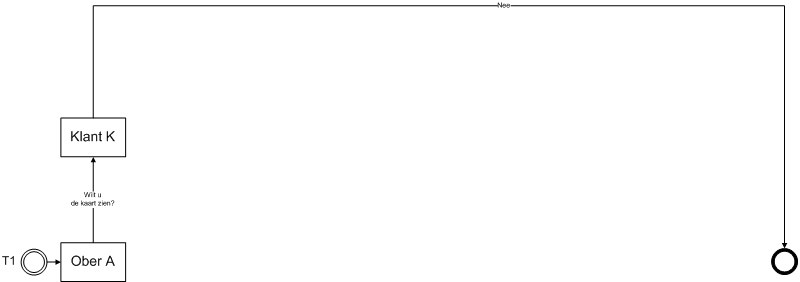{#fig:scenario1 width="100%"}

*Description*\
\
Waiter A asks Customer K if he/she wants to see the card. When filling
in the question whether the customer wants to see the map, all different
Base Type fields are presented.\
\
Test if the following fields work as follows:

::: {#tab:my_label}
  Field         Function (The input must be\...)
  ------------- -------------------------------------------------------------------------------------------------------------------------
  Boolean       \... either a check box or 0 - 1 or true-false (required)
  Date          \... a date field or date picker (required)
  Date Time     \... a Date and time field or date and time picker (required)
  Time          \... a time field or time picker (required)
  Decimal       \... a number, with or without decimal values (required)
  Integer       \... an integer (required)
  Choice List   \... a field with checked input or drop-down list with the values \"Choice 1\", \"Choice 2\" or \"Choice 3\" (required)
  String        \... random characters can be entered (not required):
:::

Customer K answers the question with No.

### Scenario 2a

*Goal*\
Testing of functionality for:

-   Starting a (sub)transaction.

-   Returning to a (main) transaction.

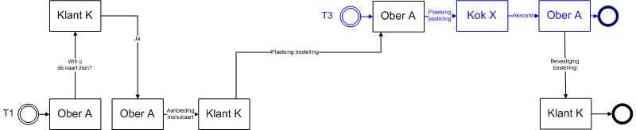{#fig:scenario2a
width="100%"}

*Description*

1.  Waiter A asks Customer K if he/she wants to see the card. Customer K
    answers the question with Yes, and indicates which card he/she wants
    to see.

2.  Waiter A offers the menu that Customer K has requested. Waiter A
    cannot change the menu card type. Customer K receives the requested
    menu. Customer K places an order with Waiter A consisting of a table
    with the name of a dish per row and possibly an associated comment.

3.  Waiter A places the same order with Cook X and with Cook Y. Waiter A
    cannot adjust or supplement Customer K's order.

4.  Cook Y agrees to Waiter A. Cook Y cannot adjust or supplement Waiter
    A's order.

5.  Waiter A agrees to Customer K. Waiter A cannot adjust or supplement
    Cook Y's accord.

6.  After Waiter A has communicated to Customer K, Cook X still gives an
    agreement to Waiter A. Waiter A **cannot communicate anything** with
    the notification received from Cook X, so cannot communicate to Cook
    x or Customer K.

### Scenario 2c

ISSUE 134: Testscenario 2a en 2c gelijk ? Opmerking GS: Volgens mij is
de beschrijving van dit scenario gelijk aan Scenario 2A, het plaatje bij
dit scenario sluit wel beter aan bij de tekst

*Goal*\
Testing for the functionality for a) starting two (sub)transactions and
b) returning 1 (sub)transaction to the (main)transaction.

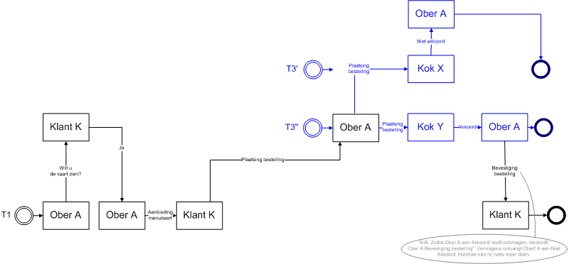{#fig:scenario2c
width="100%"}

*Description*

1.  Waiter A asks Customer K if he/she wants to see the menu.

2.  Customer K answers the question with Yes, and indicates which card
    he/she wants to see.

3.  Waiter A offers the menu that Customer K requested.

4.  Waiter A cannot change the menu card type. Customer K receives the
    requested menu.

5.  Customer K places an order with Waiter A consisting of a table with
    the name of a dish per row and possibly an associated comment.

6.  Waiter A places the same order with Cook X and with Cook Y. Waiter A
    cannot adjust or supplement Customer K's order.

7.  Cook Y gives Waiter A an agreement.

8.  Cook Y cannot adjust or supplement Waiter A's order.

9.  Waiter A gives Customer K an agreement.

10. Waiter A cannot adjust or supplement Cook Y's agreement.

11. After Waiter A has communicated to Customer K, Cook X still a
    non-agreement to Ober A.

12. Waiter A cannot communicate at all with the message received from
    Cook X, i.e. cannot communicate with Cook X or Customer K.

### Scenario 3a

*Goal*\
Testing of functionality for:

-   Starting a certain type of (sub)transaction.

-   Returning to the (main)transaction.

-   Starting the same type of (sub)transaction again.

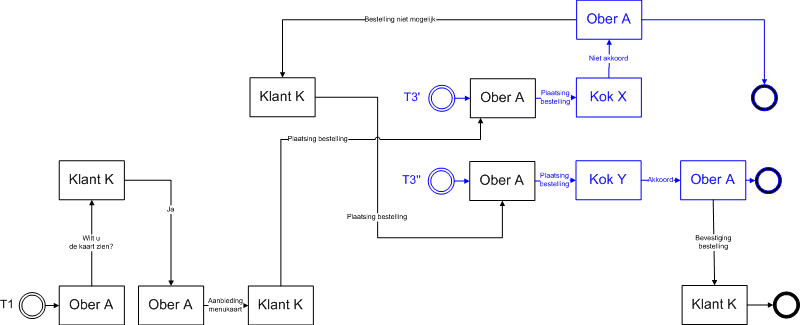{#fig:scenario3a
width="100%"}

*Description*

1.  Waiter A asks Customer K if he/she wants to see the card. Customer K
    answers the question with Yes, and indicates which card he/she wants
    to see.

2.  Waiter A offers the menu that Customer K has requested. Waiter A
    cannot change the menu type *not*. Customer K receives the requested
    menu.

3.  Customer K places an order with Waiter A consisting of a table with
    the name of a dish per row and possibly an associated comment.

4.  Waiter A places the same order with Cook X. Waiter A cannot adjust
    or supplement Customer K's order.

5.  Cook X disagrees with About NA. Cook X cannot adjust or supplement
    Waiter A's order.

6.  Waiter A disapproves of Customer K. Waiter A cannot adjust or
    supplement Cook X's disagreement.

7.  Customer K places a completely new order with Waiter A, consisting
    of a table with the name of a dish per row and possibly an
    associated comment. (Customer K can fill in the entire table.)

8.  Waiter A places the same order with Cook Y. Waiter A cannot adjust
    or supplement Customer K's order.

9.  Cook Y agrees to Waiter A. Cook Y cannot adjust or supplement Waiter
    A's order.

10. Waiter A agrees to Customer K. Waiter A cannot adjust or supplement
    Cook Y's accord.

### Scenario 3b

*Goal*\
Testing of functionality for:

-   Starting a certain type of (sub) transaction.

-   Returning to the (main) transaction.

-   Multiple messages in the main transaction.

-   Start the same type of (sub) transaction again.

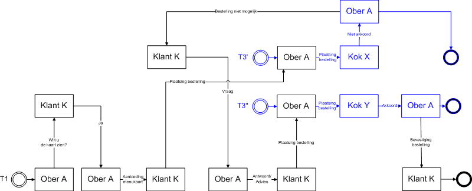{#fig:scenario3b
width="100%"}

*Description*

1.  Waiter A asks Customer K if he/she wants to see the card. Customer K
    answers the question with Yes, and indicates which card he/she wants
    to see.

2.  Waiter A offers the menu that Customer K has requested. Waiter A
    cannot change the menu card type. Customer K receives the requested
    menu.

3.  Customer K places an order with Waiter A consisting of a table with
    the name of a dish per row and possibly an associated comment.

4.  Waiter A places the same order with Cook X. Waiter A cannot adjust
    or supplement Customer K's order.

5.  Cook X gives Waiter A a disagreement. Cook X cannot adjust or
    supplement Waiter A's order.

6.  Waiter A gives Customer K a disagreement. Waiter A cannot adjust or
    supplement Cook X's disagreement.

7.  Customer K asks Waiter A a question.

8.  Waiter A answers Customer K's question. (In the answer, Waiter A
    cannot adjust Customer K's question.)

9.  Customer K places a completely new order with Waiter A, consisting
    of a table with the name of a dish per row and possibly an
    associated comment. (Customer K can fill in the entire table.)

10. Waiter A places the same order with Cook Y. Waiter A cannot adjust
    or supplement Customer K's order.

11. Cook Y agrees to Waiter A. Cook Y cannot adjust or supplement Waiter
    A's order.

12. Waiter A agrees to Customer K. Waiter A cannot adjust or supplement
    Cook Y's accord.

### Scenario 4a

*Goal*\
Testing of functionality for: ElementConditions.

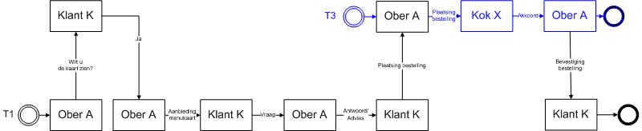{#fig:scenario4a
width="100%"}

*Description*

1.  Waiter A asks Customer K if he/she wants to see the card. Customer K
    answers the question with Yes, and indicates which card he/she wants
    to see.

2.  Waiter A offers the menu that Customer K has requested. Waiter A
    cannot change the menu card type. Customer K receives the requested
    menu.

3.  Customer K asks Waiter A a question.

4.  Waiter A answers Customer K's question. (In the answer, Waiter A
    cannot adjust Customer K's question.)

5.  Customer K places a completely new order with Waiter A, consisting
    of a table with the name of a dish per row and possibly an
    associated comment. (Customer K can fill in the entire table.)

6.  Waiter A places the same order with Cook X. Waiter A cannot adjust
    or supplement Customer K's order.

7.  Cook X agrees to Waiter A. Cook X cannot adjust or supplement Waiter
    A's order.

8.  Waiter A agrees to Customer K. Waiter A cannot adjust or supplement
    Cook X's accord.

### Scenario 4b

*Goal*\
Testing of functionality for: ElementConditions.

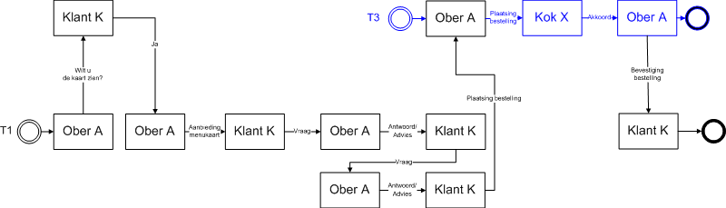{#fig:scenario4b
width="100%"}

*Description*

1.  Waiter A asks Customer K if he/she wants to see the card. Customer K
    answers the question with Yes, and indicates which card he/she wants
    to see.

2.  Waiter A offers the menu that Customer K has requested. Waiter A
    cannot change the menu card type. Customer K receives the requested
    menu.

3.  Customer K asks Waiter A a question.

4.  Waiter A answers Customer K's question. (In the answer, Waiter A
    cannot adjust Customer K's question.)

5.  Customer K asks a second question to Waiter A. (In the question,
    Customer K cannot fill in the question, because in the framework
    ElementCondition has no value for condition!!!)

6.  Waiter A answers Customer K's question. (In the answer, Waiter A
    cannot adjust Customer K's question.)

7.  Customer K places a completely new order with Waiter A, consisting
    of a table with the name of a dish per row and possibly an
    associated comment. (Customer K can fill in the entire table.)

8.  Waiter A places the same order with Cook X. Waiter A cannot adjust
    or supplement Customer K's order.

9.  Cook X agrees to Over NA. Cook X cannot adjust or supplement Waiter
    A's order.

10. Waiter A agrees to Customer K. Waiter A cannot adjust or supplement
    Cook X's accord.

### Scenario 4c

*Goal*\
Testing of functionality for: ElementConditions.

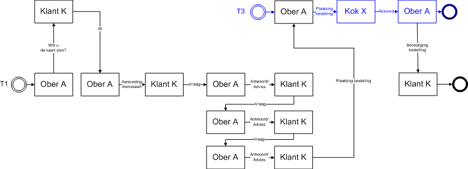{#fig:scenario4c
width="100%"}

*Description*

1.  Waiter A asks Customer K if he/she wants to see the card. Customer K
    answers the question with Yes, and indicates which card he/she wants
    to see.

2.  Waiter A offers the menu that Customer K has requested. Waiter A
    cannot change the menu card type. Customer K receives the requested
    menu.

3.  Customer K asks Waiter A a question.

4.  Waiter A answers Customer K's question. (In the answer, Waiter A
    cannot adjust Customer K's question.)

5.  Customer K asks a second question to Waiter A. (In the question,
    Customer K cannot fill in the question, because in the framework
    ElementCondition has no value for condition!!!)

6.  Waiter A answers Customer K's question. (In the answer, Waiter A
    cannot adjust Customer K's question.)

7.  Customer K asks a third question to Waiter A. (In the question,
    Customer K cannot fill in the question, because in the framework
    theElementCondition has no value for condition!!!)

8.  Waiter A answers Customer K's question. (In the answer, Waiter A
    cannot adjust Customer K's question.)

9.  Customer K places a completely new order with Waiter A, consisting
    of a table with the name of a dish per row and possibly an
    associated comment. (Customer K can fill in the entire table.)

10. Waiter A places the same order with Cook X. Waiter A cannot adjust
    or supplement Customer K's order.

11. Cook X agrees to Waiter A. Cook X cannot adjust or supplement Waiter
    A's order.

12. Waiter A agrees to Customer K. Waiter A cannot adjust or supplement
    Cook X's accord.

### Scenario 5a

*Goal*\
Testing of functionality for:

-   ElementConditions

-   openSecondaryTransactionsAllowed

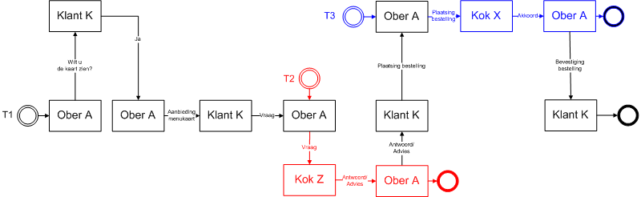{#fig:scenario5a
width="100%"}

*Description*

1.  Waiter A asks Customer K if he/she wants to see the card. Customer K
    answers the question with Yes, and indicates which card he/she wants
    to see.

2.  Waiter A offers the menu that Customer K has requested. Waiter A
    cannot change the menu card type. Customer K receives the requested
    menu.

3.  Customer K asks Waiter A a question.

4.  Waiter A asks Cook Z a question. (In the question, Waiter A cannot
    adjust the question.)

5.  Cook Z answers Waiter A's question. (In the answer, Cook Z cannot
    adjust Waiter A's question.)

6.  Waiter A answers Customer K's question. (In the answer, Waiter A
    cannot adjust Cook Z's answer.)

7.  Customer K places a completely new order with Waiter A, consisting
    of a table with the name of a dish per row and possibly an
    associated comment. (Customer K can fill in the entire table.)

8.  Waiter A places the same order with Cook X. Waiter A cannot adjust
    or supplement Customer K's order.

9.  Cook X agrees to Waiter A. Cook X cannot adjust or supplement Waiter
    A's order.

10. Waiter A agrees to Customer K. Waiter A cannot adjust or supplement
    Cook X's accord.

### Scenario 5b

*Goal*\
Testing of functionality for:

-   ElementConditions

-   openSecondaryTransactionsAllowed

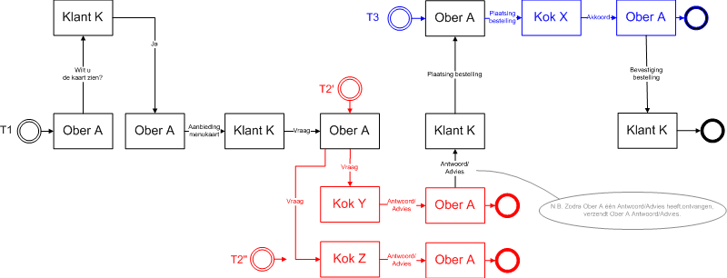{#fig:scenario5b
width="100%"}

*Description*

1.  Waiter A asks Customer K if he/she wants to see the card. Customer K
    answers the question with Yes, and indicates which card he/she wants
    to see.

2.  Waiter A offers the menu that Customer K has requested. Waiter A
    cannot change the menu card type. Customer K receives the requested
    menu.

3.  Customer K asks Waiter A a question.

4.  Waiter A asks Cook Y and Z a question. (In the question, Waiter A
    cannot adjust the question.)

5.  Cook Y answers Waiter A's question. (In the answer, Cook Y cannot
    adjust Waiter A's question.)

6.  Waiter A answers Customer K's question. (In the answer, Waiter A
    cannot adjust Cook Y's answer.)

7.  After Waiter A has communicated to Customer K, Cook Z still gives an
    answer to Waiter A. Waiter A cannot communicate at all with the
    notification received from Cook Z, so cannot communicate to Cook Z
    or Customer K.

8.  Customer K places a completely new order with Waiter A, consisting
    of a table with the name of a dish per row and possibly an
    associated comment. (Customer K can fill in the entire table.)

9.  Waiter A places the same order with Cook X. Waiter A cannot adjust
    or supplement Customer K's order.

10. Cook X agrees to Waiter A. Cook X cannot adjust or supplement Waiter
    A's order.

11. Waiter A agrees to Customer K. Waiter A cannot adjust or supplement
    Cook X's chord.

### Scenario 5c

*Goal*\
Testing of functionality for:

-   ElementConditions

-   openSecondaryTransactionsAllowed

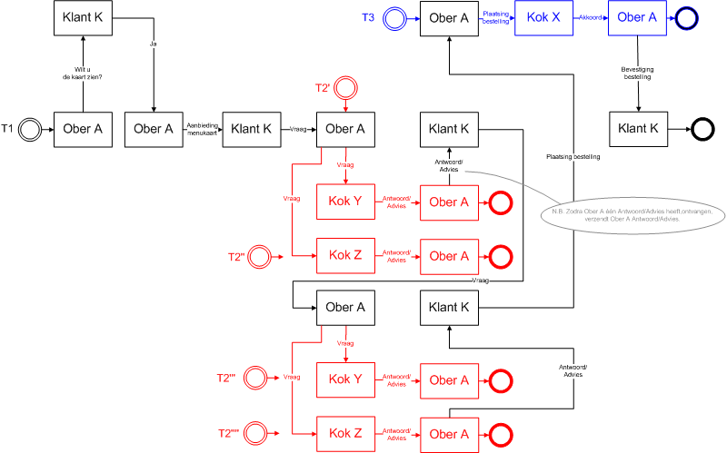{#fig:scenario5c
width="100%"}

*Description*

1.  Waiter A asks Customer K if he/she wants to see the card. Customer K
    answers the question with Yes, and indicates which card he/she wants
    to see.

2.  Waiter A offers the menu that Customer K has requested. Waiter A
    cannot change the menu card type. Customer K receives the requested
    menu.

3.  Customer K asks Waiter A a question.

4.  Waiter A asks Cook Y and Z a question. (In the question, Waiter A
    cannot adjust the question.)

5.  Cook Y answers Waiter A's question. (In the answer, Cook Y cannot
    adjust Waiter A's question.)

6.  Waiter A answers Customer K's question. (In the answer, Waiter A
    cannot adjust Cook Y's answer.)

7.  Customer K asks a second question to Waiter A. (In the question,
    Customer K cannot fill in the question, because in the framework
    ElementCondition has no value for condition!!!)

8.  Waiter A asks Cook Y and Z a second question. (In the question,
    Waiter A cannot adjust the question.)

9.  Cook Z answers the first question from Waiter A. Waiter A cannot
    communicate at all with the notification received from Cook Z, so
    cannot communicate with Cook Z or Customer K.

10. Cook Z answers Waiter A's second question. (In the answer, Cook Z
    cannot adjust Waiter A's question.)

11. Waiter A answers Customer K's question. (In the answer, Waiter A
    cannot adjust Cook Z's answer.)

12. After Waiter A has communicated to Customer K, Cook Y still answers
    Waiter A to the second question. Waiter A cannot communicate at all
    with the notification received from Cook Y, so cannot communicate
    with Cook Y or Customer K.

13. Customer K places a completely new order with Waiter A, consisting
    of a table with the name of a dish per row and possibly an
    associated comment. (Customer K can fill in the entire table.)

14. Waiter A places the same order with Cook X. Waiter A cannot adjust
    or supplement Customer K's order.

15. Cook X agrees to Waiter A. Cook X cannot adjust or supplement Waiter
    A's order.

16. Waiter A agrees to Customer K. Waiter A cannot adjust or supplement
    Cook X's accord.

### Scenario 5d

*Goal*\
Testing of functionality for:

-   ElementConditions

-   openSecondaryTransactionsAllowed

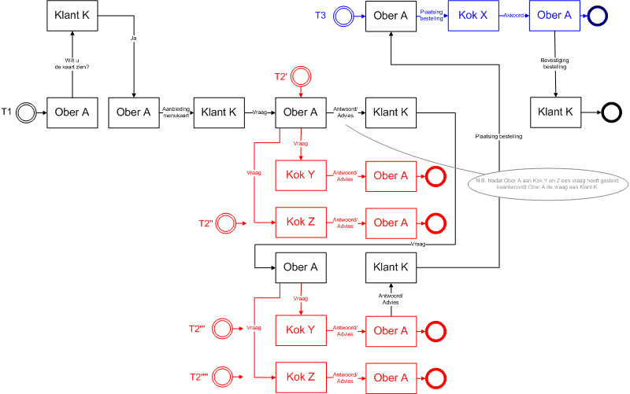{#fig:scenario5d
width="100%"}

*Description*

1.  Waiter A asks Customer K if he/she wants to see the card. Customer K
    answers the question with Yes, and indicates which card he/she wants
    to see.

2.  Waiter A offers the menu that Customer K has requested. Waiter A
    cannot change the menu card type. Customer K receives the requested
    menu.

3.  Customer K asks Waiter A a question.

4.  Waiter A asks Cook Y and Z a question. (In the question, Waiter A
    cannot adjust the question.)

5.  The answer from Cook Y and Z is not forthcoming. Waiter A answers
    Customer K's question. (In the answer, Waiter A cannot adjust
    Customer K's question.)

6.  Customer K asks a second question to Waiter A. (In the question,
    Customer K cannot fill in the question, because in the framework
    ElementCondition has no value for condition!!!)

7.  Waiter A asks Cook Y and Z a second question. (In the question,
    Waiter A cannot adjust the question.)

8.  Cook Y answers Waiter A's first question. Waiter A cannot
    communicate at all with the notification received from Cook Y, so
    cannot communicate with Cook Y or Customer K.

9.  Cook Z answers the first question from Waiter A. Waiter A cannot
    communicate at all with the notification received from Cook Z, so
    cannot communicate with Cook Z or Customer K.

10. Cook Y answers Waiter A's second question. (In the answer, Cook Y
    cannot adjust Waiter A's question.)

11. Waiter A answers Customer K's question. (In the answer, Waiter A
    cannot adjust Cook Y's answer.)

12. After Waiter A has communicated to Customer K, Cook Z still answers
    Waiter A to the second question. Waiter A cannot communicate at all
    with the notification received from Cook Z, so cannot communicate
    with Cook Z or Customer K.

13. Customer K places a completely new order with Waiter A, consisting
    of a table with the name of a dish per row and possibly an
    associated comment. (Customer K can fill in the entire table.)

14. Waiter A places the same order with Cook X. Waiter A cannot adjust
    or supplement Customer K's order.

15. Cook X agrees to Waiter A. Cook X cannot adjust or supplement Waiter
    A's order.

16. Waiter A agrees to Customer K. Waiter A cannot adjust or supplement
    Cook X's accord.

### Scenario 6a

*Goal*\
Testing of functionality for: A (main)transaction with two layers of
(sub)transactions.

{#fig:scenario6a
width="100%"}

*Description*

1.  Waiter A asks Customer K if he/she wants to see the card. Customer K
    answers the question with Yes, and indicates which card he/she wants
    to see.

2.  Waiter A offers the menu that Customer K has requested. Waiter A
    cannot change the menu card type. Customer K receives the requested
    menu.

3.  Customer K asks Waiter A a question.

4.  Waiter A asks Cook Y a question. (In the question, Waiter A cannot
    adjust the question.)

5.  Cook Y asks two kitchen helpers. (Kitchen Help N and Kitchen Help O)

6.  Kitchen help N answers Cook Y.

7.  Kitchen help O answers Cook Y.

8.  Cook Y answers Waiter A when he has received answers from Kitchen
    Help N and/or O.

9.  Waiter A then answers Customer K.

10. Customer K is satisfied with the answer and places his/her order
    with Waiter A.

11. Waiter A places the order with Cook X.

12. Cook X asks Kitchen Help P if he/she can look up the recipe.

13. Kitchen help P looks up the recipe and answers Cook X.

14. Cook X now has the recipe and can agree to Waiter A.

15. Waiter A confirms the order to Customer K.

ISSUE 135: testscenario pizzeria 7a varianten Te testen varianten
(voorstel Michon Maas):

### Scenario 6a - Variant 1 (initiation with internal transaction within one party)

Initiation process from internal transaction. This can be achieved
through a specific division of roles between different
suppliers/parties. Fulfillment of roles:

1.  Role Waiter A implemented by supplier X

2.  Role Customer K implemented by supplier X

3.  Role Cook Y implemented by supplier X

4.  Role Kitchen help N en O implemented by supplier Y

### Scenario 6a - Variant 2 (initiatie met interne transactie op raakvlak partij)

Initiation process from the interface between suppliers/parties.
Fulfillment of roles:

1.  Role Waiter A implemented by supplier X

2.  Role Customer K implemented by supplier Y

3.  Role Cook Y implemented by supplier Y

4.  Role Kitchen help N en O implemented by supplier Y

### Scenario 6a - Variant 3 (initiatie met interne transactie over drie partijen)

Process with multiple linked transactions across three
suppliers/parties. Fulfillment of roles:

1.  Role Waiter A implemented by supplier X

2.  Role Customer K implemented by supplier Y

3.  Role Cook Y implemented by supplier Y

4.  Role Kitchen help N en O implemented by supplier Z

### Scenario 7a

*Goal*\
Testing of functionality for: the correct operation of message sequence
(sendBefore en sendAfter)\
\
*Description*

-   The waiter sends an order to the cook (T3).

    -   Only 1 of the present cooks may be chosen here.

    -   The waiter is not allowed to send another order to the cook
        after this.

```{=html}
<!-- -->
```
-   The cook sends a question to the kitchen helper (T4). This can be
    based on the request of the waiter (T2), or the order of the waiter
    (T3).

```{=html}
<!-- -->
```
-   The kitchen helper sends an answer in T4. The cook should now be
    able to choose from the following options:

    -   If it was based on a question from the waiter(T2) he can choose
        from:

        -   Forward the answer to the waiter in T2.

        -   Ask a new question in T4.

        -   Report that the answer is not used in T4.

    -   If it was based on an order from the waiter, he can choose from:

        -   Agree or disagree message to the waiter in T3.

        -   Ask a new question in T4.

        -   Report that the answer is not used in T4.

```{=html}
<!-- -->
```
-   Once the cook has sent a reply to the waiter in T2 or T3:

    -   Can the cook no longer send a new question to the kitchen helper
        in T4.

    -   Can he only send 1 closing message to the kitchen helper in T4
        each time. This message corresponds to the message that went to
        the waiter in T2 or T3.

### Scenario 8

*Goal*\
Testing of functionality for: Define the number of rows in a table.
(minOccurs/maxOccurs on child CE)\
*Description*

-   Transaction only (T1)

    -   Waiter sends the question to the customer if he wants to see the
        menu.

    -   Customer answers \"Yes\".

    -   Waiter sends the message \"Menu card\".

        -   At the table Menu card; test that no more than 3 can be
            filled in and that it can be sent empty.

    -   Customer replies with \"Order\".

        -   At the table \"Content of the order\"; test that 1 or more
            lines must be filled in and that empty sending should not be
            possible.

        -   Test at the table \"Content of drinks order\" that it is
            mandatory to fill in 1 line and that empty or more than 1
            line is not allowed.

### Scenario 9

*Goal*\
Testing of functionality for: the mandatory inclusion of an appendix for
a message type (appendixMandatory).

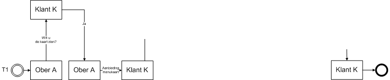{#fig:scenario9 width="100%"}

*Description*

1.  Waiter A asks Customer K if he/she wants to see the card. Customer K
    answers the question with Yes, and indicates which card he/she wants
    to see.

2.  Waiter A offers the menu that Customer K has requested, WITHOUT
    attachment.

3.  Waiter A can NOT offer the menu to Customer K, because he forgot to
    add an attachment.

4.  Waiter A then offers the menu that Customer K has requested, WITH an
    attachment.

5.  Waiter A can offer the menu to Customer K, because he has added an
    attachment.

6.  Customer K receives menu card with attachment.

### Scenario 10

*Goal*\
Testing of functionality for: Element conditions in tables (Ce normal /
CE parent / CE Child); Sys 1.6 and higher\
*Description*

-   The waiter offers the menu.

-   Customer says \"yes\".

-   Waiter completes the menu card message as follows:

    -   Menu card (top table, check that this name \"Menu card\" of the
        CE is legible).

        -   Fill in 2 lines, all cells must contain values.

    -   Daily menu (middle table, check that this name \"Daily menu\" of
        the CE is legible).

        -   Fill in 2 lines, all cells must contain values.

    -   Drinks card (bottom table table, check that this name \"Drinks
        card\" from the CE is legible).

        -   Fill in 2 lines, all cells must contain values.

-   Customer responds with the message \"question\";

    -   In the \"Menu card\" table you check:

        -   Whether the name of the CE \"Menu card\" is visible.

        -   The values in the column Description and Price must be
            adjustable, the first column is not adjustable. \[Naam
            default fixed / Omschr; se free in deze parent ce (5)/Prijs
            se free in child ce (3)\]

        -   No lines can be deleted or added.

        -   Empty the bottom cell \"Description\" in preparation for the
            next check.

    -   In the \"Daily menu\" table you check:

        -   Whether the name of the CE "Daily Menu" is visible.

        -   Only the Name column is still filled and can be edited. The
            other 2 columns are empty. \[Parent CE dagmenu EMPTY
            (4)/Naam se FREE in mitt, parent, child, se(15)/Prijs free
            in child (3)\]

        -   Rules can be removed or added.

    -   In the "Drink card" table you check:

        -   Whether the name of the CE "Drinks card" is visible.

        -   The name and description columns are editable, the price
            column is not editable. \[FREE op parent en child CE (6) /
            fixed op parent ce, child CE en SE prijs (7)\]

        -   No lines can be deleted or added.

    -   Send the message.

-   Waiter responds with "Reply" message.

    -   Check:

        -   No lines can be removed or added \[FREE on child and parent
            in wrong order so not a valid condition. Menu content must
            be parent and menu must be child for this condition to work.
            (n/a)\]

### Scenario 11

*Goal*\
Testing for no-ascii symbols in:

-   Description of elements (SimpleElementType, ComplexElementType,
    MessageType, TransactionType)

-   Enumeratie (UserDefiniedType).

*Description*\
Waiter A starts a new transaction and sends a message to Customer K. In
the message, Waiter A enters the value \"eaiou with circumflexes:
êâîôû\" for element \"Enumeration/Selection List\".\
*Result*\
To Waiter A, elements are shown in the message with $>$ and & and € in
the description. The Enumeration/Picklist element shows a list including
êâîôûëäïöü$<$\"$\mu$\@ç€.\
\
Customer K receives a message with element \"Enumeration/Picklist\" the
value \"eaiou with circumflexes: êâîôû\".

## Reading archived VISI project

*Goal*\
Testing for: reading a file that complies with the guidelines for
archiving VISI projects.\
*Description*\
The file is read into the application without manual pre-processing. It
is up to you how this is read and by whom.\
Met een nabewerking worden openstaande transacties worden geadresseerd
aan\
Wat te doen met soap servers? Deze moeten eigenlijk aangepast worden om
de communicatie verder te kunnen laten lopen.\
*Result*\
The system has read all information from the file, namely: a)
transactions, messages, attachments, b) frameworks, c) project-specific
messages.\
The system can continue open transactions.\
*Sample Data*\
Files can be requested from Elisabeth Kloren.

## Archiving and reactivating projects

*Scenario 1*

-   Archive a VISI Project.

-   Import the archived VISI Project into another VISI environment.

-   Compare the original project with the rebuilt project.

*Result*

-   The content of both projects, including frameworks, project specific
    messages, transactions, messages, attachments etc must be exactly
    the same.

-   Possibly after adjustment of the soap address, communication with
    the project must be possible.

## Archiving of a VISI project

*Goal*\
Testing for: creating a file that complies with the guidelines for
archiving VISI projects.\
*Description*\
A project is archived (from the application). It is up to you how this
\"archive\" is created and by whom.\
The project must have the following properties:

-   Transaction with a subject longer than 256 characters.

-   Transaction with non-alphanumeric characters in the subject.

-   Attachment with a name longer than 256 characters.

*Result*\
The system has written out information from the project, namely: all a)
transactions, messages, attachments, b) frameworks, c) project-specific
messages. The structuring of the data is in accordance with the
guideline.\
\
Special consideration should be given to non-ascii characters in the
subject of a transaction, which are not allowed in Microsoft Windows
directory names (for example /: ). These characters must appear in the
directory names as spaces.

## HTTPS check

The project-specific message is provided with a SOAP Server with http.\
*Expected result*\
The project-specific message is not read/rejected.\
*Sample Data*\
The project-specific message
\"projectspecifiekberichttotenmetbericht_6.xml\".

## Large attachments

A zip file of 10GB is attached to a message. This message is sent to
another server via soap.\
*Expected result*\
The message with the attachment is sent correctly, the attachment can be
extracted on the other server and the files extracted from the zip are
readable.\
*Sample Data*\
A zip file can be created on the spot.

## HTTPS requirement

*Goal*\
Testing for: enforcing secure communications\
*Description*

1.  The project-specific message of an existing project is modified. The
    soap server address is changed from https:// to http://.

2.  The adjusted project-specific message is read into the application.

*Expected result*\
The application rejects the project specific message, and the xml file
is not read/activated.\
*Sample Data*\
The project-specific message
\"projectspecifiekberichttotenmetbericht_6.xml\".

## Attachments $>$`<!-- -->`{=html}2GB

*Goal*\
Testing for: sending and receiving attachments larger than 2GB and
smaller than 10GB.\
*Description*

1.  A 9.9 GB zip file is attached to a new message. The zip file
    contains at least one PDF.

2.  The message is sent and goes via the soap protocol to an external
    server.

3.  The message is received on the remote server. And the message
    contains the zip file as the attachment.

*Expected result*\
The attachment is a zip file and can be extracted on the remote server.
The file sizes on the sending and receiving server are the same (in
bytes). The PDF file extracted from the zip has the same size (in bytes)
on both servers. Also, the PDF file can be opened on the receiving
server with an application, and the content corresponds to the PDF file
on the sending server.\
*Sample Data*\
Prior to running the test scenario, a zip file can be compiled with at
least 1 PDF file.

## Test scenarios meta framework

### Scenario A.1 (meta framework)

*Goal*\
Testing of functionality for: initiating a project with the meta
framework.\
*Prerequisite*\
VISI Project met meta-raamwerk & meta-projectspecifiek bericht raamwerk
projectspecifiek bericht

{#fig:scenarioA1
width="100%" height="16cm"}

*Description*\
Project initiator offers Project executor a proposal for a new VISI
project with a new framework and project-specific message as
attachments. Project executor answers the proposal with acceptance of
the new VISI project. Project initiator confirms project initiation to
Project executor. Project executor reports back to Project initiator
that the project has been set up.\
End\
*Expected result*\
\...

## Scenario A.2 (meta framework)

*Goal*\
Testing of functionality for: ending a project with the meta framework.\
*Prerequisite*\
VISI Project met meta-raamwerk & meta-projectspecifiek bericht VISI
Project met raamwerk & projectspecifiek bericht

{#fig:scenarioA2
width="100%"}

*Description*\
Project initiator offers Project executor a proposal for a new VISI
project with a new framework and project-specific message as
attachments. Project executor answers the proposal with acceptance of
the new VISI project. Project initiator confirms project initiation to
Project executor. Project executor reports back to Project initiator
that the project has been set up.\
End\
*Expected result*\
\...

## Scenario B (meta framework)

*Goal*\
Testing of functionality for: updating an existing project with the meta
framework.\
*Prerequisite*\
VISI Project met meta-raamwerk & meta-projectspecifiek bericht VISI
Project met raamwerk & projectspecifiek bericht gewijzigd raamwerk
gewijzigd projectspecifieke bericht

{#fig:scenarioB width="100%"
height="18.5cm"}

*Description*\
Change initiator offers VISI Communication Manager a proposal for
changing an existing VISI project with an amended framework and a
modified project-specific message as attachments. VISI Communication
Manager answers the proposal with approval. Change initiator confirms
the proposed change by proposing an effective date and time to VISI
Communicator. VISI Communicator answers the proposal with agreement.
Change initiator confirms the effective date and time.\
End\
*Expected result*\
\...

## Visi werk sessie 16 mei 2023

### Test sets Jos

Jos heeft niet de B&S software gebruikt om niet hun fouten mee te nemen.
eigen raamwerk software gebruikt 1.6. Kan gewoon querries op los worden
gelaten. om testset te maken om goed te kunnen zien wat er ingesteld
staat. per stap van de test een overzicht nodig voor: wat was het vorige
bericht, waar staan we, hoeveel rijen zijn er, wat is het max, welke
types zitter er in? per bericht genoteerd welke content er in dat
bericht zit. en wat je nodig hebt om te kunnen zien of het fucntioneert.
alle informatie die in het raarmwerk zit kunnen afbeelden per bericht.
zie rapportage van access. een hoop paginas, maar voor het testen moet
je echt gaan zitten

#### elementCondition

initieel bericht kun je alle waardes invullen bij vervolg bericht kan
dit niet 2 nieuwe berichten types gedefineerd: initieel en kopie om dit
op te lossen? before en after conditities

spreadsheet uit de mail kan niet alle informatie bevatten (char limit)
userdefine type, staat een hele lijst van plaatsnamen die mogelijk zijn
in, dat vind excel te veel.

scenario7, is herschreven door jos, gaat die bespreken met arne om te
kijken of dit terrecht is.

Documentatie: oude visio versie gebruikt om te upgraden naar nieuwere
versie.

auditor: iemand van iso ter certificering gebruiken ipv tno. maar
hierbij is waarschijnlijk wel een

zou jezelf als developer moeten testen of je nog voldoet als je
aanpassingen doet in je software.

soap aanvullingen in mail zetten Jeroen heeft unit tests voor
aanpassingen. software ontwikkelaar doet dit zelf ook. functionele
testen worden geregistreerd, wij gebruiken teec2, jeroen nog excel.

tessa loopt nog tegen scenario11 aan.

documentatie: mag een bericht zonder complex en zonder simpleElement en
complexelement bestaan?

## Testscenario archiveren en weer activeren van projecten

\_\_Scenario 1\_\_ - Archiveer een VISI-Project; - Importeer het
gearchiveerde VISI-Project in een andere VISI-omgeving; - Vergelijk het
originele project met het opnieuw opgebouwde project.

\_\_Testresultaat:\_\_ - De inhoud van beide projecten, inclusief
raamwerken, project specifieke berichten, transacties, berichten,
bijlagen etc moet exact gelijk zijn. - Eventueel na aanpassing van het
soap adres moet communicatie met het project mogelijk zijn

## Testscenario's

\<div class=\"wikidoc\"\> \<p\>De figuren van onderstaande scenario's
zijn opgesteld in Microsoft Visio 2003. Het bronbestand is: \<a
href=\"https://github.com/bimloket/visi/blob/master/WIKI%20docs/Testscenario's_Scenarios_vsd.zip\"\>
Scenarios_vsd.zip\</a\>\</p\> \<h2\>VISI-raamwerk\</h2\> \<p\>\<span
style=\"font-size:10pt\"\>Het raamwerk bevat vier
transactietypen:\</span\>\</p\> \<p\>- t1_OpnameBestelling;\<br\> -
t2_VraagOberAanKok;\<br\> - t3_OpdrachtKok;\<br\> -
t4_VraagKokAanKeukenhulp.\</p\> \<p\>En vier rollen: Klant, Ober, Kok en
Keukenhulp.\</p\> \<p\>\\</p\> \<p\>&nbsp;\</p\> \<h2\>&nbsp;\</h2\> \<h2\>Scenario
1\</h2\> \<p\>\<strong\>\<strong\>Doel:\</strong\>\</strong\>\</p\>
\<p\>Testen op de functionaliteit voor \<br\> a) het starten van een
transactie\<br\> b) het beantwoorden van een bericht\<br\> c) het
gebruik van verschillende soorten gegevensvelden\</p\>
\<p\>\<strong\>Figuur:\</strong\>\</p\> \<p\>\<strong\>\\<br\> \</strong\>\</p\>
\<p\>\<strong\>Beschrijving:\</strong\>\</p\> \<ul\> \<li\>Ober A vraagt
aan Klant K of hij/zij de kaart wil zien. \</li\>\<li\>Bij het invullen
van de vraag of de klant de kaart wil zien, worden alle verschillende
Base Type velden aangeboden. \</li\>\<li\>Test of de volgende velden als
volgt werken: \<ul\> \<li\>Boolean \<ul\> \<li\>Hier moet een vinkjes
veldje&nbsp; of 0 - 1 of true-false of waar-onwaar staan (verplicht)
\</li\>\</ul\> \</li\>\<li\>Date / Datum \<ul\> \<li\>Een datum moet
ingevoerd worden (verplicht) \</li\>\</ul\> \</li\>\<li\>Datetime /
Datum en tijd \<ul\> \<li\>Datum en tijd moeten ingevuld worden
(verplicht) \</li\>\</ul\> \</li\>\<li\>Time / Tijd \<ul\> \<li\>Een
tijdstip moet ingevoerd worden (verplicht) \</li\>\</ul\>
\</li\>\<li\>Decimal / Decimaal \<ul\> \<li\>Een getal, al dan niet met
decimale waarden moet ingevoerd worden (verplicht) \</li\>\</ul\>
\</li\>\<li\>Integer / Geheel getal \<ul\> \<li\>Een geheel getal moet
ingevoerd worden (verplicht) \</li\>\</ul\> \</li\>\<li\>Keuzelijst
\<ul\> \<li\>Een van de waarden &quot;Keuze 1&quot;, &quot;Keuze 2&quot;
of &quot;Keuze 3&quot; moet ingevoerd worden (verplicht) \</li\>\</ul\>
\</li\>\<li\>String / Vrije tekst \<ul\> \<li\>Willekeurige tekens
kunnen ingevoerd worden (niet verplicht) \</li\>\</ul\> \</li\>\</ul\>
\</li\>\<li\>Klant K beantwoordt de vraag met Nee.&nbsp; \</li\>\</ul\>
\<p\>\<br\> Einde\</p\>

\<h2\>Scenario 3a\</h2\> \<p\>\<strong\>Doel:\</strong\>\</p\>
\<p\>Testen op de functionaliteit voor het starten van een bepaald type
(sub)transactie, terugkeren naar de (hoofd)transactie, en weer starten
van hetzelfde type (sub)transactie.\</p\>
\<p\>\<strong\>Figuur:\</strong\>\</p\> \<p\>\\</p\> \<p\>\<strong\>Beschrijving:\</strong\>\<br\> Ober A
vraagt aan Klant K of hij/zij de kaart wil zien. Klant K beantwoordt de
vraag met Ja, en geeft aan welke kaart hij/zij wil zien. \<br\> Ober A
biedt de menukaart aan die Klant K gevraagd heeft. Ober A kan het
menukaarttype \<em\>niet\</em\> wijzigen. Klant K krijgt de gevraagde
menukaart. \<br\> Klant K plaatst een bestelling bij Ober A bestaande
uit een tabel met per rij de naam van een gerecht en eventueel een
bijbehorende opmerking. \<br\> Ober A plaatst dezelfde bestelling bij
Kok X. Ober A kan de bestelling van Klant K niet aanpassen, en ook niet
aanvullen. \<br\> Kok X geeft Ober A een niet akkoord. Kok X kan de
bestelling van Ober A niet aanpassen, en ook niet aanvullen. \<br\> Ober
A geeft Klant K een niet akkoord. Ober A kan het niet akkoord van Kok X
niet aanpassen, en ook niet aanvullen. \<br\> Klant K plaatst een
compleet nieuwe bestelling bij Ober A bestaande uit een tabel met per
rij de naam van een gerecht en eventueel een bijbehorende opmerking.
(Klant K kan de gehele tabel invullen.) \<br\> Ober A plaatst dezelfde
bestelling bij Kok Y. Ober A kan de bestelling van Klant K niet
aanpassen, en ook niet aanvullen. \<br\> Kok Y geeft Ober A een akkoord.
Kok Y kan de bestelling van Ober A niet aanpassen, en ook niet
aanvullen. \<br\> Ober A geeft Klant K een akkoord. Ober A kan het
akkoord van Kok Y niet aanpassen, en ook niet aanvullen. \<br\>
Einde.\</p\> \<h2\>Scenario 3b\</h2\>
\<p\>\<strong\>Doel:\</strong\>\</p\> \<p\>Testen op de functionaliteit
voor het starten van een bepaald type (sub)transactie, terugkeren naar
de (hoofd)transactie, meerdere berichten in de hoofdtransactie, en weer
starten van hetzelfde type (sub)transactie.\</p\>
\<p\>\<strong\>Figuur:\</strong\>\</p\> \<p\>\<strong\>\\<br\> \</strong\>\</p\>
\<p\>\<strong\>Beschrijving:\</strong\>\<br\> Ober A vraagt aan Klant K
of hij/zij de kaart wil zien. Klant K beantwoordt de vraag met Ja, en
geeft aan welke kaart hij/zij wil zien. \<br\> Ober A biedt de menukaart
aan die Klant K gevraagd heeft. Ober A kan het menukaarttype
\<em\>niet\</em\> wijzigen. Klant K krijgt de gevraagde menukaart.
\<br\> Klant K plaatst een bestelling bij Ober A bestaande uit een tabel
met per rij de naam van een gerecht en eventueel een bijbehorende
opmerking. \<br\> Ober A plaatst dezelfde bestelling bij Kok X. Ober A
kan de bestelling van Klant K niet aanpassen, en ook niet aanvullen.
\<br\> Kok X geeft Ober A een niet akkoord. Kok X kan de bestelling van
Ober A niet aanpassen, en ook niet aanvullen. \<br\> Ober A geeft Klant
K een niet akkoord. Ober A kan het niet akkoord van Kok X niet
aanpassen, en ook niet aanvullen. \<br\> Klant K stelt Ober A een vraag.
\<br\> Ober A beantwoordt de vraag van Klant K. (In de beantwoording kan
Ober A de vraag van Klant K \<em\>niet\</em\> aanpassen.) \<br\> Klant K
plaatst een compleet nieuwe bestelling bij Ober A bestaande uit een
tabel met per rij de naam van een gerecht en eventueel een bijbehorende
opmerking. (Klant K kan de gehele tabel invullen.) \<br\> Ober A plaatst
dezelfde bestelling bij Kok Y. Ober A kan de bestelling van Klant K niet
aanpassen, en ook niet aanvullen. \<br\> Kok Y geeft Ober A een akkoord.
Kok Y kan de bestelling van Ober A niet aanpassen, en ook niet
aanvullen. \<br\> Ober A geeft Klant K een akkoord. Ober A kan het
akkoord van Kok Y niet aanpassen, en ook niet aanvullen. \<br\>
Einde.\</p\> \<h2\>Scenario 4a\</h2\>
\<p\>\<strong\>Doel:\</strong\>\</p\> \<p\>Testen op de functionaliteit
voor ElementConditions.\</p\> \<p\>\<strong\>Figuur:\</strong\>\</p\>
\<p\>\<strong\>\\<br\> \</strong\>\</p\>
\<p\>\<strong\>Beschrijving:\</strong\>\<br\> Ober A vraagt aan Klant K
of hij/zij de kaart wil zien. Klant K beantwoordt de vraag met Ja, en
geeft aan welke kaart hij/zij wil zien. \<br\> Ober A biedt de menukaart
aan die Klant K gevraagd heeft. Ober A kan het menukaarttype
\<em\>niet\</em\> wijzigen. Klant K krijgt de gevraagde menukaart.
\<br\> Klant K stelt een vraag aan Ober A. \<br\> Ober A beantwoordt de
vraag van Klant K. (In de beantwoording kan Ober A de vraag van Klant K
\<em\>niet\</em\> aanpassen.) \<br\> Klant K plaatst een compleet nieuwe
bestelling bij Ober A bestaande uit een tabel met per rij de naam van
een gerecht en eventueel een bijbehorende opmerking. (Klant K kan de
gehele tabel invullen.) \<br\> Ober A plaatst dezelfde bestelling bij
Kok X. Ober A kan de bestelling van Klant K niet aanpassen, en ook niet
aanvullen. \<br\> Kok X geeft Ober A een akkoord. Kok X kan de
bestelling van Ober A niet aanpassen, en ook niet aanvullen. \<br\> Ober
A geeft Klant K een akkoord. Ober A kan het akkoord van Kok X niet
aanpassen, en ook niet aanvullen. \<br\> Einde.\</p\> \<h2\>Scenario
4b\</h2\> \<p\>\<strong\>Doel:\</strong\>\</p\> \<p\>Testen op de
functionaliteit voor ElementConditions.\</p\>
\<p\>\<strong\>Figuur:\</strong\>\</p\> \<p\>\<strong\>\\<br\> \</strong\>\</p\>
\<p\>\<strong\>Beschrijving:\</strong\>\<br\> Ober A vraagt aan Klant K
of hij/zij de kaart wil zien. Klant K beantwoordt de vraag met Ja, en
geeft aan welke kaart hij/zij wil zien. \<br\> Ober A biedt de menukaart
aan die Klant K gevraagd heeft. Ober A kan het menukaarttype
\<em\>niet\</em\> wijzigen. Klant K krijgt de gevraagde menukaart.
\<br\> Klant K stelt een vraag aan Ober A. \<br\> Ober A beantwoordt de
vraag van Klant K. (In de beantwoording kan Ober A de vraag van Klant K
\<em\>niet\</em\> aanpassen.) \<br\> Klant K stelt een tweede vraag aan
Ober A. (In de vraagstelling kan Klant K een nieuwe vraag invullen,
omdat in het raamwerk de ElementCondition Empty heeft!!!) \<br\> Ober A
beantwoordt de vraag van Klant K. (In de beantwoording kan Ober A de
vraag van Klant K \<em\>niet\</em\> aanpassen.) \<br\> Klant K plaatst
een compleet nieuwe bestelling bij Ober A bestaande uit een tabel met
per rij de naam van een gerecht en eventueel een bijbehorende opmerking.
(Klant K kan de gehele tabel invullen.) \<br\> Ober A plaatst dezelfde
bestelling bij Kok X. Ober A kan de bestelling van Klant K niet
aanpassen, en ook niet aanvullen. \<br\> Kok X geeft Ober A een akkoord.
Kok X kan de bestelling van Ober A niet aanpassen, en ook niet
aanvullen. \<br\> Ober A geeft Klant K een akkoord. Ober A kan het
akkoord van Kok X niet aanpassen, en ook niet aanvullen. \<br\>
Einde.\</p\> \<h2\>Scenario 4c\</h2\>
\<p\>\<strong\>Doel:\</strong\>\</p\> \<p\>Testen op de functionaliteit
voor ElementConditions.\</p\> \<p\>\<strong\>Figuur:\</strong\>\</p\>
\<p\>\<strong\>\\<br\> \</strong\>\</p\>
\<p\>\<strong\>Beschrijving:\</strong\>\<br\> Ober A vraagt aan Klant K
of hij/zij de kaart wil zien. Klant K beantwoordt de vraag met Ja, en
geeft aan welke kaart hij/zij wil zien. \<br\> Ober A biedt de menukaart
aan die Klant K gevraagd heeft. Ober A kan het menukaarttype
\<em\>niet\</em\> wijzigen. Klant K krijgt de gevraagde menukaart.
\<br\> Klant K stelt een vraag aan Ober A. \<br\> Ober A beantwoordt de
vraag van Klant K. (In de beantwoording kan Ober A de vraag van Klant K
\<em\>niet\</em\> aanpassen.) \<br\> Klant K stelt een tweede vraag aan
Ober A. (In de vraagstelling kan Klant K een nieuwe vraag invullen,
omdat in het raamwerk de ElementCondition Empty heeft!!!) \<br\> Ober A
beantwoordt de vraag van Klant K. (In de beantwoording kan Ober A de
vraag van Klant K \<em\>niet\</em\> aanpassen.) \<br\> Klant K stelt een
derde vraag aan Ober A. (In de vraagstelling kan Klant K de vraag
\<em\>niet\</em\> invullen, omdat in het raamwerk de ElementCondition
\<em\>geen\</em\> waarde voor condition heeft!!!) \<br\> Ober A
beantwoordt de vraag van Klant K. (In de beantwoording kan Ober A de
vraag van Klant K \<em\>niet\</em\> aanpassen.) \<br\> Klant K plaatst
een compleet nieuwe bestelling bij Ober A bestaande uit een tabel met
per rij de naam van een gerecht en eventueel een bijbehorende opmerking.
(Klant K kan de gehele tabel invullen.) \<br\> Ober A plaatst dezelfde
bestelling bij Kok X. Ober A kan de bestelling van Klant K niet
aanpassen, en ook niet aanvullen. \<br\> Kok X geeft Ober A een akkoord.
Kok X kan de bestelling van Ober A niet aanpassen, en ook niet
aanvullen. \<br\> Ober A geeft Klant K een akkoord. Ober A kan het
akkoord van Kok X niet aanpassen, en ook niet aanvullen. \<br\>
Einde.\</p\> \<h2\>Scenario 5a\</h2\>
\<p\>\<strong\>Doel:\</strong\>\</p\> \<p\>Testen op de functionaliteit
voor ElementConditions &amp; openSecondaryTransactionsAllowed.\</p\>
\<p\>\<strong\>Figuur:\</strong\>\</p\> \<p\>\<strong\>\\<br\> \</strong\>\</p\>
\<p\>\<strong\>Beschrijving:\</strong\>\<br\> Ober A vraagt aan Klant K
of hij/zij de kaart wil zien. Klant K beantwoordt de vraag met Ja, en
geeft aan welke kaart hij/zij wil zien. \<br\> Ober A biedt de menukaart
aan die Klant K gevraagd heeft. Ober A kan het menukaarttype
\<em\>niet\</em\> wijzigen. Klant K krijgt de gevraagde menukaart.
\<br\> Klant K stelt een vraag aan Ober A. \<br\> Ober A stelt een vraag
aan Kok Z. (In de vraagstelling kan Ober A de vraag \<em\>niet\</em\>
aanpassen.) \<br\> Kok Z beantwoordt de vraag van Ober A. (In de
beantwoording kan Kok Z de vraag van Ober A \<em\>niet\</em\>
aanpassen.) \<br\> Ober A beantwoordt de vraag van Klant K. (In de
beantwoording kan Ober A het antwoord van Kok Z \<em\>niet\</em\>
aanpassen.) \<br\> Klant K plaatst een compleet nieuwe bestelling bij
Ober A bestaande uit een tabel met per rij de naam van een gerecht en
eventueel een bijbehorende opmerking. (Klant K kan de gehele tabel
invullen.) \<br\> Ober A plaatst dezelfde bestelling bij Kok X. Ober A
kan de bestelling van Klant K niet aanpassen, en ook niet aanvullen.
\<br\> Kok X geeft Ober A een akkoord. Kok X kan de bestelling van Ober
A niet aanpassen, en ook niet aanvullen. \<br\> Ober A geeft Klant K een
akkoord. Ober A kan het akkoord van Kok X niet aanpassen, en ook niet
aanvullen. \<br\> Einde.\</p\> \<h2\>Scenario 5b\</h2\>
\<p\>\<strong\>Doel:\</strong\>\</p\> \<p\>Testen op de functionaliteit
voor ElementConditions &amp; openSecondaryTransactionsAllowed.\</p\>
\<p\>\<strong\>Figuur:\</strong\>\</p\> \<p\>\<strong\>\\<br\> \</strong\>\</p\>
\<p\>\<strong\>Beschrijving:\</strong\>\<br\> Ober A vraagt aan Klant K
of hij/zij de kaart wil zien. Klant K beantwoordt de vraag met Ja, en
geeft aan welke kaart hij/zij wil zien. \<br\> Ober A biedt de menukaart
aan die Klant K gevraagd heeft. Ober A kan het menukaarttype
\<em\>niet\</em\> wijzigen. Klant K krijgt de gevraagde menukaart.
\<br\> Klant K stelt een vraag aan Ober A. \<br\> Ober A stelt een vraag
aan Kok Y en Z. (In de vraagstelling kan Ober A de vraag \<em\>
niet\</em\> aanpassen.) \<br\> Kok Y beantwoordt de vraag van Ober A.
(In de beantwoording kan Kok Y de vraag van Ober A \<em\>niet\</em\>
aanpassen.) \<br\> Ober A beantwoordt de vraag van Klant K. (In de
beantwoording kan Ober A het antwoord van Kok Y \<em\>niet\</em\>
aanpassen.) \<br\> Nadat Ober A naar Klant K heeft gecommuniceerd geeft
Kok Z alsnog een antwoord aan Ober A. Ober A kan met de ontvangen
melding van Kok Z \<em\>helemaal niets\</em\>, dus niet communiceren
richting Kok Z of Klant K. \<br\> Klant K plaatst een compleet nieuwe
bestelling bij Ober A bestaande uit een tabel met per rij de naam van
een gerecht en eventueel een bijbehorende opmerking. (Klant K kan de
gehele tabel invullen.) \<br\> Ober A plaatst dezelfde bestelling bij
Kok X. Ober A kan de bestelling van Klant K niet aanpassen, en ook niet
aanvullen. \<br\> Kok X geeft Ober A een akkoord. Kok X kan de
bestelling van Ober A niet aanpassen, en ook niet aanvullen. \<br\> Ober
A geeft Klant K een akkoord. Ober A kan het akkoord van Kok X niet
aanpassen, en ook niet aanvullen. \<br\> Einde.\</p\> \<h2\>Scenario
5c\</h2\> \<p\>\<strong\>Doel:\</strong\>\</p\> \<p\>Testen op de
functionaliteit voor ElementConditions &amp;
openSecondaryTransactionsAllowed.\</p\>
\<p\>\<strong\>Figuur:\</strong\>\</p\> \<p\>\<strong\>\\<br\> \</strong\>\</p\>
\<p\>\<strong\>Beschrijving:\</strong\>\<br\> Ober A vraagt aan Klant K
of hij/zij de kaart wil zien. Klant K beantwoordt de vraag met Ja, en
geeft aan welke kaart hij/zij wil zien. \<br\> Ober A biedt de menukaart
aan die Klant K gevraagd heeft. Ober A kan het menukaarttype
\<em\>niet\</em\> wijzigen. Klant K krijgt de gevraagde menukaart.
\<br\> Klant K stelt een vraag aan Ober A. \<br\> Ober A stelt een vraag
aan Kok Y en Z. (In de vraagstelling kan Ober A de vraag \<em\>
niet\</em\> aanpassen.) \<br\> Kok Y beantwoordt de vraag van Ober A.
(In de beantwoording kan Kok Y de vraag van Ober A \<em\>niet\</em\>
aanpassen.) \<br\> Ober A beantwoordt de vraag van Klant K. (In de
beantwoording kan Ober A het antwoord van Kok Y \<em\>niet\</em\>
aanpassen.) \<br\> Klant K stelt een tweede vraag aan Ober A. (In de
vraagstelling kan Klant K een nieuwe vraag invullen, omdat in het
raamwerk de ElementCondition Empty heeft!!!) \<br\> Ober A stelt een
tweede vraag aan Kok Y en Z. (In de vraagstelling kan Ober A de vraag
\<em\>niet\</em\> aanpassen.) \<br\> Kok Z beantwoordt de eerste vraag
van Ober A. Ober A kan met de ontvangen melding van Kok Z \<em\>helemaal
niets\</em\>, dus niet communiceren richting Kok Z of Klant K. \<br\>
Kok Z beantwoordt de tweede vraag van Ober A. (In de beantwoording kan
Kok Z de vraag van Ober A \<em\>niet\</em\> aanpassen.) \<br\> Ober A
beantwoordt de vraag van Klant K. (In de beantwoording kan Ober A het
antwoord van Kok Z \<em\>niet\</em\> aanpassen.) \<br\> Nadat Ober A
naar Klant K heeft gecommuniceerd geeft Kok Y alsnog een antwoord aan
Ober A op de tweede vraag. Ober A kan met de ontvangen melding van Kok Y
\<em\>helemaal niets\</em\>, dus niet communiceren richting Kok Y of
Klant K. \<br\> Klant K plaatst een compleet nieuwe bestelling bij Ober
A bestaande uit een tabel met per rij de naam van een gerecht en
eventueel een bijbehorende opmerking. (Klant K kan de gehele tabel
invullen.) \<br\> Ober A plaatst dezelfde bestelling bij Kok X. Ober A
kan de bestelling van Klant K niet aanpassen, en ook niet aanvullen.
\<br\> Kok X geeft Ober A een akkoord. Kok X kan de bestelling van Ober
A niet aanpassen, en ook niet aanvullen. \<br\> Ober A geeft Klant K een
akkoord. Ober A kan het akkoord van Kok X niet aanpassen, en ook niet
aanvullen. \<br\> Einde.\</p\> \<h2\>Scenario 5d\</h2\>
\<p\>\<strong\>Doel:\</strong\>\</p\> \<p\>Testen op de functionaliteit
voor ElementConditions &amp; openSecondaryTransactionsAllowed.\</p\>
\<p\>\<strong\>Figuur:\</strong\>\</p\> \<p\>\\</p\> \<p\>\<strong\>Beschrijving:\</strong\>\<br\> Ober A
vraagt aan Klant K of hij/zij de kaart wil zien. Klant K beantwoordt de
vraag met Ja, en geeft aan welke kaart hij/zij wil zien. \<br\> Ober A
biedt de menukaart aan die Klant K gevraagd heeft. Ober A kan het
menukaarttype \<em\>niet\</em\> wijzigen. Klant K krijgt de gevraagde
menukaart. \<br\> Klant K stelt een vraag aan Ober A. \<br\> Ober A
stelt een vraag aan Kok Y en Z. (In de vraagstelling kan Ober A de vraag
\<em\> niet\</em\> aanpassen.) \<br\> De beantwoording van Kok Y en Z
laat op zich wachten. Ober A beantwoordt de vraag van Klant K. (In de
beantwoording kan Ober A de vraag van Klant K \<em\>niet\</em\>
aanpassen.) \<br\> Klant K stelt een tweede vraag aan Ober A. (In de
vraagstelling kan Klant K een nieuwe vraag invullen, omdat in het
raamwerk de ElementCondition Empty heeft!!!) \<br\> Ober A stelt een
tweede vraag aan Kok Y en Z. (In de vraagstelling kan Ober A de vraag
\<em\>niet\</em\> aanpassen.) \<br\> Kok Y beantwoordt de eerste vraag
van Ober A. Ober A kan met de ontvangen melding van Kok Y \<em\>helemaal
niets\</em\>, dus niet communiceren richting Kok Y of Klant K. \<br\>
Kok Z beantwoordt de eerste vraag van Ober A. Ober A kan met de
ontvangen melding van Kok Z \<em\>helemaal niets\</em\>, dus niet
communiceren richting Kok Z of Klant K. \<br\> Kok Y beantwoordt de
tweede vraag van Ober A. (In de beantwoording kan Kok Y de vraag van
Ober A \<em\>niet\</em\> aanpassen.) \<br\> Ober A beantwoordt de vraag
van Klant K. (In de beantwoording kan Ober A het antwoord van Kok Y
\<em\>niet\</em\> aanpassen.) \<br\> Nadat Ober A naar Klant K heeft
gecommuniceerd geeft Kok Z alsnog een antwoord aan Ober A op de tweede
vraag. Ober A kan met de ontvangen melding van Kok Z \<em\>helemaal
niets\</em\>, dus niet communiceren richting Kok Z of Klant K. \<br\>
Klant K plaatst een compleet nieuwe bestelling bij Ober A bestaande uit
een tabel met per rij de naam van een gerecht en eventueel een
bijbehorende opmerking. (Klant K kan de gehele tabel invullen.) \<br\>
Ober A plaatst dezelfde bestelling bij Kok X. Ober A kan de bestelling
van Klant K niet aanpassen, en ook niet aanvullen. \<br\> Kok X geeft
Ober A een akkoord. Kok X kan de bestelling van Ober A niet aanpassen,
en ook niet aanvullen. \<br\> Ober A geeft Klant K een akkoord. Ober A
kan het akkoord van Kok X niet aanpassen, en ook niet aanvullen. \<br\>
Einde.\</p\> \<h2\>Scenario 6a\</h2\>
\<p\>\<strong\>Doel:\</strong\>\</p\> \<p\>Testen op de functionaliteit
voor een (hoofd)transactie met twee lagen van (sub)transacties.\</p\>
\<p\>\<strong\>Figuur:\</strong\>\</p\> \<p\>\<strong\>\\<br\> \</strong\>\</p\>
\<p\>\<strong\>Beschrijving:\</strong\>\<br\> Ober A vraagt aan Klant K
of hij/zij de kaart wil zien. Klant K beantwoordt de vraag met Ja, en
geeft aan welke kaart hij/zij wil zien. \<br\> Ober A biedt de menukaart
aan die Klant K gevraagd heeft. Ober A kan het menukaarttype
\<em\>niet\</em\> wijzigen. Klant K krijgt de gevraagde menukaart.
\<br\> Klant K stelt een vraag aan Ober A. \<br\> Ober A stelt een vraag
aan Kok Y. (In de vraagstelling kan Ober A de vraag \<em\>niet\</em\>
aanpassen.) \<br\> Kok Y stelt en vraag aan twee keukenhulpen
(Keukenhulp N en Keukenhulp O) \<br\> Keukenhulp N geeft antwoord aan
Kok Y. \<br\> Keukenhulp O geeft antwoord aan Kok Y. \<br\> Kok Y geeft
antwoord aan Ober A als hij een antwoorden van Keukenhulp N en/of O
heeft gekregen. \<br\> Ober A geeft vervolgens antwoord aan Klant K.
\<br\> Klant K is tevreden over het antwoord en plaats zijn/haar
bestelling bij Ober A. \<br\> Ober A plaats de bestelling bij Kok X
\<br\> Kok X vraagt Keukenhulp P of hij/zij het recept kan opzoeken.
\<br\> Keukenhulp P zoekt het recept op en geeft antwoord aan Kok X
\<br\> Kok X heeft nu het recept en kan akkoord geven aan Ober A \<br\>
Ober A bevestigt de bestelling aan Klant K \<br\>

\<strong\>Te testen varianten (voorstel Michon Maas):\</strong\> \<br\>
\<strong\>Variant 1 (initiatie met interne transactie binnen één
partij)\</strong\> \<br\> Initiatie proces vanuit interne transactie.
Dit kan worden bereikt door een specifieke verdeling van rollen tussen
verschillende leveranciers/partijen. \<br\>

Invulling rollen: \<br\> Rol Ober A ingevuld door leverancier X \<br\>
Rol klant K ingevuld door leverancier X \<br\> Rol Kok Y ingevuld door
leverancier X \<br\> Rol Keukenhulp N en O ingevuld door leverancier Y
\<br\>

\<strong\>Variant 2 (initiatie met interne transactie op raakvlak
partij)\</strong\> \<br\> Initiatie proces vanuit raakvlak tussen
leveranciers/partijen. \<br\>

Invulling rollen: \<br\> rol Ober A ingevuld door leverancier X \<br\>
Rol klant K ingevuld door leverancier Y \<br\> Rol Kok Y ingevuld door
leverancier Y \<br\> Rol Keukenhulp N en O ingevuld door leverancier Y
\<br\>

\<strong\>Variant 3 (initiatie met interne transactie over drie
partijen)\</strong\> \<br\> Proces met meerdere gekoppelde transacties
over drie leveranciers/partijen. \<br\>

Invulling rollen: \<br\> rol Ober A ingevuld door leverancier X \<br\>
Rol klant K ingevuld door leverancier Y \<br\> Rol Kok Y ingevuld door
leverancier Y \<br\> Rol Keukenhulp N en O ingevuld door leverancier Z
\<br\>\</p\>

\<p\>Einde\</p\> \<h2\>Scenario 7a\</h2\>
\<p\>\<strong\>Doel:\</strong\>\</p\> \<p\>Met dit scenario wordt de
juiste werking van de &ldquo;volgordelijkheid van berichten&rdquo;
(sendBefore en sendAfter)&nbsp; functionaliteit getest.\</p\> \<ul\>
\<li\>De ober stuurt een bestelling naar de kok(T3). \<ul\> \<li\>Hier
mag maar 1 van de aanwezige koks gekozen worden. \</li\>\<li\>De ober
mag hierna niet nog een bestelling naar de kok sturen \</li\>\</ul\>
\</li\>\<li\>De kok stuurt een vraag aan de keukenhulp (T4). Dit kan op
basis van de vraag van de ober (T2), of de bestelling van de ober (T3).
\</li\>\<li\>De keukenhulp stuurt een antwoord in T4. De kok moet nu
kunnen kiezen uit de volgende opties: \<ul\> \<li\>Als het op basis van
een vraag van de ober(T2) was kan hij kiezen uit: \<ul\> \<li\>Het
antwoord doorsturen naar de ober in T2 \</li\>\<li\>Een nieuwe vraag
stellen in T4 \</li\>\<li\>Melden dat het antwoord niet gebruikt wordt
in T4. \</li\>\</ul\> \</li\>\<li\>Als het op basis van een bestelling
van de ober was, kan hij kiezen uit: \<ul\> \<li\>Een akkoord of niet
akkoord bericht naar de ober in T3 \</li\>\<li\>Een nieuwe vraag stellen
in T4 \</li\>\<li\>Melden dat het antwoord niet gebruikt wordt in T4
\</li\>\</ul\> \</li\>\</ul\> \</li\>\<li\>Zodra de kok een antwoord
naar de ober verzonden heeft in T2 of T3: \<ul\> \<li\>Kan de kok geen
nieuwe vraag meer naar de keukenhulp sturen in T4 \</li\>\<li\>Kan hij
iedere keer nog maar 1 afsluitend bericht naar de keukenhulp sturen in
T4. Dit bericht correspondeert met het bericht dat naar de ober ging in
T2 of T3. \</li\>\</ul\> \</li\>\</ul\> \<h2\>Scenario 8\</h2\>
\<p\>\<strong\>Doel:\</strong\>\</p\> \<p\>Met dit scenario wordt de
juiste werking van het Defini&euml;ren van het aantal rijen in een tabel
functionaliteit getest. (minOccurs/maxOccurs op child CE)\</p\> \<ul\>
\<li\>Alleen transactie (T1) \<ul\> \<li\>Ober stuurt de vraag aan de
klant of hij de menukaart wil zien \</li\>\<li\>Klant antwoordt
&ldquo;Ja&rdquo; \</li\>\<li\>Ober stuurt het bericht
&ldquo;Menukaart&rdquo; \<ul\> \<li\>Bij de de tabel
&ldquo;Menukaart&rdquo; testen dat er niet meer dan 3 ingevuld mogen
worden en dat hij leeg verzonden kan worden. \</li\>\</ul\>
\</li\>\<li\>Klant antwoordt met &ldquo;Bestelling&rdquo; \<ul\>
\<li\>Bij de tabel &ldquo;Inhoud van de bestelling&rdquo; testen dat er
1 of meer regels ingevuld moeten worden en dat leeg verzenden niet moet
kunnen. \</li\>\<li\>Bij de tabel &ldquo;Inhoud drankbestelling&rdquo;
testen dat er verplicht 1 regel ingevuld moeten worden en dat leeg of
meer dan 1 regel niet mag. \</li\>\</ul\> \</li\>\</ul\> \</li\>\</ul\>

\<h2\>Scenario 9\</h2\> \<p\>\<strong\>Doel:\</strong\>\</p\>
\<p\>Testen op de functionaliteit voor het verplicht bijvoegen van een
bijlage voor een berichttype (appendixMandatory).\</p\>
\<p\>\<strong\>Figuur:\</strong\>\</p\> \<p\>\\</p\> \<p\>\<strong\>Beschrijving:\</strong\>\</p\>
\<p\>Ober A vraagt aan Klant K of hij/zij de kaart wil zien. Klant K
beantwoordt de vraag met Ja, en geeft aan welke kaart hij/zij wil zien.
\<br\> Ober A biedt de menukaart aan die Klant K gevraagd heeft, ZONDER
bijlage.\</p\> \<p\>Ober A kan de menukaart NIET aanbieden aan Klant K,
omdat hij een bijlage is vergeten toe te voegen.\</p\> \<p\>Vervolgens
biedt Ober A de menukaart aan die Klant K gevraagd heeft, MET
bijlage.\</p\> \<p\>Ober A kan de menukaart aanbieden aan Klant K, omdat
hij een bijlage heeft toegevoegd.\</p\> \<p\>Klant K ontvangt menukaart
met bijlage.\</p\> \<p\>Einde.\</p\> \<h2\>Scenario 10\</h2\>
\<p\>\<strong\>Doel:\</strong\>\</p\> \<p\>Testen op de Element
conditions in tabellen (Ce normaal / CE parent / CE Child).&nbsp; Sys
1.6 en hoger\</p\> \<p\>&nbsp;\</p\>
\<p\>\<strong\>Beschrijving:\</strong\>\</p\> \<ul\> \<li\>De ober biedt
de menukaart aan \</li\>\<li\>Klant zegt &ldquo;ja&rdquo;
\</li\>\<li\>Ober vult het menukaart bericht als volgt: \<ul\>
\<li\>Menukaart (bovenste tabel, controleer dat deze naam
&ldquo;Menukaart &rdquo; van het CE leesbaar is). \<ul\> \<li\>Vul 2
regels in, alle cellen moeten waarden bevatten. \</li\>\</ul\>
\</li\>\<li\>Dagmenu (middelste tabel, controleer dat deze naam
&ldquo;Dagmenu&rdquo; van het CE leesbaar is). \<ul\> \<li\>Vul 2 regels
in, alle cellen moeten waarden bevatten. \</li\>\</ul\>
\</li\>\<li\>Drankenkaart (onderste tabel tabel, controleer dat deze
naam &ldquo;Drankenkaart&rdquo; van het CE leesbaar is). \<ul\>
\<li\>Vul 2 regels in, alle cellen moeten waarden bevatten.
\</li\>\</ul\> \</li\>\</ul\> \</li\>\<li\>Klant reageert met het
bericht &ldquo;vraag&rdquo; \<ul\> \<li\>In de &ldquo;Menukaart&rdquo;
tabel controleer je: \<ul\> \<li\>Of de naam van het CE
&ldquo;Menukaart&ldquo; zichtbaar is \</li\>\<li\>De waarden in de kolom
Omschrijving en Prijs moeten aan te passen zijn, eerste kolom is niet
aanpasbaar. \[Naam default fixed / Omschr.&nbsp; se free in deze parent
ce (5)/Prijs se free in child ce (3)\] \</li\>\<li\>Er kunnen
\<strong\>geen\</strong\> regels verwijderd of toegevoegd worden
\</li\>\<li\>Maak de onderste cel &ldquo;Omschrijving&rdquo; leeg ter
voorbereiding op de volgende contole. \</li\>\</ul\> \</li\>\<li\>In de
&ldquo;Dagmenu&rdquo; tabel controleer je: \<ul\> \<li\>Of de naam van
het CE &ldquo;Dagmenu&rdquo; zichtbaar is \</li\>\<li\>Alleen de kolom
Naam is nog gevuld en is aanpasbaar. De andere 2 kolommen zijn leeg.
\[Parent CE dagmenu EMPTY (4)/Naam se FREE in mitt, parent, child,
se(15)/Prijs&nbsp; free in child (3)\] \</li\>\<li\>Er kunnen
\<strong\>wel\</strong\> regels verwijderd of toegevoegd worden
\</li\>\</ul\> \</li\>\<li\>In de &ldquo;Drankenkaart&rdquo; tabel
controleer je: \<ul\> \<li\>Of de naam van het CE
&ldquo;Drankenkaart&rdquo; zichtbaar is \</li\>\<li\>De kolommen naam en
omschrijving zijn aanpasbaar, de kolom prijs is niet aanpasbaar \[FREE
op parent en child CE (6) / fixed op parent ce, child CE en SE prijs
(7)\] \</li\>\<li\>Er kunnen \<strong\>geen\</strong\> regels verwijderd
of toegevoegd worden. \</li\>\</ul\> \</li\>\<li\>Verstuur het bericht
\</li\>\</ul\> \</li\>\<li\>Ober reageert met het bericht
&ldquo;Antwoord&rdquo; \<ul\> \<li\>Contoleer: \<ul\> \<li\>er kunnen
\<strong\>geen\</strong\> regels verwijderd of toegevoegd worden \[FREE
op child en parent in verkeerde volgorde dus geen geldige conditie.
Inhoud van de menukaart moet parent zijn en menukaart moet child zijn om
deze conditie werkend te hebben. (nvt)\] \</li\>\</ul\> \</li\>\</ul\>
\</li\>\</ul\> \<h2\>Scenario 11\</h2\>
\<p\>\<strong\>Doel:\</strong\>\</p\> \<p\>Testen op niet-ascii tekens
in a) omschrijving van elementen (SimpleElementType, ComplexElementType,
MessageType, TransactionType) en b) enumeratie (UserDefiniedTYpe).\</p\>
\<p\>\<strong\>Beschrijving:\</strong\>\</p\> \<p\>Ober A start een
nieuwe transactie en verstuurd een bericht naar Klant K. In het bericht
vult Ober A voor element \"Enumeration / Keuzelijst\" de waarde \"eaiou
with circumflexes: êâîôû\" in.\</p\>
\<p\>\<strong\>Resultaat:\</strong\>\</p\> \<p\>Aan Ober A worden in het
bericht elementen getoond met &gt; en &amp; en € in de omschrijving. Het
element Enumeration / Keuzelijst toont een lijst met onder andere
êâîôûëäïöü&lt;&quot;µ@ç€.\</p\> \<p\>Klant K ontvangt een bericht met
voor element \"Enumeration / Keuzelijst\" de waarde \"eaiou with
circumflexes: êâîôû\"\</p\> \<p\>Einde.\</p\>

\<h2\>Scenario Inlezen van gearchiveerd VISI project\</h2\>
\<p\>\<strong\>Doel:\</strong\>\</p\> \<p\>Testen op het inlezen van een
bestand dat voldoet aan \<a
href=\"https://github.com/bimloket/visi/wiki/Bijlage-11-Richtlijn-voor-het-archiveren-van-VISI--projecten\"\>de
richtlijn voor het archiveren van VISI projecten\</a\>\</p\>
\<p\>\<strong\>Beschrijving:\</strong\>\</p\> \<p\>Het bestand wordt
zonder handmatige voorbewerking ingelezen in de applicatie. Het staat
vrij hoe dit ingelezen wordt en door wie.\</p\> \<p\>Met een nabewerking
worden openstaande transacties worden geadresseerd aan \</p\> \<p\>Wat
te doen met soap servers? Deze moeten eigenlijk aangepast worden om de
communicatie verder te kunnen laten lopen.\</p\>
\<p\>\<strong\>Resultaat:\</strong\>\</p\> \<p\>Het systeem heeft alle
informatie uit het bestand ingelezen, te weten: a) transacties,
berichten, bijlagen, b) raamwerken, c) projectspecifieke
berichten.\</p\> \<p\>Het systeem kan openstaande transacties
verder.\</p\> \<p\>\<strong\>Test Data:\</strong\>\</p\> \<p\>Bestanden
zijn op te vragen bij Elisabeth Kloren.\</p\>

\<h2\>Scenario Archiveren van VISI project\</h2\>
\<p\>\<strong\>Doel:\</strong\>\</p\> \<p\>Testen op het aanmaken van
een bestand dat voldoet aan \<a
href=\"https://github.com/bimloket/visi/wiki/Bijlage-11-Richtlijn-voor-het-archiveren-van-VISI--projecten\"\>de
richtlijn voor het archiveren van VISI projecten\</a\>\</p\>
\<p\>\<strong\>Beschrijving:\</strong\>\</p\> \<p\>Een project wordt
gearchiveerd (vanuit de applicatie). Het staat vrij hoe dit \"archief\"
aangemaakt wordt en door wie.\</p\> \<p\>Het project moet over de
volgende eigenschappen beschikken:\</p\> \<p\>Transactie met een
onderwerp langer van 256 karakters.\</p\> \<p\>Transactie met in het
onderwerp niet alfa-numerieke karakters.\</p\> \<p\>Bijlage met een naam
langer van 256 karakters.\</p\>
\<p\>\<strong\>Resultaat:\</strong\>\</p\> \<p\>Het systeem heeft
informatie uit het project uitgeschreven, te weten: alle a) transacties,
berichten, bijlagen, b) raamwerken, c) projectspecifieke berichten. De
structurering van de data is conform de richtlijn.\</p\> \<p\>Speciale
aandacht verdienen niet-ascii tekens in het onderwerp van een
transactie, die niet toegestaan zijn in namen van een Microsoft Windows
directory (bijvoorbeeld / ). Deze karakters moeten in de directory
benamingen terugkomen als spaties.\</p\> \<h2\>Scenario HTTPS\</h2\>
\<p\>\<strong\>Doel:\</strong\>\</p\> \<p\>Testen op het afdwingen van
beveiligde communicatie\</p\>
\<p\>\<strong\>Beschrijving:\</strong\>\</p\> \<p\>1. Van een bestaand
project wordt het projectspecifiek bericht aangepast. Het adres van de
soap server wordt gewijzigd van https:// in http://.\</p\> \<p\>2. Het
aangepaste projectspecifiek bericht wordt ingelezen in de
applicatie.\</p\> \<p\>\<strong\>Verwachte resultaat:\</strong\>\</p\>
\<p\>De applicatie weigert het projectspecifieke bericht, en de
xml-bestand wordt niet ingelezen / geactiveerd.\</p\>
\<p\>\<strong\>Test Data:\</strong\>\</p\> \<p\>Het projectspecifiek
bericht &quot;projectspecifiekberichttotenmetbericht_6.xml&quot;.\</p\>
\<h2\>Scenario Bijlagen &gt;2GB\</h2\>
\<p\>\<strong\>Doel:\</strong\>\</p\> \<p\>Testen op het verzenden en
ontvangen van bijlagen groter dan 2GB en kleiner dan 10GB\</p\>
\<p\>\<strong\>Beschrijving:\</strong\>\</p\> \<p\>1. Bij een nieuw
bericht wordt een zip-bestand van 9,9 GB gevoegd. In het zip-bestand zit
minimaal een pdf.\</p\> \<p\>2. Het bericht wordt verstuurd en gaat via
het soap protocol naar een externe server.\</p\> \<p\>3. Het bericht
wordt ontvangen op de externe server. En het bericht bevat het
zip-bestand als de bijlage.\</p\> \<p\>\<strong\>Verwachte
resultaat:\</strong\>\</p\> \<p\>De bijlage is een zip-bestand en op de
externe server uit te pakken. De bestandsgrootte op verzendende en
ontvangende server zijn gelijk (in bytes). Het uit de zip gehaalde
pdf-bestand heeft op beide servers dezelfde grootte (in bytes). Tevens
is het pdf-bestand te openen op de ontvangende server met een
applicatie, en is de inhoud overeenkomstig met het pdf-bestand op de
verzendende server.\</p\> \<p\>\<strong\>Test Data:\</strong\>\</p\>
\<p\>Voorafgaand aan het uitvoeren van het testscenario kan een
zip-bestand worden samengesteld met minimaal 1 pdf-bestand.\</p\>

\</div\> \<div class=\"ClearBoth\"\>\</div\>

## Testscenario's

\<div class=\"wikidoc\"\> \<p\>De figuren van onderstaande scenario's
zijn opgesteld in Microsoft Visio 2003. Het bronbestand is: \<a
href=\"https://github.com/bimloket/visi/blob/master/WIKI%20docs/Testscenario's_Scenarios_vsd.zip\"\>
Scenarios_vsd.zip\</a\>\</p\> \<h2\>VISI-raamwerk\</h2\> \<p\>\<span
style=\"font-size:10pt\"\>Het raamwerk bevat vier
transactietypen:\</span\>\</p\> \<p\>- t1_OpnameBestelling;\<br\> -
t2_VraagOberAanKok;\<br\> - t3_OpdrachtKok;\<br\> -
t4_VraagKokAanKeukenhulp.\</p\> \<p\>En vier rollen: Klant, Ober, Kok en
Keukenhulp.\</p\> \<p\>\\</p\> \<p\>&nbsp;\</p\> \<h2\>&nbsp;\</h2\> \<h2\>Scenario
1\</h2\> \<p\>\<strong\>\<strong\>Doel:\</strong\>\</strong\>\</p\>
\<p\>Testen op de functionaliteit voor \<br\> a) het starten van een
transactie\<br\> b) het beantwoorden van een bericht\<br\> c) het
gebruik van verschillende soorten gegevensvelden\</p\>
\<p\>\<strong\>Figuur:\</strong\>\</p\> \<p\>\<strong\>\\<br\> \</strong\>\</p\>
\<p\>\<strong\>Beschrijving:\</strong\>\</p\> \<ul\> \<li\>Ober A vraagt
aan Klant K of hij/zij de kaart wil zien. \</li\>\<li\>Bij het invullen
van de vraag of de klant de kaart wil zien, worden alle verschillende
Base Type velden aangeboden. \</li\>\<li\>Test of de volgende velden als
volgt werken: \<ul\> \<li\>Boolean \<ul\> \<li\>Hier moet een vinkjes
veldje&nbsp; of 0 - 1 of true-false of waar-onwaar staan (verplicht)
\</li\>\</ul\> \</li\>\<li\>Date / Datum \<ul\> \<li\>Een datum moet
ingevoerd worden (verplicht) \</li\>\</ul\> \</li\>\<li\>Datetime /
Datum en tijd \<ul\> \<li\>Datum en tijd moeten ingevuld worden
(verplicht) \</li\>\</ul\> \</li\>\<li\>Time / Tijd \<ul\> \<li\>Een
tijdstip moet ingevoerd worden (verplicht) \</li\>\</ul\>
\</li\>\<li\>Decimal / Decimaal \<ul\> \<li\>Een getal, al dan niet met
decimale waarden moet ingevoerd worden (verplicht) \</li\>\</ul\>
\</li\>\<li\>Integer / Geheel getal \<ul\> \<li\>Een geheel getal moet
ingevoerd worden (verplicht) \</li\>\</ul\> \</li\>\<li\>Keuzelijst
\<ul\> \<li\>Een van de waarden &quot;Keuze 1&quot;, &quot;Keuze 2&quot;
of &quot;Keuze 3&quot; moet ingevoerd worden (verplicht) \</li\>\</ul\>
\</li\>\<li\>String / Vrije tekst \<ul\> \<li\>Willekeurige tekens
kunnen ingevoerd worden (niet verplicht) \</li\>\</ul\> \</li\>\</ul\>
\</li\>\<li\>Klant K beantwoordt de vraag met Nee.&nbsp; \</li\>\</ul\>
\<p\>\<br\> Einde\</p\>

\<h2\>Scenario 3a\</h2\> \<p\>\<strong\>Doel:\</strong\>\</p\>
\<p\>Testen op de functionaliteit voor het starten van een bepaald type
(sub)transactie, terugkeren naar de (hoofd)transactie, en weer starten
van hetzelfde type (sub)transactie.\</p\>
\<p\>\<strong\>Figuur:\</strong\>\</p\> \<p\>\\</p\> \<p\>\<strong\>Beschrijving:\</strong\>\<br\> Ober A
vraagt aan Klant K of hij/zij de kaart wil zien. Klant K beantwoordt de
vraag met Ja, en geeft aan welke kaart hij/zij wil zien. \<br\> Ober A
biedt de menukaart aan die Klant K gevraagd heeft. Ober A kan het
menukaarttype \<em\>niet\</em\> wijzigen. Klant K krijgt de gevraagde
menukaart. \<br\> Klant K plaatst een bestelling bij Ober A bestaande
uit een tabel met per rij de naam van een gerecht en eventueel een
bijbehorende opmerking. \<br\> Ober A plaatst dezelfde bestelling bij
Kok X. Ober A kan de bestelling van Klant K niet aanpassen, en ook niet
aanvullen. \<br\> Kok X geeft Ober A een niet akkoord. Kok X kan de
bestelling van Ober A niet aanpassen, en ook niet aanvullen. \<br\> Ober
A geeft Klant K een niet akkoord. Ober A kan het niet akkoord van Kok X
niet aanpassen, en ook niet aanvullen. \<br\> Klant K plaatst een
compleet nieuwe bestelling bij Ober A bestaande uit een tabel met per
rij de naam van een gerecht en eventueel een bijbehorende opmerking.
(Klant K kan de gehele tabel invullen.) \<br\> Ober A plaatst dezelfde
bestelling bij Kok Y. Ober A kan de bestelling van Klant K niet
aanpassen, en ook niet aanvullen. \<br\> Kok Y geeft Ober A een akkoord.
Kok Y kan de bestelling van Ober A niet aanpassen, en ook niet
aanvullen. \<br\> Ober A geeft Klant K een akkoord. Ober A kan het
akkoord van Kok Y niet aanpassen, en ook niet aanvullen. \<br\>
Einde.\</p\> \<h2\>Scenario 3b\</h2\>
\<p\>\<strong\>Doel:\</strong\>\</p\> \<p\>Testen op de functionaliteit
voor het starten van een bepaald type (sub)transactie, terugkeren naar
de (hoofd)transactie, meerdere berichten in de hoofdtransactie, en weer
starten van hetzelfde type (sub)transactie.\</p\>
\<p\>\<strong\>Figuur:\</strong\>\</p\> \<p\>\<strong\>\\<br\> \</strong\>\</p\>
\<p\>\<strong\>Beschrijving:\</strong\>\<br\> Ober A vraagt aan Klant K
of hij/zij de kaart wil zien. Klant K beantwoordt de vraag met Ja, en
geeft aan welke kaart hij/zij wil zien. \<br\> Ober A biedt de menukaart
aan die Klant K gevraagd heeft. Ober A kan het menukaarttype
\<em\>niet\</em\> wijzigen. Klant K krijgt de gevraagde menukaart.
\<br\> Klant K plaatst een bestelling bij Ober A bestaande uit een tabel
met per rij de naam van een gerecht en eventueel een bijbehorende
opmerking. \<br\> Ober A plaatst dezelfde bestelling bij Kok X. Ober A
kan de bestelling van Klant K niet aanpassen, en ook niet aanvullen.
\<br\> Kok X geeft Ober A een niet akkoord. Kok X kan de bestelling van
Ober A niet aanpassen, en ook niet aanvullen. \<br\> Ober A geeft Klant
K een niet akkoord. Ober A kan het niet akkoord van Kok X niet
aanpassen, en ook niet aanvullen. \<br\> Klant K stelt Ober A een vraag.
\<br\> Ober A beantwoordt de vraag van Klant K. (In de beantwoording kan
Ober A de vraag van Klant K \<em\>niet\</em\> aanpassen.) \<br\> Klant K
plaatst een compleet nieuwe bestelling bij Ober A bestaande uit een
tabel met per rij de naam van een gerecht en eventueel een bijbehorende
opmerking. (Klant K kan de gehele tabel invullen.) \<br\> Ober A plaatst
dezelfde bestelling bij Kok Y. Ober A kan de bestelling van Klant K niet
aanpassen, en ook niet aanvullen. \<br\> Kok Y geeft Ober A een akkoord.
Kok Y kan de bestelling van Ober A niet aanpassen, en ook niet
aanvullen. \<br\> Ober A geeft Klant K een akkoord. Ober A kan het
akkoord van Kok Y niet aanpassen, en ook niet aanvullen. \<br\>
Einde.\</p\> \<h2\>Scenario 4a\</h2\>
\<p\>\<strong\>Doel:\</strong\>\</p\> \<p\>Testen op de functionaliteit
voor ElementConditions.\</p\> \<p\>\<strong\>Figuur:\</strong\>\</p\>
\<p\>\<strong\>\\<br\> \</strong\>\</p\>
\<p\>\<strong\>Beschrijving:\</strong\>\<br\> Ober A vraagt aan Klant K
of hij/zij de kaart wil zien. Klant K beantwoordt de vraag met Ja, en
geeft aan welke kaart hij/zij wil zien. \<br\> Ober A biedt de menukaart
aan die Klant K gevraagd heeft. Ober A kan het menukaarttype
\<em\>niet\</em\> wijzigen. Klant K krijgt de gevraagde menukaart.
\<br\> Klant K stelt een vraag aan Ober A. \<br\> Ober A beantwoordt de
vraag van Klant K. (In de beantwoording kan Ober A de vraag van Klant K
\<em\>niet\</em\> aanpassen.) \<br\> Klant K plaatst een compleet nieuwe
bestelling bij Ober A bestaande uit een tabel met per rij de naam van
een gerecht en eventueel een bijbehorende opmerking. (Klant K kan de
gehele tabel invullen.) \<br\> Ober A plaatst dezelfde bestelling bij
Kok X. Ober A kan de bestelling van Klant K niet aanpassen, en ook niet
aanvullen. \<br\> Kok X geeft Ober A een akkoord. Kok X kan de
bestelling van Ober A niet aanpassen, en ook niet aanvullen. \<br\> Ober
A geeft Klant K een akkoord. Ober A kan het akkoord van Kok X niet
aanpassen, en ook niet aanvullen. \<br\> Einde.\</p\> \<h2\>Scenario
4b\</h2\> \<p\>\<strong\>Doel:\</strong\>\</p\> \<p\>Testen op de
functionaliteit voor ElementConditions.\</p\>
\<p\>\<strong\>Figuur:\</strong\>\</p\> \<p\>\<strong\>\\<br\> \</strong\>\</p\>
\<p\>\<strong\>Beschrijving:\</strong\>\<br\> Ober A vraagt aan Klant K
of hij/zij de kaart wil zien. Klant K beantwoordt de vraag met Ja, en
geeft aan welke kaart hij/zij wil zien. \<br\> Ober A biedt de menukaart
aan die Klant K gevraagd heeft. Ober A kan het menukaarttype
\<em\>niet\</em\> wijzigen. Klant K krijgt de gevraagde menukaart.
\<br\> Klant K stelt een vraag aan Ober A. \<br\> Ober A beantwoordt de
vraag van Klant K. (In de beantwoording kan Ober A de vraag van Klant K
\<em\>niet\</em\> aanpassen.) \<br\> Klant K stelt een tweede vraag aan
Ober A. (In de vraagstelling kan Klant K een nieuwe vraag invullen,
omdat in het raamwerk de ElementCondition Empty heeft!!!) \<br\> Ober A
beantwoordt de vraag van Klant K. (In de beantwoording kan Ober A de
vraag van Klant K \<em\>niet\</em\> aanpassen.) \<br\> Klant K plaatst
een compleet nieuwe bestelling bij Ober A bestaande uit een tabel met
per rij de naam van een gerecht en eventueel een bijbehorende opmerking.
(Klant K kan de gehele tabel invullen.) \<br\> Ober A plaatst dezelfde
bestelling bij Kok X. Ober A kan de bestelling van Klant K niet
aanpassen, en ook niet aanvullen. \<br\> Kok X geeft Ober A een akkoord.
Kok X kan de bestelling van Ober A niet aanpassen, en ook niet
aanvullen. \<br\> Ober A geeft Klant K een akkoord. Ober A kan het
akkoord van Kok X niet aanpassen, en ook niet aanvullen. \<br\>
Einde.\</p\> \<h2\>Scenario 4c\</h2\>
\<p\>\<strong\>Doel:\</strong\>\</p\> \<p\>Testen op de functionaliteit
voor ElementConditions.\</p\> \<p\>\<strong\>Figuur:\</strong\>\</p\>
\<p\>\<strong\>\\<br\> \</strong\>\</p\>
\<p\>\<strong\>Beschrijving:\</strong\>\<br\> Ober A vraagt aan Klant K
of hij/zij de kaart wil zien. Klant K beantwoordt de vraag met Ja, en
geeft aan welke kaart hij/zij wil zien. \<br\> Ober A biedt de menukaart
aan die Klant K gevraagd heeft. Ober A kan het menukaarttype
\<em\>niet\</em\> wijzigen. Klant K krijgt de gevraagde menukaart.
\<br\> Klant K stelt een vraag aan Ober A. \<br\> Ober A beantwoordt de
vraag van Klant K. (In de beantwoording kan Ober A de vraag van Klant K
\<em\>niet\</em\> aanpassen.) \<br\> Klant K stelt een tweede vraag aan
Ober A. (In de vraagstelling kan Klant K een nieuwe vraag invullen,
omdat in het raamwerk de ElementCondition Empty heeft!!!) \<br\> Ober A
beantwoordt de vraag van Klant K. (In de beantwoording kan Ober A de
vraag van Klant K \<em\>niet\</em\> aanpassen.) \<br\> Klant K stelt een
derde vraag aan Ober A. (In de vraagstelling kan Klant K de vraag
\<em\>niet\</em\> invullen, omdat in het raamwerk de ElementCondition
\<em\>geen\</em\> waarde voor condition heeft!!!) \<br\> Ober A
beantwoordt de vraag van Klant K. (In de beantwoording kan Ober A de
vraag van Klant K \<em\>niet\</em\> aanpassen.) \<br\> Klant K plaatst
een compleet nieuwe bestelling bij Ober A bestaande uit een tabel met
per rij de naam van een gerecht en eventueel een bijbehorende opmerking.
(Klant K kan de gehele tabel invullen.) \<br\> Ober A plaatst dezelfde
bestelling bij Kok X. Ober A kan de bestelling van Klant K niet
aanpassen, en ook niet aanvullen. \<br\> Kok X geeft Ober A een akkoord.
Kok X kan de bestelling van Ober A niet aanpassen, en ook niet
aanvullen. \<br\> Ober A geeft Klant K een akkoord. Ober A kan het
akkoord van Kok X niet aanpassen, en ook niet aanvullen. \<br\>
Einde.\</p\> \<h2\>Scenario 5a\</h2\>
\<p\>\<strong\>Doel:\</strong\>\</p\> \<p\>Testen op de functionaliteit
voor ElementConditions &amp; openSecondaryTransactionsAllowed.\</p\>
\<p\>\<strong\>Figuur:\</strong\>\</p\> \<p\>\<strong\>\\<br\> \</strong\>\</p\>
\<p\>\<strong\>Beschrijving:\</strong\>\<br\> Ober A vraagt aan Klant K
of hij/zij de kaart wil zien. Klant K beantwoordt de vraag met Ja, en
geeft aan welke kaart hij/zij wil zien. \<br\> Ober A biedt de menukaart
aan die Klant K gevraagd heeft. Ober A kan het menukaarttype
\<em\>niet\</em\> wijzigen. Klant K krijgt de gevraagde menukaart.
\<br\> Klant K stelt een vraag aan Ober A. \<br\> Ober A stelt een vraag
aan Kok Z. (In de vraagstelling kan Ober A de vraag \<em\>niet\</em\>
aanpassen.) \<br\> Kok Z beantwoordt de vraag van Ober A. (In de
beantwoording kan Kok Z de vraag van Ober A \<em\>niet\</em\>
aanpassen.) \<br\> Ober A beantwoordt de vraag van Klant K. (In de
beantwoording kan Ober A het antwoord van Kok Z \<em\>niet\</em\>
aanpassen.) \<br\> Klant K plaatst een compleet nieuwe bestelling bij
Ober A bestaande uit een tabel met per rij de naam van een gerecht en
eventueel een bijbehorende opmerking. (Klant K kan de gehele tabel
invullen.) \<br\> Ober A plaatst dezelfde bestelling bij Kok X. Ober A
kan de bestelling van Klant K niet aanpassen, en ook niet aanvullen.
\<br\> Kok X geeft Ober A een akkoord. Kok X kan de bestelling van Ober
A niet aanpassen, en ook niet aanvullen. \<br\> Ober A geeft Klant K een
akkoord. Ober A kan het akkoord van Kok X niet aanpassen, en ook niet
aanvullen. \<br\> Einde.\</p\> \<h2\>Scenario 5b\</h2\>
\<p\>\<strong\>Doel:\</strong\>\</p\> \<p\>Testen op de functionaliteit
voor ElementConditions &amp; openSecondaryTransactionsAllowed.\</p\>
\<p\>\<strong\>Figuur:\</strong\>\</p\> \<p\>\<strong\>\\<br\> \</strong\>\</p\>
\<p\>\<strong\>Beschrijving:\</strong\>\<br\> Ober A vraagt aan Klant K
of hij/zij de kaart wil zien. Klant K beantwoordt de vraag met Ja, en
geeft aan welke kaart hij/zij wil zien. \<br\> Ober A biedt de menukaart
aan die Klant K gevraagd heeft. Ober A kan het menukaarttype
\<em\>niet\</em\> wijzigen. Klant K krijgt de gevraagde menukaart.
\<br\> Klant K stelt een vraag aan Ober A. \<br\> Ober A stelt een vraag
aan Kok Y en Z. (In de vraagstelling kan Ober A de vraag \<em\>
niet\</em\> aanpassen.) \<br\> Kok Y beantwoordt de vraag van Ober A.
(In de beantwoording kan Kok Y de vraag van Ober A \<em\>niet\</em\>
aanpassen.) \<br\> Ober A beantwoordt de vraag van Klant K. (In de
beantwoording kan Ober A het antwoord van Kok Y \<em\>niet\</em\>
aanpassen.) \<br\> Nadat Ober A naar Klant K heeft gecommuniceerd geeft
Kok Z alsnog een antwoord aan Ober A. Ober A kan met de ontvangen
melding van Kok Z \<em\>helemaal niets\</em\>, dus niet communiceren
richting Kok Z of Klant K. \<br\> Klant K plaatst een compleet nieuwe
bestelling bij Ober A bestaande uit een tabel met per rij de naam van
een gerecht en eventueel een bijbehorende opmerking. (Klant K kan de
gehele tabel invullen.) \<br\> Ober A plaatst dezelfde bestelling bij
Kok X. Ober A kan de bestelling van Klant K niet aanpassen, en ook niet
aanvullen. \<br\> Kok X geeft Ober A een akkoord. Kok X kan de
bestelling van Ober A niet aanpassen, en ook niet aanvullen. \<br\> Ober
A geeft Klant K een akkoord. Ober A kan het akkoord van Kok X niet
aanpassen, en ook niet aanvullen. \<br\> Einde.\</p\> \<h2\>Scenario
5c\</h2\> \<p\>\<strong\>Doel:\</strong\>\</p\> \<p\>Testen op de
functionaliteit voor ElementConditions &amp;
openSecondaryTransactionsAllowed.\</p\>
\<p\>\<strong\>Figuur:\</strong\>\</p\> \<p\>\<strong\>\\<br\> \</strong\>\</p\>
\<p\>\<strong\>Beschrijving:\</strong\>\<br\> Ober A vraagt aan Klant K
of hij/zij de kaart wil zien. Klant K beantwoordt de vraag met Ja, en
geeft aan welke kaart hij/zij wil zien. \<br\> Ober A biedt de menukaart
aan die Klant K gevraagd heeft. Ober A kan het menukaarttype
\<em\>niet\</em\> wijzigen. Klant K krijgt de gevraagde menukaart.
\<br\> Klant K stelt een vraag aan Ober A. \<br\> Ober A stelt een vraag
aan Kok Y en Z. (In de vraagstelling kan Ober A de vraag \<em\>
niet\</em\> aanpassen.) \<br\> Kok Y beantwoordt de vraag van Ober A.
(In de beantwoording kan Kok Y de vraag van Ober A \<em\>niet\</em\>
aanpassen.) \<br\> Ober A beantwoordt de vraag van Klant K. (In de
beantwoording kan Ober A het antwoord van Kok Y \<em\>niet\</em\>
aanpassen.) \<br\> Klant K stelt een tweede vraag aan Ober A. (In de
vraagstelling kan Klant K een nieuwe vraag invullen, omdat in het
raamwerk de ElementCondition Empty heeft!!!) \<br\> Ober A stelt een
tweede vraag aan Kok Y en Z. (In de vraagstelling kan Ober A de vraag
\<em\>niet\</em\> aanpassen.) \<br\> Kok Z beantwoordt de eerste vraag
van Ober A. Ober A kan met de ontvangen melding van Kok Z \<em\>helemaal
niets\</em\>, dus niet communiceren richting Kok Z of Klant K. \<br\>
Kok Z beantwoordt de tweede vraag van Ober A. (In de beantwoording kan
Kok Z de vraag van Ober A \<em\>niet\</em\> aanpassen.) \<br\> Ober A
beantwoordt de vraag van Klant K. (In de beantwoording kan Ober A het
antwoord van Kok Z \<em\>niet\</em\> aanpassen.) \<br\> Nadat Ober A
naar Klant K heeft gecommuniceerd geeft Kok Y alsnog een antwoord aan
Ober A op de tweede vraag. Ober A kan met de ontvangen melding van Kok Y
\<em\>helemaal niets\</em\>, dus niet communiceren richting Kok Y of
Klant K. \<br\> Klant K plaatst een compleet nieuwe bestelling bij Ober
A bestaande uit een tabel met per rij de naam van een gerecht en
eventueel een bijbehorende opmerking. (Klant K kan de gehele tabel
invullen.) \<br\> Ober A plaatst dezelfde bestelling bij Kok X. Ober A
kan de bestelling van Klant K niet aanpassen, en ook niet aanvullen.
\<br\> Kok X geeft Ober A een akkoord. Kok X kan de bestelling van Ober
A niet aanpassen, en ook niet aanvullen. \<br\> Ober A geeft Klant K een
akkoord. Ober A kan het akkoord van Kok X niet aanpassen, en ook niet
aanvullen. \<br\> Einde.\</p\> \<h2\>Scenario 5d\</h2\>
\<p\>\<strong\>Doel:\</strong\>\</p\> \<p\>Testen op de functionaliteit
voor ElementConditions &amp; openSecondaryTransactionsAllowed.\</p\>
\<p\>\<strong\>Figuur:\</strong\>\</p\> \<p\>\\</p\> \<p\>\<strong\>Beschrijving:\</strong\>\<br\> Ober A
vraagt aan Klant K of hij/zij de kaart wil zien. Klant K beantwoordt de
vraag met Ja, en geeft aan welke kaart hij/zij wil zien. \<br\> Ober A
biedt de menukaart aan die Klant K gevraagd heeft. Ober A kan het
menukaarttype \<em\>niet\</em\> wijzigen. Klant K krijgt de gevraagde
menukaart. \<br\> Klant K stelt een vraag aan Ober A. \<br\> Ober A
stelt een vraag aan Kok Y en Z. (In de vraagstelling kan Ober A de vraag
\<em\> niet\</em\> aanpassen.) \<br\> De beantwoording van Kok Y en Z
laat op zich wachten. Ober A beantwoordt de vraag van Klant K. (In de
beantwoording kan Ober A de vraag van Klant K \<em\>niet\</em\>
aanpassen.) \<br\> Klant K stelt een tweede vraag aan Ober A. (In de
vraagstelling kan Klant K een nieuwe vraag invullen, omdat in het
raamwerk de ElementCondition Empty heeft!!!) \<br\> Ober A stelt een
tweede vraag aan Kok Y en Z. (In de vraagstelling kan Ober A de vraag
\<em\>niet\</em\> aanpassen.) \<br\> Kok Y beantwoordt de eerste vraag
van Ober A. Ober A kan met de ontvangen melding van Kok Y \<em\>helemaal
niets\</em\>, dus niet communiceren richting Kok Y of Klant K. \<br\>
Kok Z beantwoordt de eerste vraag van Ober A. Ober A kan met de
ontvangen melding van Kok Z \<em\>helemaal niets\</em\>, dus niet
communiceren richting Kok Z of Klant K. \<br\> Kok Y beantwoordt de
tweede vraag van Ober A. (In de beantwoording kan Kok Y de vraag van
Ober A \<em\>niet\</em\> aanpassen.) \<br\> Ober A beantwoordt de vraag
van Klant K. (In de beantwoording kan Ober A het antwoord van Kok Y
\<em\>niet\</em\> aanpassen.) \<br\> Nadat Ober A naar Klant K heeft
gecommuniceerd geeft Kok Z alsnog een antwoord aan Ober A op de tweede
vraag. Ober A kan met de ontvangen melding van Kok Z \<em\>helemaal
niets\</em\>, dus niet communiceren richting Kok Z of Klant K. \<br\>
Klant K plaatst een compleet nieuwe bestelling bij Ober A bestaande uit
een tabel met per rij de naam van een gerecht en eventueel een
bijbehorende opmerking. (Klant K kan de gehele tabel invullen.) \<br\>
Ober A plaatst dezelfde bestelling bij Kok X. Ober A kan de bestelling
van Klant K niet aanpassen, en ook niet aanvullen. \<br\> Kok X geeft
Ober A een akkoord. Kok X kan de bestelling van Ober A niet aanpassen,
en ook niet aanvullen. \<br\> Ober A geeft Klant K een akkoord. Ober A
kan het akkoord van Kok X niet aanpassen, en ook niet aanvullen. \<br\>
Einde.\</p\> \<h2\>Scenario 6a\</h2\>
\<p\>\<strong\>Doel:\</strong\>\</p\> \<p\>Testen op de functionaliteit
voor een (hoofd)transactie met twee lagen van (sub)transacties.\</p\>
\<p\>\<strong\>Figuur:\</strong\>\</p\> \<p\>\<strong\>\\<br\> \</strong\>\</p\>
\<p\>\<strong\>Beschrijving:\</strong\>\<br\> Ober A vraagt aan Klant K
of hij/zij de kaart wil zien. Klant K beantwoordt de vraag met Ja, en
geeft aan welke kaart hij/zij wil zien. \<br\> Ober A biedt de menukaart
aan die Klant K gevraagd heeft. Ober A kan het menukaarttype
\<em\>niet\</em\> wijzigen. Klant K krijgt de gevraagde menukaart.
\<br\> Klant K stelt een vraag aan Ober A. \<br\> Ober A stelt een vraag
aan Kok Y. (In de vraagstelling kan Ober A de vraag \<em\>niet\</em\>
aanpassen.) \<br\> Kok Y stelt en vraag aan twee keukenhulpen
(Keukenhulp N en Keukenhulp O) \<br\> Keukenhulp N geeft antwoord aan
Kok Y. \<br\> Keukenhulp O geeft antwoord aan Kok Y. \<br\> Kok Y geeft
antwoord aan Ober A als hij een antwoorden van Keukenhulp N en/of O
heeft gekregen. \<br\> Ober A geeft vervolgens antwoord aan Klant K.
\<br\> Klant K is tevreden over het antwoord en plaats zijn/haar
bestelling bij Ober A. \<br\> Ober A plaats de bestelling bij Kok X
\<br\> Kok X vraagt Keukenhulp P of hij/zij het recept kan opzoeken.
\<br\> Keukenhulp P zoekt het recept op en geeft antwoord aan Kok X
\<br\> Kok X heeft nu het recept en kan akkoord geven aan Ober A \<br\>
Ober A bevestigt de bestelling aan Klant K \<br\>

\<strong\>Te testen varianten (voorstel Michon Maas):\</strong\> \<br\>
\<strong\>Variant 1 (initiatie met interne transactie binnen één
partij)\</strong\> \<br\> Initiatie proces vanuit interne transactie.
Dit kan worden bereikt door een specifieke verdeling van rollen tussen
verschillende leveranciers/partijen. \<br\>

Invulling rollen: \<br\> Rol Ober A ingevuld door leverancier X \<br\>
Rol klant K ingevuld door leverancier X \<br\> Rol Kok Y ingevuld door
leverancier X \<br\> Rol Keukenhulp N en O ingevuld door leverancier Y
\<br\>

\<strong\>Variant 2 (initiatie met interne transactie op raakvlak
partij)\</strong\> \<br\> Initiatie proces vanuit raakvlak tussen
leveranciers/partijen. \<br\>

Invulling rollen: \<br\> rol Ober A ingevuld door leverancier X \<br\>
Rol klant K ingevuld door leverancier Y \<br\> Rol Kok Y ingevuld door
leverancier Y \<br\> Rol Keukenhulp N en O ingevuld door leverancier Y
\<br\>

\<strong\>Variant 3 (initiatie met interne transactie over drie
partijen)\</strong\> \<br\> Proces met meerdere gekoppelde transacties
over drie leveranciers/partijen. \<br\>

Invulling rollen: \<br\> rol Ober A ingevuld door leverancier X \<br\>
Rol klant K ingevuld door leverancier Y \<br\> Rol Kok Y ingevuld door
leverancier Y \<br\> Rol Keukenhulp N en O ingevuld door leverancier Z
\<br\>\</p\>

\<p\>Einde\</p\> \<h2\>Scenario 7a\</h2\>
\<p\>\<strong\>Doel:\</strong\>\</p\> \<p\>Met dit scenario wordt de
juiste werking van de &ldquo;volgordelijkheid van berichten&rdquo;
(sendBefore en sendAfter)&nbsp; functionaliteit getest.\</p\> \<ul\>
\<li\>De ober stuurt een bestelling naar de kok(T3). \<ul\> \<li\>Hier
mag maar 1 van de aanwezige koks gekozen worden. \</li\>\<li\>De ober
mag hierna niet nog een bestelling naar de kok sturen \</li\>\</ul\>
\</li\>\<li\>De kok stuurt een vraag aan de keukenhulp (T4). Dit kan op
basis van de vraag van de ober (T2), of de bestelling van de ober (T3).
\</li\>\<li\>De keukenhulp stuurt een antwoord in T4. De kok moet nu
kunnen kiezen uit de volgende opties: \<ul\> \<li\>Als het op basis van
een vraag van de ober(T2) was kan hij kiezen uit: \<ul\> \<li\>Het
antwoord doorsturen naar de ober in T2 \</li\>\<li\>Een nieuwe vraag
stellen in T4 \</li\>\<li\>Melden dat het antwoord niet gebruikt wordt
in T4. \</li\>\</ul\> \</li\>\<li\>Als het op basis van een bestelling
van de ober was, kan hij kiezen uit: \<ul\> \<li\>Een akkoord of niet
akkoord bericht naar de ober in T3 \</li\>\<li\>Een nieuwe vraag stellen
in T4 \</li\>\<li\>Melden dat het antwoord niet gebruikt wordt in T4
\</li\>\</ul\> \</li\>\</ul\> \</li\>\<li\>Zodra de kok een antwoord
naar de ober verzonden heeft in T2 of T3: \<ul\> \<li\>Kan de kok geen
nieuwe vraag meer naar de keukenhulp sturen in T4 \</li\>\<li\>Kan hij
iedere keer nog maar 1 afsluitend bericht naar de keukenhulp sturen in
T4. Dit bericht correspondeert met het bericht dat naar de ober ging in
T2 of T3. \</li\>\</ul\> \</li\>\</ul\> \<h2\>Scenario 8\</h2\>
\<p\>\<strong\>Doel:\</strong\>\</p\> \<p\>Met dit scenario wordt de
juiste werking van het Defini&euml;ren van het aantal rijen in een tabel
functionaliteit getest. (minOccurs/maxOccurs op child CE)\</p\> \<ul\>
\<li\>Alleen transactie (T1) \<ul\> \<li\>Ober stuurt de vraag aan de
klant of hij de menukaart wil zien \</li\>\<li\>Klant antwoordt
&ldquo;Ja&rdquo; \</li\>\<li\>Ober stuurt het bericht
&ldquo;Menukaart&rdquo; \<ul\> \<li\>Bij de de tabel
&ldquo;Menukaart&rdquo; testen dat er niet meer dan 3 ingevuld mogen
worden en dat hij leeg verzonden kan worden. \</li\>\</ul\>
\</li\>\<li\>Klant antwoordt met &ldquo;Bestelling&rdquo; \<ul\>
\<li\>Bij de tabel &ldquo;Inhoud van de bestelling&rdquo; testen dat er
1 of meer regels ingevuld moeten worden en dat leeg verzenden niet moet
kunnen. \</li\>\<li\>Bij de tabel &ldquo;Inhoud drankbestelling&rdquo;
testen dat er verplicht 1 regel ingevuld moeten worden en dat leeg of
meer dan 1 regel niet mag. \</li\>\</ul\> \</li\>\</ul\> \</li\>\</ul\>

\<h2\>Scenario 9\</h2\> \<p\>\<strong\>Doel:\</strong\>\</p\>
\<p\>Testen op de functionaliteit voor het verplicht bijvoegen van een
bijlage voor een berichttype (appendixMandatory).\</p\>
\<p\>\<strong\>Figuur:\</strong\>\</p\> \<p\>\\</p\> \<p\>\<strong\>Beschrijving:\</strong\>\</p\>
\<p\>Ober A vraagt aan Klant K of hij/zij de kaart wil zien. Klant K
beantwoordt de vraag met Ja, en geeft aan welke kaart hij/zij wil zien.
\<br\> Ober A biedt de menukaart aan die Klant K gevraagd heeft, ZONDER
bijlage.\</p\> \<p\>Ober A kan de menukaart NIET aanbieden aan Klant K,
omdat hij een bijlage is vergeten toe te voegen.\</p\> \<p\>Vervolgens
biedt Ober A de menukaart aan die Klant K gevraagd heeft, MET
bijlage.\</p\> \<p\>Ober A kan de menukaart aanbieden aan Klant K, omdat
hij een bijlage heeft toegevoegd.\</p\> \<p\>Klant K ontvangt menukaart
met bijlage.\</p\> \<p\>Einde.\</p\> \<h2\>Scenario 10\</h2\>
\<p\>\<strong\>Doel:\</strong\>\</p\> \<p\>Testen op de Element
conditions in tabellen (Ce normaal / CE parent / CE Child).&nbsp; Sys
1.6 en hoger\</p\> \<p\>&nbsp;\</p\>
\<p\>\<strong\>Beschrijving:\</strong\>\</p\> \<ul\> \<li\>De ober biedt
de menukaart aan \</li\>\<li\>Klant zegt &ldquo;ja&rdquo;
\</li\>\<li\>Ober vult het menukaart bericht als volgt: \<ul\>
\<li\>Menukaart (bovenste tabel, controleer dat deze naam
&ldquo;Menukaart &rdquo; van het CE leesbaar is). \<ul\> \<li\>Vul 2
regels in, alle cellen moeten waarden bevatten. \</li\>\</ul\>
\</li\>\<li\>Dagmenu (middelste tabel, controleer dat deze naam
&ldquo;Dagmenu&rdquo; van het CE leesbaar is). \<ul\> \<li\>Vul 2 regels
in, alle cellen moeten waarden bevatten. \</li\>\</ul\>
\</li\>\<li\>Drankenkaart (onderste tabel tabel, controleer dat deze
naam &ldquo;Drankenkaart&rdquo; van het CE leesbaar is). \<ul\>
\<li\>Vul 2 regels in, alle cellen moeten waarden bevatten.
\</li\>\</ul\> \</li\>\</ul\> \</li\>\<li\>Klant reageert met het
bericht &ldquo;vraag&rdquo; \<ul\> \<li\>In de &ldquo;Menukaart&rdquo;
tabel controleer je: \<ul\> \<li\>Of de naam van het CE
&ldquo;Menukaart&ldquo; zichtbaar is \</li\>\<li\>De waarden in de kolom
Omschrijving en Prijs moeten aan te passen zijn, eerste kolom is niet
aanpasbaar. \[Naam default fixed / Omschr.&nbsp; se free in deze parent
ce (5)/Prijs se free in child ce (3)\] \</li\>\<li\>Er kunnen
\<strong\>geen\</strong\> regels verwijderd of toegevoegd worden
\</li\>\<li\>Maak de onderste cel &ldquo;Omschrijving&rdquo; leeg ter
voorbereiding op de volgende contole. \</li\>\</ul\> \</li\>\<li\>In de
&ldquo;Dagmenu&rdquo; tabel controleer je: \<ul\> \<li\>Of de naam van
het CE &ldquo;Dagmenu&rdquo; zichtbaar is \</li\>\<li\>Alleen de kolom
Naam is nog gevuld en is aanpasbaar. De andere 2 kolommen zijn leeg.
\[Parent CE dagmenu EMPTY (4)/Naam se FREE in mitt, parent, child,
se(15)/Prijs&nbsp; free in child (3)\] \</li\>\<li\>Er kunnen
\<strong\>wel\</strong\> regels verwijderd of toegevoegd worden
\</li\>\</ul\> \</li\>\<li\>In de &ldquo;Drankenkaart&rdquo; tabel
controleer je: \<ul\> \<li\>Of de naam van het CE
&ldquo;Drankenkaart&rdquo; zichtbaar is \</li\>\<li\>De kolommen naam en
omschrijving zijn aanpasbaar, de kolom prijs is niet aanpasbaar \[FREE
op parent en child CE (6) / fixed op parent ce, child CE en SE prijs
(7)\] \</li\>\<li\>Er kunnen \<strong\>geen\</strong\> regels verwijderd
of toegevoegd worden. \</li\>\</ul\> \</li\>\<li\>Verstuur het bericht
\</li\>\</ul\> \</li\>\<li\>Ober reageert met het bericht
&ldquo;Antwoord&rdquo; \<ul\> \<li\>Contoleer: \<ul\> \<li\>er kunnen
\<strong\>geen\</strong\> regels verwijderd of toegevoegd worden \[FREE
op child en parent in verkeerde volgorde dus geen geldige conditie.
Inhoud van de menukaart moet parent zijn en menukaart moet child zijn om
deze conditie werkend te hebben. (nvt)\] \</li\>\</ul\> \</li\>\</ul\>
\</li\>\</ul\> \<h2\>Scenario 11\</h2\>
\<p\>\<strong\>Doel:\</strong\>\</p\> \<p\>Testen op niet-ascii tekens
in a) omschrijving van elementen (SimpleElementType, ComplexElementType,
MessageType, TransactionType) en b) enumeratie (UserDefiniedTYpe).\</p\>
\<p\>\<strong\>Beschrijving:\</strong\>\</p\> \<p\>Ober A start een
nieuwe transactie en verstuurd een bericht naar Klant K. In het bericht
vult Ober A voor element \"Enumeration / Keuzelijst\" de waarde \"eaiou
with circumflexes: êâîôû\" in.\</p\>
\<p\>\<strong\>Resultaat:\</strong\>\</p\> \<p\>Aan Ober A worden in het
bericht elementen getoond met &gt; en &amp; en € in de omschrijving. Het
element Enumeration / Keuzelijst toont een lijst met onder andere
êâîôûëäïöü&lt;&quot;µ@ç€.\</p\> \<p\>Klant K ontvangt een bericht met
voor element \"Enumeration / Keuzelijst\" de waarde \"eaiou with
circumflexes: êâîôû\"\</p\> \<p\>Einde.\</p\>

\<h2\>Scenario Inlezen van gearchiveerd VISI project\</h2\>
\<p\>\<strong\>Doel:\</strong\>\</p\> \<p\>Testen op het inlezen van een
bestand dat voldoet aan \<a
href=\"https://github.com/bimloket/visi/wiki/Bijlage-11-Richtlijn-voor-het-archiveren-van-VISI--projecten\"\>de
richtlijn voor het archiveren van VISI projecten\</a\>\</p\>
\<p\>\<strong\>Beschrijving:\</strong\>\</p\> \<p\>Het bestand wordt
zonder handmatige voorbewerking ingelezen in de applicatie. Het staat
vrij hoe dit ingelezen wordt en door wie.\</p\> \<p\>Met een nabewerking
worden openstaande transacties worden geadresseerd aan \</p\> \<p\>Wat
te doen met soap servers? Deze moeten eigenlijk aangepast worden om de
communicatie verder te kunnen laten lopen.\</p\>
\<p\>\<strong\>Resultaat:\</strong\>\</p\> \<p\>Het systeem heeft alle
informatie uit het bestand ingelezen, te weten: a) transacties,
berichten, bijlagen, b) raamwerken, c) projectspecifieke
berichten.\</p\> \<p\>Het systeem kan openstaande transacties
verder.\</p\> \<p\>\<strong\>Test Data:\</strong\>\</p\> \<p\>Bestanden
zijn op te vragen bij Elisabeth Kloren.\</p\>

\<h2\>Scenario Archiveren van VISI project\</h2\>
\<p\>\<strong\>Doel:\</strong\>\</p\> \<p\>Testen op het aanmaken van
een bestand dat voldoet aan \<a
href=\"https://github.com/bimloket/visi/wiki/Bijlage-11-Richtlijn-voor-het-archiveren-van-VISI--projecten\"\>de
richtlijn voor het archiveren van VISI projecten\</a\>\</p\>
\<p\>\<strong\>Beschrijving:\</strong\>\</p\> \<p\>Een project wordt
gearchiveerd (vanuit de applicatie). Het staat vrij hoe dit \"archief\"
aangemaakt wordt en door wie.\</p\> \<p\>Het project moet over de
volgende eigenschappen beschikken:\</p\> \<p\>Transactie met een
onderwerp langer van 256 karakters.\</p\> \<p\>Transactie met in het
onderwerp niet alfa-numerieke karakters.\</p\> \<p\>Bijlage met een naam
langer van 256 karakters.\</p\>
\<p\>\<strong\>Resultaat:\</strong\>\</p\> \<p\>Het systeem heeft
informatie uit het project uitgeschreven, te weten: alle a) transacties,
berichten, bijlagen, b) raamwerken, c) projectspecifieke berichten. De
structurering van de data is conform de richtlijn.\</p\> \<p\>Speciale
aandacht verdienen niet-ascii tekens in het onderwerp van een
transactie, die niet toegestaan zijn in namen van een Microsoft Windows
directory (bijvoorbeeld / ). Deze karakters moeten in de directory
benamingen terugkomen als spaties.\</p\> \<h2\>Scenario HTTPS\</h2\>
\<p\>\<strong\>Doel:\</strong\>\</p\> \<p\>Testen op het afdwingen van
beveiligde communicatie\</p\>
\<p\>\<strong\>Beschrijving:\</strong\>\</p\> \<p\>1. Van een bestaand
project wordt het projectspecifiek bericht aangepast. Het adres van de
soap server wordt gewijzigd van https:// in http://.\</p\> \<p\>2. Het
aangepaste projectspecifiek bericht wordt ingelezen in de
applicatie.\</p\> \<p\>\<strong\>Verwachte resultaat:\</strong\>\</p\>
\<p\>De applicatie weigert het projectspecifieke bericht, en de
xml-bestand wordt niet ingelezen / geactiveerd.\</p\>
\<p\>\<strong\>Test Data:\</strong\>\</p\> \<p\>Het projectspecifiek
bericht &quot;projectspecifiekberichttotenmetbericht_6.xml&quot;.\</p\>
\<h2\>Scenario Bijlagen &gt;2GB\</h2\>
\<p\>\<strong\>Doel:\</strong\>\</p\> \<p\>Testen op het verzenden en
ontvangen van bijlagen groter dan 2GB en kleiner dan 10GB\</p\>
\<p\>\<strong\>Beschrijving:\</strong\>\</p\> \<p\>1. Bij een nieuw
bericht wordt een zip-bestand van 9,9 GB gevoegd. In het zip-bestand zit
minimaal een pdf.\</p\> \<p\>2. Het bericht wordt verstuurd en gaat via
het soap protocol naar een externe server.\</p\> \<p\>3. Het bericht
wordt ontvangen op de externe server. En het bericht bevat het
zip-bestand als de bijlage.\</p\> \<p\>\<strong\>Verwachte
resultaat:\</strong\>\</p\> \<p\>De bijlage is een zip-bestand en op de
externe server uit te pakken. De bestandsgrootte op verzendende en
ontvangende server zijn gelijk (in bytes). Het uit de zip gehaalde
pdf-bestand heeft op beide servers dezelfde grootte (in bytes). Tevens
is het pdf-bestand te openen op de ontvangende server met een
applicatie, en is de inhoud overeenkomstig met het pdf-bestand op de
verzendende server.\</p\> \<p\>\<strong\>Test Data:\</strong\>\</p\>
\<p\>Voorafgaand aan het uitvoeren van het testscenario kan een
zip-bestand worden samengesteld met minimaal 1 pdf-bestand.\</p\>

\</div\> \<div class=\"ClearBoth\"\>\</div\>

## Testscenario's metaraamwerk

\<div class=\"wikidoc\"\> \<h2\>Scenario A.1 (meta-raamwerk)\</h2\>
\<p\>\<strong\>Doel:\</strong\>\</p\> \<p\>Testen op de functionaliteit
voor het initi&euml;ren van een project met het meta-raamwerk.\</p\>
\<p\>\<strong\>Prerequisite:\</strong\>\</p\> \<p\>VISI Project met
meta-raamwerk &amp; meta-projectspecifiek bericht \<br\> raamwerk \<br\>
projectspecifiek bericht\</p\> \<p\>\<strong\>Figuur:\</strong\>\</p\>
\<p\>\\</p\> \<p\>\<strong\>Beschrijving:\</strong\>\</p\>
\<p\>Project-initiator biedt aan Project-executor een voorstel voor een
nieuw VISI project aan met als bijlagen een nieuw raamwerk en
projectspecifiek bericht.&nbsp;Project-executor beantwoordt het voorstel
met acceptatie van het nieuwe VISI project. Project-initiator bevestigt
de projectinitiatie aan Project-executor. Project-executor meldt terug
aan Project-initiator dat het project ingericht is.\</p\>
\<p\>Einde\</p\> \<p\>\<strong\>Expected result:\</strong\>\</p\>
\<p\>\...\</p\> \<p\>&nbsp;\</p\> \<h2\>Scenario A.2
(meta-raamwerk)\</h2\> \<p\>\<strong\>Doel:\</strong\>\</p\> \<p\>Testen
op de functionaliteit voor het be&euml;indigen van een project met het
meta-raamwerk.\</p\> \<p\>\<strong\>Prerequisite:\</strong\>\</p\>
\<p\>VISI Project met meta-raamwerk &amp; meta-projectspecifiek
bericht\</p\> \<p\>VISI Project met raamwerk &amp; projectspecifiek
bericht\</p\> \<p\>\<strong\>Figuur:\</strong\>\</p\> \<p\>\\</p\> \<p\>\<strong\>Beschrijving:\</strong\>\</p\>
\<p\>Project-initiator biedt aan Project-executor een voorstel voor een
nieuw VISI project aan met als bijlagen een nieuw raamwerk en
projectspecifiek bericht.&nbsp;Project-executor beantwoordt het voorstel
met acceptatie van het nieuwe VISI project. Project-initiator bevestigt
de projectinitiatie aan Project-executor. Project-executor meldt terug
aan Project-initiator dat het project ingericht is.\</p\>
\<p\>Einde\</p\> \<p\>\<strong\>Expected result:\</strong\>\</p\>
\<p\>\...\</p\> \<p\>&nbsp;\</p\> \<h2\>Scenario B
(meta-raamwerk)\</h2\> \<p\>\<strong\>Doel:\</strong\>\</p\> \<p\>Testen
op de functionaliteit voor het actualiseren van een bestaand project met
het meta-raamwerk.\</p\> \<p\>\<strong\>Prerequisite:\</strong\>\</p\>
\<p\>VISI Project met meta-raamwerk &amp; meta-projectspecifiek
bericht\</p\> \<p\>VISI Project met raamwerk &amp; projectspecifiek
bericht\</p\> \<p\>gewijzigd raamwerk\</p\> \<p\>gewijzigd
projectspecifieke bericht\</p\> \<p\>\<strong\>Figuur:\</strong\>\</p\>
\<p\>\\</p\>
\<p\>\<strong\>Beschrijving:\<br\> \</strong\>Wijzigingsinitiator biedt
aan VISI Communicatiemanager een voorstel voor het wijzigen van een
bestaand VISI project aan met als bijlagen een gewijzigd raamwerk en een
gewijzigd projectspecifiek bericht.&nbsp;VISI Communicatiemanager
beantwoordt het voorstel met akkoord. Wijzigingsinitiator bevestigt de
voorgestelde wijziging met een voorstel van een ingangsdatum en
-tijdstip aan VISI Communicator. VISI Communicator beantwoordt het
voorstel met akkoord. Wijzigingsinitiator bevestigt de ingangsdatum en
-tijdstip.\</p\> \<p\>Einde\</p\> \<p\>\<strong\>Expected
result:\</strong\>\</p\> \<p\>\...\</p\> \<p\>&nbsp;\</p\> \</div\>\<div
class=\"ClearBoth\"\>\</div\>

# Conformity {#sec:Conformity}

In addition to items marked as non-normative, all diagrams, examples,
and notes in this document are non-normative. Everything else in this
document is normative.

Furthermore, all communication (if it takes place over the internet)
between a VISI user and a VISI application must use HTTPS with the same
specifications. Other security measures can be taken at the
infrastructure level if desired. VISI communication via the internet may
not be possible without an SSL security certificate, both for
communication between SOAP servers and for communication between user
and VISI web application.

## Phasing out versions of the VISI Standard

### Binding Directive

The management organization of the VISI Standard supports the current
and two previous versions of the VISI Standard for a maximum period of
five years. The choice to support three versions over a period of five
years is motivated by the facts a) that the maximum release frequency of
a new version is once a year, but b) it also happens that no new version
is released for several years is becoming.\
\
For ongoing projects, stakeholders (users, consultants and software
suppliers) can choose to continue using a version of the VISI Standard
older than 5 years, but this version is **not** supported by the
management organization.\
\
There is no choice for new projects. New projects must be started with
the current (or one of the two previous versions) of the VISI Standard
with a maximum period of five years.

### Background

VISI is an open standard that appears on the
\[\"Pas-toe-of-explain-lijst\"\](https://www.forumstandardisatie.nl/open-standarden/lijst/vermand)
of the Forum for Standardization (FvS ). One of the management
requirements of FvS is backwards compatibility, and during intake by FvS
of the VISI Standard, the subject of backwards compatibility was added
to the documentation. In the \[change
list\](https://github.com/bimloket/visi/wiki/2.-The-important-changes-in-the-VISI-system)
for version 1.4, backwards compatibility is defined as follows: The
\"backwards compatibility\" of a new VISI standard means that the
operation of the new VISI standard (and/or a framework according to this
standard) has at least the same operation as the previous version of the
VISI standard (and /or a framework according to this standard). With
others, if functionality is lost, or if behavior changes, there is no
backwards compatibility.

### Practical situations

This note first describes what this means for stakeholders, and then how
the phasing out of old versions can be handled. This concerns advice for
active projects.\
\
To apply the VISI Standard in practice, two components are crucial,
namely 1) the framework and 2) the software. Both comply with/are
certified for a certain version of the standard.\
\
The impact of a new version (and the phasing out of a version) is
elaborated on the basis of three situations in which an organization
uses a combination of framework and software, where:

1.  framework and software are an old and the same version;

2.  framework and software concern an old and the same version, and the
    organization will apply the latest version of the software;

3.  framework and software concern an old and the same version, and the
    organization will apply the latest version of the framework (in
    accordance with the current version of the VISI standard).

#### 1. No upgrade - framework and software according to an old version of the VISI Standard

If the applied version of VISI Standard is not supported by the
management organization, \*\*no new\*\* projects may be started with the
framework and software, but situation 2 or 3 applies. It is possible to
continue existing, active projects with framework and software, but
without support from a management organization.\
\
If the applied version of VISI Standard is supported by the management
organization, new projects may be started and existing projects may be
continued with the framework and software. No actions are necessary.

#### 2. Upgrade framework - framework according to the current version of the VISI Standard

Upgrading the framework to the current version of the VISI Standard
means that the software must also be upgraded to the certified version.
New projects start with the upgraded framework and certified software.\
\
When a new version of the VISI Standard is released, implementation
guidelines are provided on what needs to be done in existing projects to
switch (upgrade) to a framework in accordance with the current version
of the VISI Standard.\
\
The case that an existing project applies an unsupported version of the
VISI Standard needs to be further elaborated. Questions that apply to
this situation are: Should and/or can messages be upgraded to the
current version? Or should a VISI archive (file export) be created? A
sent message (with attachments), the confirmation and the associated
framework must be kept and archived in the original format. Converting
this sent information to a supported version of the VISI Standard is not
simply possible and cannot be guaranteed without loss of information.
For audit trail and legal validity, the information must be submitted in
the original format. Archiving an existing project - which uses an
unsupported version of the VISI Standard - provides a backup of the
original data. In addition, you are free to convert the data to another
format for other purposes. Consider converting XML to HTML for
readability. However, the backup of the original data is leading in
disputes.

#### 3. Upgrade software - software according to the current version of the VISI Standard

If, in addition to the current version, the software also supports the
two previous versions (with a maximum period of five years), a software
upgrade is sufficient - provided the framework conforms to a supported
version of the VISI Standard.\
\
If the framework does not conform to a supported version of the VISI
Standard, the framework must be upgraded (see situation 2) to start new
projects.\
\
If the applied version of VISI Standard is supported by the management
organization, new projects may be started and existing projects may be
continued with the framework and software. No actions are necessary.

### Certification and management

A software supplier is certified for one (1) version of the VISI
standard. For new software suppliers this will be the current version.
This software is not certified for the two previous versions.\
\
Of the three situations described, 1) is not important for the
management organization. Situation 2 represents the desired situation in
which the management of the VISI Standard is designed. Situation 3 does
not pose a problem.\
\
Allowing old versions is necessary from an administrative perspective to
ensure that users have a transition period and are not forced to
immediately switch to the current version of the VISI Standard.

### Implementation

When starting new projects, the framework and software must fit within
one of the supported versions of the standard.\
\
The versions of the VISI Standard that are no longer supported by the
management organization remain valid. The management organization only
supports the current and the two immediately preceding versions.
Software suppliers may choose to support older versions.\
\
It is important that the management organizations encourage stakeholders
to switch to the current version. The five-year version support period
is ample to upgrade existing framework and software.\
\
Upgrading existing projects is a different story. Implementation
guidelines are provided with the release of each new version of the VISI
Standard. These implementation guidelines describe what should be done
with the existing projects with regard to framework and project specific
message.

## Version Management

The Guideline, including all appendices, was created in collaboration
with the VISI Expert Committee. CROW is the author, maintainer and
publisher of this document.\
\
With the publication of this version, all previous versions of the
Guideline have expired. VISI software may still exist based on previous
versions.\
\
The history is summarised in the table below.

::: {#tab:my_label}
   **Author**   **Version**   **Datum**    **Status**  **Remarks**
  ------------ ------------- ------------ ------------ --------------------------------------------------------------------------------------------------------------------------------------------------------------------------------------------------------------------------------------------------------------------------------------------------------------------------------------------------------------------------------------------------------------------------------------
    TEEC2/EC        1.7       01-09-2023     Future    Translation to English documentation to support internationalisation. Changes in [9.3.6](#sec:ChangesVersion1.7){reference-type="ref" reference="sec:ChangesVersion1.7"}.
                    1.6       31-03-2016    Current    Changes in [9.3.5](#sec:ChangesVersion1.6){reference-type="ref" reference="sec:ChangesVersion1.6"}.
                    1.4       31-03-2014    Current    Changes in [9.3.4](#sec:ChangesVersion1.4){reference-type="ref" reference="sec:ChangesVersion1.4"}.
    CROW/EC         1.3       25-11-2011    Current    The entire guide has been adapted in accordance with version 1.3 of the VISI system. The Guidance now consists of a main document with a series of normative or informative annexes, each containing a specific requirement or guideline. Version 1.3 is aligned with the ISO/DIS 29481 Part 2 (Information Delivery Manual IDM). Changes in [9.3.3](#sec:ChangesVersion1.3){reference-type="ref" reference="sec:ChangesVersion1.3"}
    Gobar/EC        1.2       31-10-2008    Expired    Changes in [9.3.2](#sec:ChangesVersion1.2){reference-type="ref" reference="sec:ChangesVersion1.2"}.
     Gobar        1.1(a)                    Expired    Still used in some cases.
:::

## Important changes in the VISI system

### Introduction; Release Cycle

The VISI system is still evolving. Progressive insight, technical
errors, wishes of users or software suppliers can all lead to proposals
for improvement. The Expert Committee (VISI EC) deals with all
improvement proposals and keeps a progressing status overview of which
improvements are being implemented in which version of the VISI system.\
\
The EC uses an annual release cycle from version 1.3. The management
structure is available on the VISI website. We have now arrived at
version 1.7. The technical elaboration of each improvement proposal is
included in this Guideline and/or in one of the appendices. It is also
indicated whether an improvement is normative or informative. This
chapter explains the most important improvements.\
\
This chapter briefly explains the changes in version 1.7 compared to
version 1.6. Appendix 5 contains a content log of all changes, including
changes in previous versions. From version 1.4, the EC works with an
environment <https://github.com/bimloket/visi/wiki>. There, under
'Issues', the entire resolution of the issues in a certain version of
the development process can be followed in detail. However, the latest,
final version of a version is NOT on Github; it must be downloaded from
the VISI website and/or the VISI toolbox.

### Important changes in version 1.2 {#sec:ChangesVersion1.2}

Below are the most important changes that have already been made in
version 1.2 compared to the previous versions (these improvements are
now an integral part of version 1.3). These points are further explained
in appendix 5.

-   Transaction link; communication across multiple transactions.

-   Reuse and blocking data elements.

-   DateTime format.

-   Replacement of people within a project (Successor; see also TC015
    infinite loops).

-   Add MITT MessageInTransactionType to message.

### Changes in version 1.3 vs version 1.2 {#sec:ChangesVersion1.3}

The numbering is in accordance with the status overview of the EC at the
time.\
\
**Increase attachment capacity of VISI messages (M0001)**

This concerns increasing the attachment capacity of the VISI messages to
approx. 120 MB. This becomes combined with chunking for further
optimization.\
\
**Require subject field (M0002)**

Making the subject field mandatory, so that no messages can be sent
without a subject field are sent.\
\
**Unique sequence number for each transaction (M0004)**

Each transaction is given a unique identifier. A 'Universal Unique
Identifier' (UUID) is used for this (for example
'ac0234d8-5c89-40c0-8afc-57cdbe9ac00c'). The Entity
'TransactionTemplate' in VISI Systematics Part 2 has been expanded with
the mandatory attribute 'number' of type 'INTEGER' and the Entity
'OrganisationTemplate' has been expanded with an 'abbreviation'
attribute. See Annex 3, paragraphs 1.13 and 1.7.\
\
**Authority to send messages on behalf of another user (M0006)**

This concerns transparency when temporarily replacing a person, i.e.
making it possible to 'authorize' people to send messages on their
behalf. It can also be used to arrange that several people can send
messages on behalf of the formal person fulfilling the role (for
example, UAV Director). See appendix 3, section 1.8.\
\
**Ensure traceability of communication after changing framework
(TC001)**

This is done by changing the current namespace of the VISI messaging to
a framework specific namespace that is derived from the new namespace
attribute of the ProjectType entity of the framework. The promoter
software uses this data to generate the correct target namespace. Note:
After the introduction of VISI Systematics version 1.3, VISI software
will have to take into account that several versions of a framework can
be active side by side.\
\
**Link appendix types to transactions (TC006)**

It is now possible to indicate in a framework when which AppendixType
may be chosen. Standard and guideline for archiving VISI projects
((TC010) This concerns the requirements that the exchange and archiving
format for (completed) VISI projects (the 'VISI archive') must meet (see
appendix 11).\
\
**Metaframework (TC013)**

This is a transactional procedure for distributing a new version of a
framework and/or a project specific message. Through this
'meta-framework', the VISI system itself is used for managing VISI
communication within a project. A project framework (for example in the
case of a long-term project) can now also be changed if there are still
outstanding transactions (see appendix 6).\
\
**Guideline for 'successor' (TC015)**

This concerns a working method in which a user who fulfills a certain
role in the VISI framework is succeeded (by means of a PersonInRole
element) by another user. The link attribute 'successor' (in Systematics
Part 1) serves this purpose. This prevents 'infinite loops' from now on
(see also appendix 7).\
\
**Additional functional requirements (TC016)**

In response to user wishes, a number of functions and requirements have
been described (see appendix 10) that users of products with the VISI
quality mark can expect from the product in question, as a minimum, when
it comes to:

-   assurance of the authenticity of VISI messages and associated files.

-   presentation of the communication structure in a VISI framework.

-   Reproduce the VISI communication afterwards.

**Duplicate message types (TC022)**

This concerns an adjustment to Systematics Part 2, which can be used to
indicate explicitly whether a MessageInTransactionType concerns a
message with which a new transaction can be started.\
\
**Boolean values (TC024)**

It has been established that for Booleans the value '1' = 'True' and '0'
= 'False', and both forms may be used. It also applies that 'no value'
is equal to '0', or 'False', because within the VISI system 'no value'
is also valid.\
\
**Optional Fields**

By making a number of fields optional, frameworks (xml and xsd) can
become more compact. A more compact and efficient framework results in
increased scalability and speed of VISI software and better readability.
N.B. This improvement could not yet be implemented in the IDM-DIS
(possibly in the F-DIS).

### Changes in version 1.4 vs version 1.3 {#sec:ChangesVersion1.4}

The numbering is in accordance with Codeplex.\
\
**Security of VISI communication (1003).**

This concerns the requirement that VISI communication between SOAP
servers always takes place via https and SSL. The use of HTTPS (TLS 1.0
or higher, with at least 128 bit encryption) for sending VISI messages
and attachments is mandatory. All communication over the internet
between a VISI user and a VISI application must use HTTPS with the same
specifications.\
\
**Linking external and internal processes (1007)**

This concerns the requirement that VISI must be able to facilitate that
project partners can independently change the VISI communication within
their own project organization, i.e. that internal and external project
processes can be bundled in one framework. In version 1.4, this problem
definition is clearly documented (but no technical solution has yet been
devised). The topic is a high priority on the list of points for
improvement for version 1.5.\
\
**Use of 'DateTime' fields (1022)**

This concerns a tightening of the quality mark test for support and
correct use of this entity type (date + time) as an input field in VISI
messages. Transfer roles from the standard (1024). This concerns being
able to generate an export to the VISI archive format, and then an
import of this VISI archive format, in order to transfer the
responsibilities of a contractual partner who has left (eg after a
bankruptcy).\
\
**Being able to enforce a certain order of messages to be sent (1025)**

This involves limiting possible continuations of a transaction, assuming
a certain state in the message flow, (1) so that a message may only be
sent after one or more specific messages are present (already received
or sent) in the transaction or its sub-transactions , i.e. a dependency
between two (or more) already present messages, or (2) so that a message
may only be sent as long as one or more specific messages are not yet
present. (this can also be used to ensure that a message can only be
sent once by referring the message to itself with this rule).\
\
**Automatically start a project (1026)**

This concerns an extension of the 'Meta-framework' phenomenon so that a
VISI project can be started in combination with a project-specific
message from the meta-framework ('automatically'). The "meta-framework"
phenomenon -- which has existed since version 1.3 of VISI -- is an
overarching framework specific to each project, with which changes in
the project framework itself or a project-specific message can be
distributed among the participants of a VISI network. The meta-framework
will now also include the 'Project Initiator' and 'Project Executor'
role types.\
\
**(Impact on) backwards compatibility (1040)**

Backwards compatibility means that the operation of a new version of the
VISI Standard (and/or a framework according to this standard) has at
least the same effect as the previous version. For each point of
improvement, it is analyzed and documented whether the technical
solution has an impact on it. Backwards compatibility is not always
obvious. If functionality is deliberately removed, or if behavior is
changed, there is no longer any question of backwards compatibility on
that point.

### Changes in version 1.6 vs version 1.4 {#sec:ChangesVersion1.6}

Belongs to:
[\[propertiesexplanationminmax\]](#propertiesexplanationminmax){reference-type="ref"
reference="propertiesexplanationminmax"}\
The numbering of issues is now according to Github.\
\
**Define number of rows in a table (1008)**

For a ComplexElementType, a minimum and/or maximum number of times that
the ComplexElementType may occur can optionally be defined in a
framework.

    ENTITY ComplexElementType;
    ...
    minOccurs : OPTIONAL INTEGER;
    maxOccurs : OPTIONAL INTEGER;
    ...
    END_ENTITY;

When nothing is entered in a framework (in accordance with version 1.6)
at minOccurs and maxOccurs, the rules of the previous system versions
apply;

For the ProjectType, MessageType, PersonType, AppendixType,
OrganizationType types, a Complex Element always occurs 0 or 1 time. For
the Complex Element type types, a complex Element always occurs from 0
to infinity.\
\
**Can make attachments mandatory per message type (1019)** (see
[\[propertiesexplanationappendixmandatory\]](#propertiesexplanationappendixmandatory){reference-type="ref"
reference="propertiesexplanationappendixmandatory"}

When a document has to be sent for acceptance and the attachment is not
included, it can be foreseen that the message will be rejected. Forcing
that an attachment must be added can help. The impact of making an
appendix mandatory is low. It enforces that the messages that need an
attachment actually have it. In a number of cases, this can be an
advantage for users because attachments are no longer forgotten.

The chosen solution is to indicate per MessageType whether an appendix
is mandatory.

    ENTITY MessageType;
    ...
    appendixMandatory: OPTIONAL BOOLEAN;
    ...
    END_ENTITY;

This solution is backwards compatible, because the boolean has been made
optional. Therefore, this option is not enforced.\
\
**ElementConditions for tables (1226)**

Until version 1.6 there was no unequivocal agreement on which level an
Element Condition should be set for a table. As a result, the operation
in the software is difficult to predict in advance and can differ per
software supplier. A table is created in a framework by adding a Complex
Element to a Complex Element. The ambiguity lies in the Complex Element
to which the element condition must be added. Is this the parent element
or the child element? A new priority table has been included in appendix
12 to remove this ambiguity.\
\
**Increase attachment size to 10GB (1236)**

There is a limitation for the size of the attachments according to the
VISI Standard. For VISI Standards version 1.0, 1.1 and 1.2 the maximum
is 20MB per message, and for version 1.3 and 1.4 the maximum is 120MB
per message. A maximum of 20MB or 120MB is not realistic in 2019. With
the VISI Standard, BIM containers or delivery files can also be
exchanged. These containers and delivery files can be/become very large,
which is why the maximum has been increased to 10 GB.

### Changes in version 1.7 vs version 1.6 {#sec:ChangesVersion1.7}

**Framework with non-ascii characters in list boxes and descriptions
(enumerations & descriptions) (#68)**

It used to be that messages with non-ascii characters in picklists and
descriptions were not displayed correctly to the recipient of a VISI
message. To prevent this, it has been stated that in

1.  description of elements (SimpleElementType, ComplexElementType,
    MessageType, TransactionType)

2.  enumeration (UserDefinedTYpe) non-ascii characters must be displayed
    correctly

# Index

## Terms defined by this specification

## Terms defined by reference

# VISI Glossary

A specific jargon is used in the VISI system, in which concepts may have
a slightly different meaning than the generally accepted ones.

### Message (Bericht)

Means of transferring information / exchanging data. A message is of a
certain message type and is inextricably linked to a transaction. A
message contains the data structure prescribed in the VISI framework.
The message has a \"header\" that includes details of the involved
roles, the transaction, and the work to which the transaction relates.
The body of the message contains the information to be transferred
consisting of completed data elements, attached documents and references
to documents.

### Message Category (Berichtcategorie)

Set of messages that can be classified in a certain category in the
context of VISI based on corresponding characteristics, for example
contractual basis, contractual change, operational, financial,
escalation or quality.

### Security Certificate (Beveiligingscertificaat)

A security certificate is intended to authenticate the data exchanged
and ensure privacy. When communication takes place between server and
user, this ensures that the data cannot be eavesdropped or falsified.
The protocol is referred to as 'SSL' (Secure Sockets Layer). By means of
cryptography and authentication, this protocol provides a secure
connection to the Internet.

### Complex (Data) Element (Complex (gegevens)element)

Type of data element used in the VISI framework to group (simple) data
elements.

### DEMO-method

Method for modelling business processes. DEMO stands for 'Dynamic
Essential Modelling of Organisations'. The method was developed by
prof.dr.ir. J.L.G. Dietz of Delft University of Technology. \[see
"Introductie tot DEMO", 1996, Dietz, J.L.G., Samson, Alphen aan den
Rijn; ISBN 9789014053271\]

### Executor

Role performing a transaction.

### Generic Framework (Generiek raamwerk)

A generic framework is managed and published by CROW. A generic
framework is made for a specific application area, but can be tailored
to a specific situation.

### Initiator

Role that initiates a transaction.

### Interaction Diagram (Interactiekaart)

See [11.0.25](#glos:VISI-InteractionDiagram){reference-type="ref"
reference="glos:VISI-InteractionDiagram"}.

### Project Specific Framework (Projectspecifiek raamwerk)

Framework derived from a generic framework, which means that:

-   the project-specific framework is first a subset of the generic
    framework;

-   the project-specific framework can then receive adjustments and
    additions, if necessary, to meet the project-specific requirements.

### Promotor

A computer program that translates a VISI framework (according to W3C
technology) into a schedule of messages belonging to that framework. The
Promoter is made available by CROW.

### Framework (Raamwerk)

Is used in this context in the sense of 'VISI framework'; see
[11.0.28](#glos:VISI-Framework){reference-type="ref"
reference="glos:VISI-Framework"}.

### Role Description (Rolbeschrijving)

Description of the nature and responsibility per role, as defined in the
VISI framework.

### Role (Rol)

Participant in a transaction in the capacity of originator or executor.

### Assigning Roles (Rolverdeling)

Allocation of (VISI) roles in a partnership of parties.

### Cooperation Concept (Samenwerkingsconcept)

A composition of construction organisation model, contract form, tender
form and project information provision to be agreed between (market)
parties, with the aim of a project organisation and process handling in
which risks and liability distribution are shared in an economically and
socially responsible manner.

### Simple (Data) Element (Simpel (gegevens)element)

Type of data element that forms the basis of the VISI framework
containing the properties of a message. Simple data elements can be
combined into complex data elements.

### SSL

Secure Sockets Layer; zie bij beveiligingscertificaat.

### Transaction (Transactie)

Binding agreement between two roles that agree on what needs to be done.
Each transaction has an initiator and an executor and goes through
different transaction states.

### Transaction Model (Transactieschema)

The overview of messages that can be sent in the context of a specific
transaction. The transaction schedule naturally contains the name,
description and desired outcome of the transaction.

### Transaction State (Transactietoestand)

Stage in which a transaction is, recorded in a transaction schedule.

### VISI

Original abbreviation of 'Creating conditions for the introduction of
ICT standardization in the construction industry' ('**V**oorwaarden
scheppen voor de **I**nvoering van **S**tandaardisatie **I**CT in de
bouw'). The term has become the acronym for an agreement system accepted
by the Dutch construction sector for the digital exchange of formal
communication.

### VISI Communication (VISI-communicatie)

The digital exchange of information according to the VISI standard.

### VISI-compatibele software

Software from a VISI supplier that complies with the VISI System
Guideline as published by CROW, and which has been provided with the
VISI quality mark by CROW.

### VISI interaction diagram (VISI-interactiekaart) {#glos:VISI-InteractionDiagram}

The schematic representation of a framework, intended to map the
relevant roles and transactions for an existing process.

### (VISI-certificate (VISI-keurmerk)

The quality mark assigned by CROW to the VISI-compatible software,
including the associated (unique) registration number; the VISI quality
mark guarantees that the relevant software product has been tested with
a positive result for the VISI compatibility feature.

### VISI Supplier (VISI-leverancier)

A supplier of VISI-compatible software.

### VISI-Framework (VISI-raamwerk) {#glos:VISI-Framework}

The whole of descriptions of roles, transactions, messages and data,
recorded in accordance with the VISI system, which contain the
agreements and/or communication that can and may be used in a project.

### VISI-standard (VISI-standaard)

The open standard that comprises the whole of the VISI system and the
published requirements and guidelines, as collected in the VISI System
Guide.

### VISI-system (VISI-systematiek)

The specification of the language used to describe VISI frameworks and
create VISI messages. The VISI system consists of two parts: Part 1 is
for VISI frameworks, and Part 2 is for VISI messages.

### VISI-website

https://www.bimloket.nl/visi

### W3C

World Wide Web Consortium (W3C) that provides standard formats for data
exchange (such as XML, XSD and XSLT), which VISI uses.

### XML

eXtensible Mark-up Language. The W3C standard file format for data
exchange. XML files are readable text files with an \".xml\" extension.
VISI frameworks and messages are captured in XML. A good introduction
and interactive course on XML can be found on the W3C website
(www.w3schools.com).

### XSD

eXtensible Schema Definition language. The W3C standard schema format
for data exchange. XSD files are readable text files with an \".xsd\"
extension. XSD defines allowed building blocks of an XML file and can
also define which values elements may have. XML files that comply with a
certain XSD are 'valid'. The VISI system is recorded by means of an XSD
file.

# References

## Informative References

**\[uml\]**

OMG Unified Modeling Language. Open Management Group. OMG. 1 March 2015.
Normative.\
URL: http://www.omg.org/spec/UML/\
\
**\[xml\]**

Extensible Markup Language (XML) 1.0 (Fifth Edition). Tim Bray; Jean
Paoli; Michael Sperberg-McQueen; Eve Maler; François Yergeau et al. W3C.
26 November 2008. W3C Recommendation.\
URL: https://www.w3.org/TR/xml/

## FAQ

Hieronder volgt een aantal van de -- voor implementatie van VISI --
belangrijkste, veel gestelde vragen ('frequently asked questions'). De
volledige (en meest recente) lijst van FAQ's is te raadplegen op de VISI
website.

### Wat is het eerste MessageType in een TransactionType?

Het eerste MessageType is het MessageType dat binnen een TransactionType
geen voorgaand bericht heeft.

### Wat is het laatste MessageType in een TransactionType?

Het laatste MessageType binnen een transactionType is het MessageType
waaraan niet door andere MessageTypes wordt gerefereerd.

### Indien een bericht verstuurd is in een transacties, is het dan toegestaan om nog een bericht te versturen?

Binnen een transactie is altijd één rol aan zet. Het is wel mogelijk
berichten uit een andere transactie te versturen (ook als transacties
aan elkaar gerelateerd zijn). Dus als een bericht wordt verzonden in een
secundaire transactie maar er is ook nog een MITT in de hoofdtransactie
die op basis van een voorgaande MITT verzonden mag worden, dan is dit
gewoon mogelijk.

### Hoe wordt met het DATETIME datatype omgegaan op het moment dat geen tijdzone is gespecificeerd?

Het DATETIME datatype refereert aan de \"xsd:dateTime\" definitie
(Instant of time (Gregorian calendar)). We passen echter één afwijking
hierop toe: Als geen tijdzone is gespecificeerd wordt UTC (=Z of +00:00)
verondersteld. UTC is bijna gelijk aan Greenwich Mean Time (GMT). GMT is
echter een zuiver astronomische tijd. Om het door de vertraagde
aardrotatie veroorzaakte verschil te compenseren, moeten er
schrikkelsecondes worden gebruikt. Het verschil is nooit meer dan een
seconde en voor de meeste toepassingen dan ook niet van belang.

-   The DATETIME datatype describes instances identified by the
    combination of a date and a time. Its value space is described as a
    combination of date and time of day in Chapter 5.4 of ISO 8601. Its
    lexical space is the extended format:
    '\[-\]CCYY-MM-DDThh:mm:ss\[Z\|(+\|-)hh:mm\]'

-   The time zone may be specified as Z (UTC) or (+\|-)hh:mm. Time zones
    that aren't specified are considered undetermined.

-   Example: Valid values for xsd:dateTime include: 2001-10-26T21:32:52,
    2001-10-26T21:32:52+02:00, 2001-10-26T19:32:52Z,
    2001-10-26T19:32:52+00:00, -2001-10-26T21:32:52, or 2001-10-
    26T21:32:52.12679.

The following values are invalid: 2001-10-26 (all the parts must be
specified), 2001-10- 26T21:32 (all the parts must be specified),
2001-10-26T25:32:52+02:00 (the hours part---25---is out of range), or
01-10-26T21:32 (all the parts must be specified).

### Als ik een raamwerk heb gepromoot en een berichtenschema gegenereerd, heb ik dan de garantie dat dit raamwerk in de praktijk werkt?

Het promoten van een raamwerk garandeert alleen dat het raamwerk aan de
systematiek voldoet en ingelezen kan worden in een VISI compatible
software. Dit garandeert niet dat een raamwerk in de praktijk bruikbaar
is. Als de raamwerkbouwer bijvoorbeeld geen complex element heeft
toegevoegd aan een bericht, dan kan dit in de praktijk in het algemeen
geen gewenste situatie opleveren. Dit neemt niet weg dat het raamwerk
volgens de systematiek valide is.

### Als ik transacties aan elkaar relateer is de traceerbaarheid van communicatie altijd gegarandeerd?

Zolang de VISI filosofie wordt gevolgd, waarin transacties altijd tussen
twee rollen (initiator en executor) verlopen en de initiator altijd een
bericht terug krijgt van de executor, blijft de com- municatie
traceerbaar. In uitzonderlijke situaties is het echter mogelijk om
raamwerken zo op te zetten dat de traceerbaarheid in gevaar kan komen.
Om dergelijke situaties te voorkomen wordt hieronder een voorbeeld
gegeven van een dergelijke uitzondering en vervolgens wordt
geillustreerd hoe het volgens de VISI filosofie hoort te zijn. Indien
meer van dit soort situaties worden gesignaleerd, dan zullen deze worden
toegevoegd aan deze FAQ.\
\
De VISI systematiek gaat ervan uit dat een transactie altijd tussen twee
rollen plaatsvindt. Bij het opstellen van een raamwerk waar de
communicatie over meerdere transacties verloopt dient hier rekening mee
gehouden te worden. Daarnaast hoort een proces dat over bijvoorbeeld
drie transacties verloopt ook weer over dezelfde transacties terug te
verlopen (belangrijk om communicatie ook in een later stadium
traceerbaar te houden). Het onderstaande voorbeeld is fout, het is niet
verstandig een raamwerk op een dergelijke wijze op te zetten.

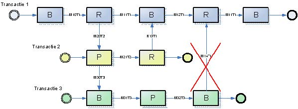{#fig: width="20%"}

De opzet hieronder is juist, de communicatie blijft traceerbaar.

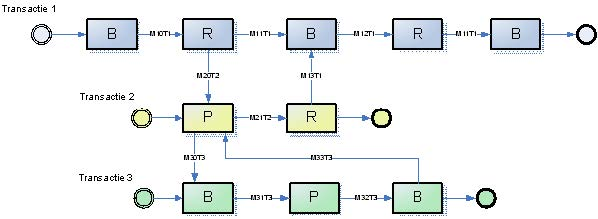{#fig: width="20%"}

Let bij het interpreteren van de schema's op het volgende. De cirkeltjes
aan het begin en het eind geven respectievelijk het begin en het einde
van een transactie aan. De blokjes zijn rollen en de letters in de
blokjes staan voor een specifieke rol. De codes in de pijlen staan voor
MessageTypes. Voor de duidelijkheid is ook de transactie waar de
MessageType toe behoort in de code verwerkt. M31T3 staat dus voor
MessageType 31 uit transactie 3.

### 7. Hoe geeft ik in een raamwerk aan of een bericht een startbericht is, of niet?

Sinds VISI Standaard versie 1.2 kan in een raamwerk een transactie in
cascadevorm aan een andere transactie worden gekoppeld. Deze koppeling
vindt plaats op berichtniveau. Het startbericht van een subtransactie
heeft het bericht uit de hoofdtransactie dan als voorgaande
(='previous'). Bovenstaande definitie conflicteert echter met de
ongeschreven regel dat een bericht zonder voorgaand bericht
(='previous') een startbericht van een transactie is. Welk bericht het
startbericht van een subtransactie is, is niet eenduidig vastgelegd en
is voor bepaalde raamwerken niet te achterhalen.\
\
In de praktijk is gebleken dat dit bijvoorbeeld onduidelijke situaties
oplevert indien een transactie een subtransactie is van meer dan 1
transactie en op een enkel punt naar 2 of meer hoofdtransacties kan
terugkeren. De groengekleurde transactie in figuur 6 hieronder voldoet
aan deze voorwaarden.

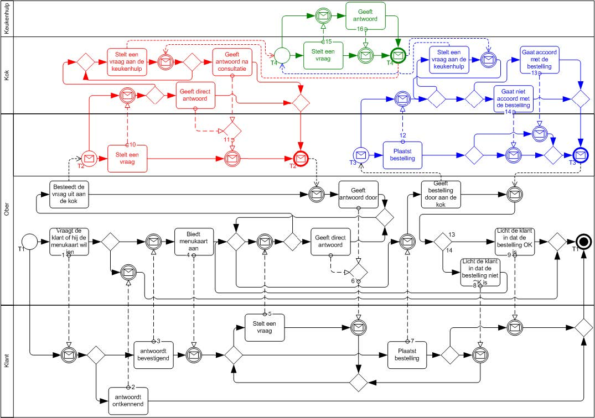{#fig: width="20%"}

Indien in de bovenstaande figuur de communicatie vanaf T1 (zwart) via T2
(rood) naar T4 (groen) is gelopen, en het laatste bericht van T4 (groen)
verstuurd is, is er de keuze om terug te gaan naar T2 (rood) of vooruit
te gaan en een nieuwe subtransactie T3 (blauw) te starten. In dit
voorbeeld is het voor een mens visueel duidelijk te zien dat dit in dit
geval niet de bedoeling is, maar voor software is dit niet mogelijk.\
\
Om dit aan software wel duidelijk te maken, moet er een toevoeging in
het raamwerk komen om aan te geven dat bepaalde berichten wel of niet
een startbericht zijn. In het raamwerk moet dan komen te staan dat T3
(blauw) alleen kan worden gestart vanaf T1 (zwart) en NIET vanaf T4
(groen).\
\
Daartoe zijn de 'Referenties' van de entiteit 'MessageInTransactionType'
in de VISI Systematiek Deel 1 (voorheen Systematiek I) uitgebreid met de
eigenschap 'firstMessage'. Daarmee kan worden aangegeven of een
MessageInTransaction een startbericht betreft.

    ENTITY MessageInTransactionType;
        requiredNotify : INTEGER;
        dateLamu : DATETIME;
        userLamu : STRING;
        received : BOOLEAN;
        send : BOOLEAN;
        state : STRING;
        initiatorToExecutor : OPTIONAL BOOLEAN;
        openSecondaryTransactionsAllowed : OPTIONAL BOOLEAN;
        firstMessage : OPTIONAL BOOLEAN; // <--
        message : MessageType;
        previous : OPTIONAL SET [0:?] O F MessageInTransactionType;
        transaction : TransactionType;
        VISI Pagina 46 van 46
        transactionPhase : OPTIONAL TransactionPhaseType;
        group : GroupType;
    END_ENTITY;

Deze nieuwe eigenschap is een optionele Boolean ('True', of 'False').
Indien deze Boolean afwezig is, geldt de standaard waarde 'False' en kan
er met de betreffende MessageInTransactionType GEEN nieuwe transactie
worden gestart.\
\
Wanneer deze Boolean aanwezig is en de waarde 'True' heeft, kan er met
de MessageInTransactionType wel een nieuwe transactie worden gestart. In
het voorbeeld hierboven dient voor de startberichten van T1, T2, T3 en
T4 deze Boolean dus de waarde 'True' te hebben.\
\
Mocht dit per ongeluk niet zijn ingesteld voor T1 dan mag T1 toch worden
gestart, omdat het startbericht van T1 geen 'previous' heeft. Deze
voorwaarde prevaleert altijd t.o.v. de Boolean.

[^1]: The notation of the VISI interaction map is based on Prof. Dietz
    model. The notation differs from the Business Process Modelling
    Notation (BPMN, a standard for process modelling), on the one hand
    to keep interaction maps as simple as possible and, on the other
    hand, because the concept of 'transaction' is not defined within
    BPMN. The latter is a common, but not an official Open Standard.

[^2]: http://www.crow.nl/nl/VISI/VISI-Systematiek/VISI-Keurmerk-en-Certificaat.html

[^3]: Only alphanumeric characters and spaces are allowed.
    Non-alphanumeric characters must be converted to spaces.

[^4]: https://www.w3.org/TR/soap12-mtom/
