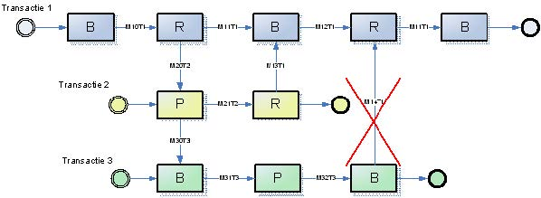
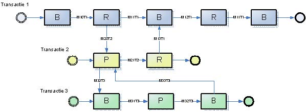
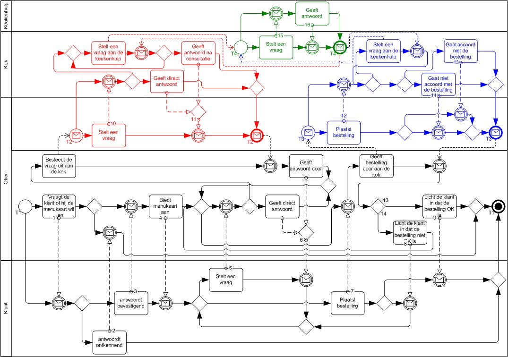

## FAQ
Below are some of the most important, frequently asked questions (‘frequently asked questions’) for the implementation of VISI. The complete (and most recent) list of FAQs can be consulted on the VISI website.

### What is the first MessageType in a TransactionType?}
The first MessageType is the MessageType that has no previous message within a TransactionType.

### What is the last MessageType in a TransactionType?}
The last MessageType within a transactionType is the MessageType that is not referenced by other MessageTypes.

### If a message has been sent in a transaction, is it allowed to send another message?}
Within a transaction, there is always one role to act. It is possible to send messages from another transaction (even if transactions are related to each other). So if a message is sent in a secondary transaction but there is also a MITT in the main transaction that may be sent based on a previous MITT, then this is simply possible.

### How is the DATETIME data type handled when no time zone is specified?}
The DATETIME data type refers to the "xsd:dateTime" definition (Instant of time (Gregorian calendar)).
However, we apply one deviation to this: If no time zone is specified, UTC (=Z or +00:00) is assumed.
UTC is almost equal to Greenwich Mean Time (GMT).
However, GMT is a purely astronomical time. To compensate for the difference caused by the slowing of the Earth's rotation, leap seconds must be used.
The difference is never more than a second and is therefore not important for most applications.

-  The DATETIME datatype describes instances identified by the combination of a date and a time. Its value space is described as a combination of date and time of day in Chapter 5.4 of ISO 8601. Its lexical space is the extended format: `[-]CCYY-MM-DDThh:mm:ss[Z|(+|-)hh:mm]`
-  The time zone may be specified as Z (UTC) or (+|-)hh:mm. Time zones that aren't specified are considered undetermined.
-  Example: Valid values for xsd:dateTime include: 2001-10-26T21:32:52, 2001-10-26T21:32:52+02:00, 2001-10-26T19:32:52Z, 2001-10-26T19:32:52+00:00, -2001-10-26T21:32:52, or 2001-10- 26T21:32:52.12679.


The following values are invalid: 2001-10-26 (all the parts must be specified), 2001-10- 26T21:32 (all the parts must be specified), 2001-10-26T25:32:52+02:00 (the hours part—25—is out of range), or 01-10-26T21:32 (all the parts must be specified).

### If I have promoted a framework and generated a message schema, do I have a guarantee that this framework will work in practice?}
Promoting a framework only guarantees that the framework complies with the systematics and can be read in a VISI compatible software. This does not guarantee that a framework is usable in practice. For example, if the framework builder has not added a complex element to a message, this may not result in a desired situation in practice. This does not alter the fact that the framework is valid according to the systematics.

### If I relate transactions to each other, is the traceability of communication always guaranteed?}
As long as the VISI philosophy is followed, in which transactions always take place between two roles (initiator and executor) and the initiator always receives a message back from the executor, the communication remains traceable. In exceptional situations, however, it is possible to set up frameworks in such a way that traceability can be compromised. To prevent such situations, an example of such an exception is given below and then it is illustrated how it should be according to the VISI philosophy. If more of these types of situations are reported, they will be added to this FAQ.\bigskip

The VISI systematics assumes that a transaction always takes place between two roles. When setting up a framework in which communication takes place over multiple transactions, this must be taken into account. In addition, a process that takes place over three transactions, for example, should also take place over the same transactions (important to keep communication traceable at a later stage). The example below is wrong, it is not wise to set up a framework in such a way.



The setup below is correct, the communication remains traceable.



When interpreting the diagrams, please note the following. The circles at the beginning and end indicate the beginning and end of a transaction respectively. The blocks are roles and the letters in the blocks represent a specific role. The codes in the arrows represent MessageTypes. For clarity, the transaction to which the MessageType belongs is also included in the code. M31T3 therefore stands for MessageType 31 from transaction 3.

### 7. How do I indicate in a framework whether a message is a start message or not?}
Since VISI Standard version 1.2, a transaction can be linked to another transaction in a framework in a cascade form. This link takes place at message level. The start message of a subtransaction then has the message from the main transaction as a previous message (=’previous’). However, the above definition conflicts with the unwritten rule that a message without a previous message (=’previous’) is a start message of a transaction. Which message is the start message of a subtransaction is not clearly defined and cannot be determined for certain frameworks.

In practice, this has shown to lead to unclear situations, for example, if a transaction is a subtransaction of more than 1 transaction and can return to 2 or more main transactions at a single point. The green-colored transaction in figure 6 below meets these conditions.



If in the figure above the communication has gone from T1 (black) via T2 (red) to T4 (green), and the last message from T4 (green) has been sent, there is the choice to go back to T2 (red) or to go forward and start a new subtransaction T3 (blue).
In this example it is visually clear to a human that this is not the intention in this case, but this is not possible for software.\bigskip

In order to make this clear to software, an addition must be made to the framework to indicate whether certain messages are or are not a start message. The framework must then state that T3 (blue) can only be started from T1 (black) and NOT from T4 (green).

To this end, the ‘References’ of the entity ‘MessageInTransactionType’ in the VISI Systematics Part 1 (formerly Systematics I) have been expanded with the property ‘firstMessage’. This can be used to indicate whether a MessageInTransaction is a start message.

```
ENTITY MessageInTransactionType;
requiredNotify : INTEGER;
dateLamu : DATETIME;
userLamu : STRING;
received : BOOLEAN;
send : BOOLEAN;
state : STRING;
initiatorToExecutor : OPTIONAL BOOLEAN;
openSecondaryTransactionsAllowed : OPTIONAL BOOLEAN;
firstMessage : OPTIONAL BOOLEAN; // <--
message : MessageType;
previous : OPTIONAL SET [0:?] O F MessageInTransactionType;
transaction : TransactionType;
VISI Pagina 46 van 46
transactionPhase : OPTIONAL TransactionPhaseType;
group : GroupType;
END_ENTITY;
```

This new property is an optional Boolean (‘True’ or ‘False’). If this Boolean is absent, the default value ‘False’ applies and a new transaction CANNOT be started with the relevant MessageInTransactionType.

If this Boolean is present and has the value ‘True’, a new transaction can be started with the MessageInTransactionType.
In the example above, this Boolean must have the value ‘True’ for the start messages of T1, T2, T3 and T4.\bigskip

If this is accidentally not set for T1, T1 may still be started, because the start message of T1 has no ‘previous’. This condition always prevails over the Boolean.